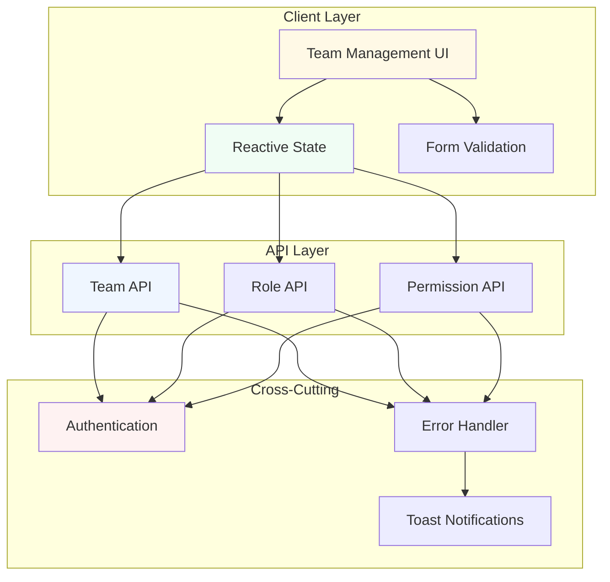

# Design Document

## Overview

The Team Management feature provides a comprehensive administrative interface for managing team members, roles, and permissions within the Nuxt 3 application. The system enables administrators to control access to various modules, maintain team member profiles, and define custom roles with granular permissions.

The design follows a client-side architecture with API integration, leveraging Vue 3 composition API, reactive state management, and the existing design system. The feature integrates with the authentication system to ensure secure access control and uses the established error handling patterns for consistent user experience.

Key capabilities:
- View team statistics and member roster
- Add, update, and delete team members
- Create custom roles with granular permissions
- Assign roles and permissions to team members
- Manage member status and access levels

## Architecture

### System Components



### Technology Stack

- **Frontend Framework**: Nuxt 3 with Vue 3 Composition API
- **State Management**: Vue 3 reactive refs and computed properties
- **UI Components**: Nuxt UI library with custom styled components
- **API Communication**: useApi composable with fetch wrapper
- **Form Validation**: Client-side validation utilities
- **Error Handling**: useErrorHandler and useAppToast composables
- **Routing**: Nuxt file-based routing

### Design Patterns

1. **Composition API Pattern**: All components use Vue 3 Composition API with `<script setup>` syntax
2. **Reactive State Management**: Local component state using `ref()` and `reactive()`
3. **API Integration Pattern**: Centralized API calls through composables with automatic error handling
4. **Modal Pattern**: Reusable modal components for add/edit/delete operations
5. **Loading State Pattern**: Skeleton loaders and disabled states during async operations

## Components and Interfaces

### Page Components

#### 1. Team List Page (`/team/index.vue`)

**Purpose**: Display team statistics and member roster with management actions

**State**:
```typescript
const members = ref<TeamMember[]>([])
const loading = ref(false)
const showAddRoleModal = ref(false)
```

**Key Functions**:
- `fetchMembers()`: Load team member list from API
- `fetchStats()`: Load team statistics from API
- `handleAddRole()`: Process new role creation
- `navigateToEdit()`: Navigate to member edit page
- `handleDelete()`: Delete team member

**UI Sections**:
- Header with title and action buttons
- Statistics cards (Total Members, Active Members, Super Admins, Online Now)
- Team member table with columns: Member, Email, Role, Status, Last Login, Actions
- Add Role modal integration

#### 2. Add Team Member Page (`/team/add.vue`)

**Purpose**: Form to create new team member

**State**:
```typescript
const form = reactive({
  firstName: '',
  lastName: '',
  email: '',
  phone: '',
  role: '',
  status: 'active',
})
```

**Key Functions**:
- `validateForm()`: Client-side form validation
- `handleSubmit()`: Submit new member data to API
- `handleCancel()`: Navigate back to team list

**UI Sections**:
- Personal Information card (first name, last name, email, phone)
- Role & Access card (role selection, status)
- Role Information sidebar (role descriptions)
- Security sidebar (security notes)
- Action buttons (Add Member, Cancel)

#### 3. Edit Team Member Page (`/team/[id]/edit.vue`)

**Purpose**: Form to update existing team member

**State**:
```typescript
const form = reactive({
  firstName: '',
  lastName: '',
  email: '',
  phone: '',
  role: '',
  status: '',
})

const permissions = reactive([
  { key: 'customers', label: 'Manage Customers', checked: false },
  // ... more permissions
])
```

**Key Functions**:
- `loadMember()`: Fetch member data by ID
- `validateForm()`: Client-side form validation
- `handleSubmit()`: Submit updated member data to API
- `handleCancel()`: Navigate back to team list

**UI Sections**:
- Personal Information card
- Role & Access card
- Permissions card (grouped permission checkboxes)
- Role Information sidebar
- Security sidebar
- Action buttons (Save Changes, Cancel)

### Modal Components

#### AddRoleModal Component

**Purpose**: Modal dialog for creating custom roles

**Props**: None

**Emits**:
- `close`: Close modal without saving
- `submit`: Submit new role data

**State**:
```typescript
const form = reactive({
  name: '',
  description: '',
  permissions: [] as string[],
})

const errors = reactive<Record<string, string>>({})
```

**Key Functions**:
- `validate()`: Validate role form data
- `submit()`: Emit submit event with form data
- `togglePermission()`: Toggle individual permission
- `toggleGroup()`: Toggle all permissions in a group
- `isGroupSelected()`: Check if all group permissions are selected
- `isGroupPartial()`: Check if some group permissions are selected

**UI Sections**:
- Header with title and close button
- Role Name input
- Description textarea
- Grouped permission checkboxes with select all functionality
- Footer with Cancel and Create Role buttons

### API Interfaces

#### Team Member API

**Base Path**: `/team/admin`

**Endpoints**:

1. **GET /team/admin/members**
   - Purpose: Fetch all team members
   - Response: `{ members: TeamMember[], total: number }`

2. **GET /team/admin/stats**
   - Purpose: Fetch team statistics
   - Response: `{ totalMembers: number, activeMembers: number, superAdmins: number, onlineNow: number }`

3. **GET /team/admin/members/:id**
   - Purpose: Fetch single team member by ID
   - Response: `TeamMember`

4. **POST /team/admin/members**
   - Purpose: Create new team member
   - Request: `CreateTeamMemberPayload`
   - Response: `TeamMember`

5. **PATCH /team/admin/members/:id**
   - Purpose: Update team member
   - Request: `UpdateTeamMemberPayload`
   - Response: `TeamMember`

6. **DELETE /team/admin/members/:id**
   - Purpose: Delete team member
   - Response: `{ message: string }`

#### Role API

**Base Path**: `/team/admin/roles`

**Endpoints**:

1. **GET /team/admin/roles**
   - Purpose: Fetch all roles
   - Response: `{ roles: Role[] }`

2. **POST /team/admin/roles**
   - Purpose: Create new role
   - Request: `CreateRolePayload`
   - Response: `Role`

#### Permission API

**Base Path**: `/team/admin/permissions`

**Endpoints**:

1. **GET /team/admin/permissions**
   - Purpose: Fetch all available permissions
   - Response: `{ permissions: Permission[] }`

## Data Models

### TeamMember

```typescript
interface TeamMember {
  id: string                    // UUID
  firstName: string
  lastName: string
  email: string
  phone: string
  role: string                  // Role ID or role name
  roleDetails?: {               // Optional nested role object
    id: string
    name: string
    color: string
  }
  status: 'active' | 'inactive'
  permissions: string[]         // Array of permission IDs
  lastLogin: string             // ISO 8601 timestamp
  createdAt: string             // ISO 8601 timestamp
  updatedAt?: string            // ISO 8601 timestamp
}
```

### Role

```typescript
interface Role {
  id: string                    // UUID
  name: string
  description: string
  permissions: string[]         // Array of permission IDs
  color?: string                // Hex color for UI display
  isSystem: boolean             // True for predefined roles
  createdAt: string             // ISO 8601 timestamp
  updatedAt?: string            // ISO 8601 timestamp
}
```

### Permission

```typescript
interface Permission {
  id: string                    // e.g., 'customers.view'
  label: string                 // Display name
  description: string
  module: string                // Group name (e.g., 'Customers')
}
```

### CreateTeamMemberPayload

```typescript
interface CreateTeamMemberPayload {
  firstName: string
  lastName: string
  email: string
  phone: string
  role: string                  // Role ID
  status: 'active' | 'inactive'
}
```

### UpdateTeamMemberPayload

```typescript
interface UpdateTeamMemberPayload {
  firstName?: string
  lastName?: string
  email?: string
  phone?: string
  role?: string                 // Role ID
  status?: 'active' | 'inactive'
  permissions?: string[]        // Array of permission IDs
}
```

### CreateRolePayload

```typescript
interface CreateRolePayload {
  name: string
  description: string
  permissions: string[]         // Array of permission IDs
}
```

### Form Data Models

```typescript
interface TeamMemberForm {
  firstName: string
  lastName: string
  email: string
  phone: string
  role: string
  status: 'active' | 'inactive'
}

interface RoleForm {
  name: string
  description: string
  permissions: string[]
}
```

## Correctness Properties


*A property is a characteristic or behavior that should hold true across all valid executions of a system—essentially, a formal statement about what the system should do. Properties serve as the bridge between human-readable specifications and machine-verifiable correctness guarantees.*

### Property Reflection

After analyzing all acceptance criteria, I identified several areas where properties can be consolidated:

1. **Statistics Display (1.1-1.4)**: All four statistics follow the same pattern - filtering and counting team members by different criteria. These can be combined into a single comprehensive property about statistics accuracy.

2. **Member Display Fields (2.2-2.6, 3.2-3.8)**: All requirements about displaying specific fields can be combined into properties that verify all required fields are present in rendered output.

3. **Validation Rules (4.1-4.6, 5.1-5.4)**: Create and update forms share the same validation rules. These can be tested with a single validation property that applies to both operations.

4. **Error Handling (3.9, 5.15, 6.5)**: Multiple requirements about invalid ID error handling can be combined into one property.

5. **Role and Permission Display (7.2-7.3, 9.3-9.4)**: Similar patterns for displaying role and permission fields can use the same property pattern.

6. **Loading States (1.5, 12.1-12.5)**: Multiple loading state requirements can be consolidated into properties about UI state consistency.

### Property 1: Team Statistics Accuracy

*For any* team member dataset, the displayed statistics (total members, active members, super admins, online members) should match the counts derived from filtering the dataset by the respective criteria.

**Validates: Requirements 1.1, 1.2, 1.3, 1.4**

### Property 2: Team Member List Completeness

*For any* team member dataset, all members in the dataset should appear in the rendered member list.

**Validates: Requirements 2.1**

### Property 3: Member Display Fields Completeness

*For any* team member, the rendered member row should contain all required fields: name, email, role, status, and last login timestamp.

**Validates: Requirements 2.2, 2.3, 2.4, 2.5, 2.6**

### Property 4: Member Detail Fields Completeness

*For any* team member ID that exists in the system, the member detail view should display all required fields: first name, last name, email, phone, role, status, and permissions.

**Validates: Requirements 3.1, 3.2, 3.3, 3.4, 3.5, 3.6, 3.7, 3.8**

### Property 5: Non-Empty Field Validation

*For any* form submission (create or update member), fields marked as required (first name, last name, email, phone, role) should reject empty strings and whitespace-only strings.

**Validates: Requirements 4.1, 4.2, 4.6, 5.1, 5.2**

### Property 6: Email Format Validation

*For any* email string, the validation function should accept only strings matching valid email format (contains @ symbol, has domain part, etc.) and reject all other formats.

**Validates: Requirements 4.3, 5.3**

### Property 7: Email Uniqueness Validation

*For any* new member creation or email update, if the email already exists in the system for a different member, the validation should reject the submission with a duplicate email error.

**Validates: Requirements 4.4**

### Property 8: Phone Format Validation

*For any* phone string, the validation function should accept only strings matching valid phone format and reject all other formats.

**Validates: Requirements 4.5, 5.4**

### Property 9: Member Creation Round Trip

*For any* valid team member form data, creating a member and then retrieving it by ID should return a member with the same field values.

**Validates: Requirements 4.7**

### Property 10: Validation Error Display

*For any* form submission with validation errors, the system should display specific error messages for each invalid field.

**Validates: Requirements 4.10, 5.14, 8.8, 11.3**

### Property 11: Member Update Persistence

*For any* valid update to a team member, all updated fields should be persisted and retrievable in subsequent queries.

**Validates: Requirements 5.5, 5.7, 5.8, 5.9, 5.10, 5.11, 5.12, 5.13**

### Property 12: Member Deletion Removes Record

*For any* team member, after successful deletion, querying for that member by ID should return a not found error.

**Validates: Requirements 6.2, 6.4**

### Property 13: Role List Completeness

*For any* role dataset, all roles in the dataset should appear in the rendered role selection list.

**Validates: Requirements 7.1**

### Property 14: Role Display Fields Completeness

*For any* role, the rendered role option should contain all required fields: name and description.

**Validates: Requirements 7.2, 7.3**

### Property 15: Role Name Validation

*For any* role form submission, the role name field should reject empty strings and whitespace-only strings.

**Validates: Requirements 8.1**

### Property 16: Role Name Uniqueness Validation

*For any* new role creation, if the role name already exists in the system, the validation should reject the submission with a duplicate name error.

**Validates: Requirements 8.2**

### Property 17: Role Permission Validation

*For any* role form submission, if no permissions are selected, the validation should reject the submission with an error indicating at least one permission is required.

**Validates: Requirements 8.3**

### Property 18: Role Creation Round Trip

*For any* valid role form data, creating a role and then retrieving it should return a role with the same name, description, and permissions.

**Validates: Requirements 8.4, 8.6, 8.7**

### Property 19: Permission List Completeness

*For any* permission dataset, all permissions in the dataset should appear in the rendered permission selection interface.

**Validates: Requirements 9.1**

### Property 20: Permission Grouping Consistency

*For any* permission dataset with module assignments, permissions should be grouped by their module field in the rendered interface.

**Validates: Requirements 9.2**

### Property 21: Permission Display Fields Completeness

*For any* permission, the rendered permission option should contain all required fields: name and description.

**Validates: Requirements 9.3, 9.4**

### Property 22: Individual Permission Selection

*For any* permission in the selection interface, toggling that permission should change its selection state without affecting other permissions.

**Validates: Requirements 9.6**

### Property 23: Group Permission Selection

*For any* permission group, toggling the group selection should select or deselect all permissions in that group.

**Validates: Requirements 9.7**

### Property 24: Group Selection State Consistency

*For any* permission group, when all permissions in the group are selected, the group indicator should show fully selected; when some but not all are selected, it should show partially selected; when none are selected, it should show unselected.

**Validates: Requirements 9.8, 9.9**

### Property 25: Form Controls Disabled During Submission

*For any* form in a submitting state, all form controls and action buttons should be disabled.

**Validates: Requirements 12.2, 12.4**

## Error Handling

### Error Categories

1. **Validation Errors**
   - Client-side validation failures
   - Display inline error messages in forms
   - Prevent form submission until resolved
   - Examples: empty required fields, invalid email format, duplicate email

2. **API Errors**
   - 400 Bad Request: Display validation errors in modal/form
   - 401 Unauthorized: Automatic redirect to login (handled by useApi)
   - 403 Forbidden: Display unauthorized error toast
   - 404 Not Found: Display not found error toast
   - 500 Server Error: Display server error toast
   - Network errors: Display network error toast

3. **State Errors**
   - Invalid member ID: Display error message
   - Missing required data: Display error message
   - Concurrent modification: Display conflict error

### Error Handling Strategy

**Client-Side Validation**:
- Validate all form inputs before submission
- Display inline error messages for each invalid field
- Prevent form submission when validation fails
- Clear error messages when user corrects input

**API Error Handling**:
- Use useApi composable for automatic error handling
- 401 errors trigger automatic redirect to login
- 403, 404, 500 errors display error toast via useErrorHandler
- 400 validation errors display in modal/form context
- Network errors display error toast

**Loading States**:
- Display skeleton loaders during initial data fetch
- Disable form controls during submission
- Show loading indicators on action buttons
- Prevent duplicate submissions with disabled state

**User Feedback**:
- Success messages via toast notifications
- Error messages via toast or inline display
- Confirmation dialogs for destructive actions
- Auto-dismiss success toasts after timeout

### Error Recovery

1. **Validation Errors**: User corrects input and resubmits
2. **Network Errors**: User retries operation
3. **Authentication Errors**: User redirected to login
4. **Authorization Errors**: User contacts administrator
5. **Server Errors**: User retries or contacts support

## Testing Strategy

### Dual Testing Approach

The testing strategy employs both unit tests and property-based tests to ensure comprehensive coverage:

- **Unit Tests**: Verify specific examples, edge cases, and error conditions
- **Property Tests**: Verify universal properties across all inputs

Both approaches are complementary and necessary for comprehensive coverage. Unit tests catch concrete bugs in specific scenarios, while property tests verify general correctness across a wide range of inputs.

### Unit Testing

Unit tests should focus on:

1. **Specific Examples**
   - Predefined roles exist (Super Admin, Operations Manager, Finance, Support)
   - Predefined permission groups exist
   - Empty state messages display when lists are empty
   - Confirmation dialogs appear for delete operations
   - Success messages display after operations
   - Loading indicators display during operations

2. **Edge Cases**
   - Empty team member list
   - Empty role list
   - Invalid member ID
   - Duplicate email address
   - Duplicate role name
   - Network errors
   - API failures
   - Server errors

3. **Integration Points**
   - API endpoint integration
   - Authentication flow
   - Authorization checks
   - Toast notification display
   - Modal open/close behavior
   - Navigation between pages

### Property-Based Testing

Property tests should verify universal properties using a property-based testing library (e.g., fast-check for JavaScript/TypeScript):

**Configuration**:
- Minimum 100 iterations per property test
- Each test must reference its design document property
- Tag format: `Feature: team-management, Property {number}: {property_text}`

**Test Implementation**:

1. **Statistics Properties (Property 1)**
   - Generate random team member datasets with various statuses and roles
   - Verify statistics match filtered counts

2. **Display Properties (Properties 2-4, 13-14, 19, 21)**
   - Generate random data objects
   - Verify all required fields appear in rendered output

3. **Validation Properties (Properties 5-8, 15-17)**
   - Generate random strings including valid and invalid formats
   - Verify validation accepts valid inputs and rejects invalid inputs

4. **CRUD Properties (Properties 9, 11, 12, 18)**
   - Generate random valid data
   - Verify create/update/delete operations work correctly
   - Verify round-trip consistency

5. **Permission Properties (Properties 22-24)**
   - Generate random permission datasets and selection states
   - Verify selection logic works correctly

6. **UI State Properties (Property 25)**
   - Generate random form states
   - Verify UI elements are disabled/enabled correctly

**Example Property Test Structure**:

```typescript
import fc from 'fast-check'
import { describe, it, expect } from 'vitest'

describe('Feature: team-management, Property 1: Team Statistics Accuracy', () => {
  it('should display accurate statistics for any team member dataset', () => {
    fc.assert(
      fc.property(
        fc.array(teamMemberArbitrary()),
        (members) => {
          const stats = calculateStats(members)
          
          expect(stats.totalMembers).toBe(members.length)
          expect(stats.activeMembers).toBe(members.filter(m => m.status === 'active').length)
          expect(stats.superAdmins).toBe(members.filter(m => m.role === 'super_admin').length)
          expect(stats.onlineNow).toBe(members.filter(m => m.isOnline).length)
        }
      ),
      { numRuns: 100 }
    )
  })
})
```

### Test Coverage Goals

- **Unit Test Coverage**: 80%+ of component logic
- **Property Test Coverage**: All 25 correctness properties
- **Integration Test Coverage**: Critical user flows (add member, edit member, delete member, create role)
- **E2E Test Coverage**: Complete workflows from login to team management operations

### Testing Tools

- **Unit Testing**: Vitest with Vue Test Utils
- **Property Testing**: fast-check
- **Component Testing**: @nuxt/test-utils
- **E2E Testing**: Playwright or Cypress
- **API Mocking**: MSW (Mock Service Worker)
