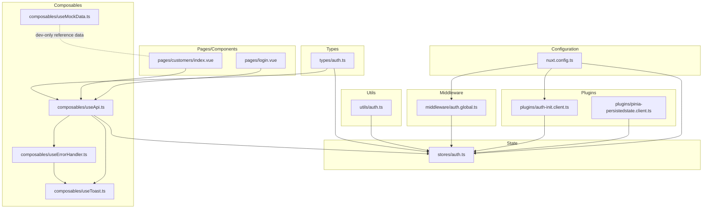
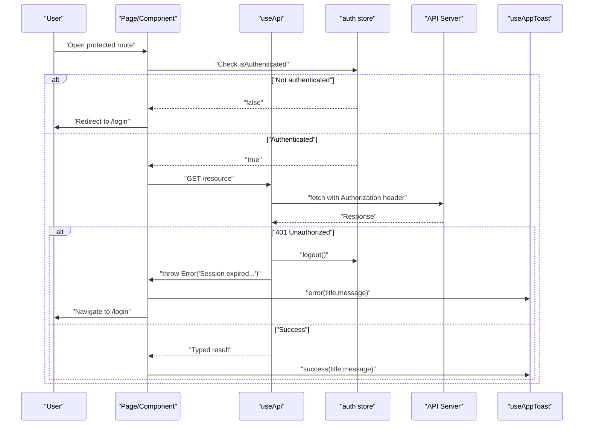
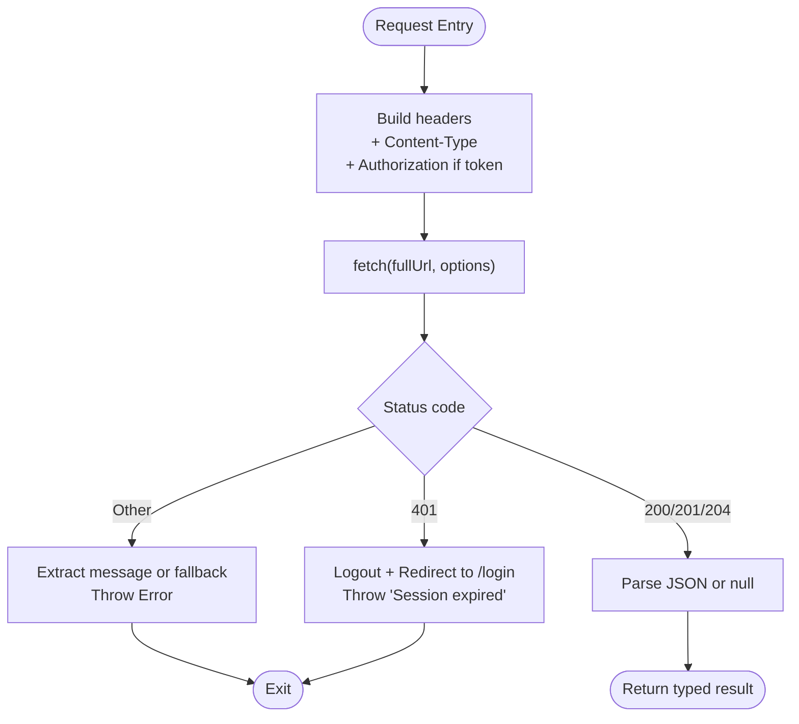
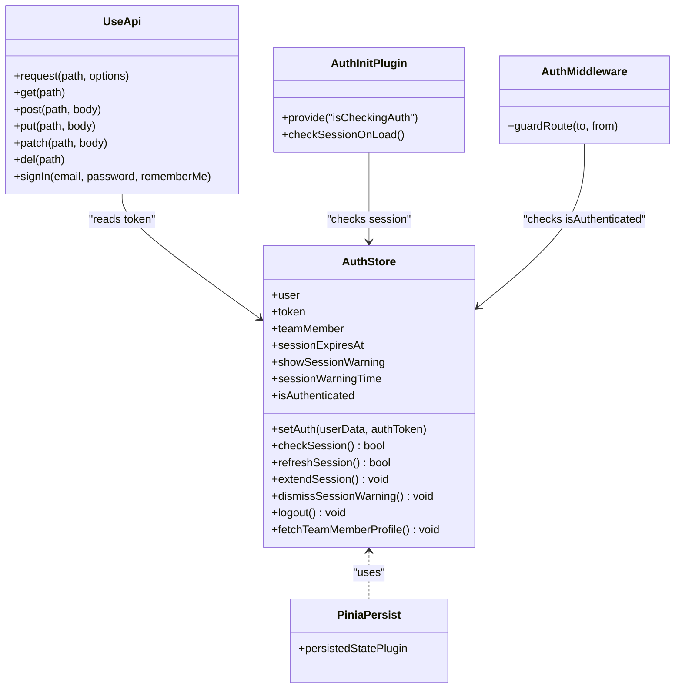
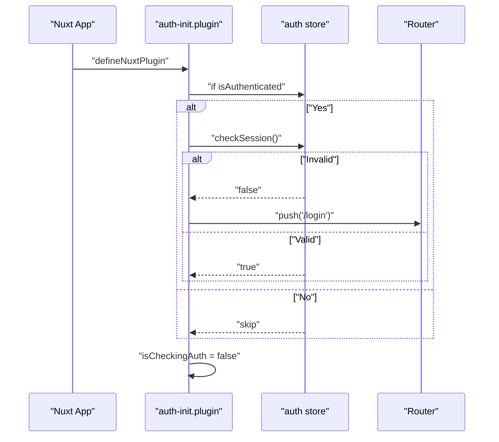
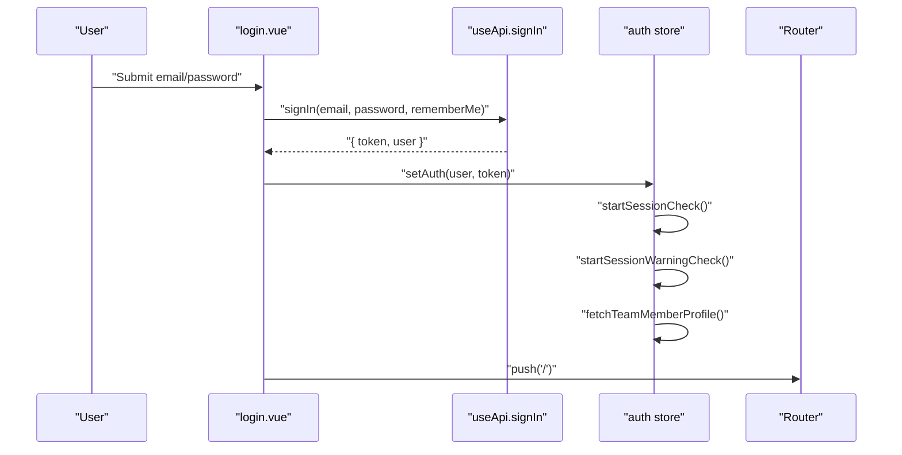
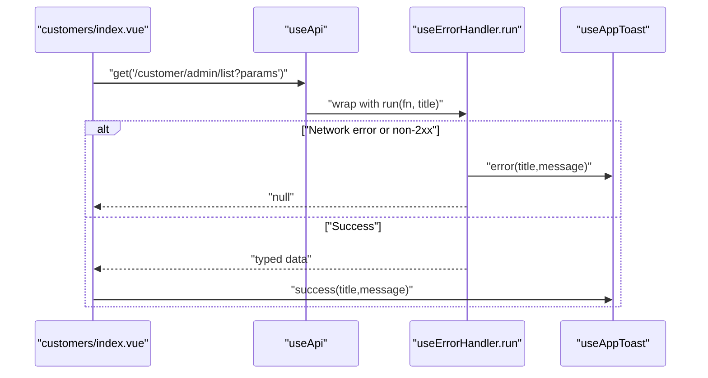
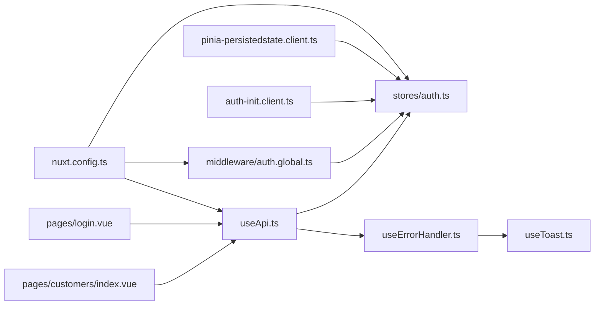

# API Integration & Services

<cite>
**Referenced Files in This Document**
- [useApi.ts](file://app/composables/useApi.ts)
- [useErrorHandler.ts](file://app/composables/useErrorHandler.ts)
- [useMockData.ts](file://app/composables/useMockData.ts)
- [auth-init.client.ts](file://app/plugins/auth-init.client.ts)
- [pinia-persistedstate.client.ts](file://app/plugins/pinia-persistedstate.client.ts)
- [auth.global.ts](file://app/middleware/auth.global.ts)
- [auth.ts](file://app/stores/auth.ts)
- [auth.ts](file://app/utils/auth.ts)
- [auth.ts](file://app/types/auth.ts)
- [nuxt.config.ts](file://nuxt.config.ts)
- [useToast.ts](file://app/composables/useToast.ts)
- [login.vue](file://app/pages/login.vue)
- [customers/index.vue](file://app/pages/customers/index.vue)
</cite>

## Table of Contents
1. [Introduction](#introduction)
2. [Project Structure](#project-structure)
3. [Core Components](#core-components)
4. [Architecture Overview](#architecture-overview)
5. [Detailed Component Analysis](#detailed-component-analysis)
6. [Dependency Analysis](#dependency-analysis)
7. [Performance Considerations](#performance-considerations)
8. [Troubleshooting Guide](#troubleshooting-guide)
9. [Conclusion](#conclusion)
10. [Appendices](#appendices)

## Introduction
This document explains the API integration patterns and service layer implementation across the application. It focuses on:
- A centralized HTTP client with automatic authentication, error handling, and response transformation
- The plugin architecture for initialization and session management
- Service abstraction patterns used throughout pages and components
- Mock data generation for development
- Examples for adding new endpoints, handling errors, and implementing offline capabilities

The goal is to provide a clear mental model and practical guidance for extending the system safely and consistently.

## Project Structure
The API integration spans composables (client and utilities), stores (auth state), plugins (initialization), middleware (route guards), types (contracts), and configuration (runtime base URL). Pages and components consume these abstractions via typed helpers.

**Diagram sources**
- [nuxt.config.ts:21-26](file://nuxt.config.ts#L21-L26)
- [auth-init.client.ts:1-25](file://app/plugins/auth-init.client.ts#L1-L25)
- [pinia-persistedstate.client.ts:1-7](file://app/plugins/pinia-persistedstate.client.ts#L1-L7)
- [auth.global.ts:1-32](file://app/middleware/auth.global.ts#L1-L32)
- [auth.ts](file://app/stores/auth.ts)
- [useApi.ts](file://app/composables/useApi.ts)
- [useErrorHandler.ts](file://app/composables/useErrorHandler.ts)
- [useToast.ts](file://app/composables/useToast.ts)
- [useMockData.ts](file://app/composables/useMockData.ts)
- [auth.ts](file://app/types/auth.ts)
- [auth.ts](file://app/utils/auth.ts)
- [login.vue](file://app/pages/login.vue)
- [customers/index.vue](file://app/pages/customers/index.vue)

**Section sources**
- [nuxt.config.ts:21-26](file://nuxt.config.ts#L21-L26)
- [auth-init.client.ts:1-25](file://app/plugins/auth-init.client.ts#L1-L25)
- [auth.global.ts:1-32](file://app/middleware/auth.global.ts#L1-L32)
- [auth.ts](file://app/stores/auth.ts)
- [useApi.ts](file://app/composables/useApi.ts)
- [useErrorHandler.ts](file://app/composables/useErrorHandler.ts)
- [useToast.ts](file://app/composables/useToast.ts)
- [useMockData.ts](file://app/composables/useMockData.ts)
- [auth.ts](file://app/types/auth.ts)
- [auth.ts](file://app/utils/auth.ts)
- [login.vue](file://app/pages/login.vue)
- [customers/index.vue](file://app/pages/customers/index.vue)

## Core Components
- Centralized HTTP client: useApi composable provides typed get/post/put/patch/delete helpers, automatic Authorization header injection, unified error behavior, and a raw request method for advanced cases.
- Error handling: useErrorHandler wraps async operations, shows toast notifications, and returns null on failure to simplify caller logic.
- Authentication store: auth store manages token, user profile, session checks, warnings, and logout flows; integrates with persisted state.
- Initialization plugin: validates session on app load and exposes a loading flag for UI.
- Route middleware: enforces authentication for protected routes and refreshes sessions on navigation.
- Mock data: shared static datasets for development and feature toggling before backend readiness.
- Configuration: runtime config defines public API base URL and other environment variables.

Key responsibilities and interactions are detailed in subsequent sections.

**Section sources**
- [useApi.ts](file://app/composables/useApi.ts)
- [useErrorHandler.ts](file://app/composables/useErrorHandler.ts)
- [auth.ts](file://app/stores/auth.ts)
- [auth-init.client.ts](file://app/plugins/auth-init.client.ts)
- [auth.global.ts](file://app/middleware/auth.global.ts)
- [useMockData.ts](file://app/composables/useMockData.ts)
- [nuxt.config.ts](file://nuxt.config.ts)

## Architecture Overview
The system follows a layered approach:
- Configuration sets the API base URL at build/runtime.
- Plugins initialize auth state and persistence.
- Middleware protects routes and ensures valid sessions.
- Composables encapsulate networking and UX feedback.
- Stores manage domain state and side effects.
- Pages/components call composables for data access.

**Diagram sources**
- [auth.global.ts:1-32](file://app/middleware/auth.global.ts#L1-L32)
- [auth-init.client.ts:1-25](file://app/plugins/auth-init.client.ts#L1-L25)
- [useApi.ts](file://app/composables/useApi.ts)
- [auth.ts](file://app/stores/auth.ts)
- [useToast.ts](file://app/composables/useToast.ts)

## Detailed Component Analysis

### Centralized HTTP Client (useApi)
Responsibilities:
- Build full URLs using runtime config
- Inject Authorization header when available
- Normalize success status codes (200, 201, 204)
- Parse JSON responses or return null for empty bodies
- Handle 401 by logging out and redirecting
- Provide typed convenience methods (get/post/put/patch/delete)
- Expose a raw request method for custom flows

Error handling strategy:
- Non-success responses throw an Error with a message derived from server payload or fallback text
- 401 triggers logout and redirects to login
- Convenience methods wrap calls with useErrorHandler to show toasts and return null on failure

Response transformation:
- Automatically parses JSON when present
- Returns null for 204-like responses without body

Typical usage patterns:
- Data fetching with auto-toast and null-return on failure
- Mutations with explicit titles for toasts
- Custom flows using raw request for fine-grained control

**Diagram sources**
- [useApi.ts](file://app/composables/useApi.ts)

**Section sources**
- [useApi.ts](file://app/composables/useApi.ts)

### Error Handling Wrapper (useErrorHandler)
Responsibilities:
- Wrap any async function
- Show toast on failure with configurable title and optional message
- Return null on failure to simplify conditional rendering/logic

Usage pattern:
- Call run(() => api.get(...), 'Title') and guard with if (!data)

**Section sources**
- [useErrorHandler.ts](file://app/composables/useErrorHandler.ts)
- [useToast.ts](file://app/composables/useToast.ts)

### Authentication Store (auth store)
Responsibilities:
- Persist token and user profile
- Manage session expiry and periodic checks
- Refresh session and warn users before expiry
- Fetch team member profile and merge permissions into user object
- Provide logout that clears state and notifies server

Integration points:
- Initialized with persisted state via Pinia plugin
- Used by useApi to attach Authorization header
- Used by auth-init plugin and route middleware to validate sessions

**Diagram sources**
- [auth.ts](file://app/stores/auth.ts)
- [pinia-persistedstate.client.ts](file://app/plugins/pinia-persistedstate.client.ts)
- [useApi.ts](file://app/composables/useApi.ts)
- [auth-init.client.ts](file://app/plugins/auth-init.client.ts)
- [auth.global.ts](file://app/middleware/auth.global.ts)

**Section sources**
- [auth.ts](file://app/stores/auth.ts)
- [pinia-persistedstate.client.ts](file://app/plugins/pinia-persistedstate.client.ts)
- [auth-init.client.ts](file://app/plugins/auth-init.client.ts)
- [auth.global.ts](file://app/middleware/auth.global.ts)

### Plugin Architecture and Initialization
- auth-init.client.ts: On app load, if authenticated, validates session and redirects to login if invalid; provides a global isCheckingAuth ref for UI.
- pinia-persistedstate.client.ts: Enables Pinia persistence so auth state survives reloads.

Initialization flow:
- App starts -> plugin runs -> check session -> mark checking complete
- Middleware guards routes -> enforce authentication -> refresh session on navigation

**Diagram sources**
- [auth-init.client.ts](file://app/plugins/auth-init.client.ts)
- [auth.ts](file://app/stores/auth.ts)

**Section sources**
- [auth-init.client.ts](file://app/plugins/auth-init.client.ts)
- [pinia-persistedstate.client.ts](file://app/plugins/pinia-persistedstate.client.ts)

### Authentication Flow Integration
Login page uses the typed signIn helper from useApi, then persists credentials via auth store. After successful sign-in, the store initializes session checks and fetches profile.

**Diagram sources**
- [login.vue](file://app/pages/login.vue)
- [useApi.ts](file://app/composables/useApi.ts)
- [auth.ts](file://app/stores/auth.ts)

**Section sources**
- [login.vue](file://app/pages/login.vue)
- [useApi.ts](file://app/composables/useApi.ts)
- [auth.ts](file://app/stores/auth.ts)

### Service Abstraction Patterns
- Pages and components obtain useApi and useErrorHandler instances and call typed helpers like get/post/patch.
- For list/detail views, pages typically:
  - Set loading flags
  - Call api.get with query parameters
  - Update local reactive state
  - Show toasts on success/failure
- Example: customers listing demonstrates pagination, filtering, and mutation flows (suspend/unsuspend).

**Diagram sources**
- [customers/index.vue](file://app/pages/customers/index.vue)
- [useApi.ts](file://app/composables/useApi.ts)
- [useErrorHandler.ts](file://app/composables/useErrorHandler.ts)
- [useToast.ts](file://app/composables/useToast.ts)

**Section sources**
- [customers/index.vue](file://app/pages/customers/index.vue)
- [useApi.ts](file://app/composables/useApi.ts)
- [useErrorHandler.ts](file://app/composables/useErrorHandler.ts)
- [useToast.ts](file://app/composables/useToast.ts)

### Mock Data Generation for Development
- useMockData provides shared static arrays for zones, trucks, customer types, and subscription plans.
- Designed as a single source of truth for reference data during development; can be swapped for API calls later.

Usage pattern:
- Import useMockData in components/pages to populate dropdowns or lists while backend endpoints are not ready.

**Section sources**
- [useMockData.ts](file://app/composables/useMockData.ts)

### Adding New API Endpoints
Recommended steps:
1. Define TypeScript interfaces for request/response payloads in types/auth.ts or a dedicated types file.
2. Extend useApi with a typed helper if the endpoint is frequently used (e.g., getUsers()).
3. In the page/component:
   - Use api.get/post/patch with appropriate path and body
   - Wrap with useErrorHandler.run to show toasts and handle null results
   - Update local state and show success toasts
4. If the endpoint requires special handling (e.g., file downloads), use the raw request method and handle responses manually.

Example references:
- Sign-in flow: [login.vue](file://app/pages/login.vue)
- Listing and mutations: [customers/index.vue](file://app/pages/customers/index.vue)

**Section sources**
- [auth.ts](file://app/types/auth.ts)
- [useApi.ts](file://app/composables/useApi.ts)
- [login.vue](file://app/pages/login.vue)
- [customers/index.vue](file://app/pages/customers/index.vue)

### Handling Errors
Patterns:
- Automatic toasts via useErrorHandler.run
- Centralized 401 handling in useApi with logout and redirect
- Optional custom messages per operation

Best practices:
- Always pass meaningful titles to run()
- Guard with if (!data) after run()
- For critical flows, catch and display specific messages

**Section sources**
- [useErrorHandler.ts](file://app/composables/useErrorHandler.ts)
- [useApi.ts](file://app/composables/useApi.ts)
- [useToast.ts](file://app/composables/useToast.ts)

### Implementing Offline Capabilities
Conceptual guidance:
- Cache GET responses locally (e.g., IndexedDB or localStorage) keyed by URL and query params
- Serve cached data when network is unavailable and update cache on successful requests
- Queue write operations (POST/PUT/PATCH/DELETE) and retry when connectivity resumes
- Surface offline indicators to users and allow retries

Implementation notes:
- Integrate caching within useApi.request for reads
- Maintain a queue in a store or module for pending writes
- Use navigator.onLine events to trigger retries

[No sources needed since this section provides general guidance]

## Dependency Analysis
High-level dependencies:
- useApi depends on runtime config, auth store, router, and error handler
- auth store depends on runtime config and interacts with server endpoints for session/profile/logout
- Plugins depend on auth store and router
- Middleware depends on auth store and router
- Pages/components depend on composables and stores

**Diagram sources**
- [nuxt.config.ts](file://nuxt.config.ts)
- [useApi.ts](file://app/composables/useApi.ts)
- [auth.ts](file://app/stores/auth.ts)
- [auth.global.ts](file://app/middleware/auth.global.ts)
- [auth-init.client.ts](file://app/plugins/auth-init.client.ts)
- [pinia-persistedstate.client.ts](file://app/plugins/pinia-persistedstate.client.ts)
- [useErrorHandler.ts](file://app/composables/useErrorHandler.ts)
- [useToast.ts](file://app/composables/useToast.ts)
- [login.vue](file://app/pages/login.vue)
- [customers/index.vue](file://app/pages/customers/index.vue)

**Section sources**
- [nuxt.config.ts](file://nuxt.config.ts)
- [useApi.ts](file://app/composables/useApi.ts)
- [auth.ts](file://app/stores/auth.ts)
- [auth.global.ts](file://app/middleware/auth.global.ts)
- [auth-init.client.ts](file://app/plugins/auth-init.client.ts)
- [pinia-persistedstate.client.ts](file://app/plugins/pinia-persistedstate.client.ts)
- [useErrorHandler.ts](file://app/composables/useErrorHandler.ts)
- [useToast.ts](file://app/composables/useToast.ts)
- [login.vue](file://app/pages/login.vue)
- [customers/index.vue](file://app/pages/customers/index.vue)

## Performance Considerations
- Prefer batching where possible and avoid redundant requests by leveraging local state and watchers.
- Use pagination and filters to limit payload sizes.
- Debounce search inputs to reduce request frequency.
- Avoid unnecessary re-renders by keeping data structures minimal and stable.
- Consider caching GET responses for frequently accessed resources.

[No sources needed since this section provides general guidance]

## Troubleshooting Guide
Common issues and resolutions:
- 401 Unauthorized: The client logs out and redirects to login; ensure tokens are persisted and refreshed correctly.
- Network failures: useErrorHandler shows toasts; verify API base URL and connectivity.
- Session expiry warnings: store shows countdown and prompts refresh; extend session or log in again.
- Missing Authorization header: confirm token exists in store before making requests.

Operational tips:
- Inspect console logs emitted by useApi and auth store for request/response details.
- Validate runtime config values for API base URL.
- Use the raw request method for debugging specific endpoints.

**Section sources**
- [useApi.ts](file://app/composables/useApi.ts)
- [auth.ts](file://app/stores/auth.ts)
- [useErrorHandler.ts](file://app/composables/useErrorHandler.ts)
- [nuxt.config.ts](file://nuxt.config.ts)

## Conclusion
The application implements a robust, type-safe API integration layer centered around a reusable HTTP client, consistent error handling, and a well-structured authentication flow. The plugin and middleware layers ensure secure initialization and route protection, while mock data supports rapid development. Following the patterns outlined here will help maintain consistency, reliability, and scalability as new features and endpoints are added.

[No sources needed since this section summarizes without analyzing specific files]

## Appendices

### Reference Utilities and Types
- Role normalization and permission checks: utils/auth.ts
- Auth-related types: types/auth.ts

**Section sources**
- [auth.ts](file://app/utils/auth.ts)
- [auth.ts](file://app/types/auth.ts)