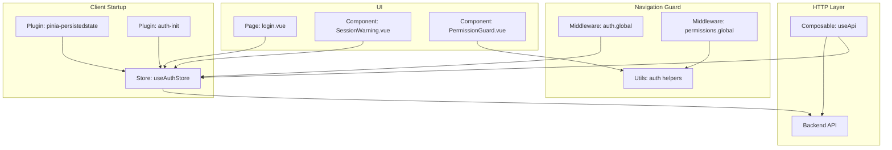
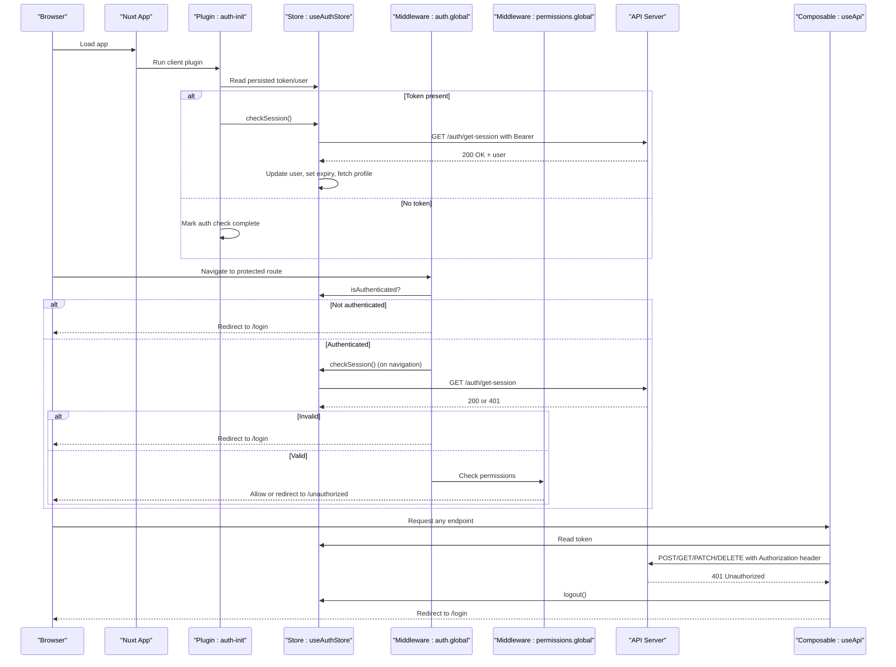
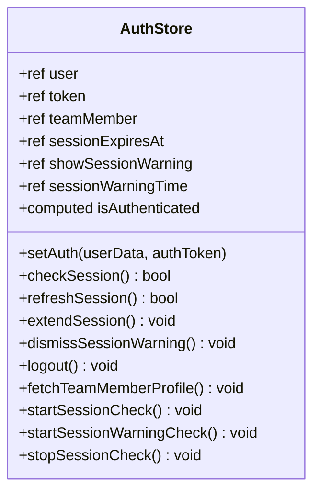
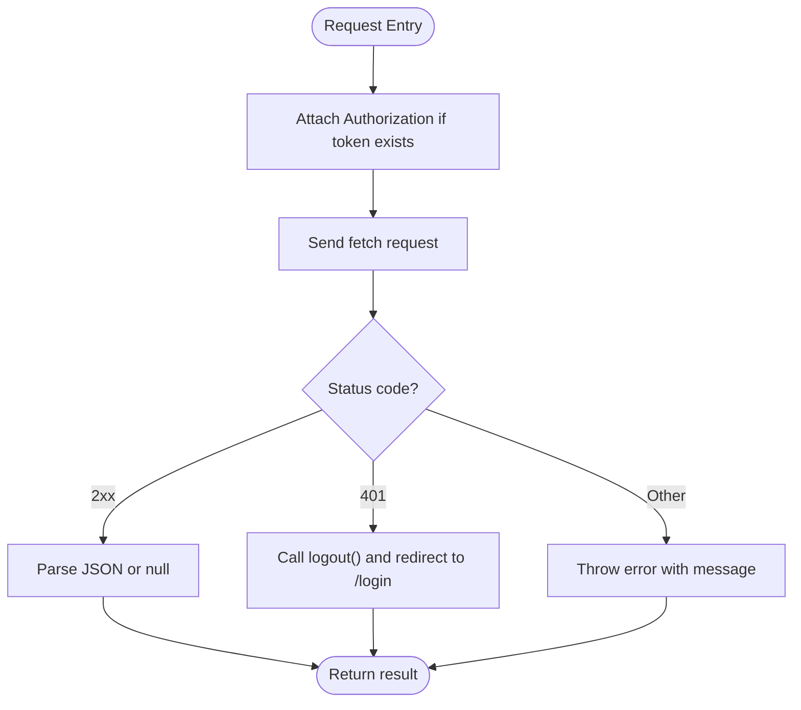
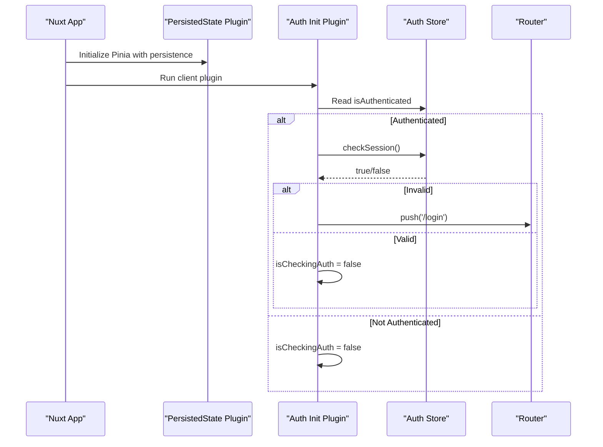
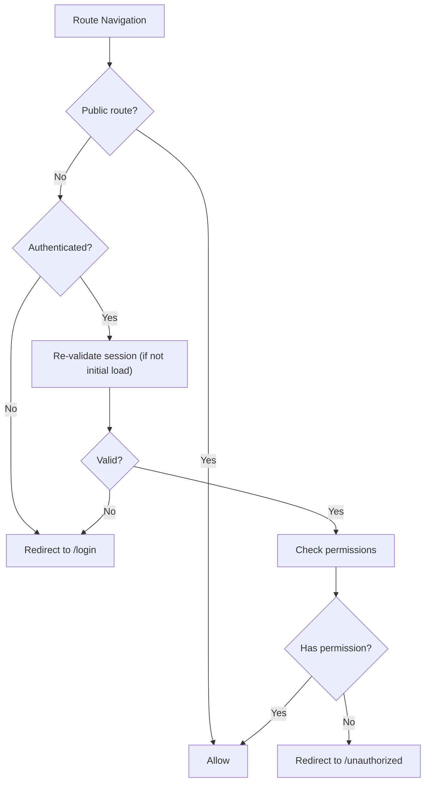
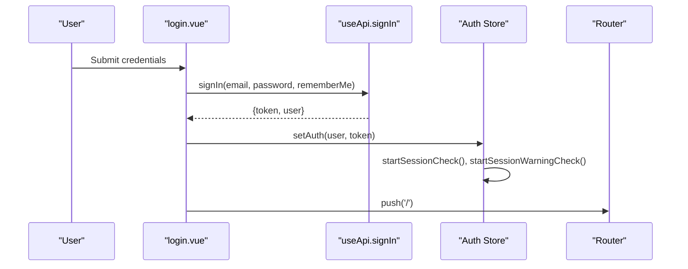
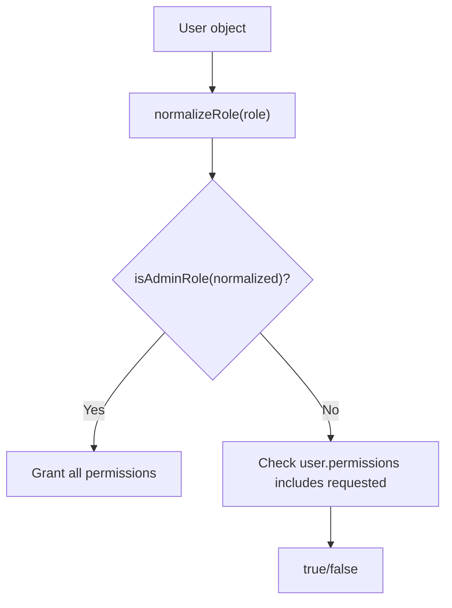
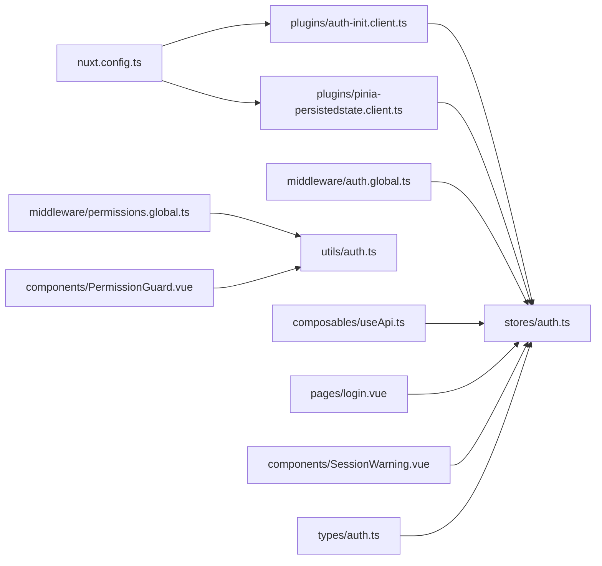

# Authentication Service Integration

<cite>
**Referenced Files in This Document**
- [auth-init.client.ts](file://app/plugins/auth-init.client.ts)
- [pinia-persistedstate.client.ts](file://app/plugins/pinia-persistedstate.client.ts)
- [auth.global.ts](file://app/middleware/auth.global.ts)
- [permissions.global.ts](file://app/middleware/permissions.global.ts)
- [auth.ts](file://app/stores/auth.ts)
- [useApi.ts](file://app/composables/useApi.ts)
- [login.vue](file://app/pages/login.vue)
- [SessionWarning.vue](file://app/components/SessionWarning.vue)
- [PermissionGuard.vue](file://app/components/PermissionGuard.vue)
- [auth.ts](file://app/utils/auth.ts)
- [auth.ts](file://app/types/auth.ts)
- [nuxt.config.ts](file://nuxt.config.ts)
</cite>

## Table of Contents
1. [Introduction](#introduction)
2. [Project Structure](#project-structure)
3. [Core Components](#core-components)
4. [Architecture Overview](#architecture-overview)
5. [Detailed Component Analysis](#detailed-component-analysis)
6. [Dependency Analysis](#dependency-analysis)
7. [Performance Considerations](#performance-considerations)
8. [Troubleshooting Guide](#troubleshooting-guide)
9. [Conclusion](#conclusion)
10. [Appendices](#appendices)

## Introduction
This document explains how the authentication service is integrated into the application, focusing on initialization at client startup, session persistence, token refresh cycles, and the integration between the auth store and HTTP client. It also provides guidance for extending authentication flows, adding custom providers, and implementing token refresh strategies.

## Project Structure
The authentication system spans several layers:
- Plugin layer initializes auth state on client startup and persists Pinia state.
- Middleware enforces authentication and permissions on route navigation.
- Store manages tokens, user data, session timers, and lifecycle hooks.
- HTTP composable injects tokens automatically and handles 401 responses.
- UI components render login forms and session warnings.

**Diagram sources**
- [pinia-persistedstate.client.ts:1-7](file://app/plugins/pinia-persistedstate.client.ts#L1-L7)
- [auth-init.client.ts:1-25](file://app/plugins/auth-init.client.ts#L1-L25)
- [auth.ts:1-230](file://app/stores/auth.ts#L1-L230)
- [auth.global.ts:1-32](file://app/middleware/auth.global.ts#L1-L32)
- [permissions.global.ts:1-59](file://app/middleware/permissions.global.ts#L1-L59)
- [useApi.ts:1-91](file://app/composables/useApi.ts#L1-L91)
- [login.vue:1-167](file://app/pages/login.vue#L1-L167)
- [SessionWarning.vue:1-66](file://app/components/SessionWarning.vue#L1-L66)
- [PermissionGuard.vue:1-38](file://app/components/PermissionGuard.vue#L1-L38)
- [auth.ts:1-58](file://app/utils/auth.ts#L1-L58)

**Section sources**
- [nuxt.config.ts:1-46](file://nuxt.config.ts#L1-L46)

## Core Components
- Auth Store (Pinia): Holds token, user, team member profile, session expiry, and warning flags; implements session validation, refresh, logout, and periodic checks.
- HTTP Composable: Automatically attaches Authorization headers when a token exists and handles 401 by logging out and redirecting.
- Client Plugins: Persist store state across reloads and validate session on app load.
- Global Middleware: Enforce authentication and route-level permissions.
- UI: Login page sets auth state; session warning component prompts users to extend sessions.

Key responsibilities:
- Initialization: Restore persisted state, check session validity, start timers.
- Token injection: Attach Bearer token to all requests via the HTTP composable.
- Session lifecycle: Validate periodically, warn before expiry, auto-logout on expiration.
- Permissions: Route guards and permission checks using normalized roles and permissions.

**Section sources**
- [auth.ts:1-230](file://app/stores/auth.ts#L1-L230)
- [useApi.ts:1-91](file://app/composables/useApi.ts#L1-L91)
- [auth-init.client.ts:1-25](file://app/plugins/auth-init.client.ts#L1-L25)
- [pinia-persistedstate.client.ts:1-7](file://app/plugins/pinia-persistedstate.client.ts#L1-L7)
- [auth.global.ts:1-32](file://app/middleware/auth.global.ts#L1-L32)
- [permissions.global.ts:1-59](file://app/middleware/permissions.global.ts#L1-L59)
- [login.vue:1-167](file://app/pages/login.vue#L1-L167)
- [SessionWarning.vue:1-66](file://app/components/SessionWarning.vue#L1-L66)
- [PermissionGuard.vue:1-38](file://app/components/PermissionGuard.vue#L1-L38)
- [auth.ts:1-58](file://app/utils/auth.ts#L1-L58)
- [auth.ts:1-64](file://app/types/auth.ts#L1-L64)

## Architecture Overview
The authentication flow integrates Nuxt plugins, middleware, Pinia store, and an HTTP composable to provide seamless token management and session control.

**Diagram sources**
- [auth-init.client.ts:1-25](file://app/plugins/auth-init.client.ts#L1-L25)
- [auth.ts:1-230](file://app/stores/auth.ts#L1-L230)
- [auth.global.ts:1-32](file://app/middleware/auth.global.ts#L1-L32)
- [permissions.global.ts:1-59](file://app/middleware/permissions.global.ts#L1-L59)
- [useApi.ts:1-91](file://app/composables/useApi.ts#L1-L91)

## Detailed Component Analysis

### Auth Store: State, Lifecycle, and Timers
The auth store encapsulates all authentication logic:
- State: token, user, teamMember, sessionExpiresAt, showSessionWarning, sessionWarningTime.
- Computed: isAuthenticated based on token presence.
- Methods:
  - setAuth: Sets user/token, schedules session checks, fetches profile.
  - checkSession: Validates session server-side, updates user and expiry, logs out on failure.
  - refreshSession/extendSession: Revalidates session and resets expiry.
  - logout: Clears local state, stops timers, calls sign-out endpoint if token exists.
  - startSessionCheck/startSessionWarningCheck: Periodic intervals for validation and warnings.
  - fetchTeamMemberProfile: Augments user with role and permissions from admin profile.
- Persistence: The store is configured to persist its state across reloads.

**Diagram sources**
- [auth.ts:1-230](file://app/stores/auth.ts#L1-L230)

**Section sources**
- [auth.ts:1-230](file://app/stores/auth.ts#L1-L230)

### HTTP Client Integration: Automatic Token Injection and 401 Handling
The HTTP composable centralizes request behavior:
- Adds Authorization header when token exists.
- Normalizes success codes (200, 201, 204).
- On 401, triggers logout and redirects to login.
- Provides typed helpers for common methods and a signIn helper.

**Diagram sources**
- [useApi.ts:1-91](file://app/composables/useApi.ts#L1-L91)

**Section sources**
- [useApi.ts:1-91](file://app/composables/useApi.ts#L1-L91)

### Client Initialization Flow
On client startup:
- Pinia persisted state plugin restores store values.
- Auth init plugin checks if token exists and validates session.
- If invalid, redirects to login; otherwise marks auth check complete.

**Diagram sources**
- [pinia-persistedstate.client.ts:1-7](file://app/plugins/pinia-persistedstate.client.ts#L1-L7)
- [auth-init.client.ts:1-25](file://app/plugins/auth-init.client.ts#L1-L25)
- [auth.ts:1-230](file://app/stores/auth.ts#L1-L230)

**Section sources**
- [auth-init.client.ts:1-25](file://app/plugins/auth-init.client.ts#L1-L25)
- [pinia-persistedstate.client.ts:1-7](file://app/plugins/pinia-persistedstate.client.ts#L1-L7)
- [auth.ts:1-230](file://app/stores/auth.ts#L1-L230)

### Middleware: Authentication and Permissions
- Authentication middleware:
  - Allows public routes (/login, /forgot-password, /unauthorized, /pay/**).
  - Redirects unauthenticated users to login.
  - On navigation (not initial load), re-validates session.
- Permissions middleware:
  - Skips public routes.
  - Grants access to admins/super admins.
  - Maps routes to required permissions and redirects unauthorized users.

**Diagram sources**
- [auth.global.ts:1-32](file://app/middleware/auth.global.ts#L1-L32)
- [permissions.global.ts:1-59](file://app/middleware/permissions.global.ts#L1-L59)

**Section sources**
- [auth.global.ts:1-32](file://app/middleware/auth.global.ts#L1-L32)
- [permissions.global.ts:1-59](file://app/middleware/permissions.global.ts#L1-L59)

### Login Flow and Session Warning
- Login page:
  - Validates form inputs.
  - Calls signIn helper to obtain token and user.
  - Sets auth state and navigates to home.
- Session warning:
  - Displays countdown and offers Extend Session or Dismiss actions.
  - Extending triggers refreshSession which revalidates and resets expiry.

**Diagram sources**
- [login.vue:1-167](file://app/pages/login.vue#L1-L167)
- [useApi.ts:1-91](file://app/composables/useApi.ts#L1-L91)
- [auth.ts:1-230](file://app/stores/auth.ts#L1-L230)

**Section sources**
- [login.vue:1-167](file://app/pages/login.vue#L1-L167)
- [SessionWarning.vue:1-66](file://app/components/SessionWarning.vue#L1-L66)
- [auth.ts:1-230](file://app/stores/auth.ts#L1-L230)

### Role and Permission Utilities
- Normalize roles to lowercase strings without underscores.
- Admin checks grant implicit full access.
- Permission checks rely on user.permissions array.
- Permission guard component supports single/multiple permission checks and role-based rendering.

**Diagram sources**
- [auth.ts:1-58](file://app/utils/auth.ts#L1-L58)
- [PermissionGuard.vue:1-38](file://app/components/PermissionGuard.vue#L1-L38)

**Section sources**
- [auth.ts:1-58](file://app/utils/auth.ts#L1-L58)
- [PermissionGuard.vue:1-38](file://app/components/PermissionGuard.vue#L1-L38)

## Dependency Analysis
The following diagram shows key dependencies among core files:

**Diagram sources**
- [auth-init.client.ts:1-25](file://app/plugins/auth-init.client.ts#L1-L25)
- [pinia-persistedstate.client.ts:1-7](file://app/plugins/pinia-persistedstate.client.ts#L1-L7)
- [auth.global.ts:1-32](file://app/middleware/auth.global.ts#L1-L32)
- [permissions.global.ts:1-59](file://app/middleware/permissions.global.ts#L1-L59)
- [useApi.ts:1-91](file://app/composables/useApi.ts#L1-L91)
- [login.vue:1-167](file://app/pages/login.vue#L1-L167)
- [SessionWarning.vue:1-66](file://app/components/SessionWarning.vue#L1-L66)
- [PermissionGuard.vue:1-38](file://app/components/PermissionGuard.vue#L1-L38)
- [auth.ts:1-58](file://app/utils/auth.ts#L1-L58)
- [auth.ts:1-64](file://app/types/auth.ts#L1-L64)
- [nuxt.config.ts:1-46](file://nuxt.config.ts#L1-L46)

**Section sources**
- [auth.ts:1-230](file://app/stores/auth.ts#L1-L230)
- [useApi.ts:1-91](file://app/composables/useApi.ts#L1-L91)
- [auth-init.client.ts:1-25](file://app/plugins/auth-init.client.ts#L1-L25)
- [pinia-persistedstate.client.ts:1-7](file://app/plugins/pinia-persistedstate.client.ts#L1-L7)
- [auth.global.ts:1-32](file://app/middleware/auth.global.ts#L1-L32)
- [permissions.global.ts:1-59](file://app/middleware/permissions.global.ts#L1-L59)
- [login.vue:1-167](file://app/pages/login.vue#L1-L167)
- [SessionWarning.vue:1-66](file://app/components/SessionWarning.vue#L1-L66)
- [PermissionGuard.vue:1-38](file://app/components/PermissionGuard.vue#L1-L38)
- [auth.ts:1-58](file://app/utils/auth.ts#L1-L58)
- [auth.ts:1-64](file://app/types/auth.ts#L1-L64)
- [nuxt.config.ts:1-46](file://nuxt.config.ts#L1-L46)

## Performance Considerations
- Session polling:
  - Periodic session checks every 5 minutes and per-second warning checks are implemented. Ensure these intervals align with backend session TTL to avoid unnecessary network calls.
- Token storage:
  - Using persisted state keeps token across reloads but consider secure storage options if sensitive data requires stricter handling.
- Profile fetching:
  - Team member profile is fetched after login and during session validation. Cache results where possible to reduce redundant requests.
- Error handling:
  - Centralized 401 handling prevents repeated failed requests and ensures consistent logout behavior.

[No sources needed since this section provides general guidance]

## Troubleshooting Guide
Common issues and resolutions:
- Persistent 401 errors:
  - Verify that the Authorization header is attached by the HTTP composable and that the token is valid.
  - Confirm that the backend /auth/get-session endpoint responds correctly.
- Redirect loops:
  - Ensure middleware allows public routes and does not re-validate session on initial load unnecessarily.
- Session expiring unexpectedly:
  - Check timer intervals and backend session TTL alignment.
  - Use Extend Session action to trigger refreshSession and reset expiry.
- Permission denied:
  - Confirm user has required permissions or admin role; verify route-to-permission mappings.

**Section sources**
- [useApi.ts:1-91](file://app/composables/useApi.ts#L1-L91)
- [auth.global.ts:1-32](file://app/middleware/auth.global.ts#L1-L32)
- [permissions.global.ts:1-59](file://app/middleware/permissions.global.ts#L1-L59)
- [auth.ts:1-230](file://app/stores/auth.ts#L1-L230)

## Conclusion
The authentication integration leverages Nuxt plugins, global middleware, a centralized Pinia store, and a robust HTTP composable to manage tokens, validate sessions, and enforce permissions. The design provides clear extension points for custom providers and refresh strategies while maintaining a cohesive user experience through proactive session warnings and automatic logout handling.

[No sources needed since this section summarizes without analyzing specific files]

## Appendices

### Extending Authentication Flows
- Adding a custom provider:
  - Implement a new method in the auth store to call your provider’s sign-in endpoint and setAuth with the returned token and user.
  - Optionally add a dedicated composable similar to useApi.signIn for provider-specific flows.
- Custom token refresh strategy:
  - Replace refreshSession logic to call a dedicated refresh endpoint and update token/state accordingly.
  - Integrate refresh attempts transparently in the HTTP composable before retrying failed requests.

[No sources needed since this section provides general guidance]