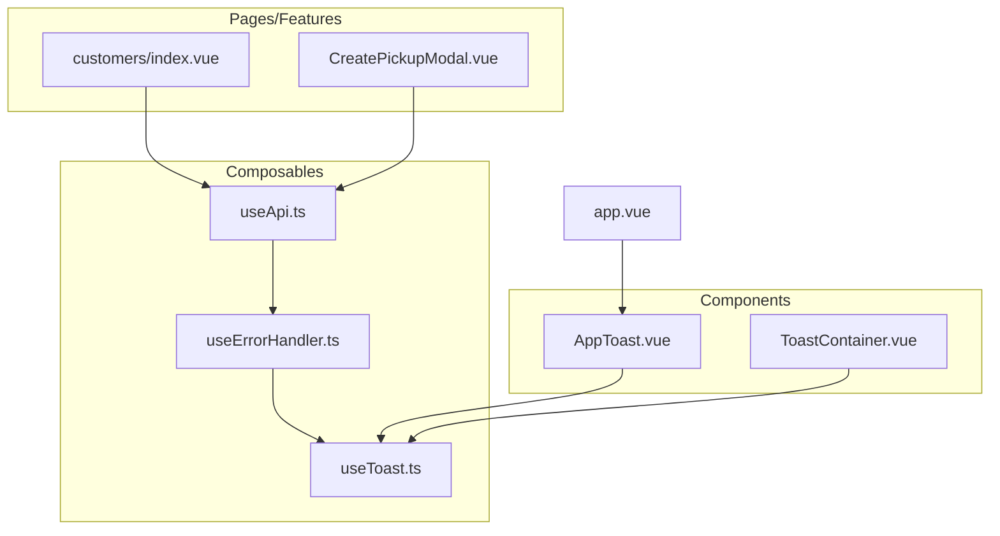
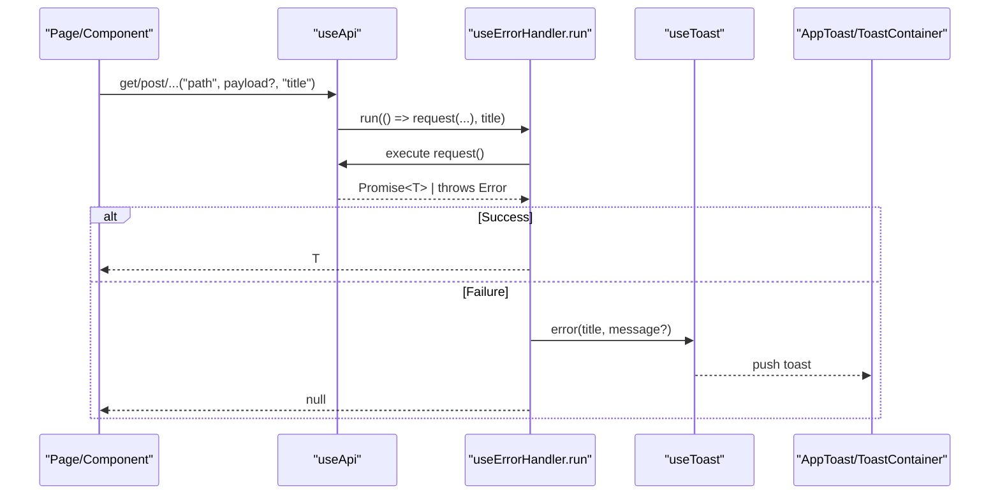
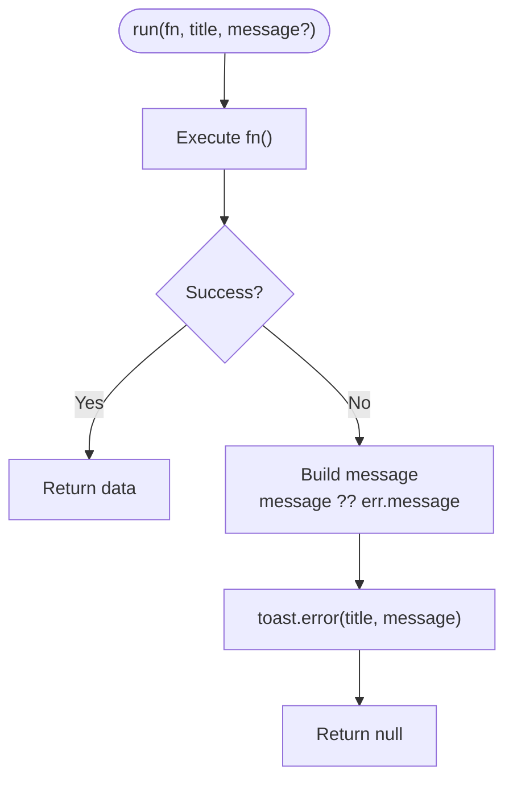
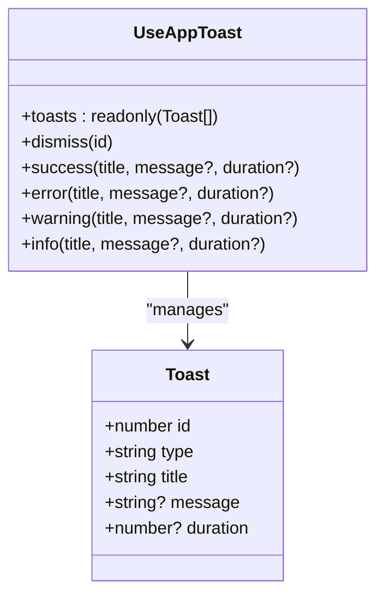
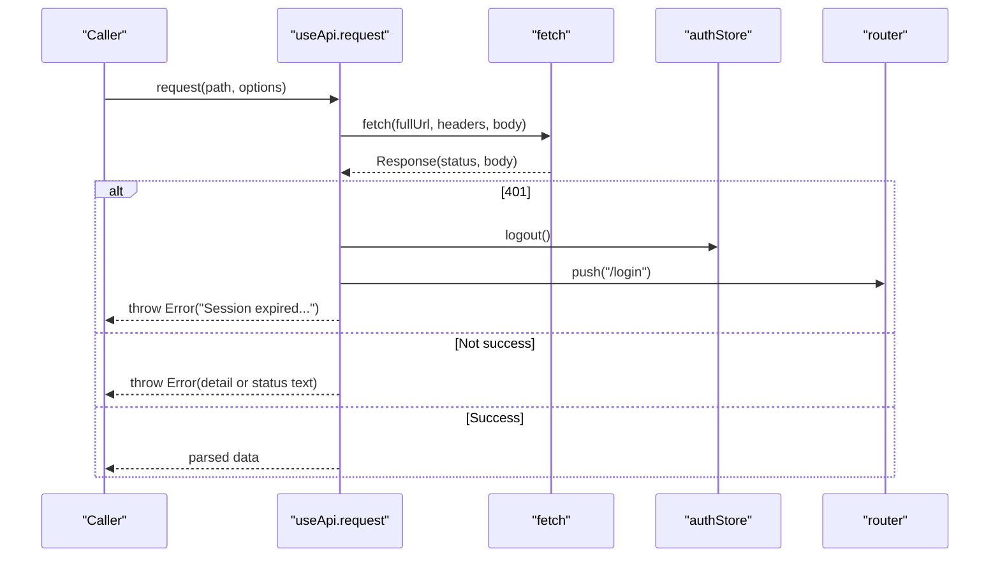
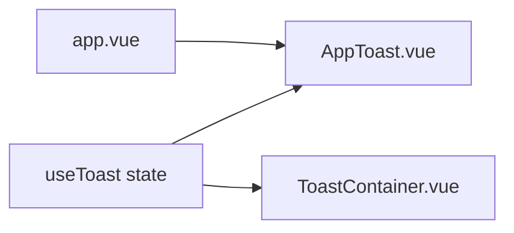
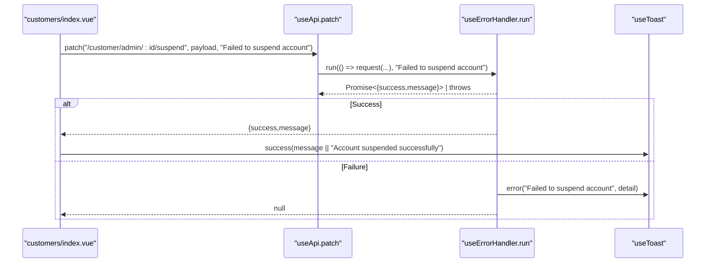
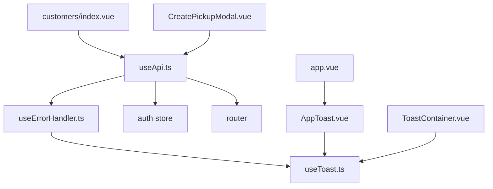

# Error Handling & User Feedback

<cite>
**Referenced Files in This Document**
- [useErrorHandler.ts](file://app/composables/useErrorHandler.ts)
- [useToast.ts](file://app/composables/useToast.ts)
- [AppToast.vue](file://app/components/AppToast.vue)
- [ToastContainer.vue](file://app/components/ToastContainer.vue)
- [useApi.ts](file://app/composables/useApi.ts)
- [customers/index.vue](file://app/pages/customers/index.vue)
- [CreatePickupModal.vue](file://app/components/CreatePickupModal.vue)
- [app.vue](file://app/app.vue)
</cite>

## Table of Contents
1. [Introduction](#introduction)
2. [Project Structure](#project-structure)
3. [Core Components](#core-components)
4. [Architecture Overview](#architecture-overview)
5. [Detailed Component Analysis](#detailed-component-analysis)
6. [Dependency Analysis](#dependency-analysis)
7. [Performance Considerations](#performance-considerations)
8. [Troubleshooting Guide](#troubleshooting-guide)
9. [Conclusion](#conclusion)
10. [Appendices](#appendices)

## Introduction
This document explains the centralized error handling and user feedback system. It focuses on how asynchronous operations are wrapped with consistent error handling, how errors are transformed into user-friendly notifications via toasts, and how errors propagate through the application while keeping business logic separate from presentation concerns. You will learn how to use the useErrorHandler composable, configure toast messages, handle different error types consistently, and implement custom error handlers when needed.

## Project Structure
The error handling system is implemented as a small set of composables and components:
- Composables:
  - useApi: HTTP client that centralizes request/response handling and integrates with error handling.
  - useErrorHandler: Wraps async functions to catch errors and show toast notifications.
  - useToast: Global toast state and helpers for showing success/error/warning/info messages.
- Components:
  - AppToast: Renders toasts at the app root level.
  - ToastContainer: Alternative toast renderer using Teleport and progress bars.
- Application entry:
  - app.vue: Mounts the toast container so notifications are visible globally.

**Diagram sources**
- [useApi.ts:1-91](file://app/composables/useApi.ts#L1-L91)
- [useErrorHandler.ts:1-29](file://app/composables/useErrorHandler.ts#L1-L29)
- [useToast.ts:1-37](file://app/composables/useToast.ts#L1-L37)
- [AppToast.vue:1-115](file://app/components/AppToast.vue#L1-L115)
- [ToastContainer.vue:1-120](file://app/components/ToastContainer.vue#L1-L120)
- [customers/index.vue:1-200](file://app/pages/customers/index.vue#L1-L200)
- [CreatePickupModal.vue:1-200](file://app/components/CreatePickupModal.vue#L1-L200)
- [app.vue:1-33](file://app/app.vue#L1-L33)

**Section sources**
- [useApi.ts:1-91](file://app/composables/useApi.ts#L1-L91)
- [useErrorHandler.ts:1-29](file://app/composables/useErrorHandler.ts#L1-L29)
- [useToast.ts:1-37](file://app/composables/useToast.ts#L1-L37)
- [AppToast.vue:1-115](file://app/components/AppToast.vue#L1-L115)
- [ToastContainer.vue:1-120](file://app/components/ToastContainer.vue#L1-L120)
- [app.vue:1-33](file://app/app.vue#L1-L33)

## Core Components
- useErrorHandler
  - Purpose: Wrap any async operation to automatically catch errors, transform them into user-facing messages, and display a toast notification.
  - Behavior: Returns null on failure; callers can guard with if (!data).
  - Inputs: An async function, an optional error title, and an optional message override.
  - Output: The original result on success or null on failure after showing a toast.
- useToast
  - Purpose: Provide global toast state and methods (success, error, warning, info).
  - State: Reactive list of toasts with id, type, title, optional message, and duration.
  - Methods: show, dismiss, typed shortcuts for each type.
- useApi
  - Purpose: Centralized HTTP client with auth headers, response parsing, and error transformation.
  - Integration: Wrapped methods (get/post/put/patch/del) use useErrorHandler to show toasts on failures and return null.
  - Special cases: 401 triggers logout and redirect; non-success responses throw normalized errors.
- AppToast / ToastContainer
  - Purpose: Render toasts globally with animations and optional progress indicators.
  - Placement: Mounted at the app root to ensure visibility across all pages.

**Section sources**
- [useErrorHandler.ts:1-29](file://app/composables/useErrorHandler.ts#L1-L29)
- [useToast.ts:1-37](file://app/composables/useToast.ts#L1-L37)
- [useApi.ts:1-91](file://app/composables/useApi.ts#L1-L91)
- [AppToast.vue:1-115](file://app/components/AppToast.vue#L1-L115)
- [ToastContainer.vue:1-120](file://app/components/ToastContainer.vue#L1-L120)

## Architecture Overview
The error handling flow spans three layers:
- Business layer (pages/components): Calls API methods with contextual titles.
- API layer (useApi): Normalizes HTTP responses and throws standardized errors.
- Presentation layer (useErrorHandler + useToast): Catches errors, transforms them into user-friendly messages, and displays toasts.

**Diagram sources**
- [useApi.ts:1-91](file://app/composables/useApi.ts#L1-L91)
- [useErrorHandler.ts:1-29](file://app/composables/useErrorHandler.ts#L1-L29)
- [useToast.ts:1-37](file://app/composables/useToast.ts#L1-L37)
- [AppToast.vue:1-115](file://app/components/AppToast.vue#L1-L115)
- [ToastContainer.vue:1-120](file://app/components/ToastContainer.vue#L1-L120)

## Detailed Component Analysis

### useErrorHandler
- Responsibilities:
  - Execute an async function passed by the caller.
  - Catch thrown errors and convert them into a toast notification.
  - Return null on failure to simplify caller-side guards.
- Error transformation:
  - Uses provided errorMessage if available; otherwise falls back to err.message when the caught value is an Error instance.
- Usage pattern:
  - Pages/components call api.get/post/... which internally wrap requests with useErrorHandler.run.
  - Callers check for null to detect failures without try/catch blocks.

**Diagram sources**
- [useErrorHandler.ts:1-29](file://app/composables/useErrorHandler.ts#L1-L29)
- [useToast.ts:1-37](file://app/composables/useToast.ts#L1-L37)

**Section sources**
- [useErrorHandler.ts:1-29](file://app/composables/useErrorHandler.ts#L1-L29)

### useToast
- Responsibilities:
  - Maintain a reactive array of toasts.
  - Provide typed helpers for success, error, warning, and info.
  - Auto-dismiss toasts based on duration.
- Data model:
  - Each toast has id, type, title, optional message, and optional duration.
- Rendering:
  - Consumed by AppToast and ToastContainer to render notifications.

**Diagram sources**
- [useToast.ts:1-37](file://app/composables/useToast.ts#L1-L37)

**Section sources**
- [useToast.ts:1-37](file://app/composables/useToast.ts#L1-L37)

### useApi
- Responsibilities:
  - Build fetch requests with auth headers.
  - Normalize responses: treat 200/201/204 as success; parse JSON; throw normalized errors otherwise.
  - Handle 401 by logging out and redirecting to login.
  - Expose typed helpers (get/post/put/patch/del) that integrate with useErrorHandler.
- Error propagation:
  - Non-success responses throw Error objects with descriptive messages.
  - useErrorHandler catches these and shows toasts; returns null to callers.

**Diagram sources**
- [useApi.ts:1-91](file://app/composables/useApi.ts#L1-L91)

**Section sources**
- [useApi.ts:1-91](file://app/composables/useApi.ts#L1-L91)

### AppToast and ToastContainer
- Responsibilities:
  - Consume the global toast store and render notifications.
  - Provide visual feedback with icons, colors, transitions, and optional progress bars.
- Placement:
  - AppToast is mounted at the app root via app.vue.
  - ToastContainer uses Teleport to render at the document body.

**Diagram sources**
- [useToast.ts:1-37](file://app/composables/useToast.ts#L1-L37)
- [AppToast.vue:1-115](file://app/components/AppToast.vue#L1-L115)
- [ToastContainer.vue:1-120](file://app/components/ToastContainer.vue#L1-L120)
- [app.vue:1-33](file://app/app.vue#L1-L33)

**Section sources**
- [AppToast.vue:1-115](file://app/components/AppToast.vue#L1-L115)
- [ToastContainer.vue:1-120](file://app/components/ToastContainer.vue#L1-L120)
- [app.vue:1-33](file://app/app.vue#L1-L33)

### Usage Examples in Pages and Components
- Customers page:
  - Uses api.patch with a contextual title; on success updates local state and shows a success toast; on failure receives null and avoids further processing.
- Create pickup modal:
  - Uses api.post with a contextual title; on success shows a success toast and emits events; on failure receives null and remains open for correction.

**Diagram sources**
- [customers/index.vue:1-200](file://app/pages/customers/index.vue#L1-L200)
- [useApi.ts:1-91](file://app/composables/useApi.ts#L1-L91)
- [useErrorHandler.ts:1-29](file://app/composables/useErrorHandler.ts#L1-L29)
- [useToast.ts:1-37](file://app/composables/useToast.ts#L1-L37)

**Section sources**
- [customers/index.vue:1-200](file://app/pages/customers/index.vue#L1-L200)
- [CreatePickupModal.vue:1-200](file://app/components/CreatePickupModal.vue#L1-L200)

## Dependency Analysis
- Coupling:
  - useErrorHandler depends on useToast for presentation.
  - useApi depends on useErrorHandler for consistent error handling and on auth/router for session management.
  - Components depend on useApi for data operations and optionally on useToast for direct feedback.
- Cohesion:
  - Each module has a single responsibility: networking, error wrapping, toast state, or rendering.
- External dependencies:
  - Nuxt runtime config for API base URL.
  - Authentication store for token injection and logout.
  - Router for navigation on 401.

**Diagram sources**
- [useErrorHandler.ts:1-29](file://app/composables/useErrorHandler.ts#L1-L29)
- [useToast.ts:1-37](file://app/composables/useToast.ts#L1-L37)
- [useApi.ts:1-91](file://app/composables/useApi.ts#L1-L91)
- [AppToast.vue:1-115](file://app/components/AppToast.vue#L1-L115)
- [ToastContainer.vue:1-120](file://app/components/ToastContainer.vue#L1-L120)
- [customers/index.vue:1-200](file://app/pages/customers/index.vue#L1-L200)
- [CreatePickupModal.vue:1-200](file://app/components/CreatePickupModal.vue#L1-L200)
- [app.vue:1-33](file://app/app.vue#L1-L33)

**Section sources**
- [useApi.ts:1-91](file://app/composables/useApi.ts#L1-L91)
- [useErrorHandler.ts:1-29](file://app/composables/useErrorHandler.ts#L1-L29)
- [useToast.ts:1-37](file://app/composables/useToast.ts#L1-L37)

## Performance Considerations
- Avoid excessive toasts:
  - Prefer contextual titles and concise messages to prevent clutter.
- Duration tuning:
  - Use appropriate durations for critical vs. informational messages.
- Network efficiency:
  - Centralized error handling reduces duplicated try/catch blocks and logging, improving maintainability and reducing overhead.

[No sources needed since this section provides general guidance]

## Troubleshooting Guide
- No toast appears:
  - Ensure the toast component is mounted at the app root (see app.vue).
  - Verify that useToast is used correctly and that the toast duration is not zero.
- Unexpected null results:
  - When using api.get/post/..., a null return indicates an error was caught and a toast was shown. Check the toast for details.
- 401 redirects:
  - On 401, the API logs out and redirects to login. If you see unexpected redirects, verify token presence and server behavior.
- Customizing error messages:
  - Pass a third argument to api methods to override default error titles.
  - For advanced scenarios, use useErrorHandler.run directly to control both title and message.

**Section sources**
- [useApi.ts:1-91](file://app/composables/useApi.ts#L1-L91)
- [useErrorHandler.ts:1-29](file://app/composables/useErrorHandler.ts#L1-L29)
- [useToast.ts:1-37](file://app/composables/useToast.ts#L1-L37)
- [app.vue:1-33](file://app/app.vue#L1-L33)

## Conclusion
The centralized error handling system provides a clean separation between business logic and presentation. useErrorHandler ensures consistent error catching and user feedback, useApi normalizes network errors and handles authentication flows, and useToast plus its renderers deliver clear, actionable notifications. By following the patterns described here, teams can implement robust, user-friendly error handling across the application.

[No sources needed since this section summarizes without analyzing specific files]

## Appendices

### How to Implement Custom Error Handlers
- Use useErrorHandler.run directly:
  - Wrap any async function with run, providing a custom title and optional message.
  - Example usage path: [useErrorHandler.ts:1-29](file://app/composables/useErrorHandler.ts#L1-L29)
- Configure toast messages:
  - Adjust title/message per operation using api method arguments or run parameters.
  - Example usage paths:
    - [customers/index.vue:1-200](file://app/pages/customers/index.vue#L1-L200)
    - [CreatePickupModal.vue:1-200](file://app/components/CreatePickupModal.vue#L1-L200)
- Handle different error types consistently:
  - Rely on useApi to normalize HTTP errors and throw standardized Error objects.
  - Let useErrorHandler transform these into toasts; return null to callers for safe guards.
  - Example usage path: [useApi.ts:1-91](file://app/composables/useApi.ts#L1-L91)

**Section sources**
- [useErrorHandler.ts:1-29](file://app/composables/useErrorHandler.ts#L1-L29)
- [useApi.ts:1-91](file://app/composables/useApi.ts#L1-L91)
- [customers/index.vue:1-200](file://app/pages/customers/index.vue#L1-L200)
- [CreatePickupModal.vue:1-200](file://app/components/CreatePickupModal.vue#L1-L200)