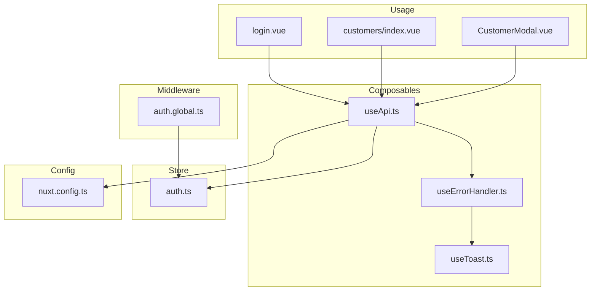
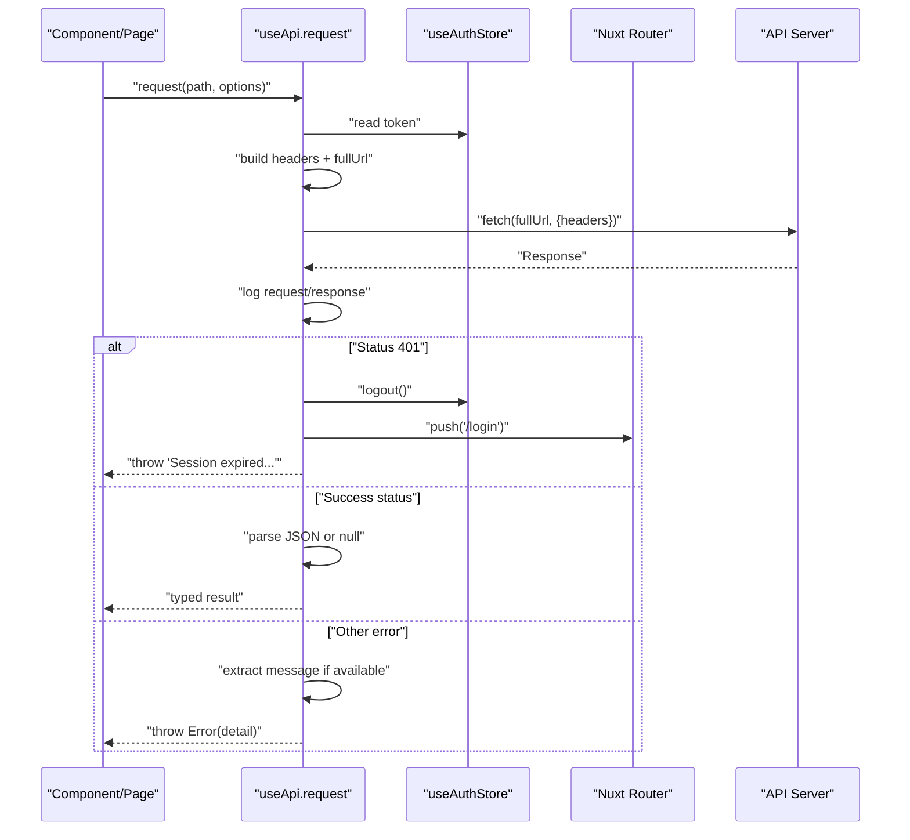
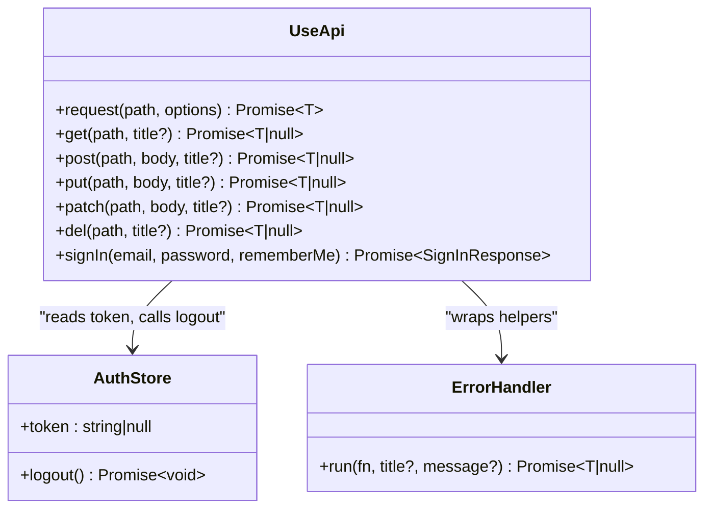
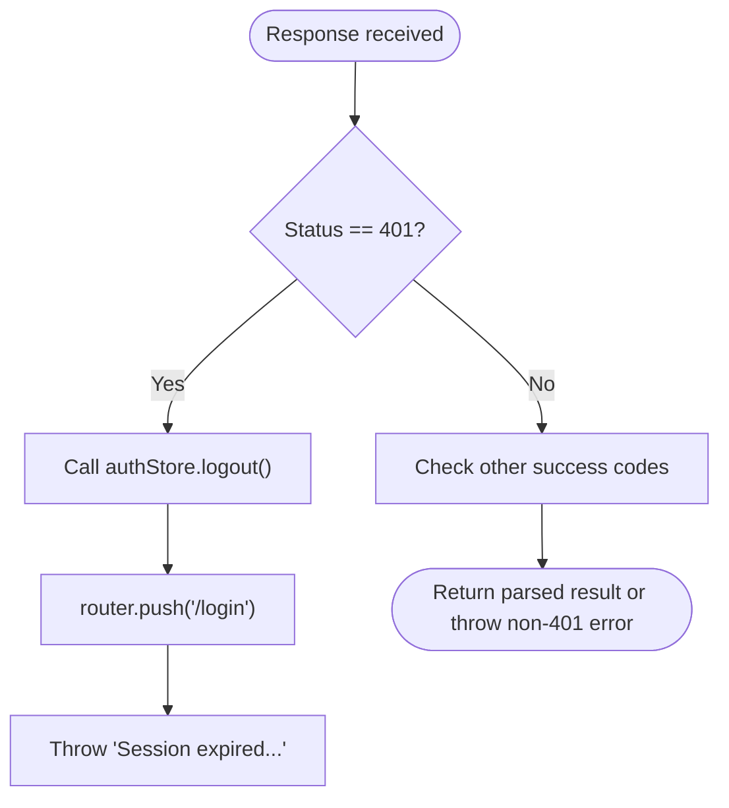
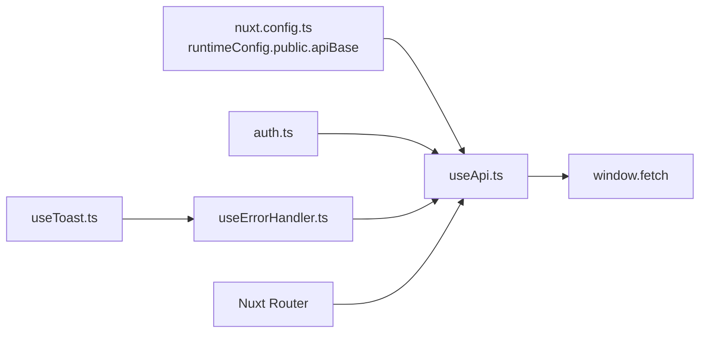

# HTTP Client & Request Handling

<cite>
**Referenced Files in This Document**
- [useApi.ts](file://app/composables/useApi.ts)
- [auth.ts](file://app/stores/auth.ts)
- [auth.global.ts](file://app/middleware/auth.global.ts)
- [nuxt.config.ts](file://nuxt.config.ts)
- [useErrorHandler.ts](file://app/composables/useErrorHandler.ts)
- [useToast.ts](file://app/composables/useToast.ts)
- [login.vue](file://app/pages/login.vue)
- [customers/index.vue](file://app/pages/customers/index.vue)
- [CustomerModal.vue](file://app/components/CustomerModal.vue)
</cite>

## Table of Contents
1. [Introduction](#introduction)
2. [Project Structure](#project-structure)
3. [Core Components](#core-components)
4. [Architecture Overview](#architecture-overview)
5. [Detailed Component Analysis](#detailed-component-analysis)
6. [Dependency Analysis](#dependency-analysis)
7. [Performance Considerations](#performance-considerations)
8. [Troubleshooting Guide](#troubleshooting-guide)
9. [Conclusion](#conclusion)
10. [Appendices](#appendices)

## Introduction
This document explains the centralized HTTP client implementation and its request handling lifecycle. The core is a composable that provides:
- Automatic authentication header injection using a persisted token
- Centralized request/response logging
- Unified error handling with user-facing toasts
- Typed API methods for common HTTP verbs (get, post, put, patch, delete)
- A typed sign-in helper
- A raw request method for advanced scenarios
- Automatic logout and redirect on 401 Unauthorized responses

It also covers URL construction via runtime configuration, response parsing, and how it integrates with the application’s authentication store and global route middleware.

## Project Structure
The HTTP client lives in a single composable and integrates with:
- Runtime configuration for base URLs
- Authentication store for tokens and session management
- Global route middleware for access control
- Error handler composable for toast-based feedback
- Toast composable for user notifications
- Pages and components that call the API

**Diagram sources**
- [useApi.ts:1-91](file://app/composables/useApi.ts#L1-L91)
- [auth.ts:1-230](file://app/stores/auth.ts#L1-L230)
- [auth.global.ts:1-32](file://app/middleware/auth.global.ts#L1-L32)
- [nuxt.config.ts:21-26](file://nuxt.config.ts#L21-L26)
- [useErrorHandler.ts:1-29](file://app/composables/useErrorHandler.ts#L1-L29)
- [useToast.ts:1-37](file://app/composables/useToast.ts#L1-L37)
- [login.vue:48-64](file://app/pages/login.vue#L48-L64)
- [customers/index.vue:86-101](file://app/pages/customers/index.vue#L86-L101)
- [CustomerModal.vue:170-183](file://app/components/CustomerModal.vue#L170-L183)

**Section sources**
- [useApi.ts:1-91](file://app/composables/useApi.ts#L1-L91)
- [auth.ts:1-230](file://app/stores/auth.ts#L1-L230)
- [auth.global.ts:1-32](file://app/middleware/auth.global.ts#L1-L32)
- [nuxt.config.ts:21-26](file://nuxt.config.ts#L21-L26)
- [useErrorHandler.ts:1-29](file://app/composables/useErrorHandler.ts#L1-L29)
- [useToast.ts:1-37](file://app/composables/useToast.ts#L1-L37)
- [login.vue:48-64](file://app/pages/login.vue#L48-L64)
- [customers/index.vue:86-101](file://app/pages/customers/index.vue#L86-L101)
- [CustomerModal.vue:170-183](file://app/components/CustomerModal.vue#L170-L183)

## Core Components
- useApi composable: centralizes fetch calls, injects Authorization headers, logs requests/responses, handles 401 by logging out and redirecting, parses JSON responses, and exposes typed helpers for get/post/put/patch/delete plus signIn and a raw request method.
- useErrorHandler composable: wraps async operations to show toasts on failure and return null for safe guards.
- useAuthStore: persists token, manages sessions, and provides logout which clears state and navigates when needed.
- Global auth middleware: enforces authentication for protected routes and validates sessions during navigation.
- Runtime config: defines public.apiBase used to build full URLs.

Key responsibilities:
- Authentication header injection from auth store
- Centralized logging for debugging
- Standardized success/error behavior
- Consistent user feedback via toasts
- Safe typed usage across pages and components

**Section sources**
- [useApi.ts:1-91](file://app/composables/useApi.ts#L1-L91)
- [useErrorHandler.ts:1-29](file://app/composables/useErrorHandler.ts#L1-L29)
- [auth.ts:1-230](file://app/stores/auth.ts#L1-L230)
- [auth.global.ts:1-32](file://app/middleware/auth.global.ts#L1-L32)
- [nuxt.config.ts:21-26](file://nuxt.config.ts#L21-L26)

## Architecture Overview
The HTTP client composable sits at the center of data fetching. It uses runtime configuration to construct absolute URLs, reads the current token from the auth store, attaches the Authorization header, performs fetch, and then applies standardized error handling and response parsing.

**Diagram sources**
- [useApi.ts:9-67](file://app/composables/useApi.ts#L9-L67)
- [auth.ts:176-201](file://app/stores/auth.ts#L176-L201)
- [nuxt.config.ts:21-26](file://nuxt.config.ts#L21-L26)

## Detailed Component Analysis

### useApi Composable
Responsibilities:
- Build default headers and merge provided ones
- Inject Authorization header when token exists
- Construct full URL using runtime config
- Log request and response metadata
- Handle 401 by calling logout and redirecting to login
- Treat 200/201/204 as success; otherwise throw an error with server message if present
- Parse JSON body when present; return null for empty bodies
- Expose typed helpers: get, post, put, patch, del, signIn, and raw request

Request lifecycle:
1. Merge headers and attach Bearer token if available
2. Concatenate apiBase with path
3. Perform fetch
4. Log response details
5. If 401: logout and navigate to /login, then throw
6. If not success: attempt to read JSON message and throw
7. Otherwise parse text into JSON or null and return

Typed helpers:
- get<T>(path, title?): returns T | null (null on error after toast)
- post<T>(path, body, title?)
- put<T>(path, body, title?)
- patch<T>(path, body, title?)
- del<T>(path, title?)
- signIn(email, password, rememberMe): returns SignInResponse
- request<T>(path, options): raw method for custom scenarios

Error integration:
- Helpers wrap the underlying request with useErrorHandler.run to display toasts and return null on failure.

**Section sources**
- [useApi.ts:1-91](file://app/composables/useApi.ts#L1-L91)
- [useErrorHandler.ts:1-29](file://app/composables/useErrorHandler.ts#L1-L29)

#### Class-like structure of useApi

**Diagram sources**
- [useApi.ts:1-91](file://app/composables/useApi.ts#L1-L91)
- [auth.ts:176-201](file://app/stores/auth.ts#L176-L201)
- [useErrorHandler.ts:1-29](file://app/composables/useErrorHandler.ts#L1-L29)

### Authentication Store Integration
- Token persistence: token is stored in reactive state and persisted across reloads.
- Session checks: periodic checks refresh session and update expiry; invalid sessions trigger logout.
- Logout flow: clears token and related state, optionally calls server sign-out endpoint.

Integration points:
- useApi reads token to set Authorization header
- On 401, useApi triggers logout and redirects to login
- Middleware ensures only authenticated users can access protected routes

**Section sources**
- [auth.ts:1-230](file://app/stores/auth.ts#L1-L230)
- [auth.global.ts:1-32](file://app/middleware/auth.global.ts#L1-L32)
- [useApi.ts:39-44](file://app/composables/useApi.ts#L39-L44)

### Runtime Configuration and URL Construction
- Base URL is configured via runtimeConfig.public.apiBase
- Full URL is built by concatenating apiBase with the relative path passed to request
- This allows environment-specific endpoints without changing code

**Section sources**
- [nuxt.config.ts:21-26](file://nuxt.config.ts#L21-L26)
- [useApi.ts:19](file://app/composables/useApi.ts#L19)

### Response Parsing and Success Criteria
- Success statuses: 200, 201, 204 are treated as successful
- Non-success responses attempt to extract a message field from JSON and throw an error with that message
- Successful responses parse JSON body; if no body, returns null

**Section sources**
- [useApi.ts:46-66](file://app/composables/useApi.ts#L46-L66)

### 401 Unauthorized Handling Flow
When the server responds with 401:
- The client logs the event
- Calls logout to clear local state
- Redirects the user to the login page
- Throws an error indicating session expiration

**Diagram sources**
- [useApi.ts:39-44](file://app/composables/useApi.ts#L39-L44)
- [auth.ts:176-201](file://app/stores/auth.ts#L176-L201)

### Usage Examples

#### Making authenticated GET requests
- Example pattern: call api.get with a typed return type and optional toast title
- Typical usage includes building query parameters and updating local lists on success

**Section sources**
- [customers/index.vue:86-101](file://app/pages/customers/index.vue#L86-L101)

#### Creating resources with POST
- Example pattern: call api.post with payload and toast title
- On success, show a success toast and emit events or refresh lists

**Section sources**
- [CustomerModal.vue:170-183](file://app/components/CustomerModal.vue#L170-L183)

#### Updating resources with PATCH
- Example pattern: call api.patch with resource ID and updated fields
- Update local state based on returned message or flags

**Section sources**
- [customers/index.vue:33-46](file://app/pages/customers/index.vue#L33-L46)

#### Deleting resources with DELETE
- Example pattern: call api.del with resource identifier and toast title
- Remove item from local list on success

**Section sources**
- [management/zones.vue:124-126](file://app/pages/management/zones.vue#L124-L126)

#### Using the raw request method
- For custom scenarios where you need to handle errors yourself or pass additional fetch options, use api.request directly
- This bypasses automatic toast wrapping and returns the typed result or throws

**Section sources**
- [useApi.ts:87-88](file://app/composables/useApi.ts#L87-L88)

#### Signing in with the typed helper
- The signIn helper posts credentials to the sign-in endpoint and returns a typed response containing token and user
- After receiving the response, set auth state and navigate to the dashboard

**Section sources**
- [useApi.ts:82-86](file://app/composables/useApi.ts#L82-L86)
- [login.vue:48-64](file://app/pages/login.vue#L48-L64)

## Dependency Analysis
The HTTP client depends on several modules:
- Runtime config for base URL
- Auth store for token and logout
- Error handler for toast integration
- Router for navigation on 401
- Fetch API for network requests

**Diagram sources**
- [nuxt.config.ts:21-26](file://nuxt.config.ts#L21-L26)
- [useApi.ts:1-91](file://app/composables/useApi.ts#L1-L91)
- [auth.ts:1-230](file://app/stores/auth.ts#L1-L230)
- [useErrorHandler.ts:1-29](file://app/composables/useErrorHandler.ts#L1-L29)
- [useToast.ts:1-37](file://app/composables/useToast.ts#L1-L37)

**Section sources**
- [useApi.ts:1-91](file://app/composables/useApi.ts#L1-L91)
- [auth.ts:1-230](file://app/stores/auth.ts#L1-L230)
- [useErrorHandler.ts:1-29](file://app/composables/useErrorHandler.ts#L1-L29)
- [useToast.ts:1-37](file://app/composables/useToast.ts#L1-L37)
- [nuxt.config.ts:21-26](file://nuxt.config.ts#L21-L26)

## Performance Considerations
- Logging overhead: console.log statements are used for request/response metadata. In production builds, consider gating these logs behind a feature flag or environment variable to reduce I/O.
- JSON parsing: All successful responses are parsed as JSON even when small payloads are expected. For large datasets, ensure the server returns minimal necessary fields.
- Token presence check: The Authorization header is added conditionally; this avoids unnecessary header writes when unauthenticated.
- Error extraction: Non-success responses attempt to parse JSON once before throwing. Avoid sending large error payloads to minimize parsing cost.

[No sources needed since this section provides general guidance]

## Troubleshooting Guide
Common issues and resolutions:
- Requests fail with 401 unexpectedly
  - Ensure the token is present in the auth store before making requests
  - Verify the server accepts the Bearer token format
  - Confirm that the runtime config base URL matches the deployed API
- No toast appears on failures
  - Ensure you are using the typed helpers (get/post/put/patch/del) which integrate with useErrorHandler
  - For raw request usage, implement your own error handling and toast display
- Redirected to login unexpectedly
  - A 401 response triggers logout and redirect; confirm the server does not return 401 for valid requests
  - Check session validity and expiration logic in the auth store

**Section sources**
- [useApi.ts:39-58](file://app/composables/useApi.ts#L39-L58)
- [useErrorHandler.ts:10-25](file://app/composables/useErrorHandler.ts#L10-L25)
- [auth.ts:176-201](file://app/stores/auth.ts#L176-L201)

## Conclusion
The centralized HTTP client provides a consistent, secure, and developer-friendly way to interact with the backend. It automates authentication header injection, standardizes error handling with user feedback, and offers typed helpers for all common HTTP methods. The 401 handling ensures users are promptly redirected to log in when their session expires. By leveraging runtime configuration, the client remains flexible across environments.

[No sources needed since this section summarizes without analyzing specific files]

## Appendices

### API Methods Summary
- get<T>(path, title?): perform GET request with optional toast title
- post<T>(path, body, title?): perform POST request with JSON body
- put<T>(path, body, title?): perform PUT request with JSON body
- patch<T>(path, body, title?): perform PATCH request with JSON body
- del<T>(path, title?): perform DELETE request
- signIn(email, password, rememberMe): authenticate and return token and user
- request<T>(path, options): raw fetch wrapper for advanced cases

**Section sources**
- [useApi.ts:69-89](file://app/composables/useApi.ts#L69-L89)