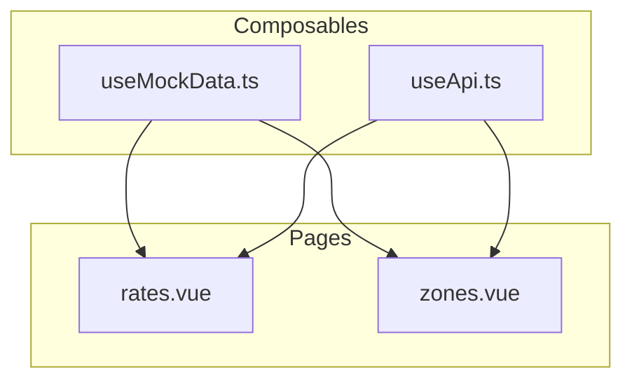
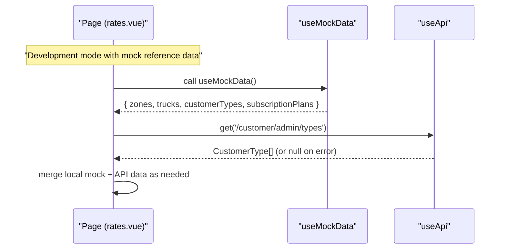
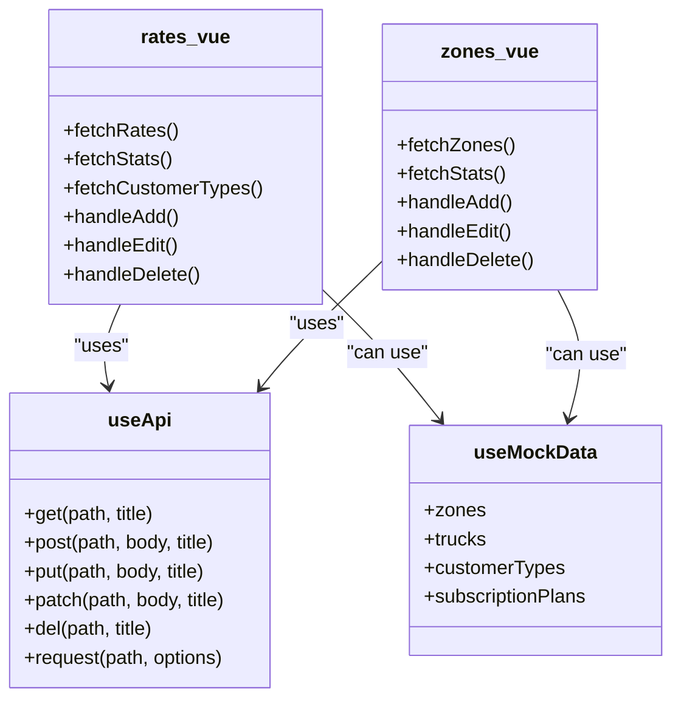

# Mock Data & Development Utilities

<cite>
**Referenced Files in This Document**
- [useMockData.ts](file://app/composables/useMockData.ts)
- [useApi.ts](file://app/composables/useApi.ts)
- [rates.vue](file://app/pages/management/rates.vue)
- [zones.vue](file://app/pages/management/zones.vue)
</cite>

## Table of Contents
1. [Introduction](#introduction)
2. [Project Structure](#project-structure)
3. [Core Components](#core-components)
4. [Architecture Overview](#architecture-overview)
5. [Detailed Component Analysis](#detailed-component-analysis)
6. [Dependency Analysis](#dependency-analysis)
7. [Performance Considerations](#performance-considerations)
8. [Troubleshooting Guide](#troubleshooting-guide)
9. [Conclusion](#conclusion)
10. [Appendices](#appendices)

## Introduction
This document explains the mock data generation system used during development and testing. It focuses on the useMockData composable that provides realistic sample reference data for components when backend services are unavailable, and shows how to integrate it with the existing API layer (useApi). You will learn how to:
- Generate mock data for different entities
- Simulate network delays
- Create test scenarios
- Integrate mock data into components
- Switch between real and mock APIs
- Create custom mock generators for new data types

## Project Structure
The mock data system is implemented as a small, focused composable that exposes shared reference datasets. Pages and components consume this data alongside or instead of live API calls via useApi.

**Diagram sources**
- [useMockData.ts](file://app/composables/useMockData.ts)
- [useApi.ts](file://app/composables/useApi.ts)
- [rates.vue](file://app/pages/management/rates.vue)
- [zones.vue](file://app/pages/management/zones.vue)

**Section sources**
- [useMockData.ts](file://app/composables/useMockData.ts)
- [useApi.ts](file://app/composables/useApi.ts)
- [rates.vue](file://app/pages/management/rates.vue)
- [zones.vue](file://app/pages/management/zones.vue)

## Core Components
- useMockData: Provides static, module-level arrays for zones, trucks, customerTypes, and subscriptionPlans. These are singletons so all consumers share the same dataset.
- useApi: Centralized HTTP client wrapper with typed helpers and error handling. Used by pages to fetch live data.

Key responsibilities:
- useMockData: Supply deterministic reference data for UI and tests.
- useApi: Perform authenticated requests, handle errors, and return typed results.

Usage patterns:
- Reference data (e.g., dropdowns) can be sourced from useMockData while business lists come from useApi.
- For full offline dev mode, replace API calls with useMockData responses.

**Section sources**
- [useMockData.ts](file://app/composables/useMockData.ts)
- [useApi.ts](file://app/composables/useApi.ts)

## Architecture Overview
The architecture separates concerns:
- Data source layer: useMockData (static) vs. useApi (live)
- Page layer: orchestrates fetching and state management
- UI layer: renders data and handles user interactions

**Diagram sources**
- [useMockData.ts](file://app/composables/useMockData.ts)
- [useApi.ts](file://app/composables/useApi.ts)
- [rates.vue](file://app/pages/management/rates.vue)

## Detailed Component Analysis

### useMockData Composable
Purpose:
- Provide consistent, reusable reference datasets across the app.
- Serve as a single source of truth for static options like zones, trucks, customer types, and subscription plans.

Design highlights:
- Module-level singleton arrays ensure shared state across multiple callers.
- Exposes a simple function returning an object with all datasets.
- Interfaces define the shape of each entity for type safety.

How to extend:
- Add a new interface for your entity.
- Define a module-level array with sample items.
- Include the new array in the returned object from useMockData.

Integration example (conceptual):
- In a page, import useMockData and assign its outputs to component refs for dropdowns or filters.
- Keep API-driven lists separate; combine them where necessary.

**Section sources**
- [useMockData.ts](file://app/composables/useMockData.ts)

### useApi Client
Purpose:
- Centralize HTTP requests, authentication headers, and error handling.
- Provide typed convenience methods (get, post, put, patch, del) and a raw request method.

Behavior:
- Automatically attaches Authorization header if token exists.
- Treats 200/201/204 as success; otherwise throws with a message.
- Handles 401 by logging out and redirecting to login.

Integration example (conceptual):
- Use api.get<T>(path, title) for reads; wrap with useErrorHandler to show toasts.
- Use api.request(path, options) when you need custom error handling.

**Section sources**
- [useApi.ts](file://app/composables/useApi.ts)

### Integrating Mock Data into Pages

#### Rates Management Page
Current behavior:
- Fetches rates, stats, customer types, and estimated quantities via useApi.
- Uses computed filtering and modal flows for CRUD operations.

How to add mock reference data:
- Import useMockData and populate dropdowns (e.g., customer types) from mock when API is not available.
- Keep API calls for dynamic lists (rates, stats) unless you want full offline mode.

Example integration points:
- After fetching customer types, fallback to mock customerTypes if the response is empty or fails.
- Use mock subscriptionPlans or other reference sets for form options.

**Section sources**
- [rates.vue](file://app/pages/management/rates.vue)
- [useMockData.ts](file://app/composables/useMockData.ts)
- [useApi.ts](file://app/composables/useApi.ts)

#### Zone Management Page
Current behavior:
- Loads zone list and stats via useApi.
- Supports search, filter, pagination, and CRUD modals.

How to add mock reference data:
- If you have zone-related dropdowns or color pickers, seed them from mock zones.
- For quick UI prototyping without backend, temporarily replace API calls with mock arrays.

**Section sources**
- [zones.vue](file://app/pages/management/zones.vue)
- [useMockData.ts](file://app/composables/useMockData.ts)
- [useApi.ts](file://app/composables/useApi.ts)

### Simulating Network Delays
Use cases:
- Validate loading states and skeletons.
- Test retry logic and timeouts.

Approaches:
- Wrap API calls with a delay helper before awaiting the result.
- For mock-only flows, simulate async behavior using promises with setTimeout.

Example pattern (conceptual):
- Create a helper that returns a Promise resolving after N milliseconds.
- Apply it around useApi calls or mock data returns in development/test environments.

[No sources needed since this section provides general guidance]

### Creating Test Scenarios
Guidelines:
- Use deterministic mock datasets from useMockData to stabilize tests.
- Combine with useApi mocks or stubs to assert success/error flows.
- Leverage property-based tests to validate consistent behaviors across many inputs.

Where to look:
- Existing test files demonstrate patterns for simulating flows and asserting outcomes.

[No sources needed since this section provides general guidance]

### Switching Between Real and Mock APIs
Strategy:
- Feature flag or environment variable controls whether to call useApi or useMockData.
- In development, default to mock for reference data; keep API calls for dynamic data until ready.
- In tests, force mock mode to avoid external dependencies.

Implementation ideas:
- Create a thin adapter that chooses between useApi and useMockData based on a config value.
- Export a unified interface (e.g., fetchCustomerTypes()) that internally decides the source.

[No sources needed since this section provides general guidance]

### Custom Mock Generators for New Data Types
Steps:
1. Define a TypeScript interface for the new entity.
2. Add a module-level array with representative samples.
3. Extend useMockData to include the new dataset.
4. Update consuming pages/components to use the new field.

Best practices:
- Keep IDs unique and stable within the dataset.
- Include edge-case entries (empty strings, long labels) to stress-test UI.
- Maintain consistency with server-side schemas to reduce drift.

[No sources needed since this section provides general guidance]

## Dependency Analysis
Relationships among key modules:

**Diagram sources**
- [useMockData.ts](file://app/composables/useMockData.ts)
- [useApi.ts](file://app/composables/useApi.ts)
- [rates.vue](file://app/pages/management/rates.vue)
- [zones.vue](file://app/pages/management/zones.vue)

**Section sources**
- [useMockData.ts](file://app/composables/useMockData.ts)
- [useApi.ts](file://app/composables/useApi.ts)
- [rates.vue](file://app/pages/management/rates.vue)
- [zones.vue](file://app/pages/management/zones.vue)

## Performance Considerations
- Prefer using useMockData for small reference datasets to avoid unnecessary network calls.
- Cache API responses at the page level to prevent redundant fetches.
- Debounce heavy computations (filtering/search) when working with large lists.
- Avoid mutating shared mock arrays directly; create copies when needed to prevent unintended side effects.

[No sources needed since this section provides general guidance]

## Troubleshooting Guide
Common issues and resolutions:
- Missing API base URL or auth token: useApi logs and redirects on 401; verify runtime configuration and session state.
- Unexpected response shapes: normalize payloads in the page layer before assigning to refs.
- Dropdowns not updating: ensure you update the correct ref and that computed values depend on it.
- Mock data not appearing: confirm imports and that the consumer assigns the returned object fields to local state.

**Section sources**
- [useApi.ts](file://app/composables/useApi.ts)
- [rates.vue](file://app/pages/management/rates.vue)
- [zones.vue](file://app/pages/management/zones.vue)

## Conclusion
The mock data system centers on a lightweight composable that supplies stable reference data for UI and tests. Combined with a robust API client, it enables rapid development, clear separation of concerns, and smooth transitions to live endpoints. By following the integration patterns and extension guidelines here, teams can confidently prototype features, write reliable tests, and scale toward production-ready integrations.

[No sources needed since this section summarizes without analyzing specific files]

## Appendices

### Quick Start: Using useMockData in a Component
- Import the composable and destructure the datasets you need.
- Assign them to reactive refs for forms, dropdowns, or filters.
- Optionally merge with API results when both sources are available.

[No sources needed since this section provides general guidance]

### Example Flows

#### Adding Mock Data to a Form Dropdown
- Populate the select options from mock customerTypes.
- Keep the submit flow calling useApi to persist changes.

**Section sources**
- [useMockData.ts](file://app/composables/useMockData.ts)
- [useApi.ts](file://app/composables/useApi.ts)
- [rates.vue](file://app/pages/management/rates.vue)

#### Simulating a Delayed Response
- Wrap the API call or mock return with a delay helper.
- Verify skeleton loaders and disabled states behave correctly.

[No sources needed since this section provides general guidance]