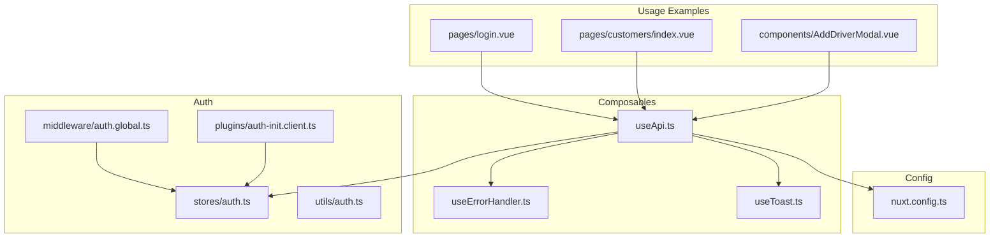
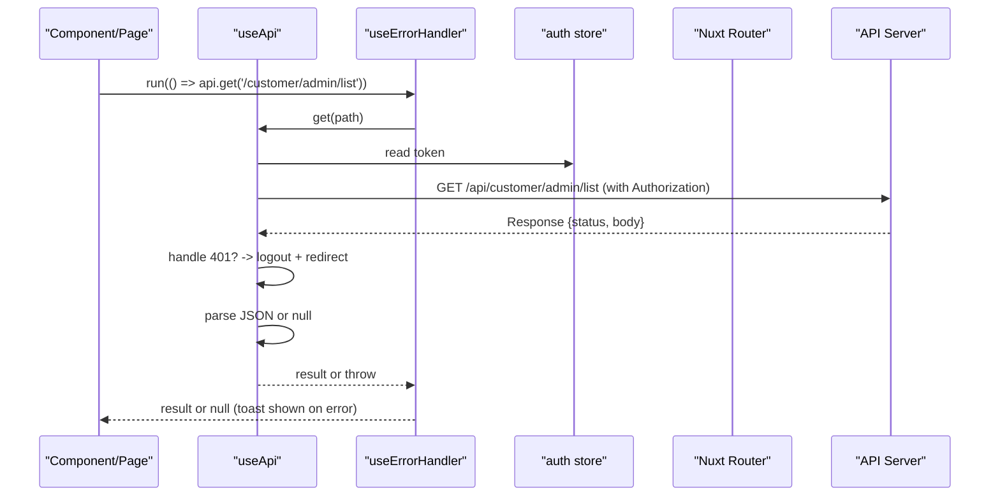
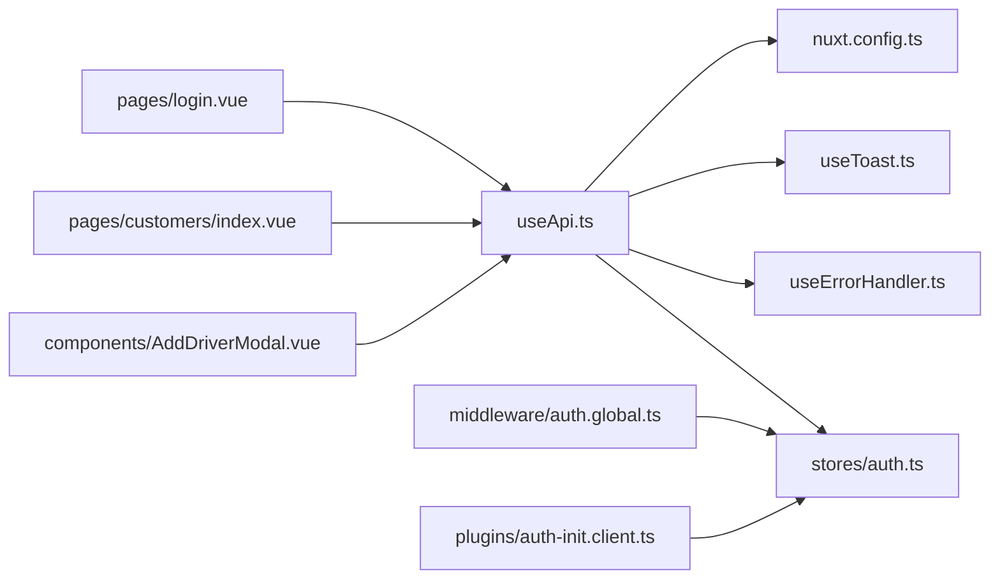

# API Integration Layer

<cite>
**Referenced Files in This Document**
- [useApi.ts](file://app/composables/useApi.ts)
- [useErrorHandler.ts](file://app/composables/useErrorHandler.ts)
- [auth.ts](file://app/stores/auth.ts)
- [auth.global.ts](file://app/middleware/auth.global.ts)
- [auth-init.client.ts](file://app/plugins/auth-init.client.ts)
- [useToast.ts](file://app/composables/useToast.ts)
- [auth.ts](file://app/utils/auth.ts)
- [nuxt.config.ts](file://nuxt.config.ts)
- [login.vue](file://app/pages/login.vue)
- [customers/index.vue](file://app/pages/customers/index.vue)
- [AddDriverModal.vue](file://app/components/AddDriverModal.vue)
</cite>

## Table of Contents
1. [Introduction](#introduction)
2. [Project Structure](#project-structure)
3. [Core Components](#core-components)
4. [Architecture Overview](#architecture-overview)
5. [Detailed Component Analysis](#detailed-component-analysis)
6. [Dependency Analysis](#dependency-analysis)
7. [Performance Considerations](#performance-considerations)
8. [Troubleshooting Guide](#troubleshooting-guide)
9. [Conclusion](#conclusion)
10. [Appendices](#appendices)

## Introduction
This document describes the API integration layer architecture, focusing on the typed HTTP client wrapper with automatic authentication header injection, centralized error handling with user-friendly messages, and automatic session invalidation on 401 responses. It explains the request/response processing pipeline, error transformation strategies, and outlines where retry mechanisms can be added. Practical examples demonstrate authenticated calls, handling different response types, and implementing custom error handlers. The document also covers integration with the authentication store, runtime configuration for timeouts and base URLs, debugging and logging approaches, and testing patterns for API interactions.

## Project Structure
The API integration layer is implemented as a small set of composable utilities, a Pinia store for authentication state, Nuxt middleware and plugin for route protection and initialization, and a toast utility for user feedback.

**Diagram sources**
- [useApi.ts:1-91](file://app/composables/useApi.ts#L1-L91)
- [useErrorHandler.ts:1-29](file://app/composables/useErrorHandler.ts#L1-L29)
- [useToast.ts:1-37](file://app/composables/useToast.ts#L1-L37)
- [auth.ts:1-230](file://app/stores/auth.ts#L1-L230)
- [auth.global.ts:1-32](file://app/middleware/auth.global.ts#L1-L32)
- [auth-init.client.ts:1-25](file://app/plugins/auth-init.client.ts#L1-L25)
- [auth.ts:1-58](file://app/utils/auth.ts#L1-L58)
- [nuxt.config.ts:1-46](file://nuxt.config.ts#L1-L46)
- [login.vue:1-167](file://app/pages/login.vue#L1-L167)
- [customers/index.vue:1-200](file://app/pages/customers/index.vue#L1-L200)
- [AddDriverModal.vue:20-190](file://app/components/AddDriverModal.vue#L20-L190)

**Section sources**
- [useApi.ts:1-91](file://app/composables/useApi.ts#L1-L91)
- [useErrorHandler.ts:1-29](file://app/composables/useErrorHandler.ts#L1-L29)
- [auth.ts:1-230](file://app/stores/auth.ts#L1-L230)
- [auth.global.ts:1-32](file://app/middleware/auth.global.ts#L1-L32)
- [auth-init.client.ts:1-25](file://app/plugins/auth-init.client.ts#L1-L25)
- [useToast.ts:1-37](file://app/composables/useToast.ts#L1-L37)
- [auth.ts:1-58](file://app/utils/auth.ts#L1-L58)
- [nuxt.config.ts:1-46](file://nuxt.config.ts#L1-L46)
- [login.vue:1-167](file://app/pages/login.vue#L1-L167)
- [customers/index.vue:1-200](file://app/pages/customers/index.vue#L1-L200)
- [AddDriverModal.vue:20-190](file://app/components/AddDriverModal.vue#L20-L190)

## Core Components
- Typed HTTP client wrapper (useApi): Provides get/post/put/patch/delete helpers and a raw request method. Automatically injects Authorization headers when a token exists, centralizes success/error handling, and handles 401 by logging out and redirecting to login.
- Centralized error handler (useErrorHandler): Wraps async operations to show user-friendly toasts and return null on failure, enabling simple guarded flows in components.
- Toast utility (useToast): A lightweight global toast system used by the error handler and UI components.
- Authentication store (auth store): Manages tokens, user data, session checks, warnings, and logout behavior. Integrates with API endpoints for profile and session validation.
- Route middleware (auth.global): Protects routes, redirects unauthenticated users, and validates sessions during navigation.
- Auth initialization plugin (auth-init.client): Validates session on app load if already authenticated and provides an isCheckingAuth flag.
- Runtime configuration (nuxt.config.ts): Defines public runtime config including apiBase URL.

Key responsibilities and behaviors:
- Automatic Bearer token injection from the auth store into every request.
- Success detection for status codes 200, 201, and 204; non-success responses are transformed into user-friendly errors.
- 401 handling triggers logout and navigation to login.
- Error wrapping returns null and shows a toast via useErrorHandler.

**Section sources**
- [useApi.ts:1-91](file://app/composables/useApi.ts#L1-L91)
- [useErrorHandler.ts:1-29](file://app/composables/useErrorHandler.ts#L1-L29)
- [useToast.ts:1-37](file://app/composables/useToast.ts#L1-L37)
- [auth.ts:1-230](file://app/stores/auth.ts#L1-L230)
- [auth.global.ts:1-32](file://app/middleware/auth.global.ts#L1-L32)
- [auth-init.client.ts:1-25](file://app/plugins/auth-init.client.ts#L1-L25)
- [nuxt.config.ts:1-46](file://nuxt.config.ts#L1-L46)

## Architecture Overview
The API integration layer follows a layered approach:
- Composables provide a thin, typed HTTP client that encapsulates fetch, header injection, and error handling.
- The auth store manages authentication state and session lifecycle.
- Middleware and plugins enforce access control and initialize session checks.
- Toasts deliver consistent user feedback.

**Diagram sources**
- [useApi.ts:1-91](file://app/composables/useApi.ts#L1-L91)
- [useErrorHandler.ts:1-29](file://app/composables/useErrorHandler.ts#L1-L29)
- [auth.ts:1-230](file://app/stores/auth.ts#L1-L230)
- [auth.global.ts:1-32](file://app/middleware/auth.global.ts#L1-L32)

## Detailed Component Analysis

### useApi — Typed HTTP Client Wrapper
Responsibilities:
- Build full URL using runtime config public.apiBase.
- Merge default headers with provided options.
- Inject Authorization header when token is present.
- Log request and response metadata for debugging.
- Handle 401 by calling store.logout() and navigating to login.
- Treat 200/201/204 as success; otherwise extract message and throw a user-friendly error.
- Parse JSON response or return null for empty bodies.
- Provide convenience methods get/post/put/patch/delete that wrap requests with useErrorHandler.
- Expose signIn helper for typed authentication calls.
- Expose raw request for advanced usage.

Request/response processing pipeline:
- Headers preparation -> fetch -> status check -> 401 handling -> success parsing -> return typed result.

Error transformation strategy:
- Non-success responses attempt to extract a message field from JSON; fallback uses a generic message including the status code.

Automatic session invalidation:
- On 401, logs out and redirects to login, then throws a clear error message.

Retry mechanisms:
- Not currently implemented in useApi. Retries can be added around the fetch call with exponential backoff and jitter, ensuring idempotent methods (GET, HEAD, OPTIONS) are retried safely.

Timeout configurations:
- Not currently configured in useApi. Timeouts can be introduced using AbortController with a configurable timeout value derived from runtime config.

Practical usage examples:
- Authenticated GET with typed response and error toast:
  - See [customers/index.vue:86-101](file://app/pages/customers/index.vue#L86-L101)
- PATCH with typed response and error toast:
  - See [customers/index.vue:24-46](file://app/pages/customers/index.vue#L24-L46)
- Loading reference data in a modal:
  - See [AddDriverModal.vue:20-25](file://app/components/AddDriverModal.vue#L20-L25)
- Signed-in flow using typed signIn helper:
  - See [login.vue:48-64](file://app/pages/login.vue#L48-L64)

Custom error handlers:
- Use the raw request method to bypass automatic toast handling and implement custom logic:
  - Example pattern: await api.request('/some/path', { method: 'POST', body: JSON.stringify(payload) })

**Section sources**
- [useApi.ts:1-91](file://app/composables/useApi.ts#L1-L91)
- [customers/index.vue:24-46](file://app/pages/customers/index.vue#L24-L46)
- [customers/index.vue:86-101](file://app/pages/customers/index.vue#L86-L101)
- [AddDriverModal.vue:20-25](file://app/components/AddDriverModal.vue#L20-L25)
- [login.vue:48-64](file://app/pages/login.vue#L48-L64)

### useErrorHandler — Centralized Error Handling
Responsibilities:
- Wrap async functions to catch errors, display toasts with user-friendly titles/messages, and return null on failure.
- Enable callers to guard with if (!data) after awaiting run(...).

Integration points:
- Used by useApi’s convenience methods to automatically show toasts on failures.
- Can be used directly in components for custom flows.

Example usage:
- Wrapped GET with custom title:
  - See [customers/index.vue:86-101](file://app/pages/customers/index.vue#L86-L101)

**Section sources**
- [useErrorHandler.ts:1-29](file://app/composables/useErrorHandler.ts#L1-L29)
- [useApi.ts:69-89](file://app/composables/useApi.ts#L69-L89)
- [customers/index.vue:86-101](file://app/pages/customers/index.vue#L86-L101)

### useToast — User Feedback Utility
Responsibilities:
- Manage a reactive list of toasts with type, title, optional message, and duration.
- Provide convenience methods for success, error, warning, info.

Integration points:
- Consumed by useErrorHandler to show error toasts.
- Used directly in pages/components for custom notifications.

**Section sources**
- [useToast.ts:1-37](file://app/composables/useToast.ts#L1-L37)
- [useErrorHandler.ts:1-29](file://app/composables/useErrorHandler.ts#L1-L29)

### Authentication Store — Session Management and Profile Fetching
Responsibilities:
- Maintain user, token, team member profile, and session expiry state.
- Provide setAuth, checkSession, refreshSession, extendSession, logout, and fetchTeamMemberProfile.
- Start periodic session checks and warnings; navigate to login on expiration.
- Persist state across reloads.

Integration points:
- useApi reads token to inject Authorization header.
- auth.global middleware checks isAuthenticated and validates session on navigation.
- auth-init.plugin validates session on app load.

Flow overview:
- Login sets auth state and starts session monitoring.
- Periodic checks refresh session and update expiry.
- Warning timer shows a countdown before expiry.
- Logout clears state and optionally calls server sign-out endpoint.

**Section sources**
- [auth.ts:1-230](file://app/stores/auth.ts#L1-L230)
- [auth.global.ts:1-32](file://app/middleware/auth.global.ts#L1-L32)
- [auth-init.client.ts:1-25](file://app/plugins/auth-init.client.ts#L1-L25)

### Route Middleware and Initialization Plugin
Route middleware:
- Allows public routes (/login, /forgot-password, /unauthorized, /pay/**).
- Redirects unauthenticated users to login.
- Validates session on navigation (not initial load) and redirects if invalid.

Initialization plugin:
- Checks session on app load if authenticated.
- Provides isCheckingAuth flag for loading screens.

**Section sources**
- [auth.global.ts:1-32](file://app/middleware/auth.global.ts#L1-L32)
- [auth-init.client.ts:1-25](file://app/plugins/auth-init.client.ts#L1-L25)

### Runtime Configuration
- Public API base URL is defined in runtime config and consumed by useApi and auth store.
- Environment variable NUXT_PUBLIC_API_BASE overrides the default.

**Section sources**
- [nuxt.config.ts:21-26](file://nuxt.config.ts#L21-L26)
- [useApi.ts:19-20](file://app/composables/useApi.ts#L19-L20)
- [auth.ts:19-25](file://app/stores/auth.ts#L19-L25)

## Dependency Analysis
The following diagram maps key dependencies between components:

**Diagram sources**
- [useApi.ts:1-91](file://app/composables/useApi.ts#L1-L91)
- [useErrorHandler.ts:1-29](file://app/composables/useErrorHandler.ts#L1-L29)
- [useToast.ts:1-37](file://app/composables/useToast.ts#L1-L37)
- [auth.ts:1-230](file://app/stores/auth.ts#L1-L230)
- [auth.global.ts:1-32](file://app/middleware/auth.global.ts#L1-L32)
- [auth-init.client.ts:1-25](file://app/plugins/auth-init.client.ts#L1-L25)
- [nuxt.config.ts:1-46](file://nuxt.config.ts#L1-L46)
- [login.vue:1-167](file://app/pages/login.vue#L1-L167)
- [customers/index.vue:1-200](file://app/pages/customers/index.vue#L1-L200)
- [AddDriverModal.vue:20-190](file://app/components/AddDriverModal.vue#L20-L190)

**Section sources**
- [useApi.ts:1-91](file://app/composables/useApi.ts#L1-L91)
- [auth.ts:1-230](file://app/stores/auth.ts#L1-L230)
- [auth.global.ts:1-32](file://app/middleware/auth.global.ts#L1-L32)
- [auth-init.client.ts:1-25](file://app/plugins/auth-init.client.ts#L1-L25)
- [nuxt.config.ts:1-46](file://nuxt.config.ts#L1-L46)
- [login.vue:1-167](file://app/pages/login.vue#L1-L167)
- [customers/index.vue:1-200](file://app/pages/customers/index.vue#L1-L200)
- [AddDriverModal.vue:20-190](file://app/components/AddDriverModal.vue#L20-L190)

## Performance Considerations
- Avoid redundant network calls by caching frequently accessed data at the component level or using a dedicated cache layer.
- Prefer GET requests for idempotent reads; batch related queries when possible.
- Defer heavy computations until after API responses arrive.
- Use AbortController-based timeouts to prevent long-running requests from blocking UI.
- Minimize console logging in production builds to reduce overhead.

[No sources needed since this section provides general guidance]

## Troubleshooting Guide
Debugging strategies:
- Inspect console logs emitted by useApi for request details and response status.
- Verify runtime config values for apiBase in development tools.
- Check auth store state (token, sessionExpiresAt) and ensure session checks are running.

Logging approaches:
- useApi logs request and response metadata; consider adding structured logging or integrating with a logging service.
- Auth store logs session checks and errors; review these for session-related issues.

Testing patterns:
- Unit tests for composables: Mock fetch and runtime config to validate header injection, 401 handling, and error transformations.
- Component tests: Assert that useErrorHandler displays toasts and returns null on failure.
- E2E tests: Use MSW to intercept API calls and simulate various server responses.

Common issues:
- Missing Authorization header: Ensure token is set in auth store before making requests.
- Unexpected null results: Confirm the endpoint returns JSON for non-empty responses; empty bodies will resolve to null.
- Session expired unexpectedly: Review periodic session checks and server-side session validity.

**Section sources**
- [useApi.ts:20-25](file://app/composables/useApi.ts#L20-L25)
- [useApi.ts:32-37](file://app/composables/useApi.ts#L32-L37)
- [auth.ts:155-163](file://app/stores/auth.ts#L155-L163)

## Conclusion
The API integration layer provides a concise, typed HTTP client with automatic authentication header injection, centralized error handling, and robust session management. It integrates cleanly with Nuxt’s routing and plugin systems, offering predictable behavior for authenticated requests and clear user feedback through toasts. While retries and timeouts are not yet implemented, the architecture supports straightforward extensions. Developers can confidently build features using the provided composables and follow the documented patterns for error handling, testing, and performance optimization.

[No sources needed since this section summarizes without analyzing specific files]

## Appendices

### Practical Usage Patterns
- Making an authenticated GET request with typed response and error toast:
  - See [customers/index.vue:86-101](file://app/pages/customers/index.vue#L86-L101)
- Performing a PATCH operation with typed response and error toast:
  - See [customers/index.vue:24-46](file://app/pages/customers/index.vue#L24-L46)
- Loading reference data in a modal:
  - See [AddDriverModal.vue:20-25](file://app/components/AddDriverModal.vue#L20-L25)
- Signing in using the typed helper:
  - See [login.vue:48-64](file://app/pages/login.vue#L48-L64)

### Custom Error Handler Implementation
- Use the raw request method to bypass automatic toasts and implement custom logic:
  - Pattern: await api.request('/path', { method: 'POST', body: JSON.stringify(payload) })

### Extending Retry and Timeout Behavior
- Add retry logic around the fetch call in useApi for idempotent methods with exponential backoff.
- Introduce AbortController-based timeouts using a configurable value from runtime config.

[No sources needed since this section provides general guidance]