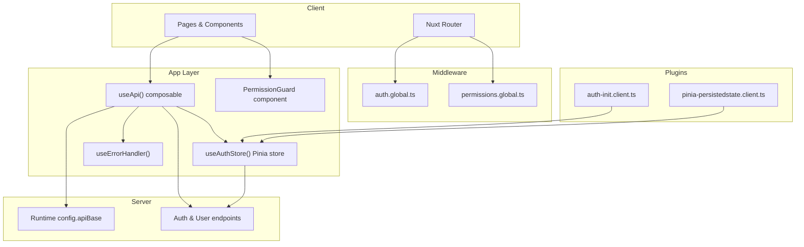
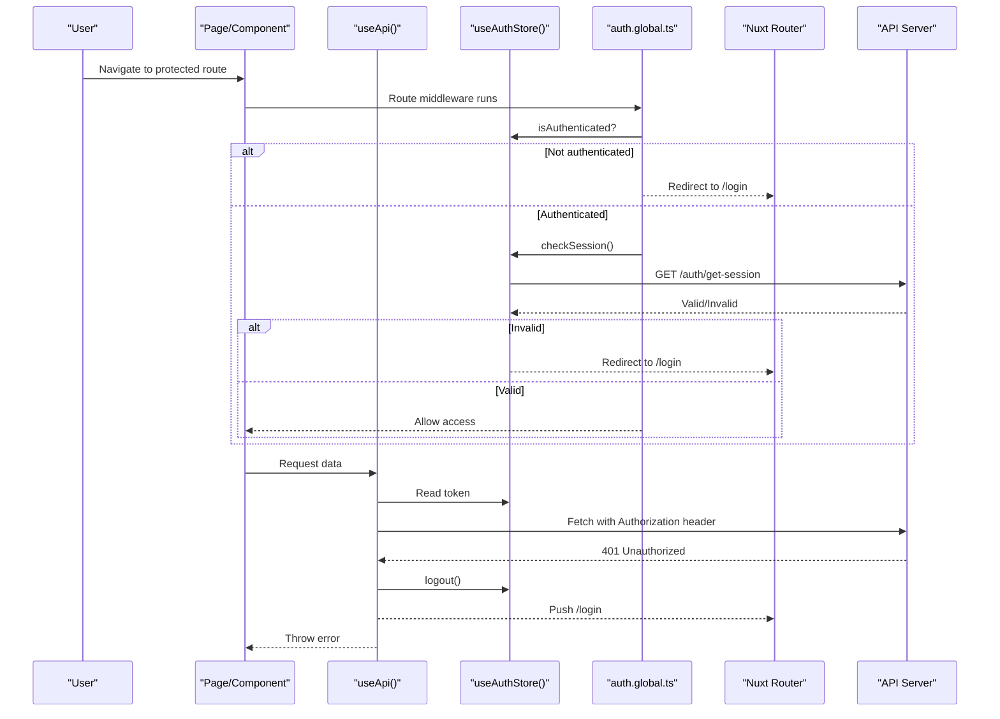
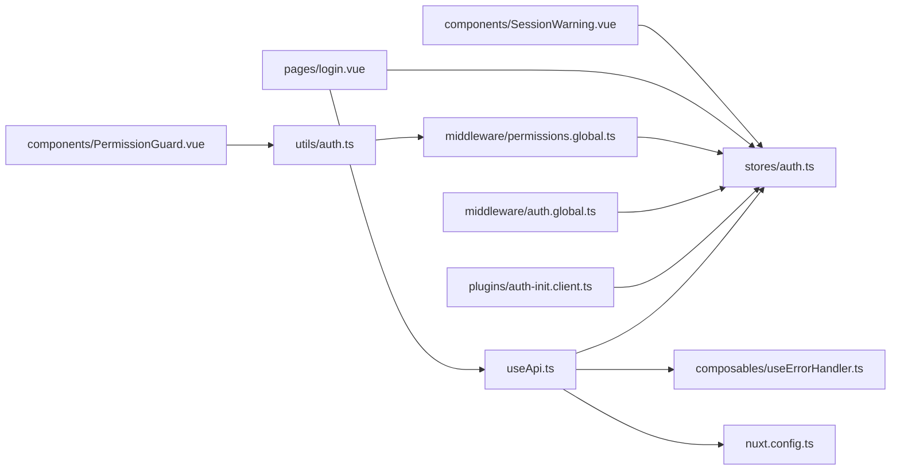
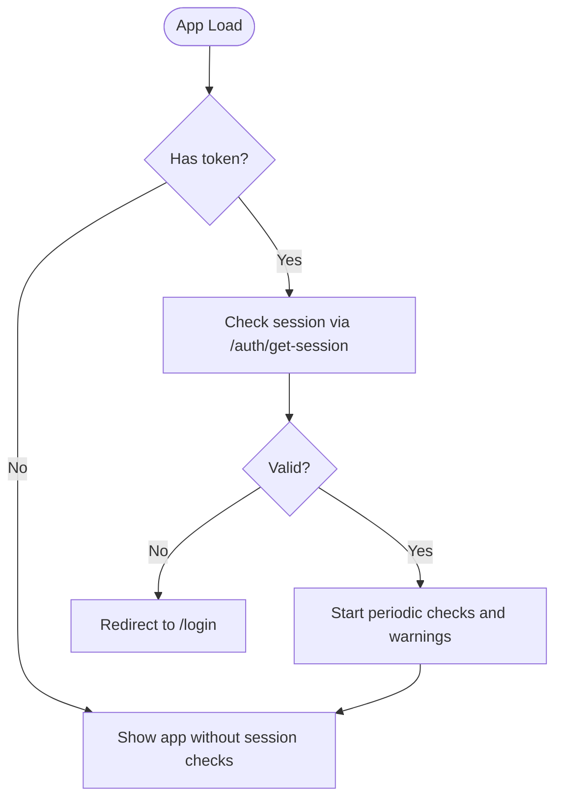

# Authentication Integration

<cite>
**Referenced Files in This Document**
- [useApi.ts](file://app/composables/useApi.ts)
- [auth.ts](file://app/stores/auth.ts)
- [auth.global.ts](file://app/middleware/auth.global.ts)
- [permissions.global.ts](file://app/middleware/permissions.global.ts)
- [auth-init.client.ts](file://app/plugins/auth-init.client.ts)
- [pinia-persistedstate.client.ts](file://app/plugins/pinia-persistedstate.client.ts)
- [nuxt.config.ts](file://nuxt.config.ts)
- [login.vue](file://app/pages/login.vue)
- [SessionWarning.vue](file://app/components/SessionWarning.vue)
- [AuthLoadingScreen.vue](file://app/components/AuthLoadingScreen.vue)
- [PermissionGuard.vue](file://app/components/PermissionGuard.vue)
- [useErrorHandler.ts](file://app/composables/useErrorHandler.ts)
- [auth.ts](file://app/utils/auth.ts)
- [auth.ts](file://app/types/auth.ts)
</cite>

## Table of Contents
1. [Introduction](#introduction)
2. [Project Structure](#project-structure)
3. [Core Components](#core-components)
4. [Architecture Overview](#architecture-overview)
5. [Detailed Component Analysis](#detailed-component-analysis)
6. [Dependency Analysis](#dependency-analysis)
7. [Performance Considerations](#performance-considerations)
8. [Troubleshooting Guide](#troubleshooting-guide)
9. [Conclusion](#conclusion)
10. [Appendices](#appendices)

## Introduction
This document explains how authentication integrates with the API layer, focusing on:
- Automatic token injection into HTTP requests
- Handling 401 Unauthorized responses with automatic logout and redirect to login
- Session lifecycle management (check, warning, refresh, logout)
- Token storage and security considerations
- Protected route handling and permission checks
- Token validation flows
- Custom authentication flows
- Common scenarios such as token expiration, concurrent requests, and offline handling

The implementation uses a Nuxt 3 application with Pinia for state, global middleware for route protection, and a composable API client that centralizes request behavior.

## Project Structure
Authentication-related code is organized across composables, stores, middleware, plugins, pages, components, utilities, and types:
- Composables: API client and error handling
- Store: Auth state, session timers, and server calls
- Middleware: Route-level auth and permissions
- Plugins: App initialization and persistence setup
- Pages: Login flow
- Components: Session warning and loading screens
- Utilities: Role and permission helpers
- Types: Shared data contracts
- Configuration: Runtime API base URL

**Diagram sources**
- [useApi.ts:1-91](file://app/composables/useApi.ts#L1-L91)
- [auth.ts:1-230](file://app/stores/auth.ts#L1-L230)
- [auth.global.ts:1-32](file://app/middleware/auth.global.ts#L1-L32)
- [permissions.global.ts:1-59](file://app/middleware/permissions.global.ts#L1-L59)
- [auth-init.client.ts:1-25](file://app/plugins/auth-init.client.ts#L1-L25)
- [pinia-persistedstate.client.ts:1-7](file://app/plugins/pinia-persistedstate.client.ts#L1-L7)
- [nuxt.config.ts:21-26](file://nuxt.config.ts#L21-L26)

**Section sources**
- [nuxt.config.ts:21-26](file://nuxt.config.ts#L21-L26)
- [pinia-persistedstate.client.ts:1-7](file://app/plugins/pinia-persistedstate.client.ts#L1-L7)

## Core Components
- API client (useApi): Adds Authorization header when token exists, handles 401 by logging out and redirecting, wraps errors with toast notifications, and exposes typed helpers including signIn.
- Auth store (useAuthStore): Holds user, token, team member profile, session expiry, and warning state; provides setAuth, checkSession, refreshSession, extendSession, dismissSessionWarning, logout, and fetchTeamMemberProfile; starts periodic checks and warnings; persists via Pinia plugin.
- Global auth middleware (auth.global.ts): Guards routes, allows public paths, redirects unauthenticated users, and validates sessions on navigation.
- Permissions middleware (permissions.global.ts): Enforces route-based permissions after authentication.
- Auth init plugin (auth-init.client.ts): Validates session on app load if already authenticated and shows an initial loading screen while checking.
- Session warning component (SessionWarning.vue): Displays countdown and actions to extend or dismiss.
- Auth loading screen (AuthLoadingScreen.vue): Shows a spinner while verifying session at startup.
- Permission guard component (PermissionGuard.vue): Client-side rendering guard based on roles and permissions.
- Error handler (useErrorHandler.ts): Wraps async operations to show toasts and return null on failure.
- Auth utilities (utils/auth.ts): Helpers for role normalization and permission checks.
- Types (types/auth.ts): Contracts for user, session, profile, and sign-in responses.

**Section sources**
- [useApi.ts:1-91](file://app/composables/useApi.ts#L1-L91)
- [auth.ts:1-230](file://app/stores/auth.ts#L1-L230)
- [auth.global.ts:1-32](file://app/middleware/auth.global.ts#L1-L32)
- [permissions.global.ts:1-59](file://app/middleware/permissions.global.ts#L1-L59)
- [auth-init.client.ts:1-25](file://app/plugins/auth-init.client.ts#L1-L25)
- [SessionWarning.vue:1-66](file://app/components/SessionWarning.vue#L1-L66)
- [AuthLoadingScreen.vue:1-29](file://app/components/AuthLoadingScreen.vue#L1-L29)
- [PermissionGuard.vue:1-38](file://app/components/PermissionGuard.vue#L1-L38)
- [useErrorHandler.ts:1-29](file://app/composables/useErrorHandler.ts#L1-L29)
- [auth.ts:1-58](file://app/utils/auth.ts#L1-L58)
- [auth.ts:1-64](file://app/types/auth.ts#L1-L64)

## Architecture Overview
The authentication architecture combines runtime configuration, a persistent auth store, global middleware, and a centralized API client. The flow ensures tokens are attached to requests, invalid sessions are detected proactively, and users are redirected appropriately.

**Diagram sources**
- [auth.global.ts:1-32](file://app/middleware/auth.global.ts#L1-L32)
- [auth.ts:1-230](file://app/stores/auth.ts#L1-L230)
- [useApi.ts:1-91](file://app/composables/useApi.ts#L1-L91)
- [nuxt.config.ts:21-26](file://nuxt.config.ts#L21-L26)

## Detailed Component Analysis

### API Client (useApi)
Responsibilities:
- Injects Authorization header using the current token from the auth store.
- Builds full URLs using runtime config.apiBase.
- Handles 401 by calling logout and navigating to login, then throws a descriptive error.
- Treats 200/201/204 as success; otherwise extracts message and throws.
- Provides typed helpers get/post/put/patch/delete and a signIn helper.
- Integrates with useErrorHandler to wrap calls with toast feedback and return null on failure.

Key behaviors:
- Token presence determines header inclusion.
- 401 triggers immediate logout and redirect.
- Non-success status codes surface messages via toasts.

Security notes:
- Tokens are read from memory-only ref; they are not persisted directly by the API client.
- Ensure only HTTPS endpoints are used in production.

**Section sources**
- [useApi.ts:1-91](file://app/composables/useApi.ts#L1-L91)
- [useErrorHandler.ts:1-29](file://app/composables/useErrorHandler.ts#L1-L29)
- [nuxt.config.ts:21-26](file://nuxt.config.ts#L21-L26)

### Auth Store (useAuthStore)
Responsibilities:
- Maintains user, token, team member profile, session expiry, and warning state.
- Provides setAuth to initialize session, including fetching team member profile and starting timers.
- Implements checkSession to validate token against server and update local state.
- Offers refreshSession and extendSession to renew session validity.
- Starts periodic session checks and a warning timer before expiry.
- Provides logout to clear state and optionally call sign-out endpoint.
- Persists state via Pinia persisted state plugin.

Lifecycle:
- On setAuth: sets user/token, calculates expiry, fetches profile, starts checks/warnings.
- Periodic checks: every 5 minutes, validates session and redirects if invalid.
- Warning: shows UI 2 minutes before expiry; auto-logout when expired.
- Initialization: if token exists on load, validates session and fetches profile.

Security notes:
- Token stored in Pinia state; persistence enabled via plugin. See Security Considerations below.

**Section sources**
- [auth.ts:1-230](file://app/stores/auth.ts#L1-L230)
- [pinia-persistedstate.client.ts:1-7](file://app/plugins/pinia-persistedstate.client.ts#L1-L7)

### Global Auth Middleware (auth.global.ts)
Responsibilities:
- Defines public routes and payment prefix as accessible without auth.
- Redirects unauthenticated users to login.
- On navigation between routes, validates session via store.checkSession and redirects if invalid.

Behavior:
- Skips verification on initial load (handled by auth-init plugin).
- Uses navigateTo for redirection.

**Section sources**
- [auth.global.ts:1-32](file://app/middleware/auth.global.ts#L1-L32)

### Permissions Middleware (permissions.global.ts)
Responsibilities:
- Skips public routes and payment pages.
- Ensures user is authenticated before checking permissions.
- Admin/Super Admin bypasses permission checks.
- Maps routes to required permissions and redirects unauthorized users to /unauthorized.

**Section sources**
- [permissions.global.ts:1-59](file://app/middleware/permissions.global.ts#L1-L59)
- [auth.ts:1-58](file://app/utils/auth.ts#L1-L58)

### Auth Init Plugin (auth-init.client.ts)
Responsibilities:
- Provides isCheckingAuth flag to display a loading screen during initial session verification.
- If authenticated, validates session and redirects to login if invalid.
- Marks auth check complete to reveal main app content.

**Section sources**
- [auth-init.client.ts:1-25](file://app/plugins/auth-init.client.ts#L1-L25)
- [AuthLoadingScreen.vue:1-29](file://app/components/AuthLoadingScreen.vue#L1-L29)

### Session Warning Component (SessionWarning.vue)
Responsibilities:
- Displays remaining time and offers Extend Session or Dismiss actions.
- Emits events handled by the parent to call store methods.

Integration:
- Parent app component renders it conditionally based on store flags and binds handlers.

**Section sources**
- [SessionWarning.vue:1-66](file://app/components/SessionWarning.vue#L1-L66)
- [auth.ts:1-230](file://app/stores/auth.ts#L1-L230)

### Permission Guard Component (PermissionGuard.vue)
Responsibilities:
- Renders children only if the user has required roles/permissions.
- Supports single or multiple checks and “require all” semantics.

**Section sources**
- [PermissionGuard.vue:1-38](file://app/components/PermissionGuard.vue#L1-L38)
- [auth.ts:1-58](file://app/utils/auth.ts#L1-L58)

### Login Page (login.vue)
Responsibilities:
- Validates form inputs.
- Calls api.signIn to authenticate.
- On success, calls authStore.setAuth and navigates to home.
- Displays errors via toasts or inline messages.

**Section sources**
- [login.vue:1-167](file://app/pages/login.vue#L1-L167)
- [useApi.ts:1-91](file://app/composables/useApi.ts#L1-L91)
- [auth.ts:1-230](file://app/stores/auth.ts#L1-L230)

### Data Models (types/auth.ts)
Responsibilities:
- Defines shapes for AuthUser, AuthTeamMember, SignInResponse, SessionResponse, ProfileResponse.
- Used by API client and store for type safety.

**Section sources**
- [auth.ts:1-64](file://app/types/auth.ts#L1-L64)

## Dependency Analysis
High-level dependencies:
- useApi depends on useAuthStore for token, useRuntimeConfig for base URL, and useErrorHandler for toast wrapping.
- useAuthStore depends on runtime config for endpoints and router for navigation.
- Middleware depends on useAuthStore and router.
- Plugins depend on useAuthStore and provide app-wide flags.
- Components depend on store state and emit events to trigger store actions.

**Diagram sources**
- [useApi.ts:1-91](file://app/composables/useApi.ts#L1-L91)
- [auth.ts:1-230](file://app/stores/auth.ts#L1-L230)
- [auth-init.client.ts:1-25](file://app/plugins/auth-init.client.ts#L1-L25)
- [auth.global.ts:1-32](file://app/middleware/auth.global.ts#L1-L32)
- [permissions.global.ts:1-59](file://app/middleware/permissions.global.ts#L1-L59)
- [auth.ts:1-58](file://app/utils/auth.ts#L1-L58)
- [login.vue:1-167](file://app/pages/login.vue#L1-L167)
- [SessionWarning.vue:1-66](file://app/components/SessionWarning.vue#L1-L66)
- [PermissionGuard.vue:1-38](file://app/components/PermissionGuard.vue#L1-L38)
- [nuxt.config.ts:21-26](file://nuxt.config.ts#L21-L26)

**Section sources**
- [useApi.ts:1-91](file://app/composables/useApi.ts#L1-L91)
- [auth.ts:1-230](file://app/stores/auth.ts#L1-L230)
- [auth.global.ts:1-32](file://app/middleware/auth.global.ts#L1-L32)
- [permissions.global.ts:1-59](file://app/middleware/permissions.global.ts#L1-L59)
- [auth-init.client.ts:1-25](file://app/plugins/auth-init.client.ts#L1-L25)
- [auth.ts:1-58](file://app/utils/auth.ts#L1-L58)
- [login.vue:1-167](file://app/pages/login.vue#L1-L167)
- [SessionWarning.vue:1-66](file://app/components/SessionWarning.vue#L1-L66)
- [PermissionGuard.vue:1-38](file://app/components/PermissionGuard.vue#L1-L38)
- [nuxt.config.ts:21-26](file://nuxt.config.ts#L21-L26)

## Performance Considerations
- Token lookup is O(1) from Pinia refs; negligible overhead.
- Periodic session checks run every 5 minutes; ensure backend /auth/get-session is lightweight.
- Warning interval runs every second; consider throttling or debouncing if needed.
- Avoid redundant network calls by coalescing requests when possible (see Concurrent Requests section).
- Use SSR-disabled routes where necessary to prevent server-side auth checks.

[No sources needed since this section provides general guidance]

## Troubleshooting Guide
Common issues and resolutions:
- 401 Unauthorized on first request:
  - Verify token exists in store and is not expired.
  - Check that auth.init plugin validated session on load.
  - Confirm middleware allows the route or redirects correctly.
- Session expires unexpectedly:
  - Review session expiry calculation and periodic checks.
  - Ensure refreshSession/extendSession are called before expiry.
- Persistent token not present after reload:
  - Confirm Pinia persisted state plugin is active and store is configured to persist.
- Network errors masquerading as auth failures:
  - Inspect error messages from useErrorHandler and API client logs.
- Permission denied despite being logged in:
  - Validate route-to-permission mapping and user permissions loaded from profile.

Operational tips:
- Enable console logs around API calls and auth checks for debugging.
- Temporarily disable persistence to isolate storage-related issues.
- Use browser dev tools to inspect headers and cookies if server uses them.

**Section sources**
- [useApi.ts:1-91](file://app/composables/useApi.ts#L1-L91)
- [auth.ts:1-230](file://app/stores/auth.ts#L1-L230)
- [auth-init.client.ts:1-25](file://app/plugins/auth-init.client.ts#L1-L25)
- [auth.global.ts:1-32](file://app/middleware/auth.global.ts#L1-L32)
- [permissions.global.ts:1-59](file://app/middleware/permissions.global.ts#L1-L59)
- [useErrorHandler.ts:1-29](file://app/composables/useErrorHandler.ts#L1-L29)

## Conclusion
The authentication integration centers on a robust API client that injects tokens and handles 401s, a persistent auth store managing session lifecycle, and global middleware enforcing access control. Together, these pieces provide secure, user-friendly authentication with proactive session management and clear error handling. Extending or customizing flows should focus on the API client, auth store, and middleware boundaries to maintain consistency.

[No sources needed since this section summarizes without analyzing specific files]

## Appendices

### Token Refresh Mechanism
Current behavior:
- refreshSession delegates to checkSession, which calls /auth/get-session.
- On success, session expiry resets and profile may be refreshed.
- No background token rotation is implemented; clients must rely on server-side token validity.

Recommendations:
- Implement silent refresh using a short-lived access token and long-lived refresh token if supported by the backend.
- Add a queue to retry failed requests after successful refresh.

**Section sources**
- [auth.ts:1-230](file://app/stores/auth.ts#L1-L230)

### Security Considerations for Token Storage
- Tokens are stored in Pinia state with persistence enabled via plugin.
- Prefer HttpOnly cookies for sensitive tokens to mitigate XSS risks.
- If storing in memory/localStorage, ensure strict CSP and sanitize outputs.
- Always use HTTPS endpoints for API communication.
- Minimize token scope and lifetime; rotate tokens regularly.

**Section sources**
- [pinia-persistedstate.client.ts:1-7](file://app/plugins/pinia-persistedstate.client.ts#L1-L7)
- [auth.ts:1-230](file://app/stores/auth.ts#L1-L230)
- [nuxt.config.ts:21-26](file://nuxt.config.ts#L21-L26)

### Protected Route Handling
- Global middleware blocks non-public routes for unauthenticated users.
- Permissions middleware enforces route-specific permissions.
- PermissionGuard component provides client-side rendering guards.

**Section sources**
- [auth.global.ts:1-32](file://app/middleware/auth.global.ts#L1-L32)
- [permissions.global.ts:1-59](file://app/middleware/permissions.global.ts#L1-L59)
- [PermissionGuard.vue:1-38](file://app/components/PermissionGuard.vue#L1-L38)

### Token Validation Flow
- Initial validation occurs in auth-init plugin if token exists.
- Navigation triggers middleware to re-validate session.
- Periodic checks keep session fresh and warn users before expiry.

**Diagram sources**
- [auth-init.client.ts:1-25](file://app/plugins/auth-init.client.ts#L1-L25)
- [auth.ts:1-230](file://app/stores/auth.ts#L1-L230)

### Implementing Custom Authentication Flows
- For alternative providers, add a new method in the API client to call the provider’s endpoint and return a token/user payload.
- Update login page to call the new method and set auth via store.setAuth.
- Optionally integrate additional steps like MFA or consent prompts.

**Section sources**
- [useApi.ts:1-91](file://app/composables/useApi.ts#L1-L91)
- [login.vue:1-167](file://app/pages/login.vue#L1-L167)
- [auth.ts:1-230](file://app/stores/auth.ts#L1-L230)

### Common Scenarios

#### Token Expiration
- Symptoms: 401 responses, automatic logout and redirect to login.
- Mitigation: Use extendSession before expiry; implement silent refresh if supported.

**Section sources**
- [useApi.ts:1-91](file://app/composables/useApi.ts#L1-L91)
- [auth.ts:1-230](file://app/stores/auth.ts#L1-L230)

#### Concurrent Requests
- Risk: Multiple 401s can trigger repeated logouts and redirects.
- Mitigation: Implement a request queue and a single refresh operation; deduplicate concurrent refresh attempts.

[No sources needed since this section provides general guidance]

#### Offline Handling
- Behavior: Network failures will throw errors surfaced by useErrorHandler.
- Mitigation: Cache critical data; queue mutations for later; inform users of connectivity issues.

**Section sources**
- [useErrorHandler.ts:1-29](file://app/composables/useErrorHandler.ts#L1-L29)