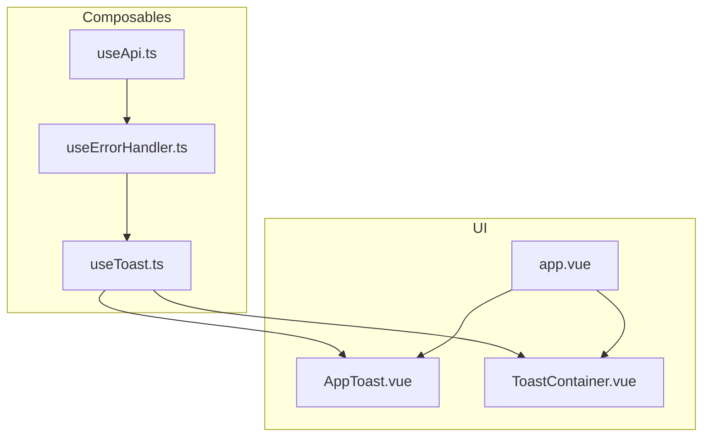
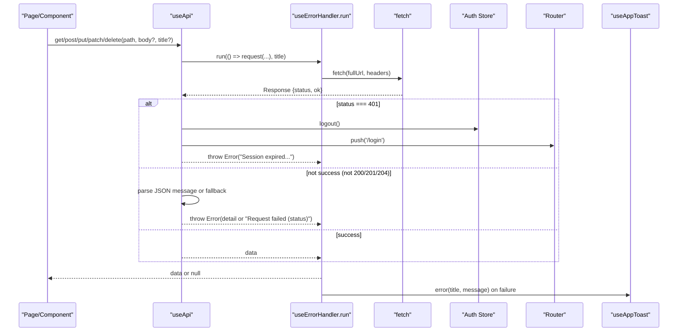
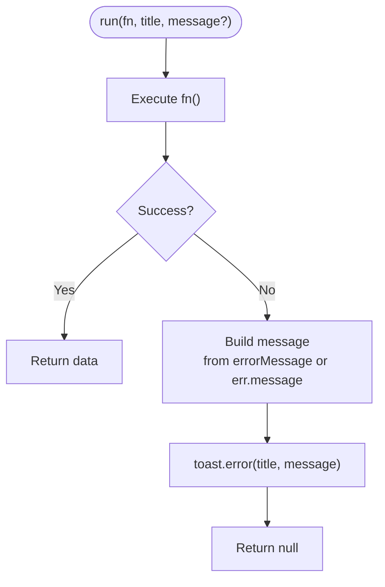
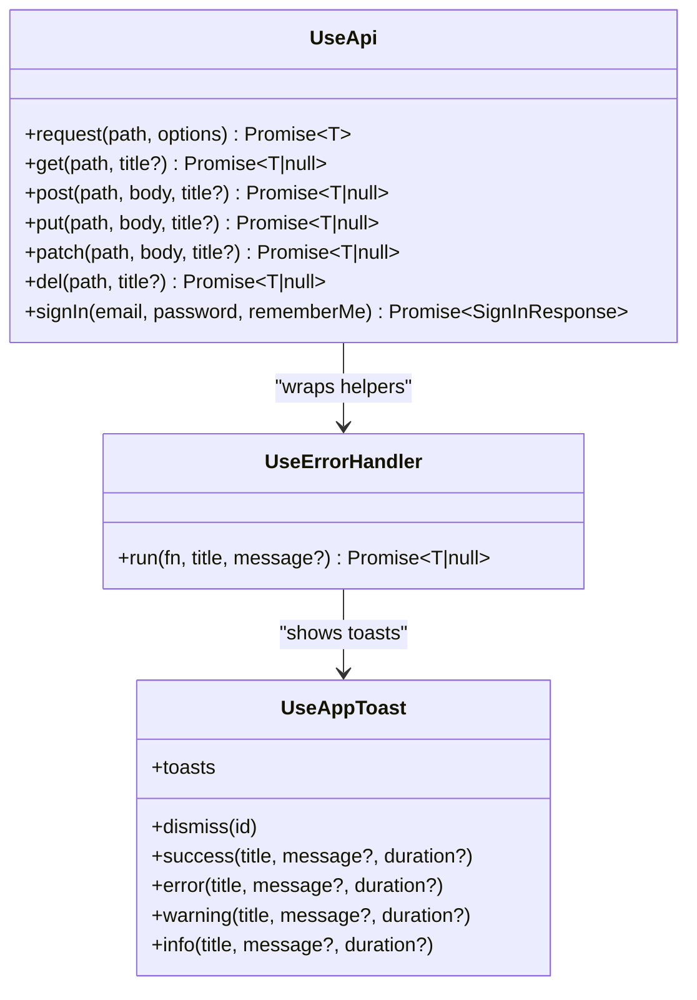
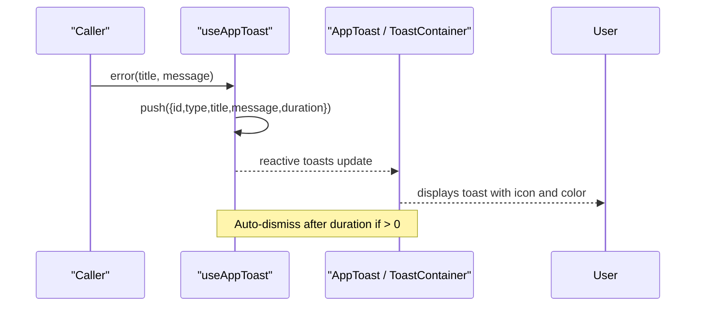
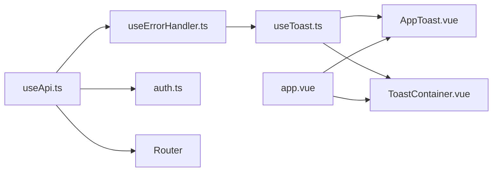
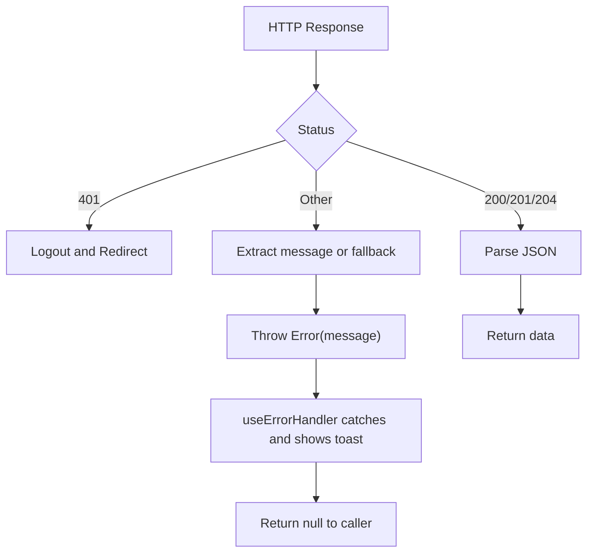

# Error Handling Strategy

<cite>
**Referenced Files in This Document**
- [useErrorHandler.ts](file://app/composables/useErrorHandler.ts)
- [useApi.ts](file://app/composables/useApi.ts)
- [useToast.ts](file://app/composables/useToast.ts)
- [AppToast.vue](file://app/components/AppToast.vue)
- [ToastContainer.vue](file://app/components/ToastContainer.vue)
- [auth.ts](file://app/stores/auth.ts)
- [index.vue (Customers)](file://app/pages/customers/index.vue)
- [CreatePickupModal.vue](file://app/components/CreatePickupModal.vue)
- [app.vue](file://app/app.vue)
</cite>

## Table of Contents
1. [Introduction](#introduction)
2. [Project Structure](#project-structure)
3. [Core Components](#core-components)
4. [Architecture Overview](#architecture-overview)
5. [Detailed Component Analysis](#detailed-component-analysis)
6. [Dependency Analysis](#dependency-analysis)
7. [Performance Considerations](#performance-considerations)
8. [Troubleshooting Guide](#troubleshooting-guide)
9. [Conclusion](#conclusion)
10. [Appendices](#appendices)

## Introduction
This document explains the centralized error handling strategy used across the application. It focuses on how API requests are wrapped with automatic toast notifications and user-friendly messaging, how HTTP errors are transformed into consistent user-facing messages, and how the system integrates with the toast notification layer. It also covers examples for custom error handlers, logging strategies, debugging techniques, graceful degradation patterns, and guidance for adding retry mechanisms where appropriate.

## Project Structure
The error handling strategy is implemented as a small set of composables and components:
- useApi: centralizes HTTP requests, normalizes responses, handles authentication failures, and exposes typed helpers that automatically show toasts on failure.
- useErrorHandler: wraps async operations with try/catch and shows an error toast; returns null on failure so callers can guard UI state.
- useAppToast: provides a global toast store and methods to display success, error, warning, and info toasts.
- AppToast and ToastContainer: render toasts in the UI with animations and progress indicators.
- app.vue: mounts the toast renderer at the root.

**Diagram sources**
- [useApi.ts:1-91](file://app/composables/useApi.ts#L1-L91)
- [useErrorHandler.ts:1-29](file://app/composables/useErrorHandler.ts#L1-L29)
- [useToast.ts:1-37](file://app/composables/useToast.ts#L1-L37)
- [AppToast.vue:1-115](file://app/components/AppToast.vue#L1-L115)
- [ToastContainer.vue:1-120](file://app/components/ToastContainer.vue#L1-L120)
- [app.vue:1-33](file://app/app.vue#L1-L33)

**Section sources**
- [useApi.ts:1-91](file://app/composables/useApi.ts#L1-L91)
- [useErrorHandler.ts:1-29](file://app/composables/useErrorHandler.ts#L1-L29)
- [useToast.ts:1-37](file://app/composables/useToast.ts#L1-L37)
- [AppToast.vue:1-115](file://app/components/AppToast.vue#L1-L115)
- [ToastContainer.vue:1-120](file://app/components/ToastContainer.vue#L1-L120)
- [app.vue:1-33](file://app/app.vue#L1-L33)

## Core Components
- useApi
  - Builds fetch requests with base URL and Authorization header when available.
  - Logs request/response metadata for debugging.
  - Handles 401 by clearing session and redirecting to login.
  - Treats 200/201/204 as success; otherwise extracts message from JSON or falls back to a generic message.
  - Exposes typed helpers get/post/put/patch/delete that wrap calls with useErrorHandler to auto-show toasts and return null on failure.
  - Provides a raw request method for callers who want to handle errors themselves.

- useErrorHandler
  - Wraps any Promise-returning function.
  - On exception, shows an error toast with a title and optional message, then returns null.
  - Designed for simple, consistent UX feedback without boilerplate try/catch in each caller.

- useAppToast
  - Maintains a reactive list of toasts with id, type, title, message, and duration.
  - Provides convenience methods for success/error/warning/info.
  - Auto-dismisses after a configurable duration.

- AppToast and ToastContainer
  - Render toasts with icons, colors, transitions, and optional progress bars.
  - Provide dismiss actions and responsive layout.

- app.vue
  - Mounts the toast renderer(s) at the root so toasts appear globally.

**Section sources**
- [useApi.ts:1-91](file://app/composables/useApi.ts#L1-L91)
- [useErrorHandler.ts:1-29](file://app/composables/useErrorHandler.ts#L1-L29)
- [useToast.ts:1-37](file://app/composables/useToast.ts#L1-L37)
- [AppToast.vue:1-115](file://app/components/AppToast.vue#L1-L115)
- [ToastContainer.vue:1-120](file://app/components/ToastContainer.vue#L1-L120)
- [app.vue:1-33](file://app/app.vue#L1-L33)

## Architecture Overview
The error handling pipeline flows from the page/component through useApi to the network, then back through useErrorHandler to the toast system. Authentication failures are handled centrally in useApi, while other errors are normalized and surfaced via toasts.

**Diagram sources**
- [useApi.ts:1-91](file://app/composables/useApi.ts#L1-L91)
- [useErrorHandler.ts:1-29](file://app/composables/useErrorHandler.ts#L1-L29)
- [useToast.ts:1-37](file://app/composables/useToast.ts#L1-L37)
- [auth.ts:1-230](file://app/stores/auth.ts#L1-L230)

## Detailed Component Analysis

### useErrorHandler
- Purpose: Centralized wrapper around async functions to ensure consistent error feedback via toasts.
- Behavior:
  - Executes the provided function.
  - On catch, constructs a user-friendly message using either a provided message or the thrown Error’s message.
  - Shows an error toast with a customizable title.
  - Returns null on failure to simplify conditional checks in callers.
- Extensibility points:
  - Add logging before showing the toast.
  - Introduce retry logic here for transient errors.
  - Map specific error types to different toast severities.

**Diagram sources**
- [useErrorHandler.ts:1-29](file://app/composables/useErrorHandler.ts#L1-L29)

**Section sources**
- [useErrorHandler.ts:1-29](file://app/composables/useErrorHandler.ts#L1-L29)

### useApi
- Request construction:
  - Adds Content-Type and Authorization headers when token exists.
  - Uses runtime config for base URL.
  - Logs request and response details for debugging.
- Status handling:
  - 401 triggers logout and navigation to login, then throws a user-friendly error.
  - Non-success statuses attempt to extract a message from JSON; otherwise fall back to a generic message including the status code.
  - Success statuses (200/201/204) parse JSON and return data.
- Composable helpers:
  - get/post/put/patch/delete wrap their underlying request with useErrorHandler, passing a default title per operation.
  - request is exposed for advanced usage where the caller wants to handle errors manually.

**Diagram sources**
- [useApi.ts:1-91](file://app/composables/useApi.ts#L1-L91)
- [useErrorHandler.ts:1-29](file://app/composables/useErrorHandler.ts#L1-L29)
- [useToast.ts:1-37](file://app/composables/useToast.ts#L1-L37)

**Section sources**
- [useApi.ts:1-91](file://app/composables/useApi.ts#L1-L91)

### useAppToast and Toast Rendering
- State model:
  - Each toast has id, type, title, optional message, and optional duration.
  - Global ref holds the array; nextId ensures uniqueness.
- Methods:
  - show(type, title, message?, duration) adds a toast and schedules dismissal.
  - Convenience methods for success/error/warning/info.
- Rendering:
  - AppToast and ToastContainer both consume the same store and render toasts with icons, colors, transitions, and optional progress bars.
  - app.vue mounts the toast renderer(s) at the root.

**Diagram sources**
- [useToast.ts:1-37](file://app/composables/useToast.ts#L1-L37)
- [AppToast.vue:1-115](file://app/components/AppToast.vue#L1-L115)
- [ToastContainer.vue:1-120](file://app/components/ToastContainer.vue#L1-L120)
- [app.vue:1-33](file://app/app.vue#L1-L33)

**Section sources**
- [useToast.ts:1-37](file://app/composables/useToast.ts#L1-L37)
- [AppToast.vue:1-115](file://app/components/AppToast.vue#L1-L115)
- [ToastContainer.vue:1-120](file://app/components/ToastContainer.vue#L1-L120)
- [app.vue:1-33](file://app/app.vue#L1-L33)

### Integration Examples in Pages and Components
- Customers index page:
  - Uses api.patch with explicit titles for suspend/unsuspend operations.
  - Checks result for truthiness to update local state and show success toasts.
- Create pickup modal:
  - Uses api.get and api.post with descriptive titles.
  - Guards on null results to avoid updating UI on failure.

These examples demonstrate the intended pattern: prefer the typed helpers for automatic toast feedback; check for null to implement graceful degradation.

**Section sources**
- [index.vue (Customers):1-200](file://app/pages/customers/index.vue#L1-L200)
- [CreatePickupModal.vue:1-200](file://app/components/CreatePickupModal.vue#L1-L200)

## Dependency Analysis
- Coupling:
  - useApi depends on useErrorHandler and useAppToast indirectly (via the helpers).
  - useErrorHandler depends on useAppToast.
  - UI components depend only on useAppToast for rendering.
- Cohesion:
  - Each composable has a single responsibility: networking, wrapping, and presentation.
- External dependencies:
  - Runtime configuration for API base URL.
  - Router for navigation on auth failures.
  - Auth store for session management.

**Diagram sources**
- [useApi.ts:1-91](file://app/composables/useApi.ts#L1-L91)
- [useErrorHandler.ts:1-29](file://app/composables/useErrorHandler.ts#L1-L29)
- [useToast.ts:1-37](file://app/composables/useToast.ts#L1-L37)
- [auth.ts:1-230](file://app/stores/auth.ts#L1-L230)
- [AppToast.vue:1-115](file://app/components/AppToast.vue#L1-L115)
- [ToastContainer.vue:1-120](file://app/components/ToastContainer.vue#L1-L120)
- [app.vue:1-33](file://app/app.vue#L1-L33)

**Section sources**
- [useApi.ts:1-91](file://app/composables/useApi.ts#L1-L91)
- [useErrorHandler.ts:1-29](file://app/composables/useErrorHandler.ts#L1-L29)
- [useToast.ts:1-37](file://app/composables/useToast.ts#L1-L37)
- [auth.ts:1-230](file://app/stores/auth.ts#L1-L230)
- [AppToast.vue:1-115](file://app/components/AppToast.vue#L1-L115)
- [ToastContainer.vue:1-120](file://app/components/ToastContainer.vue#L1-L120)
- [app.vue:1-33](file://app/app.vue#L1-L33)

## Performance Considerations
- Network logging:
  - useApi logs request and response details. In production, consider gating these logs behind a feature flag or environment variable to reduce overhead.
- Toast rendering:
  - Keep toasts concise to minimize reflows. The current implementation uses lightweight DOM updates and CSS transitions.
- Error normalization:
  - Avoid heavy parsing in error paths. The current approach attempts JSON parsing once and falls back quickly.

[No sources needed since this section provides general guidance]

## Troubleshooting Guide
- Debugging API calls:
  - Check console logs emitted by useApi for method, path, full URL, auth presence, status, and parsed message.
- Session expiration:
  - When a 401 occurs, the app clears the session and redirects to login. Verify auth store behavior and router navigation.
- Customizing error messages:
  - Pass a second argument to the typed helpers (e.g., api.get(path, 'Custom title')) to override defaults.
  - For fine-grained control, call the raw request method and handle errors yourself.
- Adding retries:
  - Implement retry logic inside useErrorHandler.run for transient errors (e.g., network timeouts or 5xx).
  - Alternatively, create a higher-order wrapper around useApi.request for specific endpoints.
- Logging strategies:
  - Extend useErrorHandler to log structured events before showing toasts.
  - Consider integrating a logging service for production insights.

**Section sources**
- [useApi.ts:1-91](file://app/composables/useApi.ts#L1-L91)
- [useErrorHandler.ts:1-29](file://app/composables/useErrorHandler.ts#L1-L29)
- [auth.ts:1-230](file://app/stores/auth.ts#L1-L230)

## Conclusion
The application employs a clear, layered error handling strategy:
- Centralized HTTP client with consistent status handling and auth flow.
- Automatic toast feedback via a reusable wrapper.
- Simple, predictable contracts for callers: typed helpers return null on failure, enabling graceful degradation.
This design balances developer ergonomics with user experience, providing actionable feedback while keeping error paths maintainable and testable.

[No sources needed since this section summarizes without analyzing specific files]

## Appendices

### Error Transformation Pipeline Summary
- Input: HTTP response with status and optional JSON body.
- Processing:
  - 401: logout and redirect; throw user-friendly error.
  - Non-success: extract message from JSON or generate a generic message including status.
  - Success: parse JSON and return data.
- Output:
  - Successful data or thrown Error.
  - useErrorHandler converts thrown Errors into toasts and returns null.

**Diagram sources**
- [useApi.ts:1-91](file://app/composables/useApi.ts#L1-L91)
- [useErrorHandler.ts:1-29](file://app/composables/useErrorHandler.ts#L1-L29)

### Example Usage Patterns
- Automatic toast feedback:
  - Use typed helpers with descriptive titles; check for null to guard UI updates.
- Manual error handling:
  - Call the raw request method and handle errors explicitly when you need custom behavior.

**Section sources**
- [index.vue (Customers):1-200](file://app/pages/customers/index.vue#L1-L200)
- [CreatePickupModal.vue:1-200](file://app/components/CreatePickupModal.vue#L1-L200)
- [useApi.ts:1-91](file://app/composables/useApi.ts#L1-L91)