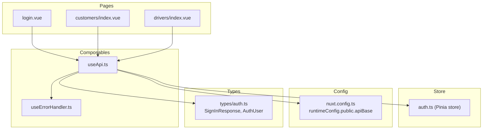
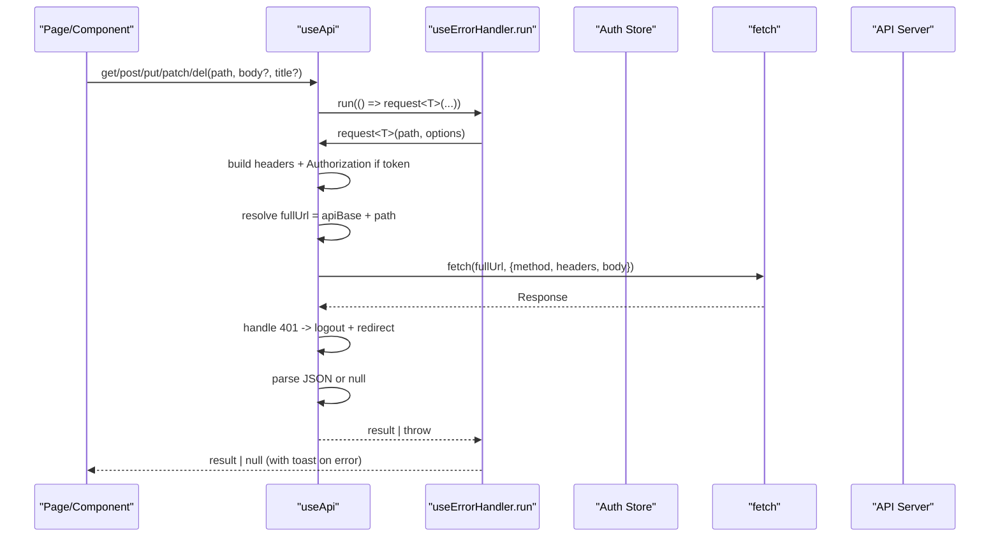
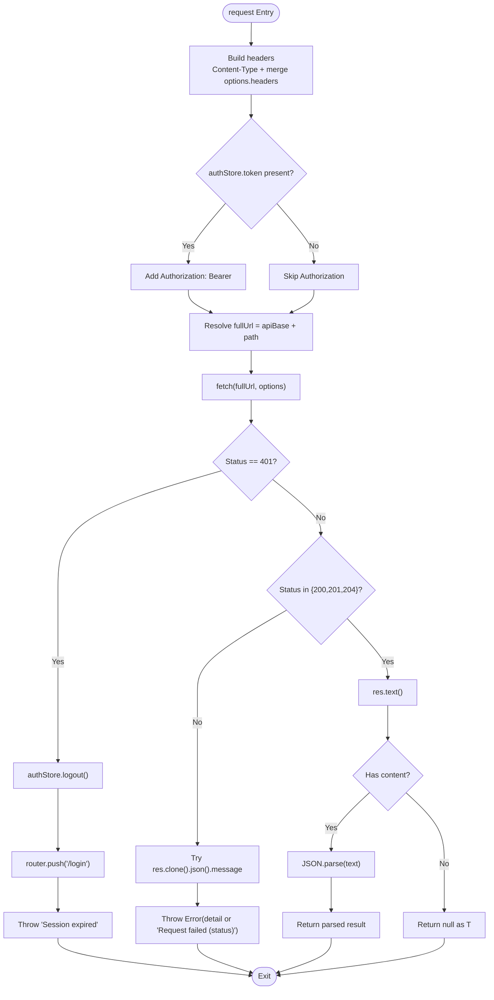
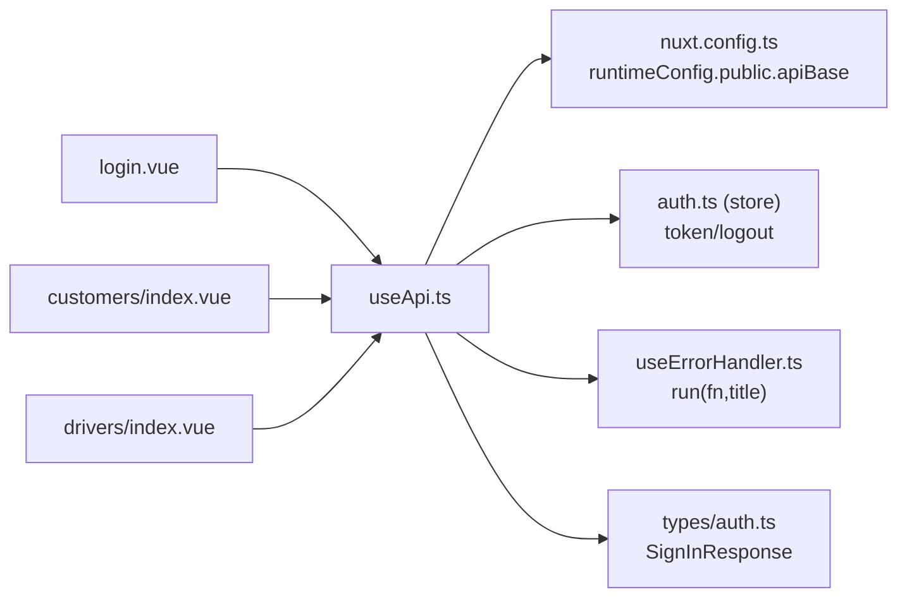

# HTTP Client Implementation

<cite>
**Referenced Files in This Document**
- [useApi.ts](file://app/composables/useApi.ts)
- [nuxt.config.ts](file://nuxt.config.ts)
- [auth.ts](file://app/stores/auth.ts)
- [useErrorHandler.ts](file://app/composables/useErrorHandler.ts)
- [auth.ts (types)](file://app/types/auth.ts)
- [login.vue](file://app/pages/login.vue)
- [customers/index.vue](file://app/pages/customers/index.vue)
- [drivers/index.vue](file://app/pages/drivers/index.vue)
</cite>

## Table of Contents
1. [Introduction](#introduction)
2. [Project Structure](#project-structure)
3. [Core Components](#core-components)
4. [Architecture Overview](#architecture-overview)
5. [Detailed Component Analysis](#detailed-component-analysis)
6. [Dependency Analysis](#dependency-analysis)
7. [Performance Considerations](#performance-considerations)
8. [Troubleshooting Guide](#troubleshooting-guide)
9. [Conclusion](#conclusion)
10. [Appendices](#appendices)

## Introduction
This document explains the HTTP client implementation used across the application, centered on the useApi composable. It covers:
- The core request function architecture and response processing pipeline
- Automatic authentication header injection using Bearer tokens from the auth store
- URL construction via runtime configuration for environment-specific API base URLs
- A typed generic approach to ensure type-safe API responses
- Method-specific wrappers (get, post, put, patch, del) with integrated error handling
- The signIn helper for authentication flows
- Practical usage examples and guidance for custom headers and varied response formats
- Integration with runtime configuration for API endpoints and environment settings

## Project Structure
The HTTP client is implemented as a Nuxt composable and integrates with:
- Runtime configuration for public API base URLs
- Pinia-based auth store for token management and session lifecycle
- Error handler composable for consistent user-facing error feedback
- Typed models for authentication responses

**Diagram sources**
- [useApi.ts:1-91](file://app/composables/useApi.ts#L1-L91)
- [useErrorHandler.ts:1-29](file://app/composables/useErrorHandler.ts#L1-L29)
- [auth.ts:1-230](file://app/stores/auth.ts#L1-L230)
- [nuxt.config.ts:21-26](file://nuxt.config.ts#L21-L26)
- [auth.ts (types):1-64](file://app/types/auth.ts#L1-L64)
- [login.vue:48-64](file://app/pages/login.vue#L48-L64)
- [customers/index.vue:86-101](file://app/pages/customers/index.vue#L86-L101)
- [drivers/index.vue:23-33](file://app/pages/drivers/index.vue#L23-L33)

**Section sources**
- [useApi.ts:1-91](file://app/composables/useApi.ts#L1-L91)
- [nuxt.config.ts:21-26](file://nuxt.config.ts#L21-L26)
- [auth.ts:1-230](file://app/stores/auth.ts#L1-L230)
- [useErrorHandler.ts:1-29](file://app/composables/useErrorHandler.ts#L1-L29)
- [auth.ts (types):1-64](file://app/types/auth.ts#L1-L64)

## Core Components
- useApi composable: Provides a typed request function and convenience methods (get, post, put, patch, del), plus a signIn helper. It automatically injects Authorization headers when a token exists, constructs full URLs using runtime config, and centralizes error handling and success parsing.
- useErrorHandler composable: Wraps async operations to show toast notifications on failure and return null, enabling simple caller-side guards.
- Auth store: Holds the current token and provides logout; useApi triggers logout and redirects on 401 responses.
- Runtime configuration: Defines public.apiBase for environment-specific API base URLs.
- Types: SignInResponse and related types provide compile-time guarantees for authentication payloads and responses.

Key responsibilities:
- Centralized fetch orchestration with automatic header injection
- Environment-aware URL resolution
- Consistent error behavior (401 redirect, non-success status handling)
- Type-safe responses through generics
- User-friendly error feedback via toasts

**Section sources**
- [useApi.ts:9-67](file://app/composables/useApi.ts#L9-L67)
- [useApi.ts:70-90](file://app/composables/useApi.ts#L70-L90)
- [useErrorHandler.ts:10-28](file://app/composables/useErrorHandler.ts#L10-L28)
- [auth.ts:176-201](file://app/stores/auth.ts#L176-L201)
- [nuxt.config.ts:21-26](file://nuxt.config.ts#L21-L26)
- [auth.ts (types):47-51](file://app/types/auth.ts#L47-L51)

## Architecture Overview
The HTTP client follows a layered pattern:
- Pages/components call method-specific wrappers (get/post/put/patch/del) or signIn
- Wrappers delegate to the core request<T> function
- request<T> builds headers, resolves the full URL, performs fetch, handles 401, parses JSON, and returns typed data
- Errors are surfaced via useErrorHandler to display toasts and return null for safe consumption

**Diagram sources**
- [useApi.ts:9-67](file://app/composables/useApi.ts#L9-L67)
- [useApi.ts:70-90](file://app/composables/useApi.ts#L70-L90)
- [useErrorHandler.ts:10-28](file://app/composables/useErrorHandler.ts#L10-L28)
- [auth.ts:176-201](file://app/stores/auth.ts#L176-L201)

## Detailed Component Analysis

### Core Request Function: request<T>
Responsibilities:
- Header assembly: Sets Content-Type and merges provided headers; conditionally adds Authorization when a token exists
- URL construction: Prepends runtime-configured apiBase to the relative path
- Network call: Performs fetch with merged options
- Authentication flow: On 401, logs out via auth store and redirects to login
- Success criteria: Treats 200, 201, and 204 as success
- Error extraction: Attempts to read message from JSON error payload; otherwise uses a fallback message
- Response parsing: Reads text and parses JSON; returns null for empty bodies cast to T

Type safety:
- Generic parameter T ensures callers receive correctly typed responses
- signIn helper is strongly typed to SignInResponse

Error handling integration:
- When wrapped by useErrorHandler.run, failures produce toasts and return null for safe checks

**Diagram sources**
- [useApi.ts:9-67](file://app/composables/useApi.ts#L9-L67)

**Section sources**
- [useApi.ts:9-67](file://app/composables/useApi.ts#L9-L67)

### Method-Specific Wrappers: get, post, put, patch, del
Behavior:
- Each wrapper calls request<T> with appropriate HTTP method and body serialization
- All wrappers are executed inside useErrorHandler.run, which:
  - Catches errors
  - Shows a toast with a provided or default title
  - Returns null on failure so callers can guard with if (!result)

Typical signatures:
- get<T>(path, title?): Promise<T | null>
- post<T>(path, body, title?): Promise<T | null>
- put<T>(path, body, title?): Promise<T | null>
- patch<T>(path, body, title?): Promise<T | null>
- del<T>(path, title?): Promise<T | null>

Usage patterns in the codebase:
- GET with query parameters and typed response shape
- POST/PATCH/PUT with JSON payloads and user-facing titles
- DELETE with resource identifiers and failure messages

**Section sources**
- [useApi.ts:70-90](file://app/composables/useApi.ts#L70-L90)
- [customers/index.vue:86-101](file://app/pages/customers/index.vue#L86-L101)
- [drivers/index.vue:23-33](file://app/pages/drivers/index.vue#L23-L33)

### signIn Helper
Purpose:
- Provides a strongly-typed authentication endpoint call to /auth/sign-in/email
- Accepts email, password, and optional rememberMe flag
- Returns SignInResponse, which includes token and user

Integration:
- Login page invokes signIn, then persists credentials via auth store and navigates to the dashboard

**Section sources**
- [useApi.ts:82-86](file://app/composables/useApi.ts#L82-L86)
- [auth.ts (types):47-51](file://app/types/auth.ts#L47-L51)
- [login.vue:48-64](file://app/pages/login.vue#L48-L64)

### Authentication Header Injection
Rules:
- If authStore.token is present, every request includes Authorization: Bearer <token>
- If no token is present, requests proceed without Authorization
- On 401 responses, the client logs out and redirects to login

**Section sources**
- [useApi.ts:15-17](file://app/composables/useApi.ts#L15-L17)
- [useApi.ts:39-44](file://app/composables/useApi.ts#L39-L44)
- [auth.ts:176-201](file://app/stores/auth.ts#L176-L201)

### URL Construction and Runtime Configuration
- Base URL is resolved from runtimeConfig.public.apiBase
- Full URL is constructed by concatenating base and path
- Default base URL is defined in nuxt.config.ts and can be overridden via environment variables

Environment setup:
- NUXT_PUBLIC_API_BASE sets the API base URL at runtime
- Additional public keys (e.g., map services) are also configured similarly

**Section sources**
- [useApi.ts:19](file://app/composables/useApi.ts#L19)
- [nuxt.config.ts:21-26](file://nuxt.config.ts#L21-L26)

### Response Processing Pipeline
- Non-success statuses (excluding 200/201/204) attempt to extract an error message from JSON
- Errors are thrown with either the extracted message or a fallback string
- Successful responses parse JSON; empty responses return null cast to T
- For typed consumers, the generic T describes the expected shape

**Section sources**
- [useApi.ts:46-66](file://app/composables/useApi.ts#L46-L66)

### Error Handling Integration
- useErrorHandler.run wraps each method call to:
  - Catch exceptions
  - Show a toast with a descriptive title
  - Return null on failure
- Callers should check for null before consuming results

**Section sources**
- [useErrorHandler.ts:10-28](file://app/composables/useErrorHandler.ts#L10-L28)
- [useApi.ts:70-90](file://app/composables/useApi.ts#L70-L90)

## Dependency Analysis
The HTTP client depends on several internal modules and external APIs:

**Diagram sources**
- [useApi.ts:1-91](file://app/composables/useApi.ts#L1-L91)
- [nuxt.config.ts:21-26](file://nuxt.config.ts#L21-L26)
- [auth.ts:1-230](file://app/stores/auth.ts#L1-L230)
- [useErrorHandler.ts:1-29](file://app/composables/useErrorHandler.ts#L1-L29)
- [auth.ts (types):1-64](file://app/types/auth.ts#L1-L64)
- [login.vue:48-64](file://app/pages/login.vue#L48-L64)
- [customers/index.vue:86-101](file://app/pages/customers/index.vue#L86-L101)
- [drivers/index.vue:23-33](file://app/pages/drivers/index.vue#L23-L33)

Coupling and cohesion:
- useApi encapsulates all HTTP concerns (headers, URL building, parsing, 401 handling)
- Low coupling to pages/components via small, focused interfaces (get/post/put/patch/del/signIn/request)
- Cohesive error handling via shared useErrorHandler

Potential circular dependencies:
- None observed between useApi and other composables/store

External integrations:
- Browser fetch API
- Nuxt runtime configuration
- Pinia store for auth state

**Section sources**
- [useApi.ts:1-91](file://app/composables/useApi.ts#L1-L91)
- [nuxt.config.ts:21-26](file://nuxt.config.ts#L21-L26)
- [auth.ts:1-230](file://app/stores/auth.ts#L1-L230)
- [useErrorHandler.ts:1-29](file://app/composables/useErrorHandler.ts#L1-L29)

## Performance Considerations
- Minimal overhead: Single centralized fetch with lightweight header merging and JSON parsing
- Avoid redundant network calls by leveraging component-level caching where appropriate
- Prefer typed responses to reduce downstream transformation costs
- Use method-specific wrappers to avoid repeated boilerplate and potential mistakes

[No sources needed since this section provides general guidance]

## Troubleshooting Guide
Common issues and resolutions:
- 401 Unauthorized: The client automatically logs out and redirects to login. Verify that the token is valid and not expired.
- Empty responses: For 204 No Content or empty bodies, the client returns null. Ensure callers check for null before accessing properties.
- Unexpected JSON parse errors: Confirm the server returns valid JSON for non-empty responses.
- Missing Authorization header: Ensure the auth store has a token set before making authenticated requests.
- Incorrect base URL: Verify runtimeConfig.public.apiBase is set correctly for the environment.

Operational tips:
- Inspect console logs emitted by the client for request/response details during development
- Use the raw request method when you need custom control over error handling or headers

**Section sources**
- [useApi.ts:39-66](file://app/composables/useApi.ts#L39-L66)
- [useErrorHandler.ts:10-28](file://app/composables/useErrorHandler.ts#L10-L28)

## Conclusion
The useApi composable provides a robust, type-safe HTTP client tailored for the application’s needs. It centralizes authentication, URL resolution, error handling, and response parsing while offering convenient wrappers for common HTTP verbs and a typed signIn helper. Its design promotes consistency, reduces duplication, and improves developer experience through strong typing and predictable error behavior.

[No sources needed since this section summarizes without analyzing specific files]

## Appendices

### Practical Usage Examples

- GET with typed response and query parameters
  - Example reference: [customers/index.vue:86-101](file://app/pages/customers/index.vue#L86-L101)

- POST with JSON payload and user-facing title
  - Example reference: [drivers/index.vue:23-33](file://app/pages/drivers/index.vue#L23-L33)

- PATCH with partial update and error title
  - Example reference: [drivers/[id].vue:273](file://app/pages/drivers/[id].vue#L273)

- DELETE with resource ID and failure message
  - Example reference: [management/zones.vue:124](file://app/pages/management/zones.vue#L124)

- Authentication flow using signIn helper
  - Example reference: [login.vue:48-64](file://app/pages/login.vue#L48-L64)

- Custom headers
  - To add custom headers, pass them via the underlying request method or extend the options object. The client merges provided headers with defaults.

- Handling various response formats
  - For JSON responses, rely on the typed generic to access fields safely
  - For empty responses (e.g., 204), expect null and guard accordingly

[No sources needed since this section aggregates references already cited above]