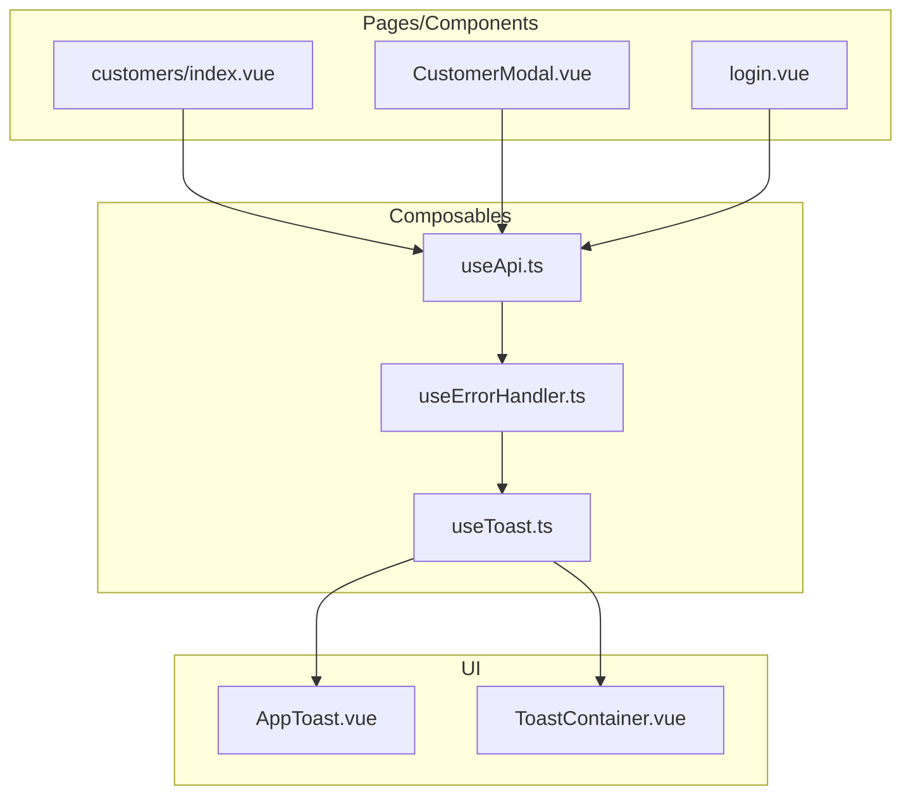
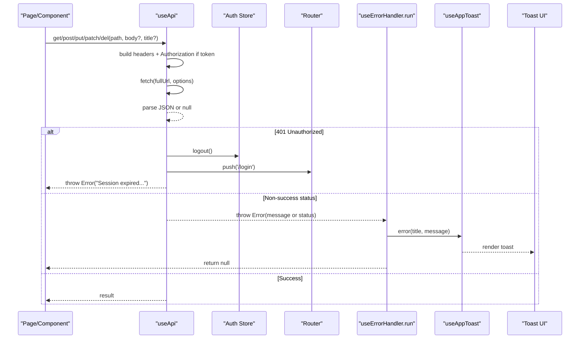
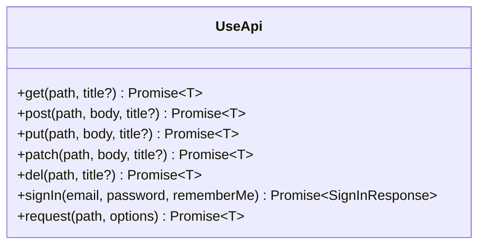
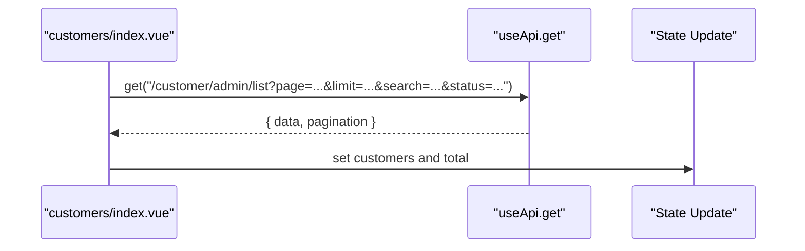
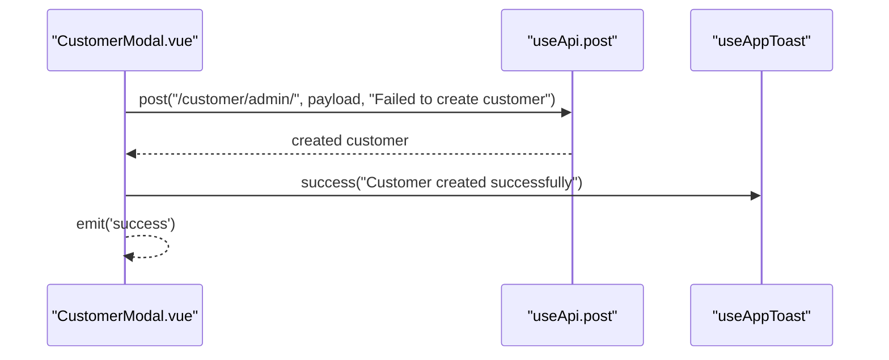
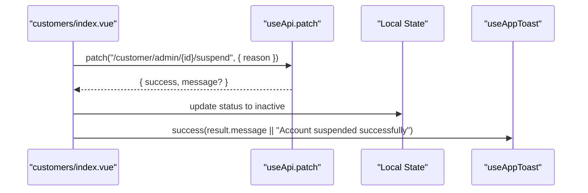
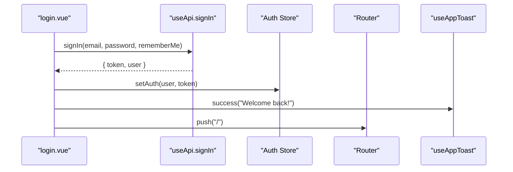
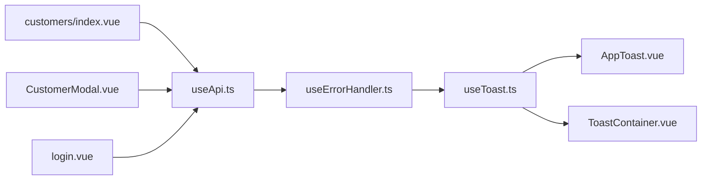

# API Integration & Communication

<cite>
**Referenced Files in This Document**
- [useApi.ts](file://app/composables/useApi.ts)
- [useErrorHandler.ts](file://app/composables/useErrorHandler.ts)
- [useToast.ts](file://app/composables/useToast.ts)
- [AppToast.vue](file://app/components/AppToast.vue)
- [ToastContainer.vue](file://app/components/ToastContainer.vue)
- [index.vue (Customers)](file://app/pages/customers/index.vue)
- [CustomerModal.vue](file://app/components/CustomerModal.vue)
- [login.vue](file://app/pages/login.vue)
- [auth.ts](file://app/types/auth.ts)
</cite>

## Table of Contents
1. [Introduction](#introduction)
2. [Project Structure](#project-structure)
3. [Core Components](#core-components)
4. [Architecture Overview](#architecture-overview)
5. [Detailed Component Analysis](#detailed-component-analysis)
6. [Dependency Analysis](#dependency-analysis)
7. [Performance Considerations](#performance-considerations)
8. [Troubleshooting Guide](#troubleshooting-guide)
9. [Conclusion](#conclusion)
10. [Appendices](#appendices)

## Introduction
This document explains the application’s API integration patterns and communication strategies, focusing on:
- Centralized HTTP client abstraction via useApi composable with automatic authentication headers and standardized error handling
- Consistent error processing and user feedback through useErrorHandler and the toast notification system
- Practical examples for GET, POST, PUT/PATCH, DELETE operations
- Guidance for file uploads and real-time data fetching patterns
- Recommendations for retry mechanisms, timeout handling, and network error recovery

The goal is to provide a clear, consistent approach for all pages and components to interact with backend services while maintaining robust UX and predictable behavior.

## Project Structure
The API integration layer is implemented as Nuxt composables and UI components:
- Composables:
  - useApi: central HTTP client wrapper around fetch with auth header injection and success/failure normalization
  - useErrorHandler: wraps async calls to show toasts and return null on failure
  - useAppToast: global toast state and helpers
- UI:
  - AppToast.vue and ToastContainer.vue: render toasts with animations and progress indicators

**Diagram sources**
- [useApi.ts:1-91](file://app/composables/useApi.ts#L1-L91)
- [useErrorHandler.ts:1-29](file://app/composables/useErrorHandler.ts#L1-L29)
- [useToast.ts:1-37](file://app/composables/useToast.ts#L1-L37)
- [AppToast.vue:1-115](file://app/components/AppToast.vue#L1-L115)
- [ToastContainer.vue:1-120](file://app/components/ToastContainer.vue#L1-L120)
- [index.vue (Customers):1-200](file://app/pages/customers/index.vue#L1-L200)
- [CustomerModal.vue:1-200](file://app/components/CustomerModal.vue#L1-L200)
- [login.vue:40-167](file://app/pages/login.vue#L40-L167)

**Section sources**
- [useApi.ts:1-91](file://app/composables/useApi.ts#L1-L91)
- [useErrorHandler.ts:1-29](file://app/composables/useErrorHandler.ts#L1-L29)
- [useToast.ts:1-37](file://app/composables/useToast.ts#L1-L37)
- [AppToast.vue:1-115](file://app/components/AppToast.vue#L1-L115)
- [ToastContainer.vue:1-120](file://app/components/ToastContainer.vue#L1-L120)
- [index.vue (Customers):1-200](file://app/pages/customers/index.vue#L1-L200)
- [CustomerModal.vue:1-200](file://app/components/CustomerModal.vue#L1-L200)
- [login.vue:40-167](file://app/pages/login.vue#L40-L167)

## Core Components
- useApi
  - Provides typed convenience methods: get, post, put, patch, del, signIn, and raw request
  - Automatically injects Authorization header when token exists
  - Normalizes responses: treats 200/201/204 as success; otherwise throws an Error with message from response body if available
  - Handles 401 by logging out and redirecting to login
- useErrorHandler
  - Wraps async functions to catch errors, display a toast, and return null for safe caller checks
- useAppToast
  - Global reactive toast store with success/error/warning/info helpers and auto-dismiss timers
- UI Toast Components
  - AppToast.vue and ToastContainer.vue render toasts with icons, colors, transitions, and optional progress bars

Typical usage pattern:
- Use api.get/post/put/patch/del with a descriptive title for error toasts
- For custom flows, call run(() => ..., 'title') to leverage centralized error handling
- For direct control, use api.request(path, options)

**Section sources**
- [useApi.ts:1-91](file://app/composables/useApi.ts#L1-L91)
- [useErrorHandler.ts:1-29](file://app/composables/useErrorHandler.ts#L1-L29)
- [useToast.ts:1-37](file://app/composables/useToast.ts#L1-L37)
- [AppToast.vue:1-115](file://app/components/AppToast.vue#L1-L115)
- [ToastContainer.vue:1-120](file://app/components/ToastContainer.vue#L1-L120)

## Architecture Overview
The API flow integrates authentication, request/response handling, and user feedback:

**Diagram sources**
- [useApi.ts:1-91](file://app/composables/useApi.ts#L1-L91)
- [useErrorHandler.ts:1-29](file://app/composables/useErrorHandler.ts#L1-L29)
- [useToast.ts:1-37](file://app/composables/useToast.ts#L1-L37)
- [AppToast.vue:1-115](file://app/components/AppToast.vue#L1-L115)
- [ToastContainer.vue:1-120](file://app/components/ToastContainer.vue#L1-L120)

## Detailed Component Analysis

### useApi: Centralized HTTP Client Abstraction
Responsibilities:
- Build base URL using runtime config
- Inject Authorization header when token present
- Normalize success (200/201/204) vs failure
- Handle 401 by clearing session and redirecting
- Provide typed convenience methods and a raw request method

Key behaviors:
- Automatic auth header injection
- Response parsing with fallback to null for empty bodies
- Centralized logging for requests/responses/errors

Usage examples across the app:
- GET list with pagination and filters
- PATCH to update resource states
- POST to create resources
- Direct sign-in flow using signIn helper

**Section sources**
- [useApi.ts:1-91](file://app/composables/useApi.ts#L1-L91)
- [index.vue (Customers):86-110](file://app/pages/customers/index.vue#L86-L110)
- [CustomerModal.vue:119-183](file://app/components/CustomerModal.vue#L119-L183)
- [login.vue:48-64](file://app/pages/login.vue#L48-L64)
- [auth.ts:47-51](file://app/types/auth.ts#L47-L51)

#### Class-like structure of useApi

**Diagram sources**
- [useApi.ts:1-91](file://app/composables/useApi.ts#L1-L91)
- [auth.ts:47-51](file://app/types/auth.ts#L47-L51)

### useErrorHandler: Consistent Error Processing
Responsibilities:
- Wrap async functions to catch exceptions
- Show toast.error with provided title and message
- Return null on failure so callers can guard with simple checks

Integration points:
- Used inside useApi convenience methods to automatically surface errors
- Can be used directly in components/pages for custom flows

**Section sources**
- [useErrorHandler.ts:1-29](file://app/composables/useErrorHandler.ts#L1-L29)
- [useApi.ts:69-89](file://app/composables/useApi.ts#L69-L89)

### useAppToast: Toast Notification System
Responsibilities:
- Maintain a reactive array of toasts
- Provide success/error/warning/info helpers
- Auto-dismiss after configurable duration
- Expose dismiss(id) for manual removal

UI rendering:
- AppToast.vue and ToastContainer.vue consume the same store and render notifications with icons, colors, transitions, and optional progress bars

**Section sources**
- [useToast.ts:1-37](file://app/composables/useToast.ts#L1-L37)
- [AppToast.vue:1-115](file://app/components/AppToast.vue#L1-L115)
- [ToastContainer.vue:1-120](file://app/components/ToastContainer.vue#L1-L120)

### Example Workflows

#### GET with Pagination and Filters
- Builds query parameters and calls api.get with a typed response shape
- Updates local state and handles loading flags

**Diagram sources**
- [index.vue (Customers):86-110](file://app/pages/customers/index.vue#L86-L110)
- [useApi.ts:71-72](file://app/composables/useApi.ts#L71-L72)

#### POST Create Customer
- Validates form locally
- Calls api.post with payload
- Shows success toast and emits success event

**Diagram sources**
- [CustomerModal.vue:156-183](file://app/components/CustomerModal.vue#L156-L183)
- [useApi.ts:73-74](file://app/composables/useApi.ts#L73-L74)
- [useToast.ts:31-31](file://app/composables/useToast.ts#L31-L31)

#### PATCH Update Status
- Uses api.patch to toggle account status
- Updates local state and shows success toast

**Diagram sources**
- [index.vue (Customers):24-46](file://app/pages/customers/index.vue#L24-L46)
- [useApi.ts:77-78](file://app/composables/useApi.ts#L77-L78)
- [useToast.ts:31-31](file://app/composables/useToast.ts#L31-L31)

#### DELETE Operation Pattern
- Use api.del(path, title) for destructive actions
- The third argument provides a default error title for toasts

**Section sources**
- [useApi.ts:79-80](file://app/composables/useApi.ts#L79-L80)

#### Authentication Flow
- Sign-in uses api.signIn which posts credentials and returns a typed SignInResponse
- On success, stores user and token and navigates

**Diagram sources**
- [login.vue:48-64](file://app/pages/login.vue#L48-L64)
- [useApi.ts:82-86](file://app/composables/useApi.ts#L82-L86)
- [auth.ts:47-51](file://app/types/auth.ts#L47-L51)

### File Uploads
Current implementation:
- useApi sets Content-Type to application/json by default and serializes payloads with JSON.stringify
- No explicit multipart/form-data support is exposed in the convenience methods

Recommended approach for file uploads:
- Use api.request(path, options) to pass FormData and omit Content-Type header so the browser sets it automatically
- Example pattern:
  - Construct FormData and append files
  - Call api.request('/upload', { method: 'POST', body: formData })
  - Handle success and show toasts manually or wrap with useErrorHandler.run

Note: This guidance is conceptual and not tied to specific repository code.

### Real-Time Data Fetching
Current implementation:
- All integrations are request/response based using fetch
- No built-in WebSocket or SSE integration in the API layer

Recommended approaches:
- For polling:
  - Use setInterval or a composable that periodically calls api.get and updates state
  - Debounce or throttle to avoid excessive requests
- For WebSockets:
  - Create a dedicated composable that manages connection lifecycle and dispatches events to reactive state
  - Integrate with useErrorHandler.run for error reporting and useAppToast for user feedback

Note: These recommendations are conceptual and not tied to specific repository code.

### Retry Mechanisms, Timeouts, and Network Recovery
Current implementation:
- No built-in retry or timeout logic in useApi
- 401 triggers logout and redirect; other non-success statuses throw Errors

Recommended enhancements:
- Retries:
  - Add exponential backoff for transient failures (e.g., 5xx, network errors)
  - Limit retries and make them configurable per endpoint
- Timeouts:
  - Use AbortController with a configurable timeout
  - Surface timeout errors consistently via useErrorHandler
- Network recovery:
  - Detect offline/online events and queue or retry failed requests
  - Provide user feedback via toasts when connectivity issues occur

Note: These recommendations are conceptual and not tied to specific repository code.

## Dependency Analysis
High-level dependencies between core modules:

**Diagram sources**
- [useApi.ts:1-91](file://app/composables/useApi.ts#L1-L91)
- [useErrorHandler.ts:1-29](file://app/composables/useErrorHandler.ts#L1-L29)
- [useToast.ts:1-37](file://app/composables/useToast.ts#L1-L37)
- [AppToast.vue:1-115](file://app/components/AppToast.vue#L1-L115)
- [ToastContainer.vue:1-120](file://app/components/ToastContainer.vue#L1-L120)
- [index.vue (Customers):1-200](file://app/pages/customers/index.vue#L1-L200)
- [CustomerModal.vue:1-200](file://app/components/CustomerModal.vue#L1-L200)
- [login.vue:40-167](file://app/pages/login.vue#L40-L167)

**Section sources**
- [useApi.ts:1-91](file://app/composables/useApi.ts#L1-L91)
- [useErrorHandler.ts:1-29](file://app/composables/useErrorHandler.ts#L1-L29)
- [useToast.ts:1-37](file://app/composables/useToast.ts#L1-L37)
- [AppToast.vue:1-115](file://app/components/AppToast.vue#L1-L115)
- [ToastContainer.vue:1-120](file://app/components/ToastContainer.vue#L1-L120)
- [index.vue (Customers):1-200](file://app/pages/customers/index.vue#L1-L200)
- [CustomerModal.vue:1-200](file://app/components/CustomerModal.vue#L1-L200)
- [login.vue:40-167](file://app/pages/login.vue#L40-L167)

## Performance Considerations
- Prefer batching related reads where possible to reduce round-trips
- Use pagination and filtering on the server side to minimize payload sizes
- Avoid unnecessary re-renders by updating only changed fields in reactive state
- Debounce search inputs and geocoding calls to limit network traffic
- Consider caching frequently accessed read-only data in memory or persistent storage

[No sources needed since this section provides general guidance]

## Troubleshooting Guide
Common scenarios and strategies:
- Session expired (401):
  - useApi logs out and redirects to login; ensure your UI reflects unauthenticated state
- Network errors:
  - useErrorHandler will show a toast; consider adding retry logic for transient failures
- Server errors (non-2xx):
  - useApi throws an Error with message from response body if available; useErrorHandler surfaces it via toast
- Custom flows:
  - Use api.request for advanced cases (e.g., file uploads) and handle errors explicitly or wrap with useErrorHandler.run

**Section sources**
- [useApi.ts:39-66](file://app/composables/useApi.ts#L39-L66)
- [useErrorHandler.ts:13-25](file://app/composables/useErrorHandler.ts#L13-L25)

## Conclusion
The application employs a clean, centralized API integration strategy:
- useApi standardizes HTTP interactions, authentication, and response normalization
- useErrorHandler ensures consistent error reporting and user feedback
- useAppToast and its UI components deliver timely, actionable notifications
- Pages and components follow consistent patterns for CRUD operations and authentication

Adopting the recommended enhancements for retries, timeouts, file uploads, and real-time features will further improve resilience and user experience.

[No sources needed since this section summarizes without analyzing specific files]

## Appendices

### API Method Reference
- get(path, title?): GET request with automatic error toast
- post(path, body, title?): POST request with JSON body
- put(path, body, title?): PUT request with JSON body
- patch(path, body, title?): PATCH request with JSON body
- del(path, title?): DELETE request
- signIn(email, password, rememberMe): Typed sign-in returning SignInResponse
- request(path, options): Raw fetch wrapper for advanced scenarios

**Section sources**
- [useApi.ts:71-89](file://app/composables/useApi.ts#L71-L89)
- [auth.ts:47-51](file://app/types/auth.ts#L47-L51)