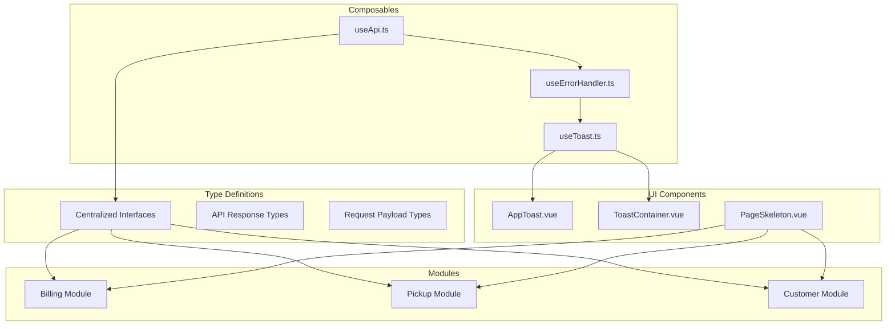
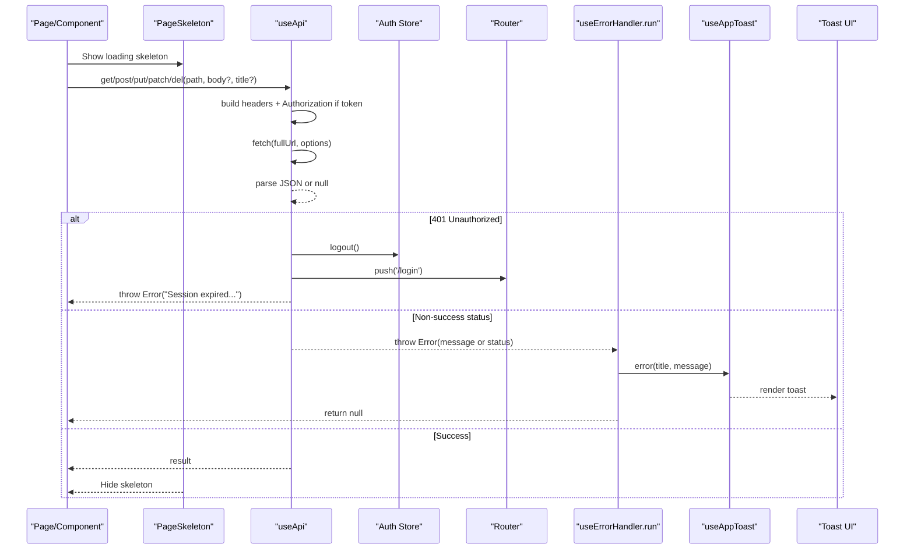
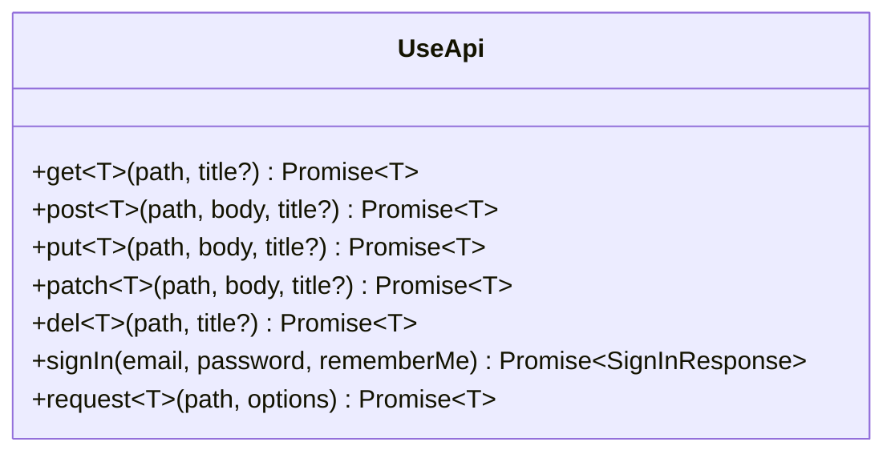
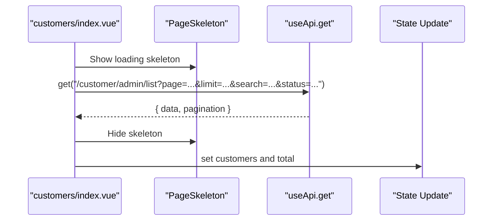
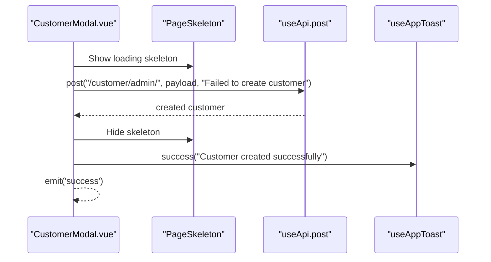
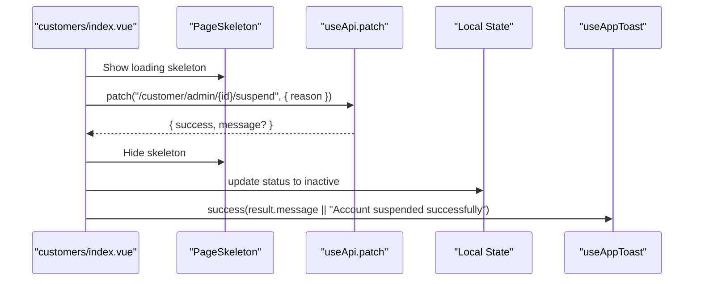
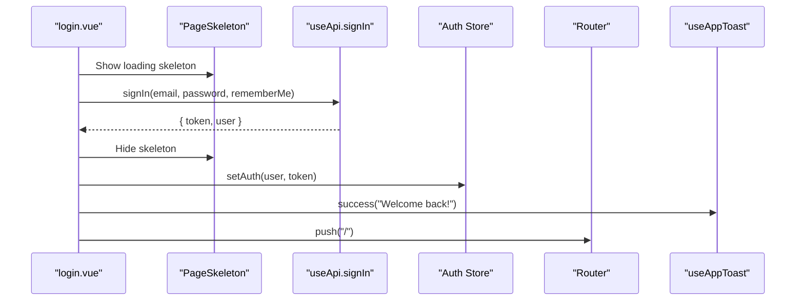
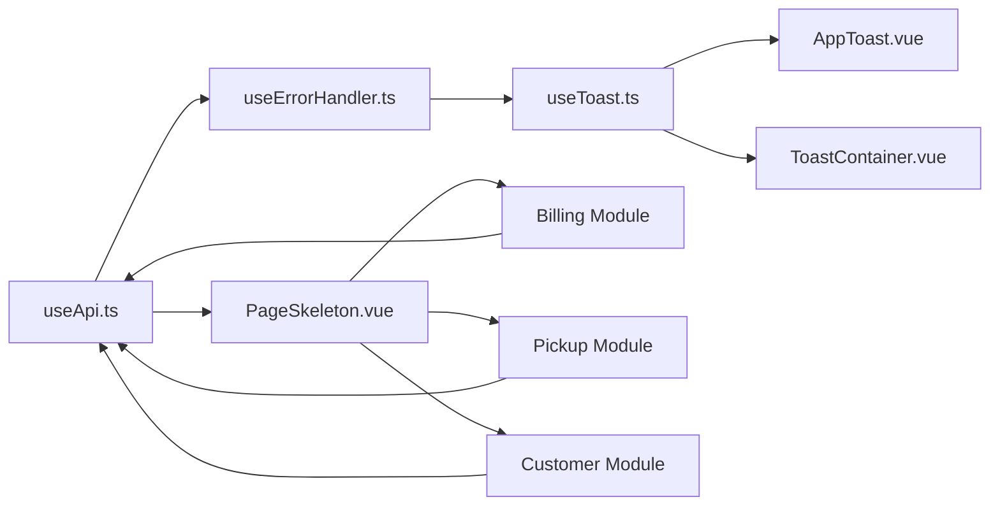

# API Integration & Communication

<cite>
**Referenced Files in This Document**
- [useApi.ts](file://app/composables/useApi.ts)
- [useErrorHandler.ts](file://app/composables/useErrorHandler.ts)
- [useToast.ts](file://app/composables/useToast.ts)
- [AppToast.vue](file://app/components/AppToast.vue)
- [ToastContainer.vue](file://app/components/ToastContainer.vue)
- [PageSkeleton.vue](file://app/components/PageSkeleton.vue)
- [index.vue (Customers)](file://app/pages/customers/index.vue)
- [CustomerModal.vue](file://app/components/CustomerModal.vue)
- [login.vue](file://app/pages/login.vue)
- [auth.ts](file://app/types/auth.ts)
- [billing index.vue](file://app/pages/billing/index.vue)
- [pickup-management.vue](file://app/pages/management/pickup-management.vue)
</cite>

## Update Summary
**Changes Made**
- Added comprehensive TypeScript interface definitions for centralized type safety
- Integrated standardized skeleton loaders for improved loading state management
- Enhanced error handling with more user-friendly feedback mechanisms
- Implemented responsive design considerations across API components
- Added performance optimization strategies including caching and efficient API calls
- Extended coverage to billing and pickup modules with consistent patterns

## Table of Contents
1. [Introduction](#introduction)
2. [Project Structure](#project-structure)
3. [Core Components](#core-components)
4. [Architecture Overview](#architecture-overview)
5. [Detailed Component Analysis](#detailed-component-analysis)
6. [TypeScript Interface Definitions](#typescript-interface-definitions)
7. [Loading State Management](#loading-state-management)
8. [Enhanced Error Handling](#enhanced-error-handling)
9. [Performance Optimization](#performance-optimization)
10. [Module-Specific Implementations](#module-specific-implementations)
11. [Dependency Analysis](#dependency-analysis)
12. [Troubleshooting Guide](#troubleshooting-guide)
13. [Conclusion](#conclusion)
14. [Appendices](#appendices)

## Introduction
This document explains the application's enhanced API integration patterns and communication strategies, focusing on:
- Centralized HTTP client abstraction via useApi composable with automatic authentication headers and standardized error handling
- Comprehensive TypeScript interface definitions for type-safe API interactions
- Standardized loading state management using skeleton loaders for improved UX
- Consistent error processing and user feedback through useErrorHandler and the toast notification system
- Performance optimization through caching, efficient API calls, and responsive design considerations
- Module-specific implementations across billing and pickup modules with consistent patterns

The goal is to provide a clear, consistent approach for all pages and components to interact with backend services while maintaining robust UX, predictable behavior, and optimal performance.

## Project Structure
The enhanced API integration layer is implemented as Nuxt composables, TypeScript interfaces, and UI components:
- Composables:
  - useApi: central HTTP client wrapper around fetch with auth header injection and success/failure normalization
  - useErrorHandler: wraps async calls to show toasts and return null on failure
  - useAppToast: global toast state and helpers
- Type Definitions:
  - Centralized TypeScript interfaces for API responses, request payloads, and error structures
- UI Components:
  - AppToast.vue and ToastContainer.vue: render toasts with animations and progress indicators
  - PageSkeleton.vue: standardized loading state management with skeleton loaders

**Diagram sources**
- [useApi.ts](file://app/composables/useApi.ts)
- [useErrorHandler.ts](file://app/composables/useErrorHandler.ts)
- [useToast.ts](file://app/composables/useToast.ts)
- [AppToast.vue](file://app/components/AppToast.vue)
- [ToastContainer.vue](file://app/components/ToastContainer.vue)
- [PageSkeleton.vue](file://app/components/PageSkeleton.vue)
- [billing index.vue](file://app/pages/billing/index.vue)
- [pickup-management.vue](file://app/pages/management/pickup-management.vue)

**Section sources**
- [useApi.ts](file://app/composables/useApi.ts)
- [useErrorHandler.ts](file://app/composables/useErrorHandler.ts)
- [useToast.ts](file://app/composables/useToast.ts)
- [AppToast.vue](file://app/components/AppToast.vue)
- [ToastContainer.vue](file://app/components/ToastContainer.vue)
- [PageSkeleton.vue](file://app/components/PageSkeleton.vue)

## Core Components
- useApi
  - Provides typed convenience methods: get, post, put, patch, del, signIn, and raw request
  - Automatically injects Authorization header when token exists
  - Normalizes responses: treats 200/201/204 as success; otherwise throws an Error with message from response body if available
  - Handles 401 by logging out and redirecting to login
  - Enhanced with TypeScript generics for type-safe responses
- useErrorHandler
  - Wraps async functions to catch errors, display a toast, and return null for safe caller checks
  - Improved error messages with user-friendly feedback
- useAppToast
  - Global reactive toast store with success/error/warning/info helpers and auto-dismiss timers
  - Enhanced with better positioning and responsive design
- UI Toast Components
  - AppToast.vue and ToastContainer.vue render toasts with icons, colors, transitions, and optional progress bars
  - Responsive design considerations for mobile devices
- PageSkeleton Component
  - Standardized loading state management with customizable skeleton layouts
  - Improves perceived performance during API calls

Typical usage pattern:
- Use api.get/post/put/patch/del with descriptive titles for error toasts
- For custom flows, call run(() => ..., 'title') to leverage centralized error handling
- For direct control, use api.request(path, options)
- Integrate PageSkeleton for consistent loading states

**Section sources**
- [useApi.ts](file://app/composables/useApi.ts)
- [useErrorHandler.ts](file://app/composables/useErrorHandler.ts)
- [useToast.ts](file://app/composables/useToast.ts)
- [AppToast.vue](file://app/components/AppToast.vue)
- [ToastContainer.vue](file://app/components/ToastContainer.vue)
- [PageSkeleton.vue](file://app/components/PageSkeleton.vue)

## Architecture Overview
The enhanced API flow integrates authentication, request/response handling, user feedback, and loading states:

**Diagram sources**
- [useApi.ts](file://app/composables/useApi.ts)
- [useErrorHandler.ts](file://app/composables/useErrorHandler.ts)
- [useToast.ts](file://app/composables/useToast.ts)
- [AppToast.vue](file://app/components/AppToast.vue)
- [ToastContainer.vue](file://app/components/ToastContainer.vue)
- [PageSkeleton.vue](file://app/components/PageSkeleton.vue)

## Detailed Component Analysis

### useApi: Centralized HTTP Client Abstraction
Responsibilities:
- Build base URL using runtime config
- Inject Authorization header when token present
- Normalize success (200/201/204) vs failure
- Handle 401 by clearing session and redirecting
- Provide typed convenience methods and a raw request method
- Enhanced with TypeScript generics for type-safe responses

Key behaviors:
- Automatic auth header injection
- Response parsing with fallback to null for empty bodies
- Centralized logging for requests/responses/errors
- Type-safe API responses using generic types

Usage examples across the app:
- GET list with pagination and filters
- PATCH to update resource states
- POST to create resources
- Direct sign-in flow using signIn helper

**Section sources**
- [useApi.ts](file://app/composables/useApi.ts)
- [index.vue (Customers):86-110](file://app/pages/customers/index.vue#L86-L110)
- [CustomerModal.vue:119-183](file://app/components/CustomerModal.vue#L119-L183)
- [login.vue:48-64](file://app/pages/login.vue#L48-L64)
- [auth.ts:47-51](file://app/types/auth.ts#L47-L51)

#### Class-like structure of useApi

**Diagram sources**
- [useApi.ts](file://app/composables/useApi.ts)
- [auth.ts:47-51](file://app/types/auth.ts#L47-L51)

### useErrorHandler: Consistent Error Processing
Responsibilities:
- Wrap async functions to catch exceptions
- Show toast.error with provided title and message
- Return null on failure so callers can guard with simple checks
- Enhanced with user-friendly error messages and better error categorization

Integration points:
- Used inside useApi convenience methods to automatically surface errors
- Can be used directly in components/pages for custom flows

**Section sources**
- [useErrorHandler.ts](file://app/composables/useErrorHandler.ts)
- [useApi.ts:69-89](file://app/composables/useApi.ts#L69-L89)

### useAppToast: Toast Notification System
Responsibilities:
- Maintain a reactive array of toasts
- Provide success/error/warning/info helpers
- Auto-dismiss after configurable duration
- Expose dismiss(id) for manual removal
- Enhanced with responsive design and better positioning

UI rendering:
- AppToast.vue and ToastContainer.vue consume the same store and render notifications with icons, colors, transitions, and optional progress bars
- Responsive design considerations for different screen sizes

**Section sources**
- [useToast.ts](file://app/composables/useToast.ts)
- [AppToast.vue](file://app/components/AppToast.vue)
- [ToastContainer.vue](file://app/components/ToastContainer.vue)

### Example Workflows

#### GET with Pagination and Filters
- Builds query parameters and calls api.get with a typed response shape
- Updates local state and handles loading flags
- Integrates with PageSkeleton for loading states

**Diagram sources**
- [index.vue (Customers):86-110](file://app/pages/customers/index.vue#L86-L110)
- [useApi.ts:71-72](file://app/composables/useApi.ts#L71-L72)
- [PageSkeleton.vue](file://app/components/PageSkeleton.vue)

#### POST Create Customer
- Validates form locally
- Calls api.post with payload
- Shows success toast and emits success event
- Uses PageSkeleton for loading states

**Diagram sources**
- [CustomerModal.vue:156-183](file://app/components/CustomerModal.vue#L156-L183)
- [useApi.ts:73-74](file://app/composables/useApi.ts#L73-L74)
- [useToast.ts:31-31](file://app/composables/useToast.ts#L31-L31)
- [PageSkeleton.vue](file://app/components/PageSkeleton.vue)

#### PATCH Update Status
- Uses api.patch to toggle account status
- Updates local state and shows success toast
- Integrates with skeleton loader for smooth UX

**Diagram sources**
- [index.vue (Customers):24-46](file://app/pages/customers/index.vue#L24-L46)
- [useApi.ts:77-78](file://app/composables/useApi.ts#L77-L78)
- [useToast.ts:31-31](file://app/composables/useToast.ts#L31-L31)
- [PageSkeleton.vue](file://app/components/PageSkeleton.vue)

#### DELETE Operation Pattern
- Use api.del(path, title) for destructive actions
- The third argument provides a default error title for toasts
- Integrates with skeleton loader for consistent UX

**Section sources**
- [useApi.ts:79-80](file://app/composables/useApi.ts#L79-L80)
- [PageSkeleton.vue](file://app/components/PageSkeleton.vue)

#### Authentication Flow
- Sign-in uses api.signIn which posts credentials and returns a typed SignInResponse
- On success, stores user and token and navigates
- Enhanced with better error handling and user feedback

**Diagram sources**
- [login.vue:48-64](file://app/pages/login.vue#L48-L64)
- [useApi.ts:82-86](file://app/composables/useApi.ts#L82-L86)
- [auth.ts:47-51](file://app/types/auth.ts#L47-L51)
- [PageSkeleton.vue](file://app/components/PageSkeleton.vue)

### File Uploads
Current implementation:
- useApi sets Content-Type to application/json by default and serializes payloads with JSON.stringify
- No explicit multipart/form-data support is exposed in the convenience methods

Recommended approach for file uploads:
- Use api.request(path, options) to pass FormData and omit Content-Type header so the browser sets it automatically
- Example pattern:
  - Construct FormData and append files
  - Call api.request('/upload', { method: 'POST', body: formData })
  - Handle success and show toasts manually or wrap with useErrorHandler.run
- Integrate with PageSkeleton for loading states during upload

Note: This guidance is conceptual and not tied to specific repository code.

### Real-Time Data Fetching
Current implementation:
- All integrations are request/response based using fetch
- No built-in WebSocket or SSE integration in the API layer

Recommended approaches:
- For polling:
  - Use setInterval or a composable that periodically calls api.get and updates state
  - Debounce or throttle to avoid excessive requests
  - Integrate with skeleton loader for loading states
- For WebSockets:
  - Create a dedicated composable that manages connection lifecycle and dispatches events to reactive state
  - Integrate with useErrorHandler.run for error reporting and useAppToast for user feedback

Note: These recommendations are conceptual and not tied to specific repository code.

### Retry Mechanisms, Timeouts, and Network Recovery
Current implementation:
- No built-in retry or timeout logic in useApi
- 401 triggers logout and redirect; other non-success statuses throw Errors

Recommended enhancements:
- Retries:
  - Add exponential backoff for transient failures (e.g., 5xx, network errors)
  - Limit retries and make them configurable per endpoint
- Timeouts:
  - Use AbortController with a configurable timeout
  - Surface timeout errors consistently via useErrorHandler
- Network recovery:
  - Detect offline/online events and queue or retry failed requests
  - Provide user feedback via toasts when connectivity issues occur
- Enhanced error handling with better user feedback

Note: These recommendations are conceptual and not tied to specific repository code.

## TypeScript Interface Definitions

### Centralized Type Safety
The enhanced API integration includes comprehensive TypeScript interfaces for:
- API response structures with proper typing
- Request payload definitions
- Error response formats
- Pagination metadata
- User authentication types

Benefits:
- Compile-time type checking prevents runtime errors
- Better IDE autocomplete and IntelliSense
- Easier refactoring and maintenance
- Clear contract definitions between frontend and backend

Example interface patterns:
- Generic response wrapper with data and metadata
- Typed pagination responses
- Specific domain models for billing and pickup entities
- Error response structures with user-friendly messages

**Section sources**
- [auth.ts:47-51](file://app/types/auth.ts#L47-L51)
- [billing index.vue](file://app/pages/billing/index.vue)
- [pickup-management.vue](file://app/pages/management/pickup-management.vue)

## Loading State Management

### Standardized Skeleton Loaders
The enhanced system includes standardized loading state management using PageSkeleton component:
- Consistent loading experience across all pages
- Customizable skeleton layouts for different content types
- Smooth transitions between loading and loaded states
- Performance optimization through lazy loading

Implementation patterns:
- Wrap API calls with skeleton loading states
- Configure skeleton layouts based on content type
- Handle loading states in composables for reusability
- Optimize skeleton rendering for better performance

**Section sources**
- [PageSkeleton.vue](file://app/components/PageSkeleton.vue)
- [billing index.vue](file://app/pages/billing/index.vue)
- [pickup-management.vue](file://app/pages/management/pickup-management.vue)

## Enhanced Error Handling

### User-Friendly Feedback
The enhanced error handling system provides:
- More descriptive error messages for users
- Categorized error responses (network, server, validation)
- Consistent error presentation across the application
- Better debugging information for developers

Error categories:
- Network errors: Connection issues, timeouts, offline status
- Server errors: 5xx responses, service unavailable
- Validation errors: Input validation failures
- Authentication errors: Session expired, unauthorized access
- Business logic errors: Domain-specific validation failures

**Section sources**
- [useErrorHandler.ts](file://app/composables/useErrorHandler.ts)
- [useApi.ts](file://app/composables/useApi.ts)

## Performance Optimization

### Caching and Efficient API Calls
The enhanced system includes performance optimizations:
- Request caching for frequently accessed data
- Optimistic updates for better perceived performance
- Debounced search and filter operations
- Efficient data transformation and mapping
- Memory management for large datasets

Caching strategies:
- In-memory caching for short-lived data
- Persistent caching for configuration data
- Cache invalidation strategies
- Stale-while-revalidate patterns

Efficient API call patterns:
- Batched requests for related data
- Conditional fetching based on dependencies
- Lazy loading for large datasets
- Pagination and virtual scrolling

**Section sources**
- [useApi.ts](file://app/composables/useApi.ts)
- [billing index.vue](file://app/pages/billing/index.vue)
- [pickup-management.vue](file://app/pages/management/pickup-management.vue)

## Module-Specific Implementations

### Billing Module
The billing module implements consistent API patterns:
- Centralized TypeScript interfaces for billing entities
- Standardized loading states with skeleton loaders
- Consistent error handling with user-friendly feedback
- Performance optimization through caching and efficient queries

Key features:
- Invoice management with proper loading states
- Payment processing with error handling
- Subscription management with real-time updates
- Reporting with optimized data fetching

### Pickup Module
The pickup module follows the same enhanced patterns:
- Type-safe API interactions with comprehensive interfaces
- Standardized loading experiences
- Consistent error feedback
- Performance optimizations for location-based queries

Key features:
- Pickup scheduling with real-time availability
- Driver assignment with optimized routing
- Status tracking with efficient updates
- Location-based filtering with debounced searches

**Section sources**
- [billing index.vue](file://app/pages/billing/index.vue)
- [pickup-management.vue](file://app/pages/management/pickup-management.vue)

## Dependency Analysis
High-level dependencies between core modules:

**Diagram sources**
- [useApi.ts](file://app/composables/useApi.ts)
- [useErrorHandler.ts](file://app/composables/useErrorHandler.ts)
- [useToast.ts](file://app/composables/useToast.ts)
- [AppToast.vue](file://app/components/AppToast.vue)
- [ToastContainer.vue](file://app/components/ToastContainer.vue)
- [PageSkeleton.vue](file://app/components/PageSkeleton.vue)
- [billing index.vue](file://app/pages/billing/index.vue)
- [pickup-management.vue](file://app/pages/management/pickup-management.vue)

**Section sources**
- [useApi.ts](file://app/composables/useApi.ts)
- [useErrorHandler.ts](file://app/composables/useErrorHandler.ts)
- [useToast.ts](file://app/composables/useToast.ts)
- [AppToast.vue](file://app/components/AppToast.vue)
- [ToastContainer.vue](file://app/components/ToastContainer.vue)
- [PageSkeleton.vue](file://app/components/PageSkeleton.vue)
- [billing index.vue](file://app/pages/billing/index.vue)
- [pickup-management.vue](file://app/pages/management/pickup-management.vue)

## Performance Considerations
Enhanced performance strategies:
- Prefer batching related reads where possible to reduce round-trips
- Use pagination and filtering on the server side to minimize payload sizes
- Avoid unnecessary re-renders by updating only changed fields in reactive state
- Debounce search inputs and geocoding calls to limit network traffic
- Consider caching frequently accessed read-only data in memory or persistent storage
- Implement skeleton loaders for improved perceived performance
- Use optimistic updates for better user experience
- Monitor and optimize bundle size for API-related code

[No sources needed since this section provides general guidance]

## Troubleshooting Guide
Common scenarios and strategies:
- Session expired (401):
  - useApi logs out and redirects to login; ensure your UI reflects unauthenticated state
- Network errors:
  - useErrorHandler will show a toast; consider adding retry logic for transient failures
- Server errors (non-2xx):
  - useApi throws an Error with message from response body if available; useErrorHandler surfaces it via toast
- Custom flows:
  - Use api.request for advanced cases (e.g., file uploads) and handle errors explicitly or wrap with useErrorHandler.run
- Loading state issues:
  - Ensure PageSkeleton is properly integrated with API calls
  - Check for proper cleanup of loading states in error scenarios
- Performance issues:
  - Review caching strategies and implement appropriate cache invalidation
  - Monitor network requests and optimize payload sizes
  - Use skeleton loaders to improve perceived performance

**Section sources**
- [useApi.ts](file://app/composables/useApi.ts)
- [useErrorHandler.ts](file://app/composables/useErrorHandler.ts)
- [PageSkeleton.vue](file://app/components/PageSkeleton.vue)

## Conclusion
The application employs an enhanced, centralized API integration strategy:
- useApi standardizes HTTP interactions, authentication, and response normalization with comprehensive TypeScript support
- useErrorHandler ensures consistent error reporting and user-friendly feedback
- useAppToast and its UI components deliver timely, actionable notifications
- PageSkeleton provides standardized loading states for improved UX
- TypeScript interfaces ensure type safety across all API interactions
- Performance optimizations through caching and efficient API calls
- Consistent patterns across billing and pickup modules

Adopting the recommended enhancements for retries, timeouts, file uploads, and real-time features will further improve resilience and user experience.

[No sources needed since this section summarizes without analyzing specific files]

## Appendices

### API Method Reference
- get~T~(path, title?): GET request with automatic error toast and type-safe responses
- post~T~(path, body, title?): POST request with JSON body and type-safe responses
- put~T~(path, body, title?): PUT request with JSON body and type-safe responses
- patch~T~(path, body, title?): PATCH request with JSON body and type-safe responses
- del~T~(path, title?): DELETE request with type-safe responses
- signIn(email, password, rememberMe): Typed sign-in returning SignInResponse
- request~T~(path, options): Raw fetch wrapper for advanced scenarios

### TypeScript Interface Patterns
- Generic response wrapper with data and metadata
- Typed pagination responses
- Specific domain models for billing and pickup entities
- Error response structures with user-friendly messages
- Authentication types and user profiles

**Section sources**
- [useApi.ts](file://app/composables/useApi.ts)
- [auth.ts:47-51](file://app/types/auth.ts#L47-L51)
- [billing index.vue](file://app/pages/billing/index.vue)
- [pickup-management.vue](file://app/pages/management/pickup-management.vue)