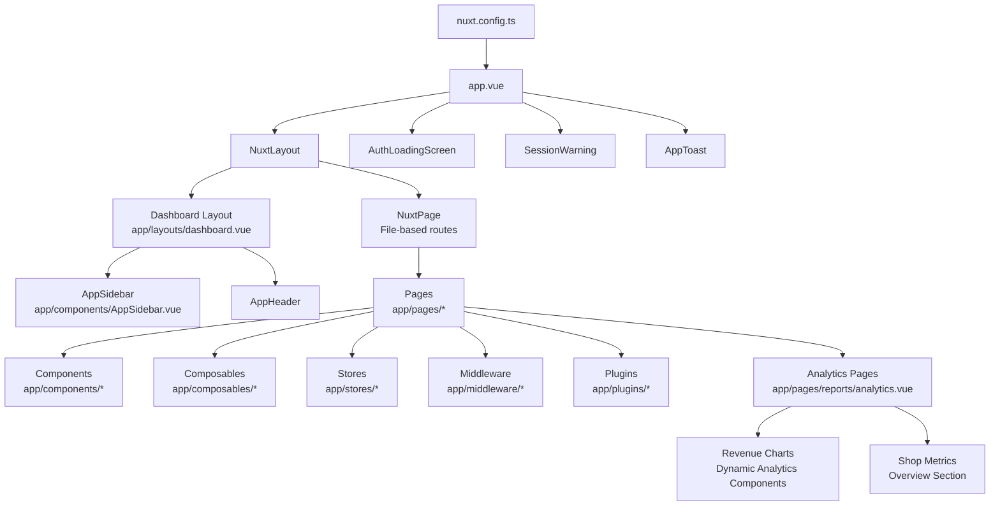
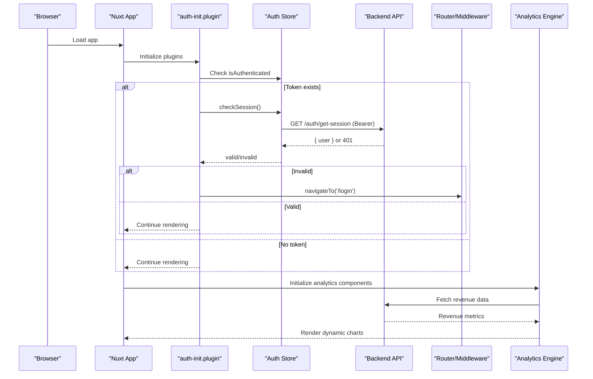
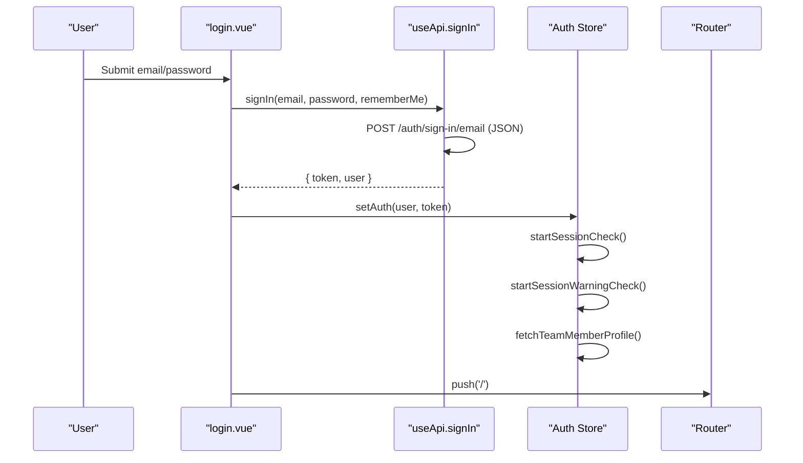
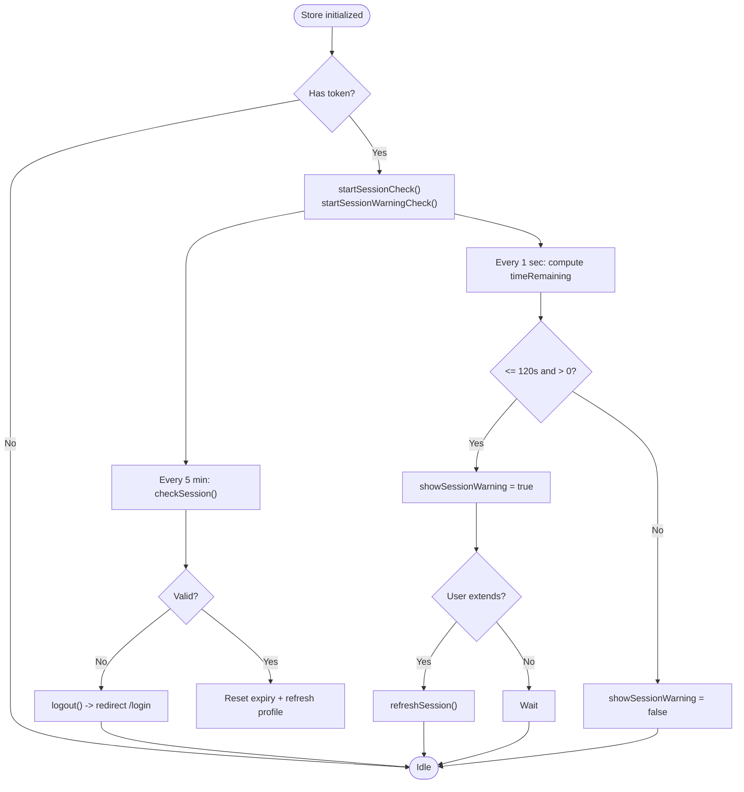
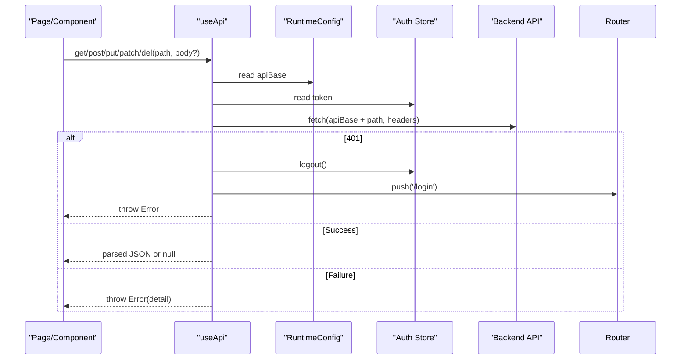
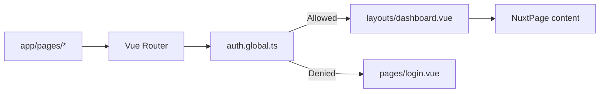
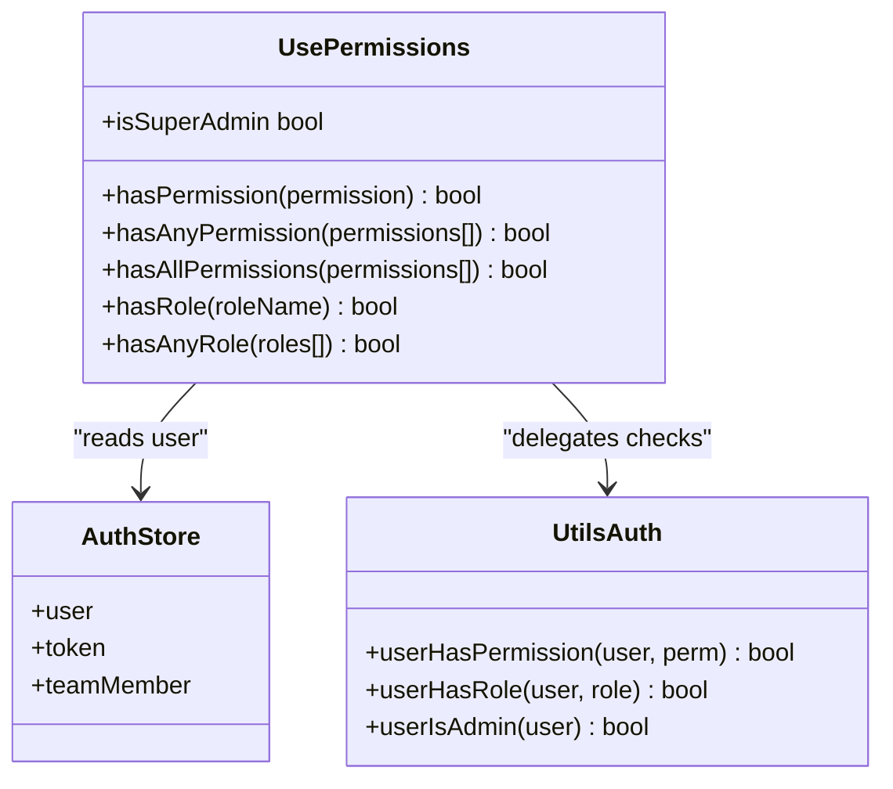
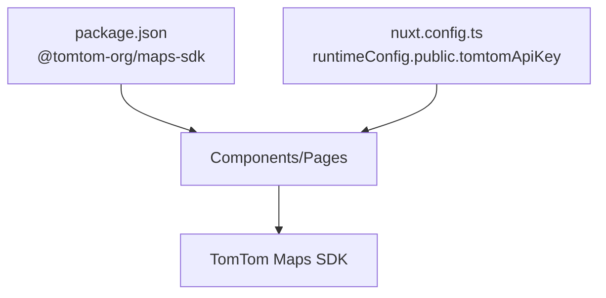
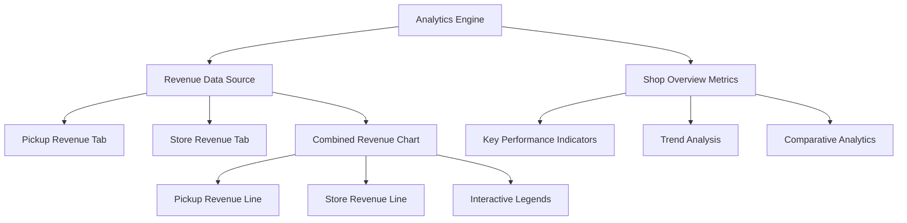
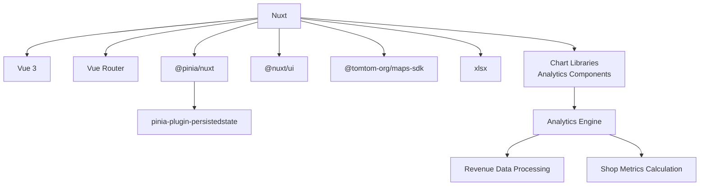

# Architecture & Design

<cite>
**Referenced Files in This Document**
- [nuxt.config.ts](file://nuxt.config.ts)
- [package.json](file://package.json)
- [app.vue](file://app/app.vue)
- [auth-init.client.ts](file://app/plugins/auth-init.client.ts)
- [pinia-persistedstate.client.ts](file://app/plugins/pinia-persistedstate.client.ts)
- [auth.global.ts](file://app/middleware/auth.global.ts)
- [auth.ts](file://app/stores/auth.ts)
- [useApi.ts](file://app/composables/useApi.ts)
- [usePermissions.ts](file://app/composables/usePermissions.ts)
- [auth.ts](file://app/utils/auth.ts)
- [dashboard.vue](file://app/layouts/dashboard.vue)
- [default.vue](file://app/layouts/default.vue)
- [login.vue](file://app/pages/login.vue)
- [AppSidebar.vue](file://app/components/AppSidebar.vue)
- [analytics.vue](file://app/pages/reports/analytics.vue)
- [index.vue](file://app/pages/shop/index.vue)
</cite>

## Update Summary
**Changes Made**
- Added comprehensive documentation for dashboard analytics and revenue integration features
- Updated architecture overview to include dynamic analytics components
- Enhanced component analysis with new analytics and revenue chart implementations
- Added shop overview metrics section documentation
- Updated API integration patterns to reflect enhanced data fetching for analytics

## Table of Contents
1. Introduction
2. Project Structure
3. Core Components
4. Architecture Overview
5. Detailed Component Analysis
6. Analytics and Revenue Integration
7. Dependency Analysis
8. Performance Considerations
9. Troubleshooting Guide
10. Conclusion

## Introduction
This document describes the architecture and design of the Lacarte Atlas Console, a Nuxt.js application built with Vue 3 Composition API. It covers file-based routing, modular component patterns, state management with Pinia (persisted), JWT-based authentication flow, API integration patterns, and integration points for external services such as TomTom Maps SDK. The system has been significantly enhanced with dynamic analytics capabilities, separate pickup and store revenue data tabs, combined revenue charts with distinct lines and legends, and comprehensive shop overview metrics sections. The goal is to provide both high-level context and code-level details to help developers understand system behavior, trade-offs, and constraints.

## Project Structure
The project follows Nuxt's convention-based structure:
- app/pages: File-based routes for all pages (e.g., login, customers, drivers, tracking, reports/analytics).
- app/components: Reusable UI components (modals, headers, sidebars, toasts, analytics charts).
- app/layouts: Layout wrappers for shared chrome (sidebar/header).
- app/stores: Pinia stores for global state (auth).
- app/composables: Shared logic hooks (API client, permissions, error handling).
- app/middleware: Global route guards (authentication, permissions).
- app/plugins: App initialization (auth check on load, persisting store).
- nuxt.config.ts: Framework configuration (modules, runtime config, SSR rules).
- package.json: Dependencies including Nuxt, Vue 3, Pinia, TomTom Maps SDK.

**Diagram sources**
- [nuxt.config.ts:1-46](file://nuxt.config.ts#L1-L46)
- [app.vue:1-33](file://app/app.vue#L1-L33)
- [dashboard.vue:1-25](file://app/layouts/dashboard.vue#L1-L25)
- [AppSidebar.vue:1-319](file://app/components/AppSidebar.vue#L1-L319)
- [analytics.vue:1-200](file://app/pages/reports/analytics.vue#L1-L200)

**Section sources**
- [nuxt.config.ts:1-46](file://nuxt.config.ts#L1-L46)
- [package.json:1-33](file://package.json#L1-L33)
- [app.vue:1-33](file://app/app.vue#L1-L33)

## Core Components
- Application shell (app.vue): Initializes UI framework, shows auth loading screen while checking session, renders layout and pages, and displays session warning and toast notifications.
- Dashboard layout (dashboard.vue): Provides sidebar/header chrome, responsive mobile behavior, and main content slot.
- Sidebar (AppSidebar.vue): Permission-aware navigation with collapsible groups and active state.
- Auth store (auth.ts): Centralized JWT session management, profile fetching, periodic checks, and session warnings.
- API composable (useApi.ts): Typed HTTP wrapper with automatic Authorization header injection, error handling, and convenience methods.
- Permissions composable (usePermissions.ts): Declarative permission/role checks used by UI and middleware.
- Middleware (auth.global.ts): Route guard enforcing authentication and session validity.
- Plugins:
  - auth-init.client.ts: Validates session on app load and redirects if invalid.
  - pinia-persistedstate.client.ts: Enables persistence for Pinia stores.

Key technical decisions:
- Nuxt file-based routing for fast feature development and clear URL-to-file mapping.
- Pinia + persistedstate for durable client-side auth state across reloads.
- Centralized useApi composable for consistent request/response handling and error propagation.
- Global middleware for security-first access control.
- Dynamic analytics components for real-time data visualization and interactive revenue tracking.

**Section sources**
- [app.vue:1-33](file://app/app.vue#L1-L33)
- [dashboard.vue:1-25](file://app/layouts/dashboard.vue#L1-L25)
- [AppSidebar.vue:1-319](file://app/components/AppSidebar.vue#L1-L319)
- [auth.ts:1-230](file://app/stores/auth.ts#L1-L230)
- [useApi.ts:1-91](file://app/composables/useApi.ts#L1-L91)
- [usePermissions.ts:1-43](file://app/composables/usePermissions.ts#L1-L43)
- [auth.global.ts:1-32](file://app/middleware/auth.global.ts#L1-L32)
- [auth-init.client.ts:1-25](file://app/plugins/auth-init.client.ts#L1-L25)
- [pinia-persistedstate.client.ts:1-7](file://app/plugins/pinia-persistedstate.client.ts#L1-L7)

## Architecture Overview
High-level flows:
- App bootstrap: Plugin checks persisted token and validates session; shows loading until resolved.
- Navigation: Middleware enforces authentication and optional session refresh on navigation.
- Data access: Pages/composables call useApi which injects Authorization header and centralizes errors.
- State: Auth store persists user/token/profile and manages session timers.
- External integrations: Runtime config exposes base API and TomTom API key; TomTom Maps SDK is available via dependencies.
- Analytics pipeline: Dynamic data fetching for revenue metrics, combined chart rendering with distinct visualizations, and real-time shop overview updates.

**Diagram sources**
- [auth-init.client.ts:1-25](file://app/plugins/auth-init.client.ts#L1-L25)
- [auth.ts:90-120](file://app/stores/auth.ts#L90-L120)
- [auth.global.ts:1-32](file://app/middleware/auth.global.ts#L1-L32)
- [analytics.vue:1-200](file://app/pages/reports/analytics.vue#L1-L200)

## Detailed Component Analysis

### Authentication Flow (JWT)
The authentication flow uses JWT tokens stored in Pinia with persistence. On app load, a plugin validates the session and redirects to login if invalid. Login page calls the sign-in endpoint, sets auth state, and navigates to the dashboard. Subsequent requests automatically include the Authorization header.

**Diagram sources**
- [login.vue:1-167](file://app/pages/login.vue#L1-L167)
- [useApi.ts:82-89](file://app/composables/useApi.ts#L82-L89)
- [auth.ts:45-57](file://app/stores/auth.ts#L45-L57)
- [auth.ts:15-43](file://app/stores/auth.ts#L15-L43)

**Section sources**
- [login.vue:1-167](file://app/pages/login.vue#L1-L167)
- [useApi.ts:1-91](file://app/composables/useApi.ts#L1-L91)
- [auth.ts:1-230](file://app/stores/auth.ts#L1-L230)

### Session Management and Warnings
The auth store maintains session expiry and runs two intervals:
- Periodic session validation every 5 minutes.
- Warning countdown starting at 2 minutes before expiry, prompting users to extend or dismiss.

**Diagram sources**
- [auth.ts:122-174](file://app/stores/auth.ts#L122-L174)
- [auth.ts:90-120](file://app/stores/auth.ts#L90-L120)
- [auth.ts:176-201](file://app/stores/auth.ts#L176-L201)

**Section sources**
- [auth.ts:122-174](file://app/stores/auth.ts#L122-L174)
- [auth.ts:90-120](file://app/stores/auth.ts#L90-L120)
- [auth.ts:176-201](file://app/stores/auth.ts#L176-L201)

### API Integration Pattern
The useApi composable centralizes HTTP interactions:
- Injects Authorization header when token exists.
- Normalizes success (200/201/204) vs failure responses.
- Handles 401 by logging out and redirecting.
- Wraps common verbs (GET/POST/PUT/PATCH/DELETE) with error-toasting helpers.

**Diagram sources**
- [useApi.ts:1-91](file://app/composables/useApi.ts#L1-L91)
- [nuxt.config.ts:21-26](file://nuxt.config.ts#L21-L26)

**Section sources**
- [useApi.ts:1-91](file://app/composables/useApi.ts#L1-L91)
- [nuxt.config.ts:21-26](file://nuxt.config.ts#L21-L26)

### Routing and Layouts
- File-based routing under app/pages maps directly to URLs.
- Default layout provides minimal wrapper; dashboard layout adds sidebar/header and responsive behavior.
- Middleware protects non-public routes and refreshes sessions on navigation.

**Diagram sources**
- [auth.global.ts:1-32](file://app/middleware/auth.global.ts#L1-L32)
- [dashboard.vue:1-25](file://app/layouts/dashboard.vue#L1-L25)
- [default.vue:1-6](file://app/layouts/default.vue#L1-L6)
- [login.vue:1-167](file://app/pages/login.vue#L1-L167)

**Section sources**
- [auth.global.ts:1-32](file://app/middleware/auth.global.ts#L1-L32)
- [dashboard.vue:1-25](file://app/layouts/dashboard.vue#L1-L25)
- [default.vue:1-6](file://app/layouts/default.vue#L1-L6)

### Permissions and Role-Based UI
- usePermissions composable wraps utility functions from utils/auth to check permissions and roles.
- Sidebar filters navigation items based on required permissions.
- Middleware can be extended to enforce server-side authorization where needed.

**Diagram sources**
- [usePermissions.ts:1-43](file://app/composables/usePermissions.ts#L1-L43)
- [auth.ts:1-230](file://app/stores/auth.ts#L1-L230)
- [auth.ts:1-200](file://app/utils/auth.ts#L1-L200)

**Section sources**
- [usePermissions.ts:1-43](file://app/composables/usePermissions.ts#L1-L43)
- [auth.ts:1-230](file://app/stores/auth.ts#L1-L230)
- [auth.ts:1-200](file://app/utils/auth.ts#L1-L200)

### External Integrations: TomTom Maps SDK
- Dependency declared in package.json.
- Public API key exposed via runtime config for client usage.
- Typical usage would initialize the map within a page/component using the provided key and manage lifecycle accordingly.

**Diagram sources**
- [package.json:14-25](file://package.json#L14-L25)
- [nuxt.config.ts:21-26](file://nuxt.config.ts#L21-L26)

**Section sources**
- [package.json:14-25](file://package.json#L14-L25)
- [nuxt.config.ts:21-26](file://nuxt.config.ts#L21-L26)

## Analytics and Revenue Integration

### Dynamic Analytics System
The analytics system provides comprehensive business intelligence through dynamic data visualization and real-time metric tracking. The system includes separate tabs for pickup and store revenue data, combined revenue charts with distinct visual lines and legends, and a comprehensive shop overview metrics section.

**Diagram sources**
- [analytics.vue:1-200](file://app/pages/reports/analytics.vue#L1-L200)
- [index.vue:1-150](file://app/pages/shop/index.vue#L1-L150)

### Revenue Data Architecture
The revenue integration system handles multiple data streams:
- **Separate Revenue Streams**: Distinct data processing for pickup operations and store sales
- **Unified Visualization**: Combined chart rendering with color-coded lines for different revenue sources
- **Interactive Legends**: Clickable legend elements for filtering and focusing on specific revenue types
- **Real-time Updates**: Dynamic data refreshing without page reloads
- **Metric Aggregation**: Comprehensive shop overview with key performance indicators

### Shop Overview Metrics Section
The shop overview provides a centralized dashboard for monitoring business health:
- **Performance Indicators**: Revenue totals, order counts, customer metrics
- **Trend Analysis**: Historical data comparison and growth patterns
- **Operational Metrics**: Pickup efficiency, store performance, inventory turnover
- **Alert Systems**: Threshold-based notifications for critical metrics

**Section sources**
- [analytics.vue:1-200](file://app/pages/reports/analytics.vue#L1-L200)
- [index.vue:1-150](file://app/pages/shop/index.vue#L1-L150)

## Dependency Analysis
Core runtime dependencies:
- Nuxt 4.x, Vue 3, Vue Router
- Pinia and persistedstate plugin for state persistence
- @nuxt/ui for UI primitives
- @tomtom-org/maps-sdk for mapping features
- xlsx for spreadsheet operations
- Chart libraries for analytics visualization

**Diagram sources**
- [package.json:14-31](file://package.json#L14-L31)

**Section sources**
- [package.json:14-31](file://package.json#L14-L31)

## Performance Considerations
- SSR disabled for sensitive or interactive routes (/login, /forgot-password, /pay/**, /tracking/**) to reduce server overhead and improve interactivity.
- Vite target esnext and dependency optimization configured for modern builds.
- Pinia persistence avoids re-authentication on reload but should be used judiciously to avoid storing excessive data.
- Periodic session checks run every 5 minutes; consider adjusting frequency based on backend capabilities and UX needs.
- Large libraries like xlsx are explicitly optimized; ensure only necessary features are imported.
- Analytics components use lazy loading and virtual scrolling for large datasets.
- Revenue data caching implemented to minimize API calls during chart updates.
- Shop metrics calculations optimized with memoization for real-time performance.

## Troubleshooting Guide
Common issues and resolutions:
- 401 Unauthorized during API calls: useApi logs out and redirects to login. Verify token presence and backend availability.
- Session expires unexpectedly: check backend /auth/get-session behavior and network connectivity; review session intervals in auth store.
- Persistent state not restored: ensure persistedstate plugin is enabled and browser storage is accessible.
- Missing environment variables: confirm NUXT_PUBLIC_API_BASE and NUXT_PUBLIC_TOMTOM_API_KEY are set in runtime config.
- Analytics data not loading: verify revenue API endpoints are accessible and returning expected data formats.
- Chart rendering issues: check browser console for JavaScript errors and ensure chart libraries are properly loaded.
- Shop metrics calculation delays: monitor backend response times and consider implementing data caching strategies.

**Section sources**
- [useApi.ts:39-44](file://app/composables/useApi.ts#L39-L44)
- [auth.ts:90-120](file://app/stores/auth.ts#L90-L120)
- [pinia-persistedstate.client.ts:1-7](file://app/plugins/pinia-persistedstate.client.ts#L1-L7)
- [nuxt.config.ts:21-26](file://nuxt.config.ts#L21-L26)

## Conclusion
The Lacarte Atlas Console leverages Nuxt's conventions for rapid development, Pinia for robust client-side state, and a centralized API layer for consistent communication. Security is enforced through middleware and JWT session management, while extensibility is supported via composables and modular components. External integrations like TomTom Maps SDK are configured via runtime settings, enabling scalable feature growth. The enhanced analytics and revenue integration system provides comprehensive business intelligence through dynamic data visualization, separate revenue tracking for pickups and store operations, unified chart representations with interactive legends, and detailed shop overview metrics for operational insights.