# Authentication & Session Flow

<cite>
**Referenced Files in This Document**
- [auth.global.ts](file://app/middleware/auth.global.ts)
- [permissions.global.ts](file://app/middleware/permissions.global.ts)
- [auth.ts](file://app/stores/auth.ts)
- [useApi.ts](file://app/composables/useApi.ts)
- [auth-init.client.ts](file://app/plugins/auth-init.client.ts)
- [login.vue](file://app/pages/login.vue)
- [app.vue](file://app/app.vue)
- [AuthLoadingScreen.vue](file://app/components/AuthLoadingScreen.vue)
- [SessionWarning.vue](file://app/components/SessionWarning.vue)
- [auth.ts](file://app/utils/auth.ts)
- [usePermissions.ts](file://app/composables/usePermissions.ts)
- [PermissionGuard.vue](file://app/components/PermissionGuard.vue)
- [pinia-persistedstate.client.ts](file://app/plugins/pinia-persistedstate.client.ts)
</cite>

## Table of Contents
1. [Introduction](#introduction)
2. [Project Structure](#project-structure)
3. [Core Components](#core-components)
4. [Architecture Overview](#architecture-overview)
5. [Detailed Component Analysis](#detailed-component-analysis)
6. [Dependency Analysis](#dependency-analysis)
7. [Performance Considerations](#performance-considerations)
8. [Troubleshooting Guide](#troubleshooting-guide)
9. [Conclusion](#conclusion)

## Introduction
This document explains the end-to-end authentication and session management flow for the application. It covers:
- JWT-based login, token storage, and protected route access
- Global middleware for authentication and permissions
- Automatic token validation and unauthorized redirects
- Session warning system with extend functionality
- Initial auth loading screen during app startup
- Complete logout flow
- Token storage strategy, refresh mechanisms, and error handling

## Project Structure
The authentication and session logic is implemented across a small set of focused modules:
- Store: central state for user, token, and session timers
- Middleware: global route guards for auth and permissions
- API composable: attaches tokens to requests and handles 401s
- Plugins: initializes auth checks on app load and persists store
- UI components: login page, auth loading screen, and session warning

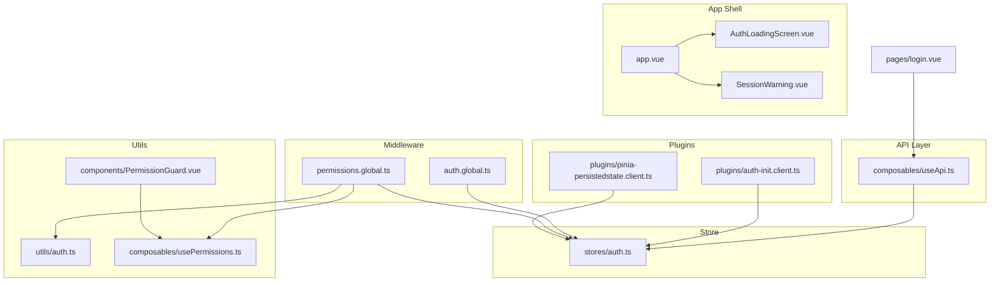

**Diagram sources**
- [app.vue:1-33](file://app/app.vue#L1-L33)
- [AuthLoadingScreen.vue:1-29](file://app/components/AuthLoadingScreen.vue#L1-L29)
- [SessionWarning.vue:1-66](file://app/components/SessionWarning.vue#L1-L66)
- [auth.global.ts:1-32](file://app/middleware/auth.global.ts#L1-L32)
- [permissions.global.ts:1-59](file://app/middleware/permissions.global.ts#L1-L59)
- [auth.ts:1-230](file://app/stores/auth.ts#L1-L230)
- [useApi.ts:1-91](file://app/composables/useApi.ts#L1-L91)
- [auth-init.client.ts:1-25](file://app/plugins/auth-init.client.ts#L1-L25)
- [pinia-persistedstate.client.ts:1-6](file://app/plugins/pinia-persistedstate.client.ts#L1-L6)
- [auth.ts:1-58](file://app/utils/auth.ts#L1-L58)
- [usePermissions.ts:1-43](file://app/composables/usePermissions.ts#L1-L43)
- [PermissionGuard.vue:1-38](file://app/components/PermissionGuard.vue#L1-L38)
- [login.vue:1-167](file://app/pages/login.vue#L1-L167)

**Section sources**
- [app.vue:1-33](file://app/app.vue#L1-L33)
- [auth.global.ts:1-32](file://app/middleware/auth.global.ts#L1-L32)
- [permissions.global.ts:1-59](file://app/middleware/permissions.global.ts#L1-L59)
- [auth.ts:1-230](file://app/stores/auth.ts#L1-L230)
- [useApi.ts:1-91](file://app/composables/useApi.ts#L1-L91)
- [auth-init.client.ts:1-25](file://app/plugins/auth-init.client.ts#L1-L25)
- [pinia-persistedstate.client.ts:1-6](file://app/plugins/pinia-persistedstate.client.ts#L1-L6)
- [auth.ts:1-58](file://app/utils/auth.ts#L1-L58)
- [usePermissions.ts:1-43](file://app/composables/usePermissions.ts#L1-L43)
- [PermissionGuard.vue:1-38](file://app/components/PermissionGuard.vue#L1-L38)
- [login.vue:1-167](file://app/pages/login.vue#L1-L167)

## Core Components
- Auth store (Pinia): Holds user, token, team member profile, session expiry, and UI flags for warnings. Provides methods to set auth, check/refresh session, extend session, dismiss warnings, and logout. Also starts periodic checks and warnings.
- Global auth middleware: Protects routes by checking authentication and validating sessions on navigation.
- Permissions middleware: Enforces role/permission-based access after authentication is confirmed.
- API composable: Attaches Bearer token to all requests and handles 401 responses by logging out and redirecting.
- Initialization plugin: Validates session on app start if a token exists and exposes an auth-checking flag used by the app shell.
- UI components: Login page, auth loading screen, and session warning popup.

**Section sources**
- [auth.ts:1-230](file://app/stores/auth.ts#L1-L230)
- [auth.global.ts:1-32](file://app/middleware/auth.global.ts#L1-L32)
- [permissions.global.ts:1-59](file://app/middleware/permissions.global.ts#L1-L59)
- [useApi.ts:1-91](file://app/composables/useApi.ts#L1-L91)
- [auth-init.client.ts:1-25](file://app/plugins/auth-init.client.ts#L1-L25)
- [AuthLoadingScreen.vue:1-29](file://app/components/AuthLoadingScreen.vue#L1-L29)
- [SessionWarning.vue:1-66](file://app/components/SessionWarning.vue#L1-L66)
- [login.vue:1-167](file://app/pages/login.vue#L1-L167)

## Architecture Overview
The flow spans from login through protected route access, with continuous session validation and user-facing warnings.

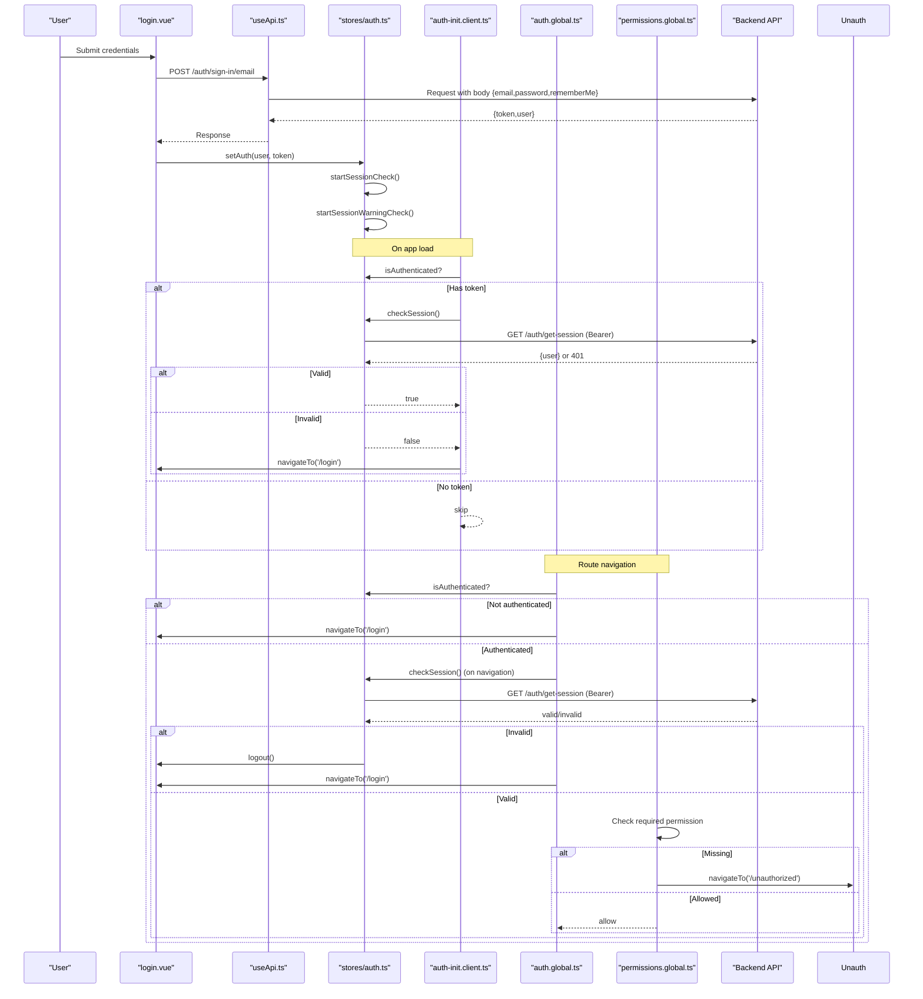

**Diagram sources**
- [login.vue:1-167](file://app/pages/login.vue#L1-L167)
- [useApi.ts:1-91](file://app/composables/useApi.ts#L1-L91)
- [auth.ts:1-230](file://app/stores/auth.ts#L1-L230)
- [auth-init.client.ts:1-25](file://app/plugins/auth-init.client.ts#L1-L25)
- [auth.global.ts:1-32](file://app/middleware/auth.global.ts#L1-L32)
- [permissions.global.ts:1-59](file://app/middleware/permissions.global.ts#L1-L59)

## Detailed Component Analysis

### Login Flow
- The login page validates inputs, calls the sign-in endpoint via the API composable, and upon success stores the user and token in the auth store.
- The store sets a session expiry window, fetches the team member profile to enrich roles/permissions, and starts background session checks and warnings.

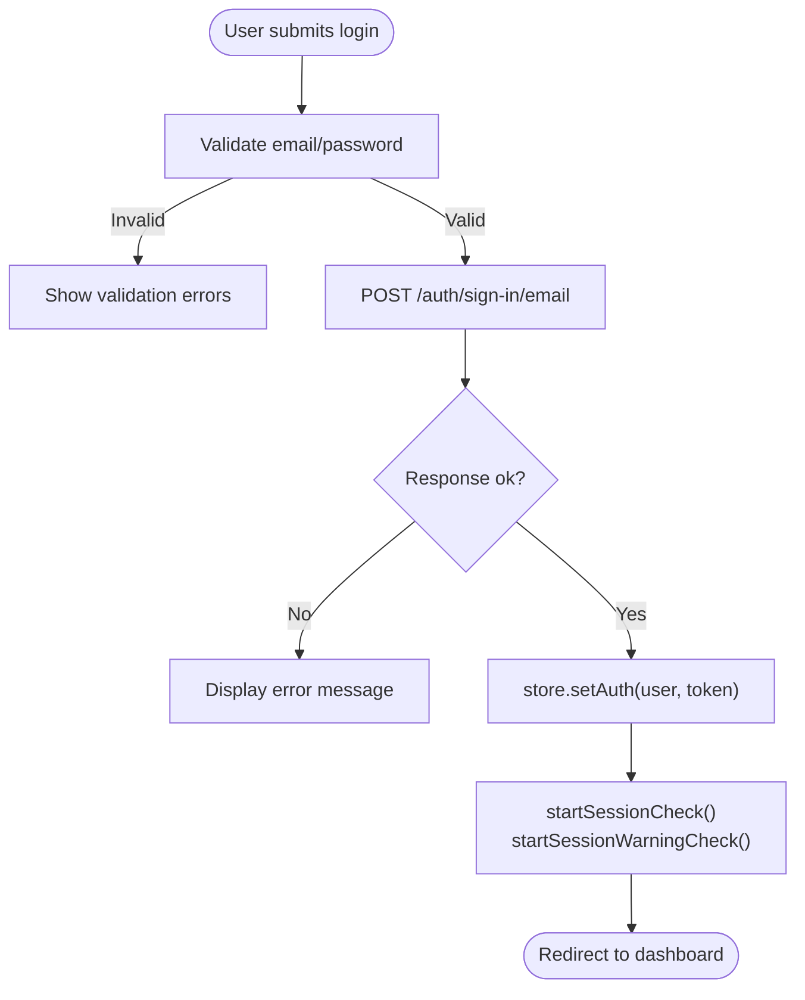

**Diagram sources**
- [login.vue:1-167](file://app/pages/login.vue#L1-L167)
- [useApi.ts:1-91](file://app/composables/useApi.ts#L1-L91)
- [auth.ts:1-230](file://app/stores/auth.ts#L1-L230)

**Section sources**
- [login.vue:1-167](file://app/pages/login.vue#L1-L167)
- [useApi.ts:1-91](file://app/composables/useApi.ts#L1-L91)
- [auth.ts:45-57](file://app/stores/auth.ts#L45-L57)

### Global Authentication Middleware
- Public routes are allowed without authentication.
- If not authenticated, users are redirected to login.
- On navigation between routes (not initial load), the middleware re-validates the session; invalid sessions trigger logout and redirect.

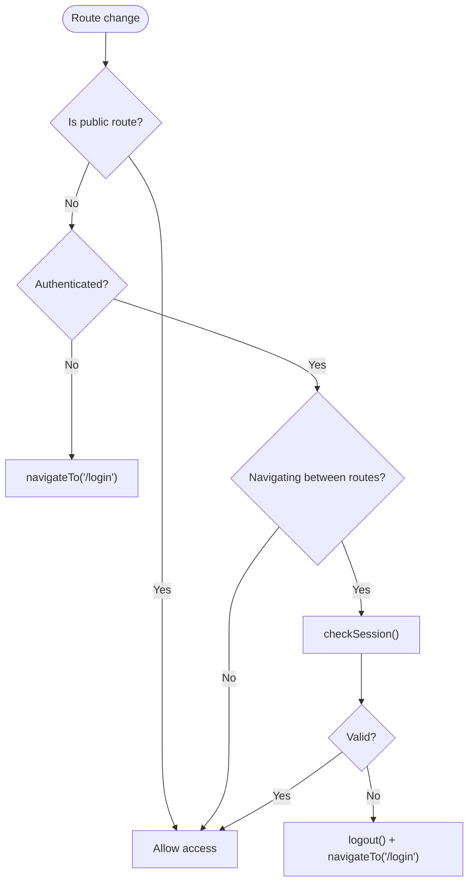

**Diagram sources**
- [auth.global.ts:1-32](file://app/middleware/auth.global.ts#L1-L32)
- [auth.ts:90-120](file://app/stores/auth.ts#L90-L120)

**Section sources**
- [auth.global.ts:1-32](file://app/middleware/auth.global.ts#L1-L32)
- [auth.ts:90-120](file://app/stores/auth.ts#L90-L120)

### Permissions Middleware
- After authentication is confirmed, this middleware enforces route-level permissions using a mapping table.
- Admin/Super Admin bypasses specific permission checks.
- Missing permissions redirect to an unauthorized page.

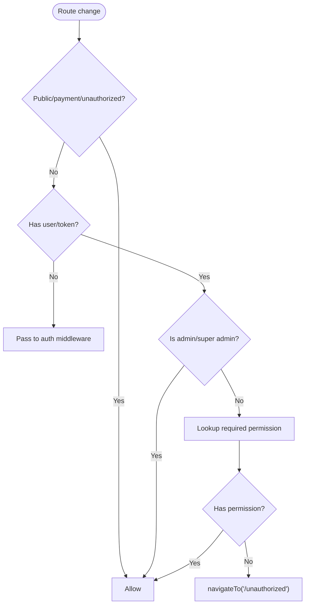

**Diagram sources**
- [permissions.global.ts:1-59](file://app/middleware/permissions.global.ts#L1-L59)
- [auth.ts:1-58](file://app/utils/auth.ts#L1-L58)

**Section sources**
- [permissions.global.ts:1-59](file://app/middleware/permissions.global.ts#L1-L59)
- [auth.ts:1-58](file://app/utils/auth.ts#L1-L58)

### API Composable and Token Attachment
- Every request automatically includes Authorization header when a token is present.
- On 401 responses, the composable logs out the user and redirects to login, then throws a user-friendly error.

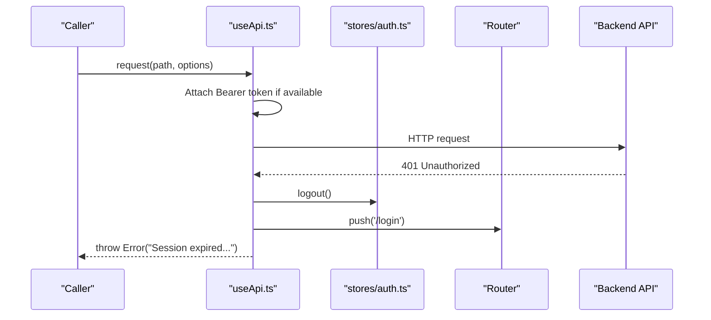

**Diagram sources**
- [useApi.ts:1-91](file://app/composables/useApi.ts#L1-L91)
- [auth.ts:176-201](file://app/stores/auth.ts#L176-L201)

**Section sources**
- [useApi.ts:1-91](file://app/composables/useApi.ts#L1-L91)
- [auth.ts:176-201](file://app/stores/auth.ts#L176-L201)

### Session Warning System
- A timer tracks remaining session time and shows a warning within two minutes before expiry.
- Users can extend the session (which refreshes it) or dismiss the warning.
- When the session expires, the system logs out automatically.

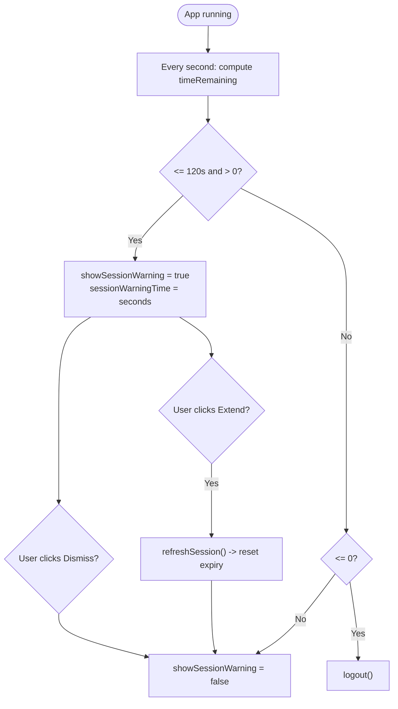

**Diagram sources**
- [auth.ts:122-146](file://app/stores/auth.ts#L122-L146)
- [SessionWarning.vue:1-66](file://app/components/SessionWarning.vue#L1-L66)

**Section sources**
- [auth.ts:122-146](file://app/stores/auth.ts#L122-L146)
- [SessionWarning.vue:1-66](file://app/components/SessionWarning.vue#L1-L66)

### Initial Auth Loading Screen
- During app initialization, if a token exists, the plugin validates the session and marks the check as complete.
- The app shell displays an overlay while the check is in progress.

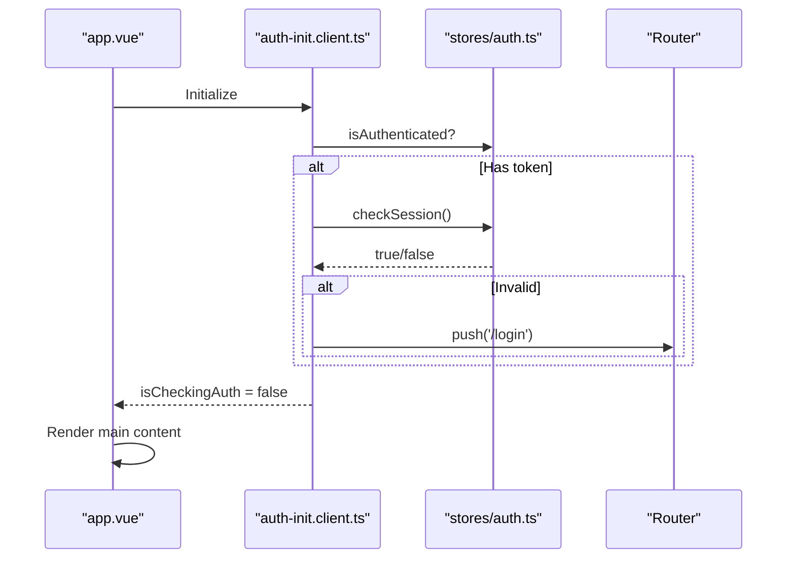

**Diagram sources**
- [app.vue:1-33](file://app/app.vue#L1-L33)
- [auth-init.client.ts:1-25](file://app/plugins/auth-init.client.ts#L1-L25)
- [AuthLoadingScreen.vue:1-29](file://app/components/AuthLoadingScreen.vue#L1-L29)

**Section sources**
- [app.vue:1-33](file://app/app.vue#L1-L33)
- [auth-init.client.ts:1-25](file://app/plugins/auth-init.client.ts#L1-L25)
- [AuthLoadingScreen.vue:1-29](file://app/components/AuthLoadingScreen.vue#L1-L29)

### Logout Flow
- Stops background timers, optionally calls server-side sign-out, clears local state, and resets UI flags.

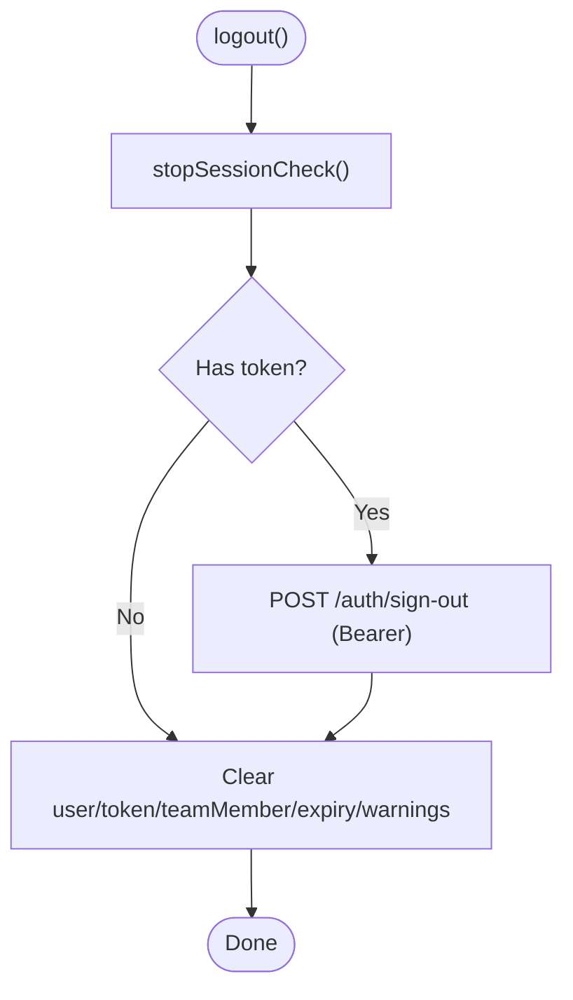

**Diagram sources**
- [auth.ts:176-201](file://app/stores/auth.ts#L176-L201)

**Section sources**
- [auth.ts:176-201](file://app/stores/auth.ts#L176-L201)

### Token Storage Strategy and Persistence
- Tokens and user data are stored in Pinia state and persisted across reloads via the pinia-plugin-persistedstate plugin.
- This ensures that on app restart, existing sessions can be validated immediately.

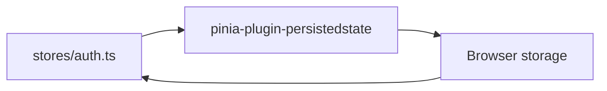

**Diagram sources**
- [auth.ts:227-229](file://app/stores/auth.ts#L227-L229)
- [pinia-persistedstate.client.ts:1-6](file://app/plugins/pinia-persistedstate.client.ts#L1-L6)

**Section sources**
- [auth.ts:227-229](file://app/stores/auth.ts#L227-L229)
- [pinia-persistedstate.client.ts:1-6](file://app/plugins/pinia-persistedstate.client.ts#L1-L6)

### Role and Permission Utilities
- Utility functions normalize roles and evaluate permissions and roles consistently across the app.
- The PermissionGuard component uses these utilities to conditionally render content based on user capabilities.

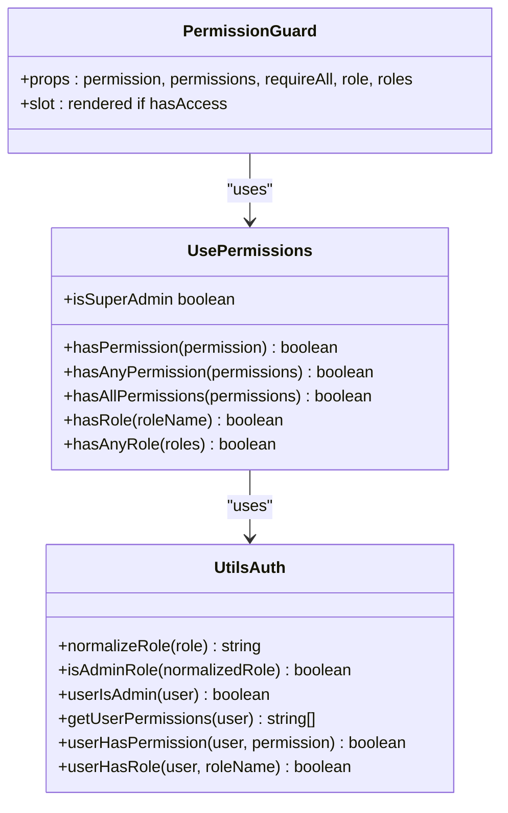

**Diagram sources**
- [auth.ts:1-58](file://app/utils/auth.ts#L1-L58)
- [usePermissions.ts:1-43](file://app/composables/usePermissions.ts#L1-L43)
- [PermissionGuard.vue:1-38](file://app/components/PermissionGuard.vue#L1-L38)

**Section sources**
- [auth.ts:1-58](file://app/utils/auth.ts#L1-L58)
- [usePermissions.ts:1-43](file://app/composables/usePermissions.ts#L1-L43)
- [PermissionGuard.vue:1-38](file://app/components/PermissionGuard.vue#L1-L38)

## Dependency Analysis
- The auth store is the central dependency for authentication state and session lifecycle.
- Middleware depends on the store to enforce access control.
- The API composable depends on the store to attach tokens and handle 401s.
- The initialization plugin depends on the store to validate sessions at startup.
- UI components depend on the store for rendering warnings and controlling actions.

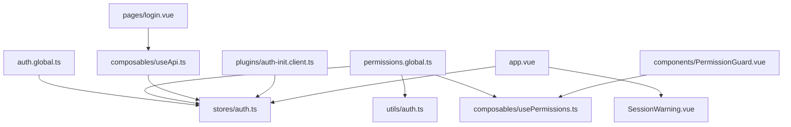

**Diagram sources**
- [auth.ts:1-230](file://app/stores/auth.ts#L1-L230)
- [auth.global.ts:1-32](file://app/middleware/auth.global.ts#L1-L32)
- [permissions.global.ts:1-59](file://app/middleware/permissions.global.ts#L1-L59)
- [useApi.ts:1-91](file://app/composables/useApi.ts#L1-L91)
- [auth-init.client.ts:1-25](file://app/plugins/auth-init.client.ts#L1-L25)
- [app.vue:1-33](file://app/app.vue#L1-L33)
- [SessionWarning.vue:1-66](file://app/components/SessionWarning.vue#L1-L66)
- [login.vue:1-167](file://app/pages/login.vue#L1-L167)
- [auth.ts:1-58](file://app/utils/auth.ts#L1-L58)
- [usePermissions.ts:1-43](file://app/composables/usePermissions.ts#L1-L43)
- [PermissionGuard.vue:1-38](file://app/components/PermissionGuard.vue#L1-L38)

**Section sources**
- [auth.ts:1-230](file://app/stores/auth.ts#L1-L230)
- [auth.global.ts:1-32](file://app/middleware/auth.global.ts#L1-L32)
- [permissions.global.ts:1-59](file://app/middleware/permissions.global.ts#L1-L59)
- [useApi.ts:1-91](file://app/composables/useApi.ts#L1-L91)
- [auth-init.client.ts:1-25](file://app/plugins/auth-init.client.ts#L1-L25)
- [app.vue:1-33](file://app/app.vue#L1-L33)
- [SessionWarning.vue:1-66](file://app/components/SessionWarning.vue#L1-L66)
- [login.vue:1-167](file://app/pages/login.vue#L1-L167)
- [auth.ts:1-58](file://app/utils/auth.ts#L1-L58)
- [usePermissions.ts:1-43](file://app/composables/usePermissions.ts#L1-L43)
- [PermissionGuard.vue:1-38](file://app/components/PermissionGuard.vue#L1-L38)

## Performance Considerations
- Periodic session checks run every five minutes; ensure backend endpoints respond quickly to avoid UI jank.
- Session warning interval runs every second; keep computations minimal to prevent unnecessary re-renders.
- Avoid redundant profile fetches; the store already refreshes profile data on session validation.
- Consider debouncing or throttling UI interactions around session extension if needed.

## Troubleshooting Guide
- 401 Unauthorized: The API composable will log out the user and redirect to login. Verify network connectivity and token validity.
- Session unexpectedly expires: Check server-side session configuration and ensure the get-session endpoint responds correctly.
- Warning does not appear: Ensure session expiry is set and intervals are started after successful authentication.
- Redirect loops: Confirm public route lists and middleware order; ensure initial auth check completes before routing proceeds.

**Section sources**
- [useApi.ts:39-44](file://app/composables/useApi.ts#L39-L44)
- [auth.ts:90-120](file://app/stores/auth.ts#L90-L120)
- [auth.global.ts:15-30](file://app/middleware/auth.global.ts#L15-L30)

## Conclusion
The application implements a robust JWT-based authentication and session management system with clear separation of concerns:
- Centralized state and lifecycle in the auth store
- Global middleware for protection and permissions
- Automatic token attachment and centralized 401 handling
- Proactive session warnings with extend capability
- Persistent storage for seamless reloads
- Clean logout flow with server-side cleanup