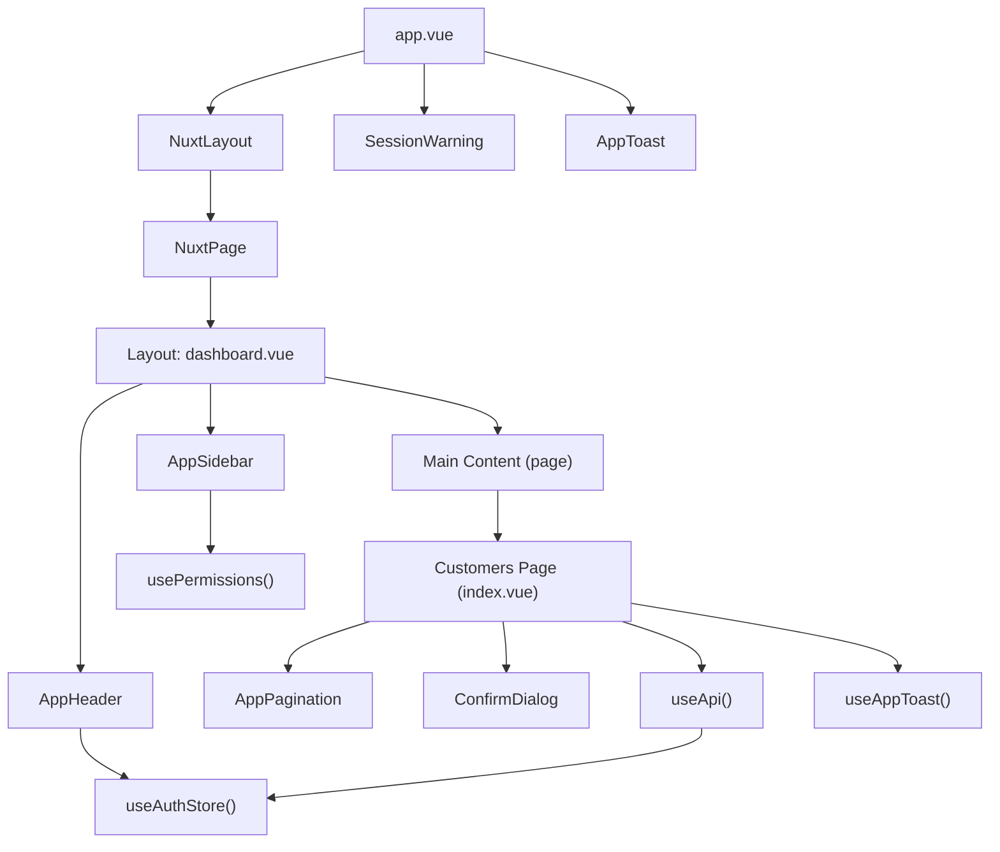
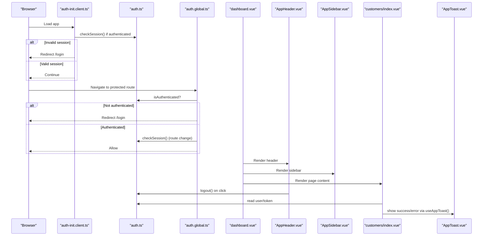
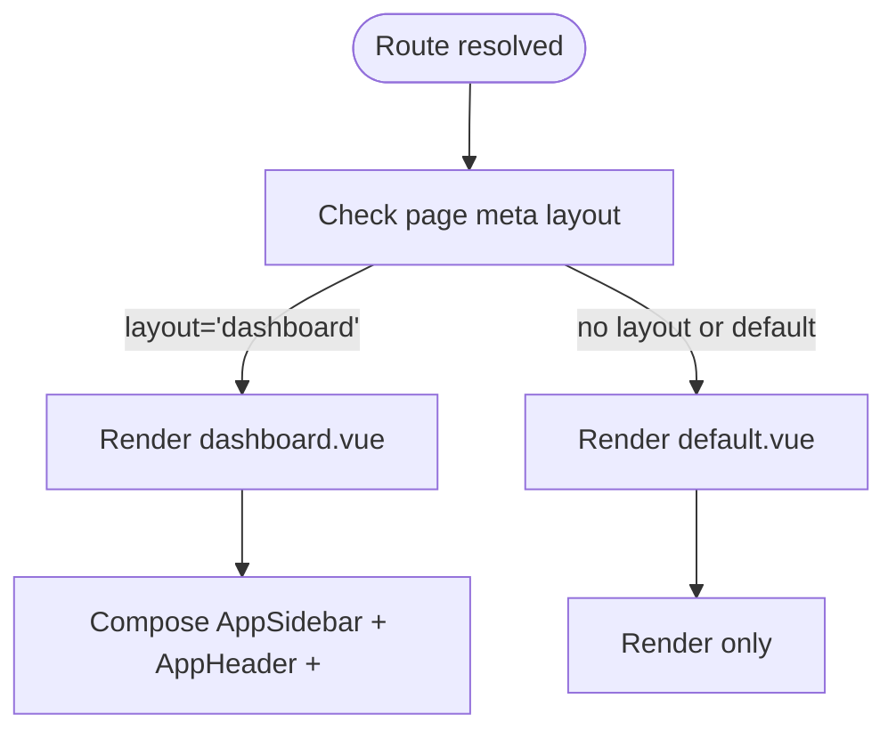
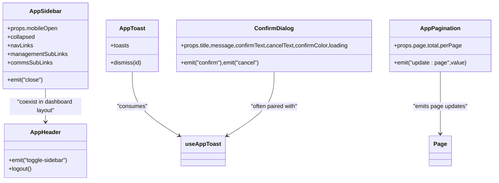
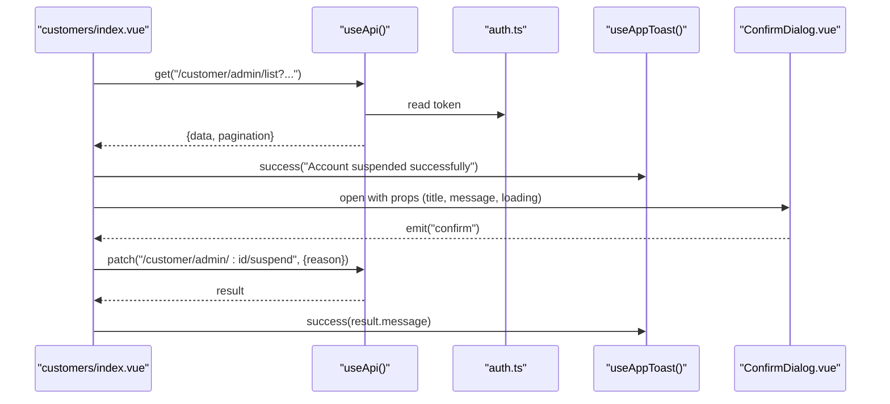
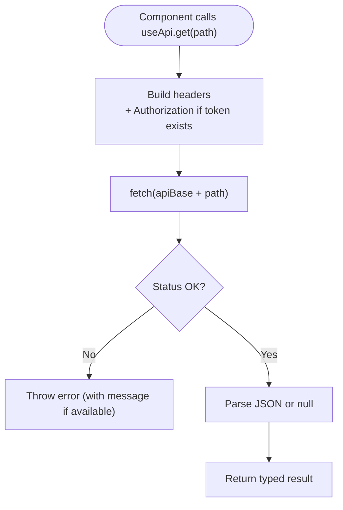
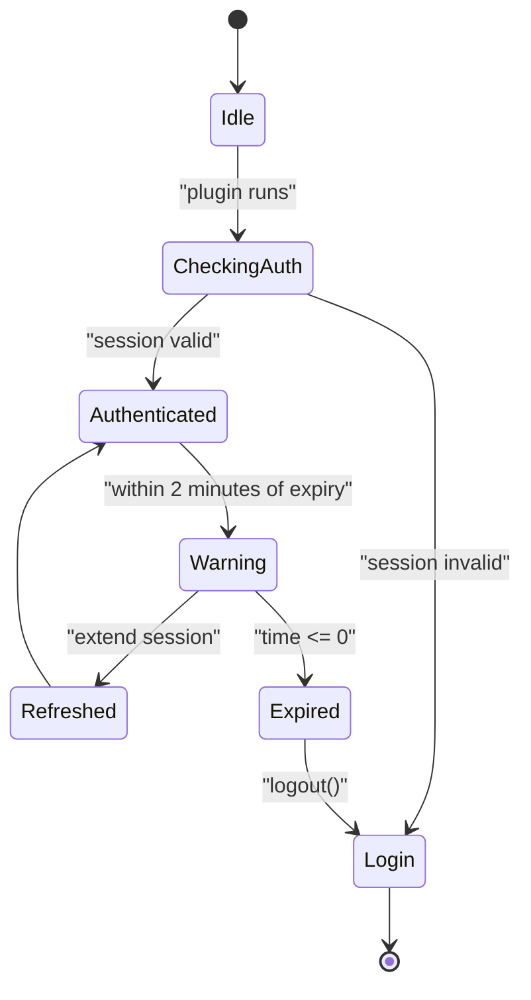
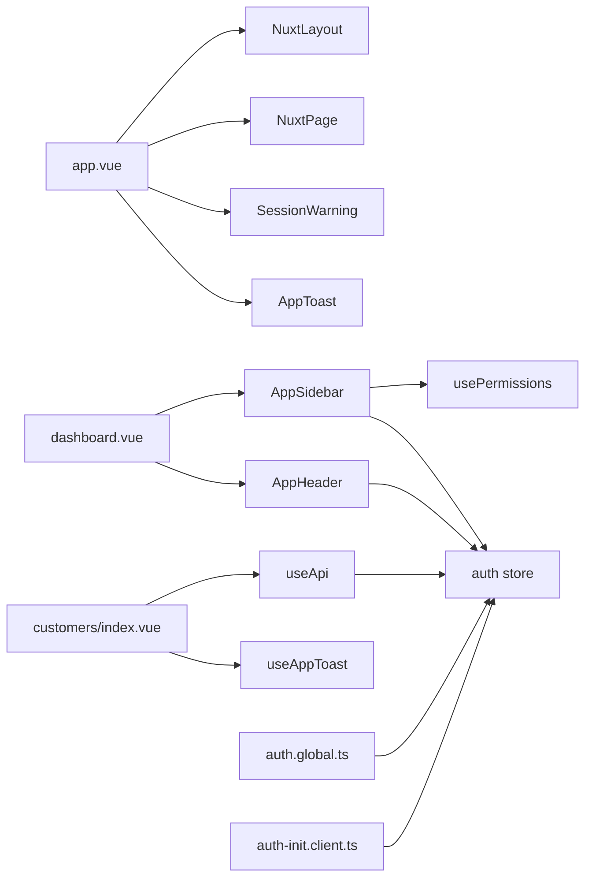

# Component Hierarchy & Patterns

<cite>
**Referenced Files in This Document**
- [app.vue](file://app/app.vue)
- [default.vue](file://app/layouts/default.vue)
- [dashboard.vue](file://app/layouts/dashboard.vue)
- [AppHeader.vue](file://app/components/AppHeader.vue)
- [AppSidebar.vue](file://app/components/AppSidebar.vue)
- [AppToast.vue](file://app/components/AppToast.vue)
- [useApi.ts](file://app/composables/useApi.ts)
- [usePermissions.ts](file://app/composables/usePermissions.ts)
- [useToast.ts](file://app/composables/useToast.ts)
- [auth.ts](file://app/stores/auth.ts)
- [customers/index.vue](file://app/pages/customers/index.vue)
- [ConfirmDialog.vue](file://app/components/ConfirmDialog.vue)
- [AppPagination.vue](file://app/components/AppPagination.vue)
- [auth.global.ts](file://app/middleware/auth.global.ts)
- [auth-init.client.ts](file://app/plugins/auth-init.client.ts)
</cite>

## Table of Contents
1. Introduction
2. Project Structure
3. Core Components
4. Architecture Overview
5. Detailed Component Analysis
6. Dependency Analysis
7. Performance Considerations
8. Troubleshooting Guide
9. Conclusion

## Introduction
This document explains the component hierarchy and architectural patterns used across the Lacarte Atlas Console. It focuses on:
- Layout system (default vs dashboard layouts) and when each is used
- Reusable UI components, page-specific components, and shared business logic via composables
- Component lifecycle management, prop drilling avoidance through composables, and event handling patterns
- Examples of parent-child relationships and data flow between components

The goal is to provide a clear mental model for both new contributors and experienced developers working with the application’s frontend architecture.

## Project Structure
At a high level, the app follows Nuxt 3 conventions:
- Root shell: app.vue orchestrates global UI (UApp), layout selection, session warning, and toast container
- Layouts: default.vue provides a minimal wrapper; dashboard.vue composes AppSidebar + AppHeader + main content area
- Pages: feature pages (e.g., customers/index.vue) declare their layout and compose reusable components
- Composables: useApi, usePermissions, useToast encapsulate cross-cutting concerns
- Store: auth.ts manages authentication state, session checks, and user profile enrichment
- Middleware: auth.global.ts enforces route-level access control
- Plugin: auth-init.client.ts initializes session checks on client startup

**Diagram sources**
- [app.vue:1-33](file://app/app.vue#L1-L33)
- [dashboard.vue:1-25](file://app/layouts/dashboard.vue#L1-L25)
- [AppHeader.vue:1-94](file://app/components/AppHeader.vue#L1-L94)
- [AppSidebar.vue:1-319](file://app/components/AppSidebar.vue#L1-L319)
- [customers/index.vue:1-352](file://app/pages/customers/index.vue#L1-L352)
- [AppPagination.vue:1-48](file://app/components/AppPagination.vue#L1-L48)
- [ConfirmDialog.vue:1-53](file://app/components/ConfirmDialog.vue#L1-L53)
- [useApi.ts:1-91](file://app/composables/useApi.ts#L1-L91)
- [usePermissions.ts:1-43](file://app/composables/usePermissions.ts#L1-L43)
- [auth.ts:1-230](file://app/stores/auth.ts#L1-L230)

**Section sources**
- [app.vue:1-33](file://app/app.vue#L1-L33)
- [default.vue:1-6](file://app/layouts/default.vue#L1-L6)
- [dashboard.vue:1-25](file://app/layouts/dashboard.vue#L1-L25)

## Core Components
- Global shell (app.vue):
  - Provides UApp root, renders NuxtLayout/NuxtPage, shows AuthLoadingScreen during auth check, SessionWarning, and AppToast
- Layouts:
  - default.vue: minimal wrapper that renders slot content
  - dashboard.vue: full-screen flex layout with sidebar, header, and scrollable main area; handles mobile sidebar open/close and closes it on navigation
- Shared UI:
  - AppHeader: displays search input, user info, logout action, emits toggle-sidebar for mobile
  - AppSidebar: permission-aware navigation, collapsible, active route highlighting, sub-groups (Management, Communications)
  - AppToast: renders toasts from useAppToast store with animations
  - ConfirmDialog: generic confirmation modal with props and confirm/cancel events
  - AppPagination: controlled pagination component emitting update:page
- Business logic composables:
  - useApi: typed HTTP helpers with automatic Authorization header, error handling, and 401 redirect
  - usePermissions: permission/role checks against auth store
  - useToast: global toast state and helpers
- State:
  - auth store: token, user, team member profile, session expiry, periodic checks, warnings, logout

**Section sources**
- [app.vue:1-33](file://app/app.vue#L1-L33)
- [default.vue:1-6](file://app/layouts/default.vue#L1-L6)
- [dashboard.vue:1-25](file://app/layouts/dashboard.vue#L1-L25)
- [AppHeader.vue:1-94](file://app/components/AppHeader.vue#L1-L94)
- [AppSidebar.vue:1-319](file://app/components/AppSidebar.vue#L1-L319)
- [AppToast.vue:1-115](file://app/components/AppToast.vue#L1-L115)
- [ConfirmDialog.vue:1-53](file://app/components/ConfirmDialog.vue#L1-L53)
- [AppPagination.vue:1-48](file://app/components/AppPagination.vue#L1-L48)
- [useApi.ts:1-91](file://app/composables/useApi.ts#L1-L91)
- [usePermissions.ts:1-43](file://app/composables/usePermissions.ts#L1-L43)
- [useToast.ts:1-37](file://app/composables/useToast.ts#L1-L37)
- [auth.ts:1-230](file://app/stores/auth.ts#L1-L230)

## Architecture Overview
The application uses a layered architecture:
- Presentation layer: pages compose layout and UI components
- Composition layer: composables encapsulate side effects and shared logic
- State layer: Pinia store centralizes auth/session state
- Routing layer: Nuxt middleware enforces authentication and permissions at route boundaries
- Infrastructure: plugin initializes auth state on client load

**Diagram sources**
- [auth-init.client.ts:1-25](file://app/plugins/auth-init.client.ts#L1-L25)
- [auth.global.ts:1-32](file://app/middleware/auth.global.ts#L1-L32)
- [dashboard.vue:1-25](file://app/layouts/dashboard.vue#L1-L25)
- [AppHeader.vue:1-94](file://app/components/AppHeader.vue#L1-L94)
- [AppSidebar.vue:1-319](file://app/components/AppSidebar.vue#L1-L319)
- [customers/index.vue:1-352](file://app/pages/customers/index.vue#L1-L352)
- [auth.ts:1-230](file://app/stores/auth.ts#L1-L230)
- [AppToast.vue:1-115](file://app/components/AppToast.vue#L1-L115)

## Detailed Component Analysis

### Layout System: Default vs Dashboard
- default.vue:
  - Minimal wrapper; used when no specific layout is required
- dashboard.vue:
  - Full-screen layout with sidebar and header
  - Manages mobile sidebar state and closes it on route changes
  - Emits toggle-sidebar to AppHeader for mobile menu control
- Usage:
  - Pages can opt into dashboard layout using definePageMeta({ layout: 'dashboard' })

**Diagram sources**
- [dashboard.vue:1-25](file://app/layouts/dashboard.vue#L1-L25)
- [default.vue:1-6](file://app/layouts/default.vue#L1-L6)
- [customers/index.vue:1-10](file://app/pages/customers/index.vue#L1-L10)

**Section sources**
- [dashboard.vue:1-25](file://app/layouts/dashboard.vue#L1-L25)
- [default.vue:1-6](file://app/layouts/default.vue#L1-L6)
- [customers/index.vue:1-10](file://app/pages/customers/index.vue#L1-L10)

### Reusable UI Components
- AppHeader:
  - Responsibilities: display user info, trigger logout, emit toggle-sidebar
  - Events: toggle-sidebar emitted to parent layout
  - Data source: auth store for user details
- AppSidebar:
  - Responsibilities: render navigation links, manage collapsed state, highlight active routes, filter by permissions
  - Props: mobileOpen controls visibility on mobile
  - Events: close emitted to parent layout
  - Logic: computed nav groups filtered by usePermissions
- AppToast:
  - Responsibilities: render toasts from useAppToast
  - Behavior: auto-dismiss after duration, dismiss on close button
- ConfirmDialog:
  - Responsibilities: present confirmation prompts
  - Props: title, message, confirmText, cancelText, confirmColor, loading
  - Events: confirm, cancel
- AppPagination:
  - Responsibilities: render page buttons and range info
  - Props: page, total, perPage
  - Events: update:page for two-way binding

**Diagram sources**
- [AppHeader.vue:1-94](file://app/components/AppHeader.vue#L1-L94)
- [AppSidebar.vue:1-319](file://app/components/AppSidebar.vue#L1-L319)
- [AppToast.vue:1-115](file://app/components/AppToast.vue#L1-L115)
- [ConfirmDialog.vue:1-53](file://app/components/ConfirmDialog.vue#L1-L53)
- [AppPagination.vue:1-48](file://app/components/AppPagination.vue#L1-L48)

**Section sources**
- [AppHeader.vue:1-94](file://app/components/AppHeader.vue#L1-L94)
- [AppSidebar.vue:1-319](file://app/components/AppSidebar.vue#L1-L319)
- [AppToast.vue:1-115](file://app/components/AppToast.vue#L1-L115)
- [ConfirmDialog.vue:1-53](file://app/components/ConfirmDialog.vue#L1-L53)
- [AppPagination.vue:1-48](file://app/components/AppPagination.vue#L1-L48)

### Page-Specific Components and Composition Example: Customers List
- The Customers page demonstrates typical composition:
  - Declares dashboard layout
  - Uses useApi for data fetching and mutations
  - Uses useAppToast for feedback
  - Renders AppPagination for list paging
  - Opens modals (CustomerModal, SuspendModal, ConfirmDialog) based on local state
- Data flow:
  - Parent page holds list state and filters
  - Child components receive props (e.g., selected customer) and emit events back to parent
  - Side effects (API calls) are handled in the parent, which then updates reactive state and triggers toasts

**Diagram sources**
- [customers/index.vue:1-352](file://app/pages/customers/index.vue#L1-L352)
- [useApi.ts:1-91](file://app/composables/useApi.ts#L1-L91)
- [auth.ts:1-230](file://app/stores/auth.ts#L1-L230)
- [useToast.ts:1-37](file://app/composables/useToast.ts#L1-L37)
- [ConfirmDialog.vue:1-53](file://app/components/ConfirmDialog.vue#L1-L53)

**Section sources**
- [customers/index.vue:1-352](file://app/pages/customers/index.vue#L1-L352)
- [AppPagination.vue:1-48](file://app/components/AppPagination.vue#L1-L48)
- [ConfirmDialog.vue:1-53](file://app/components/ConfirmDialog.vue#L1-L53)

### Shared Business Logic via Composables
- useApi:
  - Adds Authorization header from auth store
  - Normalizes responses and errors
  - Handles 401 by logging out and redirecting
  - Provides typed helpers (get, post, put, patch, del) and a raw request method
- usePermissions:
  - Exposes hasPermission, hasAnyPermission, hasAllPermissions, hasRole, hasAnyRole, isSuperAdmin
  - Reads current user from auth store
- useToast:
  - Maintains global toast queue
  - Provides convenience methods for types (success, error, warning, info)

**Diagram sources**
- [useApi.ts:1-91](file://app/composables/useApi.ts#L1-L91)
- [auth.ts:1-230](file://app/stores/auth.ts#L1-L230)

**Section sources**
- [useApi.ts:1-91](file://app/composables/useApi.ts#L1-L91)
- [usePermissions.ts:1-43](file://app/composables/usePermissions.ts#L1-L43)
- [useToast.ts:1-37](file://app/composables/useToast.ts#L1-L37)

### Authentication and Session Lifecycle
- On app load:
  - Plugin checks session if authenticated and redirects to login if invalid
- On route navigation:
  - Middleware ensures authentication and validates session on route changes
- In-app:
  - Periodic session checks and warning countdown
  - Logout clears state and navigates to login

**Diagram sources**
- [auth-init.client.ts:1-25](file://app/plugins/auth-init.client.ts#L1-L25)
- [auth.global.ts:1-32](file://app/middleware/auth.global.ts#L1-L32)
- [auth.ts:1-230](file://app/stores/auth.ts#L1-L230)

**Section sources**
- [auth-init.client.ts:1-25](file://app/plugins/auth-init.client.ts#L1-L25)
- [auth.global.ts:1-32](file://app/middleware/auth.global.ts#L1-L32)
- [auth.ts:1-230](file://app/stores/auth.ts#L1-L230)

## Dependency Analysis
Key dependency relationships:
- app.vue depends on NuxtLayout/NuxtPage, SessionWarning, AppToast
- dashboard.vue composes AppSidebar and AppHeader
- AppSidebar depends on usePermissions and auth store
- AppHeader depends on auth store and router
- Pages depend on useApi, useAppToast, and UI primitives
- useApi depends on auth store and runtime config
- Middleware depends on auth store and router
- Plugin depends on auth store and router

**Diagram sources**
- [app.vue:1-33](file://app/app.vue#L1-L33)
- [dashboard.vue:1-25](file://app/layouts/dashboard.vue#L1-L25)
- [AppSidebar.vue:1-319](file://app/components/AppSidebar.vue#L1-L319)
- [AppHeader.vue:1-94](file://app/components/AppHeader.vue#L1-L94)
- [customers/index.vue:1-352](file://app/pages/customers/index.vue#L1-L352)
- [useApi.ts:1-91](file://app/composables/useApi.ts#L1-L91)
- [usePermissions.ts:1-43](file://app/composables/usePermissions.ts#L1-L43)
- [auth.ts:1-230](file://app/stores/auth.ts#L1-L230)
- [auth.global.ts:1-32](file://app/middleware/auth.global.ts#L1-L32)
- [auth-init.client.ts:1-25](file://app/plugins/auth-init.client.ts#L1-L25)

**Section sources**
- [app.vue:1-33](file://app/app.vue#L1-L33)
- [dashboard.vue:1-25](file://app/layouts/dashboard.vue#L1-L25)
- [AppSidebar.vue:1-319](file://app/components/AppSidebar.vue#L1-L319)
- [AppHeader.vue:1-94](file://app/components/AppHeader.vue#L1-L94)
- [customers/index.vue:1-352](file://app/pages/customers/index.vue#L1-L352)
- [useApi.ts:1-91](file://app/composables/useApi.ts#L1-L91)
- [usePermissions.ts:1-43](file://app/composables/usePermissions.ts#L1-L43)
- [auth.ts:1-230](file://app/stores/auth.ts#L1-L230)
- [auth.global.ts:1-32](file://app/middleware/auth.global.ts#L1-L32)
- [auth-init.client.ts:1-25](file://app/plugins/auth-init.client.ts#L1-L25)

## Performance Considerations
- Prefer computed properties for derived UI state (e.g., active route, nav filtering) to avoid unnecessary re-renders
- Keep large lists virtualized if they grow significantly; currently, pagination reduces DOM size
- Debounce search inputs if server-side filtering becomes heavy
- Avoid deep watchers; prefer precise watchers on specific fields (as seen in customers page)
- Minimize network requests by batching operations where possible and leveraging caching strategies at the API layer

## Troubleshooting Guide
Common issues and resolutions:
- 401 Unauthorized:
  - useApi automatically logs out and redirects to login on 401; ensure auth store is initialized and tokens are persisted
- Session expires unexpectedly:
  - Verify periodic session checks and warning intervals in auth store; ensure plugin ran on client load
- Navigation not updating sidebar active state:
  - Ensure watch on route.path in dashboard layout and sidebar logic is correct
- Toasts not appearing:
  - Confirm AppToast is rendered in app.vue and useAppToast is called correctly in components

**Section sources**
- [useApi.ts:1-91](file://app/composables/useApi.ts#L1-L91)
- [auth.ts:1-230](file://app/stores/auth.ts#L1-L230)
- [auth-init.client.ts:1-25](file://app/plugins/auth-init.client.ts#L1-L25)
- [dashboard.vue:1-25](file://app/layouts/dashboard.vue#L1-L25)
- [AppToast.vue:1-115](file://app/components/AppToast.vue#L1-L115)

## Conclusion
The Lacarte Atlas Console employs a clean separation of concerns:
- Layouts encapsulate chrome and responsive behavior
- Reusable UI components focus on presentation and simple interactions
- Composables centralize cross-cutting logic (HTTP, permissions, toasts)
- The auth store coordinates session lifecycle and user context
- Middleware and plugins enforce security and initialization at the right times

This structure supports scalability, testability, and maintainability while keeping the developer experience straightforward.