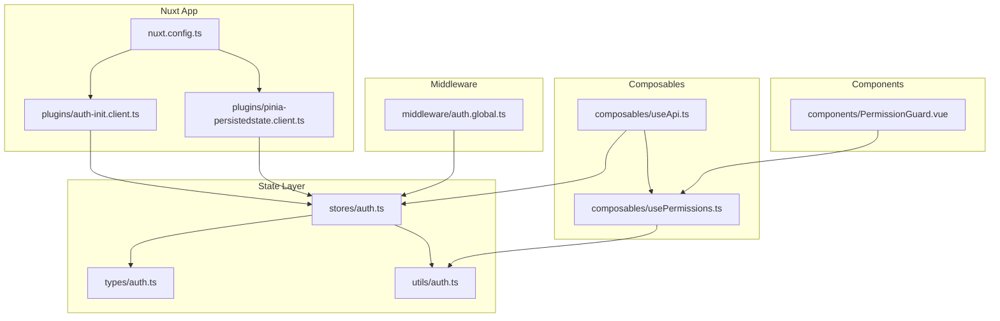
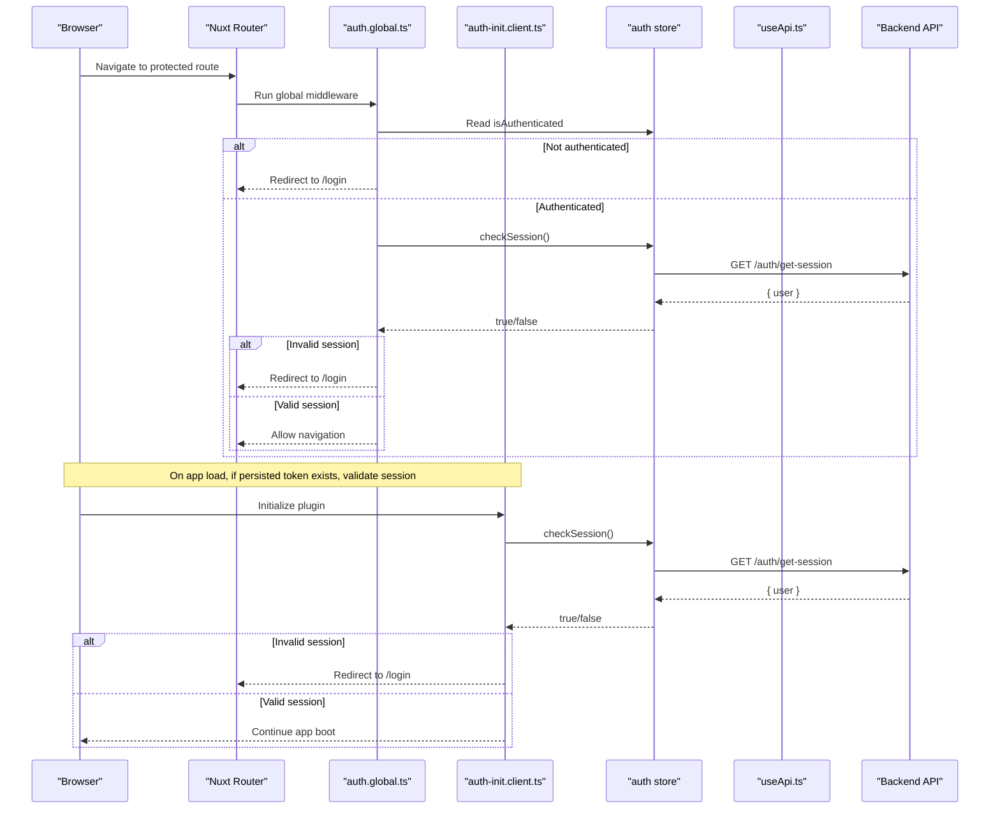
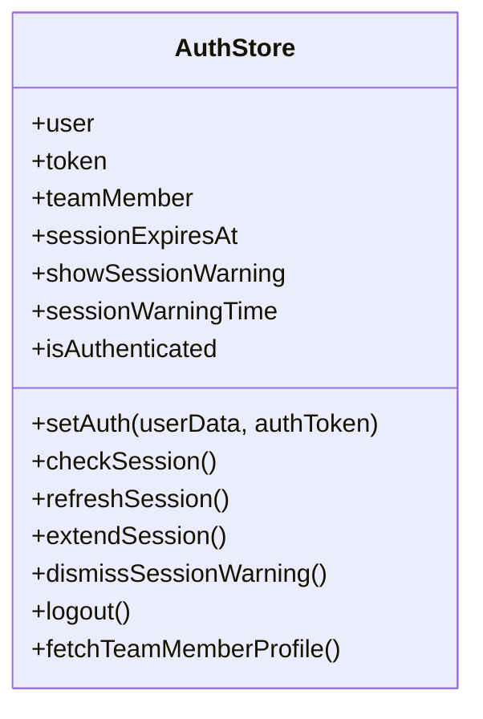
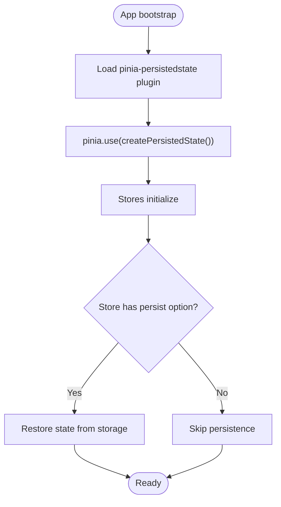
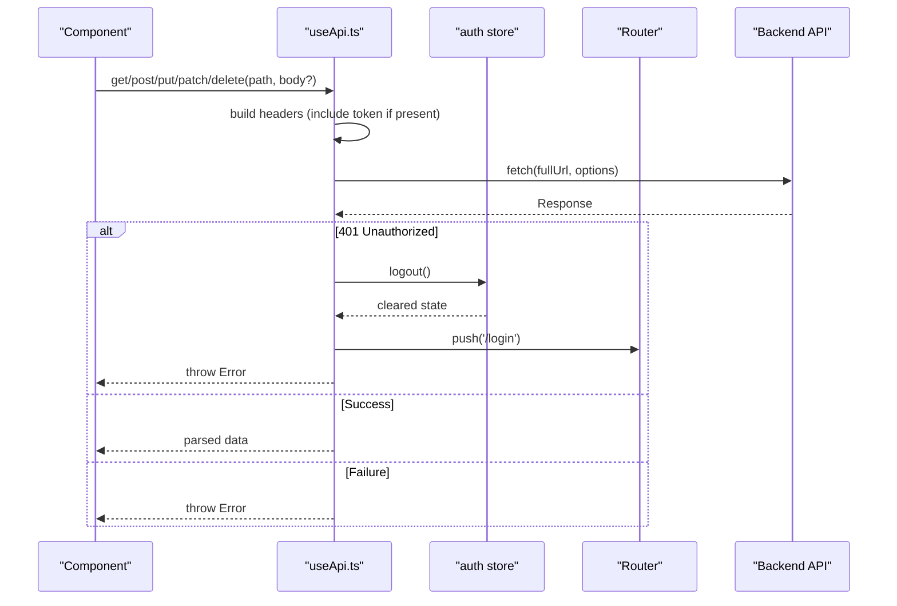
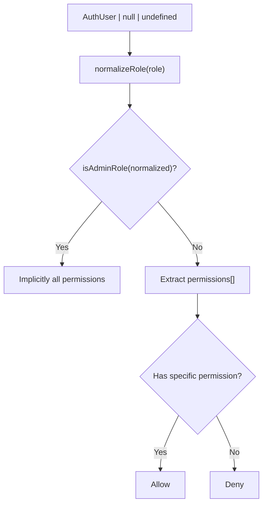
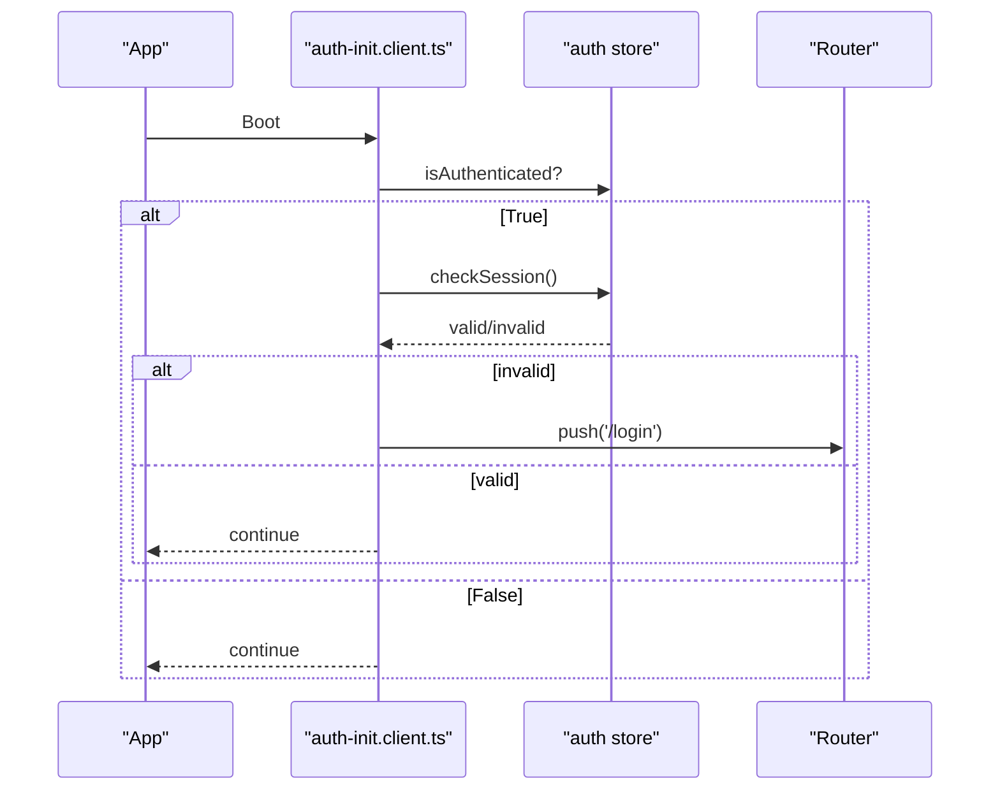
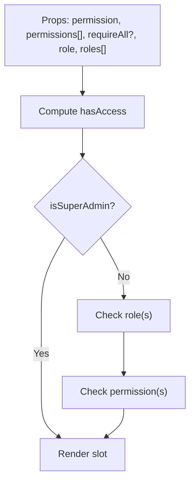
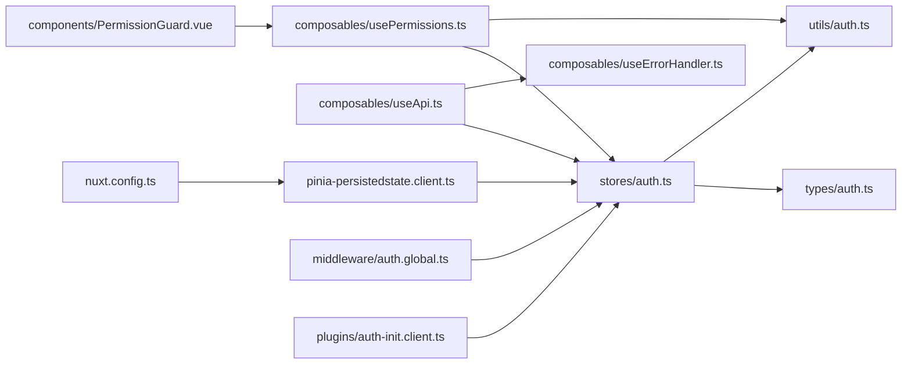

# State Management Strategy

<cite>
**Referenced Files in This Document**
- [auth.ts](file://app/stores/auth.ts)
- [pinia-persistedstate.client.ts](file://app/plugins/pinia-persistedstate.client.ts)
- [useApi.ts](file://app/composables/useApi.ts)
- [auth.ts](file://app/types/auth.ts)
- [auth.ts](file://app/utils/auth.ts)
- [auth.global.ts](file://app/middleware/auth.global.ts)
- [usePermissions.ts](file://app/composables/usePermissions.ts)
- [auth-init.client.ts](file://app/plugins/auth-init.client.ts)
- [PermissionGuard.vue](file://app/components/PermissionGuard.vue)
- [nuxt.config.ts](file://nuxt.config.ts)
</cite>

## Table of Contents
1. [Introduction](#introduction)
2. [Project Structure](#project-structure)
3. [Core Components](#core-components)
4. [Architecture Overview](#architecture-overview)
5. [Detailed Component Analysis](#detailed-component-analysis)
6. [Dependency Analysis](#dependency-analysis)
7. [Performance Considerations](#performance-considerations)
8. [Troubleshooting Guide](#troubleshooting-guide)
9. [Conclusion](#conclusion)

## Introduction
This document explains the state management strategy centered on Pinia with persistence, focusing on:
- Centralized authentication store managing user sessions, tokens, and permissions
- Composable pattern for API interactions and state synchronization
- Persistence strategy using pinia-plugin-persistedstate to maintain sessions across browser refreshes
- Reactive state updates, computed properties for derived state, and action methods for mutations
- Separation of concerns between stores, composables, and component-local state

The approach is designed to be predictable, testable, and easy to extend while keeping UI components focused on presentation and interaction.

## Project Structure
Key files involved in state management and persistence:
- Store: app/stores/auth.ts
- Persistence plugin: app/plugins/pinia-persistedstate.client.ts
- API composable: app/composables/useApi.ts
- Auth types: app/types/auth.ts
- Auth utilities: app/utils/auth.ts
- Route middleware: app/middleware/auth.global.ts
- Permission helpers composable: app/composables/usePermissions.ts
- App initialization plugin: app/plugins/auth-init.client.ts
- Permission guard component: app/components/PermissionGuard.vue
- Nuxt configuration: nuxt.config.ts

**Diagram sources**
- [nuxt.config.ts:1-46](file://nuxt.config.ts#L1-L46)
- [auth-init.client.ts:1-25](file://app/plugins/auth-init.client.ts#L1-L25)
- [pinia-persistedstate.client.ts:1-7](file://app/plugins/pinia-persistedstate.client.ts#L1-L7)
- [auth.ts](file://app/stores/auth.ts)
- [auth.ts](file://app/types/auth.ts)
- [auth.ts](file://app/utils/auth.ts)
- [useApi.ts](file://app/composables/useApi.ts)
- [usePermissions.ts](file://app/composables/usePermissions.ts)
- [auth.global.ts](file://app/middleware/auth.global.ts)
- [PermissionGuard.vue](file://app/components/PermissionGuard.vue)

**Section sources**
- [nuxt.config.ts:1-46](file://nuxt.config.ts#L1-L46)
- [auth.ts](file://app/stores/auth.ts)
- [pinia-persistedstate.client.ts:1-7](file://app/plugins/pinia-persistedstate.client.ts#L1-L7)
- [useApi.ts](file://app/composables/useApi.ts)
- [auth.ts](file://app/types/auth.ts)
- [auth.ts](file://app/utils/auth.ts)
- [auth.global.ts](file://app/middleware/auth.global.ts)
- [usePermissions.ts](file://app/composables/usePermissions.ts)
- [auth-init.client.ts:1-25](file://app/plugins/auth-init.client.ts#L1-L25)
- [PermissionGuard.vue](file://app/components/PermissionGuard.vue)

## Core Components
- Authentication store (Pinia): centralizes user identity, token, team member profile, session expiry, and UI flags for session warnings. It exposes reactive state, computed properties, and actions for login, logout, session checks, and refresh flows.
- Persistence plugin: integrates pinia-plugin-persistedstate into Pinia so that selected stores persist their state across page reloads.
- API composable: encapsulates HTTP requests, attaches auth headers, handles 401 responses by logging out and redirecting, and provides typed convenience methods.
- Permissions utilities and composable: normalize roles, check permissions and roles, and expose a composable for convenient permission checks in components.
- Middleware and plugins: enforce route-level authentication and initialize session checks on app load.
- Permission guard component: declarative access control based on roles and permissions.

**Section sources**
- [auth.ts](file://app/stores/auth.ts)
- [pinia-persistedstate.client.ts:1-7](file://app/plugins/pinia-persistedstate.client.ts#L1-L7)
- [useApi.ts](file://app/composables/useApi.ts)
- [usePermissions.ts](file://app/composables/usePermissions.ts)
- [auth.ts](file://app/utils/auth.ts)
- [auth.global.ts](file://app/middleware/auth.global.ts)
- [auth-init.client.ts:1-25](file://app/plugins/auth-init.client.ts#L1-L25)
- [PermissionGuard.vue](file://app/components/PermissionGuard.vue)

## Architecture Overview
The system follows a clear separation of concerns:
- Stores own application state and side effects related to authentication.
- Composables encapsulate reusable logic (API calls, error handling, permissions).
- Plugins handle cross-cutting concerns (persistence, initial session validation).
- Middleware enforces global route guards.
- Components consume reactive state and composable APIs without direct knowledge of persistence or network details.

**Diagram sources**
- [auth.global.ts](file://app/middleware/auth.global.ts)
- [auth-init.client.ts:1-25](file://app/plugins/auth-init.client.ts#L1-L25)
- [auth.ts](file://app/stores/auth.ts)
- [useApi.ts](file://app/composables/useApi.ts)

## Detailed Component Analysis

### Authentication Store (Pinia)
Responsibilities:
- Holds reactive state: user, token, teamMember, sessionExpiresAt, showSessionWarning, sessionWarningTime
- Provides computed isAuthenticated
- Actions: setAuth, checkSession, refreshSession, extendSession, dismissSessionWarning, logout, fetchTeamMemberProfile
- Lifecycle: starts periodic session checks and warning timers; initializes checks when token is present (e.g., after restore from persistence)

Persistence:
- The store opts into persistence via its options, enabling automatic serialization and restoration of state.

Reactive patterns:
- Refs for mutable state
- Computed for derived state (isAuthenticated)
- Timers for session monitoring and warnings

Error handling:
- Logs errors during profile fetch and session checks
- Clears state and redirects on invalid sessions

**Diagram sources**
- [auth.ts](file://app/stores/auth.ts)

**Section sources**
- [auth.ts](file://app/stores/auth.ts)

### Persistence Plugin
Purpose:
- Integrates pinia-plugin-persistedstate into Pinia at runtime, enabling stores to opt-in to persistence.

Configuration:
- Applied globally in a client-only plugin so it runs only in the browser.

**Diagram sources**
- [pinia-persistedstate.client.ts:1-7](file://app/plugins/pinia-persistedstate.client.ts#L1-L7)
- [auth.ts](file://app/stores/auth.ts)

**Section sources**
- [pinia-persistedstate.client.ts:1-7](file://app/plugins/pinia-persistedstate.client.ts#L1-L7)
- [auth.ts](file://app/stores/auth.ts)

### API Composable Pattern
Responsibilities:
- Builds base URL from runtime config
- Attaches Authorization header when token exists
- Handles 401 by calling store logout and redirecting to login
- Normalizes success/failure and returns typed results
- Wraps operations with useErrorHandler to display toast notifications automatically

Integration with state:
- Reads token from auth store
- Triggers logout on 401, which clears persisted state and resets UI

**Diagram sources**
- [useApi.ts](file://app/composables/useApi.ts)
- [auth.ts](file://app/stores/auth.ts)

**Section sources**
- [useApi.ts](file://app/composables/useApi.ts)
- [auth.ts](file://app/stores/auth.ts)

### Permissions Utilities and Composable
Responsibilities:
- Normalize role strings and objects
- Check admin status, specific permissions, and roles
- Provide a composable exposing helper functions and a computed super-admin flag

Usage:
- Components can call usePermissions() to check access declaratively or imperatively
- PermissionGuard component uses these helpers to conditionally render content

**Diagram sources**
- [auth.ts](file://app/utils/auth.ts)
- [usePermissions.ts](file://app/composables/usePermissions.ts)

**Section sources**
- [auth.ts](file://app/utils/auth.ts)
- [usePermissions.ts](file://app/composables/usePermissions.ts)

### Middleware and Initialization
Global middleware:
- Allows public routes
- Redirects unauthenticated users to login
- Verifies session validity on navigation (not on initial load)

Initialization plugin:
- On app start, if a persisted token exists, validates session and redirects if invalid
- Exposes an app-wide loading flag for UI

**Diagram sources**
- [auth-init.client.ts:1-25](file://app/plugins/auth-init.client.ts#L1-L25)
- [auth.ts](file://app/stores/auth.ts)
- [auth.global.ts](file://app/middleware/auth.global.ts)

**Section sources**
- [auth.global.ts](file://app/middleware/auth.global.ts)
- [auth-init.client.ts:1-25](file://app/plugins/auth-init.client.ts#L1-L25)

### Permission Guard Component
Purpose:
- Declarative component that renders children only if the current user satisfies role/permission requirements
- Uses usePermissions composable for checks

Behavior:
- Super admin always allowed
- Supports single or multiple roles/permissions
- Supports require-all vs any-of semantics

**Diagram sources**
- [PermissionGuard.vue](file://app/components/PermissionGuard.vue)
- [usePermissions.ts](file://app/composables/usePermissions.ts)

**Section sources**
- [PermissionGuard.vue](file://app/components/PermissionGuard.vue)
- [usePermissions.ts](file://app/composables/usePermissions.ts)

## Dependency Analysis
High-level dependencies:
- nuxt.config.ts registers Pinia and persistedstate modules
- pinia-persistedstate.client.ts applies persistence to Pinia
- auth store depends on runtime config and types
- useApi composable depends on auth store and error handler
- usePermissions composable depends on auth store and utils/auth
- Middleware and init plugin depend on auth store
- PermissionGuard component depends on usePermissions

**Diagram sources**
- [nuxt.config.ts:1-46](file://nuxt.config.ts#L1-L46)
- [pinia-persistedstate.client.ts:1-7](file://app/plugins/pinia-persistedstate.client.ts#L1-L7)
- [auth.ts](file://app/stores/auth.ts)
- [auth.ts](file://app/types/auth.ts)
- [auth.ts](file://app/utils/auth.ts)
- [useApi.ts](file://app/composables/useApi.ts)
- [usePermissions.ts](file://app/composables/usePermissions.ts)
- [auth.global.ts](file://app/middleware/auth.global.ts)
- [auth-init.client.ts:1-25](file://app/plugins/auth-init.client.ts#L1-L25)
- [PermissionGuard.vue](file://app/components/PermissionGuard.vue)

**Section sources**
- [nuxt.config.ts:1-46](file://nuxt.config.ts#L1-L46)
- [pinia-persistedstate.client.ts:1-7](file://app/plugins/pinia-persistedstate.client.ts#L1-L7)
- [auth.ts](file://app/stores/auth.ts)
- [useApi.ts](file://app/composables/useApi.ts)
- [usePermissions.ts](file://app/composables/usePermissions.ts)
- [auth.ts](file://app/utils/auth.ts)
- [auth.global.ts](file://app/middleware/auth.global.ts)
- [auth-init.client.ts:1-25](file://app/plugins/auth-init.client.ts#L1-L25)
- [PermissionGuard.vue](file://app/components/PermissionGuard.vue)

## Performance Considerations
- Avoid heavy computations inside frequently updated refs; prefer computed properties for derived state (e.g., isAuthenticated).
- Keep intervals minimal and ensure they are cleared on logout or store teardown to prevent memory leaks.
- Batch state updates where possible to reduce reactivity churn.
- Prefer typed API responses to avoid repeated parsing overhead.
- Use SSR-disabled routes for pages requiring client-only auth state to avoid hydration mismatches.

[No sources needed since this section provides general guidance]

## Troubleshooting Guide
Common issues and resolutions:
- Session not restored after refresh:
  - Ensure the store opts into persistence and the persistedstate plugin is registered.
  - Verify that the token is present in local storage after login.
- Unexpected logout on navigation:
  - Check middleware behavior and server session endpoint responses.
  - Confirm that 401 responses trigger logout and redirection.
- Permission checks not working:
  - Validate role normalization and permission arrays.
  - Ensure user object is populated before checking permissions.
- Toasts not showing on API errors:
  - Confirm useErrorHandler is used with wrapped methods and that toast service is available.

**Section sources**
- [auth.ts](file://app/stores/auth.ts)
- [pinia-persistedstate.client.ts:1-7](file://app/plugins/pinia-persistedstate.client.ts#L1-L7)
- [useApi.ts](file://app/composables/useApi.ts)
- [usePermissions.ts](file://app/composables/usePermissions.ts)
- [auth.ts](file://app/utils/auth.ts)
- [auth.global.ts](file://app/middleware/auth.global.ts)

## Conclusion
This state management strategy leverages Pinia for centralized, reactive state, combined with pinia-plugin-persistedstate for durable sessions. The composable pattern cleanly separates API concerns and error handling from components, while middleware and initialization plugins enforce security and correct startup behavior. Permissions utilities and a guard component provide consistent access control. Together, these layers deliver a robust, maintainable foundation for authentication and authorization across the application.