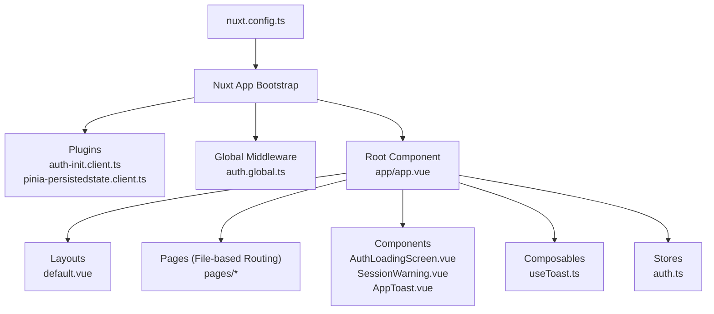
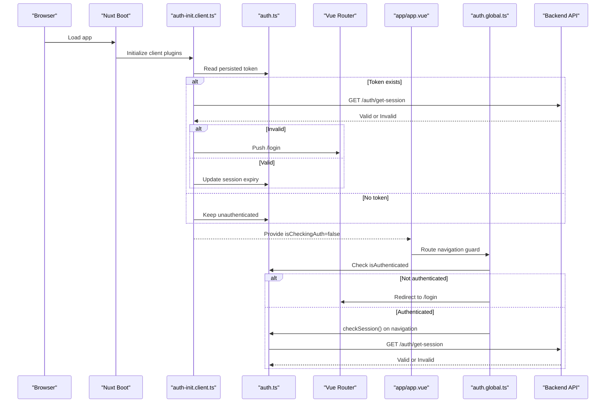
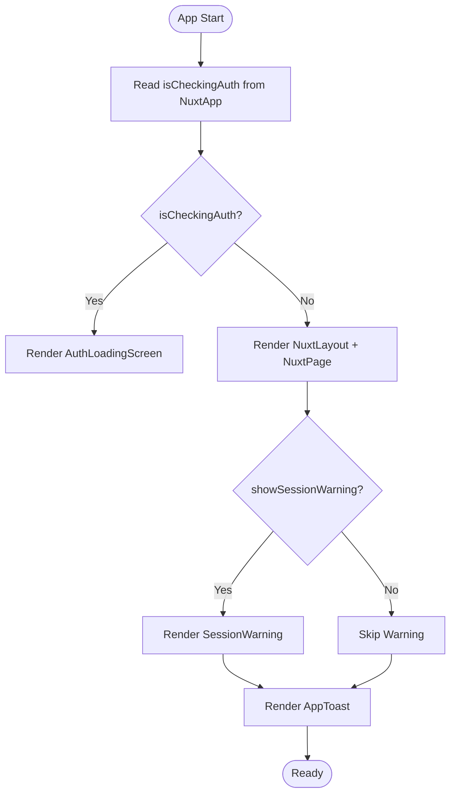
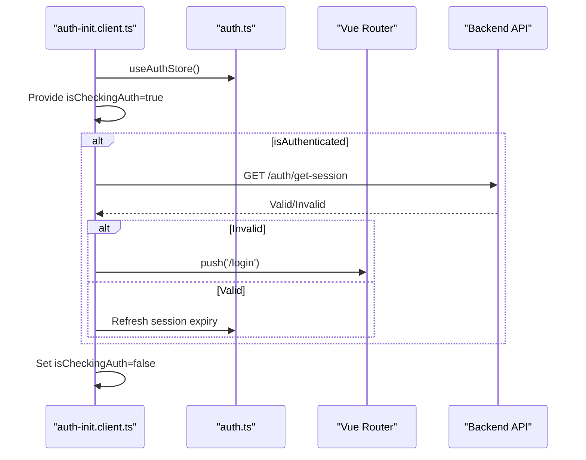
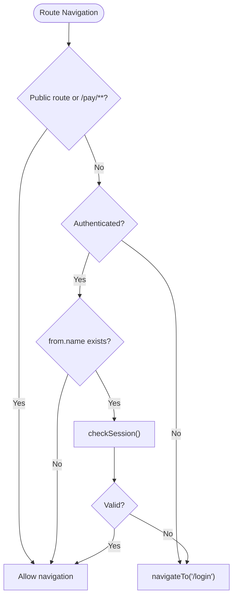
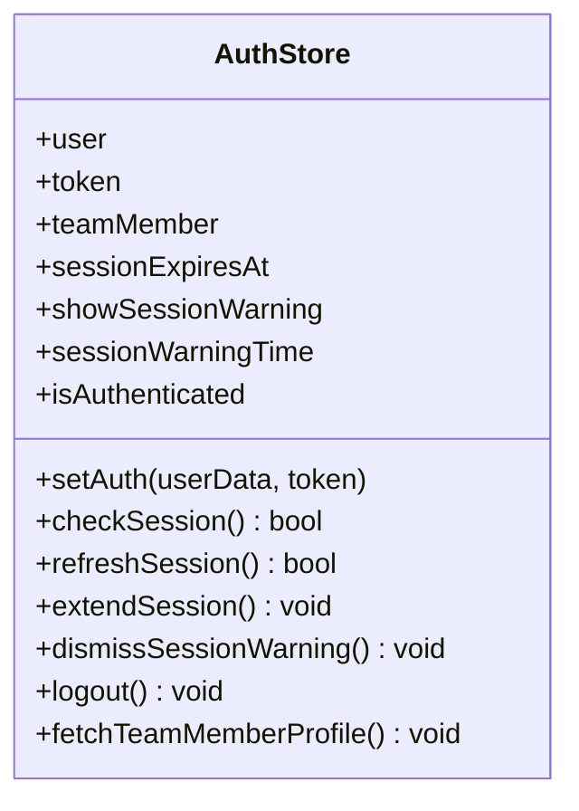
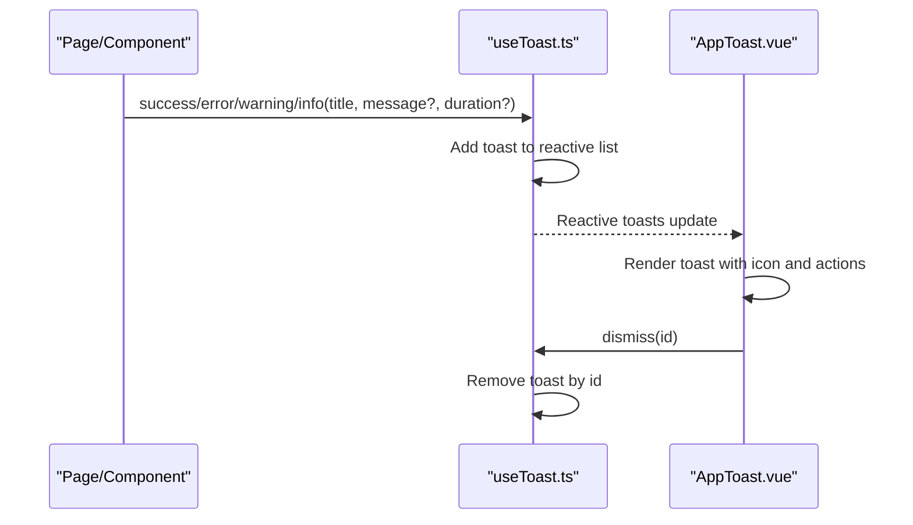
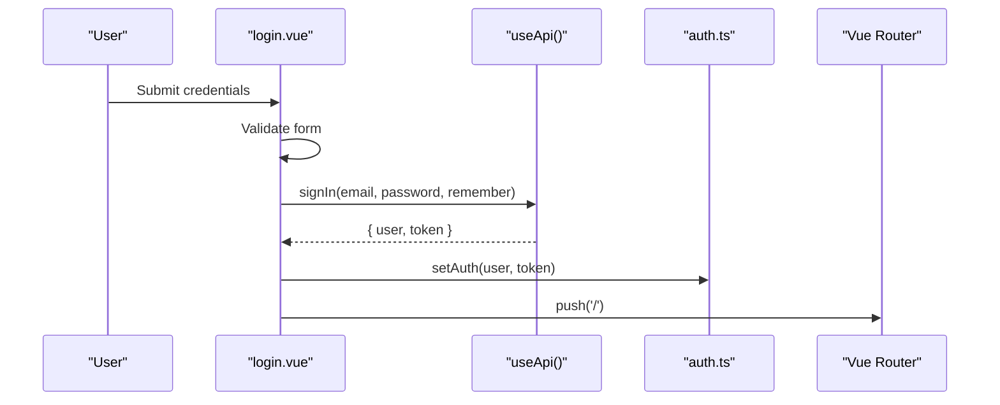
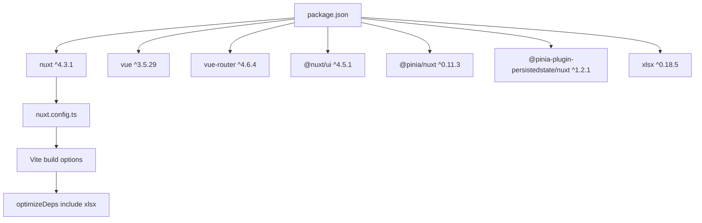

# System Architecture Overview

<cite>
**Referenced Files in This Document**
- [nuxt.config.ts](file://nuxt.config.ts)
- [package.json](file://package.json)
- [tsconfig.json](file://tsconfig.json)
- [app.vue](file://app/app.vue)
- [auth-init.client.ts](file://app/plugins/auth-init.client.ts)
- [pinia-persistedstate.client.ts](file://app/plugins/pinia-persistedstate.client.ts)
- [auth.global.ts](file://app/middleware/auth.global.ts)
- [default.vue](file://app/layouts/default.vue)
- [auth.ts](file://app/stores/auth.ts)
- [AuthLoadingScreen.vue](file://app/components/AuthLoadingScreen.vue)
- [SessionWarning.vue](file://app/components/SessionWarning.vue)
- [AppToast.vue](file://app/components/AppToast.vue)
- [useToast.ts](file://app/composables/useToast.ts)
- [login.vue](file://app/pages/login.vue)
</cite>

## Table of Contents
1. Introduction
2. Project Structure
3. Core Components
4. Architecture Overview
5. Detailed Component Analysis
6. Dependency Analysis
7. Performance Considerations
8. Troubleshooting Guide
9. Conclusion

## Introduction
This document describes the system architecture of the Lacarte Atlas Console, a Nuxt.js 4.x application built with Vue 3 and TypeScript. It explains the bootstrap process, plugin initialization, global component hierarchy, modular patterns, file-based routing, and server-side rendering configuration. It also documents technical decisions around adopting Nuxt.js 4.x, integrating TypeScript, and optimizing builds.

## Project Structure
The application follows Nuxt’s convention-based structure:
- app/app.vue is the root component orchestrating authentication loading, layout rendering, session warnings, and toast notifications.
- app/plugins contains client-only plugins for auth initialization and Pinia persistence.
- app/middleware provides global route guards for authentication and permissions.
- app/layouts defines layout wrappers (e.g., default).
- app/pages implements file-based routing.
- app/components holds reusable UI components.
- app/composables encapsulate shared logic (e.g., toasts).
- app/stores manages state via Pinia.
- nuxt.config.ts configures modules, SSR rules, runtime config, and Vite optimizations.

**Diagram sources**
- [nuxt.config.ts:1-46](file://nuxt.config.ts#L1-L46)
- [app.vue:1-33](file://app/app.vue#L1-L33)
- [auth-init.client.ts:1-25](file://app/plugins/auth-init.client.ts#L1-L25)
- [pinia-persistedstate.client.ts:1-7](file://app/plugins/pinia-persistedstate.client.ts#L1-L7)
- [auth.global.ts:1-32](file://app/middleware/auth.global.ts#L1-L32)
- [default.vue:1-6](file://app/layouts/default.vue#L1-L6)
- [useToast.ts:1-37](file://app/composables/useToast.ts#L1-L37)
- [auth.ts:1-230](file://app/stores/auth.ts#L1-L230)

**Section sources**
- [nuxt.config.ts:1-46](file://nuxt.config.ts#L1-L46)
- [package.json:1-33](file://package.json#L1-L33)
- [tsconfig.json:1-19](file://tsconfig.json#L1-L19)

## Core Components
- Root orchestration (app/app.vue):
  - Provides UApp wrapper and accessibility announcer.
  - Shows AuthLoadingScreen while authentication is being checked.
  - Renders NuxtLayout and NuxtPage when ready.
  - Displays SessionWarning based on store flags.
  - Renders AppToast for user feedback.

- Authentication flow:
  - Client plugin (auth-init.client.ts) initializes an “is checking auth” flag, validates session if authenticated, and redirects to login when invalid.
  - Global middleware (auth.global.ts) enforces access control, allowing public routes and verifying sessions on navigation.

- State management:
  - Pinia store (auth.ts) handles token lifecycle, session checks, warning timers, and logout.
  - Persistence plugin (pinia-persistedstate.client.ts) enables persisted state across reloads.

- Notifications:
  - useToast composable exposes typed toasts and auto-dismiss behavior.
  - AppToast renders stacked notifications with icons and dismiss actions.

- Layouts:
  - default.vue acts as a simple layout shell that renders page content.

**Section sources**
- [app.vue:1-33](file://app/app.vue#L1-L33)
- [auth-init.client.ts:1-25](file://app/plugins/auth-init.client.ts#L1-L25)
- [auth.global.ts:1-32](file://app/middleware/auth.global.ts#L1-L32)
- [auth.ts:1-230](file://app/stores/auth.ts#L1-L230)
- [pinia-persistedstate.client.ts:1-7](file://app/plugins/pinia-persistedstate.client.ts#L1-L7)
- [useToast.ts:1-37](file://app/composables/useToast.ts#L1-L37)
- [AppToast.vue:1-115](file://app/components/AppToast.vue#L1-L115)
- [default.vue:1-6](file://app/layouts/default.vue#L1-L6)

## Architecture Overview
High-level design:
- Nuxt 4.x bootstraps the app, loads plugins, applies global middleware, and renders the root component.
- The root component coordinates authentication status, layout selection, and global UI elements.
- File-based routing maps pages to URLs; middleware protects routes.
- SSR is selectively disabled for specific routes via routeRules.

**Diagram sources**
- [auth-init.client.ts:1-25](file://app/plugins/auth-init.client.ts#L1-L25)
- [auth.ts:1-230](file://app/stores/auth.ts#L1-L230)
- [auth.global.ts:1-32](file://app/middleware/auth.global.ts#L1-L32)
- [app.vue:1-33](file://app/app.vue#L1-L33)

## Detailed Component Analysis

### Root Orchestration (app/app.vue)
Responsibilities:
- Wraps the app in UApp and includes NuxtRouteAnnouncer for accessibility.
- Uses a provided isCheckingAuth flag to show AuthLoadingScreen during initial auth verification.
- Renders NuxtLayout and NuxtPage for page content.
- Conditionally shows SessionWarning based on store state.
- Renders AppToast globally.

**Diagram sources**
- [app.vue:1-33](file://app/app.vue#L1-L33)
- [AuthLoadingScreen.vue:1-29](file://app/components/AuthLoadingScreen.vue#L1-L29)
- [SessionWarning.vue:1-66](file://app/components/SessionWarning.vue#L1-L66)
- [AppToast.vue:1-115](file://app/components/AppToast.vue#L1-L115)

**Section sources**
- [app.vue:1-33](file://app/app.vue#L1-L33)

### Authentication Initialization (auth-init.client.ts)
Responsibilities:
- Provides isCheckingAuth to the app context.
- If a token exists, validates the session and redirects to login when invalid.
- Marks auth check complete so the root can render main content.

**Diagram sources**
- [auth-init.client.ts:1-25](file://app/plugins/auth-init.client.ts#L1-L25)
- [auth.ts:1-230](file://app/stores/auth.ts#L1-L230)

**Section sources**
- [auth-init.client.ts:1-25](file://app/plugins/auth-init.client.ts#L1-L25)

### Global Authentication Middleware (auth.global.ts)
Responsibilities:
- Defines public routes (/login, /forgot-password, /unauthorized) and allows /pay/** without authentication.
- Redirects unauthenticated users to /login.
- On navigation between routes, verifies session validity using the store.

**Diagram sources**
- [auth.global.ts:1-32](file://app/middleware/auth.global.ts#L1-L32)
- [auth.ts:1-230](file://app/stores/auth.ts#L1-L230)

**Section sources**
- [auth.global.ts:1-32](file://app/middleware/auth.global.ts#L1-L32)

### Session Management Store (auth.ts)
Responsibilities:
- Manages user, token, team member profile, and session expiry.
- Provides setAuth, checkSession, refreshSession, extendSession, dismissSessionWarning, logout, and fetchTeamMemberProfile.
- Starts periodic session checks and warning timers.
- Persists state via Pinia plugin.

**Diagram sources**
- [auth.ts:1-230](file://app/stores/auth.ts#L1-L230)

**Section sources**
- [auth.ts:1-230](file://app/stores/auth.ts#L1-L230)

### Toast System (useToast.ts and AppToast.vue)
Responsibilities:
- useToast composable maintains a reactive list of toasts with types and durations.
- AppToast renders each toast with appropriate iconography and colors, supports dismissal, and animates transitions.

**Diagram sources**
- [useToast.ts:1-37](file://app/composables/useToast.ts#L1-L37)
- [AppToast.vue:1-115](file://app/components/AppToast.vue#L1-L115)

**Section sources**
- [useToast.ts:1-37](file://app/composables/useToast.ts#L1-L37)
- [AppToast.vue:1-115](file://app/components/AppToast.vue#L1-L115)

### Login Flow (login.vue)
Responsibilities:
- Validates email and password locally.
- Calls API via useApi to sign in.
- Sets auth state and navigates to home.
- Displays error messages and loading states.

**Diagram sources**
- [login.vue:1-167](file://app/pages/login.vue#L1-L167)
- [auth.ts:1-230](file://app/stores/auth.ts#L1-L230)

**Section sources**
- [login.vue:1-167](file://app/pages/login.vue#L1-L167)

### Layout Shell (default.vue)
Responsibilities:
- Provides a minimal layout container that renders page content via slot.

**Section sources**
- [default.vue:1-6](file://app/layouts/default.vue#L1-L6)

## Dependency Analysis
Key dependencies and their roles:
- Nuxt 4.x and Vue 3 provide the framework and runtime.
- @nuxt/ui supplies UI primitives used throughout the app.
- @pinia/nuxt integrates Pinia into Nuxt.
- pinia-plugin-persistedstate persists auth state across reloads.
- xlsx is pre-bundled via Vite optimizeDeps for performance.

**Diagram sources**
- [package.json:1-33](file://package.json#L1-L33)
- [nuxt.config.ts:1-46](file://nuxt.config.ts#L1-L46)

**Section sources**
- [package.json:1-33](file://package.json#L1-L33)
- [nuxt.config.ts:1-46](file://nuxt.config.ts#L1-L46)

## Performance Considerations
- Selective SSR: Routes like /login, /forgot-password, /pay/**, and /tracking/** disable SSR via routeRules to reduce server load and improve client interactivity.
- Vite optimization: Target esnext and explicitly include xlsx in optimizeDeps to avoid cold-start overhead.
- Build target: Using esnext ensures modern output for faster execution in supported environments.
- Pinia persistence: Reduces re-authentication round-trips after reloads by persisting tokens and session metadata.

[No sources needed since this section provides general guidance]

## Troubleshooting Guide
Common issues and resolutions:
- Infinite loading screen:
  - Ensure auth-init.client.ts completes setting isCheckingAuth to false.
  - Verify backend responds to /auth/get-session with valid data when a token is present.
- Unexpected redirects to login:
  - Confirm middleware allows intended public routes and /pay/** paths.
  - Check that checkSession returns true and does not trigger logout.
- Session warnings not appearing:
  - Verify sessionExpiresAt is set after successful authentication and refresh.
  - Ensure startSessionWarningCheck is running and intervals are not cleared prematurely.
- Toasts not displaying:
  - Confirm useAppToast is imported and called correctly.
  - Ensure AppToast is rendered at the root level.

**Section sources**
- [auth-init.client.ts:1-25](file://app/plugins/auth-init.client.ts#L1-L25)
- [auth.global.ts:1-32](file://app/middleware/auth.global.ts#L1-L32)
- [auth.ts:1-230](file://app/stores/auth.ts#L1-L230)
- [useToast.ts:1-37](file://app/composables/useToast.ts#L1-L37)
- [AppToast.vue:1-115](file://app/components/AppToast.vue#L1-L115)

## Conclusion
The Lacarte Atlas Console leverages Nuxt.js 4.x conventions to deliver a modular, type-safe, and performant admin dashboard. The root component orchestrates authentication, layouts, and global UI. Plugins initialize critical services early, middleware secures routes, and Pinia manages persistent state. SSR is selectively disabled for interactive routes, and Vite optimizations ensure fast startup. Together, these choices create a robust foundation for scalable feature development.