# API Integration Layer

<cite>
**Referenced Files in This Document**
- [useApi.ts](file://app/composables/useApi.ts)
- [useErrorHandler.ts](file://app/composables/useErrorHandler.ts)
- [useMockData.ts](file://app/composables/useMockData.ts)
- [auth.ts](file://app/stores/auth.ts)
- [auth.global.ts](file://app/middleware/auth.global.ts)
- [auth-init.client.ts](file://app/plugins/auth-init.client.ts)
- [auth.ts](file://app/types/auth.ts)
- [useToast.ts](file://app/composables/useToast.ts)
- [nuxt.config.ts](file://nuxt.config.ts)
- [login.vue](file://app/pages/login.vue)
- [customers/index.vue](file://app/pages/customers/index.vue)
- [AddDriverModal.vue](file://app/components/AddDriverModal.vue)
</cite>

## Table of Contents
1. Introduction
2. Project Structure
3. Core Components
4. Architecture Overview
5. Detailed Component Analysis
6. Dependency Analysis
7. Performance Considerations
8. Troubleshooting Guide
9. Conclusion

## Introduction
This document explains the API integration layer with a focus on HTTP client architecture and request/response handling. It covers the typed API client wrapper, automatic authentication header injection, centralized error handling, mock data for development/testing, request interception patterns, response processing pipelines, practical examples, error boundaries, retry mechanisms, performance considerations (caching, loading states, optimistic updates), and integration with external services and third-party APIs.

## Project Structure
The API integration layer is implemented as Nuxt composables and Pinia store utilities:
- HTTP client and typed helpers live in a composable that wraps fetch and injects auth headers.
- Centralized error handling composable provides toast feedback and null-return semantics.
- Authentication state and session management are handled by a Pinia store with middleware and plugin support.
- Mock data composable supplies static reference datasets for development and testing.
- Configuration centralizes base URLs and environment variables.

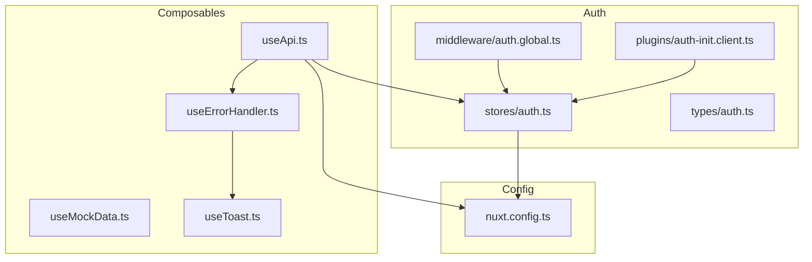

**Diagram sources**
- [useApi.ts:1-91](file://app/composables/useApi.ts#L1-L91)
- [useErrorHandler.ts:1-29](file://app/composables/useErrorHandler.ts#L1-L29)
- [useMockData.ts:1-61](file://app/composables/useMockData.ts#L1-L61)
- [auth.ts:1-230](file://app/stores/auth.ts#L1-L230)
- [auth.global.ts:1-32](file://app/middleware/auth.global.ts#L1-L32)
- [auth-init.client.ts:1-25](file://app/plugins/auth-init.client.ts#L1-L25)
- [auth.ts:1-64](file://app/types/auth.ts#L1-L64)
- [useToast.ts:1-37](file://app/composables/useToast.ts#L1-L37)
- [nuxt.config.ts:1-46](file://nuxt.config.ts#L1-L46)

**Section sources**
- [useApi.ts:1-91](file://app/composables/useApi.ts#L1-L91)
- [useErrorHandler.ts:1-29](file://app/composables/useErrorHandler.ts#L1-L29)
- [useMockData.ts:1-61](file://app/composables/useMockData.ts#L1-L61)
- [auth.ts:1-230](file://app/stores/auth.ts#L1-L230)
- [auth.global.ts:1-32](file://app/middleware/auth.global.ts#L1-L32)
- [auth-init.client.ts:1-25](file://app/plugins/auth-init.client.ts#L1-L25)
- [auth.ts:1-64](file://app/types/auth.ts#L1-L64)
- [useToast.ts:1-37](file://app/composables/useToast.ts#L1-L37)
- [nuxt.config.ts:1-46](file://nuxt.config.ts#L1-L46)

## Core Components
- Typed API client wrapper: Provides get/post/put/patch/delete/signIn methods with generic typing and automatic Authorization header injection.
- Centralized error handling: Wraps async operations to show toasts and return null on failure, enabling simple caller guards.
- Authentication store: Manages token, user profile, session checks, and logout flows; integrates with middleware and plugin for route protection and initial session validation.
- Mock data system: Supplies static arrays for zones, trucks, customer types, and subscription plans to support development and tests without backend dependencies.
- Toast utility: Global notification service used by error handler and UI components.

Key responsibilities:
- Request construction and header injection
- Response parsing and success/failure classification
- Session invalidation and redirect on 401
- Error boundary behavior via run() wrapper
- Static dataset access for dev/test

**Section sources**
- [useApi.ts:1-91](file://app/composables/useApi.ts#L1-L91)
- [useErrorHandler.ts:1-29](file://app/composables/useErrorHandler.ts#L1-L29)
- [auth.ts:1-230](file://app/stores/auth.ts#L1-L230)
- [useMockData.ts:1-61](file://app/composables/useMockData.ts#L1-L61)
- [useToast.ts:1-37](file://app/composables/useToast.ts#L1-L37)

## Architecture Overview
The HTTP client composable sits at the center of all network requests. It reads runtime configuration for the API base URL, attaches the current bearer token from the auth store, and delegates error presentation to the error handler composable. The auth store coordinates session lifecycle and interacts with the server for profile and session endpoints. Middleware protects routes and enforces authentication, while a plugin validates sessions on app load.

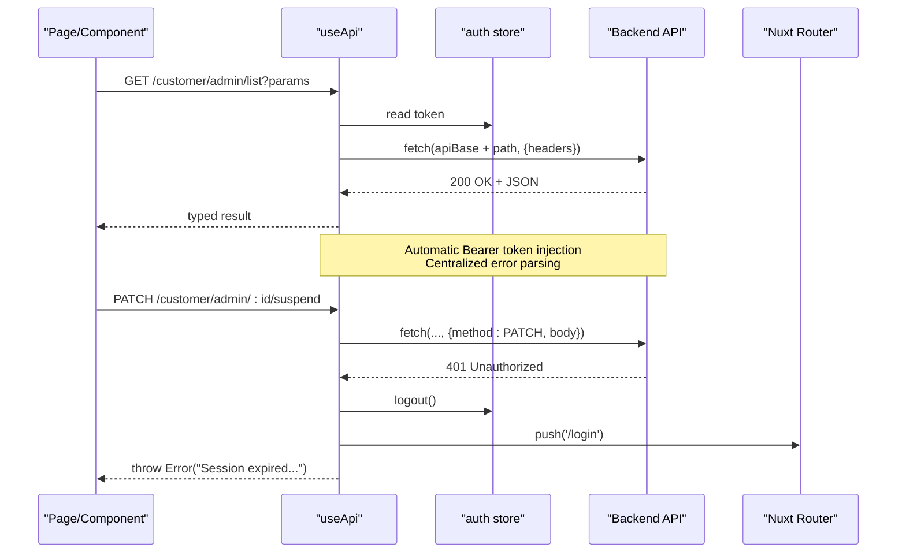

**Diagram sources**
- [useApi.ts:1-91](file://app/composables/useApi.ts#L1-L91)
- [auth.ts:1-230](file://app/stores/auth.ts#L1-L230)
- [auth.global.ts:1-32](file://app/middleware/auth.global.ts#L1-L32)
- [auth-init.client.ts:1-25](file://app/plugins/auth-init.client.ts#L1-L25)

## Detailed Component Analysis

### Typed API Client Wrapper (useApi)
Responsibilities:
- Build full URLs using runtime config public.apiBase
- Inject Content-Type and Authorization headers when available
- Classify success (200/201/204) vs failure
- Parse JSON responses or return null for empty bodies
- Handle 401 by logging out and redirecting to login
- Expose typed convenience methods (get/post/put/patch/delete) and signIn helper
- Provide raw request method for advanced usage

Request flow:
- Merge default headers with provided options
- Append Authorization if token exists
- Execute fetch and log request/response metadata
- On non-success status, attempt to extract message from JSON body
- Throw descriptive errors for callers to handle

Response pipeline:
- Read text body
- If present, parse JSON into typed result
- Return parsed value or null for empty responses

Error boundary integration:
- Convenience methods wrap calls with useErrorHandler.run to show toasts and return null on failure, simplifying component logic.

Typical usage patterns:
- Data fetching with typed generics
- Mutations with post/put/patch/delete
- Auth flow via signIn helper

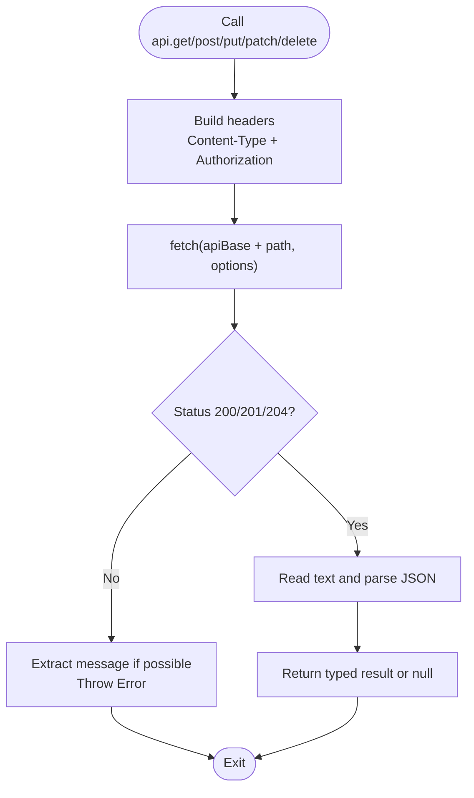

**Diagram sources**
- [useApi.ts:1-91](file://app/composables/useApi.ts#L1-L91)

**Section sources**
- [useApi.ts:1-91](file://app/composables/useApi.ts#L1-L91)

### Centralized Error Handling (useErrorHandler)
Responsibilities:
- Wrap async functions with try/catch
- Show toast.error with configurable title and optional message
- Return null on failure to simplify caller guards

Integration points:
- Used by useApi convenience methods to provide consistent UX
- Can be used directly in components for custom flows

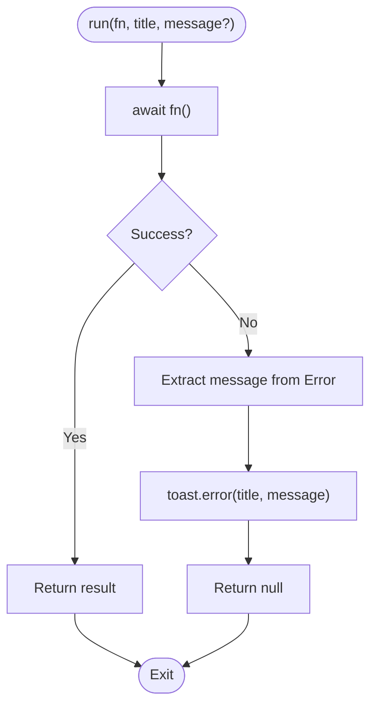

**Diagram sources**
- [useErrorHandler.ts:1-29](file://app/composables/useErrorHandler.ts#L1-L29)
- [useToast.ts:1-37](file://app/composables/useToast.ts#L1-L37)

**Section sources**
- [useErrorHandler.ts:1-29](file://app/composables/useErrorHandler.ts#L1-L29)
- [useToast.ts:1-37](file://app/composables/useToast.ts#L1-L37)

### Authentication Store and Flow (Pinia)
Responsibilities:
- Persist token and user profile across sessions
- Validate and refresh sessions periodically
- Fetch team member profile to augment permissions
- Handle logout including server-side sign-out call
- Manage session warning countdown and auto-logout

Key endpoints used:
- /user/profile to fetch admin profile and merge roles/permissions
- /auth/get-session to validate and refresh session
- /auth/sign-out to terminate server session

Lifecycle:
- On setAuth: persist token, schedule periodic checks, start warning timer, fetch profile
- On checkSession: verify validity, update expiry, refresh profile, or logout on failure
- On logout: clear local state, stop timers, optionally call server sign-out

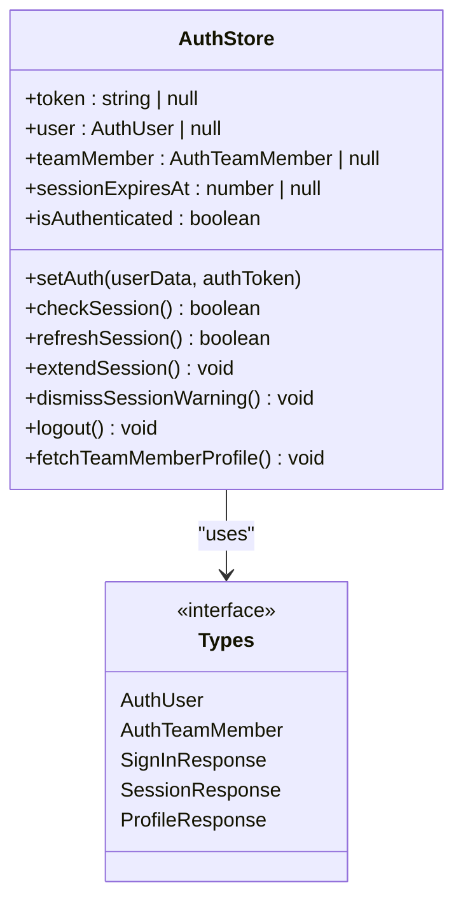

**Diagram sources**
- [auth.ts:1-230](file://app/stores/auth.ts#L1-L230)
- [auth.ts:1-64](file://app/types/auth.ts#L1-L64)

**Section sources**
- [auth.ts:1-230](file://app/stores/auth.ts#L1-L230)
- [auth.ts:1-64](file://app/types/auth.ts#L1-L64)

### Route Protection and Session Initialization
- Global middleware checks route visibility and redirects unauthenticated users to login. It also verifies session validity on navigation after initial load.
- Client plugin initializes auth checking on app startup and redirects if session is invalid.

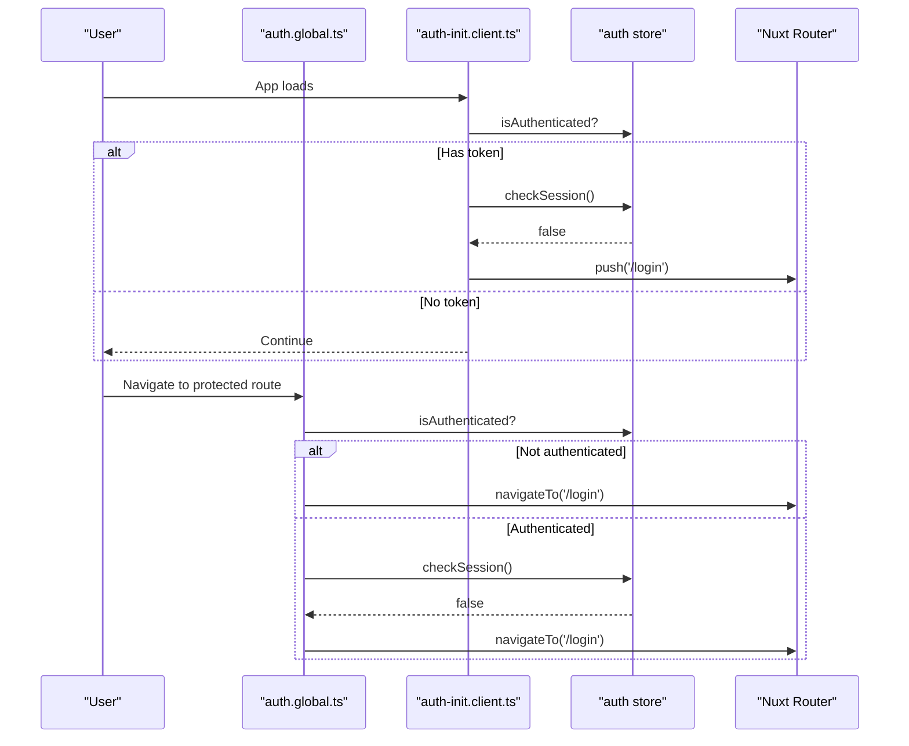

**Diagram sources**
- [auth.global.ts:1-32](file://app/middleware/auth.global.ts#L1-L32)
- [auth-init.client.ts:1-25](file://app/plugins/auth-init.client.ts#L1-L25)
- [auth.ts:1-230](file://app/stores/auth.ts#L1-L230)

**Section sources**
- [auth.global.ts:1-32](file://app/middleware/auth.global.ts#L1-L32)
- [auth-init.client.ts:1-25](file://app/plugins/auth-init.client.ts#L1-L25)

### Mock Data System
Provides static arrays for:
- Zones
- Trucks
- Customer types
- Subscription plans

Usage:
- Import useMockData in components or tests to populate dropdowns and tables without hitting the backend.
- Replace static arrays with API-backed data later by swapping implementations within this composable.

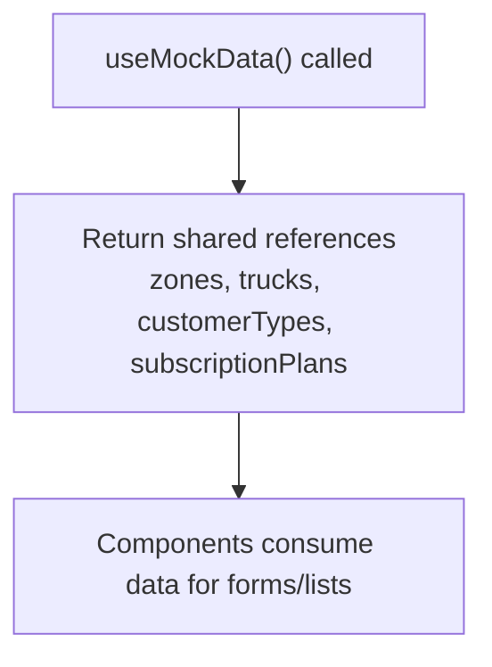

**Diagram sources**
- [useMockData.ts:1-61](file://app/composables/useMockData.ts#L1-L61)

**Section sources**
- [useMockData.ts:1-61](file://app/composables/useMockData.ts#L1-L61)

### Practical Examples

#### Login Flow
- The login page uses the typed signIn helper to authenticate, then persists credentials via the auth store and navigates to the dashboard.

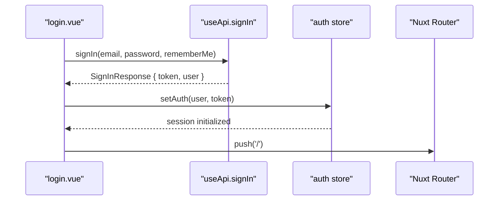

**Diagram sources**
- [login.vue:1-167](file://app/pages/login.vue#L1-L167)
- [useApi.ts:1-91](file://app/composables/useApi.ts#L1-L91)
- [auth.ts:1-230](file://app/stores/auth.ts#L1-L230)

**Section sources**
- [login.vue:1-167](file://app/pages/login.vue#L1-L167)
- [useApi.ts:1-91](file://app/composables/useApi.ts#L1-L91)
- [auth.ts:1-230](file://app/stores/auth.ts#L1-L230)

#### Data Fetching with Loading States
- A customers list page demonstrates loading flags, pagination, filtering, and typed API calls. It toggles initialLoading and per-request loading states around fetchCustomers.

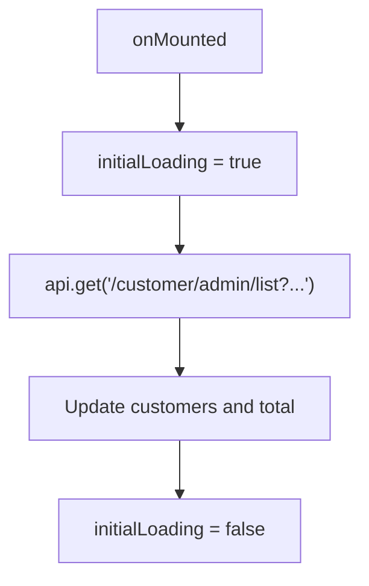

**Diagram sources**
- [customers/index.vue:1-200](file://app/pages/customers/index.vue#L1-L200)
- [useApi.ts:1-91](file://app/composables/useApi.ts#L1-L91)

**Section sources**
- [customers/index.vue:1-200](file://app/pages/customers/index.vue#L1-L200)
- [useApi.ts:1-91](file://app/composables/useApi.ts#L1-L91)

#### Mutation with Optimistic Updates
- A modal component shows how to perform mutations and immediately update local state upon success, providing an optimistic UX.

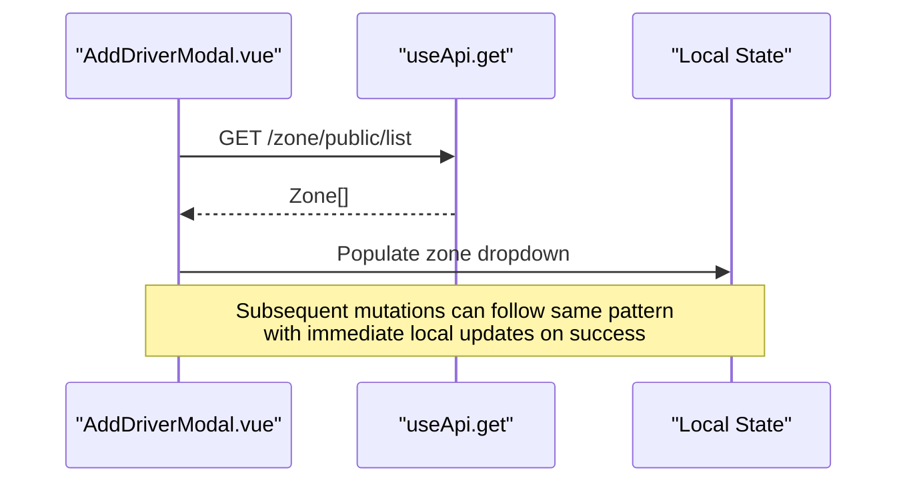

**Diagram sources**
- [AddDriverModal.vue:1-190](file://app/components/AddDriverModal.vue#L1-L190)
- [useApi.ts:1-91](file://app/composables/useApi.ts#L1-L91)

**Section sources**
- [AddDriverModal.vue:1-190](file://app/components/AddDriverModal.vue#L1-L190)
- [useApi.ts:1-91](file://app/composables/useApi.ts#L1-L91)

### Request Interception Patterns
Current implementation:
- Header injection occurs before each fetch inside the client wrapper.
- Centralized error handling is applied via the run wrapper for convenience methods.

Extensibility points:
- Add retry logic by wrapping request with exponential backoff.
- Introduce caching by maintaining a map keyed by URL + params and returning cached results for identical requests.
- Implement request/response logging or metrics collection in the client wrapper.

[No sources needed since this section proposes extensibility patterns]

### Response Processing Pipelines
- Success classification includes 200, 201, and 204.
- Empty responses yield null rather than throwing.
- Non-success responses attempt to extract a message field from JSON; otherwise, a generic message is thrown.

**Section sources**
- [useApi.ts:1-91](file://app/composables/useApi.ts#L1-L91)

## Dependency Analysis
The following diagram maps key dependencies between core files:

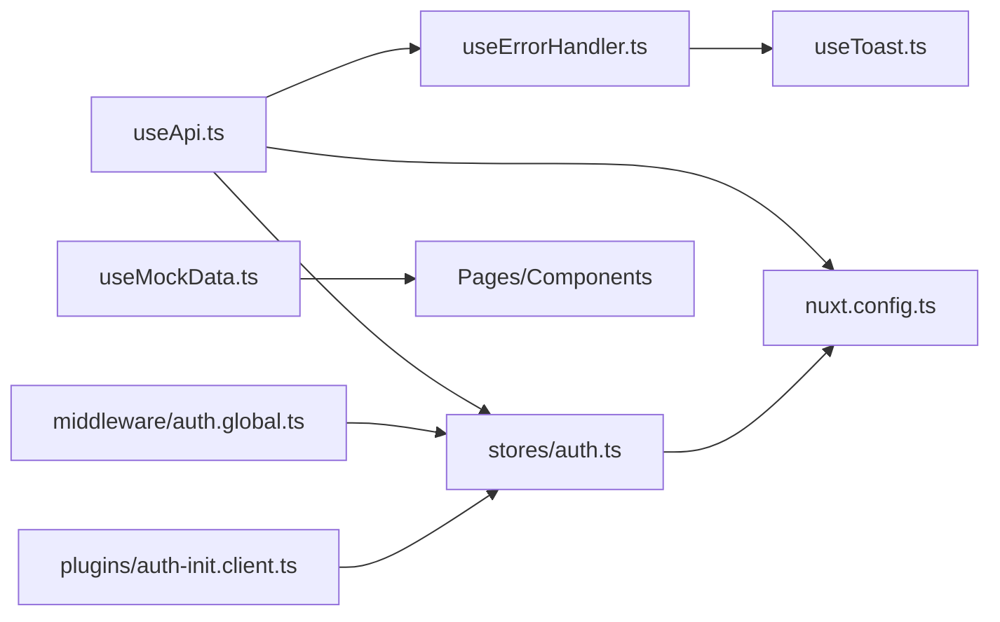

**Diagram sources**
- [useApi.ts:1-91](file://app/composables/useApi.ts#L1-L91)
- [useErrorHandler.ts:1-29](file://app/composables/useErrorHandler.ts#L1-L29)
- [auth.ts:1-230](file://app/stores/auth.ts#L1-L230)
- [auth.global.ts:1-32](file://app/middleware/auth.global.ts#L1-L32)
- [auth-init.client.ts:1-25](file://app/plugins/auth-init.client.ts#L1-L25)
- [useMockData.ts:1-61](file://app/composables/useMockData.ts#L1-L61)
- [useToast.ts:1-37](file://app/composables/useToast.ts#L1-L37)
- [nuxt.config.ts:1-46](file://nuxt.config.ts#L1-L46)

**Section sources**
- [useApi.ts:1-91](file://app/composables/useApi.ts#L1-L91)
- [useErrorHandler.ts:1-29](file://app/composables/useErrorHandler.ts#L1-L29)
- [auth.ts:1-230](file://app/stores/auth.ts#L1-L230)
- [auth.global.ts:1-32](file://app/middleware/auth.global.ts#L1-L32)
- [auth-init.client.ts:1-25](file://app/plugins/auth-init.client.ts#L1-L25)
- [useMockData.ts:1-61](file://app/composables/useMockData.ts#L1-L61)
- [useToast.ts:1-37](file://app/composables/useToast.ts#L1-L37)
- [nuxt.config.ts:1-46](file://nuxt.config.ts#L1-L46)

## Performance Considerations
- Request caching: Maintain an in-memory cache keyed by normalized URL and query parameters. For idempotent GET requests, serve cached data and revalidate on background refresh.
- Loading states: Use fine-grained loading flags per operation to avoid blocking entire views. Combine with skeleton loaders for perceived performance.
- Optimistic updates: Immediately reflect mutation outcomes locally and roll back on failure. Pair with error boundaries to restore consistency.
- Debounce search/filter: Throttle frequent filter changes to reduce request volume.
- Pagination and virtualization: Load only visible rows for large lists to minimize memory and rendering costs.
- Token refresh: Leverage periodic session checks to preemptively refresh tokens and avoid mid-operation 401s.

[No sources needed since this section provides general guidance]

## Troubleshooting Guide
Common issues and resolutions:
- 401 Unauthorized: The client logs out and redirects to login. Ensure the auth store’s token is persisted and session checks are running. Verify server session endpoint availability.
- Missing Authorization header: Confirm the auth store has a token and that the client wrapper is used for requests.
- Unexpected null responses: Empty responses are intentionally returned as null. Check your server to ensure it returns JSON payloads for non-empty responses.
- Toast not showing: Ensure the error handler is used via run() or that toasts are properly mounted in the app shell.

Operational tips:
- Inspect console logs emitted by the client wrapper for request/response details.
- Use the raw request method when you need custom error handling or streaming responses.
- For development, swap real endpoints with useMockData to isolate UI logic.

**Section sources**
- [useApi.ts:1-91](file://app/composables/useApi.ts#L1-L91)
- [useErrorHandler.ts:1-29](file://app/composables/useErrorHandler.ts#L1-L29)
- [auth.ts:1-230](file://app/stores/auth.ts#L1-L230)
- [useToast.ts:1-37](file://app/composables/useToast.ts#L1-L37)

## Conclusion
The API integration layer provides a robust, typed, and centralized approach to HTTP communication. It automates authentication header injection, standardizes error handling with user feedback, and supports development through a mock data system. With middleware and plugin-based session management, the application maintains secure and resilient user experiences. Extensibility points exist for caching, retries, and advanced request/response pipelines to further improve performance and reliability.