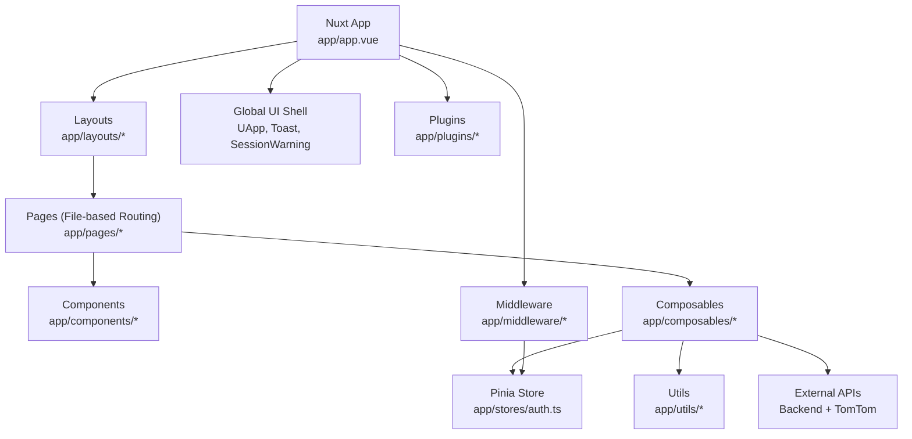
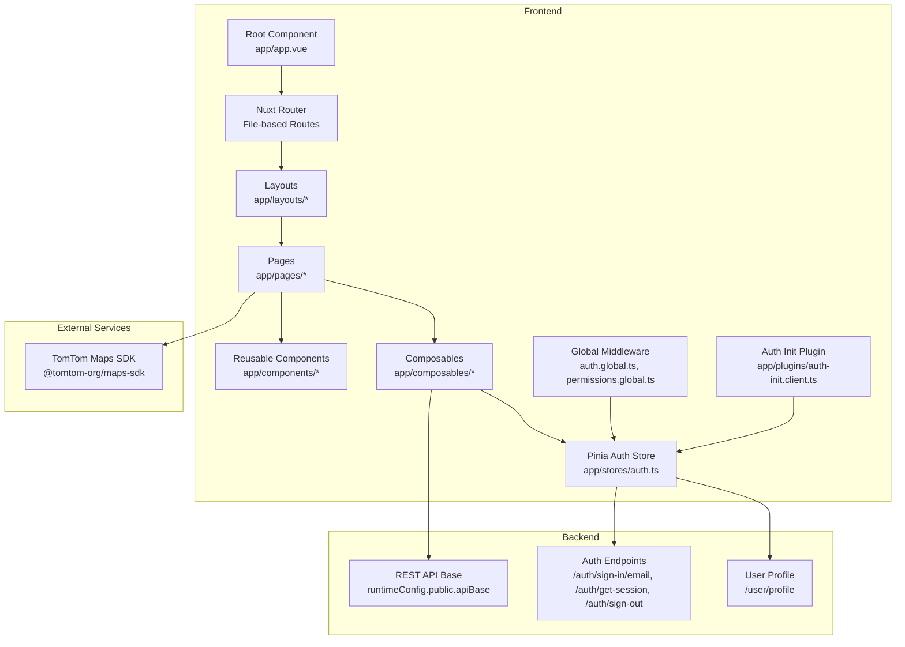
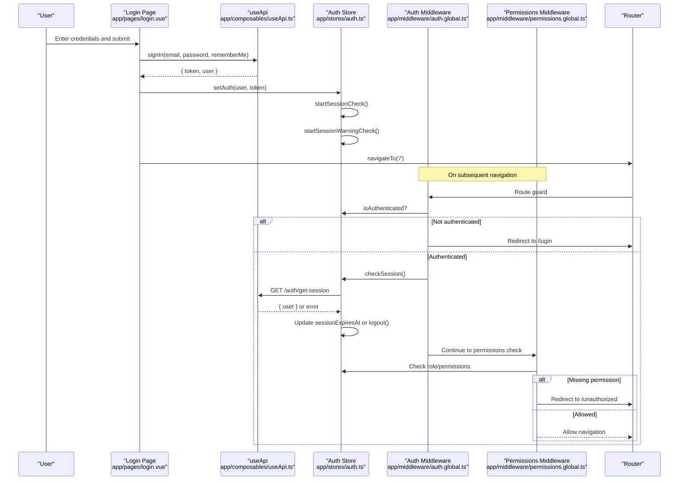
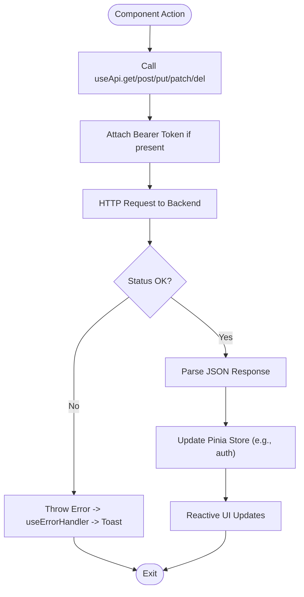
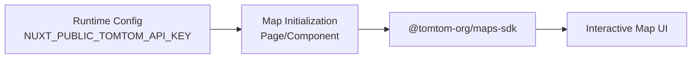
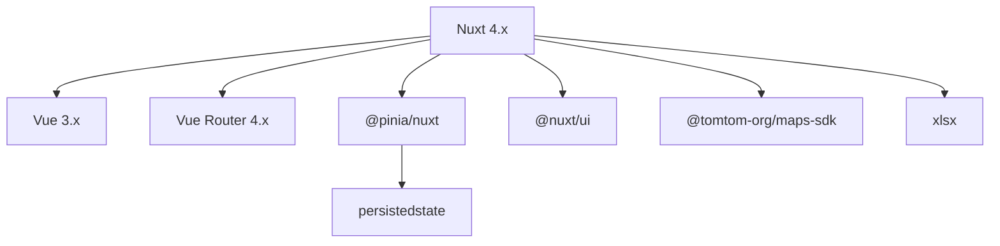

# Architecture Overview

<cite>
**Referenced Files in This Document**
- [nuxt.config.ts](file://nuxt.config.ts)
- [package.json](file://package.json)
- [app.vue](file://app/app.vue)
- [auth.global.ts](file://app/middleware/auth.global.ts)
- [permissions.global.ts](file://app/middleware/permissions.global.ts)
- [auth-init.client.ts](file://app/plugins/auth-init.client.ts)
- [auth.ts](file://app/stores/auth.ts)
- [useApi.ts](file://app/composables/useApi.ts)
- [usePermissions.ts](file://app/composables/usePermissions.ts)
- [auth.ts](file://app/utils/auth.ts)
- [login.vue](file://app/pages/login.vue)
- [default.vue](file://app/layouts/default.vue)
- [AuthLoadingScreen.vue](file://app/components/AuthLoadingScreen.vue)
</cite>

## Table of Contents
1. Introduction
2. Project Structure
3. Core Components
4. Architecture Overview
5. Detailed Component Analysis
6. Dependency Analysis
7. Performance Considerations
8. Troubleshooting Guide
9. Conclusion

## Introduction
This document describes the architecture of the Lacarte Atlas Console, a Nuxt.js-based admin dashboard built with Vue 3 and TypeScript. It explains the high-level design using Nuxt file-based routing, the component hierarchy leveraging the Vue 3 Composition API, and state management via Pinia with persistence. It also documents the authentication flow from login to session management, data flow patterns between components and stores, integration points with external services (notably TomTom Maps), and technical decisions around type safety, modularity, and middleware-based security. System boundaries, infrastructure requirements, deployment topology considerations, and cross-cutting concerns such as error handling, permissions, and performance are covered.

## Project Structure
The application follows Nuxt’s convention-based structure:
- Pages under app/pages implement file-based routing.
- Layouts under app/layouts wrap page content.
- Global UI shell is defined in app/app.vue.
- Middleware under app/middleware enforces authentication and permissions.
- State lives in Pinia stores under app/stores.
- Composables under app/composables encapsulate reusable logic for API calls, errors, and permissions.
- Utilities under app/utils provide shared helpers (e.g., auth checks).
- Plugins under app/plugins initialize runtime behavior (e.g., auth initialization).
- Configuration resides in nuxt.config.ts and package.json.

**Diagram sources**
- [app.vue:1-33](file://app/app.vue#L1-L33)
- [default.vue:1-6](file://app/layouts/default.vue#L1-L6)
- [auth.global.ts:1-32](file://app/middleware/auth.global.ts#L1-L32)
- [permissions.global.ts:1-59](file://app/middleware/permissions.global.ts#L1-L59)
- [auth-init.client.ts:1-25](file://app/plugins/auth-init.client.ts#L1-L25)
- [auth.ts:1-230](file://app/stores/auth.ts#L1-L230)
- [useApi.ts:1-91](file://app/composables/useApi.ts#L1-L91)
- [usePermissions.ts:1-43](file://app/composables/usePermissions.ts#L1-L43)
- [auth.ts:1-58](file://app/utils/auth.ts#L1-L58)

**Section sources**
- [nuxt.config.ts:1-46](file://nuxt.config.ts#L1-L46)
- [package.json:1-33](file://package.json#L1-L33)
- [app.vue:1-33](file://app/app.vue#L1-L33)

## Core Components
- Application shell: The root component renders the global UI framework, layout, pages, session warning, and toast notifications. It also coordinates an initial loading screen while authentication is being verified.
- Authentication store: Centralized state for user identity, token, team member profile, session expiry, and session lifecycle (check, refresh, extend, logout). Persists across reloads.
- API composable: Encapsulates HTTP requests with automatic Authorization header injection, unified error handling, and typed helpers for common operations including sign-in.
- Permission utilities: Helpers to normalize roles, check admin status, and evaluate permissions; exposed via a composable for use in components and middleware.
- Middleware: Global route guards enforce authentication and permission checks before rendering protected routes.
- Initialization plugin: Validates existing sessions on app load and redirects appropriately.

Key responsibilities and interactions:
- Login page uses the API composable to authenticate, then updates the auth store and navigates to the home route.
- Auth middleware ensures only authenticated users can access protected routes and validates sessions during navigation.
- Permissions middleware maps routes to required permissions and denies access by redirecting to an unauthorized page when needed.
- The auth store periodically checks session validity and warns users before expiration.

**Section sources**
- [app.vue:1-33](file://app/app.vue#L1-L33)
- [auth.ts:1-230](file://app/stores/auth.ts#L1-L230)
- [useApi.ts:1-91](file://app/composables/useApi.ts#L1-L91)
- [usePermissions.ts:1-43](file://app/composables/usePermissions.ts#L1-L43)
- [auth.ts:1-58](file://app/utils/auth.ts#L1-L58)
- [auth.global.ts:1-32](file://app/middleware/auth.global.ts#L1-L32)
- [permissions.global.ts:1-59](file://app/middleware/permissions.global.ts#L1-L59)
- [auth-init.client.ts:1-25](file://app/plugins/auth-init.client.ts#L1-L25)
- [login.vue:1-167](file://app/pages/login.vue#L1-L167)

## Architecture Overview
High-level system architecture:
- Frontend: Nuxt application with Vue 3, TypeScript, Pinia, and Nuxt UI.
- Backend APIs: REST endpoints for authentication, user profile, and domain resources.
- External services: TomTom Maps SDK integrated via runtime configuration.
- Middleware: Route-level guards for authentication and permissions.
- State: Persisted Pinia store for auth state and session management.

**Diagram sources**
- [app.vue:1-33](file://app/app.vue#L1-L33)
- [auth.global.ts:1-32](file://app/middleware/auth.global.ts#L1-L32)
- [permissions.global.ts:1-59](file://app/middleware/permissions.global.ts#L1-L59)
- [auth-init.client.ts:1-25](file://app/plugins/auth-init.client.ts#L1-L25)
- [auth.ts:1-230](file://app/stores/auth.ts#L1-L230)
- [useApi.ts:1-91](file://app/composables/useApi.ts#L1-L91)
- [nuxt.config.ts:21-26](file://nuxt.config.ts#L21-L26)
- [package.json:18-19](file://package.json#L18-L19)

## Detailed Component Analysis

### Authentication Flow (Login to Session Management)
End-to-end sequence from login to session validation and protection:

**Diagram sources**
- [login.vue:48-64](file://app/pages/login.vue#L48-L64)
- [useApi.ts:82-86](file://app/composables/useApi.ts#L82-L86)
- [auth.ts:45-57](file://app/stores/auth.ts#L45-L57)
- [auth.ts:90-120](file://app/stores/auth.ts#L90-L120)
- [auth.ts:148-163](file://app/stores/auth.ts#L148-L163)
- [auth.global.ts:1-32](file://app/middleware/auth.global.ts#L1-L32)
- [permissions.global.ts:1-59](file://app/middleware/permissions.global.ts#L1-L59)

**Section sources**
- [login.vue:1-167](file://app/pages/login.vue#L1-L167)
- [useApi.ts:1-91](file://app/composables/useApi.ts#L1-L91)
- [auth.ts:1-230](file://app/stores/auth.ts#L1-L230)
- [auth.global.ts:1-32](file://app/middleware/auth.global.ts#L1-L32)
- [permissions.global.ts:1-59](file://app/middleware/permissions.global.ts#L1-L59)

### Data Flow Patterns Between Components and Stores
- Components call composables (e.g., useApi) which attach Authorization headers and handle errors uniformly.
- Successful responses update Pinia stores (e.g., auth store) which reactively drive UI state.
- Permission checks are centralized in utils and exposed via a composable for consistent enforcement across UI and middleware.
- Error handling wraps async operations and surfaces user-friendly toasts.

**Diagram sources**
- [useApi.ts:9-67](file://app/composables/useApi.ts#L9-L67)
- [useErrorHandler.ts:10-28](file://app/composables/useErrorHandler.ts#L10-L28)
- [auth.ts:1-230](file://app/stores/auth.ts#L1-L230)

**Section sources**
- [useApi.ts:1-91](file://app/composables/useApi.ts#L1-L91)
- [useErrorHandler.ts:1-29](file://app/composables/useErrorHandler.ts#L1-29)
- [auth.ts:1-230](file://app/stores/auth.ts#L1-L230)

### Integration Patterns with External Services (TomTom Maps)
- The project includes the TomTom Maps SDK dependency and provides a public runtime config key for the API key.
- Integration typically involves initializing the map instance within a page or component and passing the API key from runtime configuration.
- Ensure client-side initialization only (no SSR for map-heavy routes) to avoid hydration issues.

**Diagram sources**
- [nuxt.config.ts:21-26](file://nuxt.config.ts#L21-L26)
- [package.json:18-19](file://package.json#L18-L19)

**Section sources**
- [nuxt.config.ts:21-26](file://nuxt.config.ts#L21-L26)
- [package.json:18-19](file://package.json#L18-L19)

### Technical Decisions
- TypeScript: Provides compile-time type safety for API payloads, user models, and store state, reducing runtime errors and improving developer experience.
- Modular component structure: Small, focused components and composables improve reusability and testability.
- Middleware-based security: Global guards centralize authentication and authorization logic, ensuring consistent enforcement across all routes.
- File-based routing: Simplifies navigation and aligns URL structure with feature organization.

[No sources needed since this section summarizes general decisions without analyzing specific files]

## Dependency Analysis
Core dependencies and their roles:
- Nuxt and Vue 3: Framework and runtime.
- Pinia and persistedstate: State management with persistence.
- Nuxt UI: UI primitives and theming.
- TomTom Maps SDK: Mapping capabilities.
- XLSX: Spreadsheet import/export support.

**Diagram sources**
- [package.json:14-25](file://package.json#L14-L25)

**Section sources**
- [package.json:1-33](file://package.json#L1-L33)

## Performance Considerations
- SSR control: Disable SSR for sensitive or interactive routes (e.g., login, payment, tracking) to reduce server overhead and improve client interactivity.
- Code splitting: Leverage Nuxt’s automatic code splitting by organizing pages and lazy-loading heavy features like maps.
- Dependency optimization: Configure Vite to pre-bundle large libraries (e.g., xlsx) to speed up cold starts.
- Session polling: Use reasonable intervals for session checks and warnings to balance responsiveness and network usage.
- Reactive updates: Keep store state minimal and derived where possible to limit unnecessary re-renders.

**Section sources**
- [nuxt.config.ts:39-44](file://nuxt.config.ts#L39-L44)
- [nuxt.config.ts:32-38](file://nuxt.config.ts#L32-L38)
- [auth.ts:148-163](file://app/stores/auth.ts#L148-L163)

## Troubleshooting Guide
Common issues and resolutions:
- 401 Unauthorized: The API composable logs out the user and redirects to login when receiving 401 responses. Verify backend token validation and ensure tokens are attached.
- Session expired: The auth store periodically checks sessions and will log out if invalid. Confirm backend /auth/get-session endpoint behavior and adjust intervals if needed.
- Permission denied: The permissions middleware redirects to /unauthorized when required permissions are missing. Review route-permission mappings and user permissions.
- Initial load delays: The auth init plugin shows a loading screen while verifying sessions. Ensure the backend responds promptly and consider caching strategies.

Operational tips:
- Inspect console logs emitted by useApi and auth store for request/response details.
- Validate environment variables for API base URL and TomTom API key.
- Use browser dev tools to inspect network requests and Pinia state persistence.

**Section sources**
- [useApi.ts:39-44](file://app/composables/useApi.ts#L39-L44)
- [auth.ts:90-120](file://app/stores/auth.ts#L90-L120)
- [permissions.global.ts:31-57](file://app/middleware/permissions.global.ts#L31-L57)
- [auth-init.client.ts:1-25](file://app/plugins/auth-init.client.ts#L1-L25)

## Conclusion
The Lacarte Atlas Console employs a clear, modular architecture centered on Nuxt’s file-based routing, Vue 3 Composition API, and Pinia for state management. Authentication and permissions are enforced through global middleware, while a robust API composable standardizes networking and error handling. The system integrates external mapping services via runtime configuration and leverages TypeScript for type safety. With thoughtful SSR controls, dependency optimization, and reactive state design, the application balances performance, security, and maintainability.

[No sources needed since this section summarizes without analyzing specific files]