# Authentication & Session Management

<cite>
**Referenced Files in This Document**
- [auth.ts](file://app/stores/auth.ts)
- [auth.global.ts](file://app/middleware/auth.global.ts)
- [permissions.global.ts](file://app/middleware/permissions.global.ts)
- [PermissionGuard.vue](file://app/components/PermissionGuard.vue)
- [SessionWarning.vue](file://app/components/SessionWarning.vue)
- [usePermissions.ts](file://app/composables/usePermissions.ts)
- [auth.ts](file://app/types/auth.ts)
- [auth.ts](file://app/utils/auth.ts)
- [login.vue](file://app/pages/login.vue)
- [auth-init.client.ts](file://app/plugins/auth-init.client.ts)
- [useApi.ts](file://app/composables/useApi.ts)
- [AuthLoadingScreen.vue](file://app/components/AuthLoadingScreen.vue)
- [app.vue](file://app/app.vue)
- [nuxt.config.ts](file://nuxt.config.ts)
</cite>

## Table of Contents
1. [Introduction](#introduction)
2. [Project Structure](#project-structure)
3. [Core Components](#core-components)
4. [Architecture Overview](#architecture-overview)
5. [Detailed Component Analysis](#detailed-component-analysis)
6. [Dependency Analysis](#dependency-analysis)
7. [Performance Considerations](#performance-considerations)
8. [Troubleshooting Guide](#troubleshooting-guide)
9. [Conclusion](#conclusion)
10. [Appendices](#appendices)

## Introduction
This document explains the authentication and session management system implemented in the application. It covers the complete flow from login through token validation to session persistence, including:
- Pinia store for auth state management
- Middleware-based route protection
- Permission checking mechanisms (role-based access control with implicit admin permissions)
- JWT token handling via Authorization headers
- Automatic session renewal and warning UI
- Team member profile synchronization
- Error handling strategies and graceful degradation patterns

The system is built on Nuxt 3 with Pinia for state management and a persisted state plugin for cross-session persistence.

## Project Structure
Authentication-related code is organized by feature area:
- Store and types define core state and data contracts
- Composables provide permission utilities
- Middleware enforces global auth and permission checks
- Components implement user-facing guards and warnings
- Plugins initialize auth on app load
- API helper injects tokens and handles errors

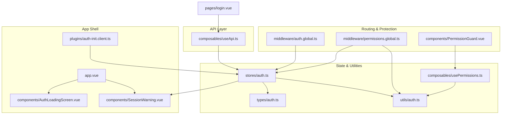

**Diagram sources**
- [app.vue:1-33](file://app/app.vue#L1-L33)
- [auth-init.client.ts:1-25](file://app/plugins/auth-init.client.ts#L1-L25)
- [auth.global.ts:1-32](file://app/middleware/auth.global.ts#L1-L32)
- [permissions.global.ts:1-59](file://app/middleware/permissions.global.ts#L1-L59)
- [PermissionGuard.vue:1-38](file://app/components/PermissionGuard.vue#L1-L38)
- [auth.ts:1-230](file://app/stores/auth.ts#L1-L230)
- [auth.ts:1-64](file://app/types/auth.ts#L1-L64)
- [auth.ts:1-58](file://app/utils/auth.ts#L1-L58)
- [usePermissions.ts:1-43](file://app/composables/usePermissions.ts#L1-L43)
- [useApi.ts:1-91](file://app/composables/useApi.ts#L1-L91)
- [AuthLoadingScreen.vue:1-29](file://app/components/AuthLoadingScreen.vue#L1-L29)
- [login.vue:1-167](file://app/pages/login.vue#L1-L167)

**Section sources**
- [nuxt.config.ts:1-46](file://nuxt.config.ts#L1-L46)
- [app.vue:1-33](file://app/app.vue#L1-L33)

## Core Components
- Auth store (Pinia): Holds user, token, team member profile, session expiry, and warning state; manages periodic checks, refresh, logout, and profile sync.
- Global middleware: Enforces authentication and permission requirements per route.
- Permission guard component: Declarative client-side gating based on roles and permissions.
- Session warning component: In-app notification prompting session extension before expiry.
- API helper: Injects Bearer token into requests and centralizes error handling, including 401 logout flows.
- Auth initialization plugin: Validates session on app start and redirects if invalid.

Key responsibilities:
- Token lifecycle: set on login, attach to requests, validate periodically, refresh or logout on failure.
- Role-based access control: Admins implicitly have all permissions; other users must hold explicit permissions.
- Team member profile sync: After login and session refresh, fetches role and permissions from /user/profile and merges them into the user object.

**Section sources**
- [auth.ts:1-230](file://app/stores/auth.ts#L1-L230)
- [auth.global.ts:1-32](file://app/middleware/auth.global.ts#L1-L32)
- [permissions.global.ts:1-59](file://app/middleware/permissions.global.ts#L1-L59)
- [PermissionGuard.vue:1-38](file://app/components/PermissionGuard.vue#L1-L38)
- [SessionWarning.vue:1-66](file://app/components/SessionWarning.vue#L1-L66)
- [useApi.ts:1-91](file://app/composables/useApi.ts#L1-L91)
- [auth-init.client.ts:1-25](file://app/plugins/auth-init.client.ts#L1-L25)

## Architecture Overview
The system follows a layered approach:
- Presentation layer: Pages and components consume the auth store and permission helpers.
- Middleware layer: Protects routes globally using auth and permission checks.
- State layer: Pinia store persists token and user data across sessions and coordinates background tasks.
- API layer: Centralized HTTP client attaches tokens and handles unauthorized responses.

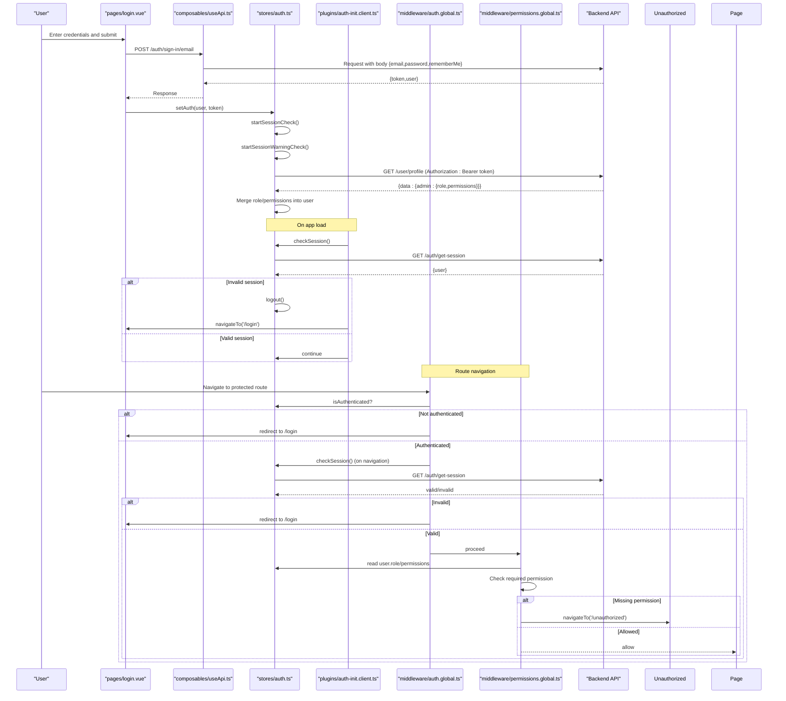

**Diagram sources**
- [login.vue:1-167](file://app/pages/login.vue#L1-L167)
- [useApi.ts:1-91](file://app/composables/useApi.ts#L1-L91)
- [auth.ts:1-230](file://app/stores/auth.ts#L1-L230)
- [auth-init.client.ts:1-25](file://app/plugins/auth-init.client.ts#L1-L25)
- [auth.global.ts:1-32](file://app/middleware/auth.global.ts#L1-L32)
- [permissions.global.ts:1-59](file://app/middleware/permissions.global.ts#L1-L59)

## Detailed Component Analysis

### Auth Store (Pinia)
Responsibilities:
- Maintain user, token, teamMember, sessionExpiresAt, and warning flags
- Provide computed isAuthenticated flag
- Set auth state and initialize session timers
- Periodically verify session validity and extend when possible
- Show session warning near expiry and handle expiration
- Fetch and merge team member profile (role and permissions)
- Logout clears state and stops intervals

Key behaviors:
- Session expiry window: 30 minutes from last activity
- Warning threshold: 2 minutes before expiry
- Periodic check interval: every 5 minutes
- Profile sync: after login and session refresh

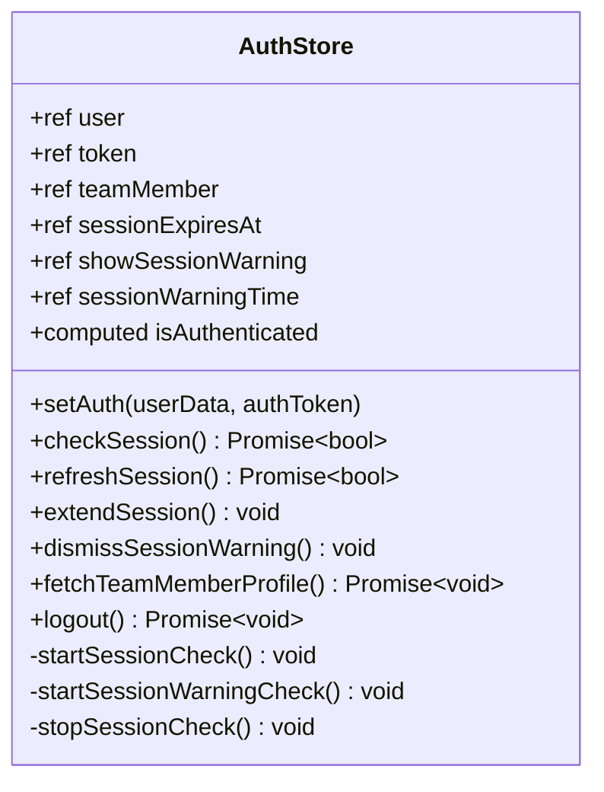

**Diagram sources**
- [auth.ts:1-230](file://app/stores/auth.ts#L1-L230)

**Section sources**
- [auth.ts:1-230](file://app/stores/auth.ts#L1-L230)

### Global Auth Middleware
Responsibilities:
- Allow public routes (/login, /forgot-password, /unauthorized, /pay/**)
- Redirect unauthenticated users to /login
- Validate session on navigation (not initial load) by calling store.checkSession()

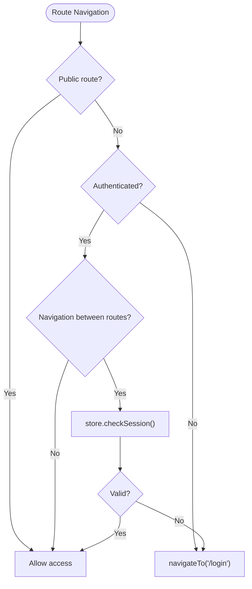

**Diagram sources**
- [auth.global.ts:1-32](file://app/middleware/auth.global.ts#L1-L32)

**Section sources**
- [auth.global.ts:1-32](file://app/middleware/auth.global.ts#L1-L32)

### Global Permissions Middleware
Responsibilities:
- Skip public routes and payment pages
- Allow admins/super admins to access everything
- Map routes to required permissions and enforce at runtime
- Redirect to /unauthorized if missing required permission

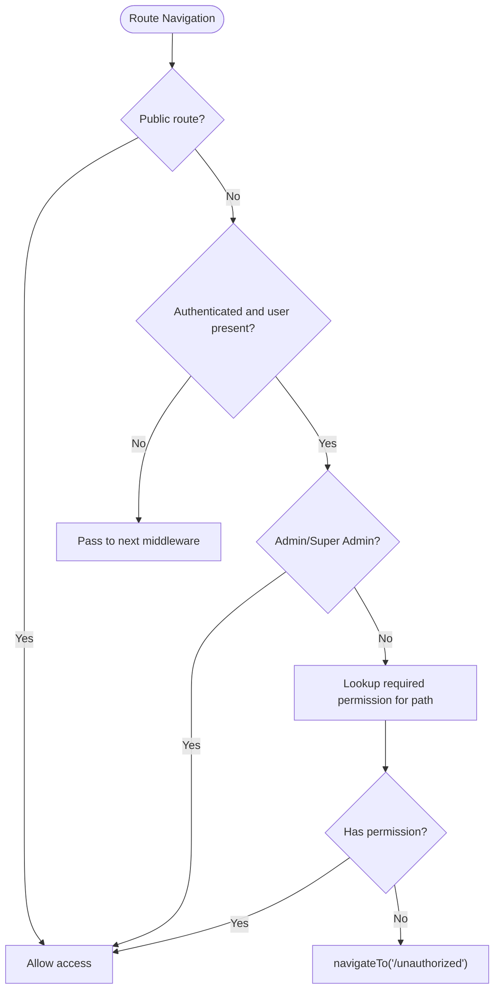

**Diagram sources**
- [permissions.global.ts:1-59](file://app/middleware/permissions.global.ts#L1-L59)

**Section sources**
- [permissions.global.ts:1-59](file://app/middleware/permissions.global.ts#L1-L59)

### Permission Guard Component
Responsibilities:
- Declarative client-side gating for slots
- Supports single permission, multiple permissions (any/all), single role, multiple roles, and super admin bypass

Usage examples:
- Require any one of several permissions
- Require all permissions for a feature
- Restrict by role names

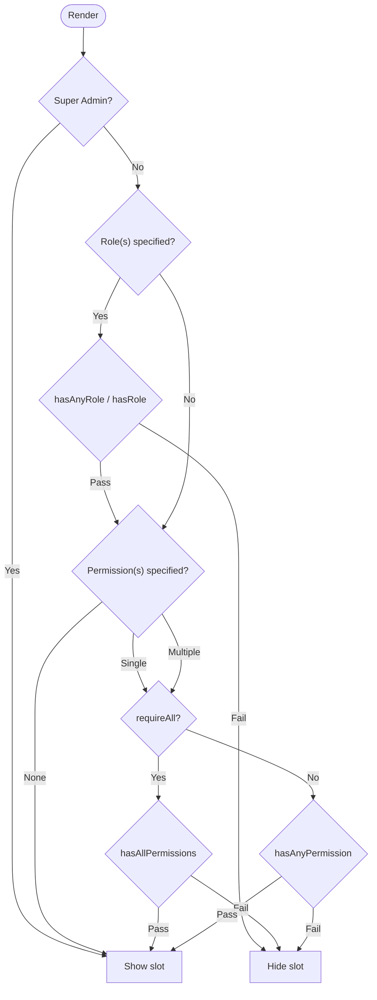

**Diagram sources**
- [PermissionGuard.vue:1-38](file://app/components/PermissionGuard.vue#L1-L38)
- [usePermissions.ts:1-43](file://app/composables/usePermissions.ts#L1-L43)

**Section sources**
- [PermissionGuard.vue:1-38](file://app/components/PermissionGuard.vue#L1-L38)
- [usePermissions.ts:1-43](file://app/composables/usePermissions.ts#L1-L43)

### Session Warning System
Responsibilities:
- Display a non-blocking warning when session expires within 2 minutes
- Provide Extend Session action that triggers refreshSession()
- Dismissable without affecting session lifecycle

Integration points:
- Controlled by store flags showSessionWarning and sessionWarningTime
- Rendered in app shell and bound to store actions

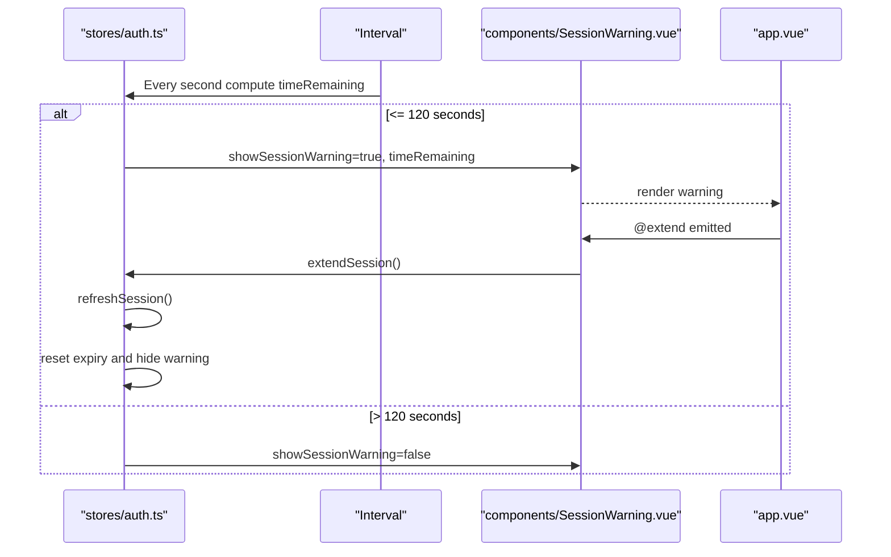

**Diagram sources**
- [auth.ts:122-146](file://app/stores/auth.ts#L122-L146)
- [SessionWarning.vue:1-66](file://app/components/SessionWarning.vue#L1-L66)
- [app.vue:20-26](file://app/app.vue#L20-L26)

**Section sources**
- [SessionWarning.vue:1-66](file://app/components/SessionWarning.vue#L1-L66)
- [app.vue:20-26](file://app/app.vue#L20-L26)

### API Helper and Token Handling
Responsibilities:
- Attach Authorization header with Bearer token when available
- Handle 401 Unauthorized by logging out and redirecting to login
- Normalize success status codes and throw descriptive errors otherwise
- Provide typed signIn helper returning token and user

Security considerations:
- Tokens are attached only when present
- 401 responses trigger immediate logout and redirect
- Errors propagate up to callers for toast display

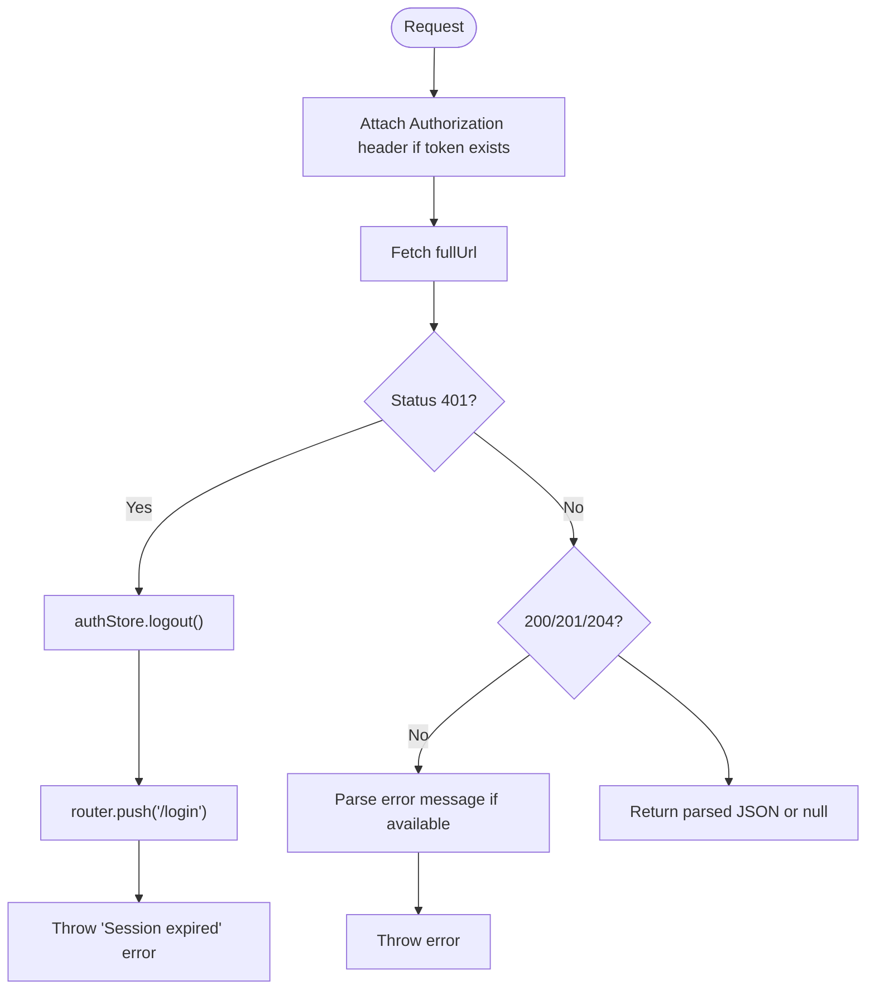

**Diagram sources**
- [useApi.ts:1-91](file://app/composables/useApi.ts#L1-L91)

**Section sources**
- [useApi.ts:1-91](file://app/composables/useApi.ts#L1-L91)

### Auth Initialization Plugin
Responsibilities:
- Provide isCheckingAuth flag to app shell
- If already authenticated, validate session on startup
- Redirect to login if session invalid
- Mark auth check as complete to reveal app content

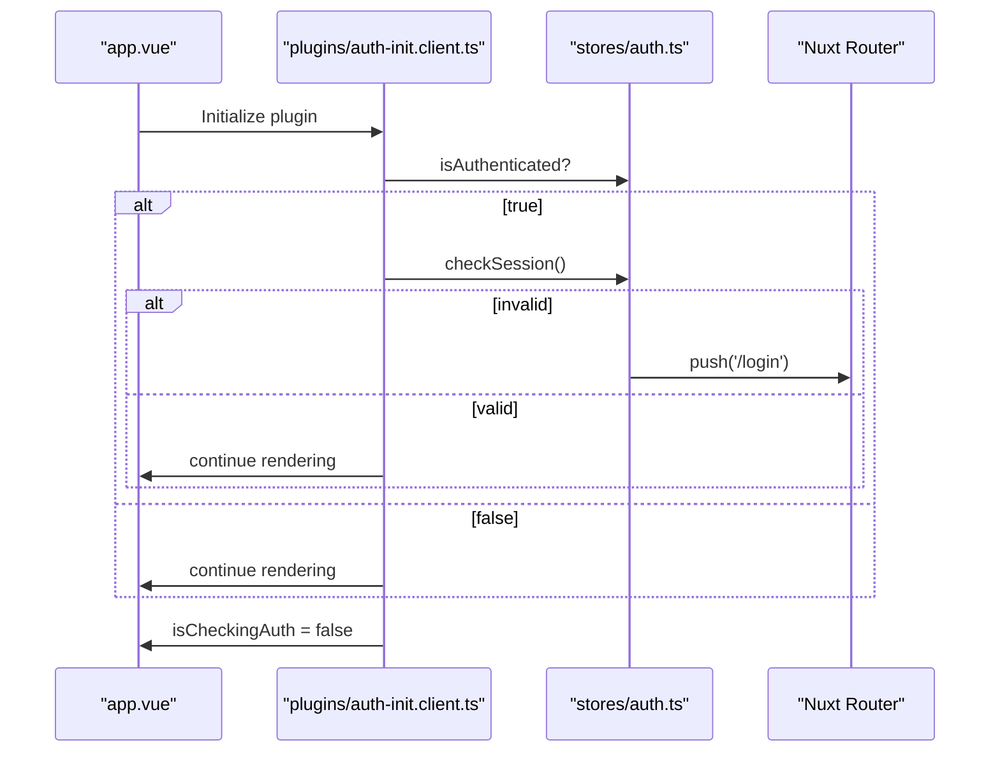

**Diagram sources**
- [auth-init.client.ts:1-25](file://app/plugins/auth-init.client.ts#L1-L25)
- [app.vue:1-12](file://app/app.vue#L1-L12)

**Section sources**
- [auth-init.client.ts:1-25](file://app/plugins/auth-init.client.ts#L1-L25)
- [app.vue:1-12](file://app/app.vue#L1-L12)

### Login Flow
Responsibilities:
- Validate email and password locally
- Call useApi.signIn to authenticate
- On success, call store.setAuth to persist user and token
- Show success toast and navigate to home

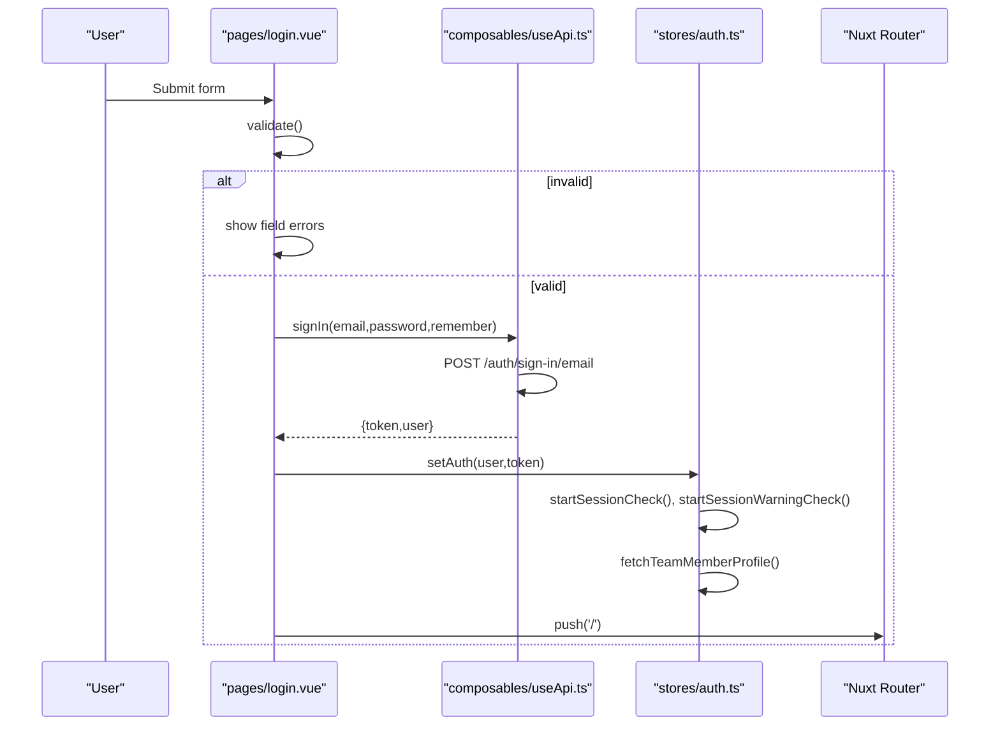

**Diagram sources**
- [login.vue:1-167](file://app/pages/login.vue#L1-L167)
- [useApi.ts:82-86](file://app/composables/useApi.ts#L82-L86)
- [auth.ts:45-57](file://app/stores/auth.ts#L45-L57)

**Section sources**
- [login.vue:1-167](file://app/pages/login.vue#L1-L167)

### Role-Based Access Control and Implicit Permissions
- Admin roles include “super admin” and “admin”. These roles implicitly grant all permissions.
- Non-admin users must have explicit permissions listed in their user.permissions array.
- Permission checks are centralized in utils/auth.ts and exposed via composables/usePermissions.ts.
- Route-level enforcement uses a mapping table in permissions.global.ts.

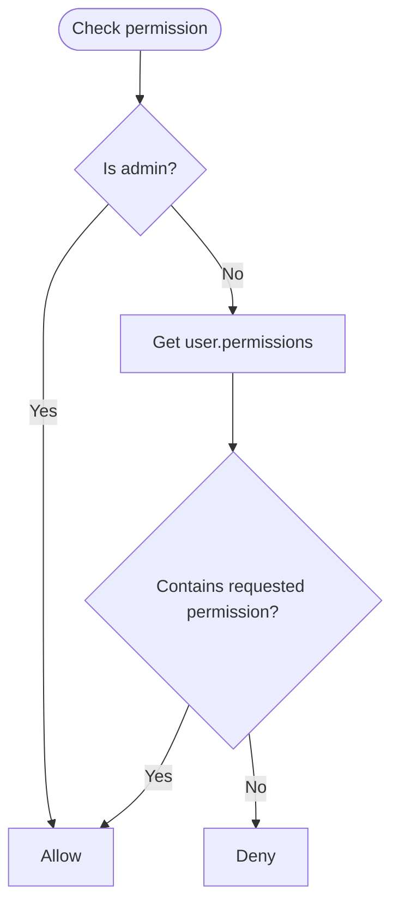

**Diagram sources**
- [auth.ts:1-58](file://app/utils/auth.ts#L1-L58)
- [permissions.global.ts:20-57](file://app/middleware/permissions.global.ts#L20-L57)

**Section sources**
- [auth.ts:1-58](file://app/utils/auth.ts#L1-L58)
- [permissions.global.ts:1-59](file://app/middleware/permissions.global.ts#L1-L59)

## Dependency Analysis
High-level dependencies:
- Middleware depends on the auth store and utility functions for role/permission checks.
- Store depends on types and runtime config for API endpoints.
- API helper depends on auth store for token injection and router for redirection.
- Components depend on composables and store state for UI behavior.

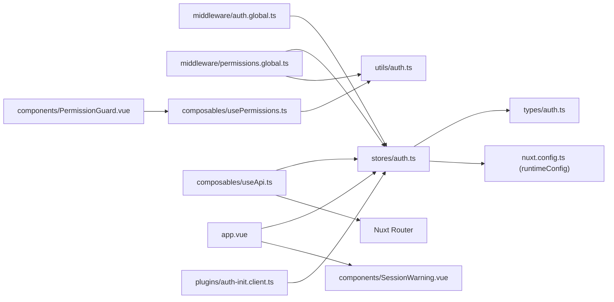

**Diagram sources**
- [auth.global.ts:1-32](file://app/middleware/auth.global.ts#L1-L32)
- [permissions.global.ts:1-59](file://app/middleware/permissions.global.ts#L1-L59)
- [PermissionGuard.vue:1-38](file://app/components/PermissionGuard.vue#L1-L38)
- [usePermissions.ts:1-43](file://app/composables/usePermissions.ts#L1-L43)
- [auth.ts:1-58](file://app/utils/auth.ts#L1-L58)
- [useApi.ts:1-91](file://app/composables/useApi.ts#L1-L91)
- [auth.ts:1-230](file://app/stores/auth.ts#L1-L230)
- [auth.ts:1-64](file://app/types/auth.ts#L1-L64)
- [nuxt.config.ts:21-26](file://nuxt.config.ts#L21-L26)
- [app.vue:1-33](file://app/app.vue#L1-L33)
- [auth-init.client.ts:1-25](file://app/plugins/auth-init.client.ts#L1-L25)

**Section sources**
- [nuxt.config.ts:1-46](file://nuxt.config.ts#L1-L46)

## Performance Considerations
- Session checks run every 5 minutes; consider adjusting frequency based on server load and user experience needs.
- Warning timer runs every second; ensure it is cleared on logout and component unmount to avoid memory leaks.
- Profile fetch occurs after login and each successful session refresh; cache results where appropriate to reduce network calls.
- Avoid redundant re-renders by leveraging computed properties and minimizing unnecessary reactive updates.

[No sources needed since this section provides general guidance]

## Troubleshooting Guide
Common issues and resolutions:
- 401 Unauthorized during API calls: The API helper logs out and redirects to login. Ensure backend token validation aligns with client expectations.
- Session not refreshing: Verify /auth/get-session endpoint returns valid user data and that store.refreshSession() resets expiry correctly.
- Permission denied unexpectedly: Confirm route-permission mappings in permissions.global.ts match backend role/permission definitions.
- Warning not appearing: Ensure store.showSessionWarning and sessionWarningTime are updated and SessionWarning is rendered in app.vue.
- Persistent state mismatch: The store is configured to persist; clear browser storage if state becomes inconsistent after backend changes.

Operational tips:
- Inspect console logs prefixed with “[auth]”, “[permissions]”, and “[useApi]” for detailed diagnostics.
- Use the PermissionGuard component to quickly test UI visibility for different roles/permissions.
- Temporarily widen public routes for debugging, then revert to secure defaults.

**Section sources**
- [useApi.ts:39-44](file://app/composables/useApi.ts#L39-L44)
- [auth.ts:90-120](file://app/stores/auth.ts#L90-L120)
- [permissions.global.ts:31-57](file://app/middleware/permissions.global.ts#L31-L57)
- [app.vue:20-26](file://app/app.vue#L20-L26)

## Conclusion
The authentication and session management system provides robust, layered security:
- Strong route protection via global middleware
- Flexible permission checks with role-based and explicit permission support
- Seamless session maintenance with automatic checks and user-friendly warnings
- Centralized API integration ensuring consistent token handling and error responses
- Clear separation of concerns across store, middleware, components, and utilities

Adhering to these patterns ensures maintainability, scalability, and a secure user experience.

[No sources needed since this section summarizes without analyzing specific files]

## Appendices

### Protected Routes Examples
- Customer listing requires customers.view
- Driver listing requires drivers.view
- Truck listing requires drivers.view
- Pickup listing requires pickups.view
- Tracking dashboard requires tracking.view
- Billing requires billing.view
- Shop requires shop.view
- Inventory requires inventory.view
- Support requires support.view
- Team requires team.view
- Reports requires reports.view
- Management requires management.view
- Communications requires communications.send

These mappings are enforced by the permissions middleware.

**Section sources**
- [permissions.global.ts:31-46](file://app/middleware/permissions.global.ts#L31-L46)

### Permission Guards Usage Patterns
- Single permission: wrap a block with PermissionGuard and pass permission prop
- Multiple permissions (any): pass an array of permissions without requireAll
- Multiple permissions (all): pass an array with requireAll set to true
- Role-based: pass role or roles props to restrict by role names

**Section sources**
- [PermissionGuard.vue:1-38](file://app/components/PermissionGuard.vue#L1-L38)
- [usePermissions.ts:1-43](file://app/composables/usePermissions.ts#L1-L43)

### Security Considerations
- Tokens are transmitted via Authorization headers; ensure HTTPS is enforced in production.
- Admin roles implicitly bypass permission checks; limit admin accounts carefully.
- Session expiry is short-lived; encourage frequent interactions to keep sessions active.
- Avoid storing sensitive data beyond token and minimal user info in persisted state.

[No sources needed since this section provides general guidance]