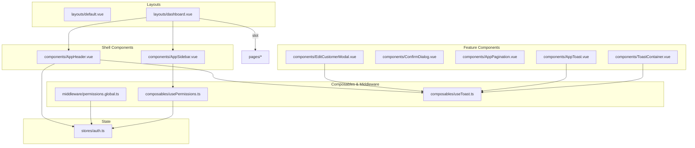
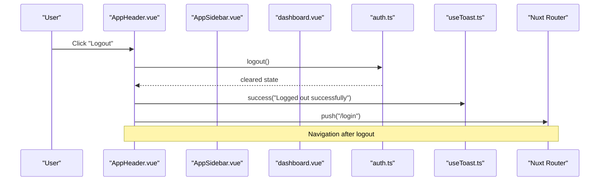
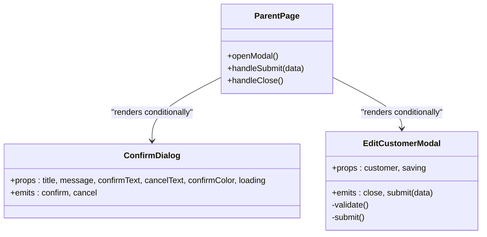
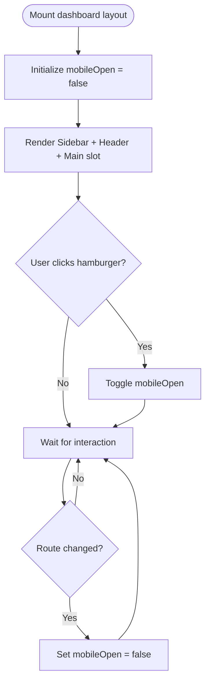
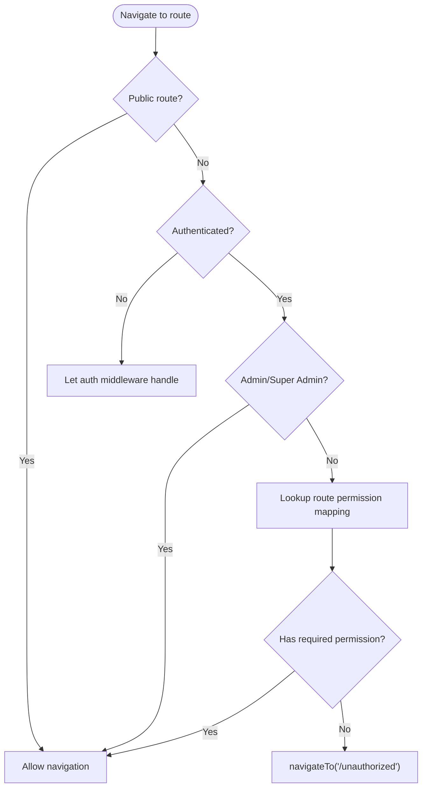
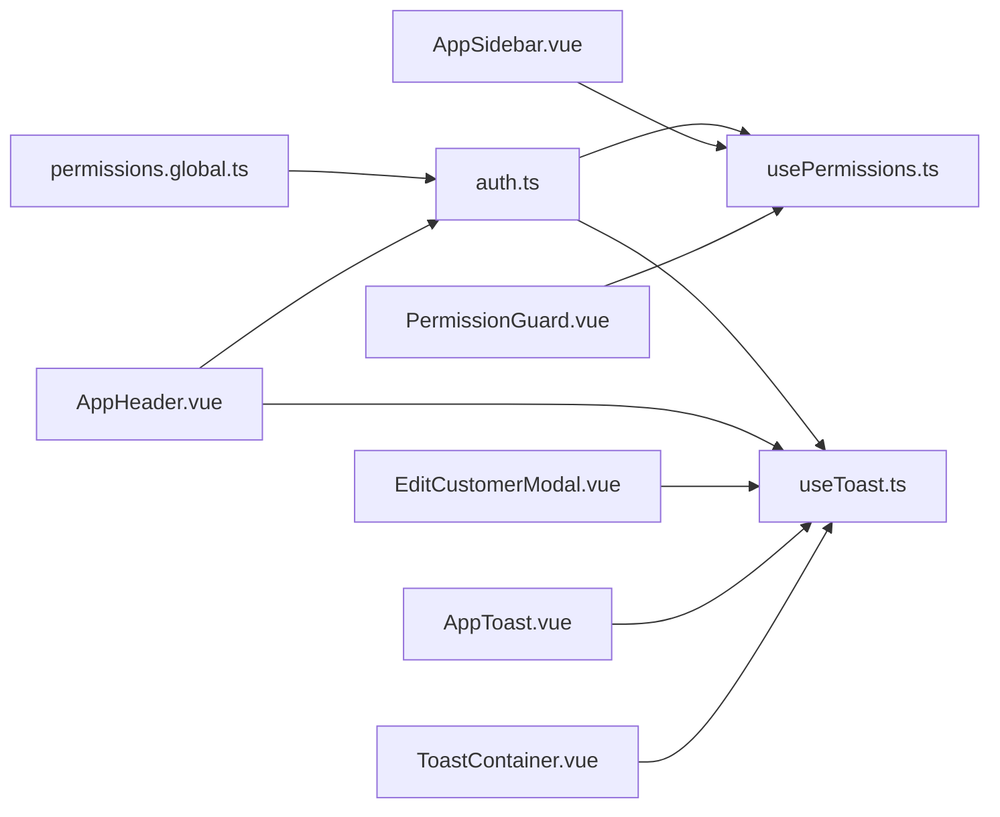

# Component Architecture Patterns

<cite>
**Referenced Files in This Document**
- [PermissionGuard.vue](file://app/components/PermissionGuard.vue)
- [usePermissions.ts](file://app/composables/usePermissions.ts)
- [permissions.global.ts](file://app/middleware/permissions.global.ts)
- [AppHeader.vue](file://app/components/AppHeader.vue)
- [AppSidebar.vue](file://app/components/AppSidebar.vue)
- [dashboard.vue](file://app/layouts/dashboard.vue)
- [default.vue](file://app/layouts/default.vue)
- [ConfirmDialog.vue](file://app/components/ConfirmDialog.vue)
- [EditCustomerModal.vue](file://app/components/EditCustomerModal.vue)
- [AppToast.vue](file://app/components/AppToast.vue)
- [ToastContainer.vue](file://app/components/ToastContainer.vue)
- [useToast.ts](file://app/composables/useToast.ts)
- [auth.ts](file://app/stores/auth.ts)
- [AppPagination.vue](file://app/components/AppPagination.vue)
</cite>

## Table of Contents
1. [Introduction](#introduction)
2. [Project Structure](#project-structure)
3. [Core Components](#core-components)
4. [Architecture Overview](#architecture-overview)
5. [Detailed Component Analysis](#detailed-component-analysis)
6. [Dependency Analysis](#dependency-analysis)
7. [Performance Considerations](#performance-considerations)
8. [Troubleshooting Guide](#troubleshooting-guide)
9. [Conclusion](#conclusion)

## Introduction
This document explains the component architecture patterns used across the application, focusing on:
- Reusable component library structure and composition patterns
- Modal system architecture and form component patterns
- Layout component hierarchies and responsive behavior
- Permission guard pattern and route-level authorization
- Loading state management and toast notifications
- Event bubbling strategies and prop/event interfaces
- Testing strategies, accessibility considerations, and performance optimizations
- The relationship between presentational and container components

The goal is to provide a clear mental model for how UI pieces are organized, composed, and governed by permissions and state.

## Project Structure
The project follows a Nuxt 3 layout-based architecture with feature-oriented directories:
- app/components: Presentational and reusable UI components (modals, headers, sidebars, pagination, toasts)
- app/layouts: Page layouts that compose shell components (header, sidebar, main content)
- app/composables: Shared logic exposed as composables (permissions, toast notifications)
- app/middleware: Global middleware for authentication and permission checks
- app/stores: Centralized state (e.g., auth store)
- app/pages: Feature pages that compose layout and components

**Diagram sources**
- [dashboard.vue:1-25](file://app/layouts/dashboard.vue#L1-L25)
- [default.vue:1-6](file://app/layouts/default.vue#L1-L6)
- [AppHeader.vue:1-94](file://app/components/AppHeader.vue#L1-L94)
- [AppSidebar.vue:1-319](file://app/components/AppSidebar.vue#L1-L319)
- [EditCustomerModal.vue:1-242](file://app/components/EditCustomerModal.vue#L1-L242)
- [ConfirmDialog.vue:1-53](file://app/components/ConfirmDialog.vue#L1-L53)
- [AppToast.vue:1-115](file://app/components/AppToast.vue#L1-L115)
- [ToastContainer.vue:1-120](file://app/components/ToastContainer.vue#L1-L120)
- [usePermissions.ts:1-43](file://app/composables/usePermissions.ts#L1-L43)
- [useToast.ts:1-37](file://app/composables/useToast.ts#L1-L37)
- [permissions.global.ts:1-59](file://app/middleware/permissions.global.ts#L1-L59)
- [auth.ts:1-230](file://app/stores/auth.ts#L1-L230)

**Section sources**
- [dashboard.vue:1-25](file://app/layouts/dashboard.vue#L1-L25)
- [default.vue:1-6](file://app/layouts/default.vue#L1-L6)
- [AppHeader.vue:1-94](file://app/components/AppHeader.vue#L1-L94)
- [AppSidebar.vue:1-319](file://app/components/AppSidebar.vue#L1-L319)
- [EditCustomerModal.vue:1-242](file://app/components/EditCustomerModal.vue#L1-L242)
- [ConfirmDialog.vue:1-53](file://app/components/ConfirmDialog.vue#L1-L53)
- [AppToast.vue:1-115](file://app/components/AppToast.vue#L1-L115)
- [ToastContainer.vue:1-120](file://app/components/ToastContainer.vue#L1-L120)
- [usePermissions.ts:1-43](file://app/composables/usePermissions.ts#L1-L43)
- [useToast.ts:1-37](file://app/composables/useToast.ts#L1-L37)
- [permissions.global.ts:1-59](file://app/middleware/permissions.global.ts#L1-L59)
- [auth.ts:1-230](file://app/stores/auth.ts#L1-L230)

## Core Components
- Shell components: AppHeader and AppSidebar compose the dashboard layout and handle user interactions like logout and navigation.
- Modal system: ConfirmDialog provides a generic confirmation dialog; EditCustomerModal demonstrates a complex modal with form fields, validation, and submission events.
- Toast system: useToast composable manages global toasts; AppToast and ToastContainer render them with animations and progress bars.
- Navigation and pagination: AppSidebar renders permission-filtered links; AppPagination emits page changes via v-model-like update:page event.
- Permission guard: PermissionGuard wraps content based on roles/permissions; permissions.global.ts enforces route-level access.

Key responsibilities:
- Composition: Layouts compose shell components and pass slot content from pages.
- Events: Components emit typed events (e.g., confirm/cancel, close/submit, toggle-sidebar).
- State: Auth store drives user info and session; composables encapsulate cross-cutting concerns.

**Section sources**
- [AppHeader.vue:1-94](file://app/components/AppHeader.vue#L1-L94)
- [AppSidebar.vue:1-319](file://app/components/AppSidebar.vue#L1-L319)
- [ConfirmDialog.vue:1-53](file://app/components/ConfirmDialog.vue#L1-L53)
- [EditCustomerModal.vue:1-242](file://app/components/EditCustomerModal.vue#L1-L242)
- [AppToast.vue:1-115](file://app/components/AppToast.vue#L1-L115)
- [ToastContainer.vue:1-120](file://app/components/ToastContainer.vue#L1-L120)
- [useToast.ts:1-37](file://app/composables/useToast.ts#L1-L37)
- [AppPagination.vue:1-48](file://app/components/AppPagination.vue#L1-L48)
- [PermissionGuard.vue:1-38](file://app/components/PermissionGuard.vue#L1-L38)
- [permissions.global.ts:1-59](file://app/middleware/permissions.global.ts#L1-L59)
- [auth.ts:1-230](file://app/stores/auth.ts#L1-L230)

## Architecture Overview
The application uses a layered architecture:
- Layout layer: default.vue and dashboard.vue define page shells and slots.
- Shell components: AppHeader and AppSidebar orchestrate top-level UX and navigation.
- Feature modals/forms: EditCustomerModal and ConfirmDialog encapsulate domain-specific flows.
- Cross-cutting services: useToast and usePermissions provide shared capabilities.
- Middleware: permissions.global.ts enforces route-level security.

**Diagram sources**
- [AppHeader.vue:1-94](file://app/components/AppHeader.vue#L1-L94)
- [auth.ts:1-230](file://app/stores/auth.ts#L1-L230)
- [useToast.ts:1-37](file://app/composables/useToast.ts#L1-L37)

## Detailed Component Analysis

### Modal System Architecture
The modal system separates presentation from business logic:
- ConfirmDialog: A generic confirmation dialog with props for title, message, labels, color, and loading state. Emits confirm and cancel events.
- EditCustomerModal: A domain-specific modal that loads options, validates inputs, and emits submit with normalized data. It also emits close.

Composition patterns:
- Parent controls visibility and handles lifecycle (open/close), while child modal focuses on form logic and emits events upward.
- Loading states are passed down via props and reflected in buttons.

Event bubbling strategy:
- Child emits typed events; parent listens and performs API calls or navigations.

Accessibility notes:
- Use semantic elements (buttons, labels) and ensure focus management when opening/closing modals.

**Diagram sources**
- [ConfirmDialog.vue:1-53](file://app/components/ConfirmDialog.vue#L1-L53)
- [EditCustomerModal.vue:1-242](file://app/components/EditCustomerModal.vue#L1-L242)

**Section sources**
- [ConfirmDialog.vue:1-53](file://app/components/ConfirmDialog.vue#L1-L53)
- [EditCustomerModal.vue:1-242](file://app/components/EditCustomerModal.vue#L1-L242)

### Form Component Patterns
Form patterns in EditCustomerModal:
- Props: Receive initial data and saving flag.
- Local reactive form state initialized from props.
- Validation function returns boolean and populates error map keyed by field.
- Submit normalizes values and emits typed payload.
- Input styling helpers apply error-focused border colors and custom select styles.

Best practices:
- Keep validation local to the form component.
- Emit normalized payloads to decouple from internal form state.
- Disable submit button during saving to prevent duplicate submissions.

**Section sources**
- [EditCustomerModal.vue:1-242](file://app/components/EditCustomerModal.vue#L1-L242)

### Layout Component Hierarchies
Layouts compose shell components and expose slots for page content:
- default.vue: Minimal wrapper with a single slot.
- dashboard.vue: Full-screen layout with mobile backdrop, sidebar, header, and main content area. Manages mobile open state and closes sidebar on route change.

Responsive design approach:
- Mobile sidebar overlay controlled by mobileOpen state.
- Backdrop click closes sidebar.
- Route change resets mobile sidebar to closed.

**Diagram sources**
- [dashboard.vue:1-25](file://app/layouts/dashboard.vue#L1-L25)

**Section sources**
- [default.vue:1-6](file://app/layouts/default.vue#L1-L6)
- [dashboard.vue:1-25](file://app/layouts/dashboard.vue#L1-L25)

### Permission Guard Pattern
Two layers of protection:
- Route-level: permissions.global.ts maps routes to required permissions and redirects unauthorized users.
- Component-level: PermissionGuard wraps content based on role/permission props and supports requireAll semantics.

Flow:
- On navigation, middleware checks public routes, admin status, and route permission mapping.
- If missing permission, redirect to /unauthorized.
- Within pages, PermissionGuard can hide sensitive UI elements even if the route is accessible.

**Diagram sources**
- [permissions.global.ts:1-59](file://app/middleware/permissions.global.ts#L1-L59)

**Section sources**
- [permissions.global.ts:1-59](file://app/middleware/permissions.global.ts#L1-L59)
- [PermissionGuard.vue:1-38](file://app/components/PermissionGuard.vue#L1-L38)
- [usePermissions.ts:1-43](file://app/composables/usePermissions.ts#L1-L43)

### Toast System and Notifications
Global toast management:
- useToast composable exposes show/dismiss and convenience methods (success, error, warning, info).
- AppToast and ToastContainer both consume the same composable but differ in rendering and animation.
- ToastContainer teleports to body and includes a progress bar indicating auto-dismiss duration.

Usage pattern:
- Call useAppToast() anywhere to trigger toasts.
- Render either AppToast or ToastContainer once at the app root to display toasts globally.

**Section sources**
- [useToast.ts:1-37](file://app/composables/useToast.ts#L1-L37)
- [AppToast.vue:1-115](file://app/components/AppToast.vue#L1-L115)
- [ToastContainer.vue:1-120](file://app/components/ToastContainer.vue#L1-L120)

### Pagination Component
AppPagination is a presentational component:
- Props: page, total, perPage.
- Emits update:page to support v-model-like binding.
- Computes page range and disables prev/next at boundaries.

Composition example:
- Parent page maintains page state and passes it down; listens to update:page to refetch data.

**Section sources**
- [AppPagination.vue:1-48](file://app/components/AppPagination.vue#L1-L48)

### Relationship Between Presentational and Container Components
- Presentational components: ConfirmDialog, AppToast, ToastContainer, AppPagination, AppHeader, AppSidebar. They receive props and emit events without direct business logic.
- Container components: Pages and layout wrappers manage state, fetch data, and orchestrate flow. For example, dashboard.vue coordinates sidebar/header state; edit flows in pages would call EditCustomerModal’s submit handler to perform API operations.

Guidelines:
- Keep UI-only logic in presentational components.
- Move data fetching, mutations, and routing into containers.
- Use typed props/emits to enforce contracts.

[No sources needed since this section synthesizes patterns across multiple files]

## Dependency Analysis
High-level dependencies:
- Shell components depend on composables and stores for user state and notifications.
- Modals depend on composables for API calls and toasts.
- Middleware depends on auth store and utility functions for permission checks.
- PermissionGuard depends on usePermissions composable.

**Diagram sources**
- [auth.ts:1-230](file://app/stores/auth.ts#L1-L230)
- [usePermissions.ts:1-43](file://app/composables/usePermissions.ts#L1-L43)
- [useToast.ts:1-37](file://app/composables/useToast.ts#L1-L37)
- [permissions.global.ts:1-59](file://app/middleware/permissions.global.ts#L1-L59)
- [AppHeader.vue:1-94](file://app/components/AppHeader.vue#L1-L94)
- [AppSidebar.vue:1-319](file://app/components/AppSidebar.vue#L1-L319)
- [EditCustomerModal.vue:1-242](file://app/components/EditCustomerModal.vue#L1-L242)
- [AppToast.vue:1-115](file://app/components/AppToast.vue#L1-L115)
- [ToastContainer.vue:1-120](file://app/components/ToastContainer.vue#L1-L120)
- [PermissionGuard.vue:1-38](file://app/components/PermissionGuard.vue#L1-L38)

**Section sources**
- [auth.ts:1-230](file://app/stores/auth.ts#L1-L230)
- [usePermissions.ts:1-43](file://app/composables/usePermissions.ts#L1-L43)
- [useToast.ts:1-37](file://app/composables/useToast.ts#L1-L37)
- [permissions.global.ts:1-59](file://app/middleware/permissions.global.ts#L1-L59)
- [AppHeader.vue:1-94](file://app/components/AppHeader.vue#L1-L94)
- [AppSidebar.vue:1-319](file://app/components/AppSidebar.vue#L1-L319)
- [EditCustomerModal.vue:1-242](file://app/components/EditCustomerModal.vue#L1-L242)
- [AppToast.vue:1-115](file://app/components/AppToast.vue#L1-L115)
- [ToastContainer.vue:1-120](file://app/components/ToastContainer.vue#L1-L120)
- [PermissionGuard.vue:1-38](file://app/components/PermissionGuard.vue#L1-L38)

## Performance Considerations
- Prefer computed properties for derived UI state (e.g., active nav, totals) to avoid unnecessary recalculations.
- Debounce search input in header if integrated with live search.
- Lazy-load heavy modals or large lists using async components or virtualization where applicable.
- Minimize re-renders by keeping modal state at the container level and passing minimal props to presentational children.
- Use Teleport for overlays/toasts to avoid deep DOM traversal issues.
- Avoid inline style mutations on hover/focus; prefer CSS classes for better caching and performance.

[No sources needed since this section provides general guidance]

## Troubleshooting Guide
Common issues and resolutions:
- Unauthorized redirects: Ensure route mappings in middleware match actual paths and that user permissions include required scopes.
- Missing UI due to PermissionGuard: Verify role/permission props and that super admin bypass works as expected.
- Toast not appearing: Confirm a toast renderer (AppToast or ToastContainer) is mounted and useAppToast is called correctly.
- Modal submit disabled unexpectedly: Check saving/loading props and ensure they reflect backend request state.
- Session expiry loops: Validate periodic session checks and sign-out flows in auth store.

**Section sources**
- [permissions.global.ts:1-59](file://app/middleware/permissions.global.ts#L1-L59)
- [PermissionGuard.vue:1-38](file://app/components/PermissionGuard.vue#L1-L38)
- [useToast.ts:1-37](file://app/composables/useToast.ts#L1-L37)
- [EditCustomerModal.vue:1-242](file://app/components/EditCustomerModal.vue#L1-L242)
- [auth.ts:1-230](file://app/stores/auth.ts#L1-L230)

## Conclusion
The application employs a clear separation of concerns:
- Layouts compose shell components and expose slots.
- Presentational components focus on UI and emit typed events.
- Containers manage state, orchestration, and data flow.
- Permissions are enforced at both route and component levels.
- Toast notifications and loading states are centralized via composables.
Adhering to these patterns improves maintainability, testability, and user experience.

[No sources needed since this section summarizes without analyzing specific files]