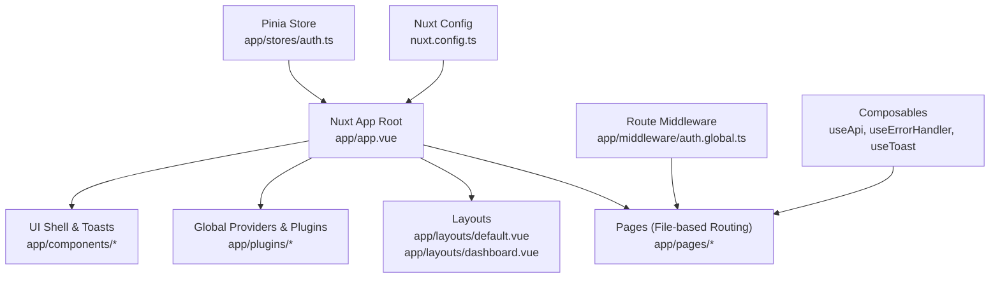
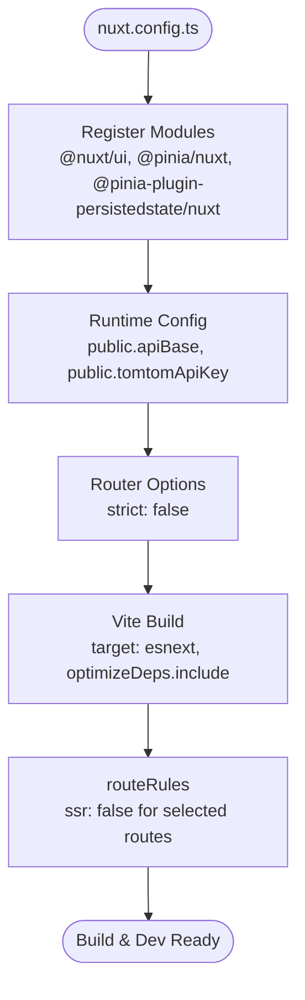
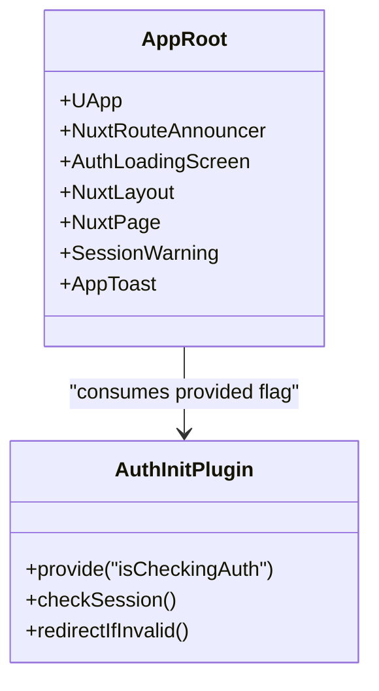
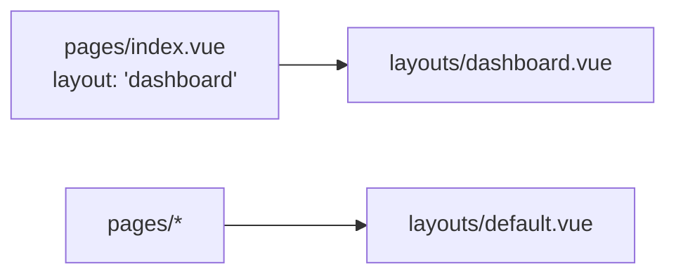
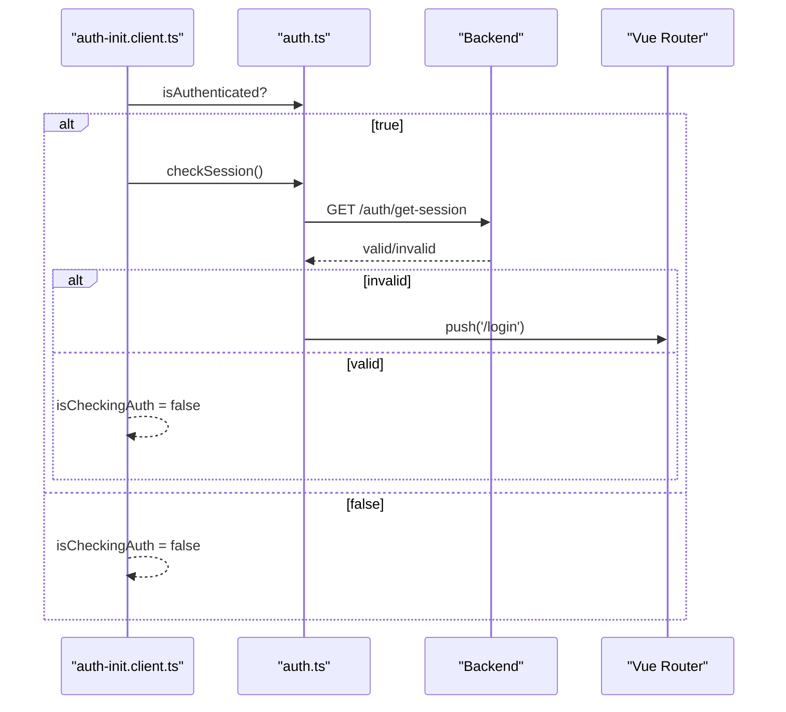
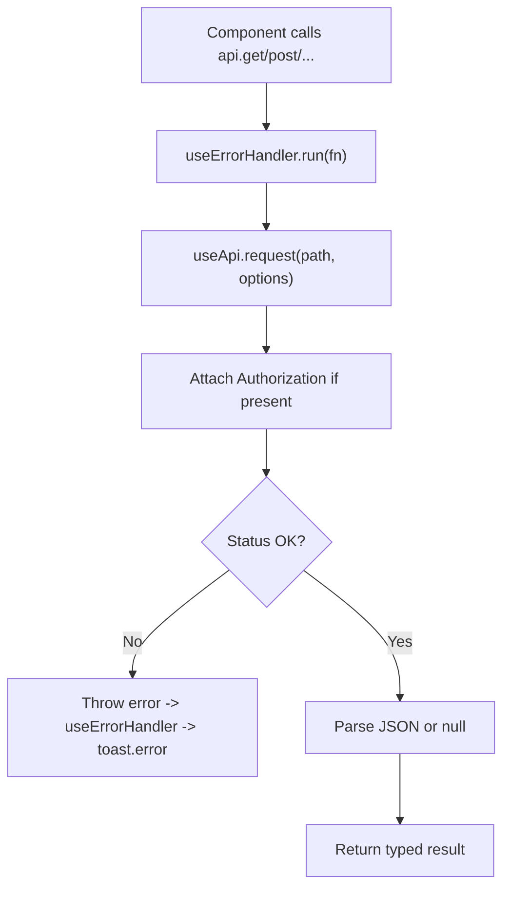
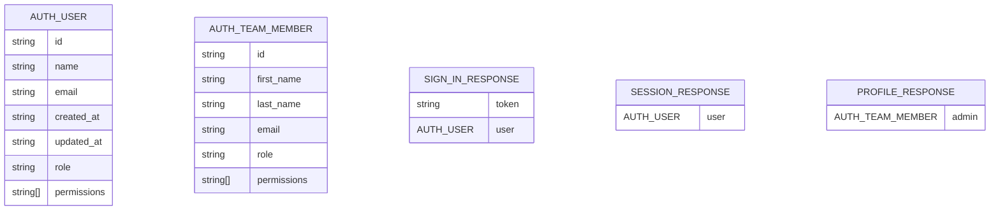
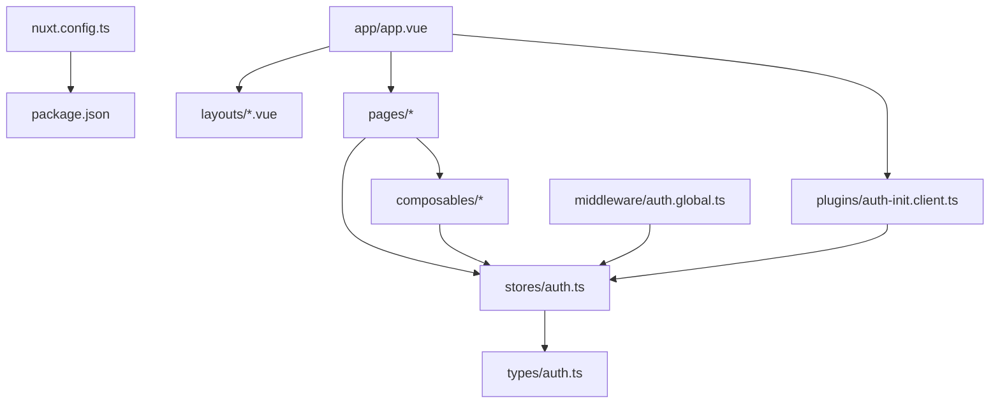

# Core Framework Architecture

<cite>
**Referenced Files in This Document**
- [nuxt.config.ts](file://nuxt.config.ts)
- [package.json](file://package.json)
- [app/app.vue](file://app/app.vue)
- [app/layouts/default.vue](file://app/layouts/default.vue)
- [app/layouts/dashboard.vue](file://app/layouts/dashboard.vue)
- [app/middleware/auth.global.ts](file://app/middleware/auth.global.ts)
- [app/plugins/auth-init.client.ts](file://app/plugins/auth-init.client.ts)
- [app/stores/auth.ts](file://app/stores/auth.ts)
- [app/composables/useApi.ts](file://app/composables/useApi.ts)
- [app/composables/useErrorHandler.ts](file://app/composables/useErrorHandler.ts)
- [app/composables/useToast.ts](file://app/composables/useToast.ts)
- [app/types/auth.ts](file://app/types/auth.ts)
- [app/pages/index.vue](file://app/pages/index.vue)
</cite>

## Table of Contents
1. Introduction
2. Project Structure
3. Core Components
4. Architecture Overview
5. Detailed Component Analysis
6. Dependency Analysis
7. Performance Considerations
8. Troubleshooting Guide
9. Conclusion

## Introduction
This document explains the core framework architecture of a Nuxt.js application with Vue 3 integration. It covers file-based routing, layout hierarchy (default and dashboard), root app initialization, Nuxt configuration (modules, runtime settings, build optimizations), component composition using the Composition API, reactive state management via Pinia, and plugin architecture. It also describes how the application bootstraps, handles global providers, manages lifecycle events, and balances server-side rendering with client interactivity.

## Project Structure
The project follows Nuxt’s convention-based structure:
- app/app.vue is the root Vue component that mounts the UI shell, orchestrates layouts, pages, and global UI elements.
- app/layouts contains reusable layout wrappers; default is minimal, while dashboard provides sidebar/header chrome for authenticated areas.
- app/pages implements file-based routing; pages can opt into specific layouts via page metadata.
- app/middleware defines route guards executed before navigation.
- app/plugins register global logic and provide cross-app services.
- app/stores holds Pinia stores for reactive state.
- app/composables encapsulate reusable logic (API client, error handling, toast notifications).
- nuxt.config.ts configures modules, runtime options, router behavior, Vite optimizations, and SSR rules.

**Diagram sources**
- [app/app.vue:1-33](file://app/app.vue#L1-L33)
- [app/layouts/default.vue:1-6](file://app/layouts/default.vue#L1-L6)
- [app/layouts/dashboard.vue:1-25](file://app/layouts/dashboard.vue#L1-L25)
- [app/middleware/auth.global.ts:1-32](file://app/middleware/auth.global.ts#L1-L32)
- [app/plugins/auth-init.client.ts:1-25](file://app/plugins/auth-init.client.ts#L1-L25)
- [app/stores/auth.ts:1-230](file://app/stores/auth.ts#L1-L230)
- [app/composables/useApi.ts:1-91](file://app/composables/useApi.ts#L1-L91)
- [app/composables/useErrorHandler.ts:1-29](file://app/composables/useErrorHandler.ts#L1-L29)
- [app/composables/useToast.ts:1-37](file://app/composables/useToast.ts#L1-L37)
- [nuxt.config.ts:1-46](file://nuxt.config.ts#L1-L46)

**Section sources**
- [nuxt.config.ts:1-46](file://nuxt.config.ts#L1-L46)
- [app/app.vue:1-33](file://app/app.vue#L1-L33)
- [app/layouts/default.vue:1-6](file://app/layouts/default.vue#L1-L6)
- [app/layouts/dashboard.vue:1-25](file://app/layouts/dashboard.vue#L1-L25)
- [app/middleware/auth.global.ts:1-32](file://app/middleware/auth.global.ts#L1-L32)
- [app/plugins/auth-init.client.ts:1-25](file://app/plugins/auth-init.client.ts#L1-L25)
- [app/stores/auth.ts:1-230](file://app/stores/auth.ts#L1-L230)
- [app/composables/useApi.ts:1-91](file://app/composables/useApi.ts#L1-L91)
- [app/composables/useErrorHandler.ts:1-29](file://app/composables/useErrorHandler.ts#L1-L29)
- [app/composables/useToast.ts:1-37](file://app/composables/useToast.ts#L1-L37)

## Core Components
- Root app component:
  - Provides the UI provider wrapper, announces route changes, shows an auth loading screen during session checks, renders layouts and pages, and displays global session warnings and toasts.
- Layouts:
  - Default layout is a simple slot container.
  - Dashboard layout composes sidebar, header, and main content area with responsive mobile behavior.
- File-based routing:
  - Pages are auto-routed by file paths under app/pages. Pages can declare their layout via page metadata.
- Global middleware:
  - Route guard enforces authentication, allows public routes, and validates sessions on navigation.
- Plugin architecture:
  - Client-only plugin initializes auth state on app load, provides a global “is checking auth” flag, and redirects if needed.
- Reactive state management:
  - Pinia store persists user identity, token, role/permissions, and session timers; it performs periodic checks and warns users before expiry.
- Composables:
  - API client wraps fetch with auth headers, base URL from runtime config, typed helpers, and unified error handling.
  - Error handler composable centralizes toast feedback for failed operations.
  - Toast composable maintains a global queue of notifications.

**Section sources**
- [app/app.vue:1-33](file://app/app.vue#L1-L33)
- [app/layouts/default.vue:1-6](file://app/layouts/default.vue#L1-L6)
- [app/layouts/dashboard.vue:1-25](file://app/layouts/dashboard.vue#L1-L25)
- [app/middleware/auth.global.ts:1-32](file://app/middleware/auth.global.ts#L1-L32)
- [app/plugins/auth-init.client.ts:1-25](file://app/plugins/auth-init.client.ts#L1-L25)
- [app/stores/auth.ts:1-230](file://app/stores/auth.ts#L1-L230)
- [app/composables/useApi.ts:1-91](file://app/composables/useApi.ts#L1-L91)
- [app/composables/useErrorHandler.ts:1-29](file://app/composables/useErrorHandler.ts#L1-L29)
- [app/composables/useToast.ts:1-37](file://app/composables/useToast.ts#L1-L37)

## Architecture Overview
High-level flow from bootstrap to rendered page:

```mermaid
sequenceDiagram
participant Browser as "Browser"
participant Nuxt as "Nuxt Runtime"
participant Plugin as "auth-init.client.ts"
participant Store as "auth.ts (Pinia)"
participant Router as "Vue Router"
participant MW as "auth.global.ts"
participant App as "app.vue"
participant Layout as "dashboard.vue / default.vue"
participant Page as "pages/*"
Browser->>Nuxt : Load app
Nuxt->>Plugin : Execute client plugins
Plugin->>Store : Read persisted auth state
alt Authenticated
Plugin->>Store : checkSession()
alt Invalid
Plugin->>Router : push('/login')
else Valid
Plugin-->>App : Provide "isCheckingAuth = false"
end
else Not Authenticated
Plugin-->>App : Provide "isCheckingAuth = false"
end
Browser->>Nuxt : Navigate to route
Nuxt->>MW : Run global middleware
MW->>Store : isAuthenticated?
alt Not authenticated
MW->>Router : navigateTo('/login')
else Authenticated
MW->>Store : checkSession() (on navigation)
alt Invalid
MW->>Router : navigateTo('/login')
else Valid
MW-->>Nuxt : Allow navigation
end
end
Nuxt->>App : Render root
App->>Layout : Resolve layout (default or dashboard)
Layout->>Page : Render page content
```

**Diagram sources**
- [app/plugins/auth-init.client.ts:1-25](file://app/plugins/auth-init.client.ts#L1-L25)
- [app/stores/auth.ts:1-230](file://app/stores/auth.ts#L1-L230)
- [app/middleware/auth.global.ts:1-32](file://app/middleware/auth.global.ts#L1-L32)
- [app/app.vue:1-33](file://app/app.vue#L1-L33)
- [app/layouts/dashboard.vue:1-25](file://app/layouts/dashboard.vue#L1-L25)
- [app/layouts/default.vue:1-6](file://app/layouts/default.vue#L1-L6)
- [app/pages/index.vue:1-325](file://app/pages/index.vue#L1-L325)

## Detailed Component Analysis

### Nuxt Configuration and Build Optimizations
- Modules:
  - Registers UI kit, Pinia, and Pinia persistence module.
- Runtime config:
  - Exposes public API base and third-party keys via runtimeConfig.public.
- Router:
  - Disables strict mode for flexible routing.
- Vite:
  - Targets modern JS, pre-bundles dependencies, and optimizes large libraries.
- SSR rules:
  - Disables SSR for login, forgot-password, payment, and tracking routes to improve UX and avoid server-side constraints.

**Diagram sources**
- [nuxt.config.ts:1-46](file://nuxt.config.ts#L1-L46)

**Section sources**
- [nuxt.config.ts:1-46](file://nuxt.config.ts#L1-L46)
- [package.json:1-33](file://package.json#L1-L33)

### Root App Initialization and Global Providers
- The root component:
  - Uses the UI provider wrapper.
  - Announces route changes for accessibility.
  - Shows an auth loading overlay while the client plugin verifies the session.
  - Renders the active layout and page.
  - Displays a session warning and global toast container.
- Global provider:
  - The client plugin injects a boolean indicating whether auth verification is in progress, enabling the root component to gate UI until ready.

**Diagram sources**
- [app/app.vue:1-33](file://app/app.vue#L1-L33)
- [app/plugins/auth-init.client.ts:1-25](file://app/plugins/auth-init.client.ts#L1-L25)

**Section sources**
- [app/app.vue:1-33](file://app/app.vue#L1-L33)
- [app/plugins/auth-init.client.ts:1-25](file://app/plugins/auth-init.client.ts#L1-L25)

### Layout Hierarchy and File-Based Routing
- Default layout:
  - Minimal wrapper around page content.
- Dashboard layout:
  - Provides sidebar, header, and main content area with responsive behavior.
- Routing:
  - Pages are automatically mapped to URLs based on file paths.
  - Pages can opt into a specific layout via page metadata.

**Diagram sources**
- [app/pages/index.vue:1-325](file://app/pages/index.vue#L1-L325)
- [app/layouts/dashboard.vue:1-25](file://app/layouts/dashboard.vue#L1-L25)
- [app/layouts/default.vue:1-6](file://app/layouts/default.vue#L1-L6)

**Section sources**
- [app/layouts/default.vue:1-6](file://app/layouts/default.vue#L1-L6)
- [app/layouts/dashboard.vue:1-25](file://app/layouts/dashboard.vue#L1-L25)
- [app/pages/index.vue:1-325](file://app/pages/index.vue#L1-L325)

### Authentication Flow and Session Management
- Client plugin:
  - On app load, reads persisted auth state and validates the session. Redirects to login if invalid.
- Global middleware:
  - Allows public routes, blocks unauthenticated access, and re-validates sessions on navigation.
- Pinia store:
  - Persists token and user data.
  - Periodically refreshes session and warns users near expiry.
  - Provides logout and profile enrichment.

**Diagram sources**
- [app/plugins/auth-init.client.ts:1-25](file://app/plugins/auth-init.client.ts#L1-L25)
- [app/stores/auth.ts:1-230](file://app/stores/auth.ts#L1-L230)
- [app/middleware/auth.global.ts:1-32](file://app/middleware/auth.global.ts#L1-L32)

**Section sources**
- [app/plugins/auth-init.client.ts:1-25](file://app/plugins/auth-init.client.ts#L1-L25)
- [app/middleware/auth.global.ts:1-32](file://app/middleware/auth.global.ts#L1-L32)
- [app/stores/auth.ts:1-230](file://app/stores/auth.ts#L1-L230)

### API Client and Error Handling
- API client:
  - Builds full URLs using runtime config.
  - Attaches Authorization header when available.
  - Normalizes success responses and throws consistent errors.
  - Handles 401 by logging out and redirecting.
- Error handler:
  - Wraps async calls to show toasts and return null on failure.
- Toast system:
  - Centralized queue with types and durations.

**Diagram sources**
- [app/composables/useApi.ts:1-91](file://app/composables/useApi.ts#L1-L91)
- [app/composables/useErrorHandler.ts:1-29](file://app/composables/useErrorHandler.ts#L1-L29)
- [app/composables/useToast.ts:1-37](file://app/composables/useToast.ts#L1-L37)

**Section sources**
- [app/composables/useApi.ts:1-91](file://app/composables/useApi.ts#L1-L91)
- [app/composables/useErrorHandler.ts:1-29](file://app/composables/useErrorHandler.ts#L1-L29)
- [app/composables/useToast.ts:1-37](file://app/composables/useToast.ts#L1-L37)

### Data Types and Contracts
- Shared types define user, team member, sign-in response, session response, and profile response shapes used across the store and API client.

**Diagram sources**
- [app/types/auth.ts:1-64](file://app/types/auth.ts#L1-L64)

**Section sources**
- [app/types/auth.ts:1-64](file://app/types/auth.ts#L1-L64)

## Dependency Analysis
Key relationships between core parts:

**Diagram sources**
- [nuxt.config.ts:1-46](file://nuxt.config.ts#L1-L46)
- [package.json:1-33](file://package.json#L1-L33)
- [app/app.vue:1-33](file://app/app.vue#L1-L33)
- [app/plugins/auth-init.client.ts:1-25](file://app/plugins/auth-init.client.ts#L1-L25)
- [app/layouts/default.vue:1-6](file://app/layouts/default.vue#L1-L6)
- [app/layouts/dashboard.vue:1-25](file://app/layouts/dashboard.vue#L1-L25)
- [app/middleware/auth.global.ts:1-32](file://app/middleware/auth.global.ts#L1-L32)
- [app/stores/auth.ts:1-230](file://app/stores/auth.ts#L1-L230)
- [app/composables/useApi.ts:1-91](file://app/composables/useApi.ts#L1-L91)
- [app/types/auth.ts:1-64](file://app/types/auth.ts#L1-L64)

**Section sources**
- [nuxt.config.ts:1-46](file://nuxt.config.ts#L1-L46)
- [package.json:1-33](file://package.json#L1-L33)
- [app/app.vue:1-33](file://app/app.vue#L1-L33)
- [app/plugins/auth-init.client.ts:1-25](file://app/plugins/auth-init.client.ts#L1-L25)
- [app/layouts/default.vue:1-6](file://app/layouts/default.vue#L1-L6)
- [app/layouts/dashboard.vue:1-25](file://app/layouts/dashboard.vue#L1-L25)
- [app/middleware/auth.global.ts:1-32](file://app/middleware/auth.global.ts#L1-L32)
- [app/stores/auth.ts:1-230](file://app/stores/auth.ts#L1-L230)
- [app/composables/useApi.ts:1-91](file://app/composables/useApi.ts#L1-L91)
- [app/types/auth.ts:1-64](file://app/types/auth.ts#L1-L64)

## Performance Considerations
- SSR control:
  - Disable SSR for interactive-heavy routes (login, payments, tracking) to reduce server load and improve perceived performance.
- Vite optimizations:
  - Target modern JavaScript and pre-bundle heavy dependencies to speed up dev and production builds.
- State persistence:
  - Persist critical auth state to minimize redundant network calls on reload.
- Navigation guards:
  - Validate sessions only when necessary to avoid excessive requests.

[No sources needed since this section provides general guidance]

## Troubleshooting Guide
- Session expired or invalid:
  - The API client logs out and redirects to login on 401.
  - The middleware re-checks sessions on navigation and redirects if invalid.
  - The store periodically checks sessions and warns users before expiry.
- Missing environment variables:
  - Ensure runtime config values are set for API base and third-party keys.
- Build issues:
  - Verify module versions and compatibility with Nuxt and Vue 3.

**Section sources**
- [app/composables/useApi.ts:1-91](file://app/composables/useApi.ts#L1-L91)
- [app/middleware/auth.global.ts:1-32](file://app/middleware/auth.global.ts#L1-L32)
- [app/stores/auth.ts:1-230](file://app/stores/auth.ts#L1-L230)
- [nuxt.config.ts:1-46](file://nuxt.config.ts#L1-L46)
- [package.json:1-33](file://package.json#L1-L33)

## Conclusion
The application leverages Nuxt’s conventions for routing and layouts, integrates Vue 3 and Pinia for reactive state, and uses a robust plugin and middleware system to manage authentication and global concerns. The configuration balances SSR and client interactivity, while composables encapsulate shared logic for API access and error handling. This architecture yields a maintainable, scalable foundation for feature development.