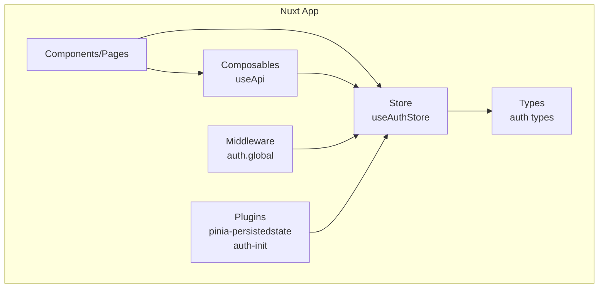
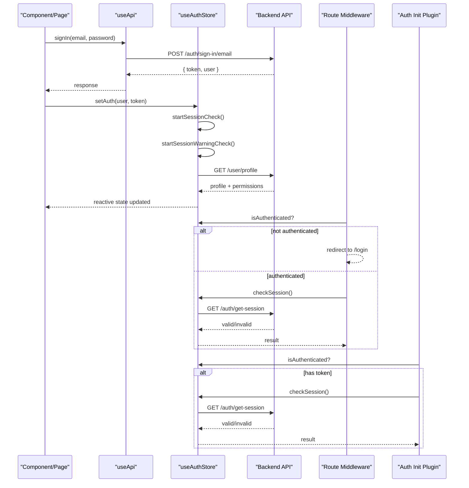
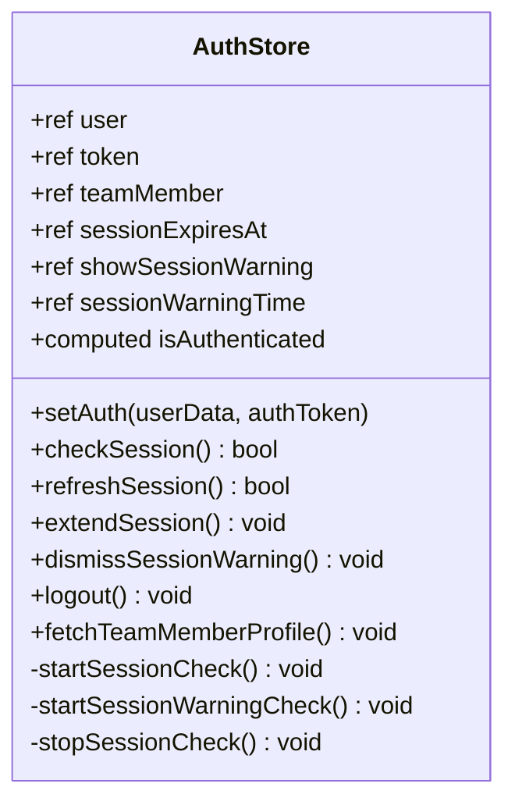
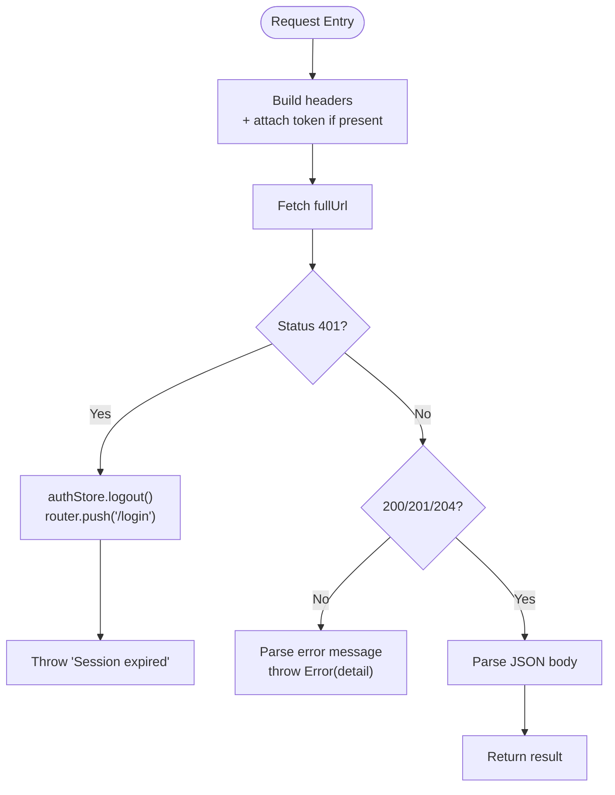
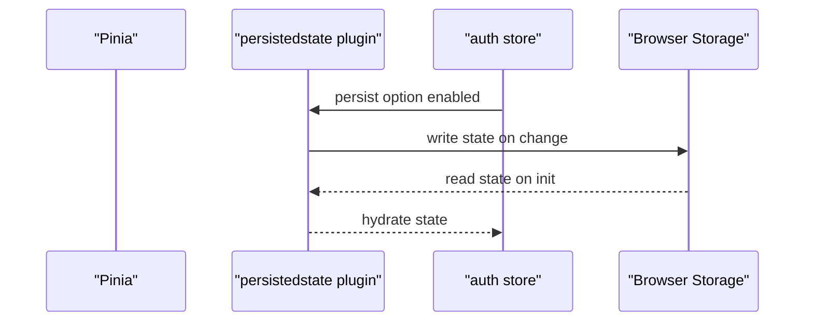
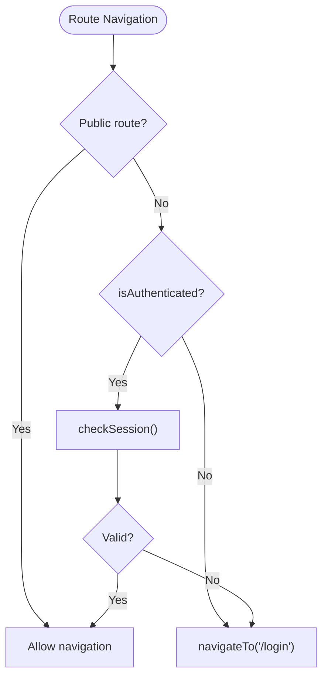
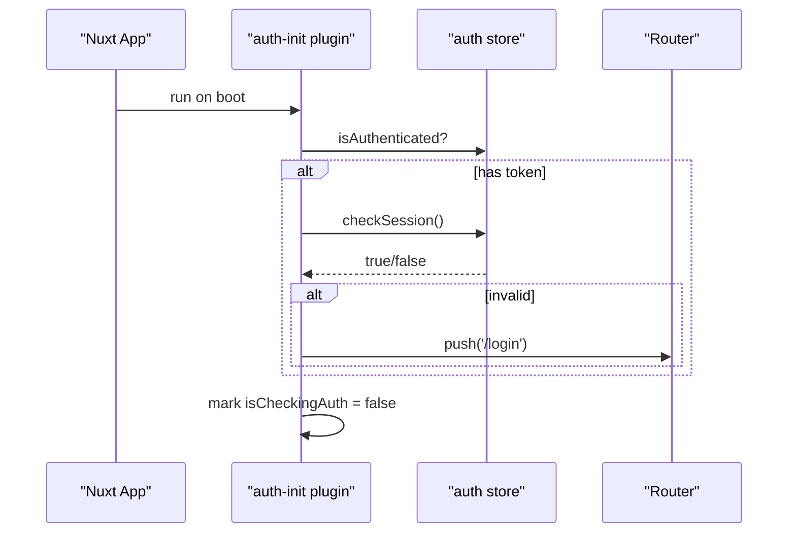
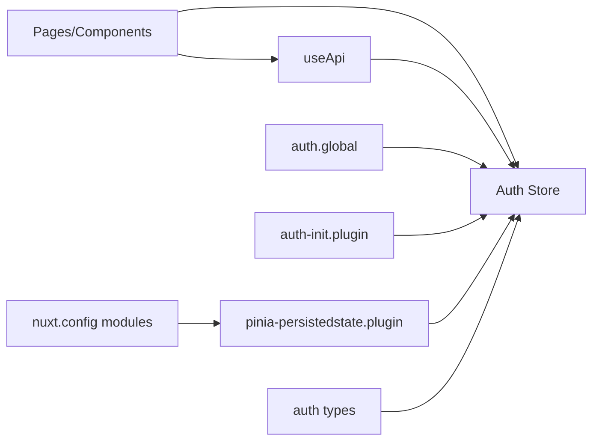

# State Management Strategy

<cite>
**Referenced Files in This Document**
- [auth.ts](file://app/stores/auth.ts)
- [pinia-persistedstate.client.ts](file://app/plugins/pinia-persistedstate.client.ts)
- [useApi.ts](file://app/composables/useApi.ts)
- [auth.global.ts](file://app/middleware/auth.global.ts)
- [auth-init.client.ts](file://app/plugins/auth-init.client.ts)
- [nuxt.config.ts](file://nuxt.config.ts)
- [auth.ts](file://app/types/auth.ts)
- [AppHeader.vue](file://app/components/AppHeader.vue)
- [login.vue](file://app/pages/login.vue)
</cite>

## Table of Contents
1. [Introduction](#introduction)
2. [Project Structure](#project-structure)
3. [Core Components](#core-components)
4. [Architecture Overview](#architecture-overview)
5. [Detailed Component Analysis](#detailed-component-analysis)
6. [Dependency Analysis](#dependency-analysis)
7. [Performance Considerations](#performance-considerations)
8. [Troubleshooting Guide](#troubleshooting-guide)
9. [Conclusion](#conclusion)

## Introduction
This document explains the state management strategy used across the application, focusing on Pinia store architecture, reactive patterns, persistence, and cross-layer synchronization. It covers:
- The centralized API client composable and how it integrates with stores
- Reactive state patterns and computed properties for derived state
- Persistence mechanisms via a Pinia plugin
- Cross-component communication through shared stores
- Performance optimization techniques and debugging approaches
- Common state management challenges and solutions within Vue 3/Nuxt

## Project Structure
State-related code is organized into focused layers:
- Store layer: Centralized domain state (authentication)
- Composables: Shared logic (API client, error handling)
- Plugins: Global setup (Pinia persistence, auth initialization)
- Middleware: Route-level guards using store state
- Types: Strongly-typed contracts for API responses
- Components/Pages: Consumers of store state and actions

**Diagram sources**
- [auth.ts:1-230](file://app/stores/auth.ts#L1-L230)
- [useApi.ts:1-91](file://app/composables/useApi.ts#L1-L91)
- [auth.global.ts:1-32](file://app/middleware/auth.global.ts#L1-L32)
- [pinia-persistedstate.client.ts:1-7](file://app/plugins/pinia-persistedstate.client.ts#L1-L7)
- [auth-init.client.ts:1-25](file://app/plugins/auth-init.client.ts#L1-L25)
- [auth.ts:1-64](file://app/types/auth.ts#L1-L64)

**Section sources**
- [nuxt.config.ts:6-10](file://nuxt.config.ts#L6-L10)
- [auth.ts:1-230](file://app/stores/auth.ts#L1-L230)
- [useApi.ts:1-91](file://app/composables/useApi.ts#L1-L91)
- [auth.global.ts:1-32](file://app/middleware/auth.global.ts#L1-L32)
- [pinia-persistedstate.client.ts:1-7](file://app/plugins/pinia-persistedstate.client.ts#L1-L7)
- [auth-init.client.ts:1-25](file://app/plugins/auth-init.client.ts#L1-L25)
- [auth.ts:1-64](file://app/types/auth.ts#L1-L64)

## Core Components
- Auth store: Encapsulates user identity, token, session lifecycle, and UI flags. Exposes reactive state, computed booleans, and action methods.
- API client composable: Centralizes HTTP requests, attaches tokens from the store, handles 401 flows, and wraps errors with toast notifications.
- Persistence plugin: Enables automatic serialization of store state to storage.
- Auth middleware: Guards routes based on authentication status and validates sessions during navigation.
- Auth init plugin: Performs initial session validation on app load when a persisted session exists.

Key responsibilities:
- Single source of truth for authentication state
- Clear separation between UI concerns and business logic
- Consistent request/response handling and error propagation
- Safe persistence and restoration of critical state

**Section sources**
- [auth.ts:1-230](file://app/stores/auth.ts#L1-L230)
- [useApi.ts:1-91](file://app/composables/useApi.ts#L1-L91)
- [pinia-persistedstate.client.ts:1-7](file://app/plugins/pinia-persistedstate.client.ts#L1-L7)
- [auth.global.ts:1-32](file://app/middleware/auth.global.ts#L1-L32)
- [auth-init.client.ts:1-25](file://app/plugins/auth-init.client.ts#L1-L25)

## Architecture Overview
The system follows a unidirectional data flow:
- Components call store actions or composables
- Composables perform network operations and update store state
- Middleware enforces route-level access control using store state
- Persistence ensures state survives refreshes

**Diagram sources**
- [login.vue:1-167](file://app/pages/login.vue#L1-L167)
- [useApi.ts:1-91](file://app/composables/useApi.ts#L1-L91)
- [auth.ts:1-230](file://app/stores/auth.ts#L1-L230)
- [auth.global.ts:1-32](file://app/middleware/auth.global.ts#L1-L32)
- [auth-init.client.ts:1-25](file://app/plugins/auth-init.client.ts#L1-L25)

## Detailed Component Analysis

### Auth Store: Architecture and Patterns
The auth store implements:
- Reactive state: user, token, teamMember, sessionExpiresAt, showSessionWarning, sessionWarningTime
- Derived state: isAuthenticated computed boolean
- Actions: setAuth, checkSession, refreshSession, extendSession, dismissSessionWarning, logout, fetchTeamMemberProfile
- Lifecycle helpers: startSessionCheck, startSessionWarningCheck, stopSessionCheck
- Initialization: starts timers and profile fetch if token persists

Reactive patterns:
- Refs for primitive state and objects
- Computed for derived booleans
- Async actions that mutate refs and trigger side effects
- Timers managed inside the store scope

Persistence:
- Enabled via Pinia plugin configuration at store level
- Ensures token and related fields survive page reloads

Cross-cutting concerns:
- Session expiry tracking and warning UI
- Automatic logout on invalid session
- Profile enrichment after login

**Diagram sources**
- [auth.ts:1-230](file://app/stores/auth.ts#L1-L230)

**Section sources**
- [auth.ts:1-230](file://app/stores/auth.ts#L1-L230)

### Centralized API Client Composable
Responsibilities:
- Build base URL from runtime config
- Attach Authorization header from store token
- Normalize success/failure responses
- Handle 401 by logging out and redirecting
- Wrap calls with error handler to display toasts

Integration points:
- Reads token from auth store
- Triggers logout and navigation on 401
- Provides typed convenience methods (get/post/put/patch/del) and a raw request method

**Diagram sources**
- [useApi.ts:1-91](file://app/composables/useApi.ts#L1-L91)

**Section sources**
- [useApi.ts:1-91](file://app/composables/useApi.ts#L1-L91)

### Persistence Mechanism
- The Pinia persisted state plugin is installed globally via a Nuxt plugin
- The auth store opts into persistence with a store-level option
- Result: token and related fields are automatically serialized and restored

**Diagram sources**
- [pinia-persistedstate.client.ts:1-7](file://app/plugins/pinia-persistedstate.client.ts#L1-L7)
- [auth.ts:227-229](file://app/stores/auth.ts#L227-L229)

**Section sources**
- [pinia-persistedstate.client.ts:1-7](file://app/plugins/pinia-persistedstate.client.ts#L1-L7)
- [auth.ts:227-229](file://app/stores/auth.ts#L227-L229)

### Route-Level State Synchronization
- Global middleware checks authentication before allowing access
- Public routes bypass checks; others require an authenticated session
- On navigation, middleware validates the current session and redirects if invalid

**Diagram sources**
- [auth.global.ts:1-32](file://app/middleware/auth.global.ts#L1-L32)
- [auth.ts:90-120](file://app/stores/auth.ts#L90-L120)

**Section sources**
- [auth.global.ts:1-32](file://app/middleware/auth.global.ts#L1-L32)

### App Initialization and Session Hydration
- On app load, the auth init plugin checks if a token exists
- If so, it validates the session and redirects to login if invalid
- Provides a global loading flag to gate UI until auth check completes

**Diagram sources**
- [auth-init.client.ts:1-25](file://app/plugins/auth-init.client.ts#L1-L25)
- [auth.ts:90-120](file://app/stores/auth.ts#L90-L120)

**Section sources**
- [auth-init.client.ts:1-25](file://app/plugins/auth-init.client.ts#L1-L25)

### Store-Component Relationships and Examples
- Components consume store state reactively and invoke actions
- Example usage includes displaying user info and triggering logout
- Login page composes useApi and sets auth state upon successful sign-in

Patterns demonstrated:
- Direct store consumption in components
- Composing composables and stores together
- Using computed values for derived UI text

**Section sources**
- [AppHeader.vue:1-94](file://app/components/AppHeader.vue#L1-L94)
- [login.vue:1-167](file://app/pages/login.vue#L1-L167)

## Dependency Analysis
High-level dependencies:
- Components/Pages depend on the auth store and API composable
- API composable depends on the auth store for token injection
- Middleware depends on the auth store for route protection
- Plugins configure Pinia and initialize auth checks
- Types define contracts consumed by store and API

**Diagram sources**
- [auth.ts:1-230](file://app/stores/auth.ts#L1-L230)
- [useApi.ts:1-91](file://app/composables/useApi.ts#L1-L91)
- [auth.global.ts:1-32](file://app/middleware/auth.global.ts#L1-L32)
- [auth-init.client.ts:1-25](file://app/plugins/auth-init.client.ts#L1-L25)
- [pinia-persistedstate.client.ts:1-7](file://app/plugins/pinia-persistedstate.client.ts#L1-L7)
- [nuxt.config.ts:6-10](file://nuxt.config.ts#L6-L10)
- [auth.ts:1-64](file://app/types/auth.ts#L1-L64)

**Section sources**
- [nuxt.config.ts:6-10](file://nuxt.config.ts#L6-L10)

## Performance Considerations
- Prefer computed properties for derived state to avoid unnecessary recalculations
- Keep store state minimal; avoid storing large payloads unless necessary
- Debounce or throttle frequent updates if needed (e.g., warnings or polling)
- Use lazy loading for heavy features and defer non-critical side effects
- Avoid redundant re-renders by selecting only required fields in templates
- Leverage Pinia’s devtools for inspection and performance profiling

[No sources needed since this section provides general guidance]

## Troubleshooting Guide
Common issues and resolutions:
- Token missing after refresh: Ensure persistence is enabled and keys match expected fields
- 401 loops: Verify 401 handling in the API client triggers logout and redirection
- Session not refreshing: Confirm periodic checks and warning timers are started after login
- Middleware redirects unexpectedly: Check public route list and ensure initial session validation runs once at startup
- Debugging: Use Pinia DevTools to inspect store state and actions; review console logs around API calls and session checks

**Section sources**
- [useApi.ts:39-44](file://app/composables/useApi.ts#L39-L44)
- [auth.ts:122-174](file://app/stores/auth.ts#L122-L174)
- [auth.global.ts:1-32](file://app/middleware/auth.global.ts#L1-L32)
- [auth-init.client.ts:1-25](file://app/plugins/auth-init.client.ts#L1-L25)

## Conclusion
The application employs a clear, scalable state management strategy centered on a single Pinia store for authentication, a centralized API composable for consistent networking, and robust middleware and plugins for lifecycle and persistence. Reactive patterns and computed properties keep UI synchronized efficiently, while persistence ensures continuity across reloads. This design supports maintainability, testability, and predictable behavior across the Vue 3/Nuxt ecosystem.