# Authentication & Authorization

<cite>
**Referenced Files in This Document**
- [auth.ts](file://app/stores/auth.ts)
- [auth.global.ts](file://app/middleware/auth.global.ts)
- [permissions.global.ts](file://app/middleware/permissions.global.ts)
- [usePermissions.ts](file://app/composables/usePermissions.ts)
- [auth.ts](file://app/utils/auth.ts)
- [auth.ts](file://app/types/auth.ts)
- [login.vue](file://app/pages/login.vue)
- [auth-init.client.ts](file://app/plugins/auth-init.client.ts)
- [PermissionGuard.vue](file://app/components/PermissionGuard.vue)
- [SessionWarning.vue](file://app/components/SessionWarning.vue)
- [useApi.ts](file://app/composables/useApi.ts)
- [unauthorized.vue](file://app/pages/unauthorized.vue)
- [nuxt.config.ts](file://nuxt.config.ts)
</cite>

## Table of Contents
1. [Introduction](#introduction)
2. [Project Structure](#project-structure)
3. [Core Components](#core-components)
4. [Architecture Overview](#architecture-overview)
5. [Detailed Component Analysis](#detailed-component-analysis)
6. [Dependency Analysis](#dependency-analysis)
7. [Performance Considerations](#performance-considerations)
8. [Troubleshooting Guide](#troubleshooting-guide)
9. [Conclusion](#conclusion)
10. [Appendices](#appendices)

## Introduction
This document explains the authentication and authorization system implemented in the application. It covers:
- JWT-based authentication flow using Bearer tokens
- Session management with automatic refresh and warning UI
- Role-based access control (RBAC) and permission checking utilities
- Middleware guards for route protection
- Admin privilege escalation and fine-grained access control
- Practical examples for implementing custom permissions, protecting routes, and handling unauthorized access scenarios

The system is built on Nuxt 3 with Pinia for state, global middleware for route-level guards, and composable utilities for role and permission checks.

## Project Structure
The authentication and authorization logic spans several layers:
- State and session lifecycle: Pinia store
- Global route guards: Nuxt middleware
- Permission utilities: Pure functions and composables
- API integration: HTTP client with token injection and 401 handling
- UI components: Permission guard and session warning
- Types: Shared interfaces for user, roles, and responses

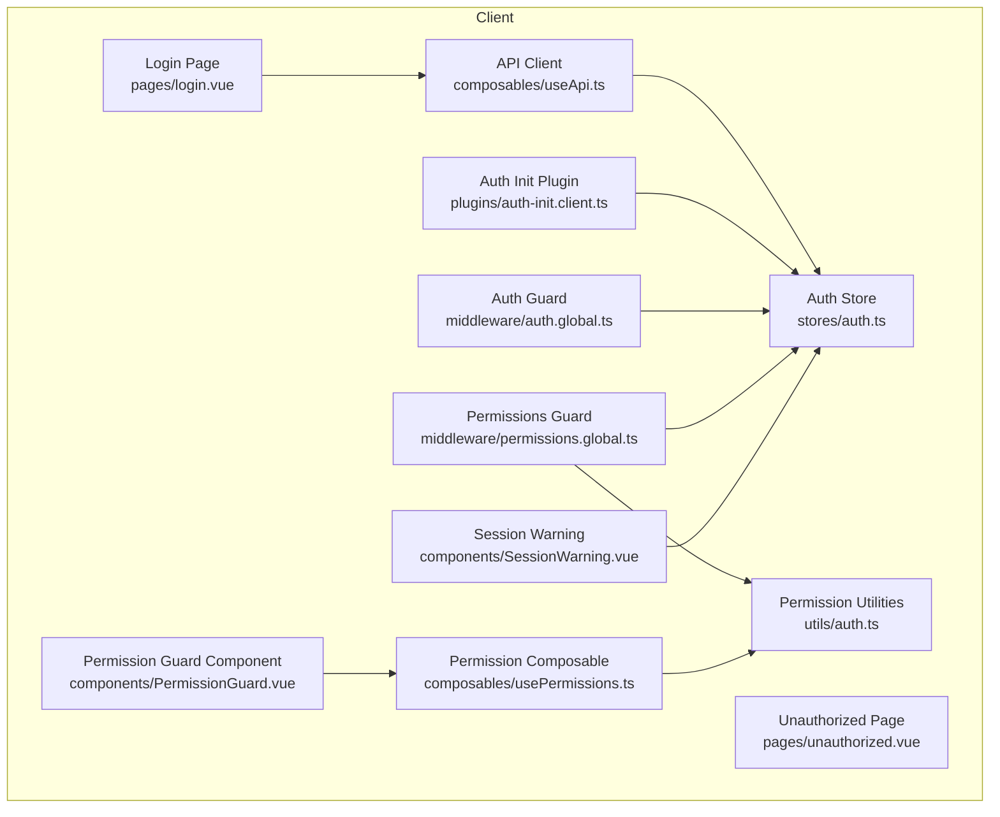

**Diagram sources**
- [login.vue:1-167](file://app/pages/login.vue#L1-L167)
- [auth.ts:1-230](file://app/stores/auth.ts#L1-L230)
- [useApi.ts:1-91](file://app/composables/useApi.ts#L1-L91)
- [auth-init.client.ts:1-25](file://app/plugins/auth-init.client.ts#L1-L25)
- [auth.global.ts:1-32](file://app/middleware/auth.global.ts#L1-L32)
- [permissions.global.ts:1-59](file://app/middleware/permissions.global.ts#L1-L59)
- [auth.ts:1-58](file://app/utils/auth.ts#L1-L58)
- [usePermissions.ts:1-43](file://app/composables/usePermissions.ts#L1-L43)
- [PermissionGuard.vue:1-38](file://app/components/PermissionGuard.vue#L1-L38)
- [SessionWarning.vue:1-66](file://app/components/SessionWarning.vue#L1-L66)
- [unauthorized.vue:1-58](file://app/pages/unauthorized.vue#L1-L58)

**Section sources**
- [nuxt.config.ts:1-46](file://nuxt.config.ts#L1-L46)

## Core Components
- Auth Store: Manages user, token, team member profile, session expiry, and periodic checks. Provides methods to set auth, check/refresh session, and logout.
- Auth Middleware: Protects routes by verifying authentication and validating sessions during navigation.
- Permissions Middleware: Enforces RBAC by mapping routes to required permissions and redirecting unauthorized users.
- Permission Utilities: Helper functions to normalize roles, check admin status, extract permissions, and compare roles.
- Permission Composable: Exposes convenient methods to check permissions and roles from components.
- Permission Guard Component: Declarative component to conditionally render content based on permissions or roles.
- Session Warning Component: Displays a countdown and allows extending the session before expiry.
- API Client: Injects Bearer tokens into requests and handles 401 by logging out and redirecting.
- Auth Init Plugin: Validates session on app load if a token exists.

**Section sources**
- [auth.ts:1-230](file://app/stores/auth.ts#L1-L230)
- [auth.global.ts:1-32](file://app/middleware/auth.global.ts#L1-L32)
- [permissions.global.ts:1-59](file://app/middleware/permissions.global.ts#L1-L59)
- [auth.ts:1-58](file://app/utils/auth.ts#L1-L58)
- [usePermissions.ts:1-43](file://app/composables/usePermissions.ts#L1-L43)
- [PermissionGuard.vue:1-38](file://app/components/PermissionGuard.vue#L1-L38)
- [SessionWarning.vue:1-66](file://app/components/SessionWarning.vue#L1-L66)
- [useApi.ts:1-91](file://app/composables/useApi.ts#L1-L91)
- [auth-init.client.ts:1-25](file://app/plugins/auth-init.client.ts#L1-L25)

## Architecture Overview
The authentication and authorization architecture follows a layered approach:
- Login page authenticates via API and sets token and user in the store.
- The store initializes session timers and periodically validates the session.
- Global middleware enforces authentication and permissions on route transitions.
- Permission utilities provide consistent checks across middleware and components.
- The API client ensures all requests carry the token and handle 401 errors centrally.

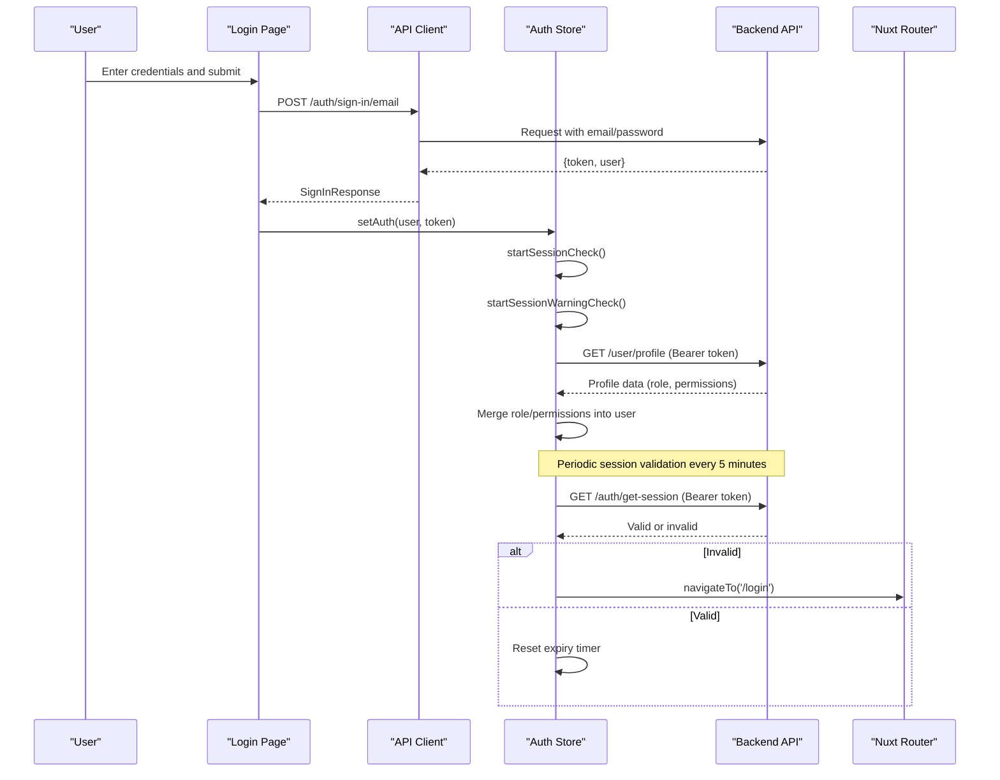

**Diagram sources**
- [login.vue:1-167](file://app/pages/login.vue#L1-L167)
- [useApi.ts:1-91](file://app/composables/useApi.ts#L1-L91)
- [auth.ts:1-230](file://app/stores/auth.ts#L1-L230)

## Detailed Component Analysis

### Auth Store: Session Management and Token Lifecycle
Responsibilities:
- Persist token and user state
- Fetch team member profile to augment user with role and permissions
- Manage session expiry and warnings
- Periodically validate session and redirect on failure
- Provide logout that clears state and calls server sign-out

Key behaviors:
- On login, store sets token, user, and schedules checks
- Every 5 minutes, it calls the session endpoint; on failure, logs out and redirects
- Two minutes before expiry, shows a warning UI; user can extend session
- Logout clears local state and attempts server-side sign-out

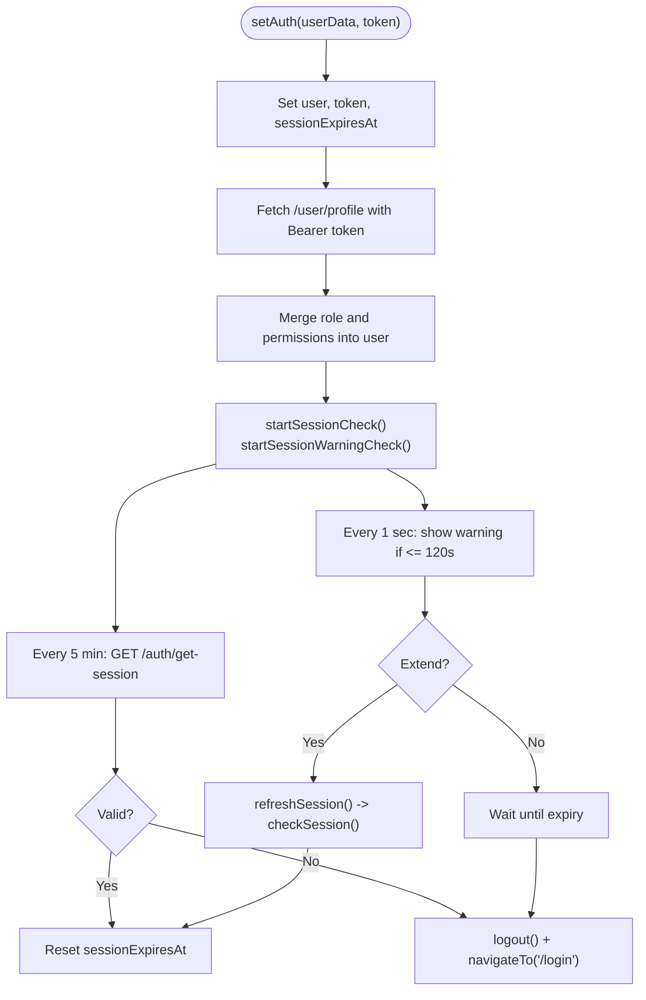

**Diagram sources**
- [auth.ts:1-230](file://app/stores/auth.ts#L1-L230)

**Section sources**
- [auth.ts:1-230](file://app/stores/auth.ts#L1-L230)

### Auth Middleware: Route Protection
Responsibilities:
- Allow public routes (/login, /forgot-password, /unauthorized, /pay/**)
- Redirect unauthenticated users to login
- Validate session on navigation between authenticated routes

Behavior:
- Skips checks for public routes
- If not authenticated, navigates to login
- On navigation between authenticated pages, verifies session validity

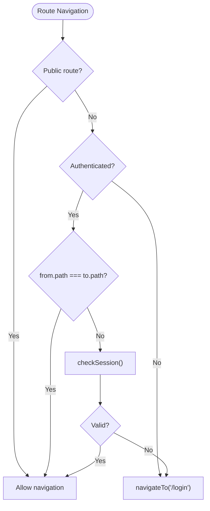

**Diagram sources**
- [auth.global.ts:1-32](file://app/middleware/auth.global.ts#L1-L32)

**Section sources**
- [auth.global.ts:1-32](file://app/middleware/auth.global.ts#L1-L32)

### Permissions Middleware: RBAC Enforcement
Responsibilities:
- Skip public routes
- Allow admins/super admins unrestricted access
- Map routes to required permissions and enforce them
- Redirect unauthorized users to /unauthorized

Route-to-permission mapping includes areas like customers, drivers, trucks, pickups, tracking, billing, shop, inventory, support, team, reports, management, and communications.

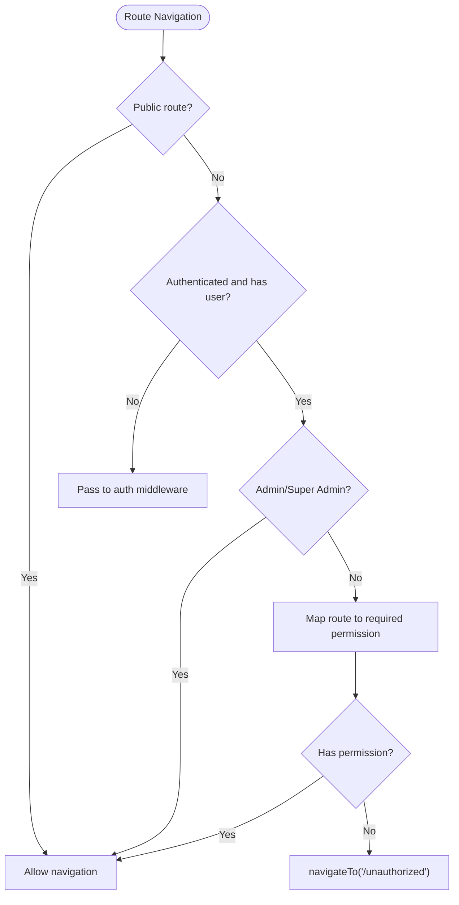

**Diagram sources**
- [permissions.global.ts:1-59](file://app/middleware/permissions.global.ts#L1-L59)

**Section sources**
- [permissions.global.ts:1-59](file://app/middleware/permissions.global.ts#L1-L59)

### Permission Utilities and Composable
Utilities:
- Normalize roles to lowercase without underscores
- Determine admin roles
- Extract permissions array from user
- Check if user has a specific permission (admins implicitly have all)
- Compare roles case-insensitively

Composable:
- Exposes hasPermission, hasAnyPermission, hasAllPermissions
- Exposes hasRole, hasAnyRole
- Exposes isSuperAdmin computed

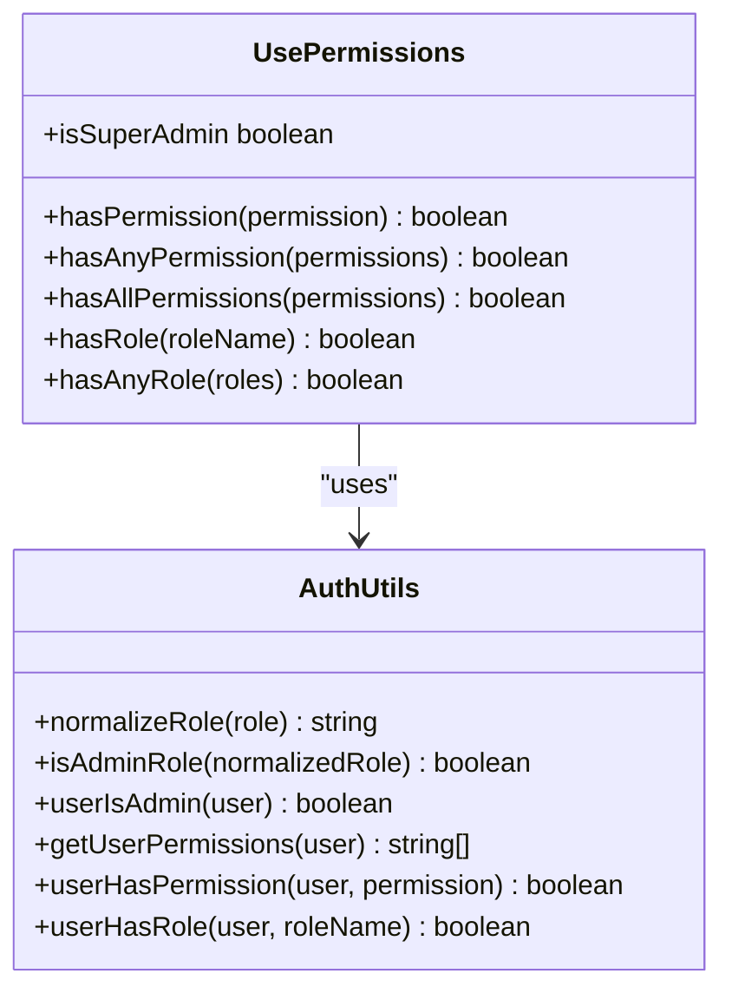

**Diagram sources**
- [auth.ts:1-58](file://app/utils/auth.ts#L1-L58)
- [usePermissions.ts:1-43](file://app/composables/usePermissions.ts#L1-L43)

**Section sources**
- [auth.ts:1-58](file://app/utils/auth.ts#L1-L58)
- [usePermissions.ts:1-43](file://app/composables/usePermissions.ts#L1-L43)

### Permission Guard Component
Purpose:
- Declaratively render content only if the current user satisfies role or permission requirements
- Supports single permission, multiple permissions (any/all), single role, multiple roles, and super admin shortcut

Usage patterns:
- Wrap sections requiring specific permissions
- Combine role and permission checks
- Use requireAll for strict multi-permission checks

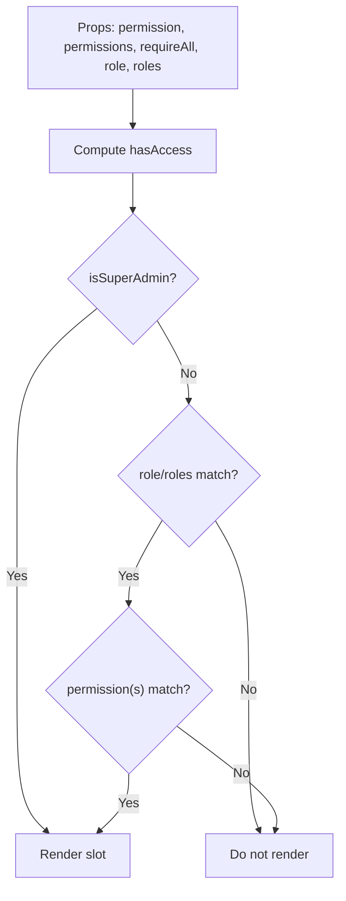

**Diagram sources**
- [PermissionGuard.vue:1-38](file://app/components/PermissionGuard.vue#L1-L38)

**Section sources**
- [PermissionGuard.vue:1-38](file://app/components/PermissionGuard.vue#L1-L38)

### Session Warning Component
Purpose:
- Display a countdown when session expires soon
- Provide actions to extend or dismiss the warning
- Emit events to trigger session extension or dismissal

Integration:
- Bound to store’s showSessionWarning and sessionWarningTime
- Extend action triggers refreshSession

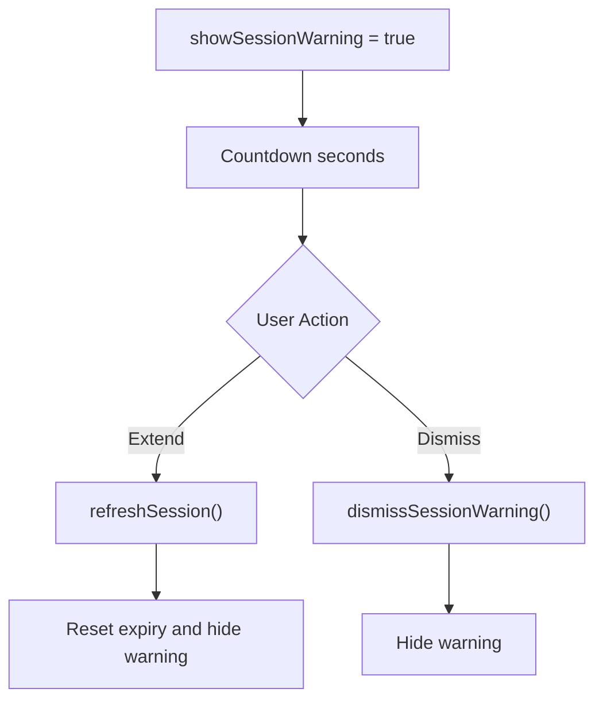

**Diagram sources**
- [SessionWarning.vue:1-66](file://app/components/SessionWarning.vue#L1-L66)
- [auth.ts:1-230](file://app/stores/auth.ts#L1-L230)

**Section sources**
- [SessionWarning.vue:1-66](file://app/components/SessionWarning.vue#L1-L66)
- [auth.ts:1-230](file://app/stores/auth.ts#L1-L230)

### API Client: Token Injection and 401 Handling
Responsibilities:
- Attach Bearer token to outgoing requests
- Centralize error handling for 401 by logging out and redirecting
- Provide typed helpers for common HTTP methods and sign-in

Flow:
- All requests include Authorization header if token exists
- On 401, call logout and navigate to login
- Non-success statuses throw descriptive errors

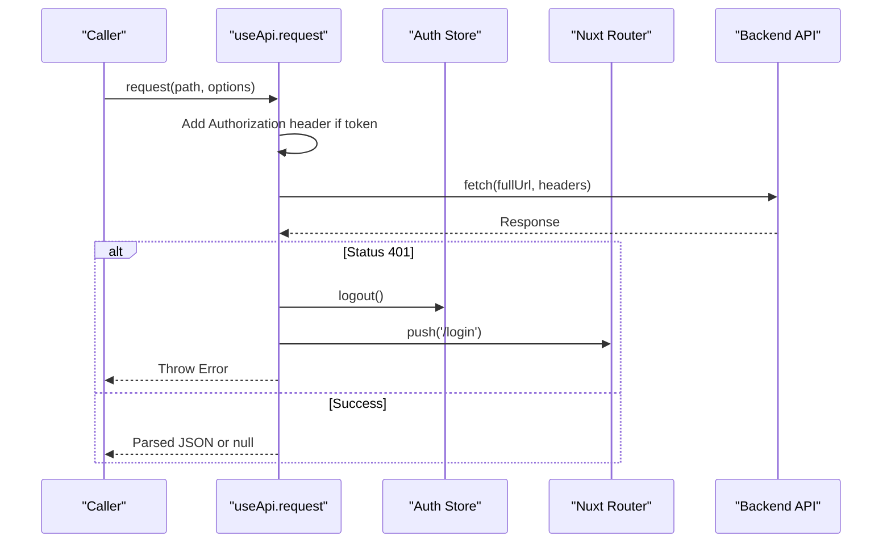

**Diagram sources**
- [useApi.ts:1-91](file://app/composables/useApi.ts#L1-L91)
- [auth.ts:1-230](file://app/stores/auth.ts#L1-L230)

**Section sources**
- [useApi.ts:1-91](file://app/composables/useApi.ts#L1-L91)

### Auth Init Plugin: Initial Session Validation
Responsibilities:
- On app load, if a token exists, validate session
- Redirect to login if session is invalid
- Provide an isCheckingAuth flag to gate UI loading

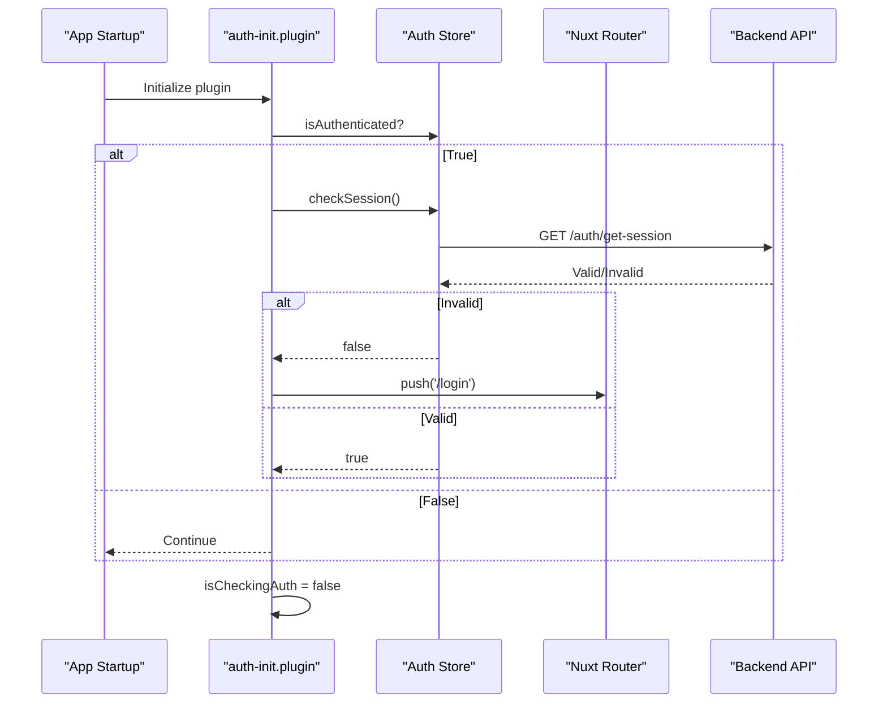

**Diagram sources**
- [auth-init.client.ts:1-25](file://app/plugins/auth-init.client.ts#L1-L25)
- [auth.ts:1-230](file://app/stores/auth.ts#L1-L230)

**Section sources**
- [auth-init.client.ts:1-25](file://app/plugins/auth-init.client.ts#L1-L25)

### Unauthorized Page
Purpose:
- Inform users they lack required permissions
- Provide navigation back or to dashboard

**Section sources**
- [unauthorized.vue:1-58](file://app/pages/unauthorized.vue#L1-L58)

## Dependency Analysis
High-level dependencies:
- Middleware depends on the auth store and permission utilities
- Permission composable wraps utility functions
- Permission guard component uses the composable
- API client depends on the auth store for token injection
- Auth init plugin interacts with the auth store and router
- Login page uses API client and auth store

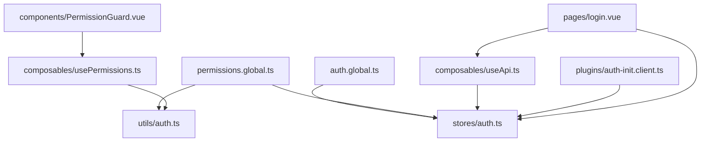

**Diagram sources**
- [auth.global.ts:1-32](file://app/middleware/auth.global.ts#L1-L32)
- [permissions.global.ts:1-59](file://app/middleware/permissions.global.ts#L1-L59)
- [auth.ts:1-230](file://app/stores/auth.ts#L1-L230)
- [auth.ts:1-58](file://app/utils/auth.ts#L1-L58)
- [usePermissions.ts:1-43](file://app/composables/usePermissions.ts#L1-L43)
- [PermissionGuard.vue:1-38](file://app/components/PermissionGuard.vue#L1-L38)
- [useApi.ts:1-91](file://app/composables/useApi.ts#L1-L91)
- [auth-init.client.ts:1-25](file://app/plugins/auth-init.client.ts#L1-L25)
- [login.vue:1-167](file://app/pages/login.vue#L1-L167)

**Section sources**
- [auth.global.ts:1-32](file://app/middleware/auth.global.ts#L1-L32)
- [permissions.global.ts:1-59](file://app/middleware/permissions.global.ts#L1-L59)
- [auth.ts:1-230](file://app/stores/auth.ts#L1-L230)
- [auth.ts:1-58](file://app/utils/auth.ts#L1-L58)
- [usePermissions.ts:1-43](file://app/composables/usePermissions.ts#L1-L43)
- [PermissionGuard.vue:1-38](file://app/components/PermissionGuard.vue#L1-L38)
- [useApi.ts:1-91](file://app/composables/useApi.ts#L1-L91)
- [auth-init.client.ts:1-25](file://app/plugins/auth-init.client.ts#L1-L25)
- [login.vue:1-167](file://app/pages/login.vue#L1-L167)

## Performance Considerations
- Session checks run every 5 minutes; consider adjusting frequency based on backend load and user activity.
- Warning interval runs every second; ensure UI updates are lightweight.
- Avoid redundant profile fetches; the store merges role/permissions once per session refresh.
- Keep route permission mappings centralized to prevent duplication and reduce overhead.

[No sources needed since this section provides general guidance]

## Troubleshooting Guide
Common issues and resolutions:
- 401 Unauthorized on API calls: The client automatically logs out and redirects to login. Verify token presence and backend configuration.
- Session expiring unexpectedly: Ensure the session endpoint responds correctly and the store’s refresh logic is active.
- Missing permissions after login: Confirm the profile endpoint returns role and permissions and that the store merges them into the user object.
- Routes not protected: Verify middleware registration and public route exclusions.

**Section sources**
- [useApi.ts:1-91](file://app/composables/useApi.ts#L1-L91)
- [auth.ts:1-230](file://app/stores/auth.ts#L1-L230)
- [auth.global.ts:1-32](file://app/middleware/auth.global.ts#L1-L32)
- [permissions.global.ts:1-59](file://app/middleware/permissions.global.ts#L1-L59)

## Conclusion
The authentication and authorization system combines robust session management, clear RBAC enforcement, and developer-friendly utilities. With middleware guards, composable helpers, and declarative components, teams can implement secure routes and fine-grained access controls efficiently.

[No sources needed since this section summarizes without analyzing specific files]

## Appendices

### Practical Examples

#### Implementing Custom Permissions
- Define new permissions in the backend and ensure they are returned in the user profile response.
- Map new routes to permissions in the permissions middleware.
- Use the permission composable or guard component to enforce access in views.

**Section sources**
- [permissions.global.ts:1-59](file://app/middleware/permissions.global.ts#L1-L59)
- [usePermissions.ts:1-43](file://app/composables/usePermissions.ts#L1-L43)
- [PermissionGuard.vue:1-38](file://app/components/PermissionGuard.vue#L1-L38)

#### Protecting Routes
- Add route paths to the permissions middleware mapping with the required permission key.
- Ensure public routes are excluded where appropriate.

**Section sources**
- [permissions.global.ts:1-59](file://app/middleware/permissions.global.ts#L1-L59)

#### Handling Unauthorized Access Scenarios
- Users without required permissions are redirected to the unauthorized page.
- The API client handles 401 by clearing session and redirecting to login.

**Section sources**
- [permissions.global.ts:1-59](file://app/middleware/permissions.global.ts#L1-L59)
- [useApi.ts:1-91](file://app/composables/useApi.ts#L1-L91)
- [unauthorized.vue:1-58](file://app/pages/unauthorized.vue#L1-L58)

### Data Models
Shared types define user, role, and API responses used throughout the system.

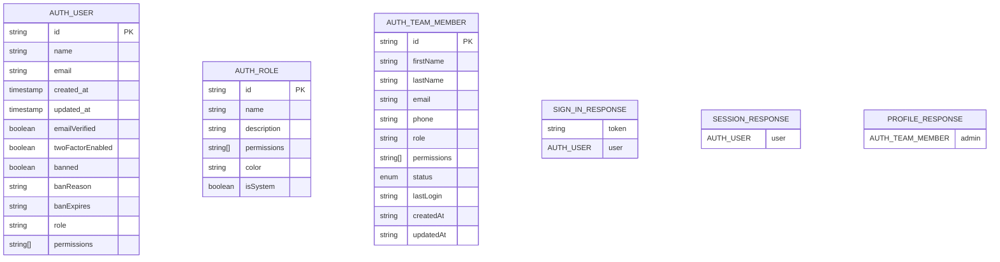

**Diagram sources**
- [auth.ts:1-64](file://app/types/auth.ts#L1-L64)

**Section sources**
- [auth.ts:1-64](file://app/types/auth.ts#L1-L64)