# Authentication & Authorization

<cite>
**Referenced Files in This Document**
- [auth.ts](file://app/stores/auth.ts)
- [auth-init.client.ts](file://app/plugins/auth-init.client.ts)
- [auth.global.ts](file://app/middleware/auth.global.ts)
- [permissions.global.ts](file://app/middleware/permissions.global.ts)
- [usePermissions.ts](file://app/composables/usePermissions.ts)
- [auth.ts](file://app/utils/auth.ts)
- [auth.ts](file://app/types/auth.ts)
- [useApi.ts](file://app/composables/useApi.ts)
- [login.vue](file://app/pages/login.vue)
- [PermissionGuard.vue](file://app/components/PermissionGuard.vue)
- [SessionWarning.vue](file://app/components/SessionWarning.vue)
</cite>

## Table of Contents
1. [Introduction](#introduction)
2. [Project Structure](#project-structure)
3. [Core Components](#core-components)
4. [Architecture Overview](#architecture-overview)
5. [Detailed Component Analysis](#detailed-component-analysis)
6. [Dependency Analysis](#dependency-analysis)
7. [Performance Considerations](#performance-considerations)
8. [Troubleshooting Guide](#troubleshooting-guide)
9. [Conclusion](#conclusion)
10. [Appendices](#appendices)

## Introduction
This document explains the application’s authentication and authorization system, focusing on:
- JWT-based session management with automatic renewal and expiration warnings
- Team member profile synchronization to keep roles and permissions up to date
- Role-based access control (RBAC) with granular permission checks, admin privilege escalation, and flexible role normalization
- Middleware pattern for route protection and session validation
- Graceful degradation on authentication failures
- Practical examples for extending permissions and handling errors
- Security considerations and best practices

## Project Structure
The authentication and authorization features are implemented across stores, middleware, composables, utilities, types, plugins, pages, and components:
- Store: Central state for user, token, team member profile, and session timers
- Plugin: Initializes session check on app load
- Middleware: Global guards for authentication and permissions
- Composables: Permission helpers for UI and logic
- Utilities: Role normalization and RBAC functions
- Types: Shared data models for auth and team profiles
- API composable: Attaches tokens and handles 401 responses
- Pages: Login flow
- Components: Permission guard and session warning UI

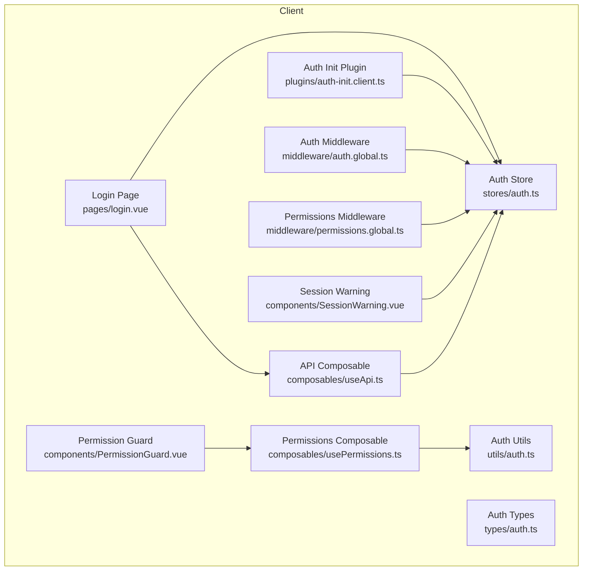

**Diagram sources**
- [login.vue:1-167](file://app/pages/login.vue#L1-L167)
- [auth.ts:1-230](file://app/stores/auth.ts#L1-L230)
- [auth-init.client.ts:1-25](file://app/plugins/auth-init.client.ts#L1-L25)
- [auth.global.ts:1-32](file://app/middleware/auth.global.ts#L1-L32)
- [permissions.global.ts:1-59](file://app/middleware/permissions.global.ts#L1-L59)
- [usePermissions.ts:1-43](file://app/composables/usePermissions.ts#L1-L43)
- [useApi.ts:1-91](file://app/composables/useApi.ts#L1-L91)
- [PermissionGuard.vue:1-38](file://app/components/PermissionGuard.vue#L1-L38)
- [SessionWarning.vue:1-66](file://app/components/SessionWarning.vue#L1-L66)
- [auth.ts:1-58](file://app/utils/auth.ts#L1-L58)
- [auth.ts:1-64](file://app/types/auth.ts#L1-L64)

**Section sources**
- [auth.ts:1-230](file://app/stores/auth.ts#L1-L230)
- [auth-init.client.ts:1-25](file://app/plugins/auth-init.client.ts#L1-L25)
- [auth.global.ts:1-32](file://app/middleware/auth.global.ts#L1-L32)
- [permissions.global.ts:1-59](file://app/middleware/permissions.global.ts#L1-L59)
- [usePermissions.ts:1-43](file://app/composables/usePermissions.ts#L1-L43)
- [auth.ts:1-58](file://app/utils/auth.ts#L1-L58)
- [auth.ts:1-64](file://app/types/auth.ts#L1-L64)
- [useApi.ts:1-91](file://app/composables/useApi.ts#L1-L91)
- [login.vue:1-167](file://app/pages/login.vue#L1-L167)
- [PermissionGuard.vue:1-38](file://app/components/PermissionGuard.vue#L1-L38)
- [SessionWarning.vue:1-66](file://app/components/SessionWarning.vue#L1-L66)

## Core Components
- Auth store: Manages user identity, JWT token, team member profile, session expiry, and periodic checks. It also synchronizes role and permissions from the backend profile endpoint and provides refresh and logout flows.
- Auth init plugin: On app startup, validates an existing session and redirects if invalid.
- Auth middleware: Protects routes by enforcing authentication and validating sessions during navigation.
- Permissions middleware: Enforces route-level permissions based on a mapping table; admins bypass checks.
- Permissions composable: Provides convenient checks for permissions and roles in components and composables.
- Auth utils: Implements role normalization, admin detection, and permission checks.
- API composable: Automatically attaches the bearer token and handles 401 by logging out and redirecting.
- Permission guard component: Declarative UI-level access control using permissions and roles.
- Session warning component: In-app notification when the session is about to expire.

**Section sources**
- [auth.ts:1-230](file://app/stores/auth.ts#L1-L230)
- [auth-init.client.ts:1-25](file://app/plugins/auth-init.client.ts#L1-L25)
- [auth.global.ts:1-32](file://app/middleware/auth.global.ts#L1-L32)
- [permissions.global.ts:1-59](file://app/middleware/permissions.global.ts#L1-L59)
- [usePermissions.ts:1-43](file://app/composables/usePermissions.ts#L1-L43)
- [auth.ts:1-58](file://app/utils/auth.ts#L1-L58)
- [useApi.ts:1-91](file://app/composables/useApi.ts#L1-L91)
- [PermissionGuard.vue:1-38](file://app/components/PermissionGuard.vue#L1-L38)
- [SessionWarning.vue:1-66](file://app/components/SessionWarning.vue#L1-L66)

## Architecture Overview
The system follows a layered approach:
- Client entry points (login page) authenticate via the API composable and set the auth store.
- The auth store persists token and user, initializes session timers, and fetches the team member profile to sync roles and permissions.
- Global middleware enforces authentication and permissions before rendering protected routes.
- UI components use the permissions composable and guard component to conditionally render content.
- The API composable ensures all requests carry the token and gracefully handle 401 by clearing session and redirecting.

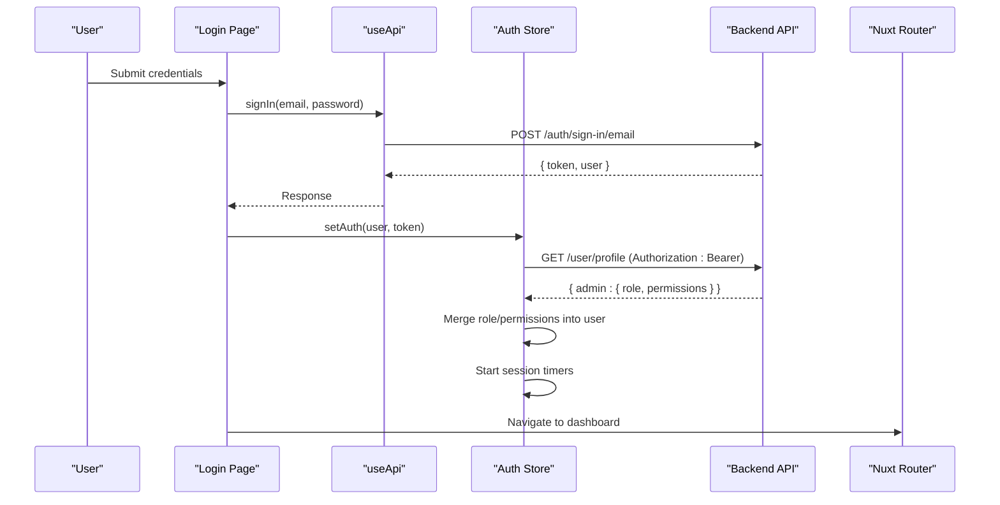

**Diagram sources**
- [login.vue:48-64](file://app/pages/login.vue#L48-L64)
- [useApi.ts:82-86](file://app/composables/useApi.ts#L82-L86)
- [auth.ts:45-57](file://app/stores/auth.ts#L45-L57)
- [auth.ts:15-43](file://app/stores/auth.ts#L15-L43)

## Detailed Component Analysis

### Auth Store: Session Management and Profile Sync
Responsibilities:
- Persist and expose user, token, team member profile, and session metadata
- Initialize and manage periodic session checks and warnings
- Synchronize team member profile to update role and permissions
- Provide refresh and logout operations

Key behaviors:
- On login, sets token and user, schedules session checks, and fetches profile
- Periodically calls session validation endpoint and resets expiry on success
- Shows a warning when within two minutes of expiry; logs out at zero
- On logout, clears local state and attempts server-side sign-out

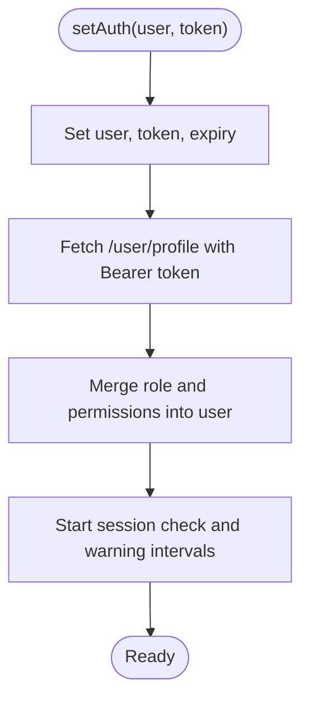

**Diagram sources**
- [auth.ts:45-57](file://app/stores/auth.ts#L45-L57)
- [auth.ts:15-43](file://app/stores/auth.ts#L15-L43)

**Section sources**
- [auth.ts:1-230](file://app/stores/auth.ts#L1-L230)

### Auth Init Plugin: Startup Validation
Responsibilities:
- If a persisted session exists, validate it immediately
- Redirect to login if invalid
- Expose a loading flag for initial auth check

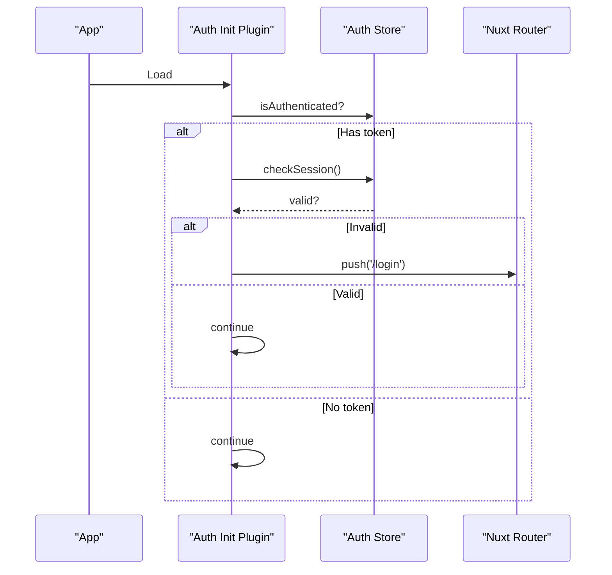

**Diagram sources**
- [auth-init.client.ts:1-25](file://app/plugins/auth-init.client.ts#L1-L25)
- [auth.ts:90-120](file://app/stores/auth.ts#L90-L120)

**Section sources**
- [auth-init.client.ts:1-25](file://app/plugins/auth-init.client.ts#L1-L25)

### Auth Middleware: Route Protection
Responsibilities:
- Allow public routes and payment-related paths without authentication
- Redirect unauthenticated users to login
- Validate session on navigation (not on initial load)

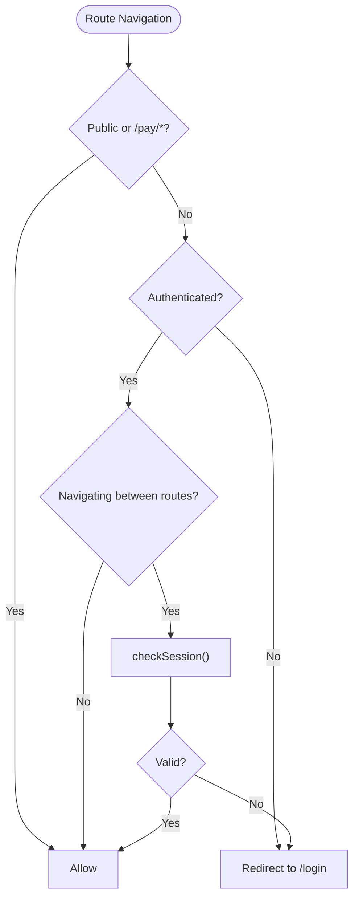

**Diagram sources**
- [auth.global.ts:1-32](file://app/middleware/auth.global.ts#L1-L32)
- [auth.ts:90-120](file://app/stores/auth.ts#L90-L120)

**Section sources**
- [auth.global.ts:1-32](file://app/middleware/auth.global.ts#L1-L32)

### Permissions Middleware: Route-Level RBAC
Responsibilities:
- Skip public and payment routes
- Allow admins and super admins to access any route
- Map routes to required permissions and enforce them
- Redirect unauthorized users to /unauthorized

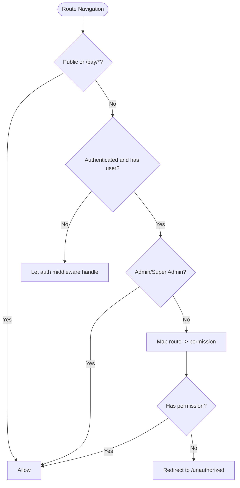

**Diagram sources**
- [permissions.global.ts:1-59](file://app/middleware/permissions.global.ts#L1-L59)
- [auth.ts:22-25](file://app/utils/auth.ts#L22-L25)

**Section sources**
- [permissions.global.ts:1-59](file://app/middleware/permissions.global.ts#L1-L59)

### Permissions Composable and Guard: UI-Level Access Control
Responsibilities:
- Provide helper methods to check permissions and roles
- Offer computed flags for admin status
- Render UI conditionally based on access rules

Usage patterns:
- Check single permission or multiple permissions (any/all)
- Check role equality with flexible normalization
- Use the PermissionGuard component to declaratively show/hide sections

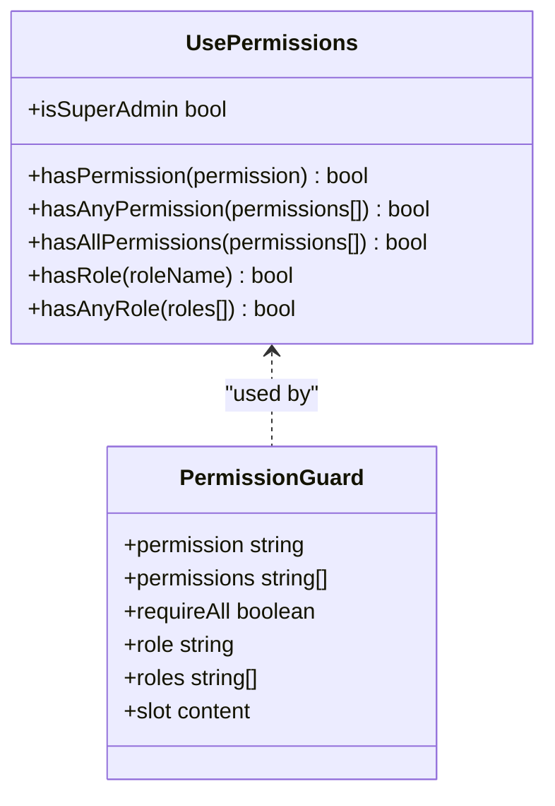

**Diagram sources**
- [usePermissions.ts:1-43](file://app/composables/usePermissions.ts#L1-L43)
- [PermissionGuard.vue:1-38](file://app/components/PermissionGuard.vue#L1-L38)

**Section sources**
- [usePermissions.ts:1-43](file://app/composables/usePermissions.ts#L1-L43)
- [PermissionGuard.vue:1-38](file://app/components/PermissionGuard.vue#L1-L38)

### Auth Utils: Role Normalization and RBAC Logic
Responsibilities:
- Normalize roles to lowercase, underscore-free strings
- Detect admin/super-admin roles
- Extract permissions and perform checks with admin override

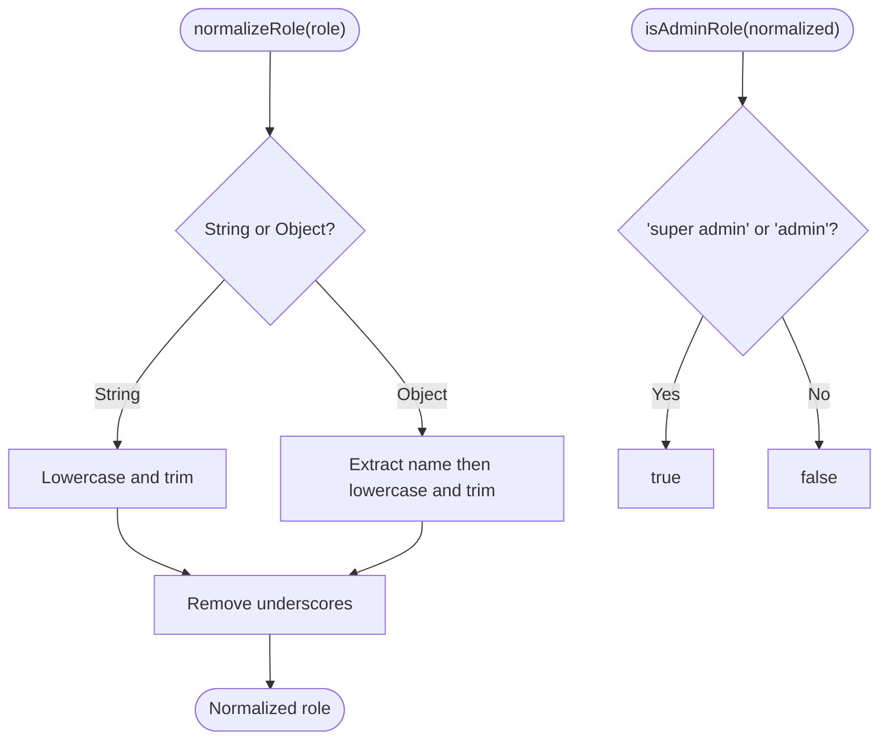

**Diagram sources**
- [auth.ts:7-17](file://app/utils/auth.ts#L7-L17)

**Section sources**
- [auth.ts:1-58](file://app/utils/auth.ts#L1-L58)

### API Composable: Token Attachment and Error Handling
Responsibilities:
- Attach Authorization header when token exists
- Handle 401 by logging out and redirecting
- Wrap HTTP verbs with error handling and toast integration

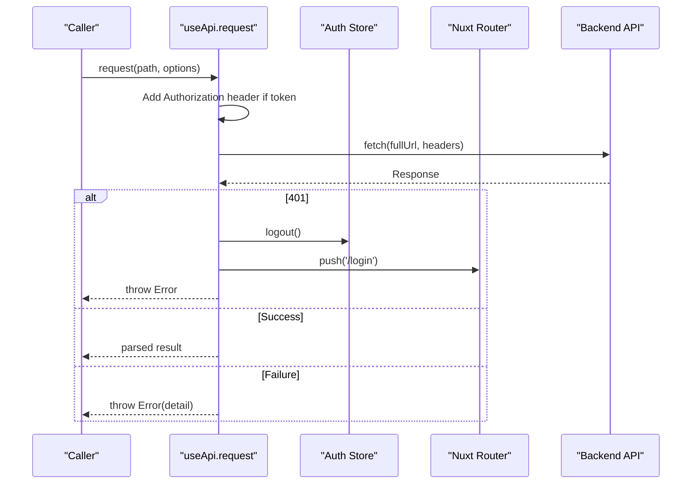

**Diagram sources**
- [useApi.ts:9-67](file://app/composables/useApi.ts#L9-L67)
- [auth.ts:176-201](file://app/stores/auth.ts#L176-L201)

**Section sources**
- [useApi.ts:1-91](file://app/composables/useApi.ts#L1-L91)

### Session Warning: Expiration UX
Responsibilities:
- Display countdown when session expires soon
- Provide actions to extend or dismiss
- Integrate with store to trigger refresh and clear warnings

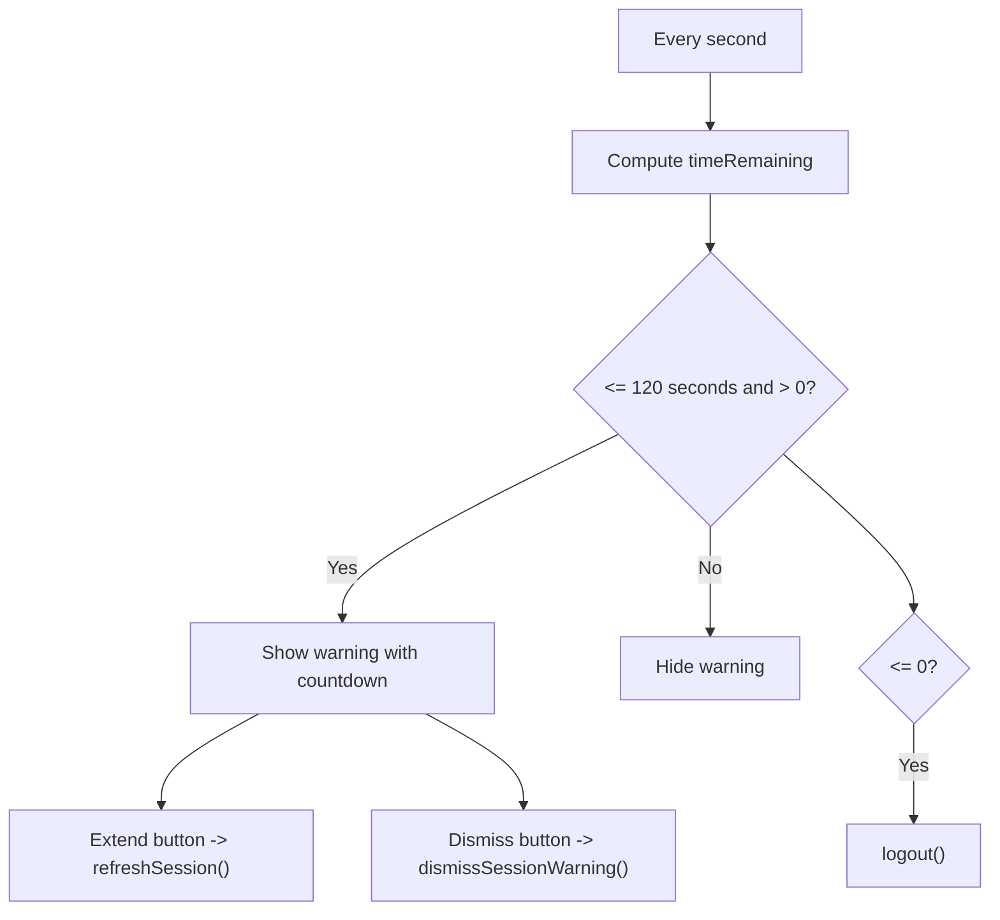

**Diagram sources**
- [auth.ts:122-146](file://app/stores/auth.ts#L122-L146)
- [SessionWarning.vue:1-66](file://app/components/SessionWarning.vue#L1-L66)

**Section sources**
- [auth.ts:122-146](file://app/stores/auth.ts#L122-L146)
- [SessionWarning.vue:1-66](file://app/components/SessionWarning.vue#L1-L66)

## Dependency Analysis
High-level dependencies:
- Login page depends on API composable and auth store
- Auth store depends on runtime config endpoints and updates user/teamMember
- Middleware depends on auth store and auth utils
- Permissions composable depends on auth utils
- Permission guard depends on permissions composable
- API composable depends on auth store and router

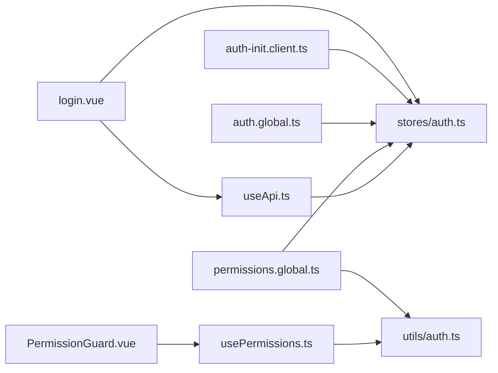

**Diagram sources**
- [login.vue:1-167](file://app/pages/login.vue#L1-L167)
- [useApi.ts:1-91](file://app/composables/useApi.ts#L1-L91)
- [auth.ts:1-230](file://app/stores/auth.ts#L1-L230)
- [auth-init.client.ts:1-25](file://app/plugins/auth-init.client.ts#L1-L25)
- [auth.global.ts:1-32](file://app/middleware/auth.global.ts#L1-L32)
- [permissions.global.ts:1-59](file://app/middleware/permissions.global.ts#L1-L59)
- [usePermissions.ts:1-43](file://app/composables/usePermissions.ts#L1-L43)
- [auth.ts:1-58](file://app/utils/auth.ts#L1-L58)
- [PermissionGuard.vue:1-38](file://app/components/PermissionGuard.vue#L1-L38)

**Section sources**
- [login.vue:1-167](file://app/pages/login.vue#L1-L167)
- [useApi.ts:1-91](file://app/composables/useApi.ts#L1-L91)
- [auth.ts:1-230](file://app/stores/auth.ts#L1-L230)
- [auth-init.client.ts:1-25](file://app/plugins/auth-init.client.ts#L1-L25)
- [auth.global.ts:1-32](file://app/middleware/auth.global.ts#L1-L32)
- [permissions.global.ts:1-59](file://app/middleware/permissions.global.ts#L1-L59)
- [usePermissions.ts:1-43](file://app/composables/usePermissions.ts#L1-L43)
- [auth.ts:1-58](file://app/utils/auth.ts#L1-L58)
- [PermissionGuard.vue:1-38](file://app/components/PermissionGuard.vue#L1-L38)

## Performance Considerations
- Session checks run every five minutes; consider adjusting frequency based on expected usage and server load.
- Session warning interval runs every second; ensure UI remains responsive and avoid heavy computations inside the timer.
- Profile fetching occurs after login and on session refresh; cache results locally to minimize redundant network calls.
- Avoid re-fetching the profile on every route change; rely on store initialization and refresh mechanisms.

[No sources needed since this section provides general guidance]

## Troubleshooting Guide
Common issues and resolutions:
- 401 Unauthorized on API calls: The API composable automatically logs out and redirects to login. Verify that the token is present and not expired.
- Session unexpectedly expires: Ensure the session refresh endpoint is reachable and returns a valid response. Confirm that the store’s session timers are active.
- Missing permissions despite having a role: Verify that the team member profile endpoint returns updated permissions and that the store merges them into the user object.
- Route still accessible without permission: Confirm the route path matches the permission mapping and that the user lacks admin privileges.

Operational tips:
- Use the session warning UI to proactively extend sessions before expiry.
- For debugging, inspect console logs emitted by the auth store, API composable, and middleware.

**Section sources**
- [useApi.ts:39-44](file://app/composables/useApi.ts#L39-L44)
- [auth.ts:90-120](file://app/stores/auth.ts#L90-L120)
- [auth.ts:15-43](file://app/stores/auth.ts#L15-L43)
- [permissions.global.ts:31-57](file://app/middleware/permissions.global.ts#L31-L57)

## Conclusion
The authentication and authorization system combines robust session management, automatic renewal, and comprehensive RBAC. Middleware protects routes, while composables and components provide flexible, declarative access controls. The design supports graceful degradation on failures and offers clear extension points for custom permissions and roles.

[No sources needed since this section summarizes without analyzing specific files]

## Appendices

### Practical Examples

- Implementing a custom permission:
  - Define a new permission key and add it to the route mapping in the permissions middleware.
  - Use the permissions composable or PermissionGuard component to enforce it in UI.

- Extending the role system:
  - Add new role names to the admin role list in the utils if they should have elevated privileges.
  - Ensure the team member profile endpoint returns the correct role and permissions for the new role.

- Handling authentication errors:
  - Rely on the API composable’s 401 handling for automatic logout and redirect.
  - Catch and display user-friendly messages for other failures using the error handler wrapper.

- Integrating with the permission system:
  - Use hasPermission, hasAnyPermission, hasAllPermissions, hasRole, and hasAnyRole in components and composables.
  - Wrap sensitive UI blocks with PermissionGuard for consistent behavior.

Security considerations and best practices:
- Always send the Authorization header only over HTTPS.
- Keep tokens short-lived and refresh frequently; leverage the built-in session checks.
- Avoid storing sensitive data beyond what is necessary in persistent storage.
- Centralize permission mappings and review them regularly to prevent drift.
- Log and monitor authentication events for anomalies.

[No sources needed since this section provides general guidance]