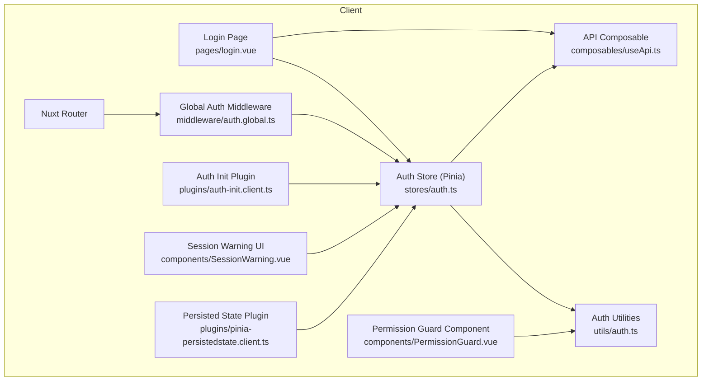
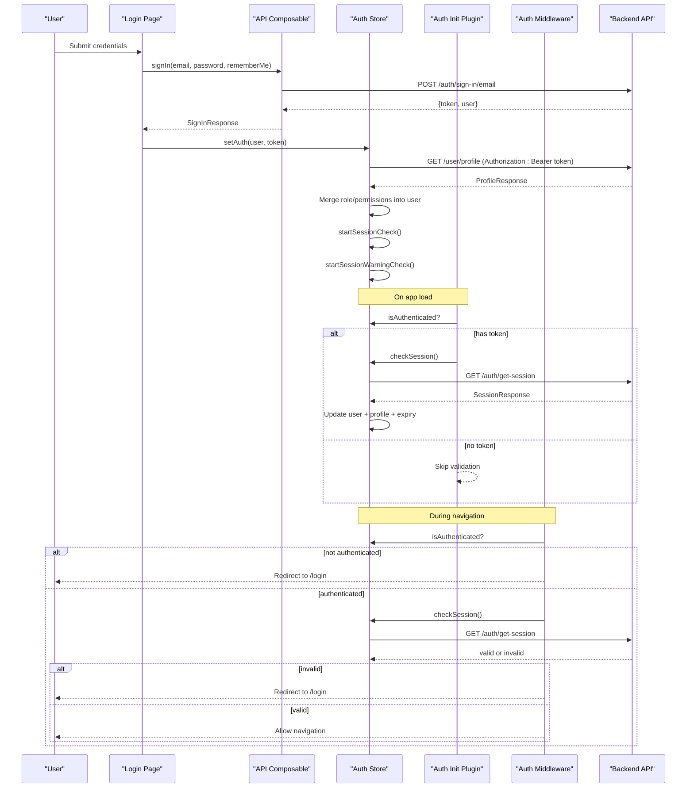
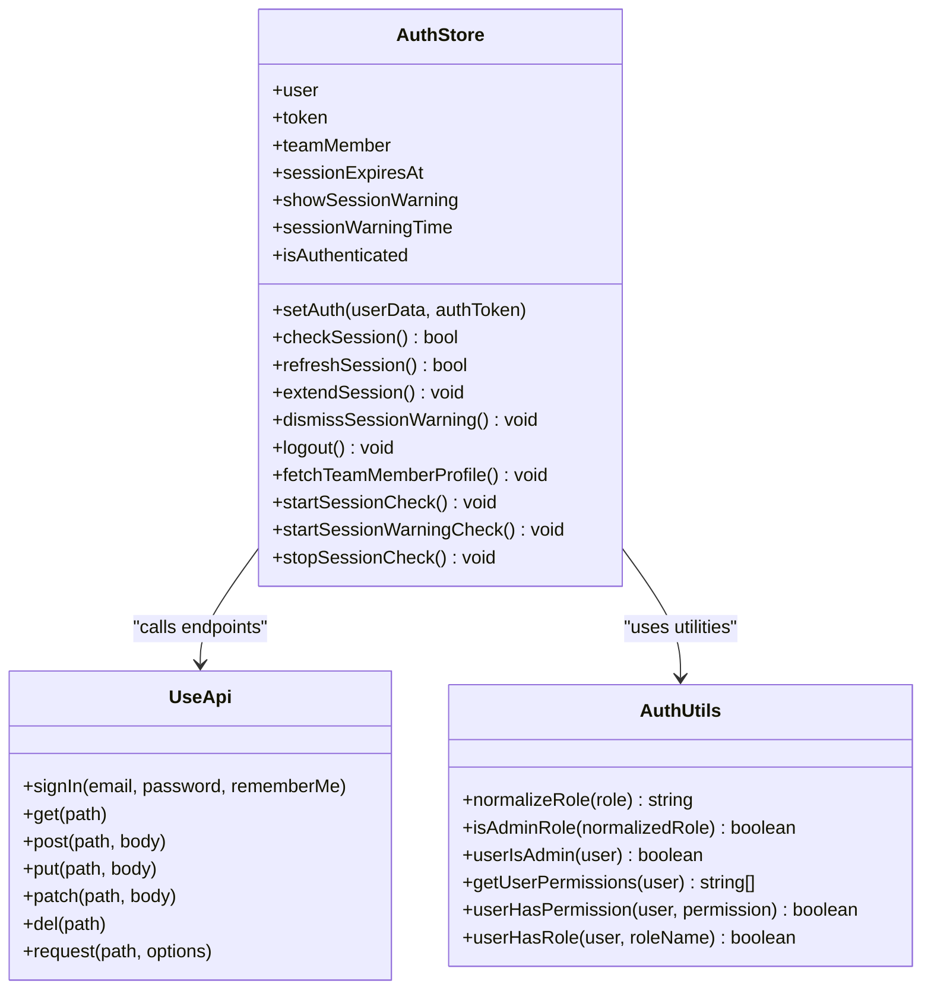
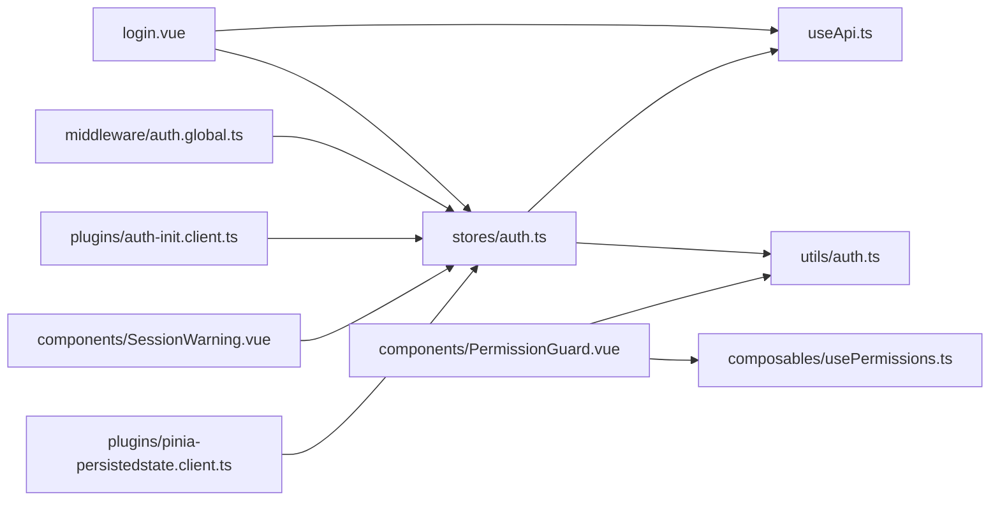
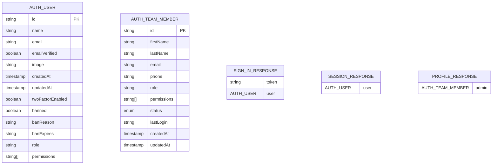

# Authentication Flow

<cite>
**Referenced Files in This Document**
- [auth.ts](file://app/stores/auth.ts)
- [auth.global.ts](file://app/middleware/auth.global.ts)
- [auth-init.client.ts](file://app/plugins/auth-init.client.ts)
- [useApi.ts](file://app/composables/useApi.ts)
- [auth.ts](file://app/utils/auth.ts)
- [auth.ts](file://app/types/auth.ts)
- [login.vue](file://app/pages/login.vue)
- [PermissionGuard.vue](file://app/components/PermissionGuard.vue)
- [SessionWarning.vue](file://app/components/SessionWarning.vue)
- [pinia-persistedstate.client.ts](file://app/plugins/pinia-persistedstate.client.ts)
- [nuxt.config.ts](file://nuxt.config.ts)
</cite>

## Table of Contents
1. [Introduction](#introduction)
2. [Project Structure](#project-structure)
3. [Core Components](#core-components)
4. [Architecture Overview](#architecture-overview)
5. [Detailed Component Analysis](#detailed-component-analysis)
6. [Dependency Analysis](#dependency-analysis)
7. [Performance Considerations](#performance-considerations)
8. [Troubleshooting Guide](#troubleshooting-guide)
9. [Conclusion](#conclusion)
10. [Appendices](#appendices)

## Introduction
This document explains the authentication flow implementation in the application. It covers:
- JWT-based login process and token handling
- Token storage and validation
- Automatic session initialization on app load
- User profile synchronization with role and permissions
- Authentication store methods including setAuth(), checkSession(), refreshSession(), extendSession(), dismissSessionWarning(), and logout()
- Middleware guards that protect routes and handle unauthorized access
- Practical examples for custom authentication flows, error handling, and state management across the application

## Project Structure
The authentication system is implemented using Nuxt 3 with Pinia for state management, a global route middleware for protection, and client plugins for initialization and persistence.

**Diagram sources**
- [login.vue:1-167](file://app/pages/login.vue#L1-L167)
- [auth.global.ts:1-32](file://app/middleware/auth.global.ts#L1-L32)
- [auth-init.client.ts:1-25](file://app/plugins/auth-init.client.ts#L1-L25)
- [auth.ts:1-230](file://app/stores/auth.ts#L1-L230)
- [useApi.ts:1-91](file://app/composables/useApi.ts#L1-L91)
- [auth.ts:1-58](file://app/utils/auth.ts#L1-L58)
- [PermissionGuard.vue:1-38](file://app/components/PermissionGuard.vue#L1-L38)
- [SessionWarning.vue:1-66](file://app/components/SessionWarning.vue#L1-L66)
- [pinia-persistedstate.client.ts:1-7](file://app/plugins/pinia-persistedstate.client.ts#L1-L7)

**Section sources**
- [nuxt.config.ts:1-46](file://nuxt.config.ts#L1-L46)

## Core Components
- Authentication Store (Pinia): Centralized state for user, token, team member profile, session expiry, and warnings; provides methods to set auth, validate sessions, refresh/extend sessions, and logout.
- Global Route Middleware: Protects routes by checking authentication and validating active sessions during navigation.
- Auth Init Plugin: Validates existing sessions on app startup and redirects if invalid.
- API Composable: Attaches Authorization headers, handles 401 responses, and exposes typed helpers including signIn.
- Auth Utilities: Role normalization and permission checks used by components and composables.
- Permission Guard Component: Declarative component-level authorization based on roles and permissions.
- Session Warning UI: In-app notification when session is about to expire, with extend/dismiss actions.
- Persistence Plugin: Persists auth store state across reloads.

**Section sources**
- [auth.ts:1-230](file://app/stores/auth.ts#L1-L230)
- [auth.global.ts:1-32](file://app/middleware/auth.global.ts#L1-L32)
- [auth-init.client.ts:1-25](file://app/plugins/auth-init.client.ts#L1-L25)
- [useApi.ts:1-91](file://app/composables/useApi.ts#L1-L91)
- [auth.ts:1-58](file://app/utils/auth.ts#L1-L58)
- [PermissionGuard.vue:1-38](file://app/components/PermissionGuard.vue#L1-L38)
- [SessionWarning.vue:1-66](file://app/components/SessionWarning.vue#L1-L66)
- [pinia-persistedstate.client.ts:1-7](file://app/plugins/pinia-persistedstate.client.ts#L1-L7)

## Architecture Overview
The authentication architecture follows a layered approach:
- UI triggers login via the API composable, which returns a JWT and user object.
- The store persists tokens and initializes session monitoring.
- A plugin validates sessions on app load.
- Middleware protects routes and revalidates sessions on navigation.
- Periodic checks refresh sessions and warn users before expiry.
- Utility functions and guard components enforce role/permission policies.

**Diagram sources**
- [login.vue:48-64](file://app/pages/login.vue#L48-L64)
- [useApi.ts:82-86](file://app/composables/useApi.ts#L82-L86)
- [auth.ts:45-57](file://app/stores/auth.ts#L45-L57)
- [auth.ts:15-43](file://app/stores/auth.ts#L15-L43)
- [auth.ts:90-120](file://app/stores/auth.ts#L90-L120)
- [auth-init.client.ts:9-20](file://app/plugins/auth-init.client.ts#L9-L20)
- [auth.global.ts:15-30](file://app/middleware/auth.global.ts#L15-L30)

## Detailed Component Analysis

### Authentication Store (Pinia)
Responsibilities:
- Maintain user, token, teamMember, sessionExpiresAt, and warning flags.
- Provide setAuth() to initialize state after successful login.
- Provide checkSession() to validate current session and update user data.
- Provide refreshSession() and extendSession() to proactively keep sessions alive.
- Provide logout() to clear state and call server-side sign-out.
- Start periodic session checks and warnings; stop them on logout.
- Auto-initialize session checks and profile fetch if token exists at store creation time.

Key behaviors:
- setAuth(): Sets user and token, sets expiry to 30 minutes from now, fetches full profile (role/permissions), starts session checks and warnings.
- checkSession(): Calls /auth/get-session; updates user and merges admin profile; resets expiry; logs out on failure.
- refreshSession()/extendSession(): Revalidate session and reset expiry; show/hide warning accordingly.
- logout(): Stops intervals, calls /auth/sign-out, clears all state.
- startSessionCheck(): Every 5 minutes, validates session and redirects to login if invalid.
- startSessionWarningCheck(): Every second, shows warning within last 2 minutes; auto-logout when expired.

Persistence:
- The store is configured with persist: true, so token and related state survive page reloads.

**Section sources**
- [auth.ts:1-230](file://app/stores/auth.ts#L1-L230)
- [pinia-persistedstate.client.ts:1-7](file://app/plugins/pinia-persistedstate.client.ts#L1-L7)

#### Class Diagram: Auth Store Methods and Relationships

**Diagram sources**
- [auth.ts:1-230](file://app/stores/auth.ts#L1-L230)
- [useApi.ts:1-91](file://app/composables/useApi.ts#L1-L91)
- [auth.ts:1-58](file://app/utils/auth.ts#L1-L58)

### Global Route Middleware
Responsibilities:
- Define public routes (/login, /forgot-password, /unauthorized) and payment routes (/pay/**).
- If route is public, allow access.
- If not authenticated, redirect to /login.
- For authenticated users navigating between routes, verify session validity; redirect to /login if invalid.

Notes:
- Initial session validation on app load is handled by the auth-init plugin, not this middleware.

**Section sources**
- [auth.global.ts:1-32](file://app/middleware/auth.global.ts#L1-L32)

### Auth Init Plugin
Responsibilities:
- Provide an isCheckingAuth flag to UI layers.
- On app load, if a token exists, validate session via checkSession().
- Redirect to /login if session is invalid.
- Mark auth check as complete to unblock UI.

**Section sources**
- [auth-init.client.ts:1-25](file://app/plugins/auth-init.client.ts#L1-L25)

### API Composable
Responsibilities:
- Attach Authorization header automatically when token exists.
- Handle 401 responses by logging out and redirecting to login.
- Wrap requests with error handling and toast integration.
- Expose signIn helper for login flow.

Error Handling:
- 401 triggers logout and navigation to login.
- Non-success status codes throw errors with message extraction when available.

**Section sources**
- [useApi.ts:1-91](file://app/composables/useApi.ts#L1-L91)

### Auth Utilities
Responsibilities:
- Normalize roles to lowercase strings without underscores.
- Determine admin roles and super admin status.
- Extract and check permissions.
- Compare roles case-insensitively.

Usage:
- Used by usePermissions composable and PermissionGuard component.

**Section sources**
- [auth.ts:1-58](file://app/utils/auth.ts#L1-L58)

### Permission Guard Component
Responsibilities:
- Declaratively restrict rendering based on roles and permissions.
- Support single or multiple roles/permissions, with requireAll semantics.
- Super admins bypass restrictions.

Integration:
- Uses usePermissions composable which relies on utils/auth.

**Section sources**
- [PermissionGuard.vue:1-38](file://app/components/PermissionGuard.vue#L1-L38)
- [usePermissions.ts:1-43](file://app/composables/usePermissions.ts#L1-L43)
- [auth.ts:1-58](file://app/utils/auth.ts#L1-L58)

### Session Warning UI
Responsibilities:
- Display countdown until session expiry.
- Provide Extend Session and Dismiss actions.
- Emit events consumed by parent components to trigger store methods.

Integration:
- Bound to store’s showSessionWarning and sessionWarningTime.

**Section sources**
- [SessionWarning.vue:1-66](file://app/components/SessionWarning.vue#L1-L66)
- [auth.ts:122-146](file://app/stores/auth.ts#L122-L146)

### Login Page
Responsibilities:
- Validate email/password inputs.
- Call useApi.signIn to authenticate.
- On success, call authStore.setAuth and navigate to home.
- Show errors and loading states.

**Section sources**
- [login.vue:1-167](file://app/pages/login.vue#L1-L167)
- [useApi.ts:82-86](file://app/composables/useApi.ts#L82-L86)
- [auth.ts:45-57](file://app/stores/auth.ts#L45-L57)

## Dependency Analysis
High-level dependencies:
- Login Page depends on useApi and auth store.
- Auth Store depends on useApi for network calls and utils/auth for role/permission logic.
- Middleware depends on auth store for authentication state.
- Auth Init Plugin depends on auth store for initial validation.
- Permission Guard depends on usePermissions and utils/auth.
- Session Warning UI depends on auth store reactive state.
- Persistence plugin configures pinia-plugin-persistedstate globally.

**Diagram sources**
- [login.vue:1-167](file://app/pages/login.vue#L1-L167)
- [auth.global.ts:1-32](file://app/middleware/auth.global.ts#L1-L32)
- [auth-init.client.ts:1-25](file://app/plugins/auth-init.client.ts#L1-L25)
- [auth.ts:1-230](file://app/stores/auth.ts#L1-L230)
- [useApi.ts:1-91](file://app/composables/useApi.ts#L1-L91)
- [auth.ts:1-58](file://app/utils/auth.ts#L1-L58)
- [PermissionGuard.vue:1-38](file://app/components/PermissionGuard.vue#L1-L38)
- [SessionWarning.vue:1-66](file://app/components/SessionWarning.vue#L1-L66)
- [pinia-persistedstate.client.ts:1-7](file://app/plugins/pinia-persistedstate.client.ts#L1-L7)

**Section sources**
- [nuxt.config.ts:1-46](file://nuxt.config.ts#L1-L46)

## Performance Considerations
- Session checks run every 5 minutes; consider adjusting frequency based on backend capabilities and UX needs.
- Session warning checks run every second; ensure UI updates are lightweight to avoid unnecessary re-renders.
- Profile fetching occurs after login and on session refresh; cache results locally where possible to reduce redundant calls.
- Avoid excessive network calls by consolidating operations (e.g., merging profile updates only when necessary).

[No sources needed since this section provides general guidance]

## Troubleshooting Guide
Common issues and resolutions:
- 401 Unauthorized during API calls:
  - The API composable automatically logs out and redirects to login. Ensure your UI handles this gracefully and does not retry failed requests after logout.
- Session expires unexpectedly:
  - Verify that periodic session checks are running and that the backend /auth/get-session endpoint responds correctly. Check console logs for “[auth] Periodic session check” messages.
- User profile not updated:
  - Confirm that /user/profile returns expected data and that the store merges admin role and permissions into the user object.
- Persistent state not restored after reload:
  - Ensure the persisted state plugin is enabled and that the store uses persist: true.

**Section sources**
- [useApi.ts:39-44](file://app/composables/useApi.ts#L39-L44)
- [auth.ts:148-163](file://app/stores/auth.ts#L148-L163)
- [auth.ts:15-43](file://app/stores/auth.ts#L15-L43)
- [pinia-persistedstate.client.ts:1-7](file://app/plugins/pinia-persistedstate.client.ts#L1-L7)

## Conclusion
The authentication system combines a robust Pinia store, global middleware, and client plugins to provide secure, persistent, and user-friendly session management. It supports automatic session validation, proactive refresh, role/permission enforcement, and clear error handling. The modular design allows easy extension for custom authentication flows and additional security features.

[No sources needed since this section summarizes without analyzing specific files]

## Appendices

### Practical Examples

#### Implementing Custom Authentication Flows
- Add a new login method in the API composable for alternative providers (e.g., OAuth).
- On success, call authStore.setAuth with the returned user and token.
- Optionally, skip profile fetch if the provider already includes role/permissions.

References:
- [useApi.ts:82-86](file://app/composables/useApi.ts#L82-L86)
- [auth.ts:45-57](file://app/stores/auth.ts#L45-L57)

#### Handling Authentication Errors
- Catch errors thrown by useApi methods and display user-friendly messages.
- For 401 responses, rely on automatic logout and redirection; do not attempt retries.

References:
- [useApi.ts:39-58](file://app/composables/useApi.ts#L39-L58)
- [login.vue:59-64](file://app/pages/login.vue#L59-L64)

#### Managing Authentication State Across the Application
- Use computed isAuthenticated in components to conditionally render UI.
- Leverage PermissionGuard for declarative access control based on roles/permissions.
- Use usePermissions composable for programmatic checks.

References:
- [auth.ts:13-13](file://app/stores/auth.ts#L13-L13)
- [PermissionGuard.vue:1-38](file://app/components/PermissionGuard.vue#L1-L38)
- [usePermissions.ts:1-43](file://app/composables/usePermissions.ts#L1-L43)

### Data Models

**Diagram sources**
- [auth.ts:1-64](file://app/types/auth.ts#L1-L64)