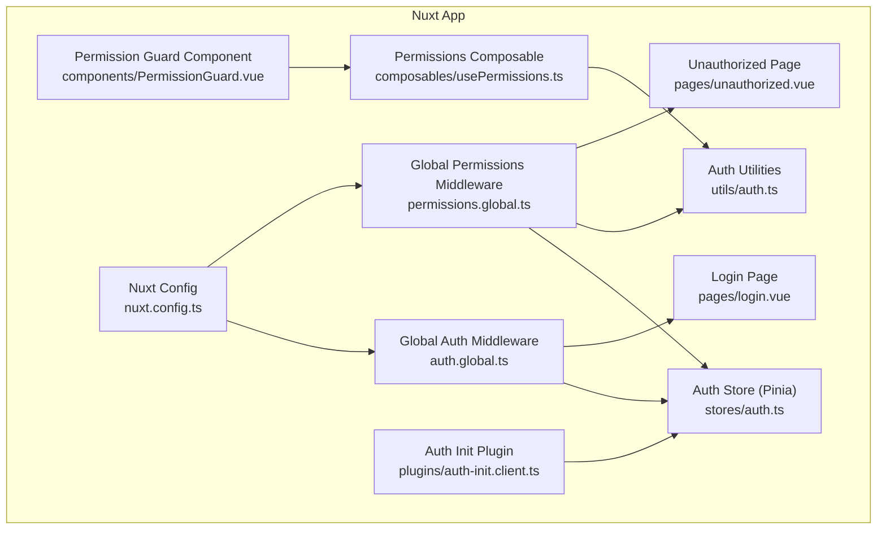
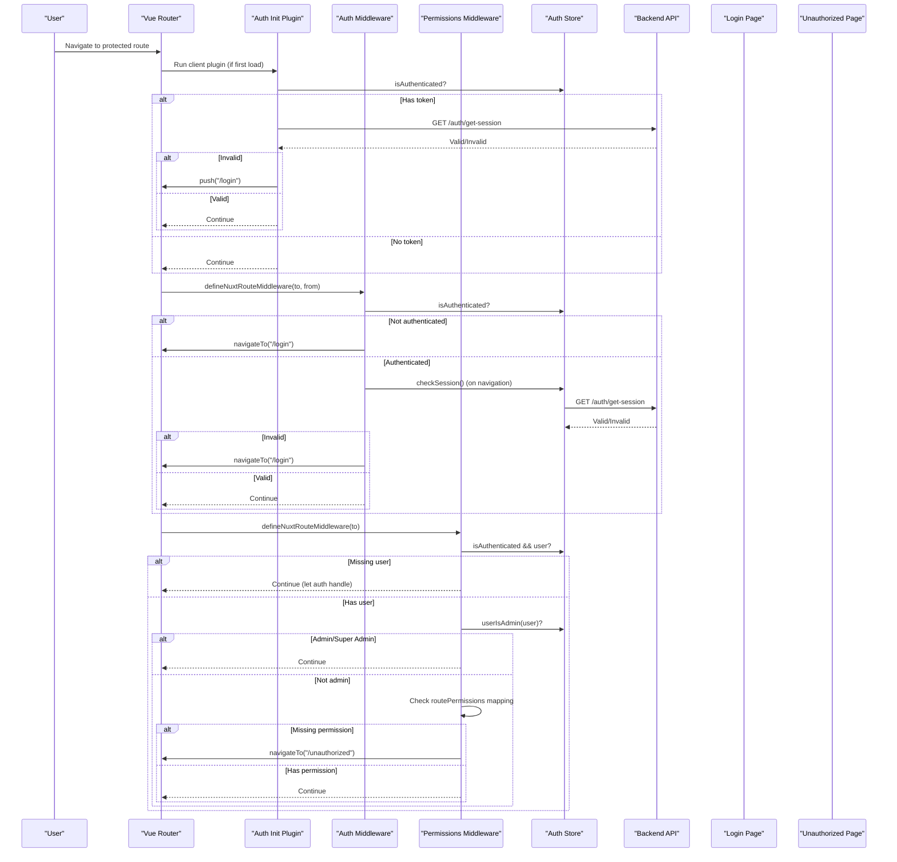
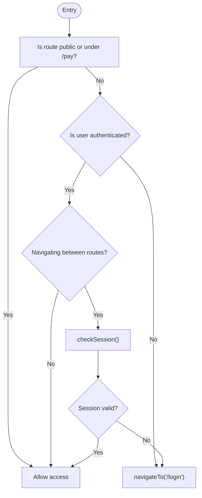
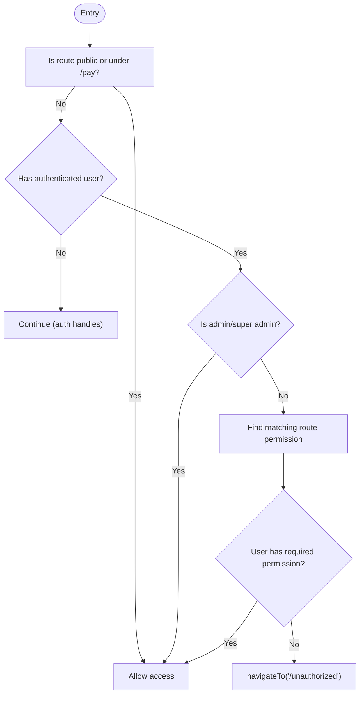
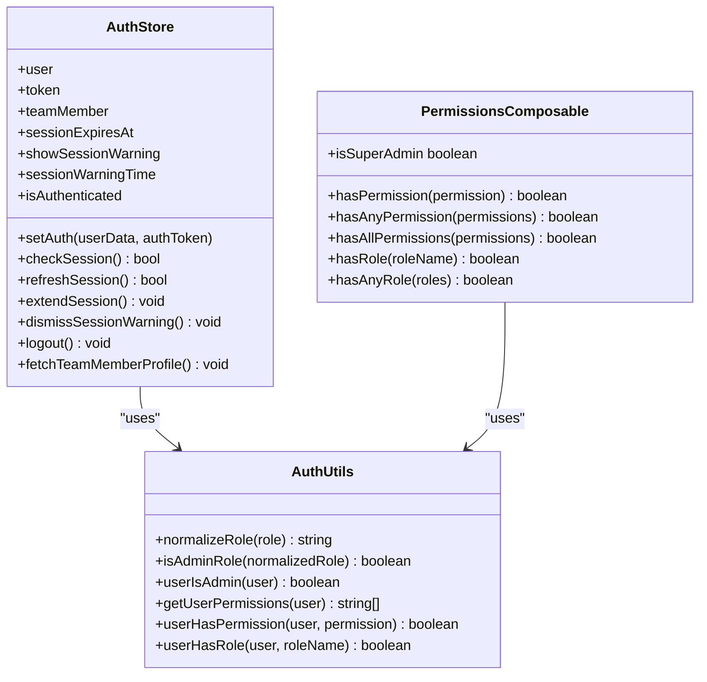
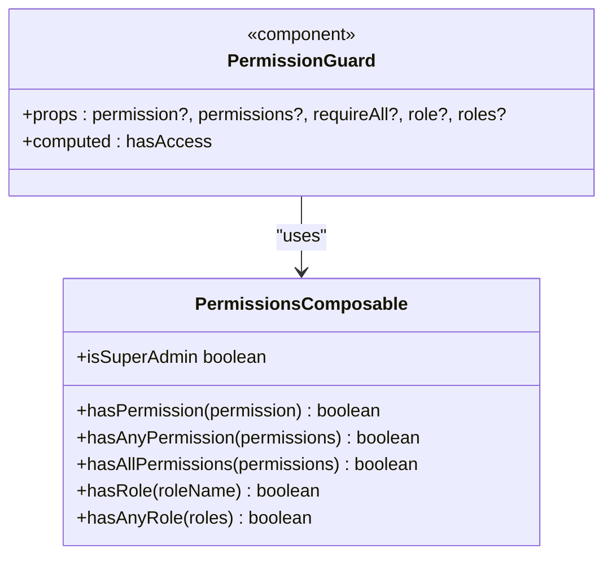
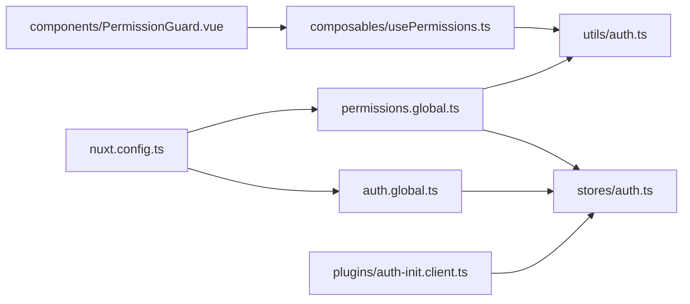

# Middleware & Route Guards

<cite>
**Referenced Files in This Document**
- [auth.global.ts](file://app/middleware/auth.global.ts)
- [permissions.global.ts](file://app/middleware/permissions.global.ts)
- [PermissionGuard.vue](file://app/components/PermissionGuard.vue)
- [usePermissions.ts](file://app/composables/usePermissions.ts)
- [auth.ts](file://app/utils/auth.ts)
- [auth.ts](file://app/stores/auth.ts)
- [auth-init.client.ts](file://app/plugins/auth-init.client.ts)
- [nuxt.config.ts](file://nuxt.config.ts)
- [login.vue](file://app/pages/login.vue)
- [unauthorized.vue](file://app/pages/unauthorized.vue)
</cite>

## Table of Contents
1. [Introduction](#introduction)
2. [Project Structure](#project-structure)
3. [Core Components](#core-components)
4. [Architecture Overview](#architecture-overview)
5. [Detailed Component Analysis](#detailed-component-analysis)
6. [Dependency Analysis](#dependency-analysis)
7. [Performance Considerations](#performance-considerations)
8. [Troubleshooting Guide](#troubleshooting-guide)
9. [Conclusion](#conclusion)
10. [Appendices](#appendices)

## Introduction
This document explains the middleware and route protection system used to secure routes, validate sessions, and enforce permissions. It covers:
- Global authentication middleware that validates tokens and redirects unauthenticated users
- Permission-based route guards that check user privileges before allowing access
- Middleware execution order, error handling strategies, and redirect logic
- Practical examples for creating custom middleware, implementing route-level permissions, and handling authentication failures gracefully
- Integration with Vue Router and Nuxt.js navigation lifecycle hooks

## Project Structure
The protection system is implemented using Nuxt 3 global route middleware, a Pinia store for auth state, utility functions for role/permission checks, a client plugin for initial session validation, and a reusable component for UI-level permission gating.

**Diagram sources**
- [auth.global.ts:1-32](file://app/middleware/auth.global.ts#L1-L32)
- [permissions.global.ts:1-59](file://app/middleware/permissions.global.ts#L1-L59)
- [auth.ts:1-230](file://app/stores/auth.ts#L1-L230)
- [auth.ts:1-58](file://app/utils/auth.ts#L1-L58)
- [usePermissions.ts:1-43](file://app/composables/usePermissions.ts#L1-L43)
- [PermissionGuard.vue:1-38](file://app/components/PermissionGuard.vue#L1-L38)
- [auth-init.client.ts:1-25](file://app/plugins/auth-init.client.ts#L1-L25)
- [login.vue:1-167](file://app/pages/login.vue#L1-L167)
- [unauthorized.vue:1-58](file://app/pages/unauthorized.vue#L1-L58)
- [nuxt.config.ts:1-46](file://nuxt.config.ts#L1-L46)

**Section sources**
- [auth.global.ts:1-32](file://app/middleware/auth.global.ts#L1-L32)
- [permissions.global.ts:1-59](file://app/middleware/permissions.global.ts#L1-L59)
- [auth.ts:1-230](file://app/stores/auth.ts#L1-L230)
- [auth.ts:1-58](file://app/utils/auth.ts#L1-L58)
- [usePermissions.ts:1-43](file://app/composables/usePermissions.ts#L1-L43)
- [PermissionGuard.vue:1-38](file://app/components/PermissionGuard.vue#L1-L38)
- [auth-init.client.ts:1-25](file://app/plugins/auth-init.client.ts#L1-L25)
- [nuxt.config.ts:1-46](file://nuxt.config.ts#L1-L46)

## Core Components
- Global Authentication Middleware: Validates token presence and session validity; allows public routes and payment pages; redirects to login when unauthenticated or session invalid.
- Global Permissions Middleware: Skips public routes; ensures user exists; grants admin/super-admin full access; enforces route-to-permission mappings; redirects to unauthorized page on missing permissions.
- Auth Store: Holds user, token, team member profile, and session expiry; provides methods to set auth, refresh/extend session, check session, and logout; starts periodic checks and warnings.
- Auth Utilities: Normalize roles, determine admin status, extract permissions, and perform permission/role checks.
- Permissions Composable: Exposes convenient helpers for permission and role checks used in components and pages.
- Permission Guard Component: Declarative UI guard that conditionally renders content based on permissions and roles.
- Auth Init Plugin: On app load, validates existing session and redirects if invalid; exposes an isCheckingAuth flag.
- Nuxt Config: Disables SSR for sensitive routes and configures router options.

**Section sources**
- [auth.global.ts:1-32](file://app/middleware/auth.global.ts#L1-L32)
- [permissions.global.ts:1-59](file://app/middleware/permissions.global.ts#L1-L59)
- [auth.ts:1-230](file://app/stores/auth.ts#L1-L230)
- [auth.ts:1-58](file://app/utils/auth.ts#L1-L58)
- [usePermissions.ts:1-43](file://app/composables/usePermissions.ts#L1-L43)
- [PermissionGuard.vue:1-38](file://app/components/PermissionGuard.vue#L1-L38)
- [auth-init.client.ts:1-25](file://app/plugins/auth-init.client.ts#L1-L25)
- [nuxt.config.ts:1-46](file://nuxt.config.ts#L1-L46)

## Architecture Overview
The system combines server-side configuration, client-side initialization, and two layers of runtime guards:
- Initialization layer: The auth init plugin verifies session at startup and sets up loading state.
- Navigation layer: Global middleware runs on every route change to enforce authentication and permissions.
- UI layer: Permission guard component controls visibility of UI elements based on current user’s roles and permissions.

**Diagram sources**
- [auth-init.client.ts:1-25](file://app/plugins/auth-init.client.ts#L1-L25)
- [auth.global.ts:1-32](file://app/middleware/auth.global.ts#L1-L32)
- [permissions.global.ts:1-59](file://app/middleware/permissions.global.ts#L1-L59)
- [auth.ts:1-230](file://app/stores/auth.ts#L1-L230)
- [login.vue:1-167](file://app/pages/login.vue#L1-L167)
- [unauthorized.vue:1-58](file://app/pages/unauthorized.vue#L1-L58)

## Detailed Component Analysis

### Global Authentication Middleware
Responsibilities:
- Allow public routes and payment pages without authentication
- Redirect unauthenticated users to login
- Validate active session on subsequent navigations by calling the session endpoint
- Use Nuxt’s navigateTo for redirection

Key behaviors:
- Public routes include login, forgot-password, unauthorized, and any path starting with /pay
- Session verification occurs only during navigation (not on initial load), delegating initial checks to the auth init plugin
- Logs diagnostic messages for unauthenticated and invalid session states

Redirect logic:
- Unauthenticated -> /login
- Invalid session -> /login

Error handling:
- Uses console logs for diagnostics
- Delegates logout and cleanup to the auth store when session is invalid

Integration points:
- Reads auth state from the Pinia store
- Uses Nuxt’s defineNuxtRouteMiddleware and navigateTo

**Section sources**
- [auth.global.ts:1-32](file://app/middleware/auth.global.ts#L1-L32)
- [auth.ts:1-230](file://app/stores/auth.ts#L1-L230)

#### Flowchart: Authentication Middleware Decision Logic

**Diagram sources**
- [auth.global.ts:1-32](file://app/middleware/auth.global.ts#L1-L32)
- [auth.ts:1-230](file://app/stores/auth.ts#L1-L230)

### Global Permissions Middleware
Responsibilities:
- Skip public routes and payment pages
- Ensure user exists (delegates authentication to auth middleware)
- Grant admin/super-admin unrestricted access
- Enforce route-to-permission mappings
- Redirect to unauthorized page when permission is missing

Route permission mapping:
- Centralized map of top-level routes to required permissions
- Supports prefix matching for nested routes under each key

Access control rules:
- Admin/Super Admin bypasses all permission checks
- Non-admin users must have the specific permission mapped to their route

Redirect logic:
- Missing permission -> /unauthorized

Integration points:
- Uses utilities for role/permission checks
- Uses the Pinia store for current user data
- Uses Nuxt’s navigateTo for redirection

**Section sources**
- [permissions.global.ts:1-59](file://app/middleware/permissions.global.ts#L1-L59)
- [auth.ts:1-58](file://app/utils/auth.ts#L1-L58)
- [auth.ts:1-230](file://app/stores/auth.ts#L1-L230)

#### Flowchart: Permissions Middleware Decision Logic

**Diagram sources**
- [permissions.global.ts:1-59](file://app/middleware/permissions.global.ts#L1-L59)
- [auth.ts:1-58](file://app/utils/auth.ts#L1-L58)

### Auth Store (Pinia)
Responsibilities:
- Maintain user, token, team member profile, and session expiry
- Provide methods to set auth, check/refresh session, extend session, and logout
- Start periodic session checks and warning timers
- Persist state across reloads via Pinia persistedstate

Key methods:
- setAuth: Stores credentials, sets expiry, fetches profile, starts timers
- checkSession: Validates session via backend, updates user and expiry, logs out on failure
- refreshSession/extendSession: Refresh and reset expiry
- startSessionCheck/startSessionWarningCheck: Periodic background tasks
- logout: Clears state and calls sign-out endpoint

Integration points:
- Uses runtime config for API base URL
- Integrates with Nuxt router for redirects after session expiration

**Section sources**
- [auth.ts:1-230](file://app/stores/auth.ts#L1-L230)
- [nuxt.config.ts:1-46](file://nuxt.config.ts#L1-L46)

#### Class Diagram: Auth Store and Related Types

**Diagram sources**
- [auth.ts:1-230](file://app/stores/auth.ts#L1-L230)
- [auth.ts:1-58](file://app/utils/auth.ts#L1-L58)
- [usePermissions.ts:1-43](file://app/composables/usePermissions.ts#L1-L43)

### Permissions Composable and Permission Guard Component
Responsibilities:
- Composable: Provides helper functions to check permissions and roles against the current user
- Component: Conditionally renders content based on props for single/multiple permissions and roles

Usage patterns:
- Single permission: require one specific permission
- Multiple permissions: require any or all permissions
- Role checks: require a specific role or any of multiple roles
- Super admin shortcut: always allowed

Integration points:
- Uses the permissions composable which delegates to auth utilities
- Works within Vue templates to gate UI sections

**Section sources**
- [usePermissions.ts:1-43](file://app/composables/usePermissions.ts#L1-L43)
- [PermissionGuard.vue:1-38](file://app/components/PermissionGuard.vue#L1-L38)
- [auth.ts:1-58](file://app/utils/auth.ts#L1-L58)

#### Class Diagram: Permission Guard Component

**Diagram sources**
- [PermissionGuard.vue:1-38](file://app/components/PermissionGuard.vue#L1-L38)
- [usePermissions.ts:1-43](file://app/composables/usePermissions.ts#L1-L43)

### Auth Init Plugin
Responsibilities:
- On app load, if a token exists, verify session via backend
- Redirect to login if session is invalid
- Expose an isCheckingAuth flag to indicate initial auth check completion

Integration points:
- Uses the auth store and Nuxt router
- Runs once per client boot

**Section sources**
- [auth-init.client.ts:1-25](file://app/plugins/auth-init.client.ts#L1-L25)
- [auth.ts:1-230](file://app/stores/auth.ts#L1-L230)

### Login and Unauthorized Pages
Responsibilities:
- Login: Collect credentials, call API, set auth, show toast, and navigate to dashboard
- Unauthorized: Inform user about lack of access and provide navigation actions

Integration points:
- Login uses the auth store to persist credentials and triggers session management
- Unauthorized is a target for permission denials

**Section sources**
- [login.vue:1-167](file://app/pages/login.vue#L1-L167)
- [unauthorized.vue:1-58](file://app/pages/unauthorized.vue#L1-L58)

## Dependency Analysis
High-level dependencies:
- Middleware depends on the auth store and Nuxt routing APIs
- Permissions middleware depends on auth utilities and the auth store
- Composable depends on auth utilities
- Component depends on the composable
- Plugin depends on the auth store and router
- Config influences SSR behavior and router options

**Diagram sources**
- [auth.global.ts:1-32](file://app/middleware/auth.global.ts#L1-L32)
- [permissions.global.ts:1-59](file://app/middleware/permissions.global.ts#L1-L59)
- [auth.ts:1-230](file://app/stores/auth.ts#L1-L230)
- [auth.ts:1-58](file://app/utils/auth.ts#L1-L58)
- [usePermissions.ts:1-43](file://app/composables/usePermissions.ts#L1-L43)
- [PermissionGuard.vue:1-38](file://app/components/PermissionGuard.vue#L1-L38)
- [auth-init.client.ts:1-25](file://app/plugins/auth-init.client.ts#L1-L25)
- [nuxt.config.ts:1-46](file://nuxt.config.ts#L1-L46)

**Section sources**
- [auth.global.ts:1-32](file://app/middleware/auth.global.ts#L1-L32)
- [permissions.global.ts:1-59](file://app/middleware/permissions.global.ts#L1-L59)
- [auth.ts:1-230](file://app/stores/auth.ts#L1-L230)
- [auth.ts:1-58](file://app/utils/auth.ts#L1-L58)
- [usePermissions.ts:1-43](file://app/composables/usePermissions.ts#L1-L43)
- [PermissionGuard.vue:1-38](file://app/components/PermissionGuard.vue#L1-L38)
- [auth-init.client.ts:1-25](file://app/plugins/auth-init.client.ts#L1-L25)
- [nuxt.config.ts:1-46](file://nuxt.config.ts#L1-L46)

## Performance Considerations
- Session checks are throttled:
  - Periodic check every 5 minutes
  - Warning timer runs every second but only affects UI near expiry
- Initial session validation happens once on app load
- Avoid redundant network calls by relying on store state and computed flags
- Keep route permission maps minimal and centralized to reduce overhead

[No sources needed since this section provides general guidance]

## Troubleshooting Guide
Common issues and resolutions:
- Redirect loop to login:
  - Ensure public routes list includes all non-protected paths
  - Confirm payment routes are excluded from auth checks
  - Verify initial session validation in the auth init plugin
- Unexpected unauthorized redirects:
  - Check route-to-permission mapping for the affected route
  - Confirm user role and permissions are correctly loaded from the backend
  - Validate admin/super-admin bypass logic
- Session expiring unexpectedly:
  - Inspect periodic session check interval and warning thresholds
  - Confirm backend session endpoint returns valid responses
  - Review logout flow triggered by invalid sessions

Operational tips:
- Use console logs provided by middleware and store to trace flows
- Temporarily widen public routes to isolate issues, then narrow back down
- Test both authenticated and unauthenticated scenarios across different devices

**Section sources**
- [auth.global.ts:1-32](file://app/middleware/auth.global.ts#L1-L32)
- [permissions.global.ts:1-59](file://app/middleware/permissions.global.ts#L1-L59)
- [auth.ts:1-230](file://app/stores/auth.ts#L1-L230)
- [auth-init.client.ts:1-25](file://app/plugins/auth-init.client.ts#L1-L25)

## Conclusion
The middleware and route protection system provides layered security:
- Initialization ensures a valid session at app start
- Global middleware enforces authentication and permissions on navigation
- UI guards allow fine-grained control over visible features
Together, they deliver a robust, maintainable approach to securing routes and resources while keeping the developer experience straightforward.

[No sources needed since this section summarizes without analyzing specific files]

## Appendices

### Middleware Execution Order
- Nuxt executes global middleware in file name order unless explicitly configured otherwise
- Recommended order:
  1) Authentication middleware (auth.global.ts)
  2) Permissions middleware (permissions.global.ts)
- Rationale: Authenticate first, then authorize

**Section sources**
- [auth.global.ts:1-32](file://app/middleware/auth.global.ts#L1-L32)
- [permissions.global.ts:1-59](file://app/middleware/permissions.global.ts#L1-L59)

### Creating Custom Middleware
Steps:
- Create a new file under app/middleware with a descriptive name
- Export a default function using defineNuxtRouteMiddleware
- Implement checks (e.g., feature flags, maintenance mode)
- Use navigateTo for redirections
- Place it before or after existing middleware depending on desired precedence

Example pattern:
- Define public routes or prefixes to skip
- Read state from stores or composables
- Return early to allow access or call navigateTo to redirect

**Section sources**
- [auth.global.ts:1-32](file://app/middleware/auth.global.ts#L1-L32)
- [permissions.global.ts:1-59](file://app/middleware/permissions.global.ts#L1-L59)

### Implementing Route-Level Permissions
Approaches:
- Centralized mapping in permissions middleware for top-level routes
- Extend mapping for nested routes by adding more entries
- For granular control, combine route-level guards with component-level PermissionGuard

Best practices:
- Keep permission names consistent and documented
- Group related permissions by domain
- Prefer coarse-grained route checks and fine-grained UI checks

**Section sources**
- [permissions.global.ts:1-59](file://app/middleware/permissions.global.ts#L1-L59)
- [PermissionGuard.vue:1-38](file://app/components/PermissionGuard.vue#L1-L38)

### Handling Authentication Failures Gracefully
Strategies:
- Clear user state and redirect to login on invalid session
- Show user-friendly messages where appropriate
- Prevent rendering protected UI until initial auth check completes
- Log actionable diagnostics for debugging

**Section sources**
- [auth.ts:1-230](file://app/stores/auth.ts#L1-L230)
- [auth-init.client.ts:1-25](file://app/plugins/auth-init.client.ts#L1-L25)
- [login.vue:1-167](file://app/pages/login.vue#L1-L167)
- [unauthorized.vue:1-58](file://app/pages/unauthorized.vue#L1-L58)

### Integrating with Vue Router and Nuxt Lifecycle Hooks
- Nuxt global middleware integrates with Vue Router through defineNuxtRouteMiddleware
- Use navigateTo for programmatic navigation within middleware
- Leverage the auth init plugin to run logic before the app becomes interactive
- Configure SSR behavior for sensitive routes via nuxt.config.ts

**Section sources**
- [auth.global.ts:1-32](file://app/middleware/auth.global.ts#L1-L32)
- [auth-init.client.ts:1-25](file://app/plugins/auth-init.client.ts#L1-L25)
- [nuxt.config.ts:1-46](file://nuxt.config.ts#L1-L46)