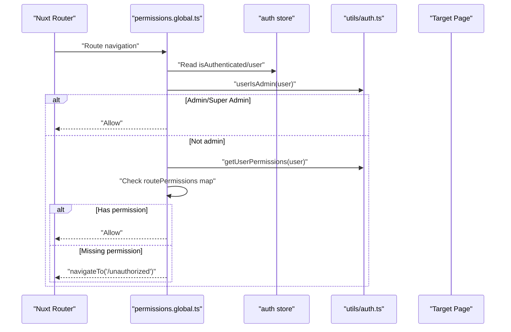
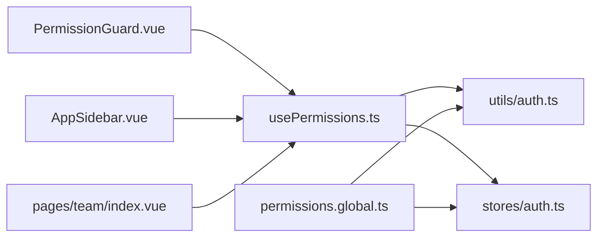

# Permission System

<cite>
**Referenced Files in This Document**
- [usePermissions.ts](file://app/composables/usePermissions.ts)
- [PermissionGuard.vue](file://app/components/PermissionGuard.vue)
- [permissions.global.ts](file://app/middleware/permissions.global.ts)
- [auth.ts](file://app/utils/auth.ts)
- [auth.ts (store)](file://app/stores/auth.ts)
- [auth.ts (types)](file://app/types/auth.ts)
- [AppSidebar.vue](file://app/components/AppSidebar.vue)
- [team/index.vue](file://app/pages/team/index.vue)
- [unauthorized.vue](file://app/pages/unauthorized.vue)
</cite>

## Table of Contents
1. [Introduction](#introduction)
2. [Project Structure](#project-structure)
3. [Core Components](#core-components)
4. [Architecture Overview](#architecture-overview)
5. [Detailed Component Analysis](#detailed-component-analysis)
6. [Dependency Analysis](#dependency-analysis)
7. [Performance Considerations](#performance-considerations)
8. [Troubleshooting Guide](#troubleshooting-guide)
9. [Conclusion](#conclusion)
10. [Appendices](#appendices)

## Introduction
This document explains the permission checking system used across the application. It covers:
- The usePermissions composable for client-side checks
- The PermissionGuard component for declarative UI gating
- The global permissions middleware for route-level protection
- How to implement custom permission checks, build permission-based UI elements, and render conditionally based on user permissions
- Examples of granular permission definitions, composition patterns, and best practices for consistent authorization logic

## Project Structure
The permission system is implemented with a clear separation of concerns:
- Composable layer: usePermissions provides convenient methods for components
- Utility layer: auth utilities implement core checks against the current user
- Store layer: auth store holds the authenticated user and their permissions
- Middleware layer: global route guard enforces access at navigation time
- UI layer: PermissionGuard wraps content; sidebar filters menu items by permission

```mermaid
graph TB
subgraph "UI Layer"
PG["PermissionGuard.vue"]
Sidebar["AppSidebar.vue"]
TeamPage["pages/team/index.vue"]
end
subgraph "Composable Layer"
UP["composables/usePermissions.ts"]
end
subgraph "Utility Layer"
AuthUtils["utils/auth.ts"]
end
subgraph "Store Layer"
AuthStore["stores/auth.ts"]
end
subgraph "Middleware Layer"
PermMW["middleware/permissions.global.ts"]
end
subgraph "Types"
Types["types/auth.ts"]
end
PG --> UP
Sidebar --> UP
TeamPage --> UP
UP --> AuthUtils
UP --> AuthStore
PermMW --> AuthUtils
PermMW --> AuthStore
AuthStore --> Types
```

**Diagram sources**
- [PermissionGuard.vue:1-38](file://app/components/PermissionGuard.vue#L1-L38)
- [usePermissions.ts:1-43](file://app/composables/usePermissions.ts#L1-L43)
- [auth.ts:1-58](file://app/utils/auth.ts#L1-L58)
- [auth.ts (store):1-230](file://app/stores/auth.ts#L1-L230)
- [permissions.global.ts:1-59](file://app/middleware/permissions.global.ts#L1-L59)
- [auth.ts (types):1-64](file://app/types/auth.ts#L1-L64)
- [AppSidebar.vue:1-319](file://app/components/AppSidebar.vue#L1-L319)
- [team/index.vue:1-605](file://app/pages/team/index.vue#L1-L605)

**Section sources**
- [usePermissions.ts:1-43](file://app/composables/usePermissions.ts#L1-L43)
- [PermissionGuard.vue:1-38](file://app/components/PermissionGuard.vue#L1-L38)
- [permissions.global.ts:1-59](file://app/middleware/permissions.global.ts#L1-L59)
- [auth.ts:1-58](file://app/utils/auth.ts#L1-L58)
- [auth.ts (store):1-230](file://app/stores/auth.ts#L1-L230)
- [auth.ts (types):1-64](file://app/types/auth.ts#L1-L64)
- [AppSidebar.vue:1-319](file://app/components/AppSidebar.vue#L1-L319)
- [team/index.vue:1-605](file://app/pages/team/index.vue#L1-L605)

## Core Components
- usePermissions composable: Provides hasPermission, hasAnyPermission, hasAllPermissions, hasRole, hasAnyRole, and isSuperAdmin helpers that wrap utility functions and read from the auth store.
- PermissionGuard component: A declarative wrapper that renders its slot only if the current user satisfies role or permission requirements.
- Global permissions middleware: Enforces route-level access by mapping routes to required permissions and redirecting unauthorized users.

Key responsibilities:
- Centralize permission evaluation logic in utils/auth.ts
- Expose simple APIs via composables for UI code
- Provide a reusable component for conditional rendering
- Protect routes globally while allowing public endpoints

**Section sources**
- [usePermissions.ts:1-43](file://app/composables/usePermissions.ts#L1-L43)
- [PermissionGuard.vue:1-38](file://app/components/PermissionGuard.vue#L1-L38)
- [permissions.global.ts:1-59](file://app/middleware/permissions.global.ts#L1-L59)
- [auth.ts:1-58](file://app/utils/auth.ts#L1-L58)

## Architecture Overview
The system follows a layered approach:
- Data source: Auth store loads and persists the user profile including roles and permissions
- Utilities: Normalize roles and evaluate permissions/roles
- Composables: Offer typed, ergonomic APIs for Vue components
- Middleware: Guard routes before rendering pages
- UI: PermissionGuard and computed menus hide restricted features



**Diagram sources**
- [permissions.global.ts:1-59](file://app/middleware/permissions.global.ts#L1-L59)
- [auth.ts (store):1-230](file://app/stores/auth.ts#L1-L230)
- [auth.ts:1-58](file://app/utils/auth.ts#L1-L58)

## Detailed Component Analysis

### usePermissions Composable
Purpose:
- Provide a single entry point for permission and role checks within components
- Abstract away direct store and utility usage

Exposed API:
- hasPermission(permission): boolean
- hasAnyPermission(permissions[]): boolean
- hasAllPermissions(permissions[]): boolean
- hasRole(roleName): boolean
- hasAnyRole(roles[]): boolean
- isSuperAdmin: boolean (computed)

Implementation highlights:
- Delegates to utils/auth.ts functions
- Reads current user from the auth store
- Uses computed for isSuperAdmin to reactively update when user changes

Usage examples:
- Filtering navigation links by permission
- Conditional rendering of buttons and sections
- Guarding business logic inside page handlers

Best practices:
- Prefer hasAnyPermission/hasAllPermissions for multi-permission gates
- Use hasRole for coarse-grained role checks
- Keep permission strings consistent and domain-scoped (e.g., customers.view)

**Section sources**
- [usePermissions.ts:1-43](file://app/composables/usePermissions.ts#L1-L43)
- [auth.ts:1-58](file://app/utils/auth.ts#L1-L58)
- [auth.ts (store):1-230](file://app/stores/auth.ts#L1-L230)

### PermissionGuard Component
Purpose:
- Declaratively gate UI blocks based on roles and/or permissions
- Support both “any” and “all” permission modes

Props:
- permission?: string
- permissions?: string[]
- requireAll?: boolean
- role?: string
- roles?: string[]

Behavior:
- Super admins always have access
- Role checks are evaluated first (single or multiple)
- Permission checks follow, supporting any/all semantics
- Renders children only when access is granted

Common patterns:
- Wrap action buttons: <PermissionGuard permission="customers.edit">...</PermissionGuard>
- Require multiple permissions: <PermissionGuard :permissions="['customers.edit','customers.delete']" requireAll>...</PermissionGuard>
- Role-based visibility: <PermissionGuard role="admin">...</PermissionGuard>

**Section sources**
- [PermissionGuard.vue:1-38](file://app/components/PermissionGuard.vue#L1-L38)
- [usePermissions.ts:1-43](file://app/composables/usePermissions.ts#L1-L43)

### Global Permissions Middleware
Purpose:
- Enforce route-level authorization before rendering pages
- Redirect unauthorized users to an error page

Flow:
- Skip public routes (/login, /forgot-password, /unauthorized, /pay*)
- If not authenticated, defer to authentication middleware
- Allow admin/super admin through
- Map route prefixes to required permissions
- Deny and redirect if missing required permission

Route-to-permission mapping example:
- /customers -> customers.view
- /drivers, /trucks -> drivers.view
- /pickups -> pickups.view
- /tracking -> tracking.view
- /billing -> billing.view
- /shop -> shop.view
- /inventory -> inventory.view
- /support -> support.view
- /team -> team.view
- /reports -> reports.view
- /management -> management.view
- /comms -> communications.send

Unauthorized handling:
- Redirects to /unauthorized

**Section sources**
- [permissions.global.ts:1-59](file://app/middleware/permissions.global.ts#L1-L59)
- [unauthorized.vue:1-58](file://app/pages/unauthorized.vue#L1-L58)

### Auth Utilities (Core Logic)
Responsibilities:
- Normalize roles for comparison (case-insensitive, underscore normalization)
- Determine admin status
- Extract permissions array
- Evaluate permission and role membership

Key functions:
- normalizeRole(role): string
- isAdminRole(normalizedRole): boolean
- userIsAdmin(user): boolean
- getUserPermissions(user): string[]
- userHasPermission(user, permission): boolean
- userHasRole(user, roleName): boolean

Design notes:
- Admins implicitly have all permissions
- Role comparisons are normalized to avoid casing/underscore mismatches

**Section sources**
- [auth.ts:1-58](file://app/utils/auth.ts#L1-L58)

### Auth Store (User State)
Responsibilities:
- Maintain user, token, session state
- Fetch and merge role and permissions into the user object
- Periodically refresh session and warn about expiry

Relevant behavior for permissions:
- After login or session refresh, fetches team member profile and merges role and permissions into the user object
- Provides isAuthenticated and user getters used by composable and middleware

**Section sources**
- [auth.ts (store):1-230](file://app/stores/auth.ts#L1-L230)
- [auth.ts (types):1-64](file://app/types/auth.ts#L1-L64)

### Practical Usage Patterns

#### Sidebar Menu Filtering
- Builds navigation arrays with optional permission requirements
- Filters out entries where the user lacks the required permission
- Demonstrates using hasPermission and computed lists

**Section sources**
- [AppSidebar.vue:1-319](file://app/components/AppSidebar.vue#L1-L319)

#### Page-Level Authorization Helpers
- Example page defines helper functions to check admin privileges and perform operation-level authorization
- Shows combining isSuperAdmin and hasPermission for fine-grained control
- Integrates with toast notifications for user feedback

**Section sources**
- [team/index.vue:1-605](file://app/pages/team/index.vue#L1-L605)

## Dependency Analysis
High-level dependencies:
- usePermissions depends on utils/auth and stores/auth
- PermissionGuard depends on usePermissions
- permissions.global middleware depends on utils/auth and stores/auth
- Pages and components depend on usePermissions and/or PermissionGuard



**Diagram sources**
- [usePermissions.ts:1-43](file://app/composables/usePermissions.ts#L1-L43)
- [PermissionGuard.vue:1-38](file://app/components/PermissionGuard.vue#L1-L38)
- [permissions.global.ts:1-59](file://app/middleware/permissions.global.ts#L1-L59)
- [auth.ts:1-58](file://app/utils/auth.ts#L1-L58)
- [auth.ts (store):1-230](file://app/stores/auth.ts#L1-L230)
- [AppSidebar.vue:1-319](file://app/components/AppSidebar.vue#L1-L319)
- [team/index.vue:1-605](file://app/pages/team/index.vue#L1-L605)

**Section sources**
- [usePermissions.ts:1-43](file://app/composables/usePermissions.ts#L1-L43)
- [PermissionGuard.vue:1-38](file://app/components/PermissionGuard.vue#L1-L38)
- [permissions.global.ts:1-59](file://app/middleware/permissions.global.ts#L1-L59)
- [auth.ts:1-58](file://app/utils/auth.ts#L1-L58)
- [auth.ts (store):1-230](file://app/stores/auth.ts#L1-L230)
- [AppSidebar.vue:1-319](file://app/components/AppSidebar.vue#L1-L319)
- [team/index.vue:1-605](file://app/pages/team/index.vue#L1-L605)

## Performance Considerations
- Computed properties: isSuperAdmin is reactive and avoids repeated computations
- Middleware efficiency: Route permission map lookup is O(n) over configured routes; keep mappings concise and grouped by prefix
- Avoid redundant checks: Prefer hasAnyPermission/hasAllPermissions to reduce branching in templates
- Session refresh intervals: Ensure background checks do not trigger excessive re-renders; leverage store’s computed flags judiciously

[No sources needed since this section provides general guidance]

## Troubleshooting Guide
Common issues and resolutions:
- User redirected to unauthorized despite having permissions
  - Verify the route is mapped in the middleware’s permission table
  - Confirm the user’s permissions list includes the exact permission string
  - Check that the auth store successfully merged role and permissions after login/session refresh
- UI elements still visible without permissions
  - Ensure you wrapped them with PermissionGuard or used hasPermission in computed filters
  - For dynamic menus, confirm filtering uses the same permission strings as the middleware
- Role checks failing unexpectedly
  - Remember roles are normalized (lowercased, underscores replaced with spaces); pass role names consistently
- Admin bypass not working
  - Ensure userIsAdmin sees the correct role shape (string or object) and that the role name matches admin/super admin

Operational tips:
- Log permission checks during development to verify expected outcomes
- Keep permission strings centralized and documented per feature area
- Align frontend permission strings with backend expectations

**Section sources**
- [permissions.global.ts:1-59](file://app/middleware/permissions.global.ts#L1-L59)
- [auth.ts (store):1-230](file://app/stores/auth.ts#L1-L230)
- [auth.ts:1-58](file://app/utils/auth.ts#L1-L58)
- [PermissionGuard.vue:1-38](file://app/components/PermissionGuard.vue#L1-L38)

## Conclusion
The permission system combines a robust utility layer, a reactive composable, a reusable guard component, and a global middleware to provide consistent authorization across the application. By centralizing permission logic, standardizing permission naming, and using both route guards and UI guards, the system ensures secure and predictable access control. Following the recommended patterns and best practices will help maintain clarity and consistency as the application grows.

[No sources needed since this section summarizes without analyzing specific files]

## Appendices

### Implementing Custom Permission Checks
- Add new permission strings to your feature modules (e.g., invoices.create)
- Update the middleware route map to protect relevant routes
- In components, use hasPermission or PermissionGuard to gate UI
- For complex conditions, combine hasAnyPermission and hasAllPermissions

### Creating Permission-Based UI Elements
- Button gating:
  - Use PermissionGuard around action buttons
  - Or compute disabled states via hasPermission
- Section visibility:
  - Wrap entire sections with PermissionGuard
  - Filter lists and menus using hasPermission in computed arrays

### Handling Conditional Rendering Based on Permissions
- Use v-if/v-show with computed results from usePermissions
- Prefer computed arrays to filter collections (e.g., sidebar links)
- Combine role and permission checks for nuanced views

### Granular Permission Definitions
- Use dot-notation scoped permissions: resource.action (e.g., customers.view, customers.edit)
- Group related permissions under a common namespace
- Document permissions per feature area and align with backend capabilities

### Permission Composition Patterns
- Any-of pattern: hasAnyPermission(['edit', 'approve'])
- All-of pattern: hasAllPermissions(['edit', 'delete'])
- Role-first shortcuts: isSuperAdmin or hasRole('admin') for broad access

### Best Practices
- Single source of truth: Always derive permissions from the auth store
- Consistent naming: Use lowercase, dot-separated permission identifiers
- Centralized maps: Keep route-to-permission mappings in one place
- Defensive checks: Validate user presence before checks
- Clear UX: Show friendly messages when access is denied

[No sources needed since this section provides general guidance]