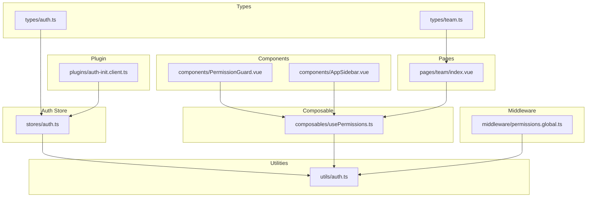
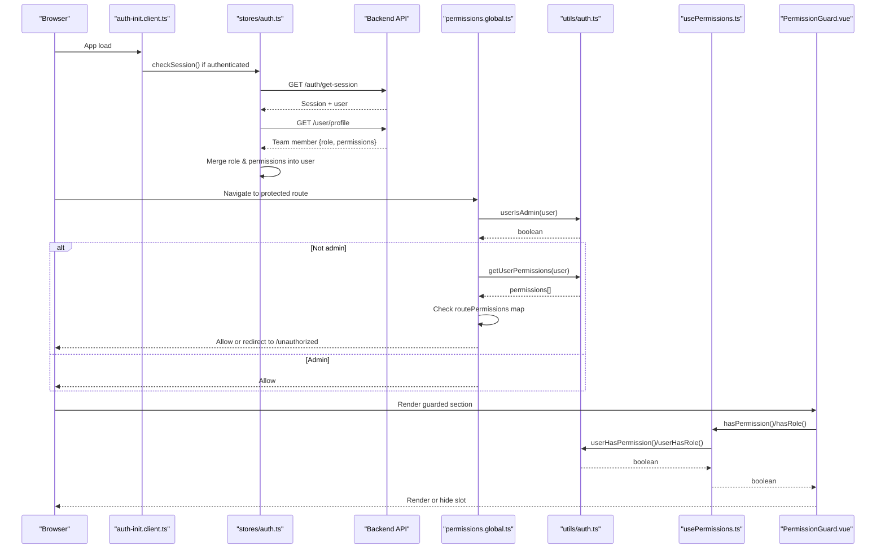
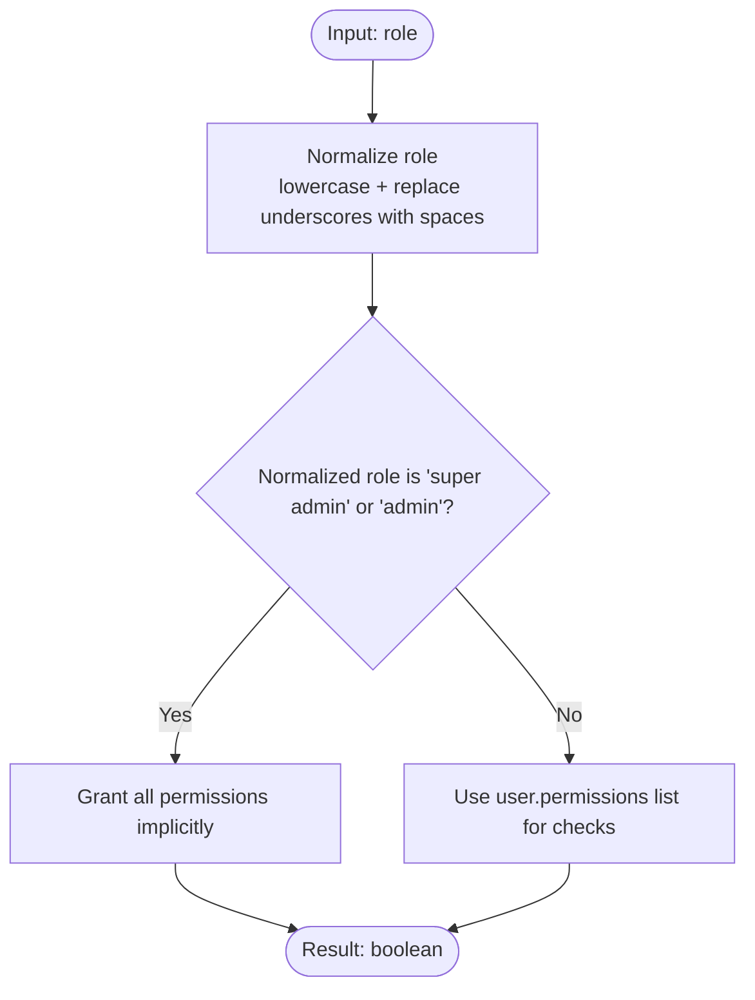
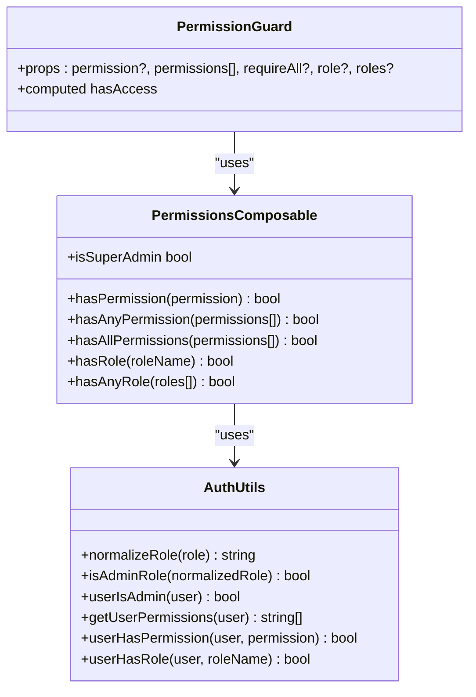
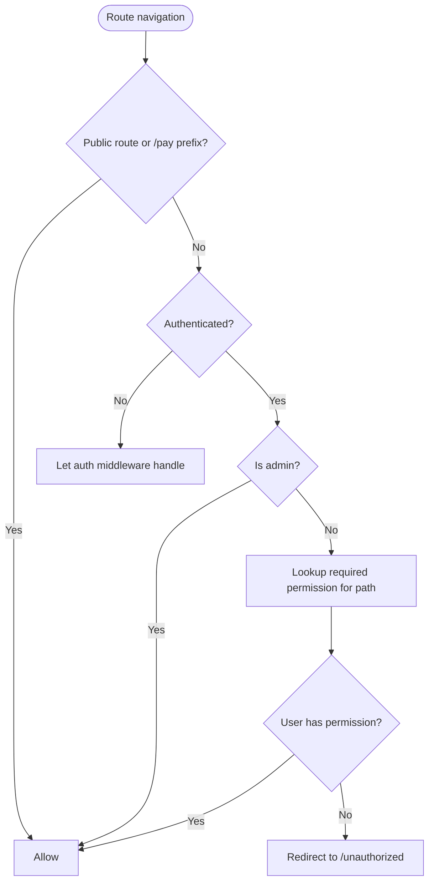
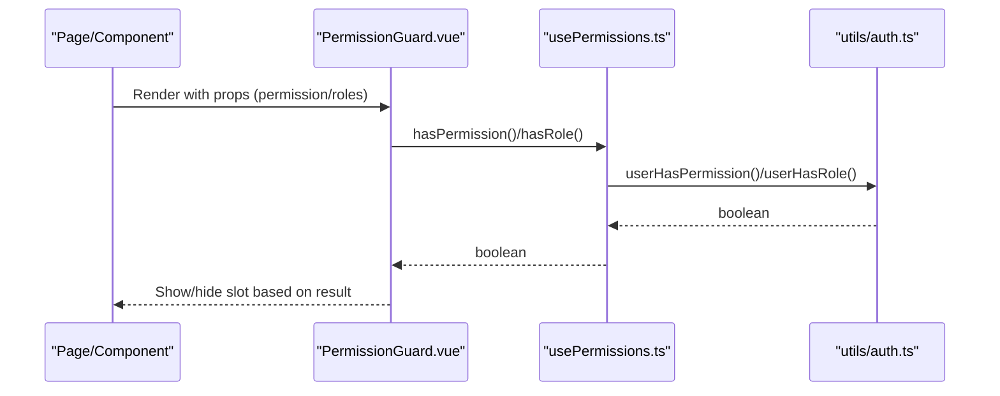
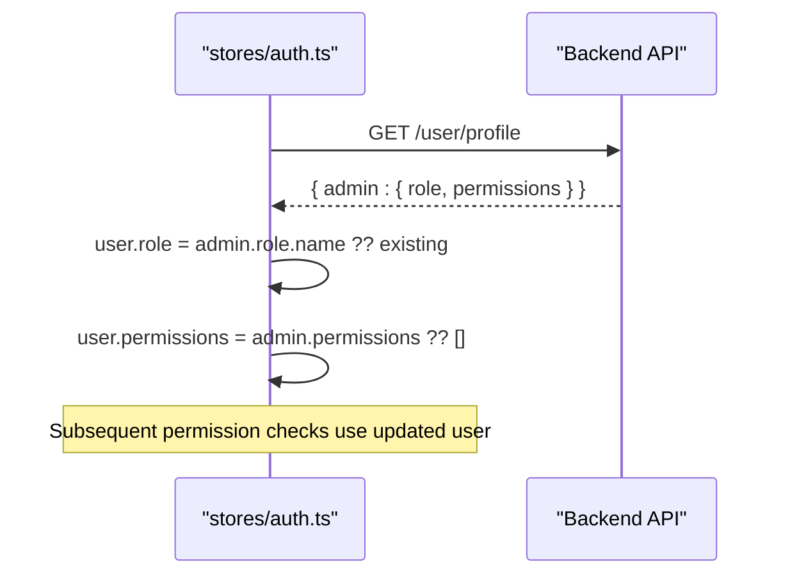
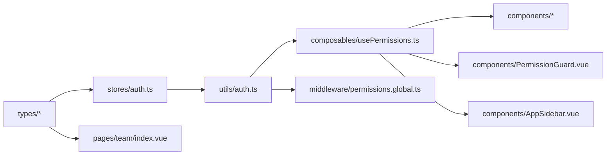

# Permission System

<cite>
**Referenced Files in This Document**
- [auth.ts](file://app/utils/auth.ts)
- [usePermissions.ts](file://app/composables/usePermissions.ts)
- [permissions.global.ts](file://app/middleware/permissions.global.ts)
- [PermissionGuard.vue](file://app/components/PermissionGuard.vue)
- [auth.ts](file://app/stores/auth.ts)
- [auth.ts](file://app/types/auth.ts)
- [team.ts](file://app/types/team.ts)
- [AppSidebar.vue](file://app/components/AppSidebar.vue)
- [index.vue](file://app/pages/team/index.vue)
- [auth-init.client.ts](file://app/plugins/auth-init.client.ts)
</cite>

## Table of Contents
1. [Introduction](#introduction)
2. [Project Structure](#project-structure)
3. [Core Components](#core-components)
4. [Architecture Overview](#architecture-overview)
5. [Detailed Component Analysis](#detailed-component-analysis)
6. [Dependency Analysis](#dependency-analysis)
7. [Performance Considerations](#performance-considerations)
8. [Troubleshooting Guide](#troubleshooting-guide)
9. [Conclusion](#conclusion)
10. [Appendices](#appendices)

## Introduction
This document explains the role-based access control (RBAC) system implemented in the application. It covers:
- Permission checking mechanisms and admin privilege escalation with implicit permission inheritance
- Flexible role normalization supporting multiple formats
- How permissions are merged from team member profiles and validated across routes, components, and API calls
- Practical examples for implementing custom permission checks, creating new roles, and extending the permission hierarchy
- Integration patterns with components, routes, and API calls
- Security considerations and best practices to maintain consistent access control

## Project Structure
The RBAC system is implemented using a small set of focused modules:
- Types define user, role, and team member models
- Auth utilities implement normalization, admin checks, and permission helpers
- A composable exposes convenient permission APIs to components
- Global middleware enforces route-level permissions
- A reusable component guards UI sections by permission or role
- The auth store merges backend team profile data into the current user session

**Diagram sources**
- [auth.ts:1-64](file://app/types/auth.ts#L1-L64)
- [team.ts:1-65](file://app/types/team.ts#L1-L65)
- [auth.ts:1-230](file://app/stores/auth.ts#L1-L230)
- [auth.ts:1-58](file://app/utils/auth.ts#L1-L58)
- [usePermissions.ts:1-43](file://app/composables/usePermissions.ts#L1-L43)
- [permissions.global.ts:1-59](file://app/middleware/permissions.global.ts#L1-L59)
- [PermissionGuard.vue:1-38](file://app/components/PermissionGuard.vue#L1-L38)
- [AppSidebar.vue:1-319](file://app/components/AppSidebar.vue#L1-L319)
- [index.vue:1-200](file://app/pages/team/index.vue#L1-L200)
- [auth-init.client.ts:1-25](file://app/plugins/auth-init.client.ts#L1-L25)

**Section sources**
- [auth.ts:1-64](file://app/types/auth.ts#L1-L64)
- [team.ts:1-65](file://app/types/team.ts#L1-L65)
- [auth.ts:1-230](file://app/stores/auth.ts#L1-L230)
- [auth.ts:1-58](file://app/utils/auth.ts#L1-L58)
- [usePermissions.ts:1-43](file://app/composables/usePermissions.ts#L1-L43)
- [permissions.global.ts:1-59](file://app/middleware/permissions.global.ts#L1-L59)
- [PermissionGuard.vue:1-38](file://app/components/PermissionGuard.vue#L1-L38)
- [AppSidebar.vue:1-319](file://app/components/AppSidebar.vue#L1-L319)
- [index.vue:1-200](file://app/pages/team/index.vue#L1-L200)
- [auth-init.client.ts:1-25](file://app/plugins/auth-init.client.ts#L1-L25)

## Core Components
- Role and permission types:
  - User can have a role as either a string or an object with a name field; permissions are stored as a list of strings on the user object after profile merge.
  - Team member profile includes role and permissions that are merged into the active user session.
- Auth utilities:
  - Normalize roles to lowercase with underscores replaced by spaces for flexible matching.
  - Admin roles include super admin and admin; admins implicitly have all permissions.
  - Permission checks return true for admins or when the user’s permissions include the requested permission.
- Composable:
  - Provides hasPermission, hasAnyPermission, hasAllPermissions, hasRole, hasAnyRole, and isSuperAdmin helpers for components.
- Middleware:
  - Enforces route-level permissions based on a mapping of paths to required permissions.
  - Skips public routes and payment pages; redirects unauthorized users to /unauthorized.
- Permission guard component:
  - Conditionally renders content based on role(s) and/or permission(s), with support for “any” vs “all” logic.
- Auth store:
  - After authentication, fetches the team member profile and merges role and permissions into the current user.
  - Periodically refreshes session and re-fetches profile to keep permissions up to date.

**Section sources**
- [auth.ts:1-64](file://app/types/auth.ts#L1-L64)
- [auth.ts:1-58](file://app/utils/auth.ts#L1-L58)
- [usePermissions.ts:1-43](file://app/composables/usePermissions.ts#L1-L43)
- [permissions.global.ts:1-59](file://app/middleware/permissions.global.ts#L1-L59)
- [PermissionGuard.vue:1-38](file://app/components/PermissionGuard.vue#L1-L38)
- [auth.ts:1-230](file://app/stores/auth.ts#L1-L230)

## Architecture Overview
The permission system integrates at three layers:
- Data layer: Auth store merges team profile role and permissions into the user session.
- Policy layer: Auth utilities implement normalization, admin checks, and permission evaluation.
- Enforcement layer: Route middleware enforces path-based permissions; components use the composable and guard to render conditionally.

**Diagram sources**
- [auth-init.client.ts:1-25](file://app/plugins/auth-init.client.ts#L1-L25)
- [auth.ts:1-230](file://app/stores/auth.ts#L1-L230)
- [permissions.global.ts:1-59](file://app/middleware/permissions.global.ts#L1-L59)
- [auth.ts:1-58](file://app/utils/auth.ts#L1-L58)
- [usePermissions.ts:1-43](file://app/composables/usePermissions.ts#L1-L43)
- [PermissionGuard.vue:1-38](file://app/components/PermissionGuard.vue#L1-L38)

## Detailed Component Analysis

### Role Normalization and Admin Escalation
- Role normalization:
  - Accepts string or object with name; converts to lowercase and replaces underscores with spaces for flexible matching.
- Admin escalation:
  - Super admin and admin roles are recognized; admins bypass explicit permission checks and are granted all permissions implicitly.
- Role comparison:
  - Case-insensitive and underscore-tolerant comparisons ensure robust matching across different input formats.

**Diagram sources**
- [auth.ts:1-58](file://app/utils/auth.ts#L1-L58)

**Section sources**
- [auth.ts:1-58](file://app/utils/auth.ts#L1-L58)

### Permission Checking Mechanisms
- Single permission check:
  - Returns true for admins; otherwise checks inclusion in user.permissions.
- Any/all checks:
  - Composable provides hasAnyPermission and hasAllPermissions for arrays of permissions.
- Role checks:
  - hasRole and hasAnyRole support flexible role names via normalization.

**Diagram sources**
- [auth.ts:1-58](file://app/utils/auth.ts#L1-L58)
- [usePermissions.ts:1-43](file://app/composables/usePermissions.ts#L1-L43)
- [PermissionGuard.vue:1-38](file://app/components/PermissionGuard.vue#L1-L38)

**Section sources**
- [usePermissions.ts:1-43](file://app/composables/usePermissions.ts#L1-L43)
- [PermissionGuard.vue:1-38](file://app/components/PermissionGuard.vue#L1-L38)
- [auth.ts:1-58](file://app/utils/auth.ts#L1-L58)

### Route-Level Permission Enforcement
- Public routes and payment pages are skipped.
- Admins bypass explicit checks.
- Route-to-permission mapping controls access; missing permissions redirect to /unauthorized.

**Diagram sources**
- [permissions.global.ts:1-59](file://app/middleware/permissions.global.ts#L1-L59)

**Section sources**
- [permissions.global.ts:1-59](file://app/middleware/permissions.global.ts#L1-L59)

### UI-Level Permission Guards
- The guard component supports:
  - Single permission prop
  - Array of permissions with any/all semantics
  - Single or multiple roles
  - Super admin shortcut
- Sidebar uses the composable to filter visible links based on permissions.

**Diagram sources**
- [PermissionGuard.vue:1-38](file://app/components/PermissionGuard.vue#L1-L38)
- [usePermissions.ts:1-43](file://app/composables/usePermissions.ts#L1-L43)
- [auth.ts:1-58](file://app/utils/auth.ts#L1-L58)
- [AppSidebar.vue:1-319](file://app/components/AppSidebar.vue#L1-L319)

**Section sources**
- [PermissionGuard.vue:1-38](file://app/components/PermissionGuard.vue#L1-L38)
- [AppSidebar.vue:1-319](file://app/components/AppSidebar.vue#L1-L319)

### Profile Merge and Session Refresh
- On login or session refresh, the store fetches the team member profile and merges role and permissions into the user object.
- Periodic checks refresh session and re-fetch profile to keep permissions current.

**Diagram sources**
- [auth.ts:1-230](file://app/stores/auth.ts#L1-L230)

**Section sources**
- [auth.ts:1-230](file://app/stores/auth.ts#L1-L230)

### Practical Examples

#### Implementing Custom Permission Checks
- In components or pages:
  - Use the composable to check single or multiple permissions and roles.
  - Example references:
    - Filtering sidebar items by permission
    - Conditional rendering in team management pages

**Section sources**
- [AppSidebar.vue:1-319](file://app/components/AppSidebar.vue#L1-L319)
- [index.vue:1-200](file://app/pages/team/index.vue#L1-L200)

#### Creating New Roles
- Create role payload includes name, displayName, description, and permissionIds.
- Backend expects internal name (lowercase with underscores) and display name for UI.
- Example reference:
  - Transforming role name and sending POST request to create role

**Section sources**
- [team.ts:1-65](file://app/types/team.ts#L1-L65)
- [index.vue:1-200](file://app/pages/team/index.vue#L1-L200)

#### Extending the Permission Hierarchy
- Add new routes to the route-to-permission mapping in middleware.
- Introduce new permission strings and assign them to roles via the backend.
- Update UI filters and guards to use the new permissions.

**Section sources**
- [permissions.global.ts:1-59](file://app/middleware/permissions.global.ts#L1-L59)
- [AppSidebar.vue:1-319](file://app/components/AppSidebar.vue#L1-L319)
- [PermissionGuard.vue:1-38](file://app/components/PermissionGuard.vue#L1-L38)

## Dependency Analysis
The permission system exhibits low coupling and clear separation of concerns:
- Types are consumed by the store and pages
- Utilities provide pure functions used by the composable, middleware, and components
- The composable wraps utilities for ergonomic usage in Vue components
- Middleware depends only on utilities and the auth store
- Components depend on the composable and optionally the guard wrapper

**Diagram sources**
- [auth.ts:1-64](file://app/types/auth.ts#L1-L64)
- [team.ts:1-65](file://app/types/team.ts#L1-L65)
- [auth.ts:1-230](file://app/stores/auth.ts#L1-L230)
- [auth.ts:1-58](file://app/utils/auth.ts#L1-L58)
- [usePermissions.ts:1-43](file://app/composables/usePermissions.ts#L1-L43)
- [permissions.global.ts:1-59](file://app/middleware/permissions.global.ts#L1-L59)
- [PermissionGuard.vue:1-38](file://app/components/PermissionGuard.vue#L1-L38)
- [AppSidebar.vue:1-319](file://app/components/AppSidebar.vue#L1-L319)
- [index.vue:1-200](file://app/pages/team/index.vue#L1-L200)

**Section sources**
- [auth.ts:1-64](file://app/types/auth.ts#L1-L64)
- [team.ts:1-65](file://app/types/team.ts#L1-L65)
- [auth.ts:1-230](file://app/stores/auth.ts#L1-L230)
- [auth.ts:1-58](file://app/utils/auth.ts#L1-L58)
- [usePermissions.ts:1-43](file://app/composables/usePermissions.ts#L1-L43)
- [permissions.global.ts:1-59](file://app/middleware/permissions.global.ts#L1-L59)
- [PermissionGuard.vue:1-38](file://app/components/PermissionGuard.vue#L1-L38)
- [AppSidebar.vue:1-319](file://app/components/AppSidebar.vue#L1-L319)
- [index.vue:1-200](file://app/pages/team/index.vue#L1-L200)

## Performance Considerations
- Keep permission checks lightweight:
  - The current implementation performs simple array lookups and string comparisons, which are efficient.
- Avoid redundant checks:
  - Cache computed results where appropriate (e.g., computed properties in components).
- Minimize network calls:
  - Rely on periodic session checks and profile refreshes rather than frequent re-fetches.
- Centralize mappings:
  - Maintain a single source of truth for route-to-permission mappings to reduce duplication and improve readability.

[No sources needed since this section provides general guidance]

## Troubleshooting Guide
Common issues and resolutions:
- Missing permissions after login:
  - Ensure the team profile endpoint returns role and permissions and that the store merges them into the user object.
- Unexpected access denied:
  - Verify the route-to-permission mapping includes the target path and that the user’s permissions include the required permission.
- Role mismatches due to formatting:
  - Confirm role names are normalized consistently; the system handles case and underscores automatically.
- UI not updating after role change:
  - Trigger a session refresh to reload the profile and update permissions.

**Section sources**
- [auth.ts:1-230](file://app/stores/auth.ts#L1-L230)
- [permissions.global.ts:1-59](file://app/middleware/permissions.global.ts#L1-L59)
- [auth.ts:1-58](file://app/utils/auth.ts#L1-L58)

## Conclusion
The RBAC system combines flexible role normalization, implicit admin privileges, and layered enforcement across routes and UI components. By merging team profile data into the user session and centralizing permission checks, it ensures consistent and secure access control throughout the application. Following the integration patterns and best practices outlined here will help maintain clarity, security, and extensibility as the system evolves.

[No sources needed since this section summarizes without analyzing specific files]

## Appendices

### Integration Patterns Summary
- Routes:
  - Define route-to-permission mappings in middleware; admins bypass checks.
- Components:
  - Use the composable for permission checks and the guard component for conditional rendering.
- API calls:
  - Always enforce server-side authorization; client-side checks should only affect UI visibility.

**Section sources**
- [permissions.global.ts:1-59](file://app/middleware/permissions.global.ts#L1-L59)
- [usePermissions.ts:1-43](file://app/composables/usePermissions.ts#L1-L43)
- [PermissionGuard.vue:1-38](file://app/components/PermissionGuard.vue#L1-L38)

### Security Considerations and Best Practices
- Never rely solely on client-side checks for security; always validate permissions on the server.
- Keep permission strings descriptive and module-scoped (e.g., customers.view, communications.send).
- Limit admin escalation to well-defined roles and audit changes to role definitions.
- Regularly review route mappings and UI guards to prevent drift between frontend and backend policies.
- Use session refresh to keep permissions current and avoid stale state.

**Section sources**
- [auth.ts:1-230](file://app/stores/auth.ts#L1-L230)
- [permissions.global.ts:1-59](file://app/middleware/permissions.global.ts#L1-L59)
- [auth.ts:1-58](file://app/utils/auth.ts#L1-L58)