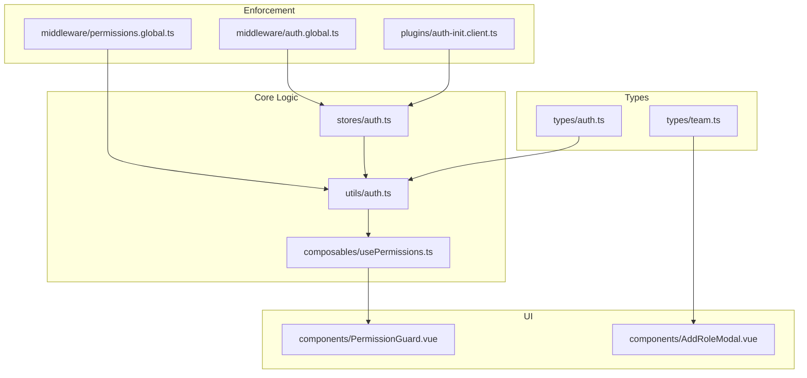
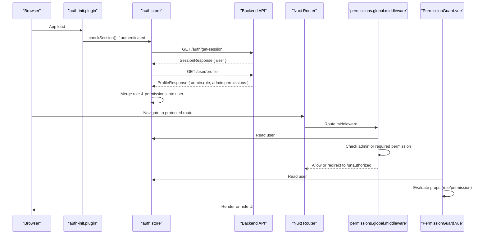
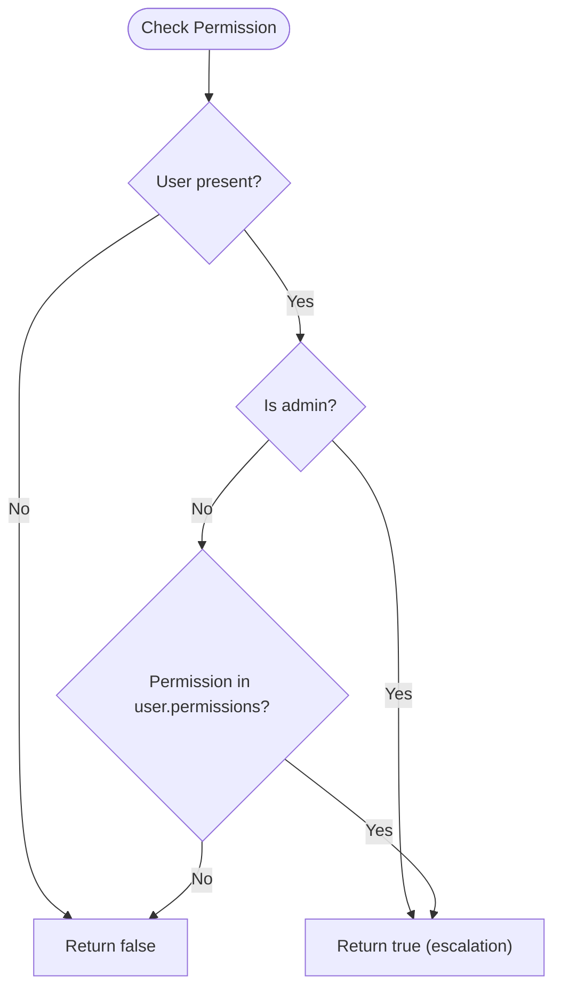
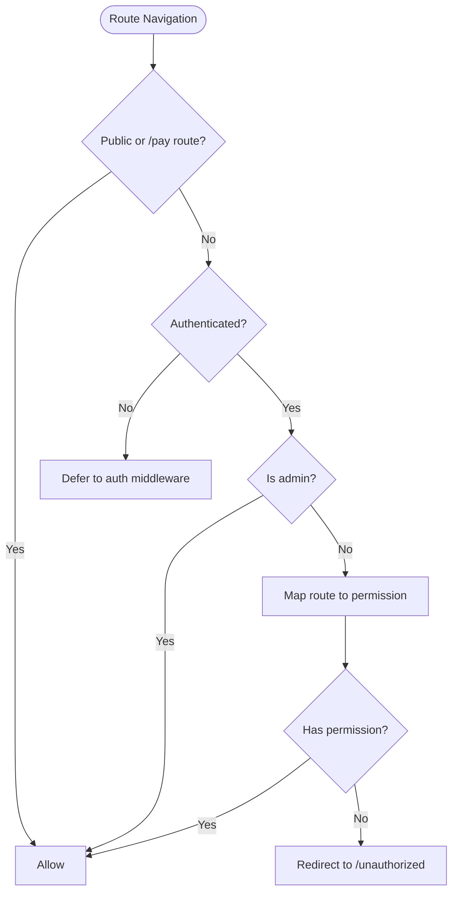
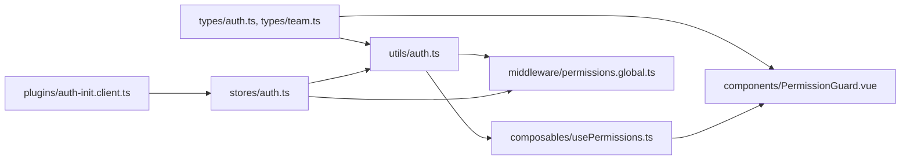

# Role-Based Access Control

<cite>
**Referenced Files in This Document**
- [auth.ts](file://app/types/auth.ts)
- [team.ts](file://app/types/team.ts)
- [auth.ts](file://app/utils/auth.ts)
- [usePermissions.ts](file://app/composables/usePermissions.ts)
- [auth.ts](file://app/stores/auth.ts)
- [permissions.global.ts](file://app/middleware/permissions.global.ts)
- [auth.global.ts](file://app/middleware/auth.global.ts)
- [PermissionGuard.vue](file://app/components/PermissionGuard.vue)
- [AddRoleModal.vue](file://app/components/AddRoleModal.vue)
- [teamValidation.ts](file://app/utils/teamValidation.ts)
- [teamTransform.ts](file://app/utils/teamTransform.ts)
- [auth-init.client.ts](file://app/plugins/auth-init.client.ts)
</cite>

## Table of Contents
1. Introduction
2. Project Structure
3. Core Components
4. Architecture Overview
5. Detailed Component Analysis
6. Dependency Analysis
7. Performance Considerations
8. Troubleshooting Guide
9. Conclusion

## Introduction
This document explains the role-based access control (RBAC) system implemented in the application. It covers:
- Role hierarchy and admin privilege escalation
- Permission normalization and evaluation
- Data models for users, team members, roles, and permissions
- Route-level and UI-level enforcement
- Practical examples for defining custom roles, implementing fine-grained permissions, and building role-specific UI components
- Security considerations, caching strategies, and performance optimizations

## Project Structure
The RBAC system spans types, utilities, composables, stores, middleware, plugins, and UI components:
- Types define user, team member, role, and permission structures
- Utilities normalize roles and evaluate permissions
- Composables expose convenient checks to components
- Store manages session, profile loading, and merges role/permissions into the current user
- Middleware enforces route-level access
- Plugin initializes session on app load
- UI components provide guards and role management interfaces

**Diagram sources**
- [auth.ts:1-64](file://app/types/auth.ts#L1-L64)
- [team.ts:1-65](file://app/types/team.ts#L1-L65)
- [auth.ts:1-58](file://app/utils/auth.ts#L1-L58)
- [usePermissions.ts:1-43](file://app/composables/usePermissions.ts#L1-L43)
- [auth.ts:1-230](file://app/stores/auth.ts#L1-L230)
- [permissions.global.ts:1-59](file://app/middleware/permissions.global.ts#L1-L59)
- [auth.global.ts:1-32](file://app/middleware/auth.global.ts#L1-L32)
- [auth-init.client.ts:1-25](file://app/plugins/auth-init.client.ts#L1-L25)
- [PermissionGuard.vue:1-38](file://app/components/PermissionGuard.vue#L1-L38)
- [AddRoleModal.vue:1-287](file://app/components/AddRoleModal.vue#L1-L287)

**Section sources**
- [auth.ts:1-64](file://app/types/auth.ts#L1-L64)
- [team.ts:1-65](file://app/types/team.ts#L1-L65)
- [auth.ts:1-58](file://app/utils/auth.ts#L1-L58)
- [usePermissions.ts:1-43](file://app/composables/usePermissions.ts#L1-L43)
- [auth.ts:1-230](file://app/stores/auth.ts#L1-L230)
- [permissions.global.ts:1-59](file://app/middleware/permissions.global.ts#L1-L59)
- [auth.global.ts:1-32](file://app/middleware/auth.global.ts#L1-L32)
- [auth-init.client.ts:1-25](file://app/plugins/auth-init.client.ts#L1-L25)
- [PermissionGuard.vue:1-38](file://app/components/PermissionGuard.vue#L1-L38)
- [AddRoleModal.vue:1-287](file://app/components/AddRoleModal.vue#L1-L287)

## Core Components
- AuthUser and AuthTeamMember types define the runtime user shape and team member profile, including role and permissions fields.
- Role and Permission types model backend entities used by the role creation UI.
- Utility functions normalize roles and evaluate permissions with admin escalation.
- Composable usePermissions exposes reactive helpers for UI logic.
- Auth store loads profile data, merges role and permissions into the user object, and manages sessions.
- Global middleware enforces route-level permissions.
- PermissionGuard component provides declarative UI-level access control.
- AddRoleModal supports creating roles with grouped permissions.

Key responsibilities:
- Normalization: Convert role names to a consistent lowercase, space-separated form.
- Escalation: Admin roles implicitly have all permissions.
- Evaluation: Provide hasPermission, hasAnyPermission, hasAllPermissions, hasRole, hasAnyRole, isSuperAdmin.
- Enforcement: Route-level via middleware; UI-level via guard component.
- Data flow: Login sets auth, fetches profile, merges role/permissions, then uses them across the app.

**Section sources**
- [auth.ts:1-64](file://app/types/auth.ts#L1-L64)
- [team.ts:1-65](file://app/types/team.ts#L1-L65)
- [auth.ts:1-58](file://app/utils/auth.ts#L1-L58)
- [usePermissions.ts:1-43](file://app/composables/usePermissions.ts#L1-L43)
- [auth.ts:1-230](file://app/stores/auth.ts#L1-L230)
- [permissions.global.ts:1-59](file://app/middleware/permissions.global.ts#L1-L59)
- [PermissionGuard.vue:1-38](file://app/components/PermissionGuard.vue#L1-L38)
- [AddRoleModal.vue:1-287](file://app/components/AddRoleModal.vue#L1-L287)

## Architecture Overview
The RBAC architecture integrates authentication, authorization, and UI controls:

**Diagram sources**
- [auth-init.client.ts:1-25](file://app/plugins/auth-init.client.ts#L1-L25)
- [auth.ts:1-230](file://app/stores/auth.ts#L1-L230)
- [permissions.global.ts:1-59](file://app/middleware/permissions.global.ts#L1-L59)
- [PermissionGuard.vue:1-38](file://app/components/PermissionGuard.vue#L1-L38)

## Detailed Component Analysis

### Data Models and Role Hierarchy
- AuthUser includes an augmented role field that can be a string or an AuthRole object, plus a permissions array.
- AuthTeamMember represents the admin profile returned from the profile endpoint, containing role and permissions.
- Role and Permission types describe backend role definitions and available permissions.

Role hierarchy:
- The system recognizes two admin-level roles: super admin and admin. These are treated equivalently for permission escalation.

Permission structure:
- Permissions are strings (e.g., customers.view). They are normalized and checked against the user’s permissions list.
- Admins bypass explicit permission checks and are granted all permissions implicitly.

**Section sources**
- [auth.ts:1-64](file://app/types/auth.ts#L1-L64)
- [team.ts:1-65](file://app/types/team.ts#L1-L65)
- [auth.ts:1-58](file://app/utils/auth.ts#L1-L58)

### Permission Normalization and Evaluation
Normalization process:
- Roles are normalized to lowercase with underscores replaced by spaces and trimmed.
- This ensures consistent comparisons regardless of casing or underscore usage.

Evaluation rules:
- userHasPermission returns true for admins without checking the permissions list.
- For non-admins, it checks whether the requested permission exists in the user’s permissions array.
- userHasRole compares normalized roles case-insensitively.

**Diagram sources**
- [auth.ts:1-58](file://app/utils/auth.ts#L1-L58)

**Section sources**
- [auth.ts:1-58](file://app/utils/auth.ts#L1-L58)

### Admin Privilege Escalation Mechanisms
- Admin roles include both super admin and admin.
- Any admin role short-circuits permission checks, granting implicit access to all features.
- Route middleware also grants full access to admins, bypassing specific permission checks.

Practical implications:
- Super admins should be used sparingly due to broad privileges.
- Admins can manage teams and perform administrative actions without explicit permission flags.

**Section sources**
- [auth.ts:1-58](file://app/utils/auth.ts#L1-L58)
- [permissions.global.ts:1-59](file://app/middleware/permissions.global.ts#L1-L59)

### AuthUser and AuthTeamMember Types
- AuthUser: Represents the signed-in user with id, name, email, timestamps, optional two-factor and ban fields, and augmented role and permissions after profile fetch.
- AuthTeamMember: Represents the admin profile with firstName, lastName, email, phone, role, permissions, status, and timestamps.

Data flow:
- After sign-in, the store calls the profile endpoint and merges role and permissions into the user object for fast local checks.

**Section sources**
- [auth.ts:1-64](file://app/types/auth.ts#L1-L64)
- [auth.ts:1-230](file://app/stores/auth.ts#L1-L230)

### Role Definitions and Permission Structures
- Role: Contains id, name, description, permissions array, color, isSystem flag, and timestamps.
- Permission: Contains id, label, description, and module grouping.

Usage:
- The AddRoleModal fetches available permissions, groups them by module, and allows selection to create a new role.

**Section sources**
- [team.ts:1-65](file://app/types/team.ts#L1-L65)
- [AddRoleModal.vue:1-287](file://app/components/AddRoleModal.vue#L1-L287)

### Route-Level Authorization
Global permissions middleware:
- Skips public routes (/login, /forgot-password, /unauthorized) and payment pages (/pay/*).
- Grants immediate access to admins.
- Maps top-level routes to required permissions (e.g., /customers requires customers.view).
- Redirects unauthorized attempts to /unauthorized.

**Diagram sources**
- [permissions.global.ts:1-59](file://app/middleware/permissions.global.ts#L1-L59)

**Section sources**
- [permissions.global.ts:1-59](file://app/middleware/permissions.global.ts#L1-L59)

### UI-Level Authorization with PermissionGuard
The PermissionGuard component:
- Accepts props for single or multiple permissions, role or roles, and requireAll behavior.
- Short-circuits for super admins.
- Renders children only when conditions are satisfied.

Example usage patterns:
- Single permission: <PermissionGuard permission="customers.view">...</PermissionGuard>
- Multiple permissions (any): <PermissionGuard :permissions="['billing.view','billing.approve']">...</PermissionGuard>
- Multiple permissions (all): <PermissionGuard :permissions="['team.manage','settings.manage']" :require-all="true">...</PermissionGuard>
- Role-based: <PermissionGuard role="admin">...</PermissionGuard>

**Section sources**
- [PermissionGuard.vue:1-38](file://app/components/PermissionGuard.vue#L1-L38)
- [usePermissions.ts:1-43](file://app/composables/usePermissions.ts#L1-L43)

### Role Creation and Fine-Grained Permissions
AddRoleModal workflow:
- Fetches permissions from /team/permissions and transforms them into grouped modules.
- Validates role name and at least one selected permission.
- Emits CreateRolePayload with name, description, and permissions array.

Fine-grained permissions:
- Use dot-notation keys (e.g., customers.view, billing.approve) to scope permissions by module and action.
- Group permissions by module for better UX and maintainability.

**Section sources**
- [AddRoleModal.vue:1-287](file://app/components/AddRoleModal.vue#L1-L287)
- [teamValidation.ts:1-122](file://app/utils/teamValidation.ts#L1-L122)
- [teamTransform.ts:1-88](file://app/utils/teamTransform.ts#L1-L88)

### Session Initialization and Profile Loading
Auth initialization plugin:
- On app load, if authenticated, validates session and redirects to login if invalid.
- Marks auth check completion for loading screens.

Auth store profile merging:
- After successful session validation, fetches /user/profile and merges admin role and permissions into the user object.
- Starts periodic session checks and warnings.

**Section sources**
- [auth-init.client.ts:1-25](file://app/plugins/auth-init.client.ts#L1-L25)
- [auth.ts:1-230](file://app/stores/auth.ts#L1-L230)

## Dependency Analysis
High-level dependencies:
- Types feed into utils, composables, and UI components.
- Utils provide core logic consumed by composables and middleware.
- Composables wrap utils for reactive usage in components.
- Store orchestrates session and profile fetching, updating the user object used by all other layers.
- Middleware enforces route-level policies using utils directly.
- UI components use composables for declarative checks.

**Diagram sources**
- [auth.ts:1-64](file://app/types/auth.ts#L1-L64)
- [team.ts:1-65](file://app/types/team.ts#L1-L65)
- [auth.ts:1-58](file://app/utils/auth.ts#L1-L58)
- [usePermissions.ts:1-43](file://app/composables/usePermissions.ts#L1-L43)
- [auth.ts:1-230](file://app/stores/auth.ts#L1-L230)
- [permissions.global.ts:1-59](file://app/middleware/permissions.global.ts#L1-L59)
- [auth-init.client.ts:1-25](file://app/plugins/auth-init.client.ts#L1-L25)
- [PermissionGuard.vue:1-38](file://app/components/PermissionGuard.vue#L1-L38)
- [AddRoleModal.vue:1-287](file://app/components/AddRoleModal.vue#L1-L287)

**Section sources**
- [auth.ts:1-64](file://app/types/auth.ts#L1-L64)
- [team.ts:1-65](file://app/types/team.ts#L1-L65)
- [auth.ts:1-58](file://app/utils/auth.ts#L1-L58)
- [usePermissions.ts:1-43](file://app/composables/usePermissions.ts#L1-L43)
- [auth.ts:1-230](file://app/stores/auth.ts#L1-L230)
- [permissions.global.ts:1-59](file://app/middleware/permissions.global.ts#L1-L59)
- [auth-init.client.ts:1-25](file://app/plugins/auth-init.client.ts#L1-L25)
- [PermissionGuard.vue:1-38](file://app/components/PermissionGuard.vue#L1-L38)
- [AddRoleModal.vue:1-287](file://app/components/AddRoleModal.vue#L1-L287)

## Performance Considerations
- Local permission checks are O(1) for single permission and O(n) for any/all checks over arrays. Keep permission lists concise.
- Normalize roles once during profile merge; avoid repeated normalization in hot paths.
- Cache permission lists in the store (already merged into user) to prevent redundant computations.
- Debounce heavy UI updates that depend on frequent permission changes.
- Avoid re-fetching permissions unnecessarily; rely on profile merge and session refresh to update state.
- Use route-level middleware to fail fast before rendering expensive components.

[No sources needed since this section provides general guidance]

## Troubleshooting Guide
Common issues and resolutions:
- Missing permissions on routes: Ensure the route mapping in the permissions middleware matches your feature’s permission key.
- Admin not recognized: Verify role normalization and that the role name matches “super admin” or “admin”.
- UI elements hidden unexpectedly: Confirm PermissionGuard props and that the user’s permissions include the required keys.
- Session expired: Check session refresh intervals and ensure /auth/get-session responds correctly.
- Role creation errors: Validate role name and permissions; ensure at least one permission is selected.

Operational tips:
- Log permission checks in development to diagnose missing permissions.
- Use the unauthorized page to confirm denied access flows.
- Inspect the user object in the store to verify merged role and permissions.

**Section sources**
- [permissions.global.ts:1-59](file://app/middleware/permissions.global.ts#L1-L59)
- [auth.ts:1-58](file://app/utils/auth.ts#L1-L58)
- [PermissionGuard.vue:1-38](file://app/components/PermissionGuard.vue#L1-L38)
- [auth.ts:1-230](file://app/stores/auth.ts#L1-L230)
- [AddRoleModal.vue:1-287](file://app/components/AddRoleModal.vue#L1-L287)

## Conclusion
The RBAC system combines robust type definitions, normalization, and clear escalation rules to deliver secure and maintainable access control. Route-level middleware protects navigation, while UI-level guards enable fine-grained visibility. Admin roles provide necessary flexibility but should be used judiciously. By following the patterns outlined here—defining granular permissions, leveraging the PermissionGuard component, and keeping permission checks efficient—you can build scalable, secure features tailored to different roles.

[No sources needed since this section summarizes without analyzing specific files]