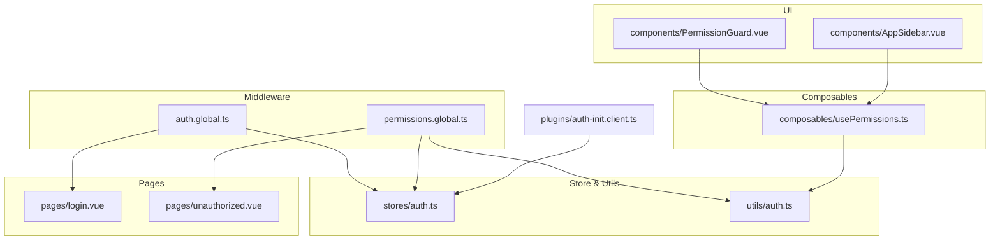
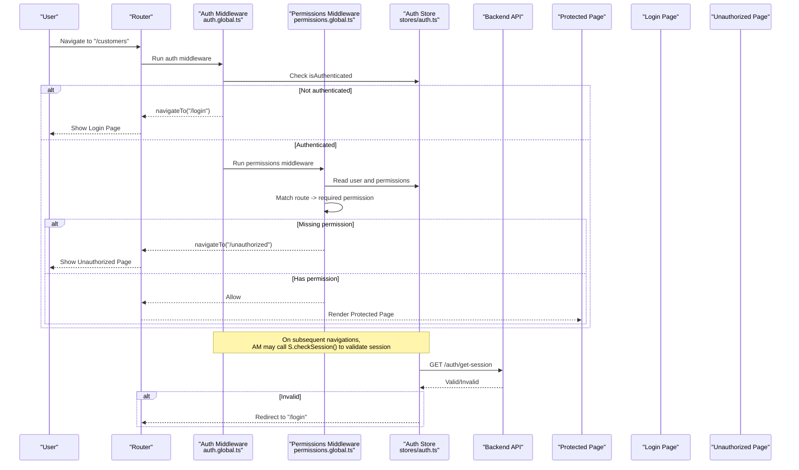
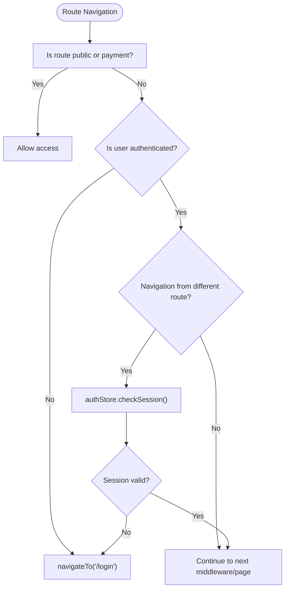
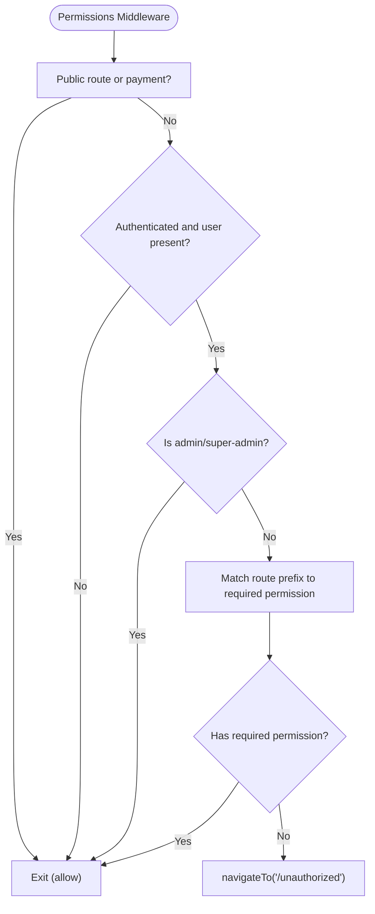
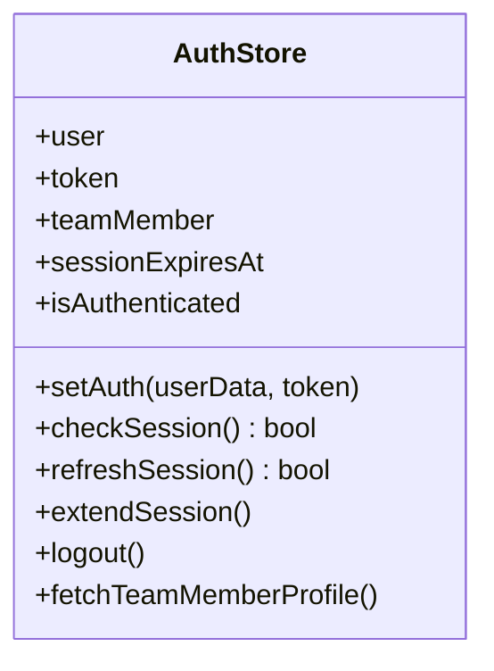
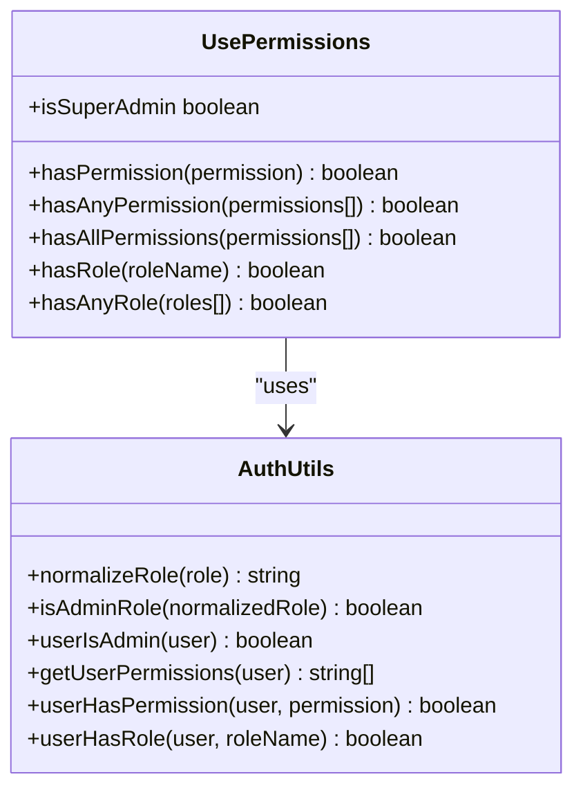
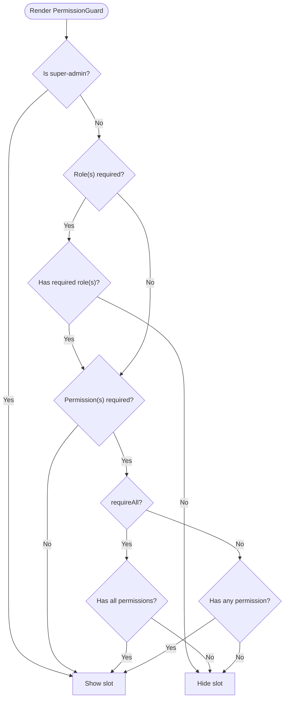
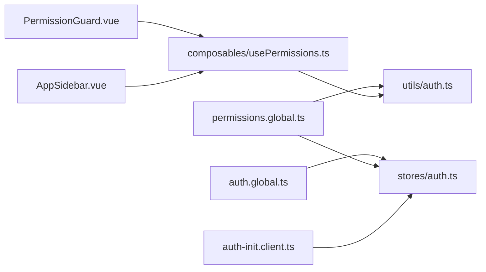

# Route Protection

<cite>
**Referenced Files in This Document**
- [auth.global.ts](file://app/middleware/auth.global.ts)
- [permissions.global.ts](file://app/middleware/permissions.global.ts)
- [PermissionGuard.vue](file://app/components/PermissionGuard.vue)
- [usePermissions.ts](file://app/composables/usePermissions.ts)
- [auth.ts](file://app/utils/auth.ts)
- [auth.ts (store)](file://app/stores/auth.ts)
- [auth-init.client.ts](file://app/plugins/auth-init.client.ts)
- [unauthorized.vue](file://app/pages/unauthorized.vue)
- [login.vue](file://app/pages/login.vue)
- [AppSidebar.vue](file://app/components/AppSidebar.vue)
</cite>

## Table of Contents
1. [Introduction](#introduction)
2. [Project Structure](#project-structure)
3. [Core Components](#core-components)
4. [Architecture Overview](#architecture-overview)
5. [Detailed Component Analysis](#detailed-component-analysis)
6. [Dependency Analysis](#dependency-analysis)
7. [Performance Considerations](#performance-considerations)
8. [Troubleshooting Guide](#troubleshooting-guide)
9. [Conclusion](#conclusion)
10. [Appendices](#appendices)

## Introduction
This document explains the route protection mechanisms used across the application, including:
- Global authentication middleware that enforces login and session validity
- Permission-based route guards that restrict access by role and permissions
- Unauthorized access handling with dedicated redirects
- Practical guidance for protecting individual routes, implementing nested route protection, and building custom guards
- Dynamic authorization patterns for complex business logic and multi-permission scenarios

The system is built on Nuxt 3’s routing middleware and Vue composables, with a centralized auth store and utility functions to normalize roles and evaluate permissions.

## Project Structure
Route protection spans several layers:
- Middleware: global checks for authentication and permissions
- Store: session management, token persistence, and profile fetching
- Composables and utilities: permission helpers and role normalization
- UI components: client-side visibility control via guards
- Pages: public pages and error surfaces (login, unauthorized)

**Diagram sources**
- [auth.global.ts:1-32](file://app/middleware/auth.global.ts#L1-L32)
- [permissions.global.ts:1-59](file://app/middleware/permissions.global.ts#L1-L59)
- [auth.ts (store):1-230](file://app/stores/auth.ts#L1-L230)
- [auth.ts:1-58](file://app/utils/auth.ts#L1-L58)
- [usePermissions.ts:1-43](file://app/composables/usePermissions.ts#L1-L43)
- [PermissionGuard.vue:1-38](file://app/components/PermissionGuard.vue#L1-L38)
- [AppSidebar.vue:1-200](file://app/components/AppSidebar.vue#L1-L200)
- [login.vue:1-167](file://app/pages/login.vue#L1-L167)
- [unauthorized.vue:1-58](file://app/pages/unauthorized.vue#L1-L58)
- [auth-init.client.ts:1-25](file://app/plugins/auth-init.client.ts#L1-L25)

**Section sources**
- [auth.global.ts:1-32](file://app/middleware/auth.global.ts#L1-L32)
- [permissions.global.ts:1-59](file://app/middleware/permissions.global.ts#L1-L59)
- [auth.ts (store):1-230](file://app/stores/auth.ts#L1-L230)
- [auth.ts:1-58](file://app/utils/auth.ts#L1-L58)
- [usePermissions.ts:1-43](file://app/composables/usePermissions.ts#L1-L43)
- [PermissionGuard.vue:1-38](file://app/components/PermissionGuard.vue#L1-L38)
- [AppSidebar.vue:1-200](file://app/components/AppSidebar.vue#L1-L200)
- [login.vue:1-167](file://app/pages/login.vue#L1-L167)
- [unauthorized.vue:1-58](file://app/pages/unauthorized.vue#L1-L58)
- [auth-init.client.ts:1-25](file://app/plugins/auth-init.client.ts#L1-L25)

## Core Components
- Global Authentication Middleware: Ensures users are authenticated before accessing protected routes and validates sessions during navigation.
- Global Permissions Middleware: Enforces route-level permissions based on user roles and explicit permission mappings.
- Auth Store: Manages tokens, user data, session expiry, periodic validation, and logout flows.
- Permission Utilities: Normalize roles and check permissions/roles consistently across the app.
- Permission Guard Component: Client-side guard to conditionally render UI elements based on permissions or roles.
- Sidebar Filtering: Uses permission checks to hide navigation items the user cannot access.
- Public/Error Pages: Login and unauthorized pages handle redirections and user feedback.

Key responsibilities:
- Redirect unauthenticated users to login
- Redirect unauthorized users to an access-denied page
- Validate sessions periodically and on navigation
- Provide composable helpers for dynamic authorization decisions

**Section sources**
- [auth.global.ts:1-32](file://app/middleware/auth.global.ts#L1-L32)
- [permissions.global.ts:1-59](file://app/middleware/permissions.global.ts#L1-L59)
- [auth.ts (store):1-230](file://app/stores/auth.ts#L1-L230)
- [auth.ts:1-58](file://app/utils/auth.ts#L1-L58)
- [usePermissions.ts:1-43](file://app/composables/usePermissions.ts#L1-L43)
- [PermissionGuard.vue:1-38](file://app/components/PermissionGuard.vue#L1-L38)
- [AppSidebar.vue:1-200](file://app/components/AppSidebar.vue#L1-L200)
- [login.vue:1-167](file://app/pages/login.vue#L1-L167)
- [unauthorized.vue:1-58](file://app/pages/unauthorized.vue#L1-L58)

## Architecture Overview
The protection flow combines server-backed session validation with client-side permission checks.

**Diagram sources**
- [auth.global.ts:1-32](file://app/middleware/auth.global.ts#L1-L32)
- [permissions.global.ts:1-59](file://app/middleware/permissions.global.ts#L1-L59)
- [auth.ts (store):1-230](file://app/stores/auth.ts#L1-L230)
- [login.vue:1-167](file://app/pages/login.vue#L1-L167)
- [unauthorized.vue:1-58](file://app/pages/unauthorized.vue#L1-L58)

## Detailed Component Analysis

### Global Authentication Middleware
Responsibilities:
- Define public routes and allow them without checks
- Redirect unauthenticated users to login
- Optionally verify session validity on navigation transitions

Behavior highlights:
- Public routes include login, forgot-password, unauthorized, and payment paths
- If not authenticated, redirect to login
- For non-initial navigations, perform a session check; if invalid, redirect to login

**Diagram sources**
- [auth.global.ts:1-32](file://app/middleware/auth.global.ts#L1-L32)
- [auth.ts (store):90-120](file://app/stores/auth.ts#L90-L120)

**Section sources**
- [auth.global.ts:1-32](file://app/middleware/auth.global.ts#L1-L32)
- [auth.ts (store):90-120](file://app/stores/auth.ts#L90-L120)

### Global Permissions Middleware
Responsibilities:
- Skip public routes and unauthorized page
- Ensure user exists and is authenticated (delegates to auth middleware otherwise)
- Grant admin/super-admin full access
- Map route prefixes to required permissions and enforce them

Behavior highlights:
- Admin and super-admin bypass permission checks
- Route-to-permission mapping uses path prefix matching
- Missing permission results in redirect to unauthorized page

**Diagram sources**
- [permissions.global.ts:1-59](file://app/middleware/permissions.global.ts#L1-L59)
- [auth.ts:22-25](file://app/utils/auth.ts#L22-L25)

**Section sources**
- [permissions.global.ts:1-59](file://app/middleware/permissions.global.ts#L1-L59)
- [auth.ts:1-58](file://app/utils/auth.ts#L1-L58)

### Auth Store (Session Management)
Responsibilities:
- Persist token and user data
- Fetch team member profile to enrich roles and permissions
- Validate and refresh sessions
- Periodically check session validity and warn about expiry
- Handle logout and cleanup

Key behaviors:
- On setAuth, fetch profile and start session checks
- checkSession calls backend to validate token and updates local state
- startSessionCheck runs every 5 minutes and redirects to login on failure
- startSessionWarningCheck shows warning near expiry

**Diagram sources**
- [auth.ts (store):1-230](file://app/stores/auth.ts#L1-L230)

**Section sources**
- [auth.ts (store):1-230](file://app/stores/auth.ts#L1-L230)

### Permission Utilities and Composables
Responsibilities:
- Normalize roles and compare them case-insensitively
- Determine admin status
- Extract and check permissions
- Provide composable helpers for component-level checks

Highlights:
- isAdminRole and userIsAdmin grant implicit full access
- getUserPermissions returns the list of permissions for a user
- usePermissions exposes hasPermission, hasAnyPermission, hasAllPermissions, hasRole, hasAnyRole, isSuperAdmin

**Diagram sources**
- [auth.ts:1-58](file://app/utils/auth.ts#L1-L58)
- [usePermissions.ts:1-43](file://app/composables/usePermissions.ts#L1-L43)

**Section sources**
- [auth.ts:1-58](file://app/utils/auth.ts#L1-L58)
- [usePermissions.ts:1-43](file://app/composables/usePermissions.ts#L1-L43)

### Permission Guard Component
Purpose:
- Conditionally render content based on single or multiple permissions
- Support role-based checks and super-admin override
- Require all or any permissions depending on configuration

Usage patterns:
- Single permission prop
- Array of permissions with requireAll flag
- Role props for role-based rendering

**Diagram sources**
- [PermissionGuard.vue:1-38](file://app/components/PermissionGuard.vue#L1-L38)
- [usePermissions.ts:1-43](file://app/composables/usePermissions.ts#L1-L43)

**Section sources**
- [PermissionGuard.vue:1-38](file://app/components/PermissionGuard.vue#L1-L38)
- [usePermissions.ts:1-43](file://app/composables/usePermissions.ts#L1-L43)

### Sidebar Filtering Based on Permissions
Purpose:
- Dynamically filter navigation links based on user permissions
- Grouped sections only appear if at least one child link is accessible

Implementation:
- Compute filtered lists using hasPermission
- Toggle groups based on current route and availability

**Section sources**
- [AppSidebar.vue:1-200](file://app/components/AppSidebar.vue#L1-L200)

### Initialization and Redirects
- On app load, if a token exists, the plugin validates the session and redirects to login if invalid
- Login sets auth state and navigates to dashboard
- Unauthorized page provides actions to go back or return to dashboard

**Section sources**
- [auth-init.client.ts:1-25](file://app/plugins/auth-init.client.ts#L1-L25)
- [login.vue:1-167](file://app/pages/login.vue#L1-L167)
- [unauthorized.vue:1-58](file://app/pages/unauthorized.vue#L1-L58)

## Dependency Analysis
High-level dependencies between protection components:

**Diagram sources**
- [auth.global.ts:1-32](file://app/middleware/auth.global.ts#L1-L32)
- [permissions.global.ts:1-59](file://app/middleware/permissions.global.ts#L1-L59)
- [auth.ts (store):1-230](file://app/stores/auth.ts#L1-L230)
- [auth.ts:1-58](file://app/utils/auth.ts#L1-L58)
- [usePermissions.ts:1-43](file://app/composables/usePermissions.ts#L1-L43)
- [PermissionGuard.vue:1-38](file://app/components/PermissionGuard.vue#L1-L38)
- [AppSidebar.vue:1-200](file://app/components/AppSidebar.vue#L1-L200)
- [auth-init.client.ts:1-25](file://app/plugins/auth-init.client.ts#L1-L25)

**Section sources**
- [auth.global.ts:1-32](file://app/middleware/auth.global.ts#L1-L32)
- [permissions.global.ts:1-59](file://app/middleware/permissions.global.ts#L1-L59)
- [auth.ts (store):1-230](file://app/stores/auth.ts#L1-L230)
- [auth.ts:1-58](file://app/utils/auth.ts#L1-L58)
- [usePermissions.ts:1-43](file://app/composables/usePermissions.ts#L1-L43)
- [PermissionGuard.vue:1-38](file://app/components/PermissionGuard.vue#L1-L38)
- [AppSidebar.vue:1-200](file://app/components/AppSidebar.vue#L1-L200)
- [auth-init.client.ts:1-25](file://app/plugins/auth-init.client.ts#L1-L25)

## Performance Considerations
- Minimize redundant session checks: The auth middleware already performs a session check on navigation transitions; avoid additional checks unless necessary.
- Prefer computed filters in UI: Use computed properties to derive visible navigation items once per dependency change.
- Batch permission checks: When guarding multiple features, compute a small decision object once and reuse it.
- Debounce heavy operations: If you add dynamic checks that trigger network requests, debounce or cache results where appropriate.

[No sources needed since this section provides general guidance]

## Troubleshooting Guide
Common issues and resolutions:
- Infinite redirect loop: Ensure public routes include all entry points (login, forgot-password, unauthorized). Verify payment routes are allowed if applicable.
- Admin users still blocked: Confirm admin/super-admin checks run before permission checks and that roles are normalized correctly.
- Session expires unexpectedly: Check periodic session checks and warning timers; ensure backend session endpoint responds correctly.
- UI elements hidden incorrectly: Verify permission names match backend-provided permissions and that super-admin overrides work.

Operational tips:
- Log middleware decisions to quickly identify where redirection occurs
- Validate token presence and user shape after login and session refresh
- Test both initial load and subsequent navigations to catch edge cases

**Section sources**
- [auth.global.ts:1-32](file://app/middleware/auth.global.ts#L1-L32)
- [permissions.global.ts:1-59](file://app/middleware/permissions.global.ts#L1-L59)
- [auth.ts (store):122-174](file://app/stores/auth.ts#L122-L174)

## Conclusion
The application implements a layered approach to route protection:
- Global middleware ensures authentication and basic session validity
- Permission middleware enforces route-level access control with admin overrides
- Composables and guards provide flexible, reusable authorization logic for UI and business logic
- Dedicated pages handle redirects and user feedback for unauthenticated and unauthorized states

This design balances security with developer ergonomics, enabling both simple and complex authorization scenarios while keeping code maintainable and testable.

[No sources needed since this section summarizes without analyzing specific files]

## Appendices

### How-To Guides

#### Protecting Individual Routes
- Add the route path to the permissions mapping in the permissions middleware with the required permission key.
- Ensure the route is not listed among public routes.
- Example reference:
  - [permissions.global.ts:31-57](file://app/middleware/permissions.global.ts#L31-L57)

#### Implementing Nested Route Protection
- Use path prefix matching in the permissions middleware to protect entire feature areas.
- Combine with sidebar filtering to hide inaccessible nested links.
- Example references:
  - [permissions.global.ts:48-57](file://app/middleware/permissions.global.ts#L48-L57)
  - [AppSidebar.vue:12-46](file://app/components/AppSidebar.vue#L12-L46)

#### Handling Redirect Logic for Unauthenticated Users
- The auth middleware redirects to login when no token is present.
- The initialization plugin validates session on app load and redirects if invalid.
- Example references:
  - [auth.global.ts:15-29](file://app/middleware/auth.global.ts#L15-L29)
  - [auth-init.client.ts:9-20](file://app/plugins/auth-init.client.ts#L9-L20)

#### Creating Custom Route Guards
- Create a new Nuxt route middleware file and register it globally or per-route.
- Use the same pattern as existing middleware: check public routes, read auth store, and decide to allow or redirect.
- Reference patterns:
  - [auth.global.ts:1-32](file://app/middleware/auth.global.ts#L1-L32)
  - [permissions.global.ts:1-59](file://app/middleware/permissions.global.ts#L1-L59)

#### Implementing Dynamic Route Protection Based on Business Logic
- In pages or components, use usePermissions to make fine-grained decisions.
- For complex conditions, combine hasAnyPermission and hasAllPermissions.
- Example references:
  - [usePermissions.ts:1-43](file://app/composables/usePermissions.ts#L1-L43)
  - [PermissionGuard.vue:12-32](file://app/components/PermissionGuard.vue#L12-L32)

#### Handling Complex Authorization Scenarios with Multiple Permission Requirements
- Use PermissionGuard with requireAll to enforce AND logic across permissions.
- Use hasAnyPermission for OR logic.
- Combine role checks with permission checks for layered authorization.
- Example references:
  - [PermissionGuard.vue:20-29](file://app/components/PermissionGuard.vue#L20-L29)
  - [usePermissions.ts:11-29](file://app/composables/usePermissions.ts#L11-L29)