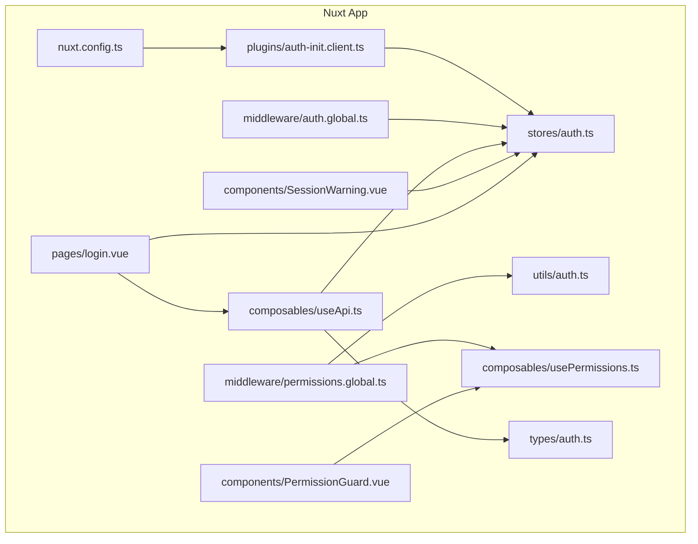
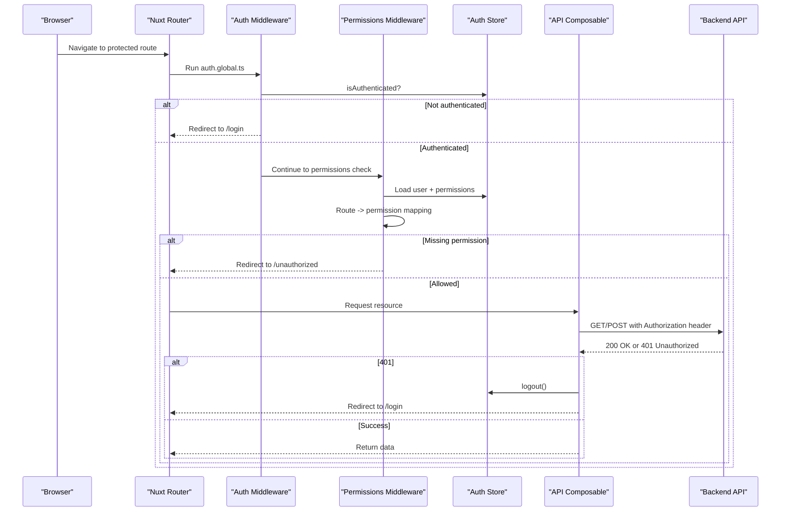
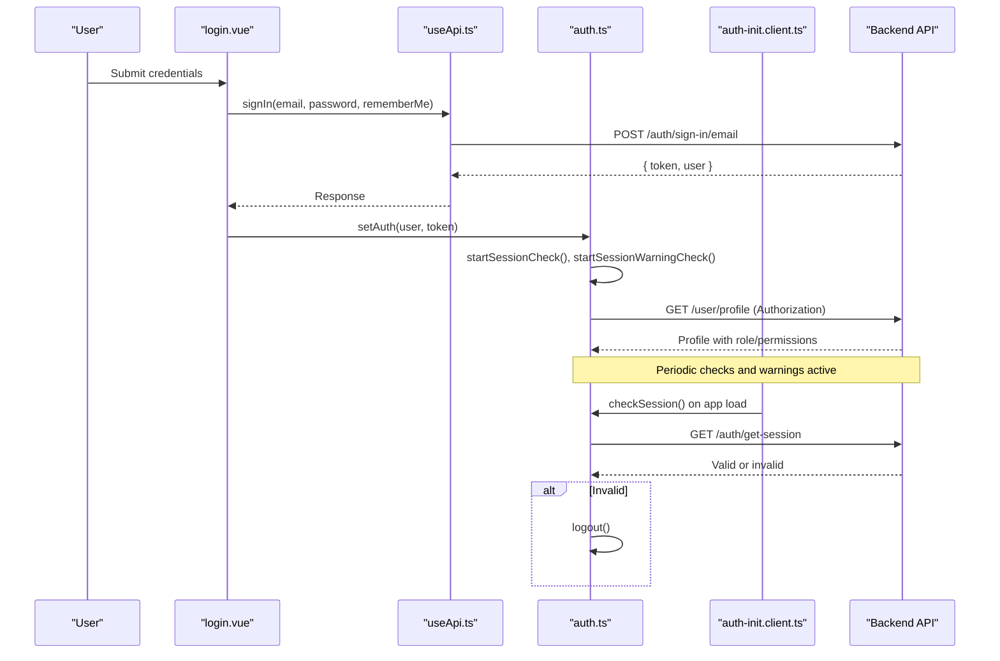
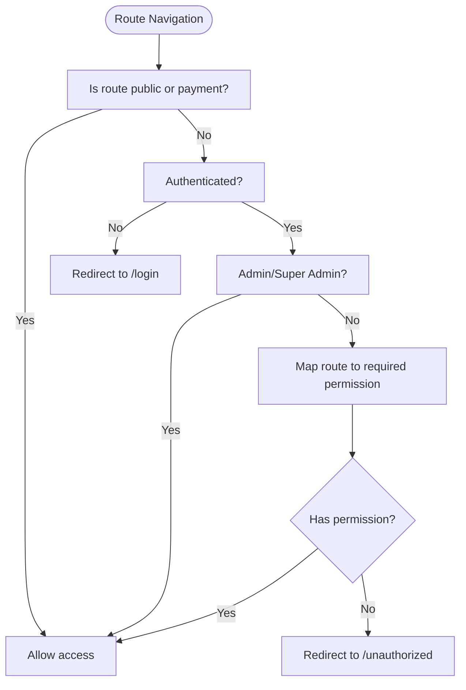
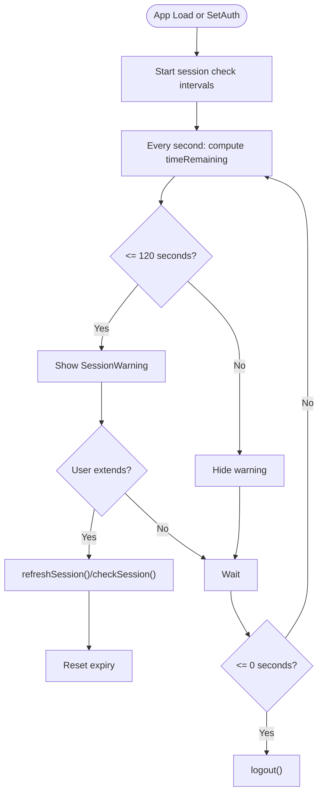
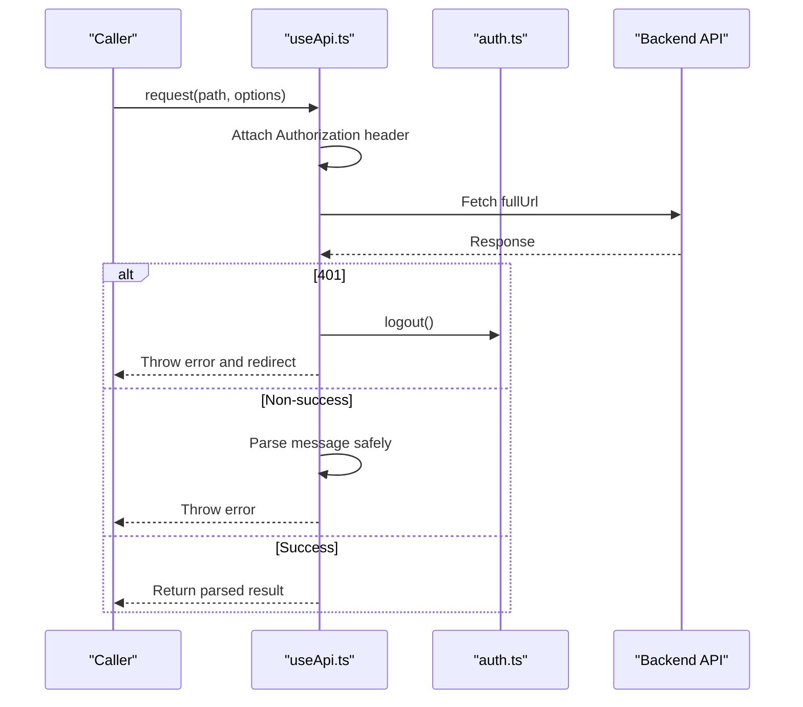
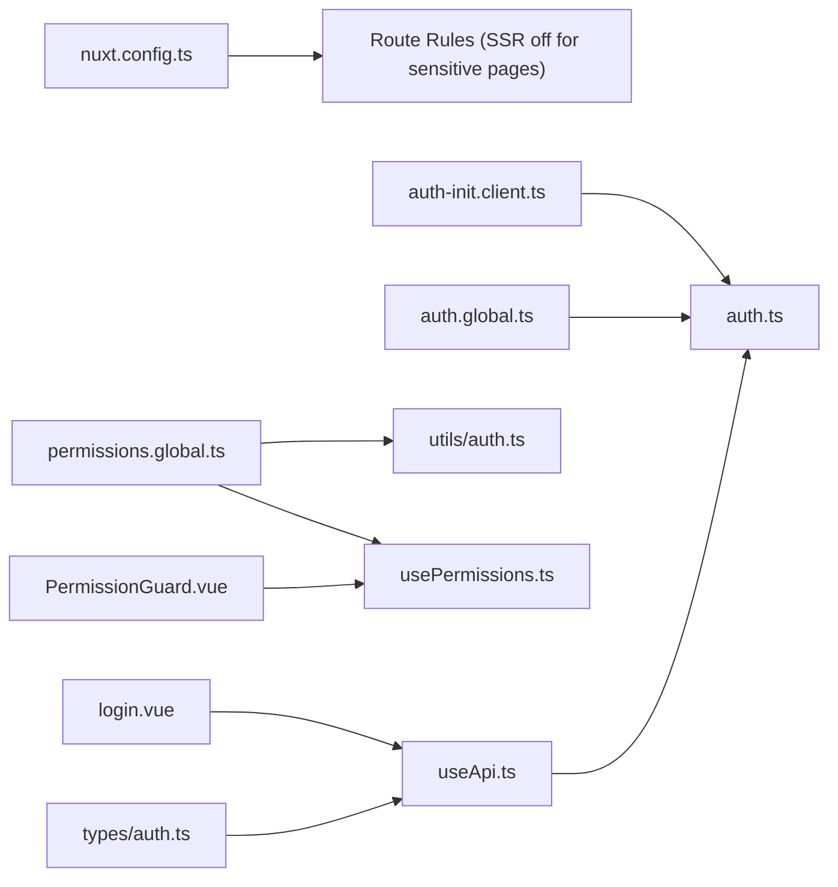

# Security Best Practices

<cite>
**Referenced Files in This Document**
- [nuxt.config.ts](file://nuxt.config.ts)
- [auth.global.ts](file://app/middleware/auth.global.ts)
- [permissions.global.ts](file://app/middleware/permissions.global.ts)
- [auth-init.client.ts](file://app/plugins/auth-init.client.ts)
- [auth.ts](file://app/stores/auth.ts)
- [useApi.ts](file://app/composables/useApi.ts)
- [auth.ts](file://app/utils/auth.ts)
- [usePermissions.ts](file://app/composables/usePermissions.ts)
- [PermissionGuard.vue](file://app/components/PermissionGuard.vue)
- [SessionWarning.vue](file://app/components/SessionWarning.vue)
- [login.vue](file://app/pages/login.vue)
- [auth.ts](file://app/types/auth.ts)
</cite>

## Table of Contents
1. [Introduction](#introduction)
2. [Project Structure](#project-structure)
3. [Core Components](#core-components)
4. [Architecture Overview](#architecture-overview)
5. [Detailed Component Analysis](#detailed-component-analysis)
6. [Dependency Analysis](#dependency-analysis)
7. [Performance Considerations](#performance-considerations)
8. [Troubleshooting Guide](#troubleshooting-guide)
9. [Conclusion](#conclusion)
10. [Appendices](#appendices)

## Introduction
This document provides comprehensive security best practices for the Vue.js/Nuxt.js application, focusing on authentication and authorization patterns, secure token handling, session management, input validation, XSS prevention, CSRF considerations, API endpoint protection, sensitive data handling, and security monitoring/logging. It maps these practices to the actual implementation in the codebase and highlights areas where additional hardening is recommended.

## Project Structure
The application uses Nuxt 3 with Pinia for state management and a client-side plugin for initial auth checks. Authentication and authorization are enforced via global route middleware, permission utilities, and a centralized API composable that attaches tokens and handles 401 responses.

**Diagram sources**
- [nuxt.config.ts:1-46](file://nuxt.config.ts#L1-L46)
- [auth-init.client.ts:1-25](file://app/plugins/auth-init.client.ts#L1-L25)
- [auth.global.ts:1-32](file://app/middleware/auth.global.ts#L1-L32)
- [permissions.global.ts:1-59](file://app/middleware/permissions.global.ts#L1-L59)
- [auth.ts](file://app/stores/auth.ts)
- [useApi.ts:1-91](file://app/composables/useApi.ts#L1-L91)
- [auth.ts](file://app/utils/auth.ts)
- [usePermissions.ts:1-43](file://app/composables/usePermissions.ts#L1-L43)
- [PermissionGuard.vue:1-38](file://app/components/PermissionGuard.vue#L1-L38)
- [SessionWarning.vue:1-66](file://app/components/SessionWarning.vue#L1-L66)
- [login.vue:1-167](file://app/pages/login.vue#L1-L167)
- [auth.ts](file://app/types/auth.ts)

**Section sources**
- [nuxt.config.ts:1-46](file://nuxt.config.ts#L1-L46)
- [auth-init.client.ts:1-25](file://app/plugins/auth-init.client.ts#L1-L25)
- [auth.global.ts:1-32](file://app/middleware/auth.global.ts#L1-L32)
- [permissions.global.ts:1-59](file://app/middleware/permissions.global.ts#L1-L59)
- [auth.ts](file://app/stores/auth.ts)
- [useApi.ts:1-91](file://app/composables/useApi.ts#L1-L91)
- [auth.ts](file://app/utils/auth.ts)
- [usePermissions.ts:1-43](file://app/composables/usePermissions.ts#L1-L43)
- [PermissionGuard.vue:1-38](file://app/components/PermissionGuard.vue#L1-L38)
- [SessionWarning.vue:1-66](file://app/components/SessionWarning.vue#L1-L66)
- [login.vue:1-167](file://app/pages/login.vue#L1-L167)
- [auth.ts](file://app/types/auth.ts)

## Core Components
- Authentication Store (Pinia): Manages user, token, session expiry, periodic checks, warnings, and logout flow. Persists state across reloads.
- Global Auth Middleware: Enforces authentication for protected routes and validates sessions during navigation.
- Permission Middleware: Maps routes to permissions and enforces access control; admins bypass specific checks.
- API Composable: Centralizes HTTP requests, injects Authorization headers, and handles 401 by logging out and redirecting.
- Permission Utilities: Role normalization, admin detection, and permission helpers used by UI and middleware.
- Session Warning UI: Notifies users before session expiry and allows extending or dismissing.
- Login Page: Validates inputs, calls sign-in API, stores credentials, and navigates to dashboard.

Key responsibilities and security implications:
- Token storage: Persisted in-memory ref and persisted via Pinia plugin. Needs careful consideration regarding persistence scope and transport security.
- Session lifecycle: Periodic server-side validation and warning UI improve UX but must be paired with short-lived tokens and robust server enforcement.
- Input validation: Client-side validation exists for login; server-side validation remains essential.
- Error handling: Centralized error handler shows toast messages; ensure no sensitive details leak into logs or UI.

**Section sources**
- [auth.ts](file://app/stores/auth.ts)
- [auth.global.ts:1-32](file://app/middleware/auth.global.ts#L1-L32)
- [permissions.global.ts:1-59](file://app/middleware/permissions.global.ts#L1-L59)
- [useApi.ts:1-91](file://app/composables/useApi.ts#L1-L91)
- [auth.ts](file://app/utils/auth.ts)
- [usePermissions.ts:1-43](file://app/composables/usePermissions.ts#L1-L43)
- [PermissionGuard.vue:1-38](file://app/components/PermissionGuard.vue#L1-L38)
- [SessionWarning.vue:1-66](file://app/components/SessionWarning.vue#L1-L66)
- [login.vue:1-167](file://app/pages/login.vue#L1-L167)

## Architecture Overview
The security architecture combines client-side guards with server-side validations:

**Diagram sources**
- [auth.global.ts:1-32](file://app/middleware/auth.global.ts#L1-L32)
- [permissions.global.ts:1-59](file://app/middleware/permissions.global.ts#L1-L59)
- [auth.ts](file://app/stores/auth.ts)
- [useApi.ts:1-91](file://app/composables/useApi.ts#L1-L91)

## Detailed Component Analysis

### Authentication Flow
- Login page validates email and password locally, then calls the sign-in API via the API composable.
- On success, the store persists user and token, sets session expiry, starts periodic checks, and fetches team member profile to augment roles and permissions.
- The auth plugin validates session on app load if already authenticated.

**Diagram sources**
- [login.vue:1-167](file://app/pages/login.vue#L1-L167)
- [useApi.ts:1-91](file://app/composables/useApi.ts#L1-L91)
- [auth.ts](file://app/stores/auth.ts)
- [auth-init.client.ts:1-25](file://app/plugins/auth-init.client.ts#L1-L25)

**Section sources**
- [login.vue:1-167](file://app/pages/login.vue#L1-L167)
- [useApi.ts:1-91](file://app/composables/useApi.ts#L1-L91)
- [auth.ts](file://app/stores/auth.ts)
- [auth-init.client.ts:1-25](file://app/plugins/auth-init.client.ts#L1-L25)

### Authorization and Access Control
- Global permission middleware maps routes to required permissions and redirects unauthorized users to /unauthorized.
- Admin/Super Admin roles bypass specific permission checks.
- Permission utilities normalize roles and provide helper functions for checks.
- PermissionGuard component conditionally renders UI based on permissions/roles.

**Diagram sources**
- [permissions.global.ts:1-59](file://app/middleware/permissions.global.ts#L1-L59)
- [auth.ts](file://app/utils/auth.ts)
- [usePermissions.ts:1-43](file://app/composables/usePermissions.ts#L1-L43)
- [PermissionGuard.vue:1-38](file://app/components/PermissionGuard.vue#L1-L38)

**Section sources**
- [permissions.global.ts:1-59](file://app/middleware/permissions.global.ts#L1-L59)
- [auth.ts](file://app/utils/auth.ts)
- [usePermissions.ts:1-43](file://app/composables/usePermissions.ts#L1-L43)
- [PermissionGuard.vue:1-38](file://app/components/PermissionGuard.vue#L1-L38)

### Session Management and Timeouts
- Session expiry is tracked client-side and refreshed periodically by calling the session endpoint.
- A warning UI appears two minutes before expiry, allowing users to extend or dismiss.
- Logout clears local state and attempts to notify the server.

**Diagram sources**
- [auth.ts](file://app/stores/auth.ts)
- [SessionWarning.vue:1-66](file://app/components/SessionWarning.vue#L1-L66)

**Section sources**
- [auth.ts](file://app/stores/auth.ts)
- [SessionWarning.vue:1-66](file://app/components/SessionWarning.vue#L1-L66)

### API Security and Error Handling
- All requests include Authorization headers when available.
- 401 responses trigger logout and redirect to login.
- Errors are wrapped with a central error handler that displays toasts without leaking sensitive details.

**Diagram sources**
- [useApi.ts:1-91](file://app/composables/useApi.ts#L1-L91)
- [auth.ts](file://app/stores/auth.ts)

**Section sources**
- [useApi.ts:1-91](file://app/composables/useApi.ts#L1-L91)
- [auth.ts](file://app/stores/auth.ts)

### Input Validation and Sanitization
- Login form performs basic client-side validation for email format and password length.
- No explicit sanitization is applied beyond standard HTML binding; avoid using v-html with untrusted content.
- Ensure server-side validation and sanitization for all endpoints.

**Section sources**
- [login.vue:1-167](file://app/pages/login.vue#L1-L167)

### Sensitive Data Handling
- Tokens and user profiles are stored in Pinia state and persisted via a plugin. Avoid storing secrets in localStorage unless necessary and consider HttpOnly cookies on the server side.
- Do not log tokens or PII; current logging includes request metadata and status codes.

**Section sources**
- [auth.ts](file://app/stores/auth.ts)
- [useApi.ts:1-91](file://app/composables/useApi.ts#L1-L91)

## Dependency Analysis
Security-related dependencies and their relationships:

**Diagram sources**
- [nuxt.config.ts:1-46](file://nuxt.config.ts#L1-L46)
- [auth-init.client.ts:1-25](file://app/plugins/auth-init.client.ts#L1-L25)
- [auth.global.ts:1-32](file://app/middleware/auth.global.ts#L1-L32)
- [permissions.global.ts:1-59](file://app/middleware/permissions.global.ts#L1-L59)
- [auth.ts](file://app/utils/auth.ts)
- [usePermissions.ts:1-43](file://app/composables/usePermissions.ts#L1-L43)
- [PermissionGuard.vue:1-38](file://app/components/PermissionGuard.vue#L1-L38)
- [useApi.ts:1-91](file://app/composables/useApi.ts#L1-L91)
- [login.vue:1-167](file://app/pages/login.vue#L1-L167)
- [auth.ts](file://app/types/auth.ts)

**Section sources**
- [nuxt.config.ts:1-46](file://nuxt.config.ts#L1-L46)
- [auth-init.client.ts:1-25](file://app/plugins/auth-init.client.ts#L1-L25)
- [auth.global.ts:1-32](file://app/middleware/auth.global.ts#L1-L32)
- [permissions.global.ts:1-59](file://app/middleware/permissions.global.ts#L1-L59)
- [auth.ts](file://app/utils/auth.ts)
- [usePermissions.ts:1-43](file://app/composables/usePermissions.ts#L1-L43)
- [PermissionGuard.vue:1-38](file://app/components/PermissionGuard.vue#L1-L38)
- [useApi.ts:1-91](file://app/composables/useApi.ts#L1-L91)
- [login.vue:1-167](file://app/pages/login.vue#L1-L167)
- [auth.ts](file://app/types/auth.ts)

## Performance Considerations
- Periodic session checks run every five minutes; ensure backend rate limits protect against abuse.
- Session warning interval runs every second; consider debouncing or throttling if performance issues arise.
- Avoid excessive logging in production; strip console statements or gate them behind environment flags.

[No sources needed since this section provides general guidance]

## Troubleshooting Guide
Common issues and mitigations:
- Unexpected logout: Verify server-side session validity and network connectivity; check 401 handling in the API composable.
- Permission denied: Confirm route-to-permission mappings and user permissions; review permission middleware logic.
- Session expiring too quickly: Adjust server-side token TTL and client-side refresh behavior; ensure refresh calls succeed.
- Leaked sensitive info: Audit console logs and error messages; remove tokens and PII from logs.

**Section sources**
- [useApi.ts:1-91](file://app/composables/useApi.ts#L1-L91)
- [permissions.global.ts:1-59](file://app/middleware/permissions.global.ts#L1-L59)
- [auth.ts](file://app/stores/auth.ts)

## Conclusion
The application implements a solid foundation for authentication and authorization with global middleware, centralized API handling, and session management. To strengthen security posture, adopt HttpOnly cookies for tokens, enforce strict Content Security Policy, implement CSRF protections at the server, sanitize all inputs, and enhance logging and audit trails. These measures will reduce risks associated with XSS, CSRF, token exposure, and insufficient access controls.

[No sources needed since this section summarizes without analyzing specific files]

## Appendices

### Security Recommendations Checklist
- Token Storage and Transmission
  - Prefer HttpOnly, Secure, SameSite cookies over client-side storage for tokens.
  - Enforce HTTPS-only communication and validate certificates.
  - Rotate tokens regularly and support token revocation.
- CSRF Protection
  - Use SameSite cookies and anti-CSRF tokens on state-changing requests.
  - Validate Origin/Referer headers server-side.
- XSS Prevention
  - Avoid rendering untrusted content with v-html; use text interpolation.
  - Implement a strict Content Security Policy (CSP).
- Input Sanitization
  - Apply server-side validation and sanitization for all inputs.
  - Normalize and validate types on the client for better UX.
- Password Handling
  - Enforce strong password policies server-side.
  - Provide secure password reset flows and account lockout mechanisms.
- Session Policies
  - Short-lived tokens with refresh mechanisms.
  - Inactivity timeouts and forced re-authentication for sensitive actions.
- Logout Procedures
  - Invalidate server-side sessions and revoke tokens.
  - Clear client-side state and stop background tasks.
- Custom Authentication Flows
  - Keep flows minimal; leverage existing middleware and store patterns.
  - Validate all claims and scopes server-side.
- Securing API Endpoints
  - Require authentication and authorization on all endpoints.
  - Rate limit and monitor suspicious activity.
- Sensitive Data Handling
  - Minimize data exposure; mask PII in logs and UI.
  - Encrypt sensitive fields at rest and in transit.
- Monitoring, Logging, and Auditing
  - Log authentication events, authorization failures, and critical actions.
  - Retain audit trails and integrate with SIEM tools.

[No sources needed since this section provides general guidance]