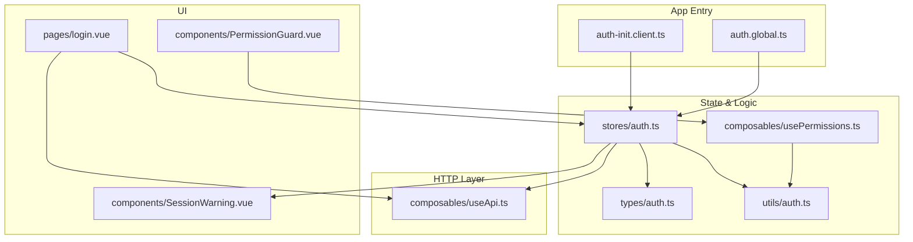
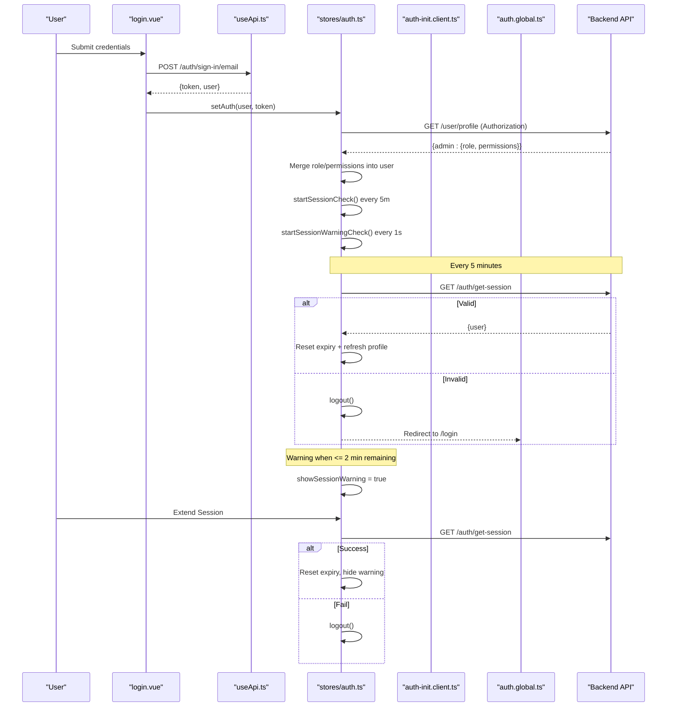
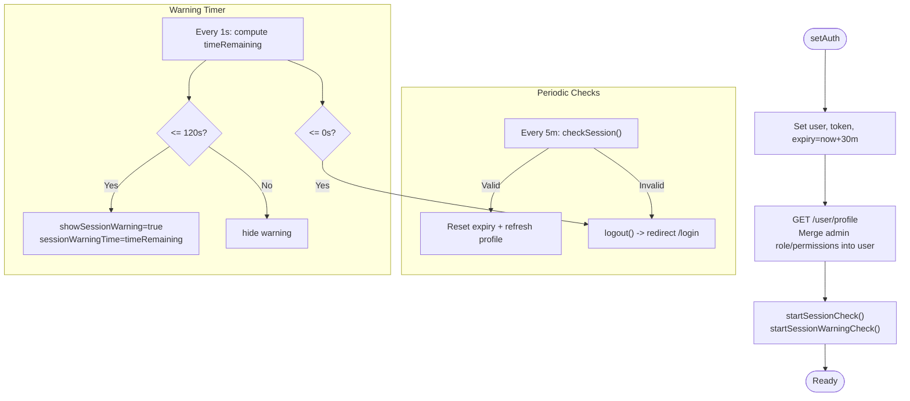
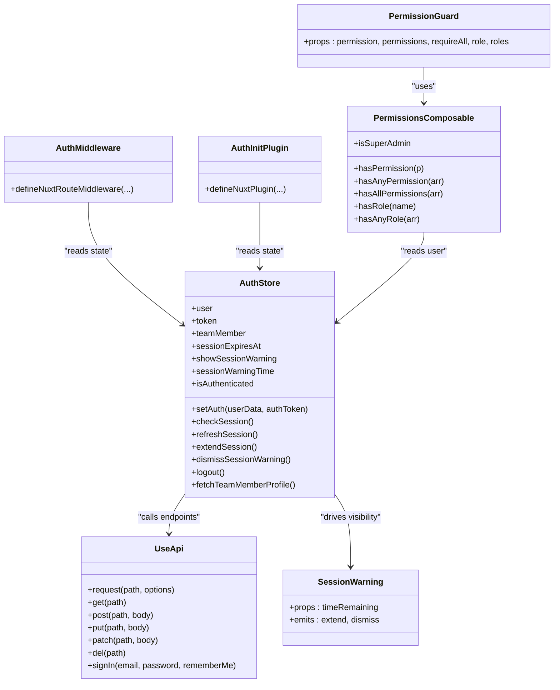

# Session Management

<cite>
**Referenced Files in This Document**
- [auth.ts](file://app/stores/auth.ts)
- [auth.ts](file://app/types/auth.ts)
- [auth.ts](file://app/utils/auth.ts)
- [SessionWarning.vue](file://app/components/SessionWarning.vue)
- [auth.global.ts](file://app/middleware/auth.global.ts)
- [auth-init.client.ts](file://app/plugins/auth-init.client.ts)
- [useApi.ts](file://app/composables/useApi.ts)
- [usePermissions.ts](file://app/composables/usePermissions.ts)
- [PermissionGuard.vue](file://app/components/PermissionGuard.vue)
- [login.vue](file://app/pages/login.vue)
</cite>

## Table of Contents
1. [Introduction](#introduction)
2. [Project Structure](#project-structure)
3. [Core Components](#core-components)
4. [Architecture Overview](#architecture-overview)
5. [Detailed Component Analysis](#detailed-component-analysis)
6. [Dependency Analysis](#dependency-analysis)
7. [Performance Considerations](#performance-considerations)
8. [Troubleshooting Guide](#troubleshooting-guide)
9. [Conclusion](#conclusion)
10. [Appendices](#appendices)

## Introduction
This document explains the session management system used across the application. It covers JWT-based token handling, automatic session renewal every 5 minutes, and a user-facing warning displayed 2 minutes before expiry. It also documents the full session lifecycle (initialization, validation, refresh, cleanup), team member profile synchronization that merges admin roles and permissions into the user object, persistence via Pinia’s built-in storage, graceful degradation on expiration, and practical examples for extending behavior such as custom handlers, longer durations, and error handling.

## Project Structure
The session management is implemented primarily through:
- A Pinia store for state and timers
- Middleware to protect routes
- A client plugin to validate sessions on app load
- An API helper to attach tokens and handle 401s
- UI components for warnings and permission guards
- Utility functions for role and permission checks

**Diagram sources**
- [auth-init.client.ts:1-25](file://app/plugins/auth-init.client.ts#L1-L25)
- [auth.global.ts:1-32](file://app/middleware/auth.global.ts#L1-L32)
- [auth.ts:1-230](file://app/stores/auth.ts#L1-L230)
- [auth.ts:1-64](file://app/types/auth.ts#L1-L64)
- [auth.ts:1-58](file://app/utils/auth.ts#L1-L58)
- [usePermissions.ts:1-43](file://app/composables/usePermissions.ts#L1-L43)
- [useApi.ts:1-91](file://app/composables/useApi.ts#L1-L91)
- [SessionWarning.vue:1-66](file://app/components/SessionWarning.vue#L1-L66)
- [PermissionGuard.vue:1-38](file://app/components/PermissionGuard.vue#L1-L38)
- [login.vue:1-167](file://app/pages/login.vue#L1-L167)

**Section sources**
- [auth.ts:1-230](file://app/stores/auth.ts#L1-L230)
- [auth.ts:1-64](file://app/types/auth.ts#L1-L64)
- [auth.ts:1-58](file://app/utils/auth.ts#L1-L58)
- [auth.global.ts:1-32](file://app/middleware/auth.global.ts#L1-L32)
- [auth-init.client.ts:1-25](file://app/plugins/auth-init.client.ts#L1-L25)
- [useApi.ts:1-91](file://app/composables/useApi.ts#L1-L91)
- [SessionWarning.vue:1-66](file://app/components/SessionWarning.vue#L1-L66)
- [PermissionGuard.vue:1-38](file://app/components/PermissionGuard.vue#L1-L38)
- [login.vue:1-167](file://app/pages/login.vue#L1-L167)

## Core Components
- Auth store: Holds user, token, team member data, session expiry, and warning flags; manages periodic checks and warnings; persists state.
- API helper: Attaches Authorization header with Bearer token; handles 401 by logging out and redirecting.
- Route middleware: Guards protected routes and validates session on navigation.
- App plugin: Validates session on initial load if already authenticated.
- Permission utilities: Normalize roles and check permissions/roles based on merged user data.
- Session warning component: Displays countdown and actions to extend or dismiss.

Key responsibilities:
- Token lifecycle: set on login, attached to requests, refreshed periodically, cleared on logout.
- Session checks: every 5 minutes; invalid sessions trigger logout and redirect.
- Expiry warnings: shown when less than 2 minutes remain; auto-logout at zero.
- Profile sync: fetches team member profile and merges admin role and permissions into the user object.
- Persistence: Pinia store configured to persist across reloads.

**Section sources**
- [auth.ts:1-230](file://app/stores/auth.ts#L1-L230)
- [useApi.ts:1-91](file://app/composables/useApi.ts#L1-L91)
- [auth.global.ts:1-32](file://app/middleware/auth.global.ts#L1-L32)
- [auth-init.client.ts:1-25](file://app/plugins/auth-init.client.ts#L1-L25)
- [auth.ts:1-58](file://app/utils/auth.ts#L1-L58)
- [usePermissions.ts:1-43](file://app/composables/usePermissions.ts#L1-L43)
- [SessionWarning.vue:1-66](file://app/components/SessionWarning.vue#L1-L66)

## Architecture Overview
The session flow integrates authentication, route protection, background maintenance, and UI feedback.

**Diagram sources**
- [login.vue:1-167](file://app/pages/login.vue#L1-L167)
- [useApi.ts:1-91](file://app/composables/useApi.ts#L1-L91)
- [auth.ts:1-230](file://app/stores/auth.ts#L1-L230)
- [auth-init.client.ts:1-25](file://app/plugins/auth-init.client.ts#L1-L25)
- [auth.global.ts:1-32](file://app/middleware/auth.global.ts#L1-L32)

## Detailed Component Analysis

### Auth Store (Pinia)
Responsibilities:
- State: user, token, teamMember, sessionExpiresAt, showSessionWarning, sessionWarningTime.
- Computed: isAuthenticated.
- Lifecycle:
  - Initialization: If token exists, starts periodic checks and warnings, and fetches team member profile.
  - setAuth: Stores user and token, sets expiry to 30 minutes from now, fetches profile, starts timers.
  - checkSession: Calls /auth/get-session; updates user and resets expiry; on failure logs out.
  - refreshSession: Reuses checkSession; resets expiry and hides warning on success.
  - extendSession: Convenience wrapper around refreshSession.
  - startSessionCheck: Interval every 5 minutes to call checkSession; redirects to login on failure.
  - startSessionWarningCheck: Interval every second to show warning when timeRemaining <= 120 seconds; logs out at zero.
  - stopSessionCheck: Clears intervals.
  - logout: Calls sign-out endpoint (best-effort), clears state, stops timers.
- Persistence: Configured with Pinia’s built-in persistence option.

**Diagram sources**
- [auth.ts:1-230](file://app/stores/auth.ts#L1-L230)

**Section sources**
- [auth.ts:1-230](file://app/stores/auth.ts#L1-L230)

### Team Member Profile Synchronization
Behavior:
- On setAuth and on successful session checks, the store calls /user/profile with Authorization header.
- The response includes an admin object containing role and permissions.
- The store merges these into the current user object so that role and permissions are available throughout the app.

Impact:
- Role normalization and permission checks rely on this merged data.
- Admin users implicitly have all permissions.

**Section sources**
- [auth.ts:15-43](file://app/stores/auth.ts#L15-L43)
- [auth.ts:90-120](file://app/stores/auth.ts#L90-L120)
- [auth.ts:1-64](file://app/types/auth.ts#L1-L64)

### Permissions and Role Utilities
- normalizeRole: Converts string or role object to a normalized lowercase string without underscores.
- isAdminRole: Recognizes “super admin” and “admin”.
- userIsAdmin: Determines if the current user is admin.
- getUserPermissions: Extracts permissions array from user.
- userHasPermission: Admins always pass; otherwise checks explicit permissions.
- userHasRole: Compares normalized role strings.

These utilities power composables and guards.

**Section sources**
- [auth.ts:1-58](file://app/utils/auth.ts#L1-L58)
- [usePermissions.ts:1-43](file://app/composables/usePermissions.ts#L1-L43)
- [PermissionGuard.vue:1-38](file://app/components/PermissionGuard.vue#L1-L38)

### API Helper and 401 Handling
- useApi.request attaches Authorization header using the current token.
- On 401 responses, it triggers logout and navigates to /login, then throws a descriptive error.
- Other non-success statuses throw errors with details.

This ensures consistent session invalidation across the app.

**Section sources**
- [useApi.ts:1-91](file://app/composables/useApi.ts#L1-L91)

### Route Middleware
- Public routes (/login, /forgot-password, /unauthorized, and /pay/*) bypass auth checks.
- For other routes, if not authenticated, redirects to /login.
- On navigation between routes, verifies session validity; invalid sessions redirect to /login.

**Section sources**
- [auth.global.ts:1-32](file://app/middleware/auth.global.ts#L1-L32)

### App Initialization Plugin
- On app load, if a token exists, validates the session.
- If invalid, redirects to /login.
- Provides a loading flag to gate UI until auth check completes.

**Section sources**
- [auth-init.client.ts:1-25](file://app/plugins/auth-init.client.ts#L1-L25)

### Session Warning Component
- Displays a fixed-position card with a countdown formatted as mm:ss.
- Emits events to extend or dismiss the warning.
- Integrates with the store’s showSessionWarning and sessionWarningTime.

**Section sources**
- [SessionWarning.vue:1-66](file://app/components/SessionWarning.vue#L1-L66)

### Login Flow
- Validates form inputs.
- Calls useApi.signIn to obtain token and user.
- Invokes authStore.setAuth to initialize session and timers.
- Navigates to home after success.

**Section sources**
- [login.vue:1-167](file://app/pages/login.vue#L1-L167)

## Dependency Analysis

**Diagram sources**
- [auth.ts:1-230](file://app/stores/auth.ts#L1-L230)
- [useApi.ts:1-91](file://app/composables/useApi.ts#L1-L91)
- [auth.global.ts:1-32](file://app/middleware/auth.global.ts#L1-L32)
- [auth-init.client.ts:1-25](file://app/plugins/auth-init.client.ts#L1-L25)
- [usePermissions.ts:1-43](file://app/composables/usePermissions.ts#L1-L43)
- [PermissionGuard.vue:1-38](file://app/components/PermissionGuard.vue#L1-L38)
- [SessionWarning.vue:1-66](file://app/components/SessionWarning.vue#L1-L66)

**Section sources**
- [auth.ts:1-230](file://app/stores/auth.ts#L1-L230)
- [useApi.ts:1-91](file://app/composables/useApi.ts#L1-L91)
- [auth.global.ts:1-32](file://app/middleware/auth.global.ts#L1-L32)
- [auth-init.client.ts:1-25](file://app/plugins/auth-init.client.ts#L1-L25)
- [usePermissions.ts:1-43](file://app/composables/usePermissions.ts#L1-L43)
- [PermissionGuard.vue:1-38](file://app/components/PermissionGuard.vue#L1-L38)
- [SessionWarning.vue:1-66](file://app/components/SessionWarning.vue#L1-L66)

## Performance Considerations
- Periodic checks run every 5 minutes; ensure backend endpoints respond quickly to avoid unnecessary latency.
- Warning timer runs every second; keep logic minimal to prevent UI jank.
- Avoid redundant profile fetches; the store already refreshes profile on session validation.
- Persisted state reduces re-authentication overhead on reload but should be kept small; only essential fields are persisted.

[No sources needed since this section provides general guidance]

## Troubleshooting Guide
Common issues and resolutions:
- 401 Unauthorized during API calls:
  - The API helper logs out and redirects to login automatically.
  - Ensure the Authorization header is present and valid.
- Session expires unexpectedly:
  - Verify server-side session TTL matches client expectations.
  - Confirm periodic checks are running and not blocked by browser throttling.
- Warning does not appear:
  - Ensure showSessionWarning and sessionWarningTime are bound to the UI.
  - Confirm the warning interval is active and not cleared prematurely.
- Profile not updated after login:
  - Check /user/profile endpoint availability and Authorization header.
  - Validate that the store merges role and permissions correctly.

Operational references:
- 401 handling and logout: [useApi.ts:39-44](file://app/composables/useApi.ts#L39-L44)
- Logout flow and cleanup: [auth.ts:176-201](file://app/stores/auth.ts#L176-L201)
- Session validation and redirect: [auth.global.ts:21-30](file://app/middleware/auth.global.ts#L21-L30)
- Initial session check on app load: [auth-init.client.ts:9-20](file://app/plugins/auth-init.client.ts#L9-L20)

**Section sources**
- [useApi.ts:39-44](file://app/composables/useApi.ts#L39-L44)
- [auth.ts:176-201](file://app/stores/auth.ts#L176-L201)
- [auth.global.ts:21-30](file://app/middleware/auth.global.ts#L21-L30)
- [auth-init.client.ts:9-20](file://app/plugins/auth-init.client.ts#L9-L20)

## Conclusion
The session management system combines a robust Pinia-backed store, proactive background checks, clear user feedback, and centralized HTTP handling. It ensures secure access through JWT tokens, keeps user permissions up to date by merging admin data, and gracefully degrades by logging out and redirecting when sessions expire. The modular design allows easy extension for custom behaviors while maintaining consistency across the application.

[No sources needed since this section summarizes without analyzing specific files]

## Appendices

### Practical Examples

#### Implementing a Custom Session Handler
- Create a composable that wraps store methods to add telemetry or custom side effects.
- Example pattern:
  - Before calling refreshSession, log metrics.
  - After logout, notify analytics services.
- Integrate by importing the composable where you need enhanced behavior.

[No sources needed since this section provides general guidance]

#### Extending Session Duration
- Modify the expiry calculation in the store to increase the default duration beyond 30 minutes.
- Adjust the warning threshold if desired (e.g., show warning earlier).
- Ensure any business rules requiring shorter lifetimes are respected.

**Section sources**
- [auth.ts:49-51](file://app/stores/auth.ts#L49-L51)
- [auth.ts:134-145](file://app/stores/auth.ts#L134-L145)

#### Handling Session-Related Errors
- Centralize error messages in the API helper for consistent UX.
- Use the error handler composable to display toasts for failed operations.
- Ensure logout flows are idempotent and safe to call multiple times.

**Section sources**
- [useApi.ts:39-58](file://app/composables/useApi.ts#L39-L58)
- [useErrorHandler.ts:1-29](file://app/composables/useErrorHandler.ts#L1-L29)

### Persistence Mechanism and Graceful Degradation
- Persistence:
  - The store is configured with Pinia’s built-in persistence option, which serializes state to storage and restores it on reload.
- Graceful degradation:
  - On app load, the initialization plugin validates the persisted session.
  - If invalid, the user is redirected to login without manual intervention.
  - During navigation, middleware validates the session and redirects if necessary.

**Section sources**
- [auth.ts:227-229](file://app/stores/auth.ts#L227-L229)
- [auth-init.client.ts:9-20](file://app/plugins/auth-init.client.ts#L9-L20)
- [auth.global.ts:21-30](file://app/middleware/auth.global.ts#L21-L30)