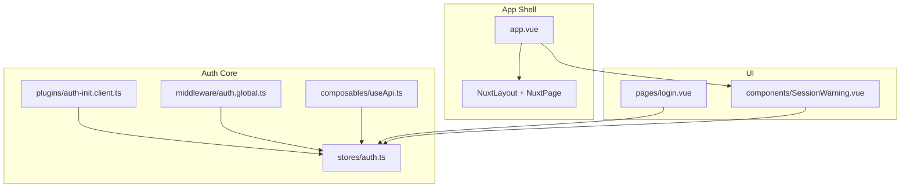
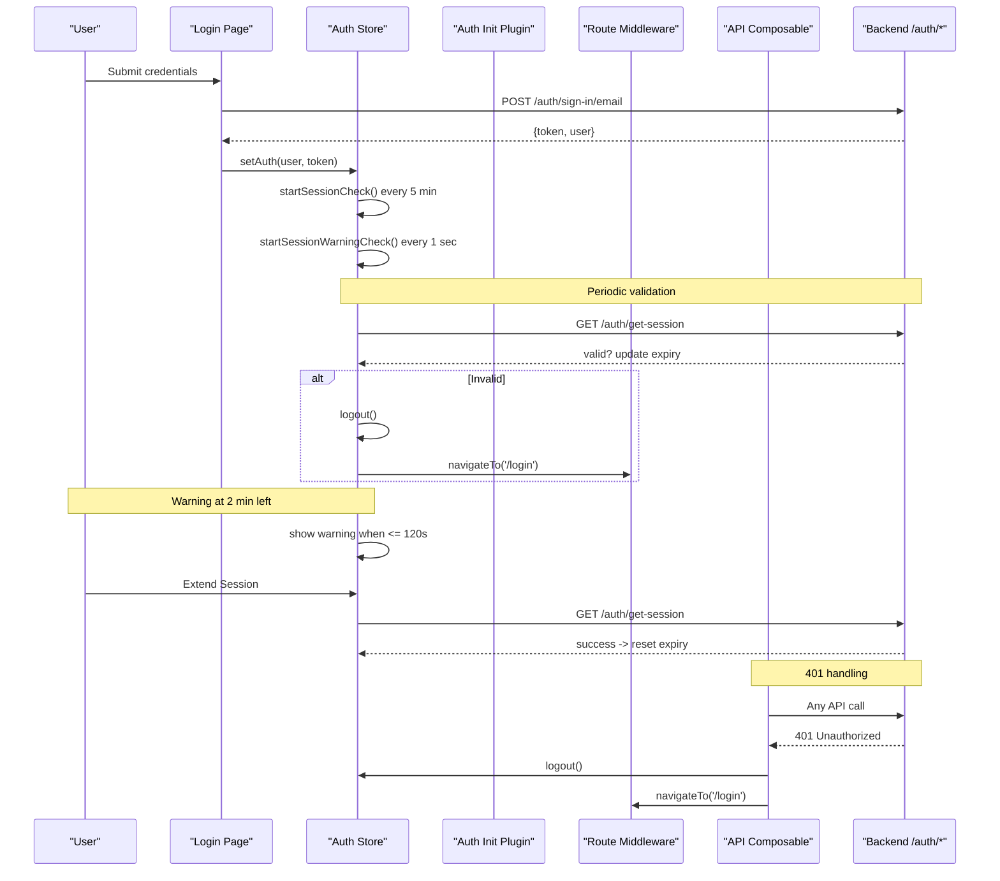
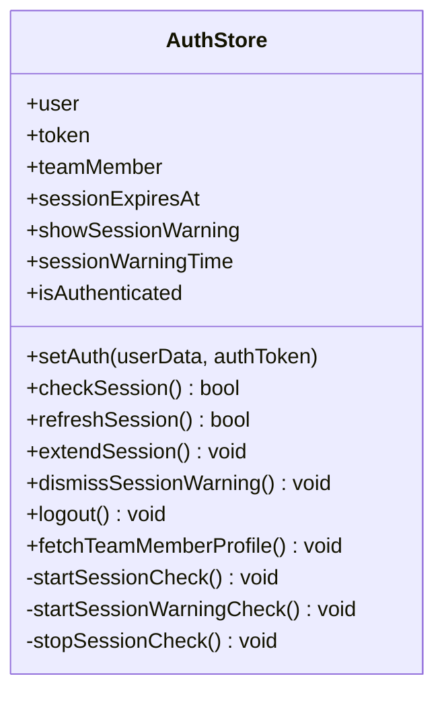
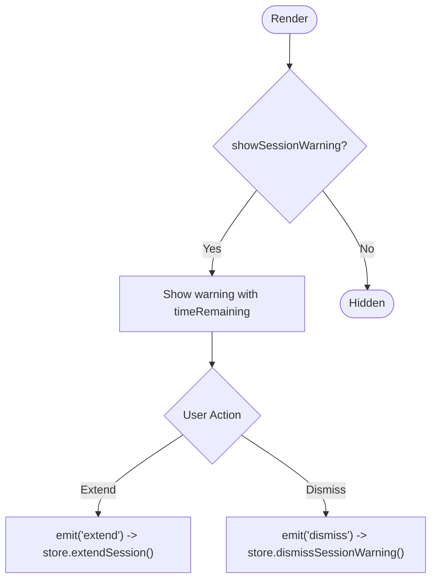
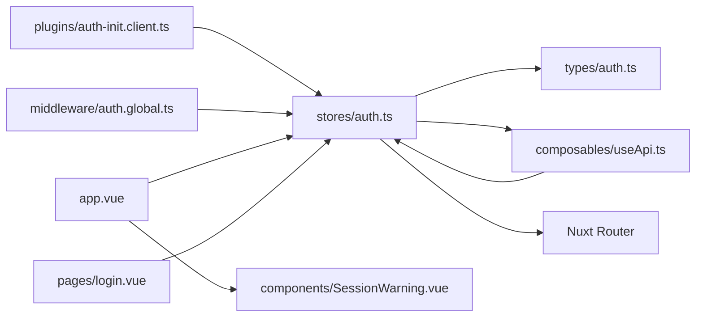

# Session Management

<cite>
**Referenced Files in This Document**
- [auth.ts](file://app/stores/auth.ts)
- [SessionWarning.vue](file://app/components/SessionWarning.vue)
- [auth-init.client.ts](file://app/plugins/auth-init.client.ts)
- [auth.global.ts](file://app/middleware/auth.global.ts)
- [useApi.ts](file://app/composables/useApi.ts)
- [login.vue](file://app/pages/login.vue)
- [app.vue](file://app/app.vue)
- [auth.ts (types)](file://app/types/auth.ts)
</cite>

## Table of Contents
1. [Introduction](#introduction)
2. [Project Structure](#project-structure)
3. [Core Components](#core-components)
4. [Architecture Overview](#architecture-overview)
5. [Detailed Component Analysis](#detailed-component-analysis)
6. [Dependency Analysis](#dependency-analysis)
7. [Performance Considerations](#performance-considerations)
8. [Troubleshooting Guide](#troubleshooting-guide)
9. [Conclusion](#conclusion)
10. [Appendices](#appendices)

## Introduction
This document explains the session management system implemented in the application. It covers:
- Automatic session refresh mechanism
- 30-minute session expiry handling
- Proactive session warning that alerts users 2 minutes before expiration
- Session checking intervals and background validation processes
- Graceful logout procedures
- Examples for customizing behavior, handling session conflicts, and implementing custom persistence strategies

The system is built around a centralized authentication store with two background timers: one to validate sessions periodically and another to display a user-facing warning when the session is about to expire.

## Project Structure
The session management spans several layers:
- Store: central state and lifecycle logic
- UI: warning component and top-level integration
- Middleware: route-level guards
- Plugin: initial session check on app load
- API composable: global error handling for 401 responses
- Types: shared interfaces for auth payloads

**Diagram sources**
- [app.vue:1-33](file://app/app.vue#L1-L33)
- [auth.ts:1-230](file://app/stores/auth.ts#L1-L230)
- [auth-init.client.ts:1-25](file://app/plugins/auth-init.client.ts#L1-L25)
- [auth.global.ts:1-32](file://app/middleware/auth.global.ts#L1-L32)
- [useApi.ts:1-91](file://app/composables/useApi.ts#L1-L91)
- [SessionWarning.vue:1-66](file://app/components/SessionWarning.vue#L1-L66)
- [login.vue:1-167](file://app/pages/login.vue#L1-L167)

**Section sources**
- [auth.ts:1-230](file://app/stores/auth.ts#L1-L230)
- [auth-init.client.ts:1-25](file://app/plugins/auth-init.client.ts#L1-L25)
- [auth.global.ts:1-32](file://app/middleware/auth.global.ts#L1-L32)
- [useApi.ts:1-91](file://app/composables/useApi.ts#L1-L91)
- [SessionWarning.vue:1-66](file://app/components/SessionWarning.vue#L1-L66)
- [login.vue:1-167](file://app/pages/login.vue#L1-L167)
- [app.vue:1-33](file://app/app.vue#L1-L33)

## Core Components
- Authentication store: owns token, user data, session expiry timestamp, and UI flags for warnings. It starts and stops background checks and provides methods to set, refresh, and log out sessions.
- Session warning component: displays a countdown and offers actions to extend or dismiss the warning.
- Route middleware: enforces authentication and validates sessions during navigation.
- Auth initialization plugin: validates an existing session on app startup.
- API composable: intercepts 401 responses to trigger logout and redirect.
- Login page: sets up the session after successful sign-in.

Key behaviors:
- On login, the store sets a 30-minute expiry and starts both background timers.
- Every 5 minutes, the store calls a server endpoint to validate the session; if invalid, it logs out and redirects.
- Every second, the store computes remaining time and shows a warning when within 2 minutes.
- The user can extend the session via the warning UI, which triggers a refresh and resets the expiry.
- Global 401 handling ensures any unauthorized request also results in a graceful logout.

**Section sources**
- [auth.ts:45-84](file://app/stores/auth.ts#L45-L84)
- [auth.ts:90-120](file://app/stores/auth.ts#L90-L120)
- [auth.ts:122-174](file://app/stores/auth.ts#L122-L174)
- [auth.ts:176-201](file://app/stores/auth.ts#L176-L201)
- [auth-init.client.ts:1-25](file://app/plugins/auth-init.client.ts#L1-L25)
- [auth.global.ts:1-32](file://app/middleware/auth.global.ts#L1-L32)
- [useApi.ts:39-44](file://app/composables/useApi.ts#L39-L44)
- [SessionWarning.vue:1-66](file://app/components/SessionWarning.vue#L1-L66)
- [login.vue:48-64](file://app/pages/login.vue#L48-L64)
- [app.vue:20-26](file://app/app.vue#L20-L26)

## Architecture Overview
The session lifecycle integrates multiple layers:

**Diagram sources**
- [login.vue:48-64](file://app/pages/login.vue#L48-L64)
- [auth.ts:45-84](file://app/stores/auth.ts#L45-L84)
- [auth.ts:90-120](file://app/stores/auth.ts#L90-L120)
- [auth.ts:122-174](file://app/stores/auth.ts#L122-L174)
- [auth.ts:176-201](file://app/stores/auth.ts#L176-L201)
- [auth-init.client.ts:1-25](file://app/plugins/auth-init.client.ts#L1-L25)
- [auth.global.ts:21-30](file://app/middleware/auth.global.ts#L21-L30)
- [useApi.ts:39-44](file://app/composables/useApi.ts#L39-L44)

## Detailed Component Analysis

### Authentication Store (State and Lifecycle)
Responsibilities:
- Maintain user, token, team member profile, and session expiry timestamp
- Start/stop periodic session validation and warning timers
- Provide methods to set, refresh, and log out sessions
- Persist state across reloads

Key implementation details:
- Expiry window: 30 minutes from now upon login or successful refresh
- Background validation interval: every 5 minutes
- Warning interval: every 1 second; shows warning when remaining time is ≤ 2 minutes
- Graceful logout clears all state, stops timers, and attempts a server-side sign-out

**Diagram sources**
- [auth.ts:1-230](file://app/stores/auth.ts#L1-L230)

**Section sources**
- [auth.ts:45-84](file://app/stores/auth.ts#L45-L84)
- [auth.ts:90-120](file://app/stores/auth.ts#L90-L120)
- [auth.ts:122-174](file://app/stores/auth.ts#L122-L174)
- [auth.ts:176-201](file://app/stores/auth.ts#L176-L201)
- [auth.ts:203-209](file://app/stores/auth.ts#L203-L209)

### Session Warning UI
Responsibilities:
- Display a countdown formatted as minutes:seconds
- Emit events to extend or dismiss the warning

Integration:
- Rendered conditionally based on store flags
- Bound to store methods for extending and dismissing

**Diagram sources**
- [SessionWarning.vue:1-66](file://app/components/SessionWarning.vue#L1-L66)
- [app.vue:20-26](file://app/app.vue#L20-L26)
- [auth.ts:82-88](file://app/stores/auth.ts#L82-L88)

**Section sources**
- [SessionWarning.vue:1-66](file://app/components/SessionWarning.vue#L1-L66)
- [app.vue:20-26](file://app/app.vue#L20-L26)

### Route Middleware Guard
Responsibilities:
- Allow public routes without authentication
- Redirect unauthenticated users to login
- Validate session on navigation between authenticated pages

Behavior:
- Skips validation on initial load (handled by the init plugin)
- Calls store.checkSession() on subsequent navigations

**Section sources**
- [auth.global.ts:1-32](file://app/middleware/auth.global.ts#L1-L32)

### Auth Initialization Plugin
Responsibilities:
- On app load, if a token exists, validate the session immediately
- Redirect to login if invalid

**Section sources**
- [auth-init.client.ts:1-25](file://app/plugins/auth-init.client.ts#L1-L25)

### API Composable Error Handling
Responsibilities:
- Attach Authorization header automatically
- Handle 401 responses globally by logging out and redirecting

**Section sources**
- [useApi.ts:39-44](file://app/composables/useApi.ts#L39-L44)

### Login Flow
Responsibilities:
- Validate form inputs
- Call sign-in API
- Set auth state and navigate to home

**Section sources**
- [login.vue:48-64](file://app/pages/login.vue#L48-L64)

## Dependency Analysis
The following diagram maps key dependencies among session-related modules:

**Diagram sources**
- [auth.ts:1-230](file://app/stores/auth.ts#L1-L230)
- [auth.ts (types):1-64](file://app/types/auth.ts#L1-L64)
- [auth-init.client.ts:1-25](file://app/plugins/auth-init.client.ts#L1-L25)
- [auth.global.ts:1-32](file://app/middleware/auth.global.ts#L1-L32)
- [useApi.ts:1-91](file://app/composables/useApi.ts#L1-L91)
- [SessionWarning.vue:1-66](file://app/components/SessionWarning.vue#L1-L66)
- [login.vue:1-167](file://app/pages/login.vue#L1-L167)
- [app.vue:1-33](file://app/app.vue#L1-L33)

**Section sources**
- [auth.ts:1-230](file://app/stores/auth.ts#L1-L230)
- [auth.ts (types):1-64](file://app/types/auth.ts#L1-L64)
- [auth-init.client.ts:1-25](file://app/plugins/auth-init.client.ts#L1-L25)
- [auth.global.ts:1-32](file://app/middleware/auth.global.ts#L1-L32)
- [useApi.ts:1-91](file://app/composables/useApi.ts#L1-L91)
- [SessionWarning.vue:1-66](file://app/components/SessionWarning.vue#L1-L66)
- [login.vue:1-167](file://app/pages/login.vue#L1-L167)
- [app.vue:1-33](file://app/app.vue#L1-L33)

## Performance Considerations
- Timer frequency: The warning timer runs every 1 second. While lightweight, consider reducing frequency if you add heavy computations in the future.
- Network calls: The session validation runs every 5 minutes. Ensure the backend endpoint is fast and idempotent.
- State persistence: The store uses a persistence option. Be mindful of what is persisted and how often it updates.
- Memory leaks: Intervals are cleared on logout and when restarting checks. Ensure no other code creates additional intervals without cleanup.

[No sources needed since this section provides general guidance]

## Troubleshooting Guide
Common issues and resolutions:
- Session expires unexpectedly:
  - Check that the server returns a valid response for the session endpoint and that the client updates the expiry timestamp.
  - Verify that the 5-minute background check is running and not being interrupted.
- Warning does not appear:
  - Confirm the store’s showSessionWarning flag is toggled when remaining time is ≤ 2 minutes.
  - Ensure the root component renders the warning when the flag is true.
- 401 errors cause unexpected redirects:
  - The API composable handles 401 by logging out and redirecting. If you need different behavior, adjust the handler accordingly.
- Multiple tabs or devices:
  - Each tab maintains its own store instance. A logout in one tab will not affect others unless you implement cross-tab synchronization.

**Section sources**
- [auth.ts:122-174](file://app/stores/auth.ts#L122-L174)
- [auth.ts:176-201](file://app/stores/auth.ts#L176-L201)
- [useApi.ts:39-44](file://app/composables/useApi.ts#L39-L44)
- [app.vue:20-26](file://app/app.vue#L20-L26)

## Conclusion
The session management system provides robust protection against expired sessions through proactive warnings and background validation. It combines a centralized store with UI components, middleware guards, and global API error handling to deliver a seamless user experience. The design is modular and extensible, allowing customization of timing, persistence, and conflict resolution strategies.

[No sources needed since this section summarizes without analyzing specific files]

## Appendices

### Customization Examples

- Customize session timeout:
  - Change the 30-minute expiry constant used when setting or refreshing the session.
  - Update the warning threshold if you want to warn earlier or later than 2 minutes.

- Adjust checking intervals:
  - Modify the 5-minute background validation interval.
  - Modify the 1-second warning interval if you change the warning strategy.

- Implement custom session persistence:
  - Replace the default persistence configuration with your own storage strategy (e.g., secure cookies or encrypted local storage).
  - Ensure that only necessary fields are persisted and that sensitive tokens are handled securely.

- Handle session conflicts:
  - Detect concurrent logins by comparing stored identifiers with server-provided values.
  - On conflict, invalidate the current session and prompt the user to re-authenticate.

- Add custom session extension logic:
  - Instead of calling the generic refresh method, implement a dedicated “keep-alive” endpoint and call it from the warning’s extend action.

[No sources needed since this section provides general guidance]