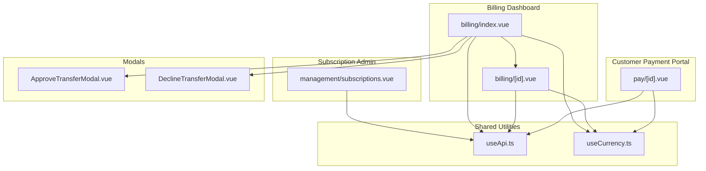
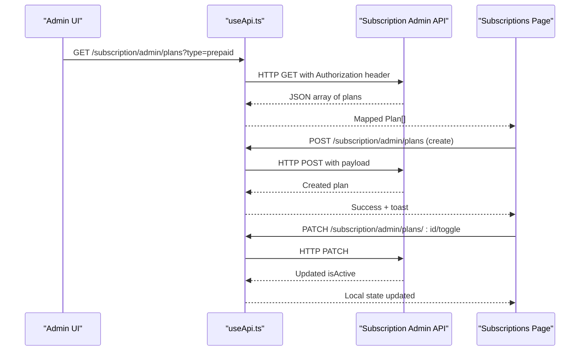
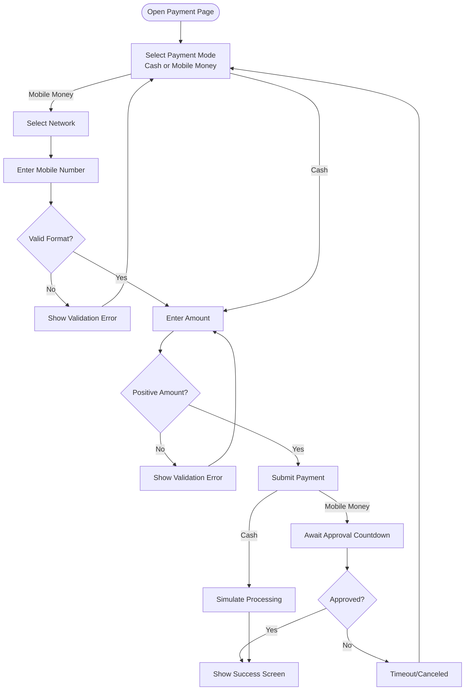
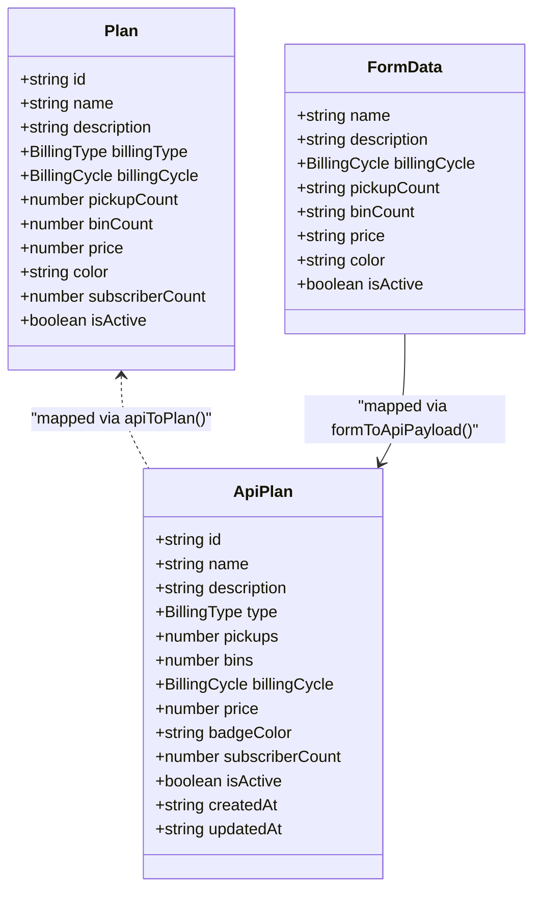
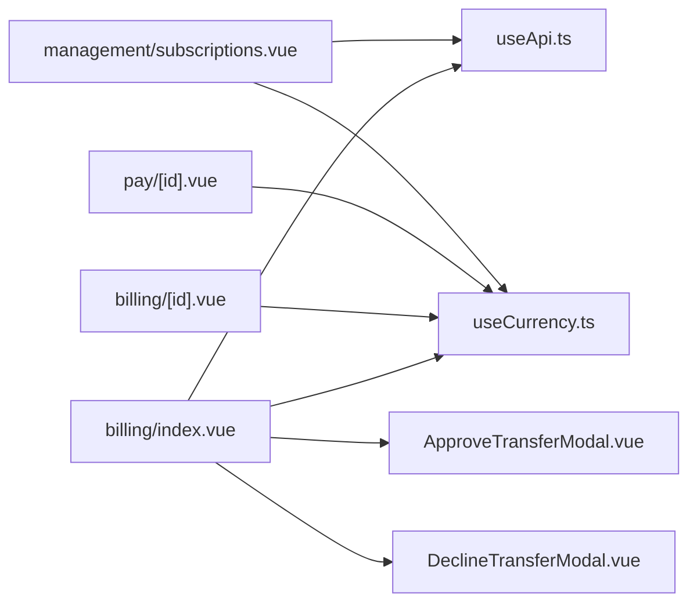

# Billing & Payment Management

<cite>
**Referenced Files in This Document**
- [billing/index.vue](file://app/pages/billing/index.vue)
- [billing/[id].vue](file://app/pages/billing/[id].vue)
- [pay/[id].vue](file://app/pages/pay/[id].vue)
- [management/subscriptions.vue](file://app/pages/management/subscriptions.vue)
- [useApi.ts](file://app/composables/useApi.ts)
- [useCurrency.ts](file://app/composables/useCurrency.ts)
- [ApproveTransferModal.vue](file://app/components/ApproveTransferModal.vue)
- [DeclineTransferModal.vue](file://app/components/DeclineTransferModal.vue)
</cite>

## Table of Contents
1. Introduction
2. Project Structure
3. Core Components
4. Architecture Overview
5. Detailed Component Analysis
6. Dependency Analysis
7. Performance Considerations
8. Troubleshooting Guide
9. Conclusion

## Introduction
This document explains the billing and payment management system implemented in the application. It covers subscription handling, payment processing workflows, invoice generation and management, and revenue reporting capabilities. The documentation describes the billing data model, payment status tracking, and integration points with external services (subscription admin APIs and mobile money providers). It also includes concrete examples for managing subscriptions, processing payments, generating invoices, and viewing billing reports, along with notes on tax calculations, payment reconciliation, and financial reporting features.

## Project Structure
The billing and payment functionality is primarily implemented as Nuxt pages and reusable components:
- Billing dashboard and invoice detail views
- Customer-facing payment portal
- Subscription plan administration
- Shared API client and currency formatting utilities
- Approval/rejection modals for bank transfers

**Diagram sources**
- [billing/index.vue:1-430](file://app/pages/billing/index.vue#L1-L430)
- [billing/[id].vue](file://app/pages/billing/[id].vue#L1-L175)
- [pay/[id].vue](file://app/pages/pay/[id].vue#L1-L353)
- [management/subscriptions.vue:1-800](file://app/pages/management/subscriptions.vue#L1-L800)
- [useApi.ts:1-91](file://app/composables/useApi.ts#L1-L91)
- [useCurrency.ts:1-12](file://app/composables/useCurrency.ts#L1-L12)
- [ApproveTransferModal.vue:1-130](file://app/components/ApproveTransferModal.vue#L1-L130)
- [DeclineTransferModal.vue:1-134](file://app/components/DeclineTransferModal.vue#L1-L134)

**Section sources**
- [billing/index.vue:1-430](file://app/pages/billing/index.vue#L1-L430)
- [billing/[id].vue](file://app/pages/billing/[id].vue#L1-L175)
- [pay/[id].vue](file://app/pages/pay/[id].vue#L1-L353)
- [management/subscriptions.vue:1-800](file://app/pages/management/subscriptions.vue#L1-L800)
- [useApi.ts:1-91](file://app/composables/useApi.ts#L1-L91)
- [useCurrency.ts:1-12](file://app/composables/useCurrency.ts#L1-L12)
- [ApproveTransferModal.vue:1-130](file://app/components/ApproveTransferModal.vue#L1-L130)
- [DeclineTransferModal.vue:1-134](file://app/components/DeclineTransferModal.vue#L1-L134)

## Core Components
- Billing dashboard: Displays pending bank transfers, recent invoices, aging breakdown, and revenue summary. Supports search and pagination.
- Invoice detail view: Renders a printable invoice with line items, subtotal, tax, and total; supports download and send actions.
- Customer payment portal: Allows customers to pay outstanding invoices via cash or mobile money with validation and approval flow.
- Subscription plan administration: Lists plans by billing type (prepaid/postpaid), shows stats, and supports add/edit/toggle/delete operations with API integration.
- Shared utilities: Centralized API client with authentication and error handling; currency formatter for GHS.
- Transfer approval/rejection modals: Enforce verification and confirmation before approving or rejecting bank transfers.

**Section sources**
- [billing/index.vue:1-430](file://app/pages/billing/index.vue#L1-L430)
- [billing/[id].vue](file://app/pages/billing/[id].vue#L1-L175)
- [pay/[id].vue](file://app/pages/pay/[id].vue#L1-L353)
- [management/subscriptions.vue:1-800](file://app/pages/management/subscriptions.vue#L1-L800)
- [useApi.ts:1-91](file://app/composables/useApi.ts#L1-L91)
- [useCurrency.ts:1-12](file://app/composables/useCurrency.ts#L1-L12)
- [ApproveTransferModal.vue:1-130](file://app/components/ApproveTransferModal.vue#L1-L130)
- [DeclineTransferModal.vue:1-134](file://app/components/DeclineTransferModal.vue#L1-L134)

## Architecture Overview
The system follows a page-driven architecture with shared composables for API calls and currency formatting. Data flows from backend APIs into UI state, which drives tables, charts, and forms. External integrations include:
- Subscription admin endpoints for plan CRUD and statistics
- Mobile Money provider prompts (UI flow only; actual provider integration is simulated in this frontend)

**Diagram sources**
- [management/subscriptions.vue:153-238](file://app/pages/management/subscriptions.vue#L153-L238)
- [useApi.ts:1-91](file://app/composables/useApi.ts#L1-L91)

## Detailed Component Analysis

### Billing Dashboard
- Pending Bank Transfers: Searchable, paginated list with approve/decline actions. Approve requires explicit verification; decline allows reason capture and optional email notification.
- Recent Invoices: Searchable, paginated list with plan type badges and status badges; links to invoice detail view.
- Revenue Breakdown: Visualizes monthly subscriptions vs PAYG revenue and outstanding amounts.
- Payment Aging: Donut chart showing current, 1–30 days, 31–60 days, and 60+ days buckets.

Key behaviors:
- Uses currency formatter for consistent display.
- Client-side filtering and pagination.
- Modal-driven approvals/rejections with guardrails.

**Section sources**
- [billing/index.vue:1-430](file://app/pages/billing/index.vue#L1-L430)
- [ApproveTransferModal.vue:1-130](file://app/components/ApproveTransferModal.vue#L1-L130)
- [DeclineTransferModal.vue:1-134](file://app/components/DeclineTransferModal.vue#L1-L134)
- [useCurrency.ts:1-12](file://app/composables/useCurrency.ts#L1-L12)

### Invoice Detail View
- Displays invoice metadata (from/bill-to addresses, dates, payment method).
- Line items table with quantity, rate, and amount.
- Totals section with subtotal, tax, and total.
- Actions: Download PDF and Send.

Notes:
- Tax fields are present in the data model but currently zeroed in the example; tax calculation logic can be extended here.
- Currency formatting applied consistently.

**Section sources**
- [billing/[id].vue](file://app/pages/billing/[id].vue#L1-L175)
- [useCurrency.ts:1-12](file://app/composables/useCurrency.ts#L1-L12)

### Customer Payment Portal
- Presents customer info, outstanding count, and total due.
- Lists outstanding invoices with statuses and amounts.
- Payment modes: Cash and Mobile Money.
- Mobile Money flow:
  - Select network (MTN, Telecel, AirtelTigo).
  - Validate phone number format.
  - Show countdown while awaiting approval.
  - Simulate approval after delay; show success screen.
- Validation:
  - Amount must be positive.
  - MoMo number must match expected pattern when selected.

**Diagram sources**
- [pay/[id].vue](file://app/pages/pay/[id].vue#L1-L353)

**Section sources**
- [pay/[id].vue](file://app/pages/pay/[id].vue#L1-L353)
- [useCurrency.ts:1-12](file://app/composables/useCurrency.ts#L1-L12)

### Subscription Plan Administration
- Tabs for prepaid and postpaid plans.
- Stats cards: total plans, active plans, subscribers, estimated revenue.
- Plan cards: name, description, subscriber count, active/inactive status, features (pickups, bins), price, billing cycle, billing type.
- Actions: Add, Edit, Toggle Active, Delete.
- API integration:
  - Fetch plans and stats with query parameter for billing type.
  - Create plan via POST.
  - Update plan via PATCH.
  - Toggle plan status via PATCH.
  - Delete plan via DELETE.
- Error handling:
  - 401 redirects to login.
  - Other errors displayed via toast.
  - Validation errors surfaced in modal for create/update.

**Diagram sources**
- [management/subscriptions.vue:1-130](file://app/pages/management/subscriptions.vue#L1-L130)

**Section sources**
- [management/subscriptions.vue:1-800](file://app/pages/management/subscriptions.vue#L1-L800)
- [useApi.ts:1-91](file://app/composables/useApi.ts#L1-L91)

## Dependency Analysis
- Pages depend on useApi for authenticated requests and useCurrency for consistent formatting.
- Modals encapsulate user confirmations and emit events to parent pages for action handling.
- Subscription page implements robust mapping between API responses and UI models, handling multiple response shapes.

**Diagram sources**
- [billing/index.vue:1-430](file://app/pages/billing/index.vue#L1-L430)
- [billing/[id].vue](file://app/pages/billing/[id].vue#L1-L175)
- [pay/[id].vue](file://app/pages/pay/[id].vue#L1-L353)
- [management/subscriptions.vue:1-800](file://app/pages/management/subscriptions.vue#L1-L800)
- [useApi.ts:1-91](file://app/composables/useApi.ts#L1-L91)
- [useCurrency.ts:1-12](file://app/composables/useCurrency.ts#L1-L12)
- [ApproveTransferModal.vue:1-130](file://app/components/ApproveTransferModal.vue#L1-L130)
- [DeclineTransferModal.vue:1-134](file://app/components/DeclineTransferModal.vue#L1-L134)

**Section sources**
- [billing/index.vue:1-430](file://app/pages/billing/index.vue#L1-L430)
- [billing/[id].vue](file://app/pages/billing/[id].vue#L1-L175)
- [pay/[id].vue](file://app/pages/pay/[id].vue#L1-L353)
- [management/subscriptions.vue:1-800](file://app/pages/management/subscriptions.vue#L1-L800)
- [useApi.ts:1-91](file://app/composables/useApi.ts#L1-L91)
- [useCurrency.ts:1-12](file://app/composables/useCurrency.ts#L1-L12)
- [ApproveTransferModal.vue:1-130](file://app/components/ApproveTransferModal.vue#L1-L130)
- [DeclineTransferModal.vue:1-134](file://app/components/DeclineTransferModal.vue#L1-L134)

## Performance Considerations
- Client-side filtering and pagination reduce server load for lists like transfers and invoices.
- Debouncing search inputs could further improve responsiveness for large datasets.
- Avoid unnecessary re-renders by keeping computed properties focused and minimizing deep reactive updates.
- For charts, consider lazy initialization and memoization if datasets grow significantly.

[No sources needed since this section provides general guidance]

## Troubleshooting Guide
- Authentication failures:
  - 401 responses trigger logout and redirect to login automatically via the API client.
- General request errors:
  - Non-success status codes throw errors with messages extracted from response payloads; wrapped methods show toasts.
- Subscription plan creation/update:
  - Validation errors (e.g., duplicate names) are surfaced in modals rather than toasts.
- Mobile Money flow:
  - Ensure phone number matches expected pattern; verify network selection and amount positivity before submission.
- Bank transfer approvals:
  - Confirm checkbox must be checked to approve; rejection allows capturing reasons and optionally notifying customers.

**Section sources**
- [useApi.ts:1-91](file://app/composables/useApi.ts#L1-L91)
- [management/subscriptions.vue:289-450](file://app/pages/management/subscriptions.vue#L289-L450)
- [pay/[id].vue](file://app/pages/pay/[id].vue#L64-L97)
- [ApproveTransferModal.vue:18-24](file://app/components/ApproveTransferModal.vue#L18-L24)
- [DeclineTransferModal.vue:18-23](file://app/components/DeclineTransferModal.vue#L18-L23)

## Conclusion
The billing and payment system provides a comprehensive front-end experience for managing subscriptions, processing payments, generating invoices, and reviewing financial metrics. It integrates with subscription admin APIs for plan lifecycle management and simulates mobile money payments with clear user feedback. The design emphasizes usability, validation, and consistent presentation through shared utilities. Future enhancements may include server-side tax computation, richer reconciliation workflows, and deeper integrations with external payment processors.

[No sources needed since this section summarizes without analyzing specific files]