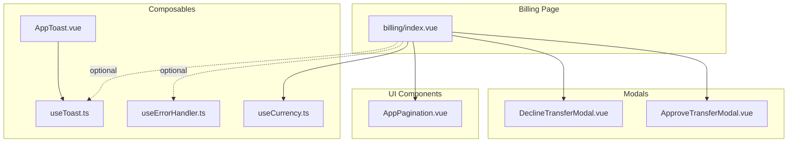
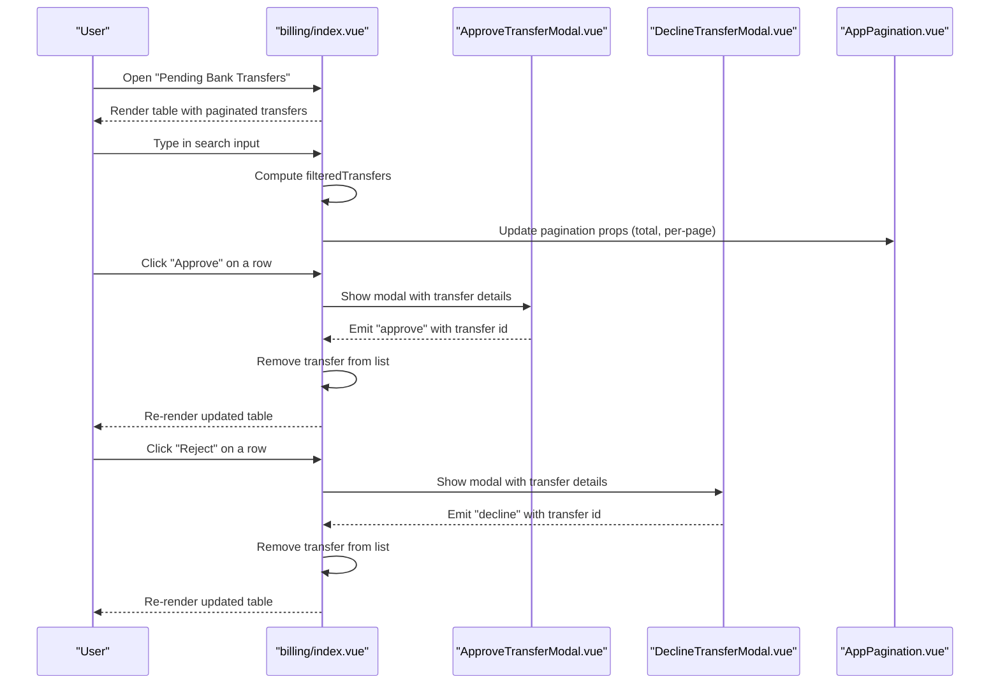
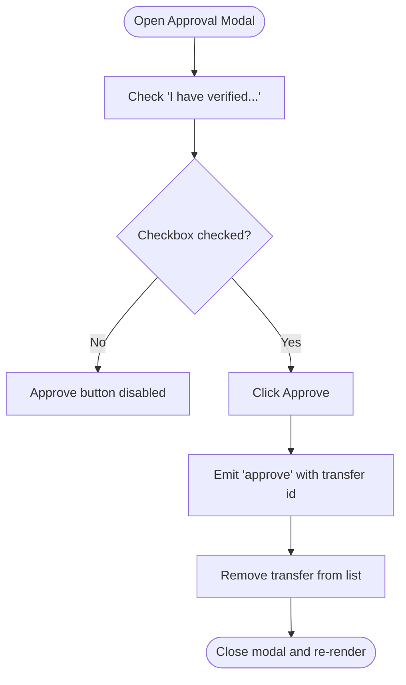
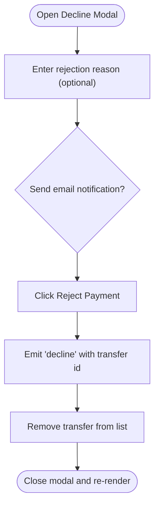
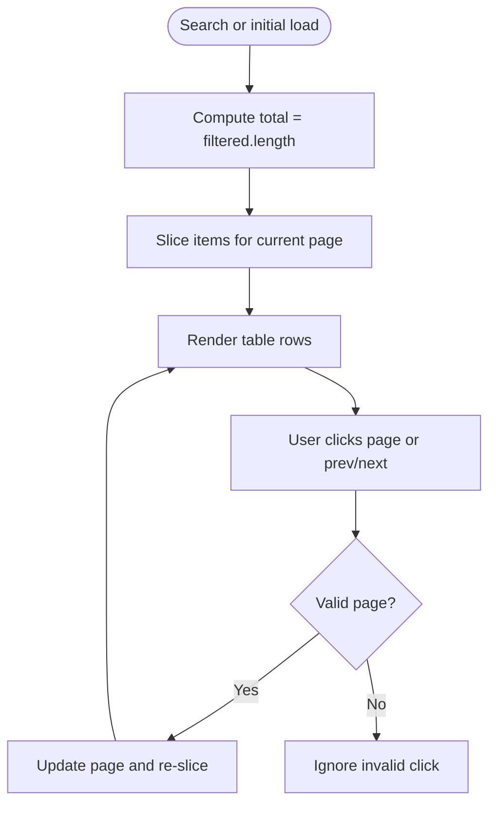
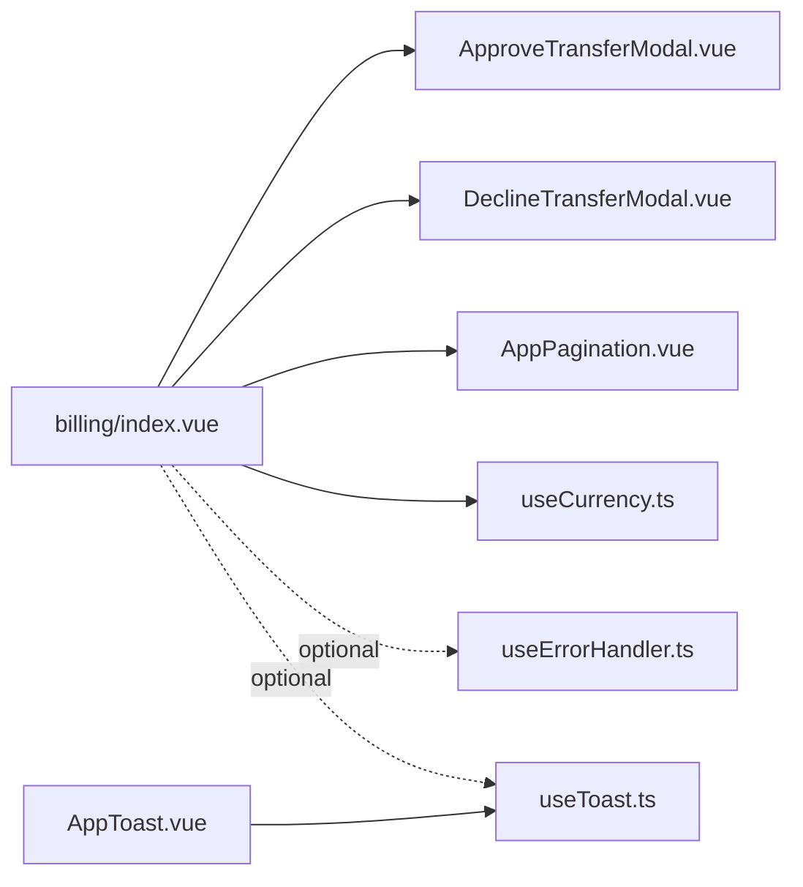

# Bank Transfers Management

<cite>
**Referenced Files in This Document**
- [billing/index.vue](file://app/pages/billing/index.vue)
- [ApproveTransferModal.vue](file://app/components/ApproveTransferModal.vue)
- [DeclineTransferModal.vue](file://app/components/DeclineTransferModal.vue)
- [AppPagination.vue](file://app/components/AppPagination.vue)
- [useCurrency.ts](file://app/composables/useCurrency.ts)
- [useErrorHandler.ts](file://app/composables/useErrorHandler.ts)
- [useToast.ts](file://app/composables/useToast.ts)
- [AppToast.vue](file://app/components/AppToast.vue)
</cite>

## Table of Contents
1. [Introduction](#introduction)
2. [Project Structure](#project-structure)
3. [Core Components](#core-components)
4. [Architecture Overview](#architecture-overview)
5. [Detailed Component Analysis](#detailed-component-analysis)
6. [Dependency Analysis](#dependency-analysis)
7. [Performance Considerations](#performance-considerations)
8. [Troubleshooting Guide](#troubleshooting-guide)
9. [Conclusion](#conclusion)

## Introduction
This document explains the bank transfers management system for reviewing and processing pending customer bank transfers. It covers:
- Listing pending transfers
- Searching by customer name, transfer ID, payment type, or reference number
- Approving and declining workflows with modal interactions and confirmation steps
- Data structure for a transfer record
- Pagination behavior for large lists
- Error handling and user feedback patterns

The implementation is client-side only at this stage, using local state to simulate listing, filtering, pagination, and approval/decline actions.

## Project Structure
The bank transfers feature is implemented primarily within the Billing page and supporting UI components:
- Page: billing index page hosts the pending transfers table, search input, pagination, and modals
- Modals: approve and decline transfer modals present details and confirm actions
- Pagination: reusable pagination component handles page navigation and range display
- Utilities: currency formatting and toast/error helpers provide consistent UX

**Diagram sources**
- [billing/index.vue:1-430](file://app/pages/billing/index.vue#L1-L430)
- [ApproveTransferModal.vue:1-130](file://app/components/ApproveTransferModal.vue#L1-L130)
- [DeclineTransferModal.vue:1-134](file://app/components/DeclineTransferModal.vue#L1-L134)
- [AppPagination.vue:1-48](file://app/components/AppPagination.vue#L1-L48)
- [useCurrency.ts:1-12](file://app/composables/useCurrency.ts#L1-L12)
- [useErrorHandler.ts:1-29](file://app/composables/useErrorHandler.ts#L1-L29)
- [useToast.ts:1-37](file://app/composables/useToast.ts#L1-L37)
- [AppToast.vue:1-115](file://app/components/AppToast.vue#L1-L115)

**Section sources**
- [billing/index.vue:1-430](file://app/pages/billing/index.vue#L1-L430)
- [ApproveTransferModal.vue:1-130](file://app/components/ApproveTransferModal.vue#L1-L130)
- [DeclineTransferModal.vue:1-134](file://app/components/DeclineTransferModal.vue#L1-L134)
- [AppPagination.vue:1-48](file://app/components/AppPagination.vue#L1-L48)
- [useCurrency.ts:1-12](file://app/composables/useCurrency.ts#L1-L12)
- [useErrorHandler.ts:1-29](file://app/composables/useErrorHandler.ts#L1-L29)
- [useToast.ts:1-37](file://app/composables/useToast.ts#L1-L37)
- [AppToast.vue:1-115](file://app/components/AppToast.vue#L1-L115)

## Core Components
- Pending transfers list: displays paginated rows with Transfer ID, Customer, Payment Type (Pickup/Subscription), Amount, Reference, Submitted date, and action buttons for Approve and Reject.
- Search input: filters the list by customer name, transfer ID, payment type, or reference number.
- Approval modal: shows transfer details, requires explicit verification checkbox before enabling approval.
- Decline modal: shows transfer details, allows entering a rejection reason and toggling an email notification option.
- Pagination: shows current range and supports navigating pages; resets on search changes.
- Currency formatter: formats amounts consistently using locale-specific currency rules.

Key responsibilities:
- State management for transfers, search query, and active page
- Computed filtering and slicing for pagination
- Modal visibility and selected transfer context
- Emitting events from modals to update parent state

**Section sources**
- [billing/index.vue:34-62](file://app/pages/billing/index.vue#L34-L62)
- [billing/index.vue:175-272](file://app/pages/billing/index.vue#L175-L272)
- [ApproveTransferModal.vue:1-130](file://app/components/ApproveTransferModal.vue#L1-L130)
- [DeclineTransferModal.vue:1-134](file://app/components/DeclineTransferModal.vue#L1-L134)
- [AppPagination.vue:1-48](file://app/components/AppPagination.vue#L1-L48)
- [useCurrency.ts:1-12](file://app/composables/useCurrency.ts#L1-L12)

## Architecture Overview
The billing page orchestrates the pending transfers workflow:
- The page holds the source data and computed filtered/paginated views
- Users interact with the search input to filter results
- Rows render with Approve and Reject buttons that open respective modals
- Modals emit events back to the page to remove the processed transfer from the list
- Pagination updates the visible slice based on the current page and per-page size

**Diagram sources**
- [billing/index.vue:175-272](file://app/pages/billing/index.vue#L175-L272)
- [ApproveTransferModal.vue:1-130](file://app/components/ApproveTransferModal.vue#L1-L130)
- [DeclineTransferModal.vue:1-134](file://app/components/DeclineTransferModal.vue#L1-L134)
- [AppPagination.vue:1-48](file://app/components/AppPagination.vue#L1-L48)

## Detailed Component Analysis

### Transfer Data Model
A transfer record includes:
- Transfer ID: unique identifier
- Customer: customer name
- Payment Type: Pickup or Subscription
- Amount: numeric value formatted via currency utility
- Reference: alphanumeric reference string
- Submitted: submission date string

These fields are displayed in both the table and modals.

**Section sources**
- [billing/index.vue:34-42](file://app/pages/billing/index.vue#L34-L42)
- [ApproveTransferModal.vue:2-11](file://app/components/ApproveTransferModal.vue#L2-L11)
- [DeclineTransferModal.vue:2-11](file://app/components/DeclineTransferModal.vue#L2-L11)

### Listing and Search
- Source list: defined locally in the billing page
- Filter logic: case-insensitive substring match across customer, ID, payment type, and reference
- Reset behavior: searching resets pagination to page 1
- Empty state: shows a message when no matches exist

Examples of searches:
- By customer name: enter part of the customer’s name to narrow results
- By transfer ID: enter the exact or partial ID
- By payment type: enter “Pickup” or “Subscription”
- By reference: enter the full or partial reference number

**Section sources**
- [billing/index.vue:44-64](file://app/pages/billing/index.vue#L44-L64)
- [billing/index.vue:187-198](file://app/pages/billing/index.vue#L187-L198)
- [billing/index.vue:256-258](file://app/pages/billing/index.vue#L256-L258)

### Approval Workflow
- Opening approval: clicking Approve opens the approval modal with preformatted amount
- Confirmation: user must check a verification checkbox to enable the Approve button
- Action: emits an event with the transfer ID; the page removes the transfer from the list
- Feedback: currently no toast is shown on success; can be integrated using error handler/toast utilities

**Diagram sources**
- [ApproveTransferModal.vue:18-23](file://app/components/ApproveTransferModal.vue#L18-L23)
- [billing/index.vue:21-30](file://app/pages/billing/index.vue#L21-L30)

**Section sources**
- [ApproveTransferModal.vue:1-130](file://app/components/ApproveTransferModal.vue#L1-L130)
- [billing/index.vue:18-30](file://app/pages/billing/index.vue#L18-L30)

### Decline Workflow
- Opening decline: clicking Reject opens the decline modal with transfer details
- Reason entry: optional text area for rejection reason
- Email toggle: option to send a notification email to the customer
- Action: emits an event with the transfer ID; the page removes the transfer from the list

**Diagram sources**
- [DeclineTransferModal.vue:18-23](file://app/components/DeclineTransferModal.vue#L18-L23)
- [billing/index.vue:7-16](file://app/pages/billing/index.vue#L7-L16)

**Section sources**
- [DeclineTransferModal.vue:1-134](file://app/components/DeclineTransferModal.vue#L1-L134)
- [billing/index.vue:4-16](file://app/pages/billing/index.vue#L4-L16)

### Pagination Handling
- Per-page size: fixed at 5 for transfers
- Total count: derived from filtered results
- Navigation: previous, next, and numbered pages
- Range display: shows “Showing X-Y of Z”
- Search reset: switching search queries resets to page 1

**Diagram sources**
- [billing/index.vue:44-64](file://app/pages/billing/index.vue#L44-L64)
- [AppPagination.vue:12-19](file://app/components/AppPagination.vue#L12-L19)

**Section sources**
- [billing/index.vue:44-64](file://app/pages/billing/index.vue#L44-L64)
- [AppPagination.vue:1-48](file://app/components/AppPagination.vue#L1-L48)

### Currency Formatting
- Uses a locale-aware formatter for GHS with two decimal places
- Applied to amounts in the table and modals

**Section sources**
- [useCurrency.ts:1-12](file://app/composables/useCurrency.ts#L1-L12)
- [billing/index.vue:32](file://app/pages/billing/index.vue#L32)

## Dependency Analysis
- billing/index.vue depends on:
  - ApproveTransferModal.vue and DeclineTransferModal.vue for confirmation flows
  - AppPagination.vue for navigation
  - useCurrency for amount formatting
  - Optionally useErrorHandler and useToast for robust error feedback
- Modals depend on:
  - Props for transfer details
  - Emits to communicate actions back to the parent
- Pagination depends on:
  - Props for current page, total, and per-page
  - Emits to update the parent page

**Diagram sources**
- [billing/index.vue:1-430](file://app/pages/billing/index.vue#L1-L430)
- [ApproveTransferModal.vue:1-130](file://app/components/ApproveTransferModal.vue#L1-L130)
- [DeclineTransferModal.vue:1-134](file://app/components/DeclineTransferModal.vue#L1-L134)
- [AppPagination.vue:1-48](file://app/components/AppPagination.vue#L1-L48)
- [useCurrency.ts:1-12](file://app/composables/useCurrency.ts#L1-L12)
- [useErrorHandler.ts:1-29](file://app/composables/useErrorHandler.ts#L1-L29)
- [useToast.ts:1-37](file://app/composables/useToast.ts#L1-L37)
- [AppToast.vue:1-115](file://app/components/AppToast.vue#L1-L115)

**Section sources**
- [billing/index.vue:1-430](file://app/pages/billing/index.vue#L1-L430)
- [ApproveTransferModal.vue:1-130](file://app/components/ApproveTransferModal.vue#L1-L130)
- [DeclineTransferModal.vue:1-134](file://app/components/DeclineTransferModal.vue#L1-L134)
- [AppPagination.vue:1-48](file://app/components/AppPagination.vue#L1-L48)
- [useCurrency.ts:1-12](file://app/composables/useCurrency.ts#L1-L12)
- [useErrorHandler.ts:1-29](file://app/composables/useErrorHandler.ts#L1-L29)
- [useToast.ts:1-37](file://app/composables/useToast.ts#L1-L37)
- [AppToast.vue:1-115](file://app/components/AppToast.vue#L1-L115)

## Performance Considerations
- Filtering runs on every keystroke; for very large datasets consider debouncing the search input or moving filtering to the server.
- Pagination slices arrays client-side; ensure per-page size remains reasonable to avoid heavy DOM rendering.
- Avoid unnecessary re-renders by keeping computed properties minimal and stable.

[No sources needed since this section provides general guidance]

## Troubleshooting Guide
Common issues and resolutions:
- Approve button not clickable: ensure the verification checkbox is checked in the approval modal.
- No results after search: verify the query matches one of the searchable fields (customer, ID, payment type, reference).
- Pagination not updating: confirm the total reflects filtered results and per-page is set correctly.
- Missing user feedback: integrate useErrorHandler and useToast to show success or error toasts after backend operations.

Integration points for error handling and notifications:
- useErrorHandler.run wraps async calls and shows toasts automatically on failure
- useToast exposes success/error/warning/info methods
- AppToast renders stacked notifications with dismiss controls

**Section sources**
- [ApproveTransferModal.vue:18-23](file://app/components/ApproveTransferModal.vue#L18-L23)
- [billing/index.vue:44-64](file://app/pages/billing/index.vue#L44-L64)
- [useErrorHandler.ts:1-29](file://app/composables/useErrorHandler.ts#L1-L29)
- [useToast.ts:1-37](file://app/composables/useToast.ts#L1-L37)
- [AppToast.vue:1-115](file://app/components/AppToast.vue#L1-L115)

## Conclusion
The bank transfers management system provides a clear, interactive workflow for reviewing and processing pending transfers. It supports efficient search and pagination, enforces careful approvals through explicit verification, and offers a structured decline process with optional messaging. While currently client-side, it is well-positioned to integrate with backend APIs and error-handling utilities for production-grade reliability and user feedback.