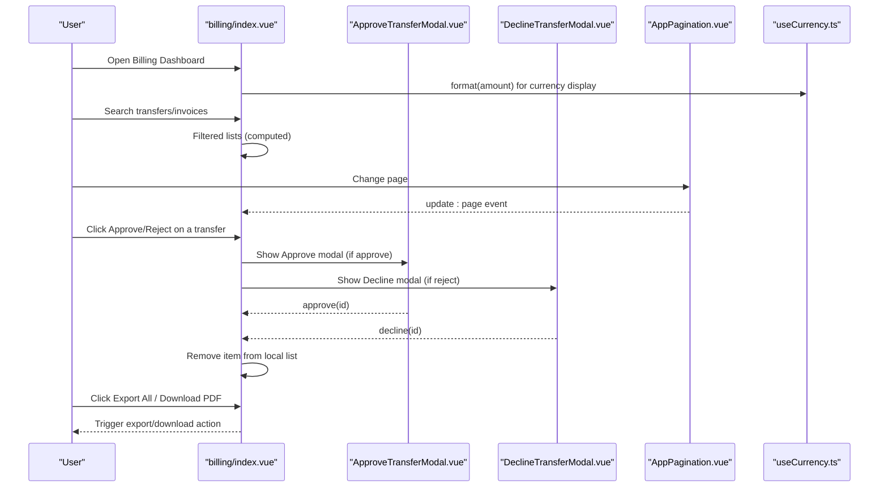
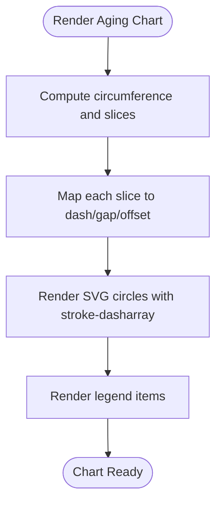
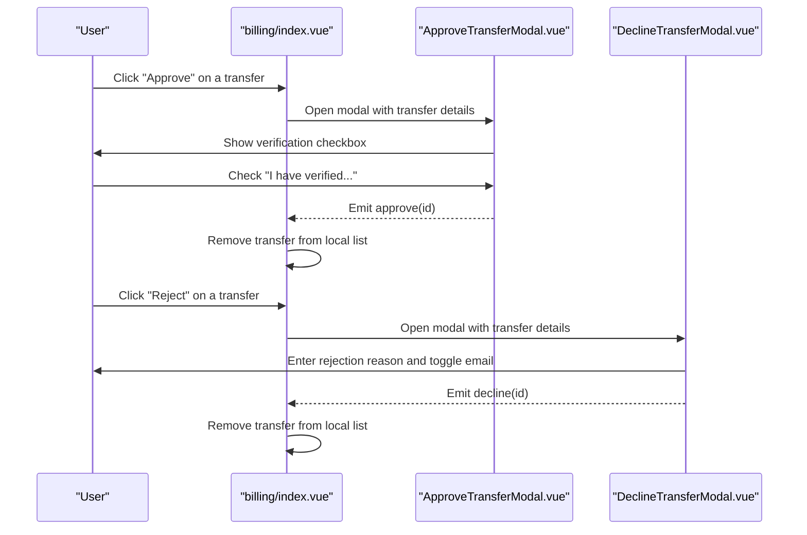
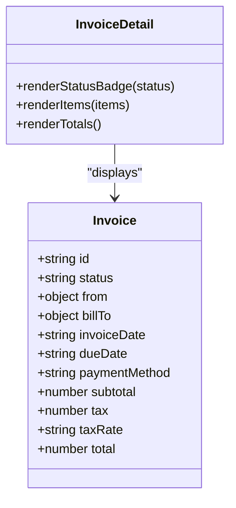
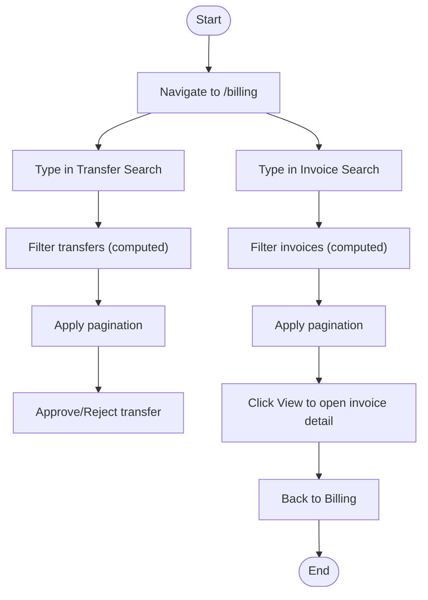
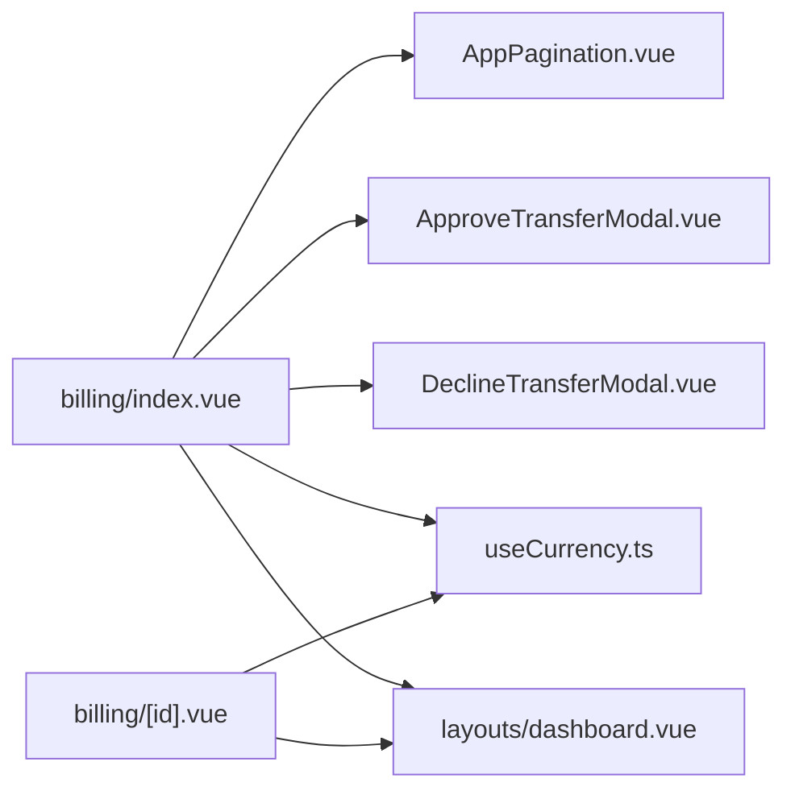

# Billing Dashboard & Overview

<cite>
**Referenced Files in This Document**
- [billing/index.vue](file://app/pages/billing/index.vue)
- [billing/[id].vue](file://app/pages/billing/[id].vue)
- [ApproveTransferModal.vue](file://app/components/ApproveTransferModal.vue)
- [DeclineTransferModal.vue](file://app/components/DeclineTransferModal.vue)
- [AppPagination.vue](file://app/components/AppPagination.vue)
- [useCurrency.ts](file://app/composables/useCurrency.ts)
- [dashboard.vue](file://app/layouts/dashboard.vue)
</cite>

## Table of Contents
1. [Introduction](#introduction)
2. [Project Structure](#project-structure)
3. [Core Components](#core-components)
4. [Architecture Overview](#architecture-overview)
5. [Detailed Component Analysis](#detailed-component-analysis)
6. [Dependency Analysis](#dependency-analysis)
7. [Performance Considerations](#performance-considerations)
8. [Troubleshooting Guide](#troubleshooting-guide)
9. [Conclusion](#conclusion)
10. [Appendices](#appendices)

## Introduction
This document explains the Billing Dashboard and Overview interface, focusing on financial metrics display, revenue breakdown visualization, payment aging analysis, and pending bank transfer management. It also covers stat cards (total outstanding amounts, subscription revenue, PAYG revenue, average collection time), navigation and search workflows, approval workflow for bank transfers, invoice status tracking, and export capabilities for financial reporting.

## Project Structure
The billing dashboard is implemented as a Nuxt page with supporting components and composables:
- Page: app/pages/billing/index.vue
- Invoice detail page: app/pages/billing/[id].vue
- Modals for approvals/rejections: ApproveTransferModal.vue, DeclineTransferModal.vue
- Pagination component: AppPagination.vue
- Currency formatting composable: useCurrency.ts
- Layout wrapper: dashboard.vue

```mermaid
graph TB
subgraph "Billing Pages"
BIndex["billing/index.vue"]
BId["billing/[id].vue"]
end
subgraph "Components"
Approve["ApproveTransferModal.vue"]
Decline["DeclineTransferModal.vue"]
Pagination["AppPagination.vue"]
end
subgraph "Composables"
Currency["useCurrency.ts"]
end
subgraph "Layout"
Layout["layouts/dashboard.vue"]
end
BIndex --> Approve
BIndex --> Decline
BIndex --> Pagination
BIndex --> Currency
BId --> Currency
BIndex --> Layout
BId --> Layout
```

**Diagram sources**
- [billing/index.vue:1-430](file://app/pages/billing/index.vue#L1-L430)
- [billing/[id].vue](file://app/pages/billing/[id].vue#L1-L175)
- [ApproveTransferModal.vue:1-130](file://app/components/ApproveTransferModal.vue#L1-L130)
- [DeclineTransferModal.vue:1-134](file://app/components/DeclineTransferModal.vue#L1-L134)
- [AppPagination.vue:1-48](file://app/components/AppPagination.vue#L1-L48)
- [useCurrency.ts:1-12](file://app/composables/useCurrency.ts#L1-L12)
- [dashboard.vue:1-25](file://app/layouts/dashboard.vue#L1-L25)

**Section sources**
- [billing/index.vue:1-430](file://app/pages/billing/index.vue#L1-L430)
- [billing/[id].vue:1-175](file://app/pages/billing/[id].vue#L1-L175)
- [ApproveTransferModal.vue:1-130](file://app/components/ApproveTransferModal.vue#L1-L130)
- [DeclineTransferModal.vue:1-134](file://app/components/DeclineTransferModal.vue#L1-L134)
- [AppPagination.vue:1-48](file://app/components/AppPagination.vue#L1-L48)
- [useCurrency.ts:1-12](file://app/composables/useCurrency.ts#L1-L12)
- [dashboard.vue:1-25](file://app/layouts/dashboard.vue#L1-L25)

## Core Components
- Stat Cards: Display key financial KPIs such as total outstanding, subscription revenue, PAYG revenue, and average collection time.
- Pending Bank Transfers Table: Lists incoming bank transfers awaiting review; supports search and pagination; includes approve/reject actions.
- Payment Aging Donut Chart: Visualizes overdue buckets (current, 1–30 days, 31–60 days, 60+ days).
- Revenue Breakdown Panel: Shows proportions of monthly subscriptions vs PAYG vs outstanding.
- Recent Invoices Table: Lists invoices with plan type, amount, date, and status; supports search and pagination; links to invoice details.
- Approval Workflow Modals: Confirm and approve or reject bank transfers with verification steps and optional notifications.
- Export Controls: “Export All” button on the dashboard and “Download PDF” on individual invoice pages.

**Section sources**
- [billing/index.vue:152-173](file://app/pages/billing/index.vue#L152-L173)
- [billing/index.vue:175-272](file://app/pages/billing/index.vue#L175-L272)
- [billing/index.vue:274-325](file://app/pages/billing/index.vue#L274-L325)
- [billing/index.vue:327-412](file://app/pages/billing/index.vue#L327-L412)
- [ApproveTransferModal.vue:1-130](file://app/components/ApproveTransferModal.vue#L1-L130)
- [DeclineTransferModal.vue:1-134](file://app/components/DeclineTransferModal.vue#L1-L134)
- [billing/[id].vue:66-L82](file://app/pages/billing/[id].vue#L66-L82)

## Architecture Overview
The billing dashboard is a single-page view composed of multiple sections. Data is currently represented as local reactive arrays for demo purposes. The UI uses computed filters and pagination to manage large lists. Charts are rendered via SVG elements directly in the template.



**Diagram sources**
- [billing/index.vue:1-430](file://app/pages/billing/index.vue#L1-L430)
- [ApproveTransferModal.vue:1-130](file://app/components/ApproveTransferModal.vue#L1-L130)
- [DeclineTransferModal.vue:1-134](file://app/components/DeclineTransferModal.vue#L1-L134)
- [AppPagination.vue:1-48](file://app/components/AppPagination.vue#L1-L48)
- [useCurrency.ts:1-12](file://app/composables/useCurrency.ts#L1-L12)

## Detailed Component Analysis

### Financial Metrics and Stat Cards
- Purpose: Provide at-a-glance insight into overall financial health.
- Metrics:
  - Total Outstanding: Sum of unpaid balances.
  - Subscription Revenue: Monthly recurring revenue from subscriptions.
  - PAYG Revenue: Pay-as-you-go revenue.
  - Average Collection Time: Days to collect payments.
- Implementation: Rendered as four stat cards with icons and formatted values using the currency composable.

**Section sources**
- [billing/index.vue:152-173](file://app/pages/billing/index.vue#L152-L173)
- [useCurrency.ts:1-12](file://app/composables/useCurrency.ts#L1-L12)

### Revenue Breakdown Visualization
- Purpose: Show composition of revenue across categories.
- Categories: Monthly Subscriptions, Pay-as-you-go, Outstanding.
- Visualization: Horizontal progress bars with percentage widths and color-coded labels.

**Section sources**
- [billing/index.vue:102-106](file://app/pages/billing/index.vue#L102-L106)
- [billing/index.vue:306-325](file://app/pages/billing/index.vue#L306-L325)

### Payment Aging Analysis
- Purpose: Analyze receivables by aging buckets to prioritize collections.
- Buckets: Current, 1–30 days, 31–60 days, 60+ days.
- Visualization: SVG donut chart with segments proportional to percentages and a legend.



**Diagram sources**
- [billing/index.vue:127-139](file://app/pages/billing/index.vue#L127-L139)
- [billing/index.vue:277-304](file://app/pages/billing/index.vue#L277-L304)

**Section sources**
- [billing/index.vue:108-113](file://app/pages/billing/index.vue#L108-L113)
- [billing/index.vue:127-139](file://app/pages/billing/index.vue#L127-L139)
- [billing/index.vue:277-304](file://app/pages/billing/index.vue#L277-L304)

### Pending Bank Transfer Management
- Purpose: Review and process customer bank transfer submissions.
- Features:
  - Searchable table with fields: Transfer ID, Customer, Payment Type, Amount, Reference, Submitted Date.
  - Actions: Approve or Reject per row.
  - Pagination for long lists.
- Approval Workflow:
  - Approve: Requires explicit verification checkbox before enabling approval.
  - Reject: Allows entering a reason and toggling email notification.



**Diagram sources**
- [billing/index.vue:18-30](file://app/pages/billing/index.vue#L18-L30)
- [ApproveTransferModal.vue:18-24](file://app/components/ApproveTransferModal.vue#L18-L24)
- [DeclineTransferModal.vue:18-24](file://app/components/DeclineTransferModal.vue#L18-L24)

**Section sources**
- [billing/index.vue:34-64](file://app/pages/billing/index.vue#L34-L64)
- [billing/index.vue:175-272](file://app/pages/billing/index.vue#L175-L272)
- [ApproveTransferModal.vue:1-130](file://app/components/ApproveTransferModal.vue#L1-L130)
- [DeclineTransferModal.vue:1-134](file://app/components/DeclineTransferModal.vue#L1-L134)

### Invoice Status Tracking and Details
- Purpose: Track invoice lifecycle and provide detailed views.
- Statuses: Paid, Pending, Overdue.
- Detail View: Displays invoice header, parties, dates, line items, totals, and actions (download/send).



**Diagram sources**
- [billing/[id].vue:9-L34](file://app/pages/billing/[id].vue#L9-L34)
- [billing/[id].vue:36-L41](file://app/pages/billing/[id].vue#L36-L41)

**Section sources**
- [billing/index.vue:66-98](file://app/pages/billing/index.vue#L66-L98)
- [billing/index.vue:120-125](file://app/pages/billing/index.vue#L120-L125)
- [billing/[id].vue:1-L175](file://app/pages/billing/[id].vue#L1-L175)

### Navigation and Search Workflows
- Navigation:
  - From dashboard to invoice detail via link.
  - Back link on invoice detail returns to dashboard.
- Search:
  - Dedicated search inputs for transfers and invoices.
  - Filters match against relevant fields (e.g., customer name, IDs, references, statuses).
- Pagination:
  - Reusable pagination component updates current page and recalculates displayed range.



**Diagram sources**
- [billing/index.vue:44-64](file://app/pages/billing/index.vue#L44-L64)
- [billing/index.vue:81-100](file://app/pages/billing/index.vue#L81-L100)
- [billing/index.vue:387-394](file://app/pages/billing/[id].vue#L387-L394)
- [billing/[id].vue:48-L51](file://app/pages/billing/[id].vue#L48-L51)

**Section sources**
- [billing/index.vue:44-64](file://app/pages/billing/index.vue#L44-L64)
- [billing/index.vue:81-100](file://app/pages/billing/index.vue#L81-L100)
- [billing/index.vue:387-394](file://app/pages/billing/index.vue#L387-L394)
- [billing/[id].vue:48-L51](file://app/pages/billing/[id].vue#L48-L51)
- [AppPagination.vue:1-48](file://app/components/AppPagination.vue#L1-L48)

### Export Capabilities
- Dashboard-level export: “Export All” button present in the Recent Invoices section.
- Invoice-level export: “Download PDF” button on the invoice detail page.
- Note: These buttons are present in the UI; backend/export logic is not implemented in the referenced files.

**Section sources**
- [billing/index.vue:331-336](file://app/pages/billing/index.vue#L331-L336)
- [billing/[id].vue:66-L82](file://app/pages/billing/[id].vue#L66-L82)

## Dependency Analysis
- billing/index.vue depends on:
  - AppPagination for list pagination.
  - ApproveTransferModal and DeclineTransferModal for transfer actions.
  - useCurrency for consistent currency formatting.
  - dashboard layout for shell rendering.
- billing/[id].vue depends on:
  - useCurrency for formatting amounts.
  - dashboard layout for shell rendering.



**Diagram sources**
- [billing/index.vue:1-430](file://app/pages/billing/index.vue#L1-L430)
- [billing/[id].vue:1-L175](file://app/pages/billing/[id].vue#L1-L175)
- [AppPagination.vue:1-48](file://app/components/AppPagination.vue#L1-L48)
- [ApproveTransferModal.vue:1-130](file://app/components/ApproveTransferModal.vue#L1-L130)
- [DeclineTransferModal.vue:1-134](file://app/components/DeclineTransferModal.vue#L1-L134)
- [useCurrency.ts:1-12](file://app/composables/useCurrency.ts#L1-L12)
- [dashboard.vue:1-25](file://app/layouts/dashboard.vue#L1-L25)

**Section sources**
- [billing/index.vue:1-430](file://app/pages/billing/index.vue#L1-L430)
- [billing/[id].vue:1-L175](file://app/pages/billing/[id].vue#L1-L175)
- [AppPagination.vue:1-48](file://app/components/AppPagination.vue#L1-L48)
- [ApproveTransferModal.vue:1-130](file://app/components/ApproveTransferModal.vue#L1-L130)
- [DeclineTransferModal.vue:1-134](file://app/components/DeclineTransferModal.vue#L1-L134)
- [useCurrency.ts:1-12](file://app/composables/useCurrency.ts#L1-L12)
- [dashboard.vue:1-25](file://app/layouts/dashboard.vue#L1-L25)

## Performance Considerations
- Client-side filtering and pagination:
  - Filtering is performed on client-side arrays; for large datasets, consider server-side filtering and pagination to reduce memory usage and improve responsiveness.
- Computed properties:
  - Using Vue’s computed ensures efficient re-rendering when underlying data changes.
- SVG charts:
  - Lightweight SVG approach avoids heavy chart libraries; ensure slice calculations remain O(n) relative to number of segments.
- Currency formatting:
  - Intl.NumberFormat is efficient; reuse the composable to avoid repeated instantiation.

[No sources needed since this section provides general guidance]

## Troubleshooting Guide
- Approve button disabled:
  - Ensure the verification checkbox is checked in the approval modal before approving.
- No results in search:
  - Verify search terms match available fields (customer names, IDs, references, statuses). Clear search to reset filters.
- Pagination not updating:
  - Confirm that the parent page passes correct total and per-page props to the pagination component and listens to update:page events.
- Currency formatting issues:
  - Ensure numeric values are passed to the formatter; strings may require parsing.

**Section sources**
- [ApproveTransferModal.vue:18-24](file://app/components/ApproveTransferModal.vue#L18-L24)
- [billing/index.vue:44-64](file://app/pages/billing/index.vue#L44-L64)
- [billing/index.vue:81-100](file://app/pages/billing/index.vue#L81-L100)
- [AppPagination.vue:1-48](file://app/components/AppPagination.vue#L1-L48)
- [useCurrency.ts:1-12](file://app/composables/useCurrency.ts#L1-L12)

## Conclusion
The Billing Dashboard consolidates critical financial insights through stat cards, visualizations, and actionable tables. Users can efficiently navigate, filter, and manage pending bank transfers, track invoice statuses, and access export controls. While the current implementation uses local data for demonstration, it provides a solid foundation for integrating real-time data and backend services.

[No sources needed since this section summarizes without analyzing specific files]

## Appendices

### How to Use the Dashboard
- Navigate to the Billing page to view overview metrics and recent activity.
- Use search boxes to quickly locate transfers or invoices.
- For pending transfers, click Approve after verifying funds or Reject with a reason.
- Click View on an invoice to see full details and download/send options.
- Use pagination to browse through large lists.

[No sources needed since this section doesn't analyze specific files]