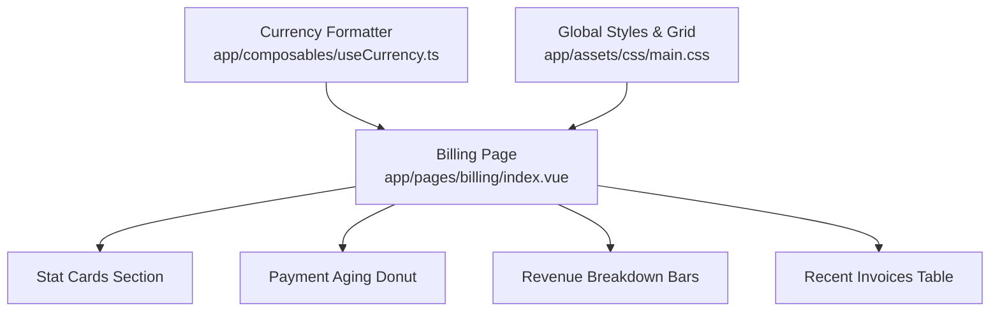
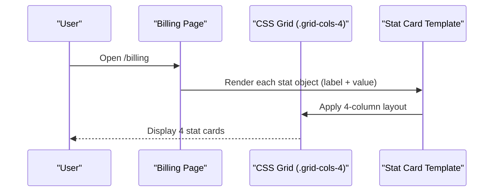
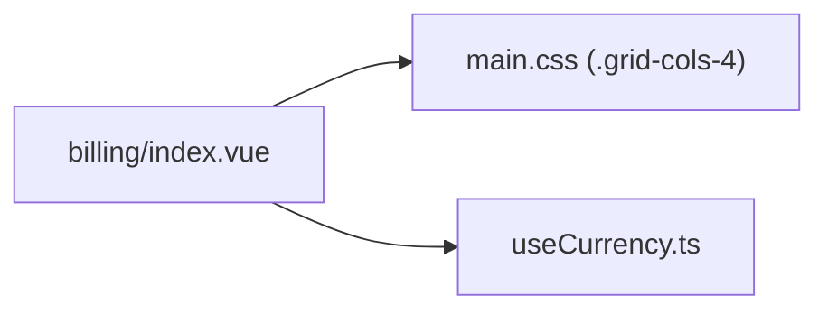

# Financial Metrics & KPIs

<cite>
**Referenced Files in This Document**
- [billing/index.vue](file://app/pages/billing/index.vue)
- [useCurrency.ts](file://app/composables/useCurrency.ts)
- [main.css](file://app/assets/css/main.css)
</cite>

## Table of Contents
1. [Introduction](#introduction)
2. [Project Structure](#project-structure)
3. [Core Components](#core-components)
4. [Architecture Overview](#architecture-overview)
5. [Detailed Component Analysis](#detailed-component-analysis)
6. [Dependency Analysis](#dependency-analysis)
7. [Performance Considerations](#performance-considerations)
8. [Troubleshooting Guide](#troubleshooting-guide)
9. [Conclusion](#conclusion)

## Introduction
This document explains the financial metrics and key performance indicators (KPIs) displayed on the Billing dashboard, focusing on the four stat cards: Total Outstanding (GHS 12,480), Subscription Revenue (GHS 52,340), PAYG Revenue (GHS 31,890), and Average Collection Time (12 days). It covers how these metrics are represented in the UI, their significance for financial monitoring, and how to interpret trends for operational decision-making. It also documents the visual design patterns used for metric presentation and accessibility considerations.

## Project Structure
The billing dashboard is implemented as a single-page view that renders:
- A header with page title and description
- Four stat cards at the top
- Supporting charts and tables below (Payment Aging donut and Revenue Breakdown)
- Recent Invoices table with search and pagination

**Diagram sources**
- [billing/index.vue:142-173](file://app/pages/billing/index.vue#L142-L173)
- [billing/index.vue:274-325](file://app/pages/billing/index.vue#L274-L325)
- [billing/index.vue:327-412](file://app/pages/billing/index.vue#L327-L412)
- [useCurrency.ts:1-12](file://app/composables/useCurrency.ts#L1-L12)
- [main.css:46-50](file://app/assets/css/main.css#L46-L50)

**Section sources**
- [billing/index.vue:142-173](file://app/pages/billing/index.vue#L142-L173)
- [billing/index.vue:274-325](file://app/pages/billing/index.vue#L274-L325)
- [billing/index.vue:327-412](file://app/pages/billing/index.vue#L327-L412)
- [useCurrency.ts:1-12](file://app/composables/useCurrency.ts#L1-L12)
- [main.css:46-50](file://app/assets/css/main.css#L46-L50)

## Core Components
- Stat Cards: Four high-level KPIs presented in a responsive grid. Each card shows an icon, label, and value. The values are static strings in this implementation.
- Currency Formatting: A composable provides consistent currency formatting using the Ghanaian locale and GHS currency code.
- Layout Utilities: CSS classes define a 4-column grid and responsive breakpoints for stat cards.

Key responsibilities:
- Presenting the four KPIs clearly and consistently
- Ensuring currency values are formatted correctly where numeric amounts are used elsewhere in the page
- Providing a responsive layout that adapts from desktop to mobile

**Section sources**
- [billing/index.vue:151-173](file://app/pages/billing/index.vue#L151-L173)
- [useCurrency.ts:1-12](file://app/composables/useCurrency.ts#L1-L12)
- [main.css:46-50](file://app/assets/css/main.css#L46-L50)

## Architecture Overview
At runtime, the Billing page renders the stat cards by iterating over a small array of metric definitions. The layout uses a CSS grid class to arrange them in four columns on desktop and stacks them on smaller screens.

**Diagram sources**
- [billing/index.vue:151-173](file://app/pages/billing/index.vue#L151-L173)
- [main.css:46-50](file://app/assets/css/main.css#L46-L50)

## Detailed Component Analysis

### Stat Cards: Total Outstanding, Subscription Revenue, PAYG Revenue, Avg Collection Time
- Purpose: Provide immediate visibility into core financial health and collection efficiency.
- Data source: Hardcoded values in the template loop; not computed from underlying invoice or transfer data in this implementation.
- Visual pattern: Icon box, label, and large bold value. Consistent spacing and typography across all cards.

Interpretation guidance:
- Total Outstanding (GHS 12,480): Sum of unpaid invoices and unapproved transfers. Rising values may indicate collection bottlenecks or increased credit risk.
- Subscription Revenue (GHS 52,340): Recurring revenue from subscription plans. Growth signals retention and upsell success.
- PAYG Revenue (GHS 31,890): Usage-based revenue. Volatility can reflect demand fluctuations or pricing changes.
- Average Collection Time (12 days): Measures speed of cash conversion. Lower is generally better; rising days suggest slower collections.

Operational use cases:
- Trend analysis: Compare month-over-month to identify seasonal effects or policy impacts.
- Action triggers: If Total Outstanding increases beyond thresholds, prioritize follow-ups and escalation workflows.
- Resource planning: Use Average Collection Time to forecast cash flow and plan working capital needs.

Accessibility considerations:
- Ensure sufficient color contrast between text and backgrounds.
- Provide descriptive labels for screen readers (e.g., “Total Outstanding: GHS 12,480”).
- Avoid relying solely on color to convey meaning; pair icons and text with clear labels.

**Section sources**
- [billing/index.vue:151-173](file://app/pages/billing/index.vue#L151-L173)

### Payment Aging Donut
- Purpose: Show distribution of outstanding balances by aging buckets (Current, 1–30 days, 31–60 days, 60+ days).
- Implementation: SVG donut segments computed from percentage slices.
- Business insight: Higher percentages in older buckets signal deteriorating collection performance and potential bad debt risk.

**Section sources**
- [billing/index.vue:108-139](file://app/pages/billing/index.vue#L108-L139)
- [billing/index.vue:277-304](file://app/pages/billing/index.vue#L277-L304)

### Revenue Breakdown Bars
- Purpose: Visualize composition of revenue across categories (Monthly Subscriptions, Pay-as-you-go, Outstanding).
- Implementation: Horizontal progress bars with percentage widths and labeled amounts.
- Business insight: Helps understand revenue mix and exposure to different payment streams.

**Section sources**
- [billing/index.vue:102-106](file://app/pages/billing/index.vue#L102-L106)
- [billing/index.vue:306-325](file://app/pages/billing/index.vue#L306-L325)

### Recent Invoices Table
- Purpose: Operational detail view to investigate drivers behind KPIs (e.g., which invoices contribute to Total Outstanding).
- Features: Search, status badges, and navigation to invoice details.

**Section sources**
- [billing/index.vue:66-99](file://app/pages/billing/index.vue#L66-L99)
- [billing/index.vue:327-412](file://app/pages/billing/index.vue#L327-L412)

## Dependency Analysis
The stat cards depend on:
- The Billing page component for rendering and layout
- Global CSS for grid and responsive behavior
- The currency composable for consistent number formatting when numeric amounts are used elsewhere

**Diagram sources**
- [billing/index.vue:151-173](file://app/pages/billing/index.vue#L151-L173)
- [main.css:46-50](file://app/assets/css/main.css#L46-L50)
- [useCurrency.ts:1-12](file://app/composables/useCurrency.ts#L1-L12)

**Section sources**
- [billing/index.vue:151-173](file://app/pages/billing/index.vue#L151-L173)
- [main.css:46-50](file://app/assets/css/main.css#L46-L50)
- [useCurrency.ts:1-12](file://app/composables/useCurrency.ts#L1-L12)

## Performance Considerations
- Rendering cost: The stat cards are lightweight and do not perform heavy computations.
- Layout responsiveness: CSS grid handles reflow efficiently; avoid excessive inline styles for better maintainability.
- Number formatting: When integrating live data, prefer centralized formatting via the currency composable to reduce duplication and ensure consistency.

[No sources needed since this section provides general guidance]

## Troubleshooting Guide
Common issues and resolutions:
- Values appear misaligned or wrap unexpectedly:
  - Check container width and grid breakpoints. Ensure the .grid-cols-4 class is applied and not overridden by custom styles.
- Currency formatting inconsistencies:
  - Use the currency composable for any numeric amount display to ensure correct locale and currency symbol usage.
- Accessibility concerns:
  - Verify that each stat card has a descriptive label and that icon-only elements include accessible names.
  - Confirm sufficient contrast ratios for text and background colors.

**Section sources**
- [billing/index.vue:151-173](file://app/pages/billing/index.vue#L151-L173)
- [useCurrency.ts:1-12](file://app/composables/useCurrency.ts#L1-L12)
- [main.css:46-50](file://app/assets/css/main.css#L46-L50)

## Conclusion
The Billing dashboard’s stat cards provide a concise snapshot of financial health and collection efficiency. While the current implementation displays static values, the structure supports easy integration with live data sources. By interpreting trends in Total Outstanding, Subscription Revenue, PAYG Revenue, and Average Collection Time—and by leveraging supporting visuals like the Payment Aging donut and Revenue Breakdown—operators can make informed decisions about collections, cash flow, and growth strategies. Maintaining consistent formatting, responsive layouts, and accessible design ensures clarity and usability across devices and user needs.