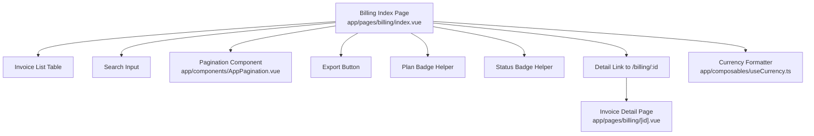
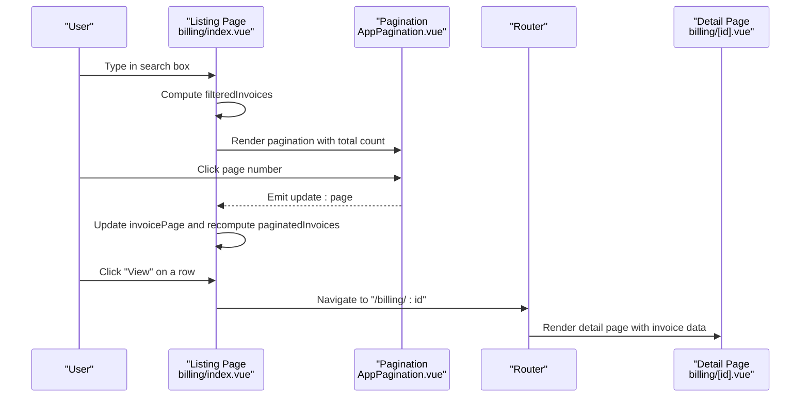
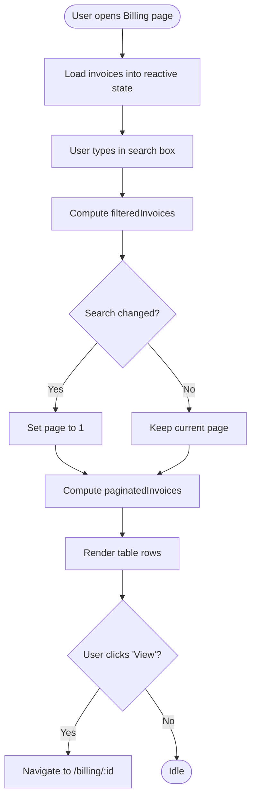
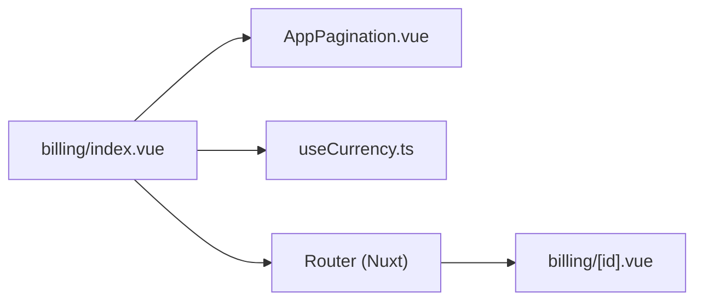

# Invoice Listing & Search

<cite>
**Referenced Files in This Document**
- [billing/index.vue](file://app/pages/billing/index.vue)
- [billing/[id].vue](file://app/pages/billing/[id].vue)
- [AppPagination.vue](file://app/components/AppPagination.vue)
- [useCurrency.ts](file://app/composables/useCurrency.ts)
</cite>

## Table of Contents
1. [Introduction](#introduction)
2. [Project Structure](#project-structure)
3. [Core Components](#core-components)
4. [Architecture Overview](#architecture-overview)
5. [Detailed Component Analysis](#detailed-component-analysis)
6. [Dependency Analysis](#dependency-analysis)
7. [Performance Considerations](#performance-considerations)
8. [Troubleshooting Guide](#troubleshooting-guide)
9. [Conclusion](#conclusion)

## Introduction
This document explains the invoice listing and search system used in the Billing section. It covers:
- The invoice table structure with columns for Invoice ID, Customer, Plan Type (Subscription/PAYG), Amount, Date, Status (paid/pending/overdue), and Actions.
- Search functionality to filter by customer name, invoice ID, or status.
- Examples for searching overdue invoices, finding specific customer transactions, and navigating to detailed invoice views.
- Pagination behavior for large datasets.
- Export capabilities for financial reporting.
- Integration between the listing page and individual invoice detail pages.
- The status badge system and plan type indicators.

## Project Structure
The billing feature is implemented as a Nuxt 3 page with supporting components and composables:
- Listing page: app/pages/billing/index.vue
- Detail page: app/pages/billing/[id].vue
- Pagination component: app/components/AppPagination.vue
- Currency formatting composable: app/composables/useCurrency.ts

**Diagram sources**
- [billing/index.vue:1-430](file://app/pages/billing/index.vue#L1-L430)
- [billing/[id].vue:1-L175](file://app/pages/billing/[id].vue#L1-L175)
- [AppPagination.vue:1-48](file://app/components/AppPagination.vue#L1-L48)
- [useCurrency.ts:1-12](file://app/composables/useCurrency.ts#L1-L12)

**Section sources**
- [billing/index.vue:1-430](file://app/pages/billing/index.vue#L1-L430)
- [billing/[id].vue:1-L175](file://app/pages/billing/[id].vue#L1-L175)
- [AppPagination.vue:1-48](file://app/components/AppPagination.vue#L1-L48)
- [useCurrency.ts:1-12](file://app/composables/useCurrency.ts#L1-L12)

## Core Components
- Invoice list table: Displays all required columns and renders badges for plan type and status.
- Search input: Filters invoices by customer name, invoice ID, or status.
- Pagination: Renders page controls and shows current range of items.
- Export button: Provides an export action for financial reporting.
- Detail navigation: Links each row to its detail page using the invoice ID.
- Currency formatter: Formats amounts consistently across the UI.

Key responsibilities:
- Data filtering and pagination are computed locally on the client side within the listing page.
- Badges encapsulate styling logic for plan types and statuses.
- Navigation uses framework routing to open the detail view.

**Section sources**
- [billing/index.vue:66-125](file://app/pages/billing/index.vue#L66-L125)
- [billing/index.vue:327-412](file://app/pages/billing/index.vue#L327-L412)
- [AppPagination.vue:1-48](file://app/components/AppPagination.vue#L1-L48)
- [useCurrency.ts:1-12](file://app/composables/useCurrency.ts#L1-L12)

## Architecture Overview
The listing page owns the invoice dataset and exposes it through reactive state. Computed properties derive filtered and paginated subsets. The template binds these values to the table and pagination controls. Clicking “View” navigates to the detail page, which displays full invoice information and actions such as download and send.

**Diagram sources**
- [billing/index.vue:81-100](file://app/pages/billing/index.vue#L81-L100)
- [billing/index.vue:95-100](file://app/pages/billing/index.vue#L95-L100)
- [billing/index.vue:386-394](file://app/pages/billing/index.vue#L386-L394)
- [AppPagination.vue:17-19](file://app/components/AppPagination.vue#L17-L19)
- [billing/[id].vue:4-L6](file://app/pages/billing/[id].vue#L4-L6)

## Detailed Component Analysis

### Invoice Table Structure
Columns:
- Invoice ID: Unique identifier for the invoice.
- Customer: Name of the customer associated with the invoice.
- Plan Type: Indicator showing Subscription or PAYG.
- Amount: Monetary value formatted with currency formatting.
- Date: Invoice date.
- Status: One of paid, pending, or overdue.
- Actions: View link to navigate to the invoice detail page.

Rendering details:
- Plan Type is rendered via a helper that returns style metadata for Subscription vs PAYG.
- Status is rendered via a helper that returns style metadata for paid, pending, and overdue.
- Amounts are formatted using the currency composable.

Example usage paths:
- Column headers and rows: [billing/index.vue:352-401](file://app/pages/billing/index.vue#L352-L401)
- Plan badge helper: [billing/index.vue:115-118](file://app/pages/billing/index.vue#L115-L118)
- Status badge helper: [billing/index.vue:120-125](file://app/pages/billing/index.vue#L120-L125)
- Currency formatting: [useCurrency.ts:1-12](file://app/composables/useCurrency.ts#L1-L12)

**Section sources**
- [billing/index.vue:352-401](file://app/pages/billing/index.vue#L352-L401)
- [billing/index.vue:115-125](file://app/pages/billing/index.vue#L115-L125)
- [useCurrency.ts:1-12](file://app/composables/useCurrency.ts#L1-L12)

### Search Functionality
The search input filters invoices by:
- Customer name
- Invoice ID
- Status

Behavior:
- Filtering is case-insensitive and performed on the client side.
- When the search query changes, the page resets to page 1 to ensure results are visible.

Implementation references:
- Search input binding and placeholder: [billing/index.vue:338-349](file://app/pages/billing/index.vue#L338-L349)
- Filtered invoices computation: [billing/index.vue:85-93](file://app/pages/billing/index.vue#L85-L93)
- Reset page on search change: [billing/index.vue:100-100](file://app/pages/billing/index.vue#L100-L100)

Examples:
- Searching for overdue invoices: Enter “overdue” in the search field to show only overdue invoices.
- Finding specific customer transactions: Enter the customer’s name to filter their invoices.
- Combining filters: Since the search matches any of the three fields, typing a partial invoice ID will narrow results accordingly.

**Section sources**
- [billing/index.vue:338-349](file://app/pages/billing/index.vue#L338-L349)
- [billing/index.vue:85-100](file://app/pages/billing/index.vue#L85-L100)

### Pagination System
The pagination component provides:
- Previous/Next buttons
- Page numbers based on total filtered records
- Display of current range (from-to) out of total

Integration:
- The listing page passes the current page, total filtered count, and per-page size to the component.
- The component emits page updates, which the listing page consumes to recompute the displayed slice.

References:
- Pagination props and emit: [AppPagination.vue:2-10](file://app/components/AppPagination.vue#L2-L10)
- Page calculation and bounds: [AppPagination.vue:12-19](file://app/components/AppPagination.vue#L12-L19)
- Usage in listing page: [billing/index.vue:404-411](file://app/pages/billing/index.vue#L404-L411)

Notes:
- Per-page size is set at the listing page level; adjust this value to handle larger datasets efficiently.

**Section sources**
- [AppPagination.vue:1-48](file://app/components/AppPagination.vue#L1-L48)
- [billing/index.vue:404-411](file://app/pages/billing/index.vue#L404-L411)

### Export Capabilities
The listing page includes an “Export All” button intended for financial reporting. While the click handler is not implemented in the listing page, the pattern aligns with other pages that perform exports (for example, exporting to Excel).

References:
- Export button in listing page: [billing/index.vue:331-336](file://app/pages/billing/index.vue#L331-L336)
- Example export pattern elsewhere: [customers/index.vue:129-146](file://app/pages/customers/index.vue#L129-L146)

Recommendation:
- Implement a handler to generate CSV or PDF from the filtered dataset when needed for targeted reports.

**Section sources**
- [billing/index.vue:331-336](file://app/pages/billing/index.vue#L331-L336)
- [customers/index.vue:129-146](file://app/pages/customers/index.vue#L129-L146)

### Integration with Invoice Detail Pages
Each invoice row has a “View” action that navigates to the detail page using the invoice ID. The detail page reads the route parameter and displays comprehensive invoice information, including status badge, dates, payment method, line items, and totals.

Flow:
- User clicks “View” on a row.
- Router navigates to /billing/:id.
- Detail page renders invoice data and actions like Download PDF and Send.

References:
- Row action link: [billing/index.vue:386-394](file://app/pages/billing/index.vue#L386-L394)
- Detail page route reading: [billing/[id].vue:4-L6](file://app/pages/billing/[id].vue#L4-L6)
- Detail page header and status badge: [billing/[id].vue:58-L64](file://app/pages/billing/[id].vue#L58-L64)
- Detail page actions (Download/Send): [billing/[id].vue:65-L82](file://app/pages/billing/[id].vue#L65-L82)

**Section sources**
- [billing/index.vue:386-394](file://app/pages/billing/index.vue#L386-L394)
- [billing/[id].vue:4-L6](file://app/pages/billing/[id].vue#L4-L6)
- [billing/[id].vue:58-L82](file://app/pages/billing/[id].vue#L58-L82)

### Status Badge System and Plan Type Indicators
Badges provide consistent visual cues:
- Plan Type:
  - Subscription: Blue-tinted background and border with blue text.
  - PAYG: Neutral gray background and border with gray text.
- Status:
  - Paid: Green-tinted background and border with green text.
  - Pending: Amber-tinted background and border with amber text.
  - Overdue: Red-tinted background and border with red text.

These helpers return objects containing background color, border color, text color, and label, which are applied inline in the template.

References:
- Plan badge helper: [billing/index.vue:115-118](file://app/pages/billing/index.vue#L115-L118)
- Status badge helper: [billing/index.vue:120-125](file://app/pages/billing/index.vue#L120-L125)
- Detail page status badge helper: [billing/[id].vue:36-L41](file://app/pages/billing/[id].vue#L36-L41)

**Section sources**
- [billing/index.vue:115-125](file://app/pages/billing/index.vue#L115-L125)
- [billing/[id].vue:36-L41](file://app/pages/billing/[id].vue#L36-L41)

### Data Flow and Processing Logic

**Diagram sources**
- [billing/index.vue:81-100](file://app/pages/billing/index.vue#L81-L100)
- [billing/index.vue:95-100](file://app/pages/billing/index.vue#L95-L100)
- [billing/index.vue:386-394](file://app/pages/billing/index.vue#L386-L394)

## Dependency Analysis
The listing page depends on:
- AppPagination component for pagination UI and events.
- useCurrency composable for amount formatting.
- Framework router for navigation to the detail page.

**Diagram sources**
- [billing/index.vue:1-430](file://app/pages/billing/index.vue#L1-L430)
- [AppPagination.vue:1-48](file://app/components/AppPagination.vue#L1-L48)
- [useCurrency.ts:1-12](file://app/composables/useCurrency.ts#L1-L12)
- [billing/[id].vue:1-L175](file://app/pages/billing/[id].vue#L1-L175)

**Section sources**
- [billing/index.vue:1-430](file://app/pages/billing/index.vue#L1-L430)
- [AppPagination.vue:1-48](file://app/components/AppPagination.vue#L1-L48)
- [useCurrency.ts:1-12](file://app/composables/useCurrency.ts#L1-L12)
- [billing/[id].vue:1-L175](file://app/pages/billing/[id].vue#L1-L175)

## Performance Considerations
- Client-side filtering and slicing are efficient for moderate datasets. For very large lists, consider server-side pagination and search to reduce memory and rendering overhead.
- Avoid recomputing expensive operations by keeping filters simple and leveraging computed properties as implemented.
- Ensure per-page size is tuned to balance responsiveness and usability.

[No sources needed since this section provides general guidance]

## Troubleshooting Guide
Common issues and resolutions:
- Search does not reset page: Confirm that the watcher resets the page index when the search query changes. Reference: [billing/index.vue:100-100](file://app/pages/billing/index.vue#L100-L100)
- Pagination shows incorrect counts: Verify that the total passed to the pagination component reflects the filtered dataset length. Reference: [billing/index.vue:404-411](file://app/pages/billing/index.vue#L404-L411)
- Amounts not formatted correctly: Ensure the currency composable is used for all monetary values. Reference: [useCurrency.ts:1-12](file://app/composables/useCurrency.ts#L1-L12)
- Status or plan badges not displaying: Check the helper functions and ensure the correct keys are used in templates. References: [billing/index.vue:115-125](file://app/pages/billing/index.vue#L115-L125), [billing/[id].vue:36-L41](file://app/pages/billing/[id].vue#L36-L41)

**Section sources**
- [billing/index.vue:100-100](file://app/pages/billing/index.vue#L100-L100)
- [billing/index.vue:404-411](file://app/pages/billing/index.vue#L404-L411)
- [useCurrency.ts:1-12](file://app/composables/useCurrency.ts#L1-L12)
- [billing/index.vue:115-125](file://app/pages/billing/index.vue#L115-L125)
- [billing/[id].vue:36-L41](file://app/pages/billing/[id].vue#L36-L41)

## Conclusion
The invoice listing and search system provides a clear, user-friendly interface for managing invoices. It supports filtering by key fields, intuitive pagination, consistent status and plan indicators, and seamless navigation to detailed views. With minor enhancements—such as implementing the export handler—it can fully support financial reporting needs.

[No sources needed since this section summarizes without analyzing specific files]