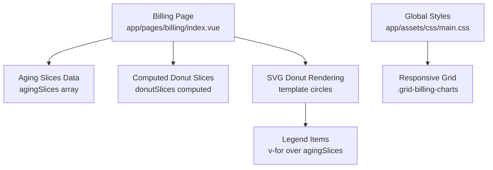
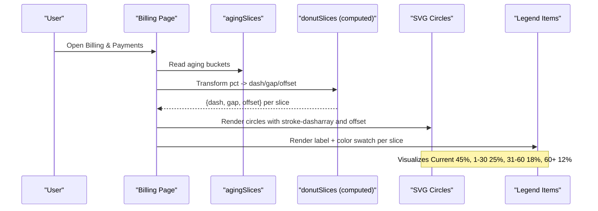
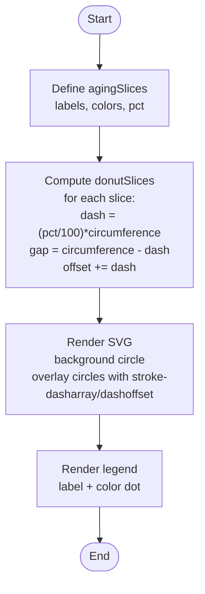
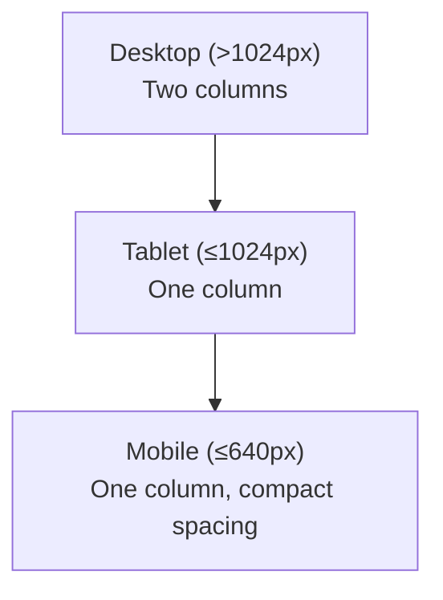
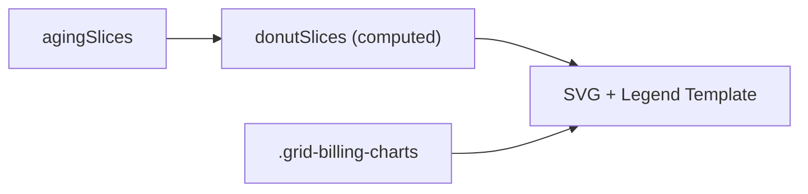

# Payment Aging Analysis

<cite>
**Referenced Files in This Document**
- [billing/index.vue](file://app/pages/billing/index.vue)
- [main.css](file://app/assets/css/main.css)
</cite>

## Table of Contents
1. [Introduction](#introduction)
2. [Project Structure](#project-structure)
3. [Core Components](#core-components)
4. [Architecture Overview](#architecture-overview)
5. [Detailed Component Analysis](#detailed-component-analysis)
6. [Dependency Analysis](#dependency-analysis)
7. [Performance Considerations](#performance-considerations)
8. [Troubleshooting Guide](#troubleshooting-guide)
9. [Conclusion](#conclusion)

## Introduction
This document explains the payment aging analysis visualization implemented in the Billing & Payments page. It focuses on the SVG donut chart that displays four aging buckets: Current (45%), 1–30 days (25%), 31–60 days (18%), and 60+ days (12%). The documentation covers how aging is calculated, why each bucket matters for cash flow and collections, how to interpret patterns, and the technical implementation details including color coding and responsive design.

## Project Structure
The payment aging visualization is implemented within a single Vue page component and styled using global CSS utilities.

**Diagram sources**
- [billing/index.vue:108-139](file://app/pages/billing/index.vue#L108-L139)
- [billing/index.vue:278-304](file://app/pages/billing/index.vue#L278-L304)
- [main.css:66-71](file://app/assets/css/main.css#L66-L71)

**Section sources**
- [billing/index.vue:108-139](file://app/pages/billing/index.vue#L108-L139)
- [billing/index.vue:278-304](file://app/pages/billing/index.vue#L278-L304)
- [main.css:66-71](file://app/assets/css/main.css#L66-L71)

## Core Components
- Aging slices data: Defines the four aging categories with labels, colors, and percentages.
- Computed donut slices: Converts percentage values into SVG stroke-dasharray segments and offsets.
- SVG rendering: Draws a background circle and overlays colored arcs per slice.
- Legend: Displays category labels with matching color swatches.

Key responsibilities:
- Data definition for aging buckets
- Geometry computation for arc lengths and gaps
- Template binding for dynamic rendering
- Responsive layout via grid utility

**Section sources**
- [billing/index.vue:108-113](file://app/pages/billing/index.vue#L108-L113)
- [billing/index.vue:127-139](file://app/pages/billing/index.vue#L127-L139)
- [billing/index.vue:278-304](file://app/pages/billing/index.vue#L278-L304)

## Architecture Overview
The visualization follows a simple reactive pipeline: static aging data drives a computed transformation that produces SVG attributes, which are then rendered by the template.

**Diagram sources**
- [billing/index.vue:108-113](file://app/pages/billing/index.vue#L108-L113)
- [billing/index.vue:127-139](file://app/pages/billing/index.vue#L127-L139)
- [billing/index.vue:278-304](file://app/pages/billing/index.vue#L278-L304)

## Detailed Component Analysis

### Aging Buckets and Business Meaning
- Current (45%): Invoices not yet due or just issued; indicates healthy near-term liquidity.
- 1–30 days (25%): Slightly past due; early-stage delinquency requiring follow-up.
- 31–60 days (18%): Moderate delinquency; higher risk of bad debt if unresolved.
- 60+ days (12%): Severe delinquency; likely requires escalation and credit review.

Why it matters:
- Cash flow management: Higher Current share improves short-term cash inflow predictability.
- Collection effectiveness: Rising older buckets signal collection bottlenecks.
- Credit risk assessment: Increasing 60+ days suggests tightening credit terms or enhanced screening.

Interpretation examples:
- If Current drops below 40% while 60+ rises above 15%, prioritize outreach and consider credit holds.
- Stable Current with growing 1–30 may indicate process friction rather than customer insolvency.

[No sources needed since this section provides conceptual guidance]

### Technical Implementation: SVG Donut Chart
- Data model: Each slice has label, color, and pct.
- Geometry:
  - Radius r = 50, circumference = 2πr.
  - For each slice: dash = (pct/100) × circumference; gap = circumference − dash.
  - Offsets accumulate to position each arc sequentially around the circle.
- Rendering:
  - Background circle sets base track.
  - Overlay circles use stroke-dasharray and stroke-dashoffset to draw arcs.
  - Rotation aligns start at top (-90 degrees).
- Legend:
  - Two-column grid shows label and color dot per slice.

**Diagram sources**
- [billing/index.vue:108-113](file://app/pages/billing/index.vue#L108-L113)
- [billing/index.vue:127-139](file://app/pages/billing/index.vue#L127-L139)
- [billing/index.vue:278-304](file://app/pages/billing/index.vue#L278-L304)

**Section sources**
- [billing/index.vue:108-113](file://app/pages/billing/index.vue#L108-L113)
- [billing/index.vue:127-139](file://app/pages/billing/index.vue#L127-L139)
- [billing/index.vue:278-304](file://app/pages/billing/index.vue#L278-L304)

### Color Coding Strategy
- Green (#22c55e): Current — positive, low-risk.
- Amber (#ffb400): 1–30 days — caution, early attention.
- Orange (#ff8c00): 31–60 days — elevated risk, action required.
- Red (#ef4444): 60+ days — high risk, escalation.

Rationale:
- Intuitive severity progression from green to red.
- Consistent with status badges elsewhere in the app.

**Section sources**
- [billing/index.vue:108-113](file://app/pages/billing/index.vue#L108-L113)

### Responsive Design Considerations
- Layout: The billing charts container uses a two-column grid on desktop and stacks to one column on tablet/mobile breakpoints.
- Breakpoints:
  - ≤1024px: Single column for billing charts.
  - ≤640px: Single column across grids and reduced padding.
- Chart sizing: Fixed width/height and viewBox ensure consistent scaling across devices.

**Diagram sources**
- [main.css:66-71](file://app/assets/css/main.css#L66-L71)
- [main.css:100-102](file://app/assets/css/main.css#L100-L102)
- [main.css:121-123](file://app/assets/css/main.css#L121-L123)

**Section sources**
- [main.css:66-71](file://app/assets/css/main.css#L66-L71)
- [main.css:100-102](file://app/assets/css/main.css#L100-L102)
- [main.css:121-123](file://app/assets/css/main.css#L121-L123)

## Dependency Analysis
- The billing page defines aging data and computes SVG geometry.
- Global CSS provides responsive grid behavior used by the billing charts container.
- No external charting libraries are used; rendering relies on native SVG.

**Diagram sources**
- [billing/index.vue:108-139](file://app/pages/billing/index.vue#L108-L139)
- [billing/index.vue:278-304](file://app/pages/billing/index.vue#L278-L304)
- [main.css:66-71](file://app/assets/css/main.css#L66-L71)

**Section sources**
- [billing/index.vue:108-139](file://app/pages/billing/index.vue#L108-L139)
- [main.css:66-71](file://app/assets/css/main.css#L66-L71)

## Performance Considerations
- Computed property ensures re-render only when agingSlices change.
- SVG rendering is lightweight; no heavy canvas or third-party libraries.
- Keep agingSlices small (four items) to avoid unnecessary overhead.
- Avoid recalculating circumference repeatedly; it is derived once per compute cycle.

[No sources needed since this section provides general guidance]

## Troubleshooting Guide
Common issues and resolutions:
- Percentages do not sum to 100%: Ensure all aging buckets are included and accurate.
- Arcs overlap or misaligned: Verify cumulative offset logic and rotation transform.
- Colors not visible: Confirm stroke-width and viewBox dimensions match radius and center coordinates.
- Legend mismatch: Ensure legend iterates over the same agingSlices used for chart rendering.

Validation checks:
- Confirm circumference calculation uses the same radius as the SVG circles.
- Check that stroke-dasharray values are non-negative and less than or equal to circumference.
- Validate that the initial rotation (-90deg) positions the first segment at the top.

**Section sources**
- [billing/index.vue:127-139](file://app/pages/billing/index.vue#L127-L139)
- [billing/index.vue:278-304](file://app/pages/billing/index.vue#L278-L304)

## Conclusion
The payment aging visualization provides an immediate, intuitive view of receivables health through a simple SVG donut chart. Its clear color semantics and responsive layout support quick decision-making for collections and credit risk. By monitoring shifts across aging buckets, teams can proactively manage cash flow, improve collection effectiveness, and mitigate credit exposure.

[No sources needed since this section summarizes without analyzing specific files]