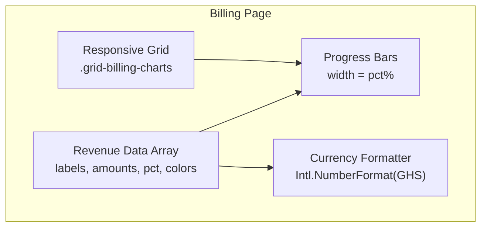
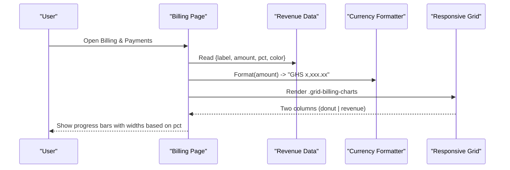
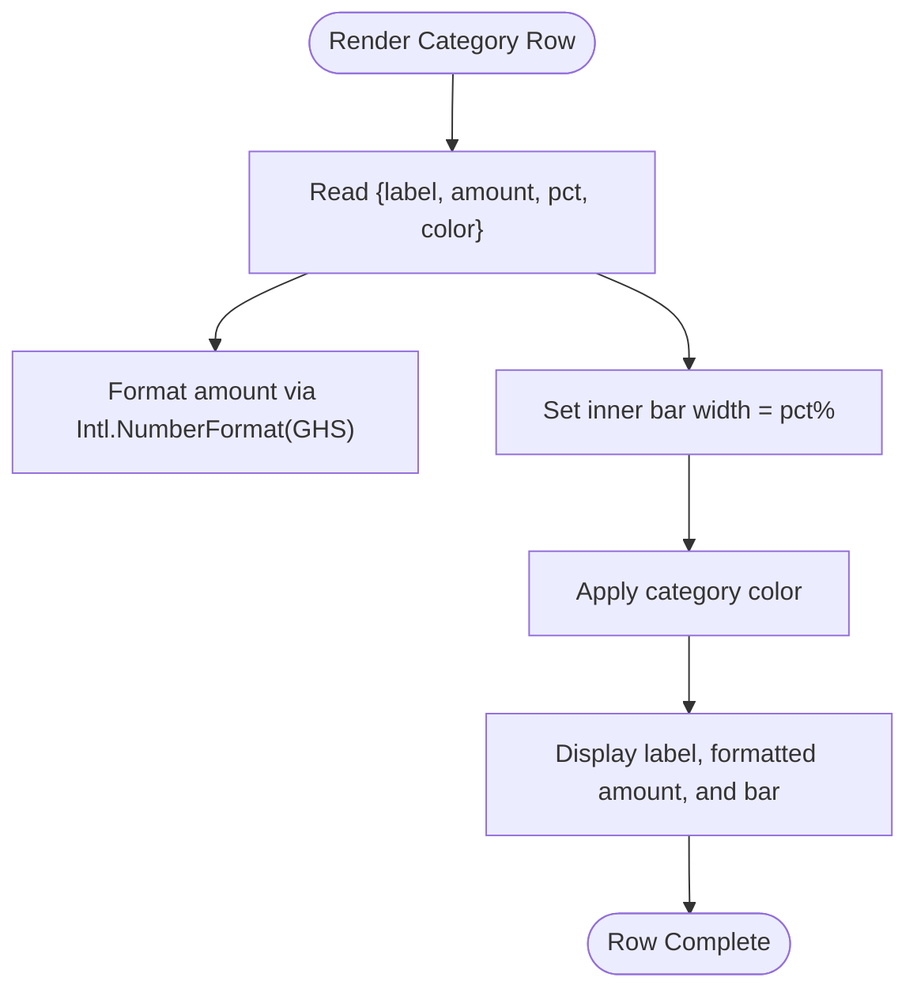
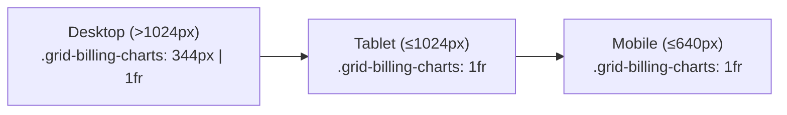
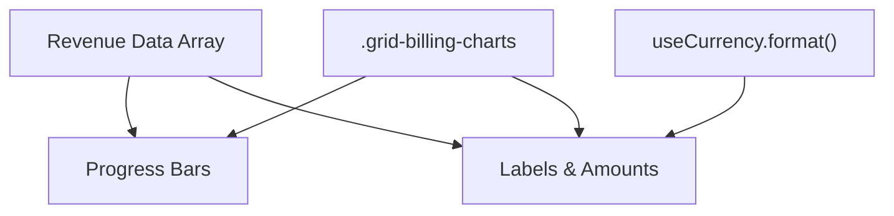

# Revenue Breakdown Visualization

<cite>
**Referenced Files in This Document**
- [billing/index.vue](file://app/pages/billing/index.vue)
- [main.css](file://app/assets/css/main.css)
- [useCurrency.ts](file://app/composables/useCurrency.ts)
</cite>

## Table of Contents
1. [Introduction](#introduction)
2. [Project Structure](#project-structure)
3. [Core Components](#core-components)
4. [Architecture Overview](#architecture-overview)
5. [Detailed Component Analysis](#detailed-component-analysis)
6. [Dependency Analysis](#dependency-analysis)
7. [Performance Considerations](#performance-considerations)
8. [Troubleshooting Guide](#troubleshooting-guide)
9. [Conclusion](#conclusion)
10. [Appendices](#appendices)

## Introduction
This document explains the revenue breakdown visualization system used in the Billing & Payments page. It focuses on three categories:
- Monthly Subscriptions (GHS 52,340, 62%)
- Pay-as-you-go (GHS 31,890, 38%)
- Outstanding (GHS 12,480, 15%)

It covers how percentages are calculated and displayed, the meaning of the subscription vs PAYG mix, and how outstanding amounts affect financial health. It also provides guidance for analyzing trends, understanding customer acquisition costs, and using breakdown data for strategic planning. Finally, it documents the progress bar implementation, color coding strategy, and responsive layout considerations.

## Project Structure
The revenue breakdown is implemented as part of the Billing & Payments page. The key elements include:
- A data array defining revenue categories with label, amount, percentage, and color
- A progress bar per category that visually represents each percentage
- A currency formatter to display GHS values consistently
- A responsive grid layout that places a payment aging donut chart alongside the revenue breakdown

**Diagram sources**
- [billing/index.vue:102-106](file://app/pages/billing/index.vue#L102-L106)
- [billing/index.vue:306-324](file://app/pages/billing/index.vue#L306-L324)
- [useCurrency.ts:1-12](file://app/composables/useCurrency.ts#L1-L12)
- [main.css:66-71](file://app/assets/css/main.css#L66-L71)

**Section sources**
- [billing/index.vue:102-106](file://app/pages/billing/index.vue#L102-L106)
- [billing/index.vue:306-324](file://app/pages/billing/index.vue#L306-L324)
- [useCurrency.ts:1-12](file://app/composables/useCurrency.ts#L1-L12)
- [main.css:66-71](file://app/assets/css/main.css#L66-L71)

## Core Components
- Revenue data model: An array of objects containing label, amount, percentage, and color for each category.
- Progress bars: Rendered as a background track with an inner colored bar whose width equals the percentage.
- Currency formatting: Uses Intl.NumberFormat with locale en-GH and currency GHS to format amounts.
- Responsive layout: A two-column grid on desktop (donut + revenue), collapsing to single column on tablet/mobile.

Key behaviors:
- Each row shows the category name, formatted amount, and a progress bar indicating its share.
- Outstanding uses a distinct color to signal risk.
- Amounts are formatted consistently across the page.

**Section sources**
- [billing/index.vue:102-106](file://app/pages/billing/index.vue#L102-L106)
- [billing/index.vue:306-324](file://app/pages/billing/index.vue#L306-L324)
- [useCurrency.ts:1-12](file://app/composables/useCurrency.ts#L1-L12)

## Architecture Overview
The billing page composes several UI blocks:
- Stat cards summarizing total outstanding, subscription revenue, PAYG revenue, and average collection time
- Payment aging donut chart showing distribution of outstanding by age buckets
- Revenue breakdown panel with progress bars for subscriptions, PAYG, and outstanding
- Recent invoices table with search, pagination, and status badges

**Diagram sources**
- [billing/index.vue:152-173](file://app/pages/billing/index.vue#L152-L173)
- [billing/index.vue:274-325](file://app/pages/billing/index.vue#L274-L325)
- [billing/index.vue:306-324](file://app/pages/billing/index.vue#L306-L324)
- [useCurrency.ts:1-12](file://app/composables/useCurrency.ts#L1-L12)
- [main.css:66-71](file://app/assets/css/main.css#L66-L71)

## Detailed Component Analysis

### Revenue Categories and Percentages
- Monthly Subscriptions: GHS 52,340, 62%
- Pay-as-you-go: GHS 31,890, 38%
- Outstanding: GHS 12,480, 15%

How percentages are represented:
- Each category object includes a pct field used directly as the progress bar width.
- The sum of these percentages exceeds 100% because Outstanding is not a subset of realized revenue; it reflects unpaid obligations and is shown separately for visibility.

Significance of the subscription vs PAYG mix:
- Subscription revenue indicates recurring, predictable income.
- PAYG revenue reflects usage-driven, variable income.
- A higher subscription share typically improves cash flow stability and reduces volatility.

Impact of Outstanding on financial health:
- Outstanding signals uncollected receivables. Elevated levels can strain liquidity and increase collection risk.
- Monitoring aging buckets helps prioritize follow-ups and reduce days sales outstanding.

Examples of analysis:
- Trend analysis: Compare monthly subscription and PAYG totals over time to identify growth or decline patterns.
- Customer acquisition cost (CAC): Combine marketing spend with new paying customers (subscription or PAYG) to estimate CAC and compare against lifetime value (LTV).
- Strategic planning: If Outstanding grows while Subscription remains stable, focus on collections and credit policies. If PAYG spikes, evaluate capacity and pricing.

**Section sources**
- [billing/index.vue:102-106](file://app/pages/billing/index.vue#L102-L106)
- [billing/index.vue:152-173](file://app/pages/billing/index.vue#L152-L173)

### Progress Bar Implementation
- Structure: A container with a light background track and an inner colored bar.
- Width calculation: The inner bar’s width is set to the category’s pct value.
- Height and radius: Fixed height with rounded corners for a pill shape.
- Color mapping: Each category has a dedicated color; Outstanding uses a red tone to highlight risk.

**Diagram sources**
- [billing/index.vue:306-324](file://app/pages/billing/index.vue#L306-L324)
- [useCurrency.ts:1-12](file://app/composables/useCurrency.ts#L1-L12)

**Section sources**
- [billing/index.vue:306-324](file://app/pages/billing/index.vue#L306-L324)

### Color Coding Strategy
- Monthly Subscriptions: Green tone to convey positive, recurring revenue.
- Pay-as-you-go: Blue tone to represent variable but healthy usage-based income.
- Outstanding: Red tone to emphasize risk and attention needed.

These choices align with common financial UX conventions: green for good/positive, blue for neutral/informational, red for warning/risk.

**Section sources**
- [billing/index.vue:102-106](file://app/pages/billing/index.vue#L102-L106)

### Responsive Layout Considerations
- Desktop: Two-column grid with the payment aging donut on the left and revenue breakdown on the right.
- Tablet: Single column stacking; both charts stack vertically.
- Mobile: Full-width single column with reduced padding and adjusted typography.

CSS classes:
- .grid-billing-charts defines the two-column layout on desktop and collapses to one column on smaller screens.
- .grid-cols-4 and .grid-cols-2 provide consistent spacing and alignment for stat cards and other sections.

**Diagram sources**
- [main.css:66-71](file://app/assets/css/main.css#L66-L71)
- [main.css:87-107](file://app/assets/css/main.css#L87-L107)
- [main.css:110-129](file://app/assets/css/main.css#L110-L129)

**Section sources**
- [main.css:66-71](file://app/assets/css/main.css#L66-L71)
- [main.css:87-107](file://app/assets/css/main.css#L87-L107)
- [main.css:110-129](file://app/assets/css/main.css#L110-L129)

## Dependency Analysis
- The revenue breakdown depends on:
  - The revenue data array for labels, amounts, percentages, and colors
  - The currency formatter for consistent GHS presentation
  - CSS grid utilities for responsive layout

**Diagram sources**
- [billing/index.vue:102-106](file://app/pages/billing/index.vue#L102-L106)
- [billing/index.vue:306-324](file://app/pages/billing/index.vue#L306-L324)
- [useCurrency.ts:1-12](file://app/composables/useCurrency.ts#L1-L12)
- [main.css:66-71](file://app/assets/css/main.css#L66-L71)

**Section sources**
- [billing/index.vue:102-106](file://app/pages/billing/index.vue#L102-L106)
- [billing/index.vue:306-324](file://app/pages/billing/index.vue#L306-L324)
- [useCurrency.ts:1-12](file://app/composables/useCurrency.ts#L1-L12)
- [main.css:66-71](file://app/assets/css/main.css#L66-L71)

## Performance Considerations
- Rendering efficiency: The progress bars are simple DOM updates driven by reactive data; no heavy libraries are used.
- Formatting overhead: Intl.NumberFormat is lightweight and invoked only when rendering amounts.
- Layout performance: CSS Grid ensures efficient reflow without JavaScript layout calculations.

[No sources needed since this section provides general guidance]

## Troubleshooting Guide
Common issues and resolutions:
- Incorrect percentage display: Ensure the pct field matches the intended share. Note that Outstanding may cause the sum to exceed 100% because it is not a subset of realized revenue.
- Misaligned progress bars: Verify the container width and that the inner bar width is set to the exact pct value.
- Inconsistent currency formatting: Confirm the use of the currency formatter with GHS and en-GH locale.
- Layout breaks on small screens: Check that .grid-billing-charts media queries are applied and that content does not overflow the container.

**Section sources**
- [billing/index.vue:102-106](file://app/pages/billing/index.vue#L102-L106)
- [billing/index.vue:306-324](file://app/pages/billing/index.vue#L306-L324)
- [useCurrency.ts:1-12](file://app/composables/useCurrency.ts#L1-L12)
- [main.css:66-71](file://app/assets/css/main.css#L66-L71)

## Conclusion
The revenue breakdown visualization clearly communicates the composition of revenue and outstanding balances through concise progress bars and consistent formatting. The subscription vs PAYG mix informs stability and growth strategies, while Outstanding highlights collection priorities. With a responsive layout and accessible color coding, stakeholders can quickly assess financial health and make informed decisions.

[No sources needed since this section summarizes without analyzing specific files]

## Appendices

### Example Analyses Using Breakdown Data
- Analyzing revenue trends: Track monthly changes in subscription and PAYG totals to spot seasonality or campaign impacts.
- Understanding customer acquisition costs: Divide marketing spend by newly acquired paying customers (subscription or PAYG) to compute CAC and compare against LTV.
- Strategic planning: If Outstanding increases, strengthen dunning workflows and credit checks. If PAYG surges, ensure operational capacity and review pricing tiers.

[No sources needed since this section provides general guidance]