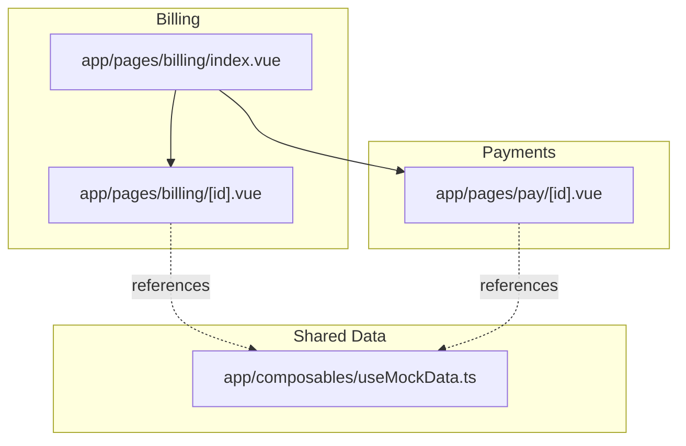
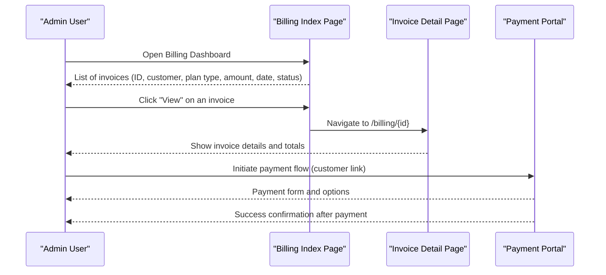
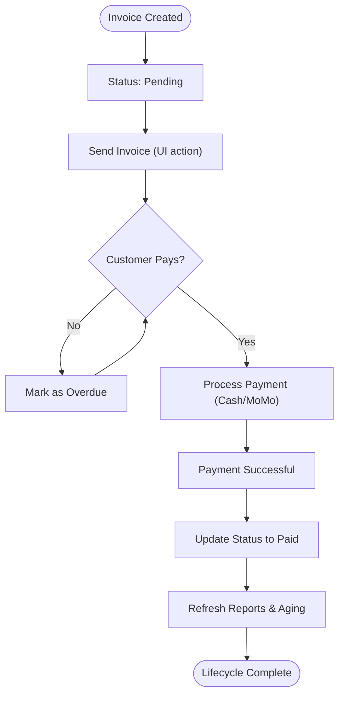
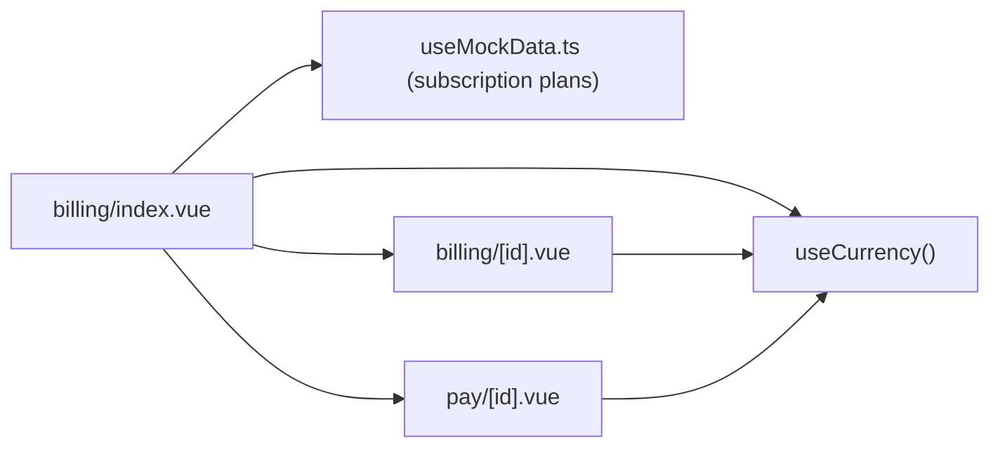

# Invoice Management

<cite>
**Referenced Files in This Document**
- [billing/index.vue](file://app/pages/billing/index.vue)
- [billing/[id].vue](file://app/pages/billing/[id].vue)
- [pay/[id].vue](file://app/pages/pay/[id].vue)
- [useMockData.ts](file://app/composables/useMockData.ts)
</cite>

## Table of Contents
1. [Introduction](#introduction)
2. [Project Structure](#project-structure)
3. [Core Components](#core-components)
4. [Architecture Overview](#architecture-overview)
5. [Detailed Component Analysis](#detailed-component-analysis)
6. [Dependency Analysis](#dependency-analysis)
7. [Performance Considerations](#performance-considerations)
8. [Troubleshooting Guide](#troubleshooting-guide)
9. [Conclusion](#conclusion)

## Introduction
This document explains the invoice management system implemented in the application. It covers:
- Viewing individual invoices and their details
- Customer billing history
- Invoice status management (paid, pending, overdue)
- The invoice data model (IDs, customer info, plan types, amounts, dates, statuses)
- Example workflows for viewing, updating status, generating reports, and handling overdue payments
- End-to-end lifecycle from creation to payment completion

The implementation currently uses client-side mock data and UI-only flows.

## Project Structure
The invoice-related features are primarily implemented as Nuxt pages under the app/pages directory:
- Billing dashboard and list view
- Individual invoice detail view
- Customer-facing payment portal

**Diagram sources**
- [billing/index.vue](file://app/pages/billing/index.vue)
- [billing/[id].vue](file://app/pages/billing/[id].vue)
- [pay/[id].vue](file://app/pages/pay/[id].vue)
- [useMockData.ts](file://app/composables/useMockData.ts)

**Section sources**
- [billing/index.vue](file://app/pages/billing/index.vue)
- [billing/[id].vue](file://app/pages/billing/[id].vue)
- [pay/[id].vue](file://app/pages/pay/[id].vue)
- [useMockData.ts](file://app/composables/useMockData.ts)

## Core Components
- Billing Dashboard (list, search, pagination, aging and revenue charts): Displays recent invoices with key fields and actions.
- Invoice Detail View: Shows full invoice information including from/bill-to addresses, dates, items, totals, and status.
- Payment Portal: Allows customers to pay outstanding invoices via cash or mobile money, with validation and a waiting state.

Key responsibilities:
- Presenting invoice lists and drill-downs
- Rendering invoice details and totals
- Handling payment initiation and success states
- Providing basic reporting visuals (aging and revenue breakdown)

**Section sources**
- [billing/index.vue](file://app/pages/billing/index.vue)
- [billing/[id].vue](file://app/pages/billing/[id].vue)
- [pay/[id].vue](file://app/pages/pay/[id].vue)

## Architecture Overview
At a high level:
- The billing index page lists invoices and navigates to the detail page.
- The detail page displays comprehensive invoice information.
- The payment portal is used by customers to settle outstanding balances.

**Diagram sources**
- [billing/index.vue](file://app/pages/billing/index.vue)
- [billing/[id].vue](file://app/pages/billing/[id].vue)
- [pay/[id].vue](file://app/pages/pay/[id].vue)

## Detailed Component Analysis

### Invoice Data Model
The current implementation models invoices with the following fields:
- id: Unique invoice identifier
- customer: Customer name
- planType: Plan type (subscription or pay-as-you-go; represented as subscription or payg)
- amount: Invoice amount
- date: Invoice date
- status: One of paid, pending, overdue

Additional detail-level fields in the invoice detail view include:
- from: Issuer company name and address
- billTo: Customer name and address
- invoiceDate, dueDate, paymentMethod
- items: Array of line items with description, quantity, rate, and amount
- subtotal, tax, taxRate, total

Plan types reference shared definitions available through the mock data composable.

**Section sources**
- [billing/index.vue](file://app/pages/billing/index.vue)
- [billing/[id].vue](file://app/pages/billing/[id].vue)
- [useMockData.ts](file://app/composables/useMockData.ts)

### Viewing Invoices (Dashboard)
- Search and filter by customer, ID, or status
- Pagination for large lists
- Visual badges for plan type and status
- Export action placeholder for report generation

Example workflow:
- Open the billing dashboard
- Use the search input to filter invoices
- Review the “Recent Invoices” table
- Click “View” to open the invoice detail page

**Section sources**
- [billing/index.vue](file://app/pages/billing/index.vue)

### Viewing Invoice Details
- Displays issuer (“From”) and customer (“Bill To”) information
- Shows invoice and due dates, payment method
- Lists line items with quantities, rates, and amounts
- Summarizes subtotal, tax, and total
- Provides download and send actions (UI only)

Example workflow:
- From the billing dashboard, click “View” on an invoice row
- Review all details and totals on the detail page

**Section sources**
- [billing/[id].vue](file://app/pages/billing/[id].vue)

### Customer Billing History
- The payment portal shows a customer’s outstanding invoices with descriptions, dates, amounts, and statuses
- Useful for reviewing multiple unpaid invoices before making a payment

Example workflow:
- Access the customer payment portal
- Review the list of outstanding invoices
- Choose a payment mode and proceed

**Section sources**
- [pay/[id].vue](file://app/pages/pay/[id].vue)

### Invoice Status Management
- Statuses supported: paid, pending, overdue
- Badges render distinct colors for each status
- Approving a bank transfer is documented to mark the associated invoice as paid (UI behavior described in modal text)

Example workflow:
- On the billing dashboard, review pending transfers
- Approve a transfer to mark the related invoice as paid

Note: The approval action updates local state in this demo; integration with backend services is not implemented here.

**Section sources**
- [billing/index.vue](file://app/pages/billing/index.vue)

### Generating Invoice Reports
- The dashboard includes visual summaries:
  - Revenue breakdown by plan type and outstanding amounts
  - Payment aging distribution (current, 1–30 days, 31–60 days, 60+ days)
- An “Export All” button is present for exporting invoice data (UI only)

Example workflow:
- Open the billing dashboard
- Review the “Revenue Breakdown” and “Payment Aging” sections
- Click “Export All” to generate a report (placeholder)

**Section sources**
- [billing/index.vue](file://app/pages/billing/index.vue)

### Handling Overdue Payments
- Overdue invoices are highlighted with a dedicated badge style
- The payment portal surfaces overdue invoices prominently
- A countdown timer supports mobile money approvals, improving user experience during payment processing

Example workflow:
- Identify overdue invoices in the dashboard
- Direct the customer to the payment portal
- Complete payment via cash or mobile money
- Confirm success and update status accordingly

**Section sources**
- [billing/index.vue](file://app/pages/billing/index.vue)
- [pay/[id].vue](file://app/pages/pay/[id].vue)

### Invoice Lifecycle Management
End-to-end flow from creation to payment completion:
- Creation: Invoices are created with a unique ID, customer, plan type, amount, date, and initial status (pending/overdue).
- Notification: Send action is available on the detail page (UI only).
- Payment: Customer pays via the payment portal using cash or mobile money.
- Confirmation: Payment success is shown; in production, the backend would update the invoice status to paid.
- Reporting: Updated statuses reflect in dashboards and aging/revenue breakdowns.

[No sources needed since this diagram shows conceptual workflow, not actual code structure]

## Dependency Analysis
- Pages depend on shared composables for currency formatting and mock data.
- The billing index page navigates to the invoice detail page and provides links to the payment portal.
- Shared plan type definitions exist in the mock data composable.

**Diagram sources**
- [billing/index.vue](file://app/pages/billing/index.vue)
- [billing/[id].vue](file://app/pages/billing/[id].vue)
- [pay/[id].vue](file://app/pages/pay/[id].vue)
- [useMockData.ts](file://app/composables/useMockData.ts)

**Section sources**
- [billing/index.vue](file://app/pages/billing/index.vue)
- [billing/[id].vue](file://app/pages/billing/[id].vue)
- [pay/[id].vue](file://app/pages/pay/[id].vue)
- [useMockData.ts](file://app/composables/useMockData.ts)

## Performance Considerations
- Client-side filtering and pagination are efficient for small datasets; consider server-side pagination for large invoice volumes.
- Avoid recomputing heavy calculations inside loops; use computed properties where possible (already applied for filtered/paginated lists).
- Defer non-critical rendering (e.g., charts) until after initial paint if necessary.

[No sources needed since this section provides general guidance]

## Troubleshooting Guide
- If invoice counts or statuses do not update after approval/payment, verify that local state is updated and that any downstream components recompute derived values.
- Ensure the correct route parameters are passed when navigating to invoice details and payment pages.
- For mobile money flows, confirm that the countdown timer is cleared on component unmount to prevent memory leaks.

**Section sources**
- [billing/index.vue](file://app/pages/billing/index.vue)
- [pay/[id].vue](file://app/pages/pay/[id].vue)

## Conclusion
The invoice management system provides a clear UI for listing, viewing, and paying invoices, along with basic reporting visuals. While currently driven by mock data and client-side logic, it establishes a solid foundation for integrating real APIs, persisting state, and automating status transitions across the invoice lifecycle.