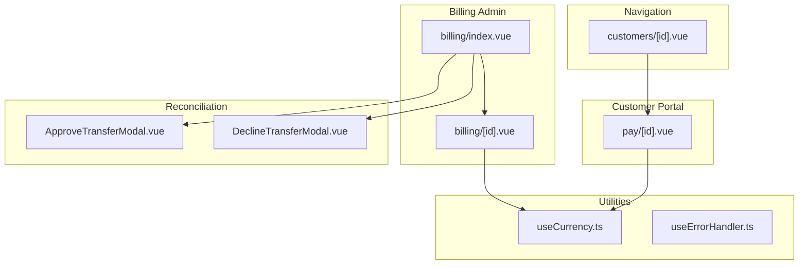
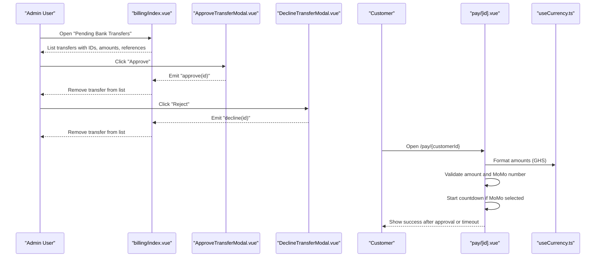
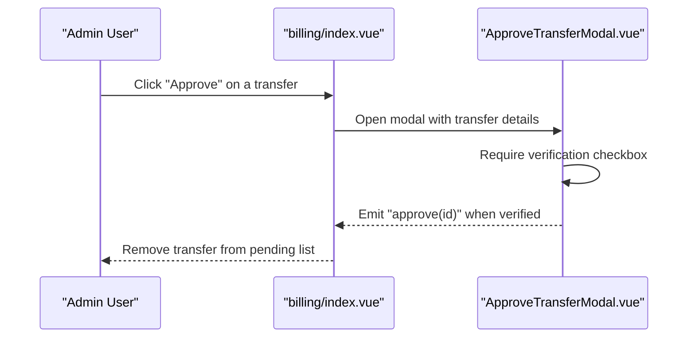
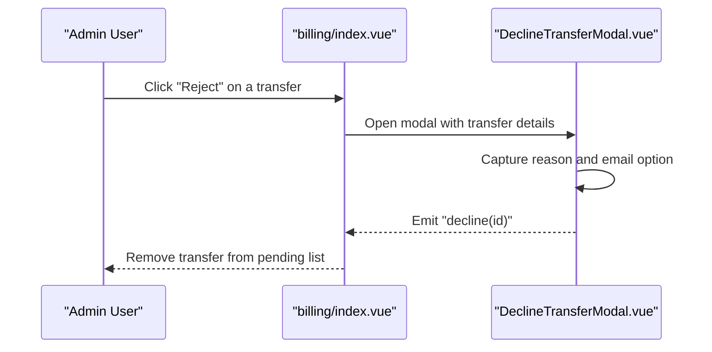
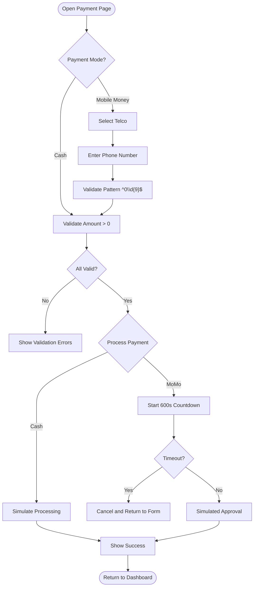
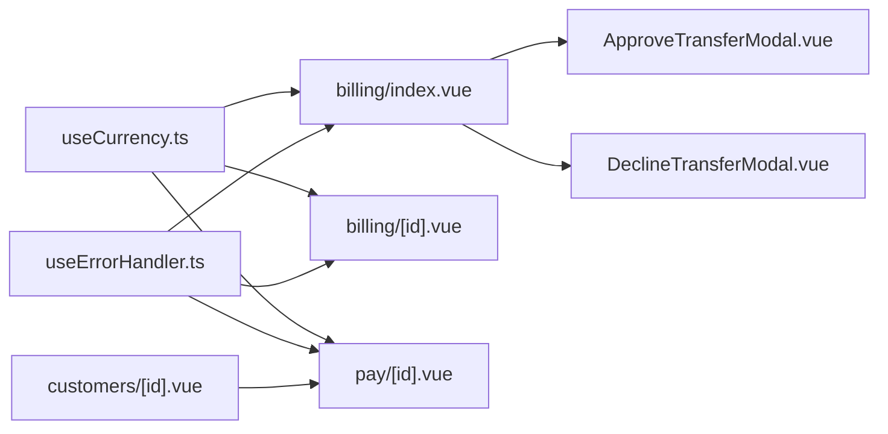

# Payment Processing

<cite>
**Referenced Files in This Document**
- [billing/index.vue](file://app/pages/billing/index.vue)
- [billing/[id].vue](file://app/pages/billing/[id].vue)
- [pay/[id].vue](file://app/pages/pay/[id].vue)
- [ApproveTransferModal.vue](file://app/components/ApproveTransferModal.vue)
- [DeclineTransferModal.vue](file://app/components/DeclineTransferModal.vue)
- [useCurrency.ts](file://app/composables/useCurrency.ts)
- [useErrorHandler.ts](file://app/composables/useErrorHandler.ts)
- [customers/[id].vue](file://app/pages/customers/[id].vue)
</cite>

## Table of Contents
1. [Introduction](#introduction)
2. [Project Structure](#project-structure)
3. [Core Components](#core-components)
4. [Architecture Overview](#architecture-overview)
5. [Detailed Component Analysis](#detailed-component-analysis)
6. [Dependency Analysis](#dependency-analysis)
7. [Performance Considerations](#performance-considerations)
8. [Troubleshooting Guide](#troubleshooting-guide)
9. [Conclusion](#conclusion)
10. [Appendices](#appendices)

## Introduction
This document explains the payment processing system implemented in the console application. It covers how payments are initiated, handled by different methods (cash and mobile money), confirmed, and tracked. It also documents the data model for invoices and transfers, including references, amounts, statuses, and related UI flows. The documentation includes concrete examples for new payments, failure handling, retries, receipt generation, integration points with external processors, validation, and reconciliation processes.

## Project Structure
The payment-related features are primarily implemented as Nuxt pages and reusable components:
- Billing dashboard and invoice detail views
- Customer-facing payment portal page
- Approval and rejection modals for bank transfer reconciliation
- Currency formatting utility
- Error handling composable used across the app

**Diagram sources**
- [billing/index.vue:1-430](file://app/pages/billing/index.vue#L1-L430)
- [billing/[id].vue](file://app/pages/billing/[id].vue#L1-L175)
- [pay/[id].vue](file://app/pages/pay/[id].vue#L1-L353)
- [ApproveTransferModal.vue:1-130](file://app/components/ApproveTransferModal.vue#L1-L130)
- [DeclineTransferModal.vue:1-134](file://app/components/DeclineTransferModal.vue#L1-L134)
- [useCurrency.ts:1-12](file://app/composables/useCurrency.ts#L1-L12)
- [useErrorHandler.ts:1-29](file://app/composables/useErrorHandler.ts#L1-L29)
- [customers/[id].vue](file://app/pages/customers/[id].vue#L139-L146)

**Section sources**
- [billing/index.vue:1-430](file://app/pages/billing/index.vue#L1-L430)
- [billing/[id].vue:1-175](file://app/pages/billing/[id].vue#L1-L175)
- [pay/[id].vue:1-353](file://app/pages/pay/[id].vue#L1-L353)
- [ApproveTransferModal.vue:1-130](file://app/components/ApproveTransferModal.vue#L1-L130)
- [DeclineTransferModal.vue:1-134](file://app/components/DeclineTransferModal.vue#L1-L134)
- [useCurrency.ts:1-12](file://app/composables/useCurrency.ts#L1-L12)
- [useErrorHandler.ts:1-29](file://app/composables/useErrorHandler.ts#L1-L29)
- [customers/[id].vue:139-146](file://app/pages/customers/[id].vue#L139-L146)

## Core Components
- Billing Dashboard: Lists pending bank transfers and recent invoices; supports approve/decline actions and search/pagination.
- Invoice Detail: Displays invoice metadata, line items, totals, status, and provides download/send actions.
- Customer Payment Portal: Allows customers to pay via cash or mobile money, validates inputs, shows a countdown while awaiting approval, and displays success.
- Approval Modal: Requires verification before approving a bank transfer; emits an approve event.
- Rejection Modal: Captures reason and optional email notification; emits a decline event.
- Currency Utility: Formats amounts in GHS using Intl.NumberFormat.
- Error Handler: Wraps async operations and shows toast errors.

Key responsibilities:
- Data presentation and user interactions for billing and payments
- Input validation for payment amount and mobile money number
- Countdown timer for mobile money approval flow
- Status badges and aging/revenue breakdowns for visibility
- Export and send actions for invoices

**Section sources**
- [billing/index.vue:34-42](file://app/pages/billing/index.vue#L34-L42)
- [billing/index.vue:66-79](file://app/pages/billing/index.vue#L66-L79)
- [billing/index.vue:120-125](file://app/pages/billing/index.vue#L120-L125)
- [billing/[id].vue:9-34](file://app/pages/billing/[id].vue#L9-L34)
- [pay/[id].vue:16-28](file://app/pages/pay/[id].vue#L16-L28)
- [pay/[id].vue:64-74](file://app/pages/pay/[id].vue#L64-L74)
- [pay/[id].vue:76-97](file://app/pages/pay/[id].vue#L76-L97)
- [ApproveTransferModal.vue:18-23](file://app/components/ApproveTransferModal.vue#L18-L23)
- [DeclineTransferModal.vue:18-23](file://app/components/DeclineTransferModal.vue#L18-L23)
- [useCurrency.ts:1-12](file://app/composables/useCurrency.ts#L1-L12)
- [useErrorHandler.ts:10-28](file://app/composables/useErrorHandler.ts#L10-L28)

## Architecture Overview
The system is composed of admin-facing billing screens and a customer-facing payment portal. Bank transfers require manual review and approval or rejection. Mobile money payments trigger a prompt on the customer’s device and wait for confirmation within a time window. Invoices can be viewed, downloaded, and sent.

**Diagram sources**
- [billing/index.vue:175-272](file://app/pages/billing/index.vue#L175-L272)
- [ApproveTransferModal.vue:20-23](file://app/components/ApproveTransferModal.vue#L20-L23)
- [DeclineTransferModal.vue:21-23](file://app/components/DeclineTransferModal.vue#L21-L23)
- [pay/[id].vue:76-L97](file://app/pages/pay/[id].vue#L76-L97)
- [useCurrency.ts:1-12](file://app/composables/useCurrency.ts#L1-L12)

## Detailed Component Analysis

### Billing Dashboard (Admin)
Responsibilities:
- Display pending bank transfers with fields: id, customer, paymentType, amount, reference, submitted date
- Provide approve and reject actions
- Display recent invoices with id, customer, plan type, amount, date, status
- Show revenue breakdown and payment aging charts
- Support search and pagination

Data model highlights:
- Transfer object: id, customer, paymentType, amount, reference, submitted
- Invoice object: id, customer, planType, amount, date, status

Status mapping:
- paid, pending, overdue mapped to colored badges

Actions:
- Approve: requires explicit verification checkbox in modal
- Reject: captures reason and optional email notification

Search and pagination:
- Client-side filtering by customer, id, paymentType, reference
- Pagination controls for both tables

Export:
- “Export All” button present for invoices

**Section sources**
- [billing/index.vue:34-42](file://app/pages/billing/index.vue#L34-L42)
- [billing/index.vue:66-79](file://app/pages/billing/index.vue#L66-L79)
- [billing/index.vue:120-125](file://app/pages/billing/index.vue#L120-L125)
- [billing/index.vue:175-272](file://app/pages/billing/index.vue#L175-L272)
- [billing/index.vue:327-412](file://app/pages/billing/index.vue#L327-L412)

#### Approval Flow Sequence

**Diagram sources**
- [billing/index.vue:21-30](file://app/pages/billing/index.vue#L21-L30)
- [ApproveTransferModal.vue:18-23](file://app/components/ApproveTransferModal.vue#L18-L23)

#### Rejection Flow Sequence

**Diagram sources**
- [billing/index.vue:7-16](file://app/pages/billing/index.vue#L7-L16)
- [DeclineTransferModal.vue:18-23](file://app/components/DeclineTransferModal.vue#L18-L23)

### Invoice Detail View
Responsibilities:
- Display invoice header with id and status badge
- Show “From” and “Bill To” addresses
- Show invoice date, due date, payment method
- Render line items with description, quantity, rate, amount
- Compute subtotal, tax, total
- Provide “Download PDF” and “Send” buttons

Data model highlights:
- invoice.id, invoice.status
- invoice.from, invoice.billTo
- invoice.invoiceDate, invoice.dueDate, invoice.paymentMethod
- invoice.items[] with description, qty, rate, amount
- invoice.subtotal, invoice.tax, invoice.taxRate, invoice.total

**Section sources**
- [billing/[id].vue:9-L34](file://app/pages/billing/[id].vue#L9-L34)
- [billing/[id].vue:58-L84](file://app/pages/billing/[id].vue#L58-L84)
- [billing/[id].vue:107-L123](file://app/pages/billing/[id].vue#L107-L123)
- [billing/[id].vue:125-L168](file://app/pages/billing/[id].vue#L125-L168)

### Customer Payment Portal
Responsibilities:
- Display customer info and outstanding invoices
- Allow selection of payment mode: Cash or Mobile Money
- For Mobile Money: select telco, enter phone number, validate format
- Validate amount > 0
- Initiate payment: simulate processing for cash; show countdown for MoMo
- On success: display confirmation and return link

Validation rules:
- Amount must be a positive number
- If MoMo selected, telco must be chosen and phone number matches pattern ^0\d{9}$

Countdown behavior:
- Starts at 600 seconds
- Decrements every second
- Clears on timeout or cancellation
- Auto-success after simulated approval

Integration points:
- Uses currency formatter for consistent GHS display
- Generates payment link from customer id for sharing

**Section sources**
- [pay/[id].vue:4-L14](file://app/pages/pay/[id].vue#L4-L14)
- [pay/[id].vue:16-L28](file://app/pages/pay/[id].vue#L16-L28)
- [pay/[id].vue:64-L74](file://app/pages/pay/[id].vue#L64-L74)
- [pay/[id].vue:76-L97](file://app/pages/pay/[id].vue#L76-L97)
- [pay/[id].vue:264-L328](file://app/pages/pay/[id].vue#L264-L328)
- [useCurrency.ts:1-12](file://app/composables/useCurrency.ts#L1-L12)
- [customers/[id].vue:139-L146](file://app/pages/customers/[id].vue#L139-L146)

#### Payment Initiation Flowchart

**Diagram sources**
- [pay/[id].vue:64-L74](file://app/pages/pay/[id].vue#L64-L74)
- [pay/[id].vue:76-L97](file://app/pages/pay/[id].vue#L76-L97)
- [pay/[id].vue:38-L56](file://app/pages/pay/[id].vue#L38-L56)

## Dependency Analysis
- Currency formatting is centralized in useCurrency and consumed by billing and payment pages.
- Error handling is provided by useErrorHandler for consistent toast notifications.
- Navigation to the payment portal is driven by customer id from the customer detail page.
- Approval and rejection modals communicate back to the billing dashboard via events.

**Diagram sources**
- [useCurrency.ts:1-12](file://app/composables/useCurrency.ts#L1-L12)
- [useErrorHandler.ts:10-28](file://app/composables/useErrorHandler.ts#L10-L28)
- [billing/index.vue:1-430](file://app/pages/billing/index.vue#L1-L430)
- [billing/[id].vue:1-L175](file://app/pages/billing/[id].vue#L1-L175)
- [pay/[id].vue:1-L353](file://app/pages/pay/[id].vue#L1-L353)
- [customers/[id].vue:139-L146](file://app/pages/customers/[id].vue#L139-L146)

**Section sources**
- [useCurrency.ts:1-12](file://app/composables/useCurrency.ts#L1-L12)
- [useErrorHandler.ts:10-28](file://app/composables/useErrorHandler.ts#L10-L28)
- [billing/index.vue:1-430](file://app/pages/billing/index.vue#L1-L430)
- [billing/[id].vue:1-L175](file://app/pages/billing/[id].vue#L1-L175)
- [pay/[id].vue:1-L353](file://app/pages/pay/[id].vue#L1-L353)
- [customers/[id].vue:139-L146](file://app/pages/customers/[id].vue#L139-L146)

## Performance Considerations
- Client-side filtering and pagination reduce server load for small datasets but may scale poorly with large lists. Consider virtualization or server-side pagination/filtering for larger datasets.
- Countdown timers should be cleared on unmount to avoid memory leaks; this is already handled in the payment page.
- Avoid unnecessary re-renders by memoizing computed values where possible.

[No sources needed since this section provides general guidance]

## Troubleshooting Guide
Common issues and resolutions:
- Invalid mobile money number: Ensure the number starts with 0 and has exactly 10 digits. The validation rule enforces this pattern.
- Zero or negative amount: Amount must be greater than zero.
- Timed out mobile money approval: The countdown expires after 600 seconds; cancel and retry.
- Approval not applied: Verify the checkbox in the approval modal before confirming.
- Rejection without reason: While not enforced, it is recommended to provide a reason for auditability.

Error feedback:
- Use the error handler composable to wrap async operations and display toast messages consistently.

**Section sources**
- [pay/[id].vue:64-L74](file://app/pages/pay/[id].vue#L64-L74)
- [pay/[id].vue:38-L56](file://app/pages/pay/[id].vue#L38-L56)
- [ApproveTransferModal.vue:97-105](file://app/components/ApproveTransferModal.vue#L97-L105)
- [DeclineTransferModal.vue:87-108](file://app/components/DeclineTransferModal.vue#L87-L108)
- [useErrorHandler.ts:10-28](file://app/composables/useErrorHandler.ts#L10-L28)

## Conclusion
The payment processing system provides a clear separation between admin billing workflows and customer payment initiation. It supports multiple payment methods, robust input validation, and manual reconciliation for bank transfers. The UI emphasizes clarity with status badges, aging charts, and actionable controls. Future enhancements could include backend integrations for real-time payment processing, webhook-based confirmations, automated receipts, and comprehensive audit trails.

[No sources needed since this section summarizes without analyzing specific files]

## Appendices

### Payment Data Model Summary
- Transfer (pending bank transfer):
  - Fields: id, customer, paymentType, amount, reference, submitted
  - Purpose: Represents a bank transfer awaiting manual approval or rejection
- Invoice:
  - Fields: id, customer, planType, amount, date, status
  - Purpose: Represents a billable item with lifecycle states (paid, pending, overdue)
- Invoice Detail:
  - Fields: from, billTo, invoiceDate, dueDate, paymentMethod, items[], subtotal, tax, taxRate, total
  - Purpose: Full invoice view for administration and customer communication
- Payment Portal State:
  - Fields: paymentMode, telco, momoNumber, customAmount, paid, loading, awaitingMomo, countdown
  - Purpose: Manages user input and processing state during payment

**Section sources**
- [billing/index.vue:34-42](file://app/pages/billing/index.vue#L34-L42)
- [billing/index.vue:66-79](file://app/pages/billing/index.vue#L66-L79)
- [billing/[id].vue:9-L34](file://app/pages/billing/[id].vue#L9-L34)
- [pay/[id].vue:16-L28](file://app/pages/pay/[id].vue#L16-L28)

### Concrete Examples

- Processing a new payment (mobile money):
  - Steps: Select “Mobile Money”, choose telco, enter phone number, set amount, click “Pay”. System validates inputs, starts countdown, simulates approval, then shows success.
  - References:
    - [pay/[id].vue:64-L74](file://app/pages/pay/[id].vue#L64-L74)
    - [pay/[id].vue:76-L97](file://app/pages/pay/[id].vue#L76-L97)
    - [pay/[id].vue:264-L328](file://app/pages/pay/[id].vue#L264-L328)

- Handling payment failures:
  - Example: Invalid phone number or zero amount prevents submission; user sees validation cues.
  - References:
    - [pay/[id].vue:64-L74](file://app/pages/pay/[id].vue#L64-L74)

- Managing payment retries:
  - Example: After timeout, user cancels and returns to form to retry.
  - References:
    - [pay/[id].vue:38-L56](file://app/pages/pay/[id].vue#L38-L56)

- Generating payment receipts:
  - Example: Download PDF action available on invoice detail view.
  - References:
    - [billing/[id].vue:66-L84](file://app/pages/billing/[id].vue#L66-L84)

- Integration with external payment processors:
  - Current implementation simulates MoMo prompt and approval. Replace simulation with actual API calls to provider endpoints and handle webhooks/callbacks for confirmation.
  - References:
    - [pay/[id].vue:76-L97](file://app/pages/pay/[id].vue#L76-L97)

- Payment validation:
  - Rules: Amount > 0; MoMo phone number matches ^0\d{9}$; telco must be selected for MoMo.
  - References:
    - [pay/[id].vue:64-L74](file://app/pages/pay/[id].vue#L64-L74)

- Reconciliation processes:
  - Admin reviews pending bank transfers, verifies bank account, approves or rejects with reasons and optional email notifications.
  - References:
    - [billing/index.vue:175-272](file://app/pages/billing/index.vue#L175-L272)
    - [ApproveTransferModal.vue:97-105](file://app/components/ApproveTransferModal.vue#L97-L105)
    - [DeclineTransferModal.vue:87-108](file://app/components/DeclineTransferModal.vue#L87-L108)