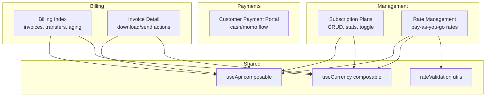
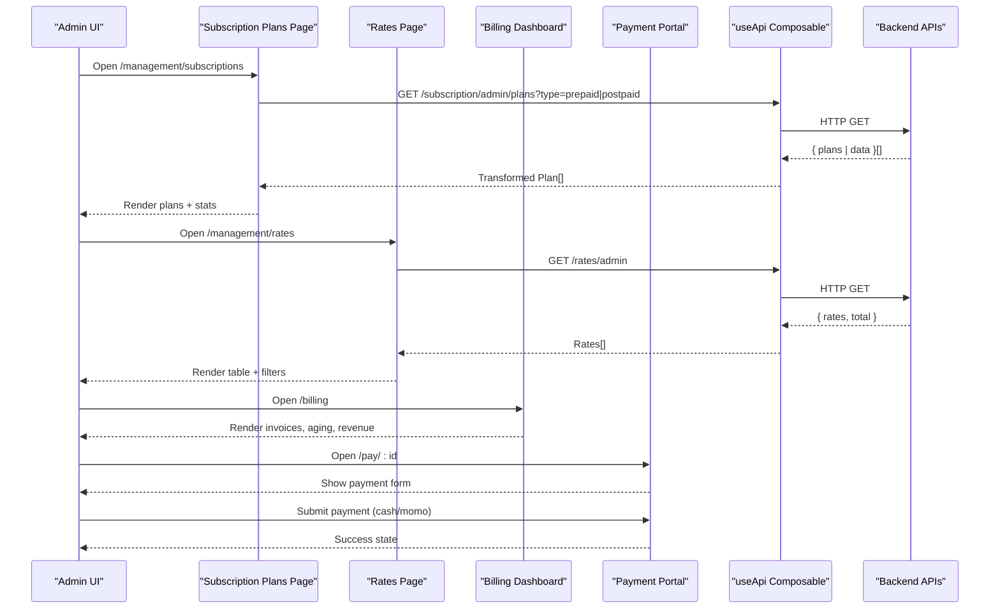
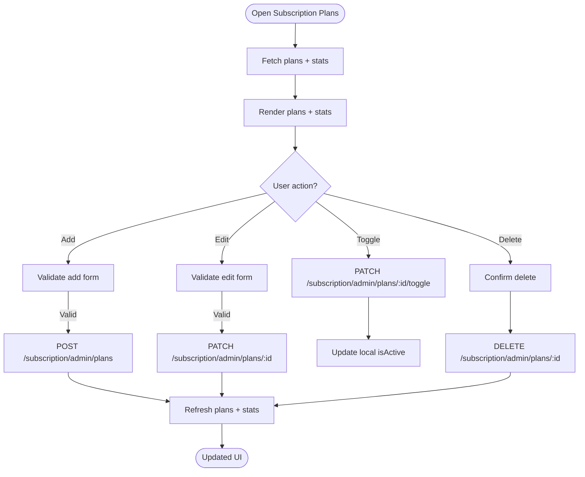
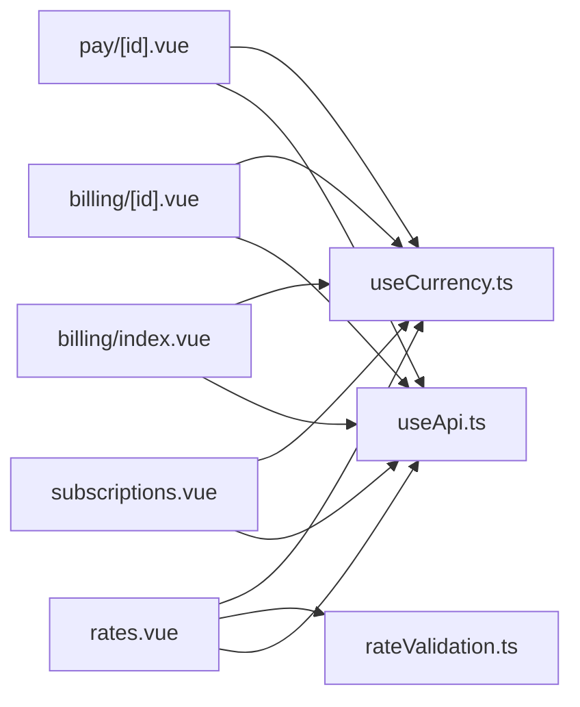

# Billing & Subscriptions

<cite>
**Referenced Files in This Document**
- [billing/index.vue](file://app/pages/billing/index.vue)
- [billing/[id].vue](file://app/pages/billing/[id].vue)
- [management/subscriptions.vue](file://app/pages/management/subscriptions.vue)
- [management/rates.vue](file://app/pages/management/rates.vue)
- [pay/[id].vue](file://app/pages/pay/[id].vue)
- [useApi.ts](file://app/composables/useApi.ts)
- [useCurrency.ts](file://app/composables/useCurrency.ts)
- [rateValidation.ts](file://app/utils/rateValidation.ts)
</cite>

## Table of Contents
1. [Introduction](#introduction)
2. [Project Structure](#project-structure)
3. [Core Components](#core-components)
4. [Architecture Overview](#architecture-overview)
5. [Detailed Component Analysis](#detailed-component-analysis)
6. [Dependency Analysis](#dependency-analysis)
7. [Performance Considerations](#performance-considerations)
8. [Troubleshooting Guide](#troubleshooting-guide)
9. [Conclusion](#conclusion)
10. [Appendices](#appendices)

## Introduction
This document provides comprehensive documentation for the Billing and Subscription management system within the application. It covers payment processing workflows, subscription plan management, rate configuration, billing cycle handling, invoice generation, payment status tracking, subscription tier management, and revenue analytics integration. The system is implemented as a Nuxt 3 frontend with Vue 3 components that interact with backend APIs via a centralized API composable.

## Project Structure
The billing and subscriptions features are organized by pages and utilities:
- Billing overview and invoice detail views
- Subscription plan management (prepaid/postpaid)
- Pay-as-you-go rate management
- Customer-facing payment portal
- Shared composables and utilities for API calls, currency formatting, and validation

**Diagram sources**
- [billing/index.vue:1-430](file://app/pages/billing/index.vue#L1-L430)
- [billing/[id].vue](file://app/pages/billing/[id].vue#L1-L175)
- [management/subscriptions.vue:1-962](file://app/pages/management/subscriptions.vue#L1-L962)
- [management/rates.vue:1-882](file://app/pages/management/rates.vue#L1-L882)
- [pay/[id].vue](file://app/pages/pay/[id].vue#L1-L353)
- [useApi.ts:1-91](file://app/composables/useApi.ts#L1-L91)
- [useCurrency.ts:1-12](file://app/composables/useCurrency.ts#L1-L12)
- [rateValidation.ts:1-69](file://app/utils/rateValidation.ts#L1-L69)

**Section sources**
- [billing/index.vue:1-430](file://app/pages/billing/index.vue#L1-L430)
- [billing/[id].vue](file://app/pages/billing/[id].vue#L1-L175)
- [management/subscriptions.vue:1-962](file://app/pages/management/subscriptions.vue#L1-L962)
- [management/rates.vue:1-882](file://app/pages/management/rates.vue#L1-L882)
- [pay/[id].vue](file://app/pages/pay/[id].vue#L1-L353)
- [useApi.ts:1-91](file://app/composables/useApi.ts#L1-L91)
- [useCurrency.ts:1-12](file://app/composables/useCurrency.ts#L1-L12)
- [rateValidation.ts:1-69](file://app/utils/rateValidation.ts#L1-L69)

## Core Components
- Billing Dashboard: Displays pending bank transfers, recent invoices, payment aging, and revenue breakdown. Supports search and pagination.
- Invoice Detail: Shows invoice metadata, line items, totals, and actions to download or send.
- Subscription Plan Management: Full CRUD for prepaid/postpaid plans with billing cycles, pricing, feature counts, active toggling, and statistics.
- Rate Management: Configures pay-as-you-go pickup rates per customer type and estimated quantity tiers with effective dates and notes.
- Customer Payment Portal: Accepts cash or mobile money payments with validation, countdown, and success states.

Key shared utilities:
- useApi: Centralized HTTP client with authentication headers, error handling, and typed helpers.
- useCurrency: Formats amounts in GHS using Intl.NumberFormat.
- rateValidation: Validates and transforms rate form data into API payloads.

**Section sources**
- [billing/index.vue:1-430](file://app/pages/billing/index.vue#L1-L430)
- [billing/[id].vue](file://app/pages/billing/[id].vue#L1-L175)
- [management/subscriptions.vue:1-962](file://app/pages/management/subscriptions.vue#L1-L962)
- [management/rates.vue:1-882](file://app/pages/management/rates.vue#L1-L882)
- [pay/[id].vue](file://app/pages/pay/[id].vue#L1-L353)
- [useApi.ts:1-91](file://app/composables/useApi.ts#L1-L91)
- [useCurrency.ts:1-12](file://app/composables/useCurrency.ts#L1-L12)
- [rateValidation.ts:1-69](file://app/utils/rateValidation.ts#L1-L69)

## Architecture Overview
The system follows a component-driven architecture where each page encapsulates its own state and API interactions. Data flows from backend endpoints through useApi into reactive UI state, which renders tables, charts, and forms.

**Diagram sources**
- [management/subscriptions.vue:153-248](file://app/pages/management/subscriptions.vue#L153-L248)
- [management/rates.vue:57-124](file://app/pages/management/rates.vue#L57-L124)
- [billing/index.vue:1-430](file://app/pages/billing/index.vue#L1-L430)
- [pay/[id].vue](file://app/pages/pay/[id].vue#L1-L353)
- [useApi.ts:1-91](file://app/composables/useApi.ts#L1-L91)

## Detailed Component Analysis

### Billing Dashboard
- Pending Bank Transfers: Searchable, paginated list with approve/decline actions. Uses local state for demo purposes.
- Recent Invoices: Searchable, paginated list with plan type badges and status badges. Links to invoice detail view.
- Revenue Breakdown: Static dataset showing monthly subscriptions, PAYG revenue, and outstanding amounts.
- Payment Aging: SVG donut chart representing current, 1–30 days, 31–60 days, and 60+ days buckets.

Data model highlights:
- Transfer: id, customer, paymentType, amount, reference, submitted
- Invoice: id, customer, planType, amount, date, status
- Revenue/Aging: label, amount, pct, color

Actions:
- Approve/Decline transfer (local filter-based removal)
- View invoice detail via route link

**Section sources**
- [billing/index.vue:1-430](file://app/pages/billing/index.vue#L1-L430)

### Invoice Detail
- Displays invoice header, status badge, From/Bill To addresses, invoice/due dates, payment method, line items, subtotal/tax/total.
- Actions: Download PDF, Send (UI only).

Data model highlights:
- Invoice: id, status, from, billTo, invoiceDate, dueDate, paymentMethod, items[], subtotal, tax, taxRate, total

**Section sources**
- [billing/[id].vue](file://app/pages/billing/[id].vue#L1-L175)

### Subscription Plan Management
- Tabs: Prepaid vs Postpaid
- Stats: Total plans, active plans, subscribers, estimated revenue
- Plan cards: Name, description, subscriber count, active/inactive, pickups, bins, price, billing cycle, billing type
- Actions: Add, Edit, Delete, Toggle Active

API integration:
- Fetch plans: GET /subscription/admin/plans?type=prepaid|postpaid
- Fetch stats: GET /subscription/admin/stats?type=prepaid|postpaid
- Create plan: POST /subscription/admin/plans
- Update plan: PATCH /subscription/admin/plans/:id
- Toggle plan: PATCH /subscription/admin/plans/:id/toggle
- Delete plan: DELETE /subscription/admin/plans/:id

Data transformation:
- apiToPlan maps API fields to UI fields (type→billingType, pickups→pickupCount, bins→binCount, badgeColor→color)
- formToApiPayload maps UI form fields to API payload (name, description, type, pickups, bins, billingCycle, price, badgeColor, isActive)

Validation:
- Client-side validation ensures required fields and numeric constraints before submission.

Error handling:
- 401 triggers logout and redirect via useApi
- 400 validation errors displayed in modal
- Other errors show toast notifications

Lifecycle:
- onMounted fetches plans and stats
- watch(activeTab) refreshes when switching tabs

**Diagram sources**
- [management/subscriptions.vue:153-548](file://app/pages/management/subscriptions.vue#L153-L548)

**Section sources**
- [management/subscriptions.vue:1-962](file://app/pages/management/subscriptions.vue#L1-L962)

### Rate Management (Pay-as-you-go)
- Filters: By customer type and status (active/upcoming/inactive)
- Stats: Total rates, active, upcoming, customer types
- Table columns: Customer type, estimated quantity, pickup rate, effective date, status, note, created, actions
- Actions: Add, Edit, Delete

API integration:
- Fetch rates: GET /rates/admin
- Fetch stats: GET /rates/admin/stats
- Fetch customer types: GET /customer/admin/types
- Fetch estimated quantities: GET /disposable/quantities
- Create rate: POST /rates/admin
- Update rate: PATCH /rates/admin/:id
- Delete rate: DELETE /rates/admin/:id

Validation and transformation:
- validateForm enforces required fields and positive numeric rate
- formToApiPayload converts form inputs to API payload (rate, estimatedQuantityId, effectiveDate, note, isActive)

Status logic:
- active if effectiveDate <= today and isActive
- upcoming if effectiveDate > today and isActive
- inactive if !isActive

**Section sources**
- [management/rates.vue:1-882](file://app/pages/management/rates.vue#L1-L882)
- [rateValidation.ts:1-69](file://app/utils/rateValidation.ts#L1-L69)

### Customer Payment Portal
- Modes: Cash and Mobile Money (MTN, Telecel, AirtelTigo)
- Inputs: Telco selection, MoMo number (validated), custom amount
- States: Form → Awaiting approval (countdown) → Success
- Validation: Amount must be positive; MoMo number must match pattern

Flow:
- Select mode
- If MoMo: choose telco, enter phone number, submit → show waiting screen with countdown
- If Cash: submit → simulate processing → success
- Success shows confirmation and return to dashboard

**Section sources**
- [pay/[id].vue](file://app/pages/pay/[id].vue#L1-L353)

## Dependency Analysis
- Pages depend on useApi for all HTTP requests, including auth token injection and error handling.
- All monetary values are formatted via useCurrency.
- Rate management depends on rateValidation for consistent validation and payload mapping.
- Subscription management uses internal transformations between API and UI models.

**Diagram sources**
- [management/subscriptions.vue:153-548](file://app/pages/management/subscriptions.vue#L153-L548)
- [management/rates.vue:57-124](file://app/pages/management/rates.vue#L57-L124)
- [billing/index.vue:1-430](file://app/pages/billing/index.vue#L1-L430)
- [billing/[id].vue](file://app/pages/billing/[id].vue#L1-L175)
- [pay/[id].vue](file://app/pages/pay/[id].vue#L1-L353)
- [useApi.ts:1-91](file://app/composables/useApi.ts#L1-L91)
- [useCurrency.ts:1-12](file://app/composables/useCurrency.ts#L1-L12)
- [rateValidation.ts:1-69](file://app/utils/rateValidation.ts#L1-L69)

**Section sources**
- [useApi.ts:1-91](file://app/composables/useApi.ts#L1-L91)
- [useCurrency.ts:1-12](file://app/composables/useCurrency.ts#L1-L12)
- [rateValidation.ts:1-69](file://app/utils/rateValidation.ts#L1-L69)

## Performance Considerations
- Pagination and filtering are implemented client-side for small datasets; consider server-side pagination for large lists.
- Debounce search inputs to reduce reactivity overhead.
- Cache API responses for static references like customer types and estimated quantities.
- Use skeleton loaders during initial load to improve perceived performance.
- Avoid unnecessary re-renders by memoizing computed properties and minimizing deep watchers.

[No sources needed since this section provides general guidance]

## Troubleshooting Guide
Common issues and resolutions:
- Authentication failures (401): useApi automatically logs out and redirects to login. Ensure tokens are present and not expired.
- Validation errors: For subscription and rate forms, 400 errors are shown in modals. Check required fields and numeric constraints.
- Network errors: useErrorHandler wraps requests and displays toast messages. Verify API base URL and connectivity.
- Empty states: Ensure API endpoints return expected structures; some endpoints support multiple response formats (e.g., { plans }, { data }, or arrays).

Operational tips:
- Inspect console logs emitted by useApi for request/response details.
- Confirm correct query parameters for subscription endpoints (type=prepaid|postpaid).
- Validate MoMo phone numbers against expected patterns.

**Section sources**
- [useApi.ts:1-91](file://app/composables/useApi.ts#L1-L91)
- [management/subscriptions.vue:289-449](file://app/pages/management/subscriptions.vue#L289-L449)
- [management/rates.vue:230-387](file://app/pages/management/rates.vue#L230-L387)
- [pay/[id].vue](file://app/pages/pay/[id].vue#L64-L97)

## Conclusion
The Billing & Subscriptions module provides a robust foundation for managing subscription plans, configuring pay-as-you-go rates, viewing invoices and payment statuses, and processing customer payments. The architecture leverages reusable composables for API access and currency formatting, while maintaining clear separation of concerns across pages. Future enhancements can include server-side pagination, richer analytics dashboards, and deeper integrations with external payment gateways.

[No sources needed since this section summarizes without analyzing specific files]

## Appendices

### API Endpoints Summary
- Subscription Plans
  - GET /subscription/admin/plans?type={prepaid|postpaid}
  - POST /subscription/admin/plans
  - PATCH /subscription/admin/plans/:id
  - PATCH /subscription/admin/plans/:id/toggle
  - DELETE /subscription/admin/plans/:id
  - GET /subscription/admin/stats?type={prepaid|postpaid}
- Rates
  - GET /rates/admin
  - GET /rates/admin/stats
  - POST /rates/admin
  - PATCH /rates/admin/:id
  - DELETE /rates/admin/:id
  - GET /customer/admin/types
  - GET /disposable/quantities

**Section sources**
- [management/subscriptions.vue:153-548](file://app/pages/management/subscriptions.vue#L153-L548)
- [management/rates.vue:57-124](file://app/pages/management/rates.vue#L57-L124)

### Data Models Overview
- Plan (UI): id, name, description, billingType, billingCycle, pickupCount, binCount, price, color, subscriberCount, isActive
- Plan (API): id, name, description, type, pickups, bins, billingCycle, price, badgeColor, subscriberCount, isActive, createdAt, updatedAt
- Rate (UI/API): id, customerTypeId, estimatedQuantityId, rate, effectiveDate, note, isActive, createdAt, updatedAt
- Invoice (UI): id, status, from, billTo, invoiceDate, dueDate, paymentMethod, items[], subtotal, tax, taxRate, total
- Transfer (UI): id, customer, paymentType, amount, reference, submitted

**Section sources**
- [management/subscriptions.vue:1-130](file://app/pages/management/subscriptions.vue#L1-L130)
- [management/rates.vue:1-50](file://app/pages/management/rates.vue#L1-L50)
- [billing/[id].vue](file://app/pages/billing/[id].vue#L1-L42)
- [billing/index.vue:34-79](file://app/pages/billing/index.vue#L34-L79)