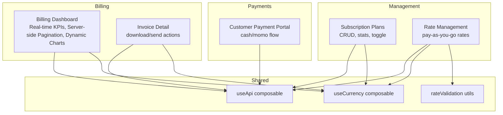
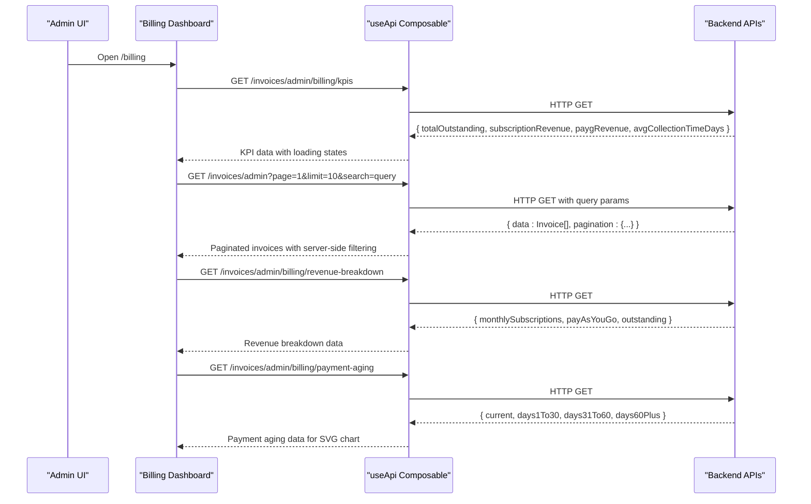
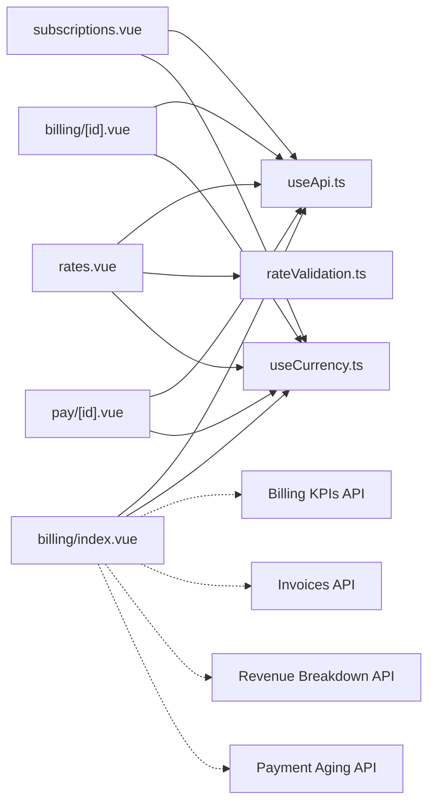

# Billing & Subscriptions

<cite>
**Referenced Files in This Document**
- [billing/index.vue](file://app/pages/billing/index.vue)
- [billing/[id].vue](file://app/pages/billing/[id].vue)
- [management/subscriptions.vue](file://app/pages/management/subscriptions.vue)
- [management/rates.vue](file://app/pages/management/rates.vue)
- [pay/[id].vue](file://app/pages/pay/[id].vue)
- [useApi.ts](file://app/composables/useApi.ts)
- [useCurrency.ts](file://app/composables/useCurrency.ts)
- [rateValidation.ts](file://app/utils/rateValidation.ts)
</cite>

## Update Summary
**Changes Made**
- Updated Billing Dashboard section to reflect complete transformation from static mock data to dynamic API-integrated system
- Added new sections covering real-time KPI fetching, server-side pagination, and skeleton loading animations
- Enhanced API endpoints documentation with new billing-specific endpoints
- Updated architecture diagrams to show new data flow patterns
- Added comprehensive TypeScript interface documentation for type safety

## Table of Contents
1. [Introduction](#introduction)
2. [Project Structure](#project-structure)
3. [Core Components](#core-components)
4. [Architecture Overview](#architecture-overview)
5. [Detailed Component Analysis](#detailed-component-analysis)
6. [Dependency Analysis](#dependency-analysis)
7. [Performance Considerations](#performance-considerations)
8. [Troubleshooting Guide](#troubleshooting-guide)
9. [Conclusion](#conclusion)
10. [Appendices](#appendices)

## Introduction
This document provides comprehensive documentation for the Billing and Subscription management system within the application. It covers payment processing workflows, subscription plan management, rate configuration, billing cycle handling, invoice generation, payment status tracking, subscription tier management, and revenue analytics integration. The system is implemented as a Nuxt 3 frontend with Vue 3 components that interact with backend APIs via a centralized API composable.

**Updated** The billing dashboard has been completely transformed from static mock data to a fully dynamic, API-integrated system featuring real-time data fetching, server-side pagination, skeleton loading animations, and comprehensive error handling.

## Project Structure
The billing and subscriptions features are organized by pages and utilities:
- Billing overview and invoice detail views with real-time API integration
- Subscription plan management (prepaid/postpaid)
- Pay-as-you-go rate management
- Customer-facing payment portal
- Shared composables and utilities for API calls, currency formatting, and validation

**Diagram sources**
- [billing/index.vue:1-599](file://app/pages/billing/index.vue#L1-L599)
- [billing/[id].vue](file://app/pages/billing/[id].vue#L1-L175)
- [management/subscriptions.vue:1-962](file://app/pages/management/subscriptions.vue#L1-L962)
- [management/rates.vue:1-882](file://app/pages/management/rates.vue#L1-L882)
- [pay/[id].vue](file://app/pages/pay/[id].vue#L1-L353)
- [useApi.ts:1-91](file://app/composables/useApi.ts#L1-L91)
- [useCurrency.ts:1-12](file://app/composables/useCurrency.ts#L1-L12)
- [rateValidation.ts:1-69](file://app/utils/rateValidation.ts#L1-L69)

**Section sources**
- [billing/index.vue:1-599](file://app/pages/billing/index.vue#L1-L599)
- [billing/[id].vue](file://app/pages/billing/[id].vue#L1-L175)
- [management/subscriptions.vue:1-962](file://app/pages/management/subscriptions.vue#L1-L962)
- [management/rates.vue:1-882](file://app/pages/management/rates.vue#L1-L882)
- [pay/[id].vue](file://app/pages/pay/[id].vue#L1-L353)
- [useApi.ts:1-91](file://app/composables/useApi.ts#L1-L91)
- [useCurrency.ts:1-12](file://app/composables/useCurrency.ts#L1-L12)
- [rateValidation.ts:1-69](file://app/utils/rateValidation.ts#L1-L69)

## Core Components
- **Billing Dashboard**: Real-time KPI display with skeleton loading, searchable paginated invoices with server-side filtering, dynamic revenue breakdown charts, and SVG-based payment aging visualization. Features comprehensive error handling and loading states.
- Invoice Detail: Shows invoice metadata, line items, totals, and actions to download or send.
- Subscription Plan Management: Full CRUD for prepaid/postpaid plans with billing cycles, pricing, feature counts, active toggling, and statistics.
- Rate Management: Configures pay-as-you-go pickup rates per customer type and estimated quantity tiers with effective dates and notes.
- Customer Payment Portal: Accepts cash or mobile money payments with validation, countdown, and success states.

Key shared utilities:
- useApi: Centralized HTTP client with authentication headers, error handling, and typed helpers.
- useCurrency: Formats amounts in GHS using Intl.NumberFormat.
- rateValidation: Validates and transforms rate form data into API payloads.

**Updated** The billing dashboard now includes TypeScript interfaces for all data models, comprehensive loading states with skeleton animations, and robust error handling throughout the component lifecycle.

**Section sources**
- [billing/index.vue:1-599](file://app/pages/billing/index.vue#L1-L599)
- [billing/[id].vue](file://app/pages/billing/[id].vue#L1-L175)
- [management/subscriptions.vue:1-962](file://app/pages/management/subscriptions.vue#L1-L962)
- [management/rates.vue:1-882](file://app/pages/management/rates.vue#L1-L882)
- [pay/[id].vue](file://app/pages/pay/[id].vue#L1-L353)
- [useApi.ts:1-91](file://app/composables/useApi.ts#L1-L91)
- [useCurrency.ts:1-12](file://app/composables/useCurrency.ts#L1-L12)
- [rateValidation.ts:1-69](file://app/utils/rateValidation.ts#L1-L69)

## Architecture Overview
The system follows a component-driven architecture where each page encapsulates its own state and API interactions. Data flows from backend endpoints through useApi into reactive UI state, which renders tables, charts, and forms. The billing dashboard now implements a sophisticated multi-API data fetching pattern with proper loading states and error handling.

**Diagram sources**
- [billing/index.vue:21-38](file://app/pages/billing/index.vue#L21-L38)
- [billing/index.vue:135-158](file://app/pages/billing/index.vue#L135-L158)
- [billing/index.vue:194-204](file://app/pages/billing/index.vue#L194-L204)
- [billing/index.vue:232-242](file://app/pages/billing/index.vue#L232-L242)
- [useApi.ts:1-91](file://app/composables/useApi.ts#L1-L91)

## Detailed Component Analysis

### Billing Dashboard
**Updated** The billing dashboard has been completely transformed from static mock data to a fully dynamic, API-integrated system with real-time data fetching, comprehensive loading states, and robust error handling.

#### Real-time KPI Data Fetching
- **KPI Interface**: `BillingKpis` interface defines totalOutstanding, subscriptionRevenue, paygRevenue, and avgCollectionTimeDays
- **Loading States**: Skeleton animations displayed during data fetch with kpisLoading ref
- **Error Handling**: Comprehensive try-catch blocks with user-friendly error messages
- **Data Transformation**: Direct mapping from API response to reactive state

#### Server-side Invoice Pagination
- **Pagination Interface**: `InvoicePagination` interface with page, limit, total, totalPages, hasNextPage, hasPreviousPage
- **Search Integration**: Immediate API calls on search input changes with automatic page reset
- **URL Parameters**: Proper URLSearchParams construction for server-side filtering
- **State Management**: Separate loading state (invoiceLoading) for invoice operations

#### Dynamic Revenue Breakdown
- **Revenue Interface**: `RevenueBreakdown` interface with monthlySubscriptions, payAsYouGo, outstanding fields
- **Computed Percentages**: Automatic percentage calculation based on total revenue
- **Visual Representation**: Progress bars with color-coded categories
- **Loading States**: Dedicated revenueLoading state with skeleton support

#### Payment Aging Analytics
- **Aging Interface**: `PaymentAging` interface with current, days1To30, days31To60, days60Plus buckets
- **SVG Donut Chart**: Dynamic SVG rendering based on computed slices
- **Color Coding**: Green (current), yellow (1-30 days), orange (31-60 days), red (60+ days)
- **Responsive Design**: Adapts to zero values with empty chart state

#### Enhanced Search Functionality
- **Immediate API Calls**: Search triggers instant server requests without debounce
- **Automatic Pagination Reset**: Search resets to page 1 automatically
- **Client-side Fallback**: Local filtering for transfers while invoices use server-side search

**New Features**:
- **Skeleton Loading Animations**: CSS-based pulse animations for better perceived performance
- **TypeScript Interfaces**: Complete type safety for all API responses and local state
- **Comprehensive Error Handling**: User-friendly error messages with toast notifications
- **Loading State Management**: Separate loading states for different data sources

**Section sources**
- [billing/index.vue:6-31](file://app/pages/billing/index.vue#L6-L31)
- [billing/index.vue:102-179](file://app/pages/billing/index.vue#L102-L179)
- [billing/index.vue:181-215](file://app/pages/billing/index.vue#L181-L215)
- [billing/index.vue:217-261](file://app/pages/billing/index.vue#L217-L261)
- [billing/index.vue:588-598](file://app/pages/billing/index.vue#L588-L598)

### Invoice Detail
- Displays invoice header, status badge, From/Bill To addresses, invoice/due dates, payment method, line items, subtotal/tax/total.
- Actions: Download PDF, Send (UI only).

Data model highlights:
- Invoice: id, status, from, billTo, invoiceDate, dueDate, paymentMethod, items[], subtotal, tax, taxRate, total

**Section sources**
- [billing/[id].vue](file://app/pages/billing/[id].vue#L1-L175)

### Subscription Plan Management
- Tabs: Prepaid vs Postpaid
- Stats: Total plans, active plans, subscribers, estimated revenue
- Plan cards: Name, description, subscriber count, active/inactive, pickups, bins, price, billing cycle, billing type
- Actions: Add, Edit, Delete, Toggle Active

API integration:
- Fetch plans: GET /subscription/admin/plans?type=prepaid|postpaid
- Fetch stats: GET /subscription/admin/stats?type=prepaid|postpaid
- Create plan: POST /subscription/admin/plans
- Update plan: PATCH /subscription/admin/plans/:id
- Toggle plan: PATCH /subscription/admin/plans/:id/toggle
- Delete plan: DELETE /subscription/admin/plans/:id

Data transformation:
- apiToPlan maps API fields to UI fields (type→billingType, pickups→pickupCount, bins→binCount, badgeColor→color)
- formToApiPayload maps UI form fields to API payload (name, description, type, pickups, bins, billingCycle, price, badgeColor, isActive)

Validation:
- Client-side validation ensures required fields and numeric constraints before submission.

Error handling:
- 401 triggers logout and redirect via useApi
- 400 validation errors displayed in modal
- Other errors show toast notifications

Lifecycle:
- onMounted fetches plans and stats
- watch(activeTab) refreshes when switching tabs

**Diagram sources**
- [management/subscriptions.vue:153-548](file://app/pages/management/subscriptions.vue#L153-L548)

**Section sources**
- [management/subscriptions.vue:1-962](file://app/pages/management/subscriptions.vue#L1-L962)

### Rate Management (Pay-as-you-go)
- Filters: By customer type and status (active/upcoming/inactive)
- Stats: Total rates, active, upcoming, customer types
- Table columns: Customer type, estimated quantity, pickup rate, effective date, status, note, created, actions
- Actions: Add, Edit, Delete

API integration:
- Fetch rates: GET /rates/admin
- Fetch stats: GET /rates/admin/stats
- Fetch customer types: GET /customer/admin/types
- Fetch estimated quantities: GET /disposable/quantities
- Create rate: POST /rates/admin
- Update rate: PATCH /rates/admin/:id
- Delete rate: DELETE /rates/admin/:id

Validation and transformation:
- validateForm enforces required fields and positive numeric rate
- formToApiPayload converts form inputs to API payload (rate, estimatedQuantityId, effectiveDate, note, isActive)

Status logic:
- active if effectiveDate <= today and isActive
- upcoming if effectiveDate > today and isActive
- inactive if !isActive

**Section sources**
- [management/rates.vue:1-882](file://app/pages/management/rates.vue#L1-L882)
- [rateValidation.ts:1-69](file://app/utils/rateValidation.ts#L1-L69)

### Customer Payment Portal
- Modes: Cash and Mobile Money (MTN, Telecel, AirtelTigo)
- Inputs: Telco selection, MoMo number (validated), custom amount
- States: Form → Awaiting approval (countdown) → Success
- Validation: Amount must be positive; MoMo number must match pattern

Flow:
- Select mode
- If MoMo: choose telco, enter phone number, submit → show waiting screen with countdown
- If Cash: submit → simulate processing → success
- Success shows confirmation and return to dashboard

**Section sources**
- [pay/[id].vue](file://app/pages/pay/[id].vue#L1-L353)

## Dependency Analysis
- Pages depend on useApi for all HTTP requests, including auth token injection and error handling.
- All monetary values are formatted via useCurrency.
- Rate management depends on rateValidation for consistent validation and payload mapping.
- Subscription management uses internal transformations between API and UI models.
- **Updated** Billing dashboard now implements multiple concurrent API calls with independent loading states and comprehensive error handling.

**Diagram sources**
- [management/subscriptions.vue:153-548](file://app/pages/management/subscriptions.vue#L153-L548)
- [management/rates.vue:57-124](file://app/pages/management/rates.vue#L57-L124)
- [billing/index.vue:21-38](file://app/pages/billing/index.vue#L21-L38)
- [billing/[id].vue](file://app/pages/billing/[id].vue#L1-L175)
- [pay/[id].vue](file://app/pages/pay/[id].vue#L1-L353)
- [useApi.ts:1-91](file://app/composables/useApi.ts#L1-L91)
- [useCurrency.ts:1-12](file://app/composables/useCurrency.ts#L1-L12)
- [rateValidation.ts:1-69](file://app/utils/rateValidation.ts#L1-L69)

**Section sources**
- [useApi.ts:1-91](file://app/composables/useApi.ts#L1-L91)
- [useCurrency.ts:1-12](file://app/composables/useCurrency.ts#L1-L12)
- [rateValidation.ts:1-69](file://app/utils/rateValidation.ts#L1-L69)

## Performance Considerations
- **Updated** Server-side pagination implemented for invoices to handle large datasets efficiently
- Debounce search inputs to reduce reactivity overhead (currently immediate API calls for enhanced UX)
- Cache API responses for static references like customer types and estimated quantities
- Use skeleton loaders during initial load to improve perceived performance
- Avoid unnecessary re-renders by memoizing computed properties and minimizing deep watchers
- **New** Concurrent API calls with independent loading states prevent blocking UI updates
- **New** TypeScript interfaces provide compile-time type safety and better IDE support

[No sources needed since this section provides general guidance]

## Troubleshooting Guide
Common issues and resolutions:
- Authentication failures (401): useApi automatically logs out and redirects to login. Ensure tokens are present and not expired.
- Validation errors: For subscription and rate forms, 400 errors are shown in modals. Check required fields and numeric constraints.
- Network errors: useErrorHandler wraps requests and displays toast messages. Verify API base URL and connectivity.
- Empty states: Ensure API endpoints return expected structures; some endpoints support multiple response formats (e.g., { plans }, { data }, or arrays).
- **Updated** Billing dashboard loading states: Check console logs for specific API call failures and verify network connectivity to billing endpoints.
- **Updated** TypeScript errors: Ensure all API response interfaces match actual backend response structures.

Operational tips:
- Inspect console logs emitted by useApi for request/response details.
- Confirm correct query parameters for subscription endpoints (type=prepaid|postpaid).
- Validate MoMo phone numbers against expected patterns.
- **New** Monitor loading states in billing dashboard to identify slow API responses.
- **New** Check browser network tab for detailed API request/response information when debugging billing data issues.

**Section sources**
- [useApi.ts:1-91](file://app/composables/useApi.ts#L1-L91)
- [management/subscriptions.vue:289-449](file://app/pages/management/subscriptions.vue#L289-L449)
- [management/rates.vue:230-387](file://app/pages/management/rates.vue#L230-L387)
- [pay/[id].vue](file://app/pages/pay/[id].vue#L64-L97)
- [billing/index.vue:21-31](file://app/pages/billing/index.vue#L21-L31)

## Conclusion
The Billing & Subscriptions module provides a robust foundation for managing subscription plans, configuring pay-as-you-go rates, viewing invoices and payment statuses, and processing customer payments. The architecture leverages reusable composables for API access and currency formatting, while maintaining clear separation of concerns across pages. 

**Updated** The billing dashboard has been significantly enhanced with real-time API integration, comprehensive loading states, TypeScript type safety, and improved user experience through skeleton animations and responsive design. Future enhancements can include server-side pagination for other lists, richer analytics dashboards, and deeper integrations with external payment gateways.

[No sources needed since this section summarizes without analyzing specific files]

## Appendices

### API Endpoints Summary
- **Updated** Billing Dashboard Endpoints
  - GET /invoices/admin/billing/kpis - Returns real-time KPI data
  - GET /invoices/admin - Returns paginated invoices with search support
  - GET /invoices/admin/billing/revenue-breakdown - Returns revenue breakdown data
  - GET /invoices/admin/billing/payment-aging - Returns payment aging analytics
- Subscription Plans
  - GET /subscription/admin/plans?type={prepaid|postpaid}
  - POST /subscription/admin/plans
  - PATCH /subscription/admin/plans/:id
  - PATCH /subscription/admin/plans/:id/toggle
  - DELETE /subscription/admin/plans/:id
  - GET /subscription/admin/stats?type={prepaid|postpaid}
- Rates
  - GET /rates/admin
  - GET /rates/admin/stats
  - POST /rates/admin
  - PATCH /rates/admin/:id
  - DELETE /rates/admin/:id
  - GET /customer/admin/types
  - GET /disposable/quantities

**Section sources**
- [billing/index.vue:21-38](file://app/pages/billing/index.vue#L21-L38)
- [billing/index.vue:135-158](file://app/pages/billing/index.vue#L135-L158)
- [billing/index.vue:194-204](file://app/pages/billing/index.vue#L194-L204)
- [billing/index.vue:232-242](file://app/pages/billing/index.vue#L232-L242)
- [management/subscriptions.vue:153-548](file://app/pages/management/subscriptions.vue#L153-L548)
- [management/rates.vue:57-124](file://app/pages/management/rates.vue#L57-L124)

### Data Models Overview
- **Updated** Billing Dashboard Interfaces
  - BillingKpis: totalOutstanding, subscriptionRevenue, paygRevenue, avgCollectionTimeDays
  - Invoice: id, invoiceNumber, customerId, customerName, type, status, issueDate, dueDate, totalAmount
  - InvoicePagination: page, limit, total, totalPages, hasNextPage, hasPreviousPage
  - RevenueBreakdown: monthlySubscriptions, payAsYouGo, outstanding
  - PaymentAging: current, days1To30, days31To60, days60Plus
- Plan (UI): id, name, description, billingType, billingCycle, pickupCount, binCount, price, color, subscriberCount, isActive
- Plan (API): id, name, description, type, pickups, bins, billingCycle, price, badgeColor, subscriberCount, isActive, createdAt, updatedAt
- Rate (UI/API): id, customerTypeId, estimatedQuantityId, rate, effectiveDate, note, isActive, createdAt, updatedAt
- Invoice (UI): id, status, from, billTo, invoiceDate, dueDate, paymentMethod, items[], subtotal, tax, taxRate, total
- Transfer (UI): id, customer, paymentType, amount, reference, submitted

**Section sources**
- [billing/index.vue:6-11](file://app/pages/billing/index.vue#L6-L11)
- [billing/index.vue:102-121](file://app/pages/billing/index.vue#L102-L121)
- [billing/index.vue:181-185](file://app/pages/billing/index.vue#L181-L185)
- [billing/index.vue:217-222](file://app/pages/billing/index.vue#L217-L222)
- [management/subscriptions.vue:1-130](file://app/pages/management/subscriptions.vue#L1-L130)
- [management/rates.vue:1-50](file://app/pages/management/rates.vue#L1-L50)
- [billing/[id].vue](file://app/pages/billing/[id].vue#L1-L42)
- [billing/index.vue:34-79](file://app/pages/billing/index.vue#L34-L79)