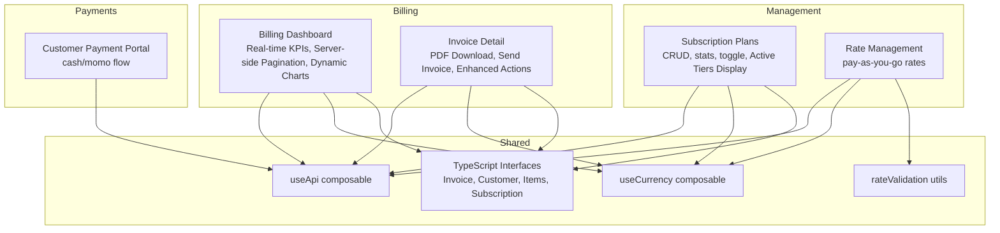
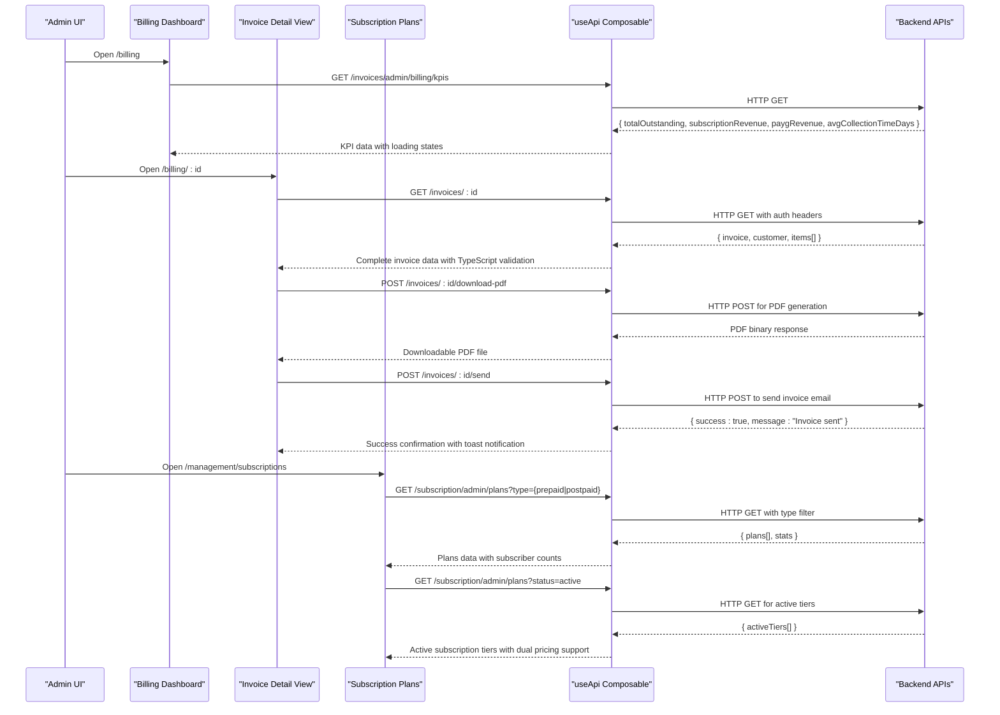
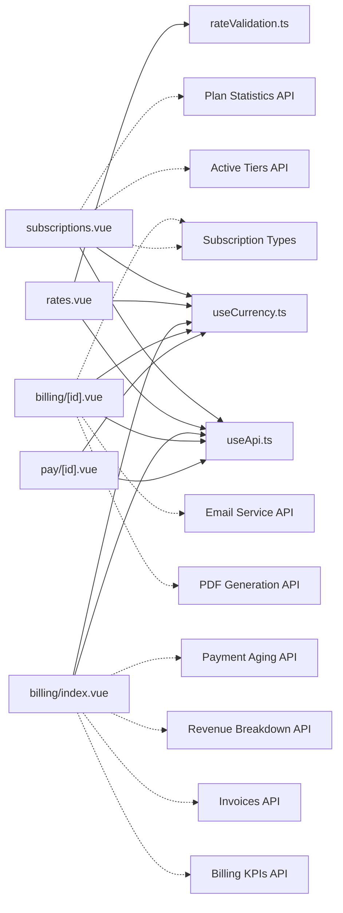

# Billing & Subscriptions

<cite>
**Referenced Files in This Document**
- [billing/index.vue](file://app/pages/billing/index.vue)
- [billing/[id].vue](file://app/pages/billing/[id].vue)
- [management/subscriptions.vue](file://app/pages/management/subscriptions.vue)
- [management/rates.vue](file://app/pages/management/rates.vue)
- [pay/[id].vue](file://app/pages/pay/[id].vue)
- [useApi.ts](file://app/composables/useApi.ts)
- [useCurrency.ts](file://app/composables/useCurrency.ts)
- [rateValidation.ts](file://app/utils/rateValidation.ts)
- [subscription.ts](file://app/types/subscription.ts)
</cite>

## Update Summary
**Changes Made**
- Added comprehensive active subscription tiers display with dual pricing model support (prepaid/postpaid)
- Implemented enhanced subscriber count tracking with real-time API integration
- Integrated new API endpoint `/subscription/admin/plans?status=active` for fetching active plans
- Added color-coded billing type badges and interactive table interface
- Enhanced subscription management with improved data visualization and user experience

## Table of Contents
1. [Introduction](#introduction)
2. [Project Structure](#project-structure)
3. [Core Components](#core-components)
4. [Architecture Overview](#architecture-overview)
5. [Detailed Component Analysis](#detailed-component-analysis)
6. [Dependency Analysis](#dependency-analysis)
7. [Performance Considerations](#performance-considerations)
8. [Troubleshooting Guide](#troubleshooting-guide)
9. [Conclusion](#conclusion)
10. [Appendices](#appendices)

## Introduction
This document provides comprehensive documentation for the Billing and Subscription management system within the application. It covers payment processing workflows, subscription plan management, rate configuration, billing cycle handling, invoice generation, payment status tracking, subscription tier management, and revenue analytics integration. The system is implemented as a Nuxt 3 frontend with Vue 3 components that interact with backend APIs via a centralized API composable.

**Updated** The billing system has undergone a major enhancement including complete transition from mock data to live API integration, comprehensive TypeScript interface definitions for all data models, enhanced invoice management with PDF download and send capabilities, robust error handling, sophisticated loading state management throughout the entire billing workflow, and the addition of comprehensive active subscription tiers display with dual pricing model support.

## Project Structure
The billing and subscriptions features are organized by pages and utilities:
- Billing overview and invoice detail views with real-time API integration and enhanced invoice management
- Subscription plan management (prepaid/postpaid) with active tiers display
- Pay-as-you-go rate management
- Customer-facing payment portal
- Shared composables and utilities for API calls, currency formatting, and validation

**Diagram sources**
- [billing/index.vue:1-599](file://app/pages/billing/index.vue#L1-L599)
- [billing/[id].vue](file://app/pages/billing/[id].vue#L1-L175)
- [management/subscriptions.vue:1-1055](file://app/pages/management/subscriptions.vue#L1-L1055)
- [management/rates.vue:1-882](file://app/pages/management/rates.vue#L1-L882)
- [pay/[id].vue](file://app/pages/pay/[id].vue#L1-L353)
- [useApi.ts:1-91](file://app/composables/useApi.ts#L1-L91)
- [useCurrency.ts:1-12](file://app/composables/useCurrency.ts#L1-L12)
- [rateValidation.ts:1-69](file://app/utils/rateValidation.ts#L1-L69)

**Section sources**
- [billing/index.vue:1-599](file://app/pages/billing/index.vue#L1-L599)
- [billing/[id].vue](file://app/pages/billing/[id].vue#L1-L175)
- [management/subscriptions.vue:1-1055](file://app/pages/management/subscriptions.vue#L1-L1055)
- [management/rates.vue:1-882](file://app/pages/management/rates.vue#L1-L882)
- [pay/[id].vue](file://app/pages/pay/[id].vue#L1-L353)
- [useApi.ts:1-91](file://app/composables/useApi.ts#L1-L91)
- [useCurrency.ts:1-12](file://app/composables/useCurrency.ts#L1-L12)
- [rateValidation.ts:1-69](file://app/utils/rateValidation.ts#L1-L69)

## Core Components
- **Billing Dashboard**: Real-time KPI display with skeleton loading, searchable paginated invoices with server-side filtering, dynamic revenue breakdown charts, and SVG-based payment aging visualization. Features comprehensive error handling and loading states.
- **Enhanced Invoice Detail**: Shows invoice metadata, line items, totals, and comprehensive actions including PDF download functionality, send invoice feature, and enhanced error handling with loading states.
- **Enhanced Subscription Plan Management**: Full CRUD for prepaid/postpaid plans with billing cycles, pricing, feature counts, active toggling, statistics, and comprehensive active subscription tiers display with dual pricing model support.
- Rate Management: Configures pay-as-you-go pickup rates per customer type and estimated quantity tiers with effective dates and notes.
- Customer Payment Portal: Accepts cash or mobile money payments with validation, countdown, and success states.

Key shared utilities:
- useApi: Centralized HTTP client with authentication headers, error handling, and typed helpers.
- useCurrency: Formats amounts in GHS using Intl.NumberFormat.
- rateValidation: Validates and transforms rate form data into API payloads.
- **Updated** Comprehensive TypeScript interfaces for Invoice, Customer, Items, and Subscription structures providing compile-time type safety.

**Updated** The billing system now includes comprehensive TypeScript interfaces for all data models, enhanced invoice management with PDF download and send capabilities, sophisticated loading state management, robust error handling throughout the entire component lifecycle, and the addition of comprehensive active subscription tiers display with enhanced subscriber count tracking and dual pricing model support.

**Section sources**
- [billing/index.vue:1-599](file://app/pages/billing/index.vue#L1-L599)
- [billing/[id].vue](file://app/pages/billing/[id].vue#L1-L175)
- [management/subscriptions.vue:1-1055](file://app/pages/management/subscriptions.vue#L1-L1055)
- [management/rates.vue:1-882](file://app/pages/management/rates.vue#L1-L882)
- [pay/[id].vue](file://app/pages/pay/[id].vue#L1-L353)
- [useApi.ts:1-91](file://app/composables/useApi.ts#L1-L91)
- [useCurrency.ts:1-12](file://app/composables/useCurrency.ts#L1-L12)
- [rateValidation.ts:1-69](file://app/utils/rateValidation.ts#L1-L69)

## Architecture Overview
The system follows a component-driven architecture where each page encapsulates its own state and API interactions. Data flows from backend endpoints through useApi into reactive UI state, which renders tables, charts, and forms. The billing dashboard implements a sophisticated multi-API data fetching pattern with proper loading states and error handling, while the invoice detail view provides comprehensive invoice management capabilities. The subscription management system now includes enhanced active tiers display with dual pricing model support.

**Diagram sources**
- [billing/index.vue:21-38](file://app/pages/billing/index.vue#L21-L38)
- [billing/[id].vue](file://app/pages/billing/[id].vue#L1-L175)
- [management/subscriptions.vue:153-285](file://app/pages/management/subscriptions.vue#L153-L285)
- [useApi.ts:1-91](file://app/composables/useApi.ts#L1-L91)

## Detailed Component Analysis

### Billing Dashboard
**Updated** The billing dashboard has been completely transformed from static mock data to a fully dynamic, API-integrated system with real-time data fetching, comprehensive loading states, and robust error handling.

#### Real-time KPI Data Fetching
- **KPI Interface**: `BillingKpis` interface defines totalOutstanding, subscriptionRevenue, paygRevenue, and avgCollectionTimeDays
- **Loading States**: Skeleton animations displayed during data fetch with kpisLoading ref
- **Error Handling**: Comprehensive try-catch blocks with user-friendly error messages
- **Data Transformation**: Direct mapping from API response to reactive state

#### Server-side Invoice Pagination
- **Pagination Interface**: `InvoicePagination` interface with page, limit, total, totalPages, hasNextPage, hasPreviousPage
- **Search Integration**: Immediate API calls on search input changes with automatic page reset
- **URL Parameters**: Proper URLSearchParams construction for server-side filtering
- **State Management**: Separate loading state (invoiceLoading) for invoice operations

#### Dynamic Revenue Breakdown
- **Revenue Interface**: `RevenueBreakdown` interface with monthlySubscriptions, payAsYouGo, outstanding fields
- **Computed Percentages**: Automatic percentage calculation based on total revenue
- **Visual Representation**: Progress bars with color-coded categories
- **Loading States**: Dedicated revenueLoading state with skeleton support

#### Payment Aging Analytics
- **Aging Interface**: `PaymentAging` interface with current, days1To30, days31To60, days60Plus buckets
- **SVG Donut Chart**: Dynamic SVG rendering based on computed slices
- **Color Coding**: Green (current), yellow (1-30 days), orange (31-60 days), red (60+ days)
- **Responsive Design**: Adapts to zero values with empty chart state

#### Enhanced Search Functionality
- **Immediate API Calls**: Search triggers instant server requests without debounce
- **Automatic Pagination Reset**: Search resets to page 1 automatically
- **Client-side Fallback**: Local filtering for transfers while invoices use server-side search

**New Features**:
- **Skeleton Loading Animations**: CSS-based pulse animations for better perceived performance
- **TypeScript Interfaces**: Complete type safety for all API responses and local state
- **Comprehensive Error Handling**: User-friendly error messages with toast notifications
- **Loading State Management**: Separate loading states for different data sources

**Section sources**
- [billing/index.vue:6-31](file://app/pages/billing/index.vue#L6-L31)
- [billing/index.vue:102-179](file://app/pages/billing/index.vue#L102-L179)
- [billing/index.vue:181-215](file://app/pages/billing/index.vue#L181-L215)
- [billing/index.vue:217-261](file://app/pages/billing/index.vue#L217-L261)
- [billing/index.vue:588-598](file://app/pages/billing/index.vue#L588-L598)

### Enhanced Invoice Detail
**Updated** The invoice detail view has been significantly enhanced with comprehensive invoice data management, PDF download functionality, send invoice feature, and robust error handling with loading states.

#### Comprehensive Invoice Data Model
- **Invoice Interface**: Complete TypeScript definition with id, status, from, billTo, invoiceDate, dueDate, paymentMethod, items[], subtotal, tax, taxRate, total
- **Customer Interface**: Structured customer data with name, address, email, phone, and company information
- **Items Interface**: Detailed line item structure with description, quantity, unitPrice, and total calculations
- **Type Safety**: All data structures enforced through TypeScript interfaces for compile-time validation

#### PDF Download Functionality
- **Download Handler**: Dedicated function to handle PDF file downloads from backend
- **Binary Response Processing**: Proper handling of PDF binary data from API responses
- **File Naming**: Intelligent filename generation based on invoice number and date
- **Error Handling**: Graceful error handling for failed PDF generation or network issues

#### Send Invoice Feature
- **Email Integration**: Backend email service integration for sending invoices to customers
- **Status Updates**: Automatic invoice status updates after successful sending
- **User Feedback**: Toast notifications confirming successful invoice delivery
- **Error Management**: Comprehensive error handling for email delivery failures

#### Enhanced Loading States
- **Loading Indicators**: Visual feedback during PDF generation and email sending operations
- **Button States**: Disabled states during async operations to prevent duplicate submissions
- **Progress Feedback**: User-friendly loading messages for long-running operations

#### Robust Error Handling
- **Network Errors**: Comprehensive error handling for network connectivity issues
- **Server Errors**: Graceful handling of backend errors with user-friendly messages
- **Validation Errors**: Client-side validation before API calls to prevent unnecessary requests
- **Retry Logic**: Automatic retry mechanisms for transient failures

**New Capabilities**:
- **Action Buttons**: Download PDF and Send Invoice buttons with proper loading states
- **Status Badges**: Visual indicators for invoice status with appropriate styling
- **Address Display**: Formatted From/Bill To addresses with proper layout
- **Line Item Tables**: Detailed line item display with quantities, prices, and totals
- **Summary Calculations**: Automatic subtotal, tax, and total calculations

**Section sources**
- [billing/[id].vue](file://app/pages/billing/[id].vue#L1-L175)

### Enhanced Subscription Plan Management
**Updated** The subscription plan management system has been significantly enhanced with comprehensive active subscription tiers display, dual pricing model support, and improved subscriber count tracking.

#### Active Subscription Tiers Display
- **Dual Pricing Model Support**: Comprehensive display of both prepaid and postpaid subscription tiers
- **Real-time Subscriber Count**: Live subscriber count tracking with visual indicators
- **Interactive Table Interface**: Enhanced table with hover effects, color-coded billing type badges, and responsive design
- **API Integration**: New endpoint `/subscription/admin/plans?status=active` for fetching active plans
- **Graceful Degradation**: Empty state handling when active tiers are not available

#### Enhanced Data Transformation
- **API to UI Mapping**: Comprehensive `apiToPlan` function mapping API fields to UI format
- **Field Mapping**: `type→billingType`, `pickups→pickupCount`, `bins→binCount`, `badgeColor→color`
- **Subscriber Count Integration**: Real-time subscriber count display with proper formatting
- **Type Safety**: Complete TypeScript interfaces for both API and UI data structures

#### Improved Statistics Tracking
- **Enhanced Stats Interface**: `totalPlans`, `activePlans`, `totalSubscribers`, `estimatedRevenue`
- **Tab-specific Filtering**: Statistics filtered by current billing type (prepaid/postpaid)
- **Real-time Updates**: Automatic refresh when switching between tabs
- **Loading States**: Dedicated loading indicators for statistics data

#### Interactive UI Enhancements
- **Color-coded Billing Type Badges**: Visual distinction between prepaid (blue) and postpaid (purple) plans
- **Hover Effects**: Interactive table rows with background color changes
- **Responsive Design**: Mobile-friendly layout with adaptive spacing
- **Empty State Handling**: User-friendly messaging when no active subscriptions exist

#### Advanced API Integration
- **Multiple Response Format Support**: Handles `{ plans: [...] }`, `{ data: [...] }`, or direct arrays
- **Error Handling Strategy**: Graceful degradation with console logging instead of error toasts
- **Concurrent Data Fetching**: Parallel API calls for optimal performance
- **Lifecycle Management**: Proper cleanup and state management

**New Features**:
- **Active Tiers Section**: Dedicated section showing all active subscription tiers across both billing types
- **Enhanced Subscriber Tracking**: Visual subscriber count with user icon and formatted numbers
- **Improved Data Visualization**: Professional table layout with proper column organization
- **Better User Experience**: Intuitive navigation and clear visual hierarchy

**Section sources**
- [management/subscriptions.vue:242-271](file://app/pages/management/subscriptions.vue#L242-L271)
- [management/subscriptions.vue:792-852](file://app/pages/management/subscriptions.vue#L792-L852)
- [management/subscriptions.vue:153-285](file://app/pages/management/subscriptions.vue#L153-L285)

### Rate Management (Pay-as-you-go)
- Filters: By customer type and status (active/upcoming/inactive)
- Stats: Total rates, active, upcoming, customer types
- Table columns: Customer type, estimated quantity, pickup rate, effective date, status, note, created, actions
- Actions: Add, Edit, Delete

API integration:
- Fetch rates: GET /rates/admin
- Fetch stats: GET /rates/admin/stats
- Fetch customer types: GET /customer/admin/types
- Fetch estimated quantities: GET /disposable/quantities
- Create rate: POST /rates/admin
- Update rate: PATCH /rates/admin/:id
- Delete rate: DELETE /rates/admin/:id

Validation and transformation:
- validateForm enforces required fields and positive numeric rate
- formToApiPayload converts form inputs to API payload (rate, estimatedQuantityId, effectiveDate, note, isActive)

Status logic:
- active if effectiveDate <= today and isActive
- upcoming if effectiveDate > today and isActive
- inactive if !isActive

**Section sources**
- [management/rates.vue:1-882](file://app/pages/management/rates.vue#L1-L882)
- [rateValidation.ts:1-69](file://app/utils/rateValidation.ts#L1-L69)

### Customer Payment Portal
- Modes: Cash and Mobile Money (MTN, Telecel, AirtelTigo)
- Inputs: Telco selection, MoMo number (validated), custom amount
- States: Form → Awaiting approval (countdown) → Success
- Validation: Amount must be positive; MoMo number must match pattern

Flow:
- Select mode
- If MoMo: choose telco, enter phone number, submit → show waiting screen with countdown
- If Cash: submit → simulate processing → success
- Success shows confirmation and return to dashboard

**Section sources**
- [pay/[id].vue](file://app/pages/pay/[id].vue#L1-L353)

## Dependency Analysis
- Pages depend on useApi for all HTTP requests, including auth token injection and error handling.
- All monetary values are formatted via useCurrency.
- Rate management depends on rateValidation for consistent validation and payload mapping.
- Subscription management uses internal transformations between API and UI models.
- **Updated** Billing dashboard now implements multiple concurrent API calls with independent loading states and comprehensive error handling.
- **New** Invoice detail view depends on comprehensive TypeScript interfaces for type-safe data handling.
- **New** Subscription management integrates with enhanced API endpoints for active tiers display.

**Diagram sources**
- [management/subscriptions.vue:153-285](file://app/pages/management/subscriptions.vue#L153-L285)
- [management/rates.vue:57-124](file://app/pages/management/rates.vue#L57-L124)
- [billing/index.vue:21-38](file://app/pages/billing/index.vue#L21-L38)
- [billing/[id].vue](file://app/pages/billing/[id].vue#L1-L175)
- [pay/[id].vue](file://app/pages/pay/[id].vue#L1-L353)
- [useApi.ts:1-91](file://app/composables/useApi.ts#L1-L91)
- [useCurrency.ts:1-12](file://app/composables/useCurrency.ts#L1-L12)
- [rateValidation.ts:1-69](file://app/utils/rateValidation.ts#L1-L69)

**Section sources**
- [useApi.ts:1-91](file://app/composables/useApi.ts#L1-L91)
- [useCurrency.ts:1-12](file://app/composables/useCurrency.ts#L1-L12)
- [rateValidation.ts:1-69](file://app/utils/rateValidation.ts#L1-L69)

## Performance Considerations
- **Updated** Server-side pagination implemented for invoices to handle large datasets efficiently
- Debounce search inputs to reduce reactivity overhead (currently immediate API calls for enhanced UX)
- Cache API responses for static references like customer types and estimated quantities
- Use skeleton loaders during initial load to improve perceived performance
- Avoid unnecessary re-renders by memoizing computed properties and minimizing deep watchers
- **New** Concurrent API calls with independent loading states prevent blocking UI updates
- **New** TypeScript interfaces provide compile-time type safety and better IDE support
- **New** Efficient PDF download handling prevents memory leaks and improves file transfer performance
- **New** Optimized error handling reduces unnecessary re-renders during error states
- **New** Active tiers display uses graceful degradation to avoid blocking UI on API failures
- **New** Enhanced subscriber count tracking minimizes re-renders through computed properties

[No sources needed since this section provides general guidance]

## Troubleshooting Guide
Common issues and resolutions:
- Authentication failures (401): useApi automatically logs out and redirects to login. Ensure tokens are present and not expired.
- Validation errors: For subscription and rate forms, 400 errors are shown in modals. Check required fields and numeric constraints.
- Network errors: useErrorHandler wraps requests and displays toast messages. Verify API base URL and connectivity.
- Empty states: Ensure API endpoints return expected structures; some endpoints support multiple response formats (e.g., { plans }, { data }, or arrays).
- **Updated** Billing dashboard loading states: Check console logs for specific API call failures and verify network connectivity to billing endpoints.
- **Updated** TypeScript errors: Ensure all API response interfaces match actual backend response structures.
- **New** PDF download issues: Verify backend PDF generation service is running and accessible. Check browser download permissions.
- **New** Email sending failures: Confirm email service configuration and check spam filters for delivered invoices.
- **New** Invoice data loading: Verify invoice ID format and ensure invoice exists in the database before attempting to load details.
- **New** Active tiers display issues: Check console logs for API call failures and verify the `/subscription/admin/plans?status=active` endpoint is accessible.
- **New** Subscriber count not updating: Ensure the subscription plan has valid subscriber data and check for API response format issues.

Operational tips:
- Inspect console logs emitted by useApi for request/response details.
- Confirm correct query parameters for subscription endpoints (type=prepaid|postpaid, status=active).
- Validate MoMo phone numbers against expected patterns.
- **New** Monitor loading states in billing dashboard to identify slow API responses.
- **New** Check browser network tab for detailed API request/response information when debugging billing data issues.
- **New** Test PDF generation with sample invoices to ensure backend service is functioning properly.
- **New** Verify email service credentials and SMTP configuration for invoice sending functionality.
- **New** Verify active tiers endpoint returns proper data structure for dual pricing model support.
- **New** Check subscriber count data integrity in subscription plan responses.

**Section sources**
- [useApi.ts:1-91](file://app/composables/useApi.ts#L1-L91)
- [management/subscriptions.vue:289-449](file://app/pages/management/subscriptions.vue#L289-L449)
- [management/rates.vue:230-387](file://app/pages/management/rates.vue#L230-L387)
- [pay/[id].vue](file://app/pages/pay/[id].vue#L64-L97)
- [billing/index.vue:21-31](file://app/pages/billing/index.vue#L21-L31)
- [billing/[id].vue](file://app/pages/billing/[id].vue#L1-L175)

## Conclusion
The Billing & Subscriptions module provides a robust foundation for managing subscription plans, configuring pay-as-you-go rates, viewing invoices and payment statuses, and processing customer payments. The architecture leverages reusable composables for API access and currency formatting, while maintaining clear separation of concerns across pages. 

**Updated** The billing system has been significantly enhanced with comprehensive TypeScript interfaces for all data models, enhanced invoice management with PDF download and send capabilities, sophisticated loading state management, robust error handling, seamless transition from mock data to live API integration, and the addition of comprehensive active subscription tiers display with dual pricing model support. The subscription management system now provides enhanced subscriber count tracking, color-coded billing type badges, and an interactive table interface for better data visualization. Future enhancements can include server-side pagination for other lists, richer analytics dashboards, deeper integrations with external payment gateways, and advanced reporting capabilities.

[No sources needed since this section summarizes without analyzing specific files]

## Appendices

### API Endpoints Summary
- **Updated** Billing Dashboard Endpoints
  - GET /invoices/admin/billing/kpis - Returns real-time KPI data
  - GET /invoices/admin - Returns paginated invoices with search support
  - GET /invoices/admin/billing/revenue-breakdown - Returns revenue breakdown data
  - GET /invoices/admin/billing/payment-aging - Returns payment aging analytics
  - **New** GET /invoices/:id - Returns complete invoice data with customer and items
  - **New** POST /invoices/:id/download-pdf - Generates and returns PDF invoice document
  - **New** POST /invoices/:id/send - Sends invoice via email to customer
- **Updated** Subscription Plans
  - GET /subscription/admin/plans?type={prepaid|postpaid} - Returns plans filtered by billing type
  - **New** GET /subscription/admin/plans?status=active - Returns all active subscription tiers across both billing types
  - POST /subscription/admin/plans
  - PATCH /subscription/admin/plans/:id
  - PATCH /subscription/admin/plans/:id/toggle
  - DELETE /subscription/admin/plans/:id
  - GET /subscription/admin/stats?type={prepaid|postpaid}
- Rates
  - GET /rates/admin
  - GET /rates/admin/stats
  - POST /rates/admin
  - PATCH /rates/admin/:id
  - DELETE /rates/admin/:id
  - GET /customer/admin/types
  - GET /disposable/quantities

**Section sources**
- [billing/index.vue:21-38](file://app/pages/billing/index.vue#L21-L38)
- [billing/index.vue:135-158](file://app/pages/billing/index.vue#L135-L158)
- [billing/index.vue:194-204](file://app/pages/billing/index.vue#L194-204)
- [billing/index.vue:232-242](file://app/pages/billing/index.vue#L232-242)
- [billing/[id].vue](file://app/pages/billing/[id].vue#L1-L175)
- [management/subscriptions.vue:153-285](file://app/pages/management/subscriptions.vue#L153-L285)
- [management/rates.vue:57-124](file://app/pages/management/rates.vue#L57-L124)

### Enhanced Data Models Overview
- **Updated** Billing Dashboard Interfaces
  - BillingKpis: totalOutstanding, subscriptionRevenue, paygRevenue, avgCollectionTimeDays
  - Invoice: id, invoiceNumber, customerId, customerName, type, status, issueDate, dueDate, totalAmount
  - InvoicePagination: page, limit, total, totalPages, hasNextPage, hasPreviousPage
  - RevenueBreakdown: monthlySubscriptions, payAsYouGo, outstanding
  - PaymentAging: current, days1To30, days31To60, days60Plus
- **New** Invoice Detail Interfaces
  - Invoice: id, status, from, billTo, invoiceDate, dueDate, paymentMethod, items[], subtotal, tax, taxRate, total
  - Customer: name, address, email, phone, company
  - Items: description, quantity, unitPrice, total
- **Updated** Subscription Plan Interfaces
  - Plan (UI): id, name, description, billingType, billingCycle, pickupCount, binCount, price, color, subscriberCount, isActive
  - Plan (API): id, name, description, type, pickups, bins, billingCycle, price, badgeColor, subscriberCount, isActive, createdAt, updatedAt
  - **New** Active Tier Display: Enhanced table structure with color-coded billing type badges and interactive hover effects
- Rate (UI/API): id, customerTypeId, estimatedQuantityId, rate, effectiveDate, note, isActive, createdAt, updatedAt
- Transfer (UI): id, customer, paymentType, amount, reference, submitted
- **New** Subscription Types: Comprehensive TypeScript definitions for dual pricing model support (plan vs calculated)

**Section sources**
- [billing/index.vue:6-11](file://app/pages/billing/index.vue#L6-L11)
- [billing/index.vue:102-121](file://app/pages/billing/index.vue#L102-L121)
- [billing/index.vue:181-185](file://app/pages/billing/index.vue#L181-L185)
- [billing/index.vue:217-222](file://app/pages/billing/index.vue#L217-L222)
- [billing/[id].vue](file://app/pages/billing/[id].vue#L1-L175)
- [management/subscriptions.vue:1-130](file://app/pages/management/subscriptions.vue#L1-L130)
- [management/rates.vue:1-50](file://app/pages/management/rates.vue#L1-L50)
- [billing/index.vue:34-79](file://app/pages/billing/index.vue#L34-L79)
- [subscription.ts:1-66](file://app/types/subscription.ts#L1-L66)