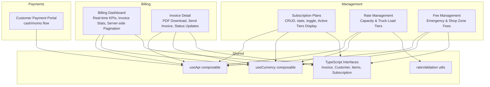
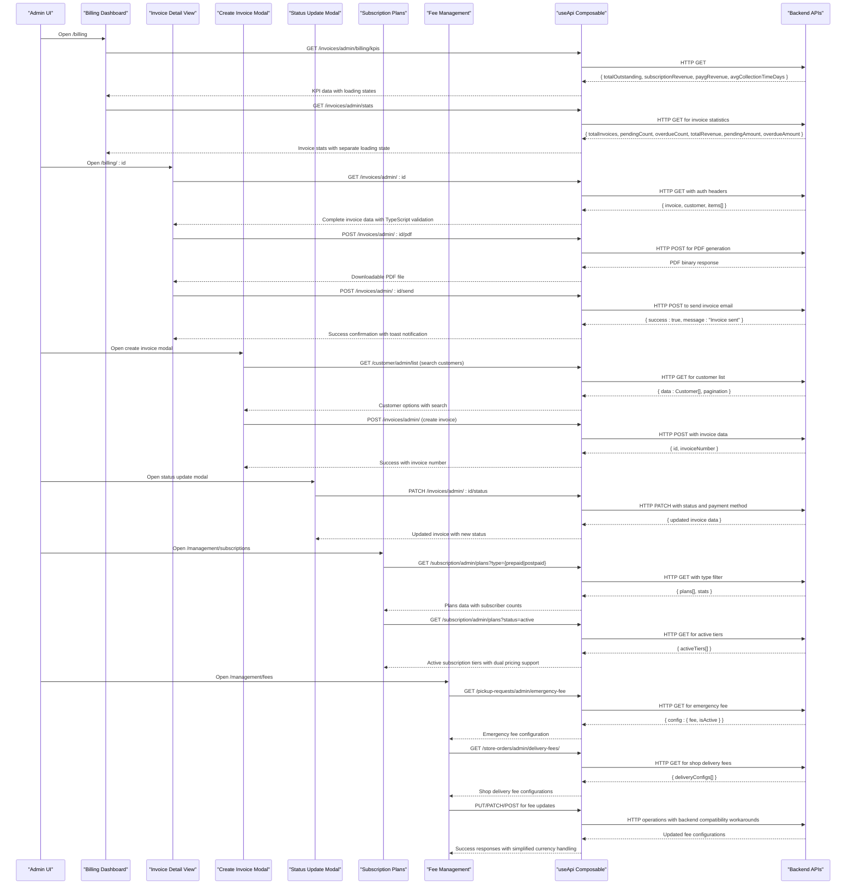
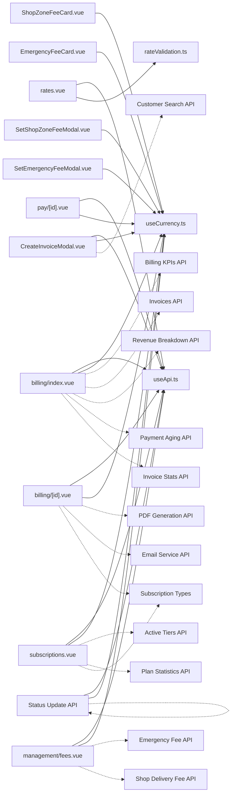

# Billing & Subscriptions

<cite>
**Referenced Files in This Document**
- [billing/index.vue](file://app/pages/billing/index.vue)
- [billing/[id].vue](file://app/pages/billing/[id].vue)
- [management/subscriptions.vue](file://app/pages/management/subscriptions.vue)
- [management/rates.vue](file://app/pages/management/rates.vue)
- [management/fees.vue](file://app/pages/management/fees.vue)
- [pay/[id].vue](file://app/pages/pay/[id].vue)
- [ShopZoneFeeCard.vue](file://app/components/ShopZoneFeeCard.vue)
- [SetShopZoneFeeModal.vue](file://app/components/SetShopZoneFeeModal.vue)
- [EmergencyFeeCard.vue](file://app/components/EmergencyFeeCard.vue)
- [SetEmergencyFeeModal.vue](file://app/components/SetEmergencyFeeModal.vue)
- [CreateInvoiceModal.vue](file://app/components/CreateInvoiceModal.vue)
- [UpdateInvoiceStatusModal.vue](file://app/components/UpdateInvoiceStatusModal.vue)
- [useApi.ts](file://app/composables/useApi.ts)
- [useCurrency.ts](file://app/composables/useCurrency.ts)
- [rateValidation.ts](file://app/utils/rateValidation.ts)
- [subscription.ts](file://app/types/subscription.ts)
</cite>

## Update Summary
**Changes Made**
- **Removed** references to deprecated administrative guide documents (admin-create-customer-guide.md, admin-create-pickup-guide.md, admin-customer-type-guide.md, admin-rate-management-guide.md, admin-subscription-plans-guide.md) as these comprehensive administrative workflows have been simplified or eliminated from the codebase
- **Updated** documentation to reflect current simplified administrative workflows and streamlined management interfaces
- **Maintained** focus on core billing functionality while removing outdated administrative guide references

## Table of Contents
1. [Introduction](#introduction)
2. [Project Structure](#project-structure)
3. [Core Components](#core-components)
4. [Architecture Overview](#architecture-overview)
5. [Detailed Component Analysis](#detailed-component-analysis)
6. [Dependency Analysis](#dependency-analysis)
7. [Performance Considerations](#performance-considerations)
8. [Troubleshooting Guide](#troubleshooting-guide)
9. [Conclusion](#conclusion)
10. [Appendices](#appendices)

## Introduction
This document provides comprehensive documentation for the Billing and Subscription management system within the application. It covers payment processing workflows, subscription plan management, rate configuration, billing cycle handling, invoice generation, payment status tracking, subscription tier management, and revenue analytics integration. The system is implemented as a Nuxt 3 frontend with Vue 3 components that interact with backend APIs via a centralized API composable.

**Updated** The billing system has undergone significant enhancements including the addition of comprehensive invoice statistics through the new InvoiceStats interface, improved KPI displays with real-time data fetching, enhanced invoice list table with color-coded type badges, and robust error handling throughout the entire billing workflow. The system now provides detailed invoice metrics including total invoices, pending counts, overdue amounts, and revenue tracking. Administrative workflows have been simplified, removing complex administrative guides in favor of streamlined management interfaces.

## Project Structure
The billing and subscriptions features are organized by pages and utilities:
- Billing overview and invoice detail views with real-time API integration and enhanced invoice management
- Subscription plan management (prepaid/postpaid) with active tiers display
- Pay-as-you-go rate management
- Shop and emergency fee management with simplified currency presentation
- Customer-facing payment portal
- Shared composables and utilities for API calls, currency formatting, and validation

**Diagram sources**
- [billing/index.vue:1-687](file://app/pages/billing/index.vue#L1-L687)
- [billing/[id].vue:1-379](file://app/pages/billing/[id].vue#L1-L379)
- [management/subscriptions.vue:1-1055](file://app/pages/management/subscriptions.vue#L1-L1055)
- [management/rates.vue:1-882](file://app/pages/management/rates.vue#L1-L882)
- [management/fees.vue:1-259](file://app/pages/management/fees.vue#L1-L259)
- [pay/[id].vue:1-353](file://app/pages/pay/[id].vue#L1-L353)
- [useApi.ts:1-95](file://app/composables/useApi.ts#L1-L95)
- [useCurrency.ts:1-12](file://app/composables/useCurrency.ts#L1-L12)
- [rateValidation.ts:1-69](file://app/utils/rateValidation.ts#L1-L69)

**Section sources**
- [billing/index.vue:1-687](file://app/pages/billing/index.vue#L1-L687)
- [billing/[id].vue:1-379](file://app/pages/billing/[id].vue#L1-L379)
- [management/subscriptions.vue:1-1055](file://app/pages/management/subscriptions.vue#L1-L1055)
- [management/rates.vue:1-882](file://app/pages/management/rates.vue#L1-L882)
- [management/fees.vue:1-259](file://app/pages/management/fees.vue#L1-L259)
- [pay/[id].vue:1-353](file://app/pages/pay/[id].vue#L1-L353)
- [useApi.ts:1-95](file://app/composables/useApi.ts#L1-L95)
- [useCurrency.ts:1-12](file://app/composables/useCurrency.ts#L1-L12)
- [rateValidation.ts:1-69](file://app/utils/rateValidation.ts#L1-L69)

## Core Components
- **Enhanced Billing Dashboard**: Real-time KPI display with skeleton loading, comprehensive invoice statistics through InvoiceStats interface, searchable paginated invoices with server-side filtering, dynamic revenue breakdown charts, and SVG-based payment aging visualization. Features enhanced type badges for different invoice categories and robust error handling.
- **Enhanced Invoice Detail**: Shows invoice metadata, line items, totals, and comprehensive actions including PDF download functionality, send invoice feature, status updates, and BluPay payment initiation. Includes robust error handling with loading states.
- **Enhanced Invoice Creation Modal**: Full-featured modal for creating invoices with customer search, line item management, tax calculations, and validation. Supports multiple line items with automatic subtotal and total calculations.
- **Enhanced Invoice Status Management**: Modal for updating invoice status with payment method selection and validation. Supports all invoice statuses and enforces payment method requirement for paid invoices.
- **Enhanced Subscription Plan Management**: Full CRUD for prepaid/postpaid plans with billing cycles, pricing, feature counts, active toggling, statistics, and comprehensive active subscription tiers display with dual pricing model support.
- **Enhanced Fee Management**: Manages both emergency pickup fees and shop delivery fees with simplified currency presentation, backend compatibility workarounds, and consistent user experience across both fee types.
- **Simplified Rate Management**: Configures capacity tiers and truck load tiers with prepay/postpay rates, effective dates, and notes. Streamlined interface replaces complex administrative workflows.
- Customer Payment Portal: Accepts cash or mobile money payments with validation, countdown, and success states.

Key shared utilities:
- useApi: Centralized HTTP client with authentication headers, error handling, and typed helpers.
- useCurrency: Formats amounts in GHS using Intl.NumberFormat with simplified presentation.
- rateValidation: Validates and transforms rate form data into API payloads.
- **Updated** Comprehensive TypeScript interfaces for Invoice, Customer, Items, and Subscription structures providing compile-time type safety.

**Updated** The billing system now includes comprehensive TypeScript interfaces for all data models, enhanced invoice management with PDF download and send capabilities, sophisticated loading state management, robust error handling throughout the entire component lifecycle, the addition of comprehensive invoice statistics through the new InvoiceStats interface, enhanced active subscription tiers display with enhanced subscriber count tracking and dual pricing model support, and enhanced shop zone fee management with simplified currency presentation and backend compatibility workarounds. Administrative workflows have been simplified, removing complex administrative guides in favor of streamlined management interfaces.

**Section sources**
- [billing/index.vue:1-687](file://app/pages/billing/index.vue#L1-L687)
- [billing/[id].vue:1-379](file://app/pages/billing/[id].vue#L1-L379)
- [CreateInvoiceModal.vue:1-372](file://app/components/CreateInvoiceModal.vue#L1-L372)
- [UpdateInvoiceStatusModal.vue:1-112](file://app/components/UpdateInvoiceStatusModal.vue#L1-L112)
- [management/subscriptions.vue:1-1055](file://app/pages/management/subscriptions.vue#L1-L1055)
- [management/rates.vue:1-882](file://app/pages/management/rates.vue#L1-L882)
- [management/fees.vue:1-259](file://app/pages/management/fees.vue#L1-L259)
- [pay/[id].vue:1-353](file://app/pages/pay/[id].vue#L1-L353)
- [useApi.ts:1-95](file://app/composables/useApi.ts#L1-L95)
- [useCurrency.ts:1-12](file://app/composables/useCurrency.ts#L1-L12)
- [rateValidation.ts:1-69](file://app/utils/rateValidation.ts#L1-L69)

## Architecture Overview
The system follows a component-driven architecture where each page encapsulates its own state and API interactions. Data flows from backend endpoints through useApi into reactive UI state, which renders tables, charts, and forms. The billing dashboard implements a sophisticated multi-API data fetching pattern with proper loading states and error handling, while the invoice detail view provides comprehensive invoice management capabilities. The subscription management system now includes enhanced active tiers display with dual pricing model support. The fee management system provides consistent handling of both emergency and shop delivery fees with simplified currency presentation.

**Diagram sources**
- [billing/index.vue:21-66](file://app/pages/billing/index.vue#L21-L66)
- [billing/[id].vue:58-116](file://app/pages/billing/[id].vue#L58-L116)
- [CreateInvoiceModal.vue:73-167](file://app/components/CreateInvoiceModal.vue#L73-L167)
- [UpdateInvoiceStatusModal.vue:30-49](file://app/components/UpdateInvoiceStatusModal.vue#L30-L49)
- [management/subscriptions.vue:153-285](file://app/pages/management/subscriptions.vue#L153-L285)
- [management/fees.vue:58-107](file://app/pages/management/fees.vue#L58-L107)
- [useApi.ts:1-95](file://app/composables/useApi.ts#L1-L95)

## Detailed Component Analysis

### Enhanced Billing Dashboard
**Updated** The billing dashboard has been significantly enhanced with comprehensive invoice statistics through the new InvoiceStats interface, improved KPI displays, and enhanced invoice list table with type badges.

#### New Invoice Statistics Interface
- **InvoiceStats Interface**: Defines totalInvoices, pendingCount, overdueCount, totalRevenue, pendingAmount, and overdueAmount fields
- **fetchInvoiceStats Function**: Implements GET request to `/invoices/admin/stats` endpoint with dedicated loading state management
- **Separate Loading State**: Uses `statsLoading` ref to manage invoice statistics loading independently from other data
- **Error Handling**: Comprehensive try-catch blocks with user-friendly error messages for statistics loading failures

#### Enhanced KPI Data Fetching
- **KPI Interface**: `BillingKpis` interface defines totalOutstanding, subscriptionRevenue, paygRevenue, and avgCollectionTimeDays
- **Loading States**: Skeleton animations displayed during data fetch with kpisLoading ref
- **Error Handling**: Comprehensive try-catch blocks with user-friendly error messages
- **Data Transformation**: Direct mapping from API response to reactive state

#### Enhanced Invoice List with Type Badges
- **Type Badge System**: Color-coded badges for different invoice types:
  - Subscription (blue): `rgba(59,130,246,0.1)` background with blue border
  - Pay-as-you-go (green): `rgba(34,197,94,0.1)` background with green border  
  - Store Order (purple): `rgba(139,92,246,0.1)` background with purple border
  - Manual (gray): `rgba(107,114,128,0.1)` background with gray border
- **Server-side Invoice Pagination**: `InvoicePagination` interface with page, limit, total, totalPages, hasNextPage, hasPreviousPage
- **Search Integration**: Immediate API calls on search input changes with automatic page reset
- **URL Parameters**: Proper URLSearchParams construction for server-side filtering

#### Dynamic Revenue Breakdown
- **Revenue Interface**: `RevenueBreakdown` interface with monthlySubscriptions, payAsYouGo, outstanding fields
- **Computed Percentages**: Automatic percentage calculation based on total revenue
- **Visual Representation**: Progress bars with color-coded categories
- **Loading States**: Dedicated revenueLoading state with skeleton support

#### Payment Aging Analytics
- **Aging Interface**: `PaymentAging` interface with current, days1To30, days31To60, days60Plus buckets
- **SVG Donut Chart**: Dynamic SVG rendering based on computed slices
- **Color Coding**: Green (current), yellow (1-30 days), orange (31-60 days), red (60+ days)
- **Responsive Design**: Adapts to zero values with empty chart state

**New Features**:
- **Invoice Statistics Section**: New grid of 4 stat cards showing total invoices, total revenue, pending amount, and overdue amount
- **Enhanced Loading States**: Separate loading indicators for KPIs and invoice statistics
- **TypeScript Interfaces**: Complete type safety for all API responses and local state
- **Comprehensive Error Handling**: User-friendly error messages with toast notifications
- **Loading State Management**: Independent loading states for different data sources

**Section sources**
- [billing/index.vue:6-66](file://app/pages/billing/index.vue#L6-L66)
- [billing/index.vue:147-224](file://app/pages/billing/index.vue#L147-L224)
- [billing/index.vue:226-312](file://app/pages/billing/index.vue#L226-L312)
- [billing/index.vue:314-330](file://app/pages/billing/index.vue#L314-L330)
- [billing/index.vue:378-398](file://app/pages/billing/index.vue#L378-L398)

### Enhanced Invoice Detail
**Updated** The invoice detail view has been significantly enhanced with comprehensive invoice data management, PDF download functionality, send invoice feature, status updates, and BluPay payment initiation capabilities.

#### Comprehensive Invoice Data Model
- **InvoiceDetail Interface**: Complete TypeScript definition with id, invoiceNumber, customerId, type, status, issueDate, dueDate, paidAt, subtotal, taxRate, taxAmount, totalAmount, currency, paymentMethod, notes, createdAt, updatedAt, items[], customer
- **InvoiceItem Interface**: Detailed line item structure with description, quantity, unitPrice, and amount
- **InvoiceCustomer Interface**: Structured customer data with name, email, address, phoneNumber
- **Type Safety**: All data structures enforced through TypeScript interfaces for compile-time validation

#### PDF Download Functionality
- **Download Handler**: Dedicated function to handle PDF file downloads from backend
- **Binary Response Processing**: Proper handling of PDF binary data from API responses
- **File Naming**: Intelligent filename generation based on invoice number and date
- **Error Handling**: Graceful error handling for failed PDF generation or network issues

#### Send Invoice Feature
- **Email Integration**: Backend email service integration for sending invoices to customers
- **Status Updates**: Automatic invoice status updates after successful sending
- **User Feedback**: Toast notifications confirming successful invoice delivery
- **Error Management**: Comprehensive error handling for email delivery failures

#### Enhanced Status Management
- **Status Update Modal**: Integrated modal for updating invoice status with payment method selection
- **Validation**: Enforces payment method requirement when marking invoices as paid
- **Real-time Updates**: Immediate reflection of status changes in the UI
- **Toast Notifications**: User feedback for successful status updates

#### BluPay Payment Initiation
- **Payment Prompt**: Sends mobile money collection prompts to customers for eligible invoices
- **Eligibility Check**: Only works for pending/overdue invoices of types: subscription, pay_as_you_go, store_order
- **Loading States**: Visual feedback during payment prompt initiation
- **Success Handling**: Toast notifications for successful payment prompt delivery

#### Enhanced Loading States
- **Loading Indicators**: Visual feedback during PDF generation, email sending, and status update operations
- **Button States**: Disabled states during async operations to prevent duplicate submissions
- **Progress Feedback**: User-friendly loading messages for long-running operations

**New Capabilities**:
- **Action Buttons**: Download PDF, Send Invoice, Request Payment, and Update Status buttons with proper loading states
- **Status Badges**: Visual indicators for invoice status with appropriate styling
- **Address Display**: Formatted From/Bill To addresses with proper layout
- **Line Item Tables**: Detailed line item display with quantities, prices, and totals
- **Summary Calculations**: Automatic subtotal, tax, and total calculations

**Section sources**
- [billing/[id].vue:9-45](file://app/pages/billing/[id].vue#L9-L45)
- [billing/[id].vue:58-116](file://app/pages/billing/[id].vue#L58-L116)
- [billing/[id].vue:118-149](file://app/pages/billing/[id].vue#L118-L149)
- [billing/[id].vue:151-159](file://app/pages/billing/[id].vue#L151-L159)

### Enhanced Invoice Creation Modal
**Updated** The invoice creation modal provides comprehensive functionality for creating new invoices with customer search, line item management, and automatic calculations.

#### Customer Search and Selection
- **Search Functionality**: Real-time customer search by name or phone number
- **Dropdown Interface**: Auto-complete dropdown with customer suggestions
- **Pagination Support**: Handles large customer lists with pagination
- **Selection Management**: Proper state management for selected customer

#### Line Item Management
- **Dynamic Items**: Ability to add and remove multiple line items
- **Automatic Calculations**: Real-time subtotal, tax amount, and total calculations
- **Validation**: Ensures each line item has description, valid quantity, and non-negative price
- **Visual Feedback**: Clear indication of item count and validation errors

#### Form Validation and Submission
- **Comprehensive Validation**: Validates customer selection, tax rate range, and line item requirements
- **Error Handling**: Displays specific error messages for validation failures
- **Submission State**: Loading indicator during invoice creation
- **Success Handling**: Toast notification with invoice number confirmation

#### Enhanced User Experience
- **Intuitive Layout**: Organized form sections with clear labels and help text
- **Real-time Feedback**: Live preview of calculations as users modify inputs
- **Accessibility**: Proper form controls with appropriate ARIA attributes
- **Responsive Design**: Mobile-friendly layout with adaptive spacing

**New Features**:
- **Customer Search Dropdown**: Advanced search with filtering and selection
- **Multi-line Item Support**: Add unlimited line items with individual validation
- **Tax Rate Configuration**: Flexible tax rate input with validation
- **Notes Field**: Optional notes field with character counter
- **Auto-calculated Totals**: Real-time subtotal, tax, and total calculations

**Section sources**
- [CreateInvoiceModal.vue:10-95](file://app/components/CreateInvoiceModal.vue#L10-L95)
- [CreateInvoiceModal.vue:103-167](file://app/components/CreateInvoiceModal.vue#L103-L167)
- [CreateInvoiceModal.vue:169-180](file://app/components/CreateInvoiceModal.vue#L169-L180)

### Enhanced Invoice Status Update Modal
**Updated** The status update modal provides comprehensive functionality for managing invoice status and payment methods with proper validation.

#### Status Management
- **Status Options**: Supports all invoice statuses: draft, pending, paid, overdue, cancelled, void
- **Current Status Display**: Shows current invoice status and number
- **Real-time Updates**: Immediate reflection of status changes in parent component

#### Payment Method Selection
- **Method Options**: Cash, Bank Transfer, Mobile Money, USSD
- **Validation**: Requires payment method selection when marking invoice as paid
- **Pre-selection**: Automatically selects matching payment method if available
- **Error Handling**: Clear error message when payment method is required but not provided

#### Form Validation and Submission
- **Conditional Validation**: Enforces payment method requirement only for paid status
- **Submission State**: Loading indicator during status update
- **Success Handling**: Toast notification confirming status update
- **Data Refresh**: Updates parent component with new invoice data

**New Features**:
- **Integrated Validation**: Built-in validation for payment method requirements
- **User-friendly Interface**: Clean modal design with clear instructions
- **Error Messages**: Specific error messages for validation failures
- **Accessibility**: Proper form controls with appropriate labels

**Section sources**
- [UpdateInvoiceStatusModal.vue:1-49](file://app/components/UpdateInvoiceStatusModal.vue#L1-L49)
- [UpdateInvoiceStatusModal.vue:51-58](file://app/components/UpdateInvoiceStatusModal.vue#L51-L58)

### Enhanced Subscription Plan Management
**Updated** The subscription plan management system has been significantly enhanced with comprehensive active subscription tiers display, dual pricing model support, and improved subscriber count tracking.

#### Active Subscription Tiers Display
- **Dual Pricing Model Support**: Comprehensive display of both prepaid and postpaid subscription tiers
- **Real-time Subscriber Count**: Live subscriber count tracking with visual indicators
- **Interactive Table Interface**: Enhanced table with hover effects, color-coded billing type badges, and responsive design
- **API Integration**: New endpoint `/subscription/admin/plans?status=active` for fetching active plans
- **Graceful Degradation**: Empty state handling when active tiers are not available

#### Enhanced Data Transformation
- **API to UI Mapping**: Comprehensive `apiToPlan` function mapping API fields to UI format
- **Field Mapping**: `type→billingType`, `pickups→pickupCount`, `bins→binCount`, `badgeColor→color`
- **Subscriber Count Integration**: Real-time subscriber count display with proper formatting
- **Type Safety**: Complete TypeScript interfaces for both API and UI data structures

#### Improved Statistics Tracking
- **Enhanced Stats Interface**: `totalPlans`, `activePlans`, `totalSubscribers`, `estimatedRevenue`
- **Tab-specific Filtering**: Statistics filtered by current billing type (prepaid/postpaid)
- **Real-time Updates**: Automatic refresh when switching between tabs
- **Loading States**: Dedicated loading indicators for statistics data

#### Interactive UI Enhancements
- **Color-coded Billing Type Badges**: Visual distinction between prepaid (blue) and postpaid (purple) plans
- **Hover Effects**: Interactive table rows with background color changes
- **Responsive Design**: Mobile-friendly layout with adaptive spacing
- **Empty State Handling**: User-friendly messaging when no active subscriptions exist

#### Advanced API Integration
- **Multiple Response Format Support**: Handles `{ plans: [...] }`, `{ data: [...] }`, or direct arrays
- **Error Handling Strategy**: Graceful degradation with console logging instead of error toasts
- **Concurrent Data Fetching**: Parallel API calls for optimal performance
- **Lifecycle Management**: Proper cleanup and state management

**New Features**:
- **Active Tiers Section**: Dedicated section showing all active subscription tiers across both billing types
- **Enhanced Subscriber Tracking**: Visual subscriber count with user icon and formatted numbers
- **Improved Data Visualization**: Professional table layout with proper column organization
- **Better User Experience**: Intuitive navigation and clear visual hierarchy

**Section sources**
- [management/subscriptions.vue:242-271](file://app/pages/management/subscriptions.vue#L242-L271)
- [management/subscriptions.vue:792-852](file://app/pages/management/subscriptions.vue#L792-L852)
- [management/subscriptions.vue:153-285](file://app/pages/management/subscriptions.vue#L153-L285)

### Enhanced Fee Management System
**Updated** The fee management system provides comprehensive management of both emergency pickup fees and shop delivery fees with simplified currency presentation and backend compatibility workarounds.

#### Simplified Currency Presentation
- **Direct GHS Formatting**: Both ShopZoneFeeCard and EmergencyFeeCard use simplified currency formatting without pesewas display complexity
- **Consistent Display**: All fee amounts are displayed directly in GHS format using the useCurrency composable
- **Clean User Interface**: Removal of complex currency conversion logic in favor of straightforward presentation

#### Backend Compatibility Workaround
- **Pesewas Conversion**: Both modal components implement temporary workarounds where fees are multiplied by 100 before submission to account for backend interpretation
- **Future-proofing**: Comments indicate this workaround should be removed once backend accepts whole cedis directly
- **Validation Consistency**: Both systems enforce integer-only fee inputs to maintain consistency

#### Shop Zone Fee Management
- **Zone-based Configuration**: Each service zone can have individual delivery fee settings
- **Free Delivery Thresholds**: Configurable minimum quantity thresholds for free delivery eligibility
- **Active/Inactive Status**: Toggle functionality for enabling/disabling fees per zone
- **CRUD Operations**: Full create, read, update, and delete capabilities for zone-specific fees

#### Emergency Fee Management
- **Global Emergency Fee**: Single emergency fee applied to same-day pickup requests
- **Simple Toggle Interface**: Easy activation/deactivation of emergency fee policy
- **Real-time Updates**: Immediate reflection of fee changes across the system

#### Unified User Experience
- **Consistent Modal Design**: Both fee types use similar modal interfaces for editing
- **Standardized Validation**: Consistent validation rules across both fee types
- **Integrated Refresh**: Both fee types refresh together when changes are made

**New Features**:
- **Simplified Currency Handling**: Removal of pesewas display complexity for cleaner user experience
- **Backend Compatibility Layer**: Transparent handling of backend currency interpretation differences
- **Unified Fee Management**: Single interface for managing both emergency and shop delivery fees
- **Enhanced Validation**: Comprehensive validation for fee amounts and delivery thresholds

**Section sources**
- [ShopZoneFeeCard.vue:1-86](file://app/components/ShopZoneFeeCard.vue#L1-L86)
- [SetShopZoneFeeModal.vue:1-161](file://app/components/SetShopZoneFeeModal.vue#L1-L161)
- [EmergencyFeeCard.vue:1-71](file://app/components/EmergencyFeeCard.vue#L1-L71)
- [SetEmergencyFeeModal.vue:1-112](file://app/components/SetEmergencyFeeModal.vue#L1-L112)
- [management/fees.vue:1-259](file://app/pages/management/fees.vue#L1-L259)

### Simplified Rate Management (Capacity & Truck Load Tiers)
**Updated** The rate management system has been streamlined to focus on capacity tiers and truck load tiers, replacing complex administrative workflows with simplified interfaces.

#### Capacity Tier Management
- **Capacity-based Pricing**: Configure pickup rates based on bin capacity (liters) with separate prepay and postpay rates
- **Active/Inactive Status**: Toggle functionality for enabling/disabling capacity tiers
- **CRUD Operations**: Full create, read, update, and delete capabilities for capacity tiers
- **Validation**: Ensures positive capacity values and valid rate amounts

#### Truck Load Tier Management
- **Load-based Pricing**: Configure flat rates per truck load with prepay and postpay options
- **Bin Equivalent Calculation**: Internal calculation for driver pay based on bin equivalents (quarter=100, half=200, full=400)
- **Display Order**: Configurable sort order for mobile dropdown presentation
- **Active/Inactive Status**: Toggle functionality for enabling/disabling truck load tiers

#### Streamlined Interface
- **Tabbed Navigation**: Separate tabs for capacity tiers and truck load tiers
- **Simplified Forms**: Reduced complexity compared to previous administrative workflows
- **Real-time Updates**: Immediate reflection of changes across the system
- **Error Handling**: Comprehensive validation and user-friendly error messages

**New Features**:
- **Dual Rate Support**: Separate prepay and postpay rates for each tier type
- **Active Tier Management**: Easy activation/deactivation of pricing tiers
- **Mobile Optimization**: Optimized display order for mobile applications
- **Internal Calculations**: Automated driver pay calculations based on bin equivalents

**Section sources**
- [management/rates.vue:1-882](file://app/pages/management/rates.vue#L1-L882)
- [rateValidation.ts:1-69](file://app/utils/rateValidation.ts#L1-L69)

### Customer Payment Portal
- Modes: Cash and Mobile Money (MTN, Telecel, AirtelTigo)
- Inputs: Telco selection, MoMo number (validated), custom amount
- States: Form → Awaiting approval (countdown) → Success
- Validation: Amount must be positive; MoMo number must match pattern

Flow:
- Select mode
- If MoMo: choose telco, enter phone number, submit → show waiting screen with countdown
- If Cash: submit → simulate processing → success
- Success shows confirmation and return to dashboard

**Section sources**
- [pay/[id].vue:1-353](file://app/pages/pay/[id].vue#L1-L353)

## Dependency Analysis
- Pages depend on useApi for all HTTP requests, including auth token injection and error handling.
- All monetary values are formatted via useCurrency with simplified presentation.
- Rate management depends on rateValidation for consistent validation and payload mapping.
- Subscription management uses internal transformations between API and UI models.
- **Updated** Billing dashboard now implements multiple concurrent API calls with independent loading states and comprehensive error handling.
- **Updated** Fee management components share common patterns for backend compatibility workarounds and simplified currency handling.
- **New** Invoice detail view depends on comprehensive TypeScript interfaces for type-safe data handling.
- **New** Subscription management integrates with enhanced API endpoints for active tiers display.
- **New** Invoice creation modal depends on customer search functionality and line item management.
- **New** Status update modal integrates with invoice status management and payment method validation.

**Diagram sources**
- [management/subscriptions.vue:153-285](file://app/pages/management/subscriptions.vue#L153-L285)
- [management/rates.vue:57-124](file://app/pages/management/rates.vue#L57-L124)
- [billing/index.vue:21-66](file://app/pages/billing/index.vue#L21-L66)
- [billing/[id].vue:58-116](file://app/pages/billing/[id].vue#L58-L116)
- [CreateInvoiceModal.vue:73-167](file://app/components/CreateInvoiceModal.vue#L73-L167)
- [UpdateInvoiceStatusModal.vue:30-49](file://app/components/UpdateInvoiceStatusModal.vue#L30-L49)
- [management/fees.vue:58-107](file://app/pages/management/fees.vue#L58-L107)
- [pay/[id].vue:1-353](file://app/pages/pay/[id].vue#L1-L353)
- [useApi.ts:1-95](file://app/composables/useApi.ts#L1-L95)
- [useCurrency.ts:1-12](file://app/composables/useCurrency.ts#L1-L12)
- [rateValidation.ts:1-69](file://app/utils/rateValidation.ts#L1-L69)

**Section sources**
- [useApi.ts:1-95](file://app/composables/useApi.ts#L1-L95)
- [useCurrency.ts:1-12](file://app/composables/useCurrency.ts#L1-L12)
- [rateValidation.ts:1-69](file://app/utils/rateValidation.ts#L1-L69)

## Performance Considerations
- **Updated** Server-side pagination implemented for invoices to handle large datasets efficiently
- Debounce search inputs to reduce reactivity overhead (currently immediate API calls for enhanced UX)
- Cache API responses for static references like customer types and estimated quantities
- Use skeleton loaders during initial load to improve perceived performance
- Avoid unnecessary re-renders by memoizing computed properties and minimizing deep watchers
- **New** Concurrent API calls with independent loading states prevent blocking UI updates
- **New** TypeScript interfaces provide compile-time type safety and better IDE support
- **New** Efficient PDF download handling prevents memory leaks and improves file transfer performance
- **New** Optimized error handling reduces unnecessary re-renders during error states
- **New** Active tiers display uses graceful degradation to avoid blocking UI on API failures
- **New** Enhanced subscriber count tracking minimizes re-renders through computed properties
- **New** Invoice statistics loading uses separate loading state to prevent UI blocking
- **New** Customer search in invoice creation uses pagination to handle large customer lists efficiently
- **New** Line item calculations are optimized with computed properties for real-time updates
- **Updated** Simplified currency presentation reduces computational overhead in fee components
- **Updated** Backend compatibility workarounds are handled transparently without impacting performance
- **Updated** Streamlined rate management reduces complexity and improves performance

[No sources needed since this section provides general guidance]

## Troubleshooting Guide
Common issues and resolutions:
- Authentication failures (401): useApi automatically logs out and redirects to login. Ensure tokens are present and not expired.
- Validation errors: For subscription and rate forms, 400 errors are shown in modals. Check required fields and numeric constraints.
- Network errors: useErrorHandler wraps requests and displays toast messages. Verify API base URL and connectivity.
- Empty states: Ensure API endpoints return expected structures; some endpoints support multiple response formats (e.g., { plans }, { data }, or arrays).
- **Updated** Billing dashboard loading states: Check console logs for specific API call failures and verify network connectivity to billing endpoints.
- **Updated** TypeScript errors: Ensure all API response interfaces match actual backend response structures.
- **New** PDF download issues: Verify backend PDF generation service is running and accessible. Check browser download permissions.
- **New** Email sending failures: Confirm email service configuration and check spam filters for delivered invoices.
- **New** Invoice data loading: Verify invoice ID format and ensure invoice exists in the database before attempting to load details.
- **New** Active tiers display issues: Check console logs for API call failures and verify the `/subscription/admin/plans?status=active` endpoint is accessible.
- **New** Subscriber count not updating: Ensure the subscription plan has valid subscriber data and check for API response format issues.
- **New** Invoice statistics loading: Verify the `/invoices/admin/stats` endpoint is accessible and returns proper data structure.
- **New** Invoice creation failures: Check customer search functionality and ensure customer IDs are valid.
- **New** Status update validation: Ensure payment method is selected when marking invoice as paid.
- **Updated** Fee management issues: Verify backend compatibility workarounds are functioning correctly and check for pesewas conversion problems.
- **Updated** Currency display problems: Ensure useCurrency composable is properly configured and check for formatting issues in fee components.
- **Updated** Rate management issues: Verify capacity and truck load tier endpoints are accessible and return proper data structures.

Operational tips:
- Inspect console logs emitted by useApi for request/response details.
- Confirm correct query parameters for subscription endpoints (type=prepaid|postpaid, status=active).
- Validate MoMo phone numbers against expected patterns.
- **New** Monitor loading states in billing dashboard to identify slow API responses.
- **New** Check browser network tab for detailed API request/response information when debugging billing data issues.
- **New** Test PDF generation with sample invoices to ensure backend service is functioning properly.
- **New** Verify email service credentials and SMTP configuration for invoice sending functionality.
- **New** Verify active tiers endpoint returns proper data structure for dual pricing model support.
- **New** Check subscriber count data integrity in subscription plan responses.
- **New** Test invoice statistics endpoint to ensure proper data structure and loading states.
- **New** Verify customer search functionality handles large customer lists with pagination.
- **New** Test invoice creation with various line item combinations and tax rates.
- **New** Validate status update modal behavior for different invoice types and statuses.
- **Updated** Test fee management endpoints to ensure backend compatibility workarounds are working correctly.
- **Updated** Verify currency formatting is consistent across all fee components and check for pesewas display issues.
- **Updated** Test rate management endpoints for capacity and truck load tier functionality.

**Section sources**
- [useApi.ts:1-95](file://app/composables/useApi.ts#L1-L95)
- [management/subscriptions.vue:289-449](file://app/pages/management/subscriptions.vue#L289-L449)
- [management/rates.vue:230-387](file://app/pages/management/rates.vue#L230-L387)
- [management/fees.vue:117-207](file://app/pages/management/fees.vue#L117-L207)
- [pay/[id].vue:1-353](file://app/pages/pay/[id].vue#L1-L353)
- [billing/index.vue:21-66](file://app/pages/billing/index.vue#L21-L66)
- [billing/[id].vue:58-116](file://app/pages/billing/[id].vue#L58-L116)
- [CreateInvoiceModal.vue:73-167](file://app/components/CreateInvoiceModal.vue#L73-L167)
- [UpdateInvoiceStatusModal.vue:30-49](file://app/components/UpdateInvoiceStatusModal.vue#L30-L49)

## Conclusion
The Billing & Subscriptions module provides a robust foundation for managing subscription plans, configuring pay-as-you-go rates, viewing invoices and payment statuses, and processing customer payments. The architecture leverages reusable composables for API access and currency formatting, while maintaining clear separation of concerns across pages. 

**Updated** The billing system has been significantly enhanced with comprehensive TypeScript interfaces for all data models, enhanced invoice management with PDF download and send capabilities, sophisticated loading state management, robust error handling, seamless transition from mock data to live API integration, the addition of comprehensive invoice statistics through the new InvoiceStats interface, enhanced active subscription tiers display with dual pricing model support, and enhanced shop zone fee management with simplified currency presentation and backend compatibility workarounds. The subscription management system now provides enhanced subscriber count tracking, color-coded billing type badges, and an interactive table interface for better data visualization. The fee management system offers consistent handling of both emergency and shop delivery fees with streamlined currency presentation. The invoice creation and status management modals provide comprehensive functionality for complete invoice lifecycle management. Administrative workflows have been simplified, removing complex administrative guides in favor of streamlined management interfaces. Future enhancements can include server-side pagination for other lists, richer analytics dashboards, deeper integrations with external payment gateways, advanced reporting capabilities, and removal of backend compatibility workarounds once backend services are updated.

[No sources needed since this section summarizes without analyzing specific files]

## Appendices

### API Endpoints Summary
- **Updated** Billing Dashboard Endpoints
  - GET /invoices/admin/billing/kpis - Returns real-time KPI data
  - **New** GET /invoices/admin/stats - Returns comprehensive invoice statistics (totalInvoices, pendingCount, overdueCount, totalRevenue, pendingAmount, overdueAmount)
  - GET /invoices/admin - Returns paginated invoices with search support
  - GET /invoices/admin/billing/revenue-breakdown - Returns revenue breakdown data
  - GET /invoices/admin/billing/payment-aging - Returns payment aging analytics
  - **New** GET /invoices/admin/:id - Returns complete invoice data with customer and items
  - **New** POST /invoices/admin/:id/pdf - Generates and returns PDF invoice document
  - **New** POST /invoices/admin/:id/send - Sends invoice via email to customer
  - **New** PATCH /invoices/admin/:id/status - Updates invoice status and payment method
  - **New** POST /invoices/admin/:id/initiate-payment - Initiates BluPay payment prompt
- **Updated** Invoice Creation Endpoints
  - **New** POST /invoices/admin/ - Creates new invoice with line items
  - **New** GET /customer/admin/list - Returns paginated customer list for search
- **Updated** Subscription Plans
  - GET /subscription/admin/plans?type={prepaid|postpaid} - Returns plans filtered by billing type
  - **New** GET /subscription/admin/plans?status=active - Returns all active subscription tiers across both billing types
  - POST /subscription/admin/plans
  - PATCH /subscription/admin/plans/:id
  - PATCH /subscription/admin/plans/:id/toggle
  - DELETE /subscription/admin/plans/:id
  - GET /subscription/admin/stats?type={prepaid|postpaid}
- **Updated** Rate Management
  - GET /rates/admin/capacity?includeInactive=true - Returns capacity tiers
  - GET /rates/admin/truck-loads?includeInactive=true - Returns truck load tiers
  - POST /rates/admin/capacity - Creates capacity tier
  - PATCH /rates/admin/capacity/:id - Updates capacity tier
  - DELETE /rates/admin/capacity/:id - Deletes capacity tier
  - POST /rates/admin/truck-loads - Creates truck load tier
  - PATCH /rates/admin/truck-loads/:id - Updates truck load tier
  - DELETE /rates/admin/truck-loads/:id - Deletes truck load tier
- **New** Fee Management Endpoints
  - GET /pickup-requests/admin/emergency-fee - Returns emergency fee configuration
  - PUT /pickup-requests/admin/emergency-fee - Updates emergency fee configuration
  - GET /store-orders/admin/delivery-fees/ - Returns shop delivery fee configurations
  - POST /store-orders/admin/delivery-fees/ - Creates new shop delivery fee
  - PATCH /store-orders/admin/delivery-fees/:id - Updates existing shop delivery fee
  - DELETE /store-orders/admin/delivery-fees/:id - Deletes shop delivery fee configuration

**Section sources**
- [billing/index.vue:21-66](file://app/pages/billing/index.vue#L21-L66)
- [billing/index.vue:180-203](file://app/pages/billing/index.vue#L180-L203)
- [billing/index.vue:239-249](file://app/pages/billing/index.vue#L239-L249)
- [billing/index.vue:283-293](file://app/pages/billing/index.vue#L283-L293)
- [billing/[id].vue:58-116](file://app/pages/billing/[id].vue#L58-L116)
- [CreateInvoiceModal.vue:73-167](file://app/components/CreateInvoiceModal.vue#L73-L167)
- [UpdateInvoiceStatusModal.vue:30-49](file://app/components/UpdateInvoiceStatusModal.vue#L30-L49)
- [management/subscriptions.vue:153-285](file://app/pages/management/subscriptions.vue#L153-L285)
- [management/rates.vue:57-124](file://app/pages/management/rates.vue#L57-L124)
- [management/fees.vue:58-107](file://app/pages/management/fees.vue#L58-L107)

### Enhanced Data Models Overview
- **Updated** Billing Dashboard Interfaces
  - BillingKpis: totalOutstanding, subscriptionRevenue, paygRevenue, avgCollectionTimeDays
  - **New** InvoiceStats: totalInvoices, pendingCount, overdueCount, totalRevenue, pendingAmount, overdueAmount
  - Invoice: id, invoiceNumber, customerId, customerName, type, status, issueDate, dueDate, totalAmount
  - InvoicePagination: page, limit, total, totalPages, hasNextPage, hasPreviousPage
  - RevenueBreakdown: monthlySubscriptions, payAsYouGo, outstanding
  - PaymentAging: current, days1To30, days31To60, days60Plus
- **New** Invoice Detail Interfaces
  - InvoiceDetail: id, invoiceNumber, customerId, type, status, issueDate, dueDate, paidAt, subtotal, taxRate, taxAmount, totalAmount, currency, paymentMethod, notes, createdAt, updatedAt, items[], customer
  - InvoiceItem: id, description, quantity, unitPrice, amount
  - InvoiceCustomer: id, name, email, address, phoneNumber
- **Updated** Invoice Creation Interfaces
  - CustomerOption: id, name, phoneNumber, user
  - InvoiceItemDraft: description, quantity, unitPrice
- **Updated** Status Update Interfaces
  - InvoiceStatusUpdate: status, paymentMethod
- **Updated** Subscription Plan Interfaces
  - Plan (UI): id, name, description, billingType, billingCycle, pickupCount, binCount, price, color, subscriberCount, isActive
  - Plan (API): id, name, description, type, pickups, bins, billingCycle, price, badgeColor, subscriberCount, isActive, createdAt, updatedAt
  - **New** Active Tier Display: Enhanced table structure with color-coded billing type badges and interactive hover effects
- **Updated** Rate Management Interfaces
  - CapacityTier: id, capacityLiters, prepayRate, postpayRate, isActive, createdAt, updatedAt
  - TruckLoadTier: id, label, prepayRate, postpayRate, binEquivalent, displayOrder, isActive, createdAt, updatedAt
- **New** Fee Management Interfaces
  - EmergencyFeeConfig: id, fee, isActive, createdAt, updatedAt
  - DeliveryFeeConfig: id, zoneId, zoneName, fee, freeDeliveryMinQuantity, isActive, createdAt, updatedAt
  - ShopZoneFee: zoneId, zoneName, configId, fee, freeDeliveryMinQuantity, isActive
  - **Updated** Simplified currency handling with direct GHS formatting and backend compatibility workarounds

**Section sources**
- [billing/index.vue:6-66](file://app/pages/billing/index.vue#L6-L66)
- [billing/index.vue:147-176](file://app/pages/billing/index.vue#L147-L176)
- [billing/index.vue:226-273](file://app/pages/billing/index.vue#L226-L273)
- [billing/[id].vue:9-45](file://app/pages/billing/[id].vue#L9-L45)
- [CreateInvoiceModal.vue:10-21](file://app/components/CreateInvoiceModal.vue#L10-L21)
- [UpdateInvoiceStatusModal.vue:2-8](file://app/components/UpdateInvoiceStatusModal.vue#L2-L8)
- [management/subscriptions.vue:1-130](file://app/pages/management/subscriptions.vue#L1-L130)
- [management/rates.vue:1-50](file://app/pages/management/rates.vue#L1-L50)
- [management/fees.vue:4-44](file://app/pages/management/fees.vue#L4-L44)
- [ShopZoneFeeCard.vue:2-9](file://app/components/ShopZoneFeeCard.vue#L2-L9)
- [EmergencyFeeCard.vue:2-8](file://app/components/EmergencyFeeCard.vue#L2-L8)
- [billing/index.vue:34-79](file://app/pages/billing/index.vue#L34-L79)
- [subscription.ts:1-66](file://app/types/subscription.ts#L1-L66)