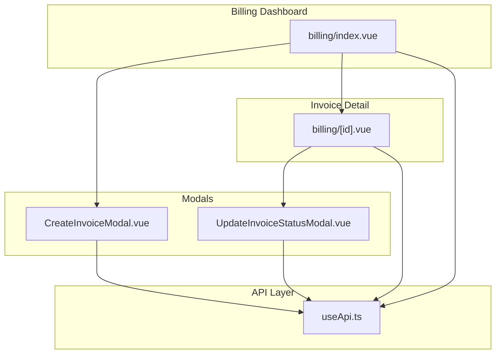
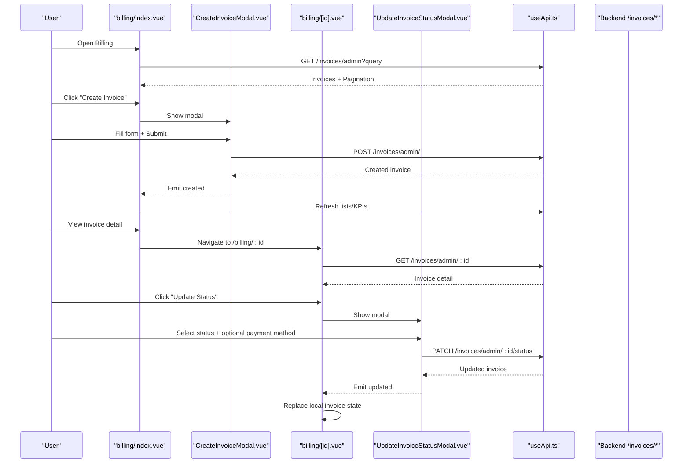
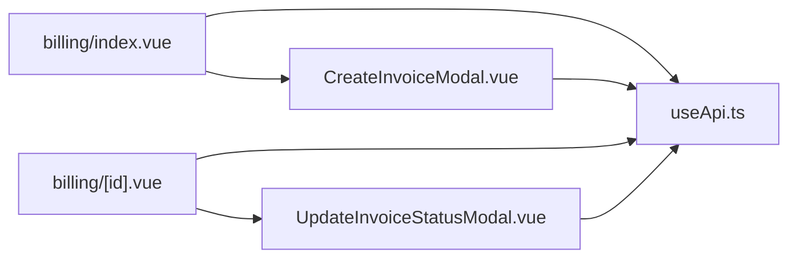

# Invoice Status Management

<cite>
**Referenced Files in This Document**
- [CreateInvoiceModal.vue](file://app/components/CreateInvoiceModal.vue)
- [UpdateInvoiceStatusModal.vue](file://app/components/UpdateInvoiceStatusModal.vue)
- [billing/index.vue](file://app/pages/billing/index.vue)
- [billing/[id].vue](file://app/pages/billing/[id].vue)
- [useApi.ts](file://app/composables/useApi.ts)
</cite>

## Table of Contents
1. [Introduction](#introduction)
2. [Project Structure](#project-structure)
3. [Core Components](#core-components)
4. [Architecture Overview](#architecture-overview)
5. [Detailed Component Analysis](#detailed-component-analysis)
6. [Dependency Analysis](#dependency-analysis)
7. [Performance Considerations](#performance-considerations)
8. [Troubleshooting Guide](#troubleshooting-guide)
9. [Conclusion](#conclusion)

## Introduction
This document explains how invoice status is managed in the Billing module. It covers creating invoices, viewing and updating their status, initiating payments for eligible invoices, and the data flows that keep the UI consistent with backend state. The focus is on the user journeys and code paths involved in changing an invoice’s lifecycle from draft to paid or other terminal states.

## Project Structure
The invoice status management spans a few key pages and components:
- A dashboard page listing invoices and KPIs
- A detail page for a single invoice where status can be updated and actions like sending or downloading PDF are available
- A modal to update invoice status with validation rules
- A modal to create manual invoices (which start as draft/pending depending on backend defaults)
- An API helper that centralizes HTTP calls, authentication, and error handling

**Diagram sources**
- [billing/index.vue:1-687](file://app/pages/billing/index.vue#L1-L687)
- [billing/[id].vue:1-379](file://app/pages/billing/[id].vue#L1-L379)
- [CreateInvoiceModal.vue:1-372](file://app/components/CreateInvoiceModal.vue#L1-L372)
- [UpdateInvoiceStatusModal.vue:1-112](file://app/components/UpdateInvoiceStatusModal.vue#L1-L112)
- [useApi.ts:1-95](file://app/composables/useApi.ts#L1-L95)

**Section sources**
- [billing/index.vue:1-687](file://app/pages/billing/index.vue#L1-L687)
- [billing/[id].vue:1-379](file://app/pages/billing/[id].vue#L1-L379)
- [CreateInvoiceModal.vue:1-372](file://app/components/CreateInvoiceModal.vue#L1-L372)
- [UpdateInvoiceStatusModal.vue:1-112](file://app/components/UpdateInvoiceStatusModal.vue#L1-L112)
- [useApi.ts:1-95](file://app/composables/useApi.ts#L1-L95)

## Core Components
- Billing list page: Displays KPIs, payment aging, revenue breakdown, and a paginated invoice table. Provides search, pagination, and navigation to invoice details. Also opens the “Create Invoice” modal.
- Invoice detail page: Loads a specific invoice, shows metadata and line items, supports downloading PDF, sending to customer, and opening the status update modal. For eligible invoices, it can initiate a payment prompt.
- Update invoice status modal: Allows selecting a new status and optionally a payment method when marking as paid. Validates required fields and calls the backend PATCH endpoint.
- Create invoice modal: Collects customer, due date, tax rate, and line items; validates input; posts to create an invoice.
- API helper: Centralizes authenticated requests, handles 401 redirects, and wraps methods for GET/POST/PATCH/DELETE with error handling.

**Section sources**
- [billing/index.vue:1-687](file://app/pages/billing/index.vue#L1-L687)
- [billing/[id].vue:1-379](file://app/pages/billing/[id].vue#L1-L379)
- [CreateInvoiceModal.vue:1-372](file://app/components/CreateInvoiceModal.vue#L1-L372)
- [UpdateInvoiceStatusModal.vue:1-112](file://app/components/UpdateInvoiceStatusModal.vue#L1-L112)
- [useApi.ts:1-95](file://app/composables/useApi.ts#L1-L95)

## Architecture Overview
The system follows a clear separation between UI components and the API layer. User actions trigger API calls via useApi, which ensures authentication headers and proper error handling. Responses update reactive state in Vue components, keeping the UI in sync with server-side invoice state.

**Diagram sources**
- [billing/index.vue:1-687](file://app/pages/billing/index.vue#L1-L687)
- [billing/[id].vue:1-379](file://app/pages/billing/[id].vue#L1-L379)
- [CreateInvoiceModal.vue:1-372](file://app/components/CreateInvoiceModal.vue#L1-L372)
- [UpdateInvoiceStatusModal.vue:1-112](file://app/components/UpdateInvoiceStatusModal.vue#L1-L112)
- [useApi.ts:1-95](file://app/composables/useApi.ts#L1-L95)

## Detailed Component Analysis

### Billing List Page
- Loads KPIs, invoice stats, payment aging, and revenue breakdown on mount.
- Fetches paginated invoices with optional search query.
- Renders type and status badges for quick scanning.
- Opens “Create Invoice” modal and navigates to invoice detail.

Key behaviors:
- Uses typed interfaces for KPIs, stats, and invoice rows.
- Debounces search by resetting pagination and refetching.
- Computes visualizations for aging and revenue breakdown.

**Section sources**
- [billing/index.vue:1-687](file://app/pages/billing/index.vue#L1-L687)

### Invoice Detail Page
- Loads invoice detail by ID and displays metadata, line items, totals, and notes.
- Supports:
  - Downloading PDF via direct fetch with auth header
  - Sending invoice to customer via API
  - Initiating payment prompt for eligible invoice types and statuses
  - Opening status update modal
- Updates local invoice state when status is changed via modal.

Eligibility for payment prompt:
- Only certain invoice types and statuses allow initiating a payment prompt.

**Section sources**
- [billing/[id].vue:1-379](file://app/pages/billing/[id].vue#L1-L379)

### Update Invoice Status Modal
- Presents a dropdown of allowed statuses and an optional payment method selector.
- Enforces validation: if marking as paid, a payment method must be selected.
- Calls PATCH to update status and returns the full updated invoice.
- Emits updated invoice to parent component for state refresh.

Allowed statuses:
- Draft, Pending, Paid, Overdue, Cancelled, Void

Payment methods:
- Cash, Bank Transfer, Mobile Money, USSD

**Section sources**
- [UpdateInvoiceStatusModal.vue:1-112](file://app/components/UpdateInvoiceStatusModal.vue#L1-L112)

### Create Invoice Modal
- Loads customers with pagination and supports fuzzy search by name or phone.
- Builds line items dynamically with subtotal, tax amount, and total computed values.
- Validates required fields (customer, at least one item, valid tax rate).
- Submits payload to create an invoice and emits success event to parent.

**Section sources**
- [CreateInvoiceModal.vue:1-372](file://app/components/CreateInvoiceModal.vue#L1-L372)

### API Helper
- Adds Authorization header using stored token.
- Forces no-store caching for admin endpoints to avoid stale data after mutations.
- Handles 401 by logging out and redirecting to login.
- Wraps GET/POST/PATCH/DELETE with error handling and optional toast titles.

**Section sources**
- [useApi.ts:1-95](file://app/composables/useApi.ts#L1-L95)

## Dependency Analysis
- billing/index.vue depends on useApi for all data fetching and on CreateInvoiceModal for creation flow.
- billing/[id].vue depends on useApi for detail retrieval, sending, and payment initiation; it hosts UpdateInvoiceStatusModal.
- UpdateInvoiceStatusModal depends on useApi to persist status changes.
- CreateInvoiceModal depends on useApi to create invoices and on customer list endpoints.

**Diagram sources**
- [billing/index.vue:1-687](file://app/pages/billing/index.vue#L1-L687)
- [billing/[id].vue:1-379](file://app/pages/billing/[id].vue#L1-L379)
- [CreateInvoiceModal.vue:1-372](file://app/components/CreateInvoiceModal.vue#L1-L372)
- [UpdateInvoiceStatusModal.vue:1-112](file://app/components/UpdateInvoiceStatusModal.vue#L1-L112)
- [useApi.ts:1-95](file://app/composables/useApi.ts#L1-L95)

**Section sources**
- [billing/index.vue:1-687](file://app/pages/billing/index.vue#L1-L687)
- [billing/[id].vue:1-379](file://app/pages/billing/[id].vue#L1-L379)
- [CreateInvoiceModal.vue:1-372](file://app/components/CreateInvoiceModal.vue#L1-L372)
- [UpdateInvoiceStatusModal.vue:1-112](file://app/components/UpdateInvoiceStatusModal.vue#L1-L112)
- [useApi.ts:1-95](file://app/composables/useApi.ts#L1-L95)

## Performance Considerations
- Use no-store cache policy for admin endpoints to prevent stale invoice lists after updates.
- Paginate invoice lists to reduce payload size and improve rendering performance.
- Defer heavy computations (e.g., chart slices) to computed properties to minimize re-renders.
- Avoid redundant API calls by refreshing only necessary sections after mutations.

[No sources needed since this section provides general guidance]

## Troubleshooting Guide
Common issues and resolutions:
- Session expired during API calls: The API helper logs out and redirects to login on 401 responses. Re-authenticate and retry.
- Stale invoice data after status update: Ensure you are using the patched response to refresh local state rather than relying on cached GET results.
- Validation errors when marking as paid: A payment method must be selected before submitting status change to paid.
- Payment prompt not available: Only certain invoice types and statuses allow initiating a payment prompt; verify eligibility before attempting.

**Section sources**
- [useApi.ts:43-48](file://app/composables/useApi.ts#L43-L48)
- [UpdateInvoiceStatusModal.vue:30-48](file://app/components/UpdateInvoiceStatusModal.vue#L30-L48)
- [billing/[id].vue:127-149](file://app/pages/billing/[id].vue#L127-L149)

## Conclusion
Invoice status management in this application is implemented through a set of focused components and a centralized API helper. Users can create invoices, view detailed information, update statuses with validation, and initiate payments where applicable. The design emphasizes fresh data, clear validation, and consistent state synchronization across the UI and backend.

[No sources needed since this section summarizes without analyzing specific files]