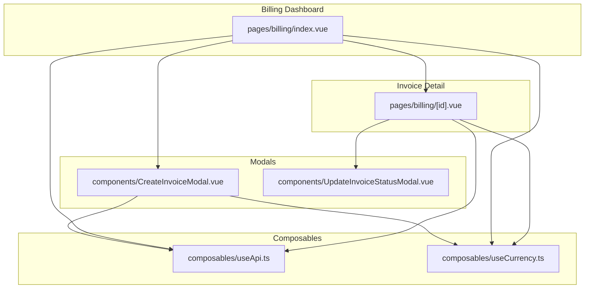
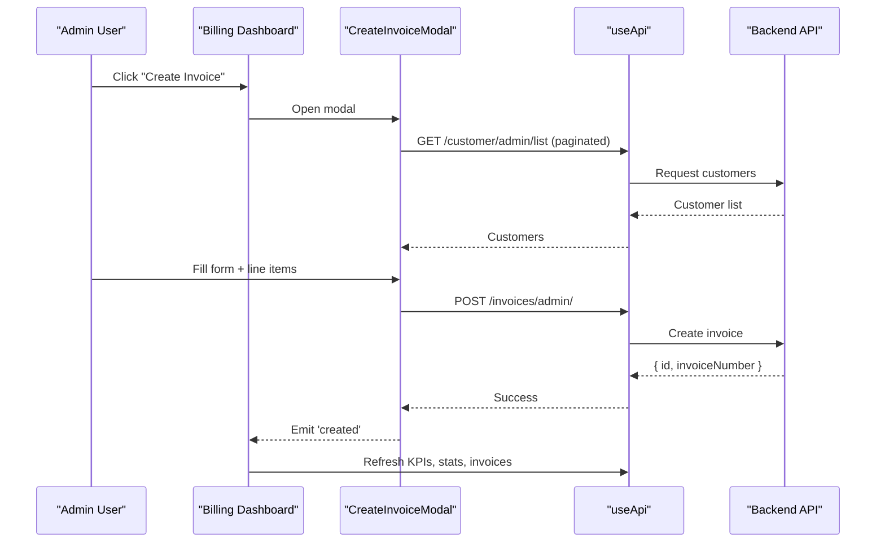
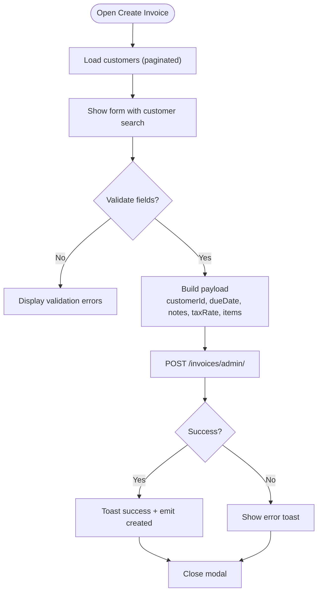
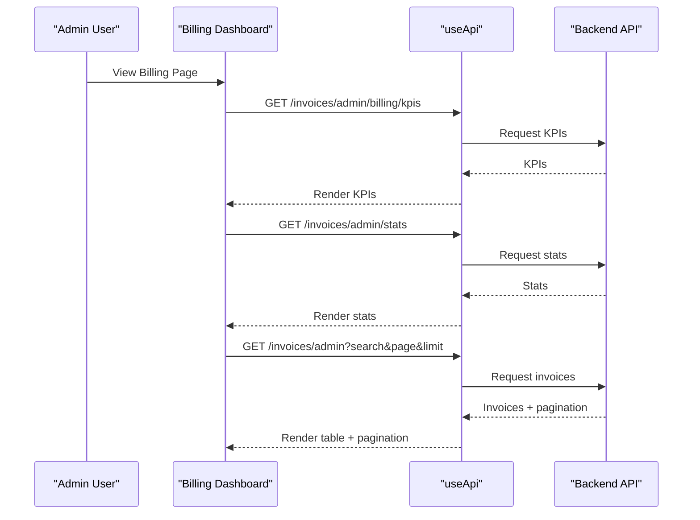
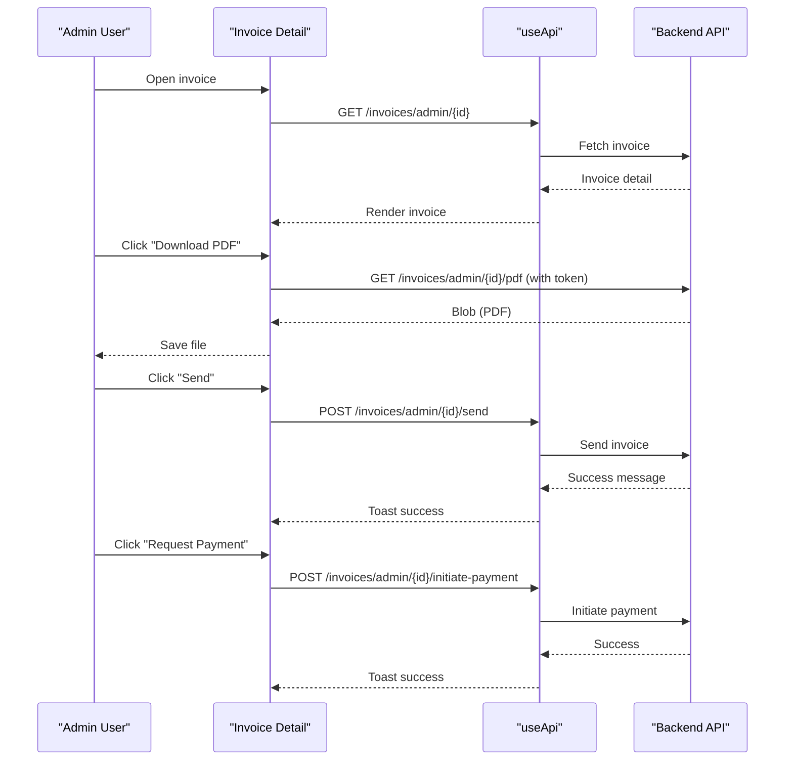
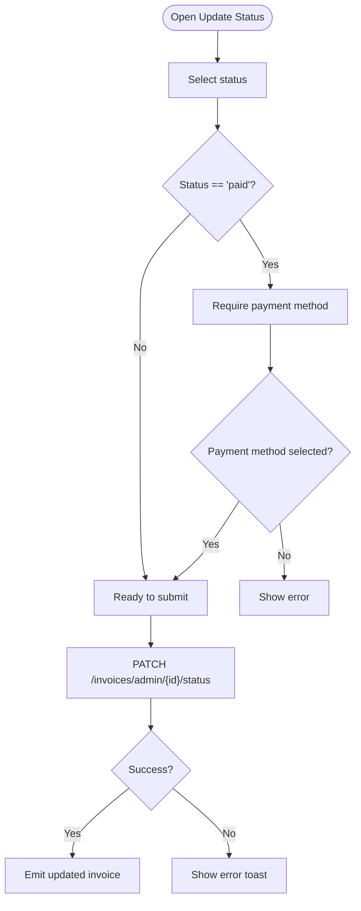
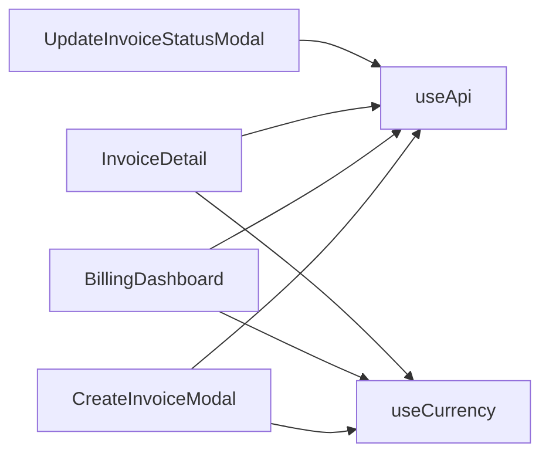

# Manual Invoice Creation System

<cite>
**Referenced Files in This Document**
- [CreateInvoiceModal.vue](file://app/components/CreateInvoiceModal.vue)
- [billing/index.vue](file://app/pages/billing/index.vue)
- [billing/[id].vue](file://app/pages/billing/[id].vue)
- [UpdateInvoiceStatusModal.vue](file://app/components/UpdateInvoiceStatusModal.vue)
- [useApi.ts](file://app/composables/useApi.ts)
- [useCurrency.ts](file://app/composables/useCurrency.ts)
</cite>

## Table of Contents
1. [Introduction](#introduction)
2. [Project Structure](#project-structure)
3. [Core Components](#core-components)
4. [Architecture Overview](#architecture-overview)
5. [Detailed Component Analysis](#detailed-component-analysis)
6. [Dependency Analysis](#dependency-analysis)
7. [Performance Considerations](#performance-considerations)
8. [Troubleshooting Guide](#troubleshooting-guide)
9. [Conclusion](#conclusion)

## Introduction
This document explains the Manual Invoice Creation System implemented in the billing module of the application. It covers how administrators create, view, and manage invoices, including customer selection, line item entry, tax calculation, status updates, PDF download, sending invoices, and initiating payment prompts for eligible invoice types. The system is built with Vue 3 components, Nuxt pages, and a typed API composable that centralizes authentication and error handling.

## Project Structure
The manual invoice feature spans several key files:
- A modal to create invoices with customer search, line items, and totals preview
- A dashboard page listing invoices, KPIs, revenue breakdown, and payment aging
- An invoice detail page for viewing, downloading PDF, sending, and updating status
- A status update modal enforcing business rules (e.g., payment method required when marking paid)
- Shared composables for API calls and currency formatting

**Diagram sources**
- [billing/index.vue:1-687](file://app/pages/billing/index.vue#L1-L687)
- [billing/[id].vue:1-379](file://app/pages/billing/[id].vue#L1-L379)
- [CreateInvoiceModal.vue:1-372](file://app/components/CreateInvoiceModal.vue#L1-L372)
- [UpdateInvoiceStatusModal.vue:1-112](file://app/components/UpdateInvoiceStatusModal.vue#L1-L112)
- [useApi.ts:1-95](file://app/composables/useApi.ts#L1-L95)
- [useCurrency.ts:1-12](file://app/composables/useCurrency.ts#L1-L12)

**Section sources**
- [billing/index.vue:1-687](file://app/pages/billing/index.vue#L1-L687)
- [billing/[id].vue:1-379](file://app/pages/billing/[id].vue#L1-L379)
- [CreateInvoiceModal.vue:1-372](file://app/components/CreateInvoiceModal.vue#L1-L372)
- [UpdateInvoiceStatusModal.vue:1-112](file://app/components/UpdateInvoiceStatusModal.vue#L1-L112)
- [useApi.ts:1-95](file://app/composables/useApi.ts#L1-L95)
- [useCurrency.ts:1-12](file://app/composables/useCurrency.ts#L1-L12)

## Core Components
- CreateInvoiceModal: Creates manual invoices with customer selection, due date, notes, tax rate, and multiple line items; validates inputs and posts to the backend.
- Billing Dashboard: Displays KPIs, invoice stats, revenue breakdown, payment aging, and a paginated invoice list; opens the creation modal and refreshes data after creation.
- Invoice Detail: Shows full invoice details, supports PDF download, sending via email, and initiating payment prompts for eligible invoices; integrates status updates via modal.
- UpdateInvoiceStatusModal: Updates invoice status and records payment method when applicable; enforces validation rules.
- useApi: Centralized HTTP client with auth header injection, no-store caching for admin endpoints, and unified error handling.
- useCurrency: Formats amounts in GHS using Intl.NumberFormat.

**Section sources**
- [CreateInvoiceModal.vue:1-372](file://app/components/CreateInvoiceModal.vue#L1-L372)
- [billing/index.vue:1-687](file://app/pages/billing/index.vue#L1-L687)
- [billing/[id].vue:1-379](file://app/pages/billing/[id].vue#L1-L379)
- [UpdateInvoiceStatusModal.vue:1-112](file://app/components/UpdateInvoiceStatusModal.vue#L1-L112)
- [useApi.ts:1-95](file://app/composables/useApi.ts#L1-L95)
- [useCurrency.ts:1-12](file://app/composables/useCurrency.ts#L1-L12)

## Architecture Overview
The system follows a clear separation of concerns:
- UI layers (pages and modals) handle user interactions and display state
- Composables encapsulate cross-cutting concerns (API calls, currency formatting)
- Backend endpoints are invoked through typed wrappers that attach authorization and enforce consistent error behavior

**Diagram sources**
- [billing/index.vue:76-86](file://app/pages/billing/index.vue#L76-L86)
- [CreateInvoiceModal.vue:73-101](file://app/components/CreateInvoiceModal.vue#L73-L101)
- [CreateInvoiceModal.vue:141-167](file://app/components/CreateInvoiceModal.vue#L141-L167)
- [useApi.ts:9-70](file://app/composables/useApi.ts#L9-L70)

## Detailed Component Analysis

### CreateInvoiceModal
Responsibilities:
- Load all customers via paginated endpoint and normalize name fields
- Provide searchable dropdown with debounce-like blur behavior
- Validate form fields: customer selection, tax rate range, at least one valid line item
- Compute subtotal, tax amount, and total based on line items and tax rate
- Submit payload to backend and emit success event to parent

Key behaviors:
- Customer search filters by name or phone number and caps results
- Due date defaults to 14 days from now if omitted (handled by backend)
- Line items support dynamic add/remove with inline validation feedback
- Totals preview uses currency formatter

**Diagram sources**
- [CreateInvoiceModal.vue:73-101](file://app/components/CreateInvoiceModal.vue#L73-L101)
- [CreateInvoiceModal.vue:120-139](file://app/components/CreateInvoiceModal.vue#L120-L139)
- [CreateInvoiceModal.vue:141-167](file://app/components/CreateInvoiceModal.vue#L141-L167)

**Section sources**
- [CreateInvoiceModal.vue:1-372](file://app/components/CreateInvoiceModal.vue#L1-L372)

### Billing Dashboard
Responsibilities:
- Fetch and display KPIs, invoice stats, revenue breakdown, and payment aging
- List recent invoices with pagination and search
- Open CreateInvoiceModal and refresh data upon successful creation

Key behaviors:
- Uses typed interfaces for responses and computes visualizations (donut chart, progress bars)
- Provides type and status badges for invoices
- Triggers data refresh across sections after creating an invoice

**Diagram sources**
- [billing/index.vue:21-31](file://app/pages/billing/index.vue#L21-L31)
- [billing/index.vue:52-62](file://app/pages/billing/index.vue#L52-L62)
- [billing/index.vue:180-203](file://app/pages/billing/index.vue#L180-L203)
- [useApi.ts:9-70](file://app/composables/useApi.ts#L9-L70)

**Section sources**
- [billing/index.vue:1-687](file://app/pages/billing/index.vue#L1-L687)

### Invoice Detail Page
Responsibilities:
- Load and display full invoice details including items, totals, and customer info
- Download PDF directly via fetch with Authorization header
- Send invoice via API
- Initiate payment prompt for eligible invoice types and statuses
- Open status update modal and reflect updated invoice state

Key behaviors:
- Payment prompt only allowed for specific invoice types and statuses
- PDF download uses runtime config for API base URL and attaches token
- Status update returns full invoice object to refresh local state

**Diagram sources**
- [billing/[id].vue:58-68](file://app/pages/billing/[id].vue#L58-L68)
- [billing/[id].vue:74-100](file://app/pages/billing/[id].vue#L74-L100)
- [billing/[id].vue:102-116](file://app/pages/billing/[id].vue#L102-L116)
- [billing/[id].vue:137-149](file://app/pages/billing/[id].vue#L137-L149)
- [useApi.ts:9-70](file://app/composables/useApi.ts#L9-L70)

**Section sources**
- [billing/[id].vue:1-379](file://app/pages/billing/[id].vue#L1-L379)

### UpdateInvoiceStatusModal
Responsibilities:
- Allow selecting new status and optional payment method
- Enforce rule: payment method required when marking invoice as paid
- Call PATCH endpoint to update status and return updated invoice

Key behaviors:
- Preselects known payment methods matching current value
- Disables submit while updating and shows spinner
- Emits updated invoice to parent for state synchronization

**Diagram sources**
- [UpdateInvoiceStatusModal.vue:19-49](file://app/components/UpdateInvoiceStatusModal.vue#L19-L49)

**Section sources**
- [UpdateInvoiceStatusModal.vue:1-112](file://app/components/UpdateInvoiceStatusModal.vue#L1-L112)

## Dependency Analysis
- Components depend on useApi for all HTTP operations, ensuring consistent auth headers and error handling
- Currency formatting is centralized via useCurrency to maintain consistent GHS presentation
- Pages orchestrate multiple API calls to assemble dashboards and detail views
- Modals communicate back to parents via events to trigger refreshes and state updates

**Diagram sources**
- [CreateInvoiceModal.vue:7-8](file://app/components/CreateInvoiceModal.vue#L7-L8)
- [billing/index.vue:4](file://app/pages/billing/index.vue#L4)
- [billing/[id].vue:6-7](file://app/pages/billing/[id].vue#L6-L7)
- [UpdateInvoiceStatusModal.vue:16-17](file://app/components/UpdateInvoiceStatusModal.vue#L16-L17)
- [useApi.ts:1-95](file://app/composables/useApi.ts#L1-L95)
- [useCurrency.ts:1-12](file://app/composables/useCurrency.ts#L1-L12)

**Section sources**
- [CreateInvoiceModal.vue:1-372](file://app/components/CreateInvoiceModal.vue#L1-L372)
- [billing/index.vue:1-687](file://app/pages/billing/index.vue#L1-L687)
- [billing/[id].vue:1-379](file://app/pages/billing/[id].vue#L1-L379)
- [UpdateInvoiceStatusModal.vue:1-112](file://app/components/UpdateInvoiceStatusModal.vue#L1-L112)
- [useApi.ts:1-95](file://app/composables/useApi.ts#L1-L95)
- [useCurrency.ts:1-12](file://app/composables/useCurrency.ts#L1-L12)

## Performance Considerations
- Pagination for customer loading prevents large payloads in the creation modal
- No-store caching on admin endpoints ensures fresh data after mutations
- Local computed values calculate totals and charts efficiently without extra network calls
- Debounced-like dropdown behavior reduces accidental closures during interaction

[No sources needed since this section provides general guidance]

## Troubleshooting Guide
Common issues and resolutions:
- Session expired: The API composable logs out and redirects to login on 401 responses
- Failed requests: Errors are caught and surfaced via toast messages with descriptive titles
- Validation errors: Ensure customer selection, tax rate range, and at least one valid line item before submission
- Payment prompt not available: Only eligible invoice types and statuses allow initiating payment prompts

**Section sources**
- [useApi.ts:43-48](file://app/composables/useApi.ts#L43-L48)
- [useApi.ts:50-62](file://app/composables/useApi.ts#L50-L62)
- [CreateInvoiceModal.vue:120-139](file://app/components/CreateInvoiceModal.vue#L120-L139)
- [billing/[id].vue:127-149](file://app/pages/billing/[id].vue#L127-L149)

## Conclusion
The Manual Invoice Creation System provides a robust, user-friendly interface for administrators to create and manage invoices. It integrates seamlessly with backend services through a centralized API composable, enforces business rules via validation, and offers rich visualization and operational capabilities such as PDF download, sending, and payment initiation. The modular design promotes maintainability and clarity across the billing workflow.