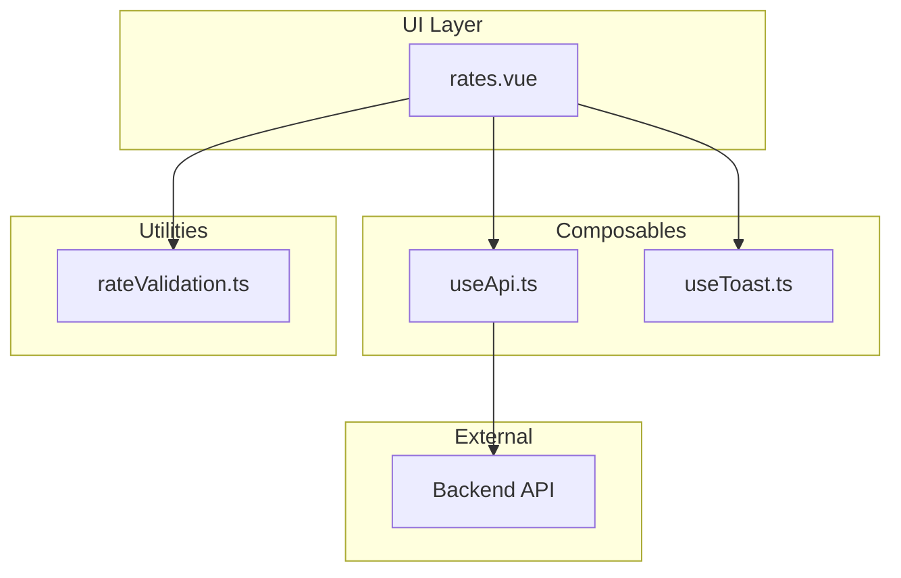
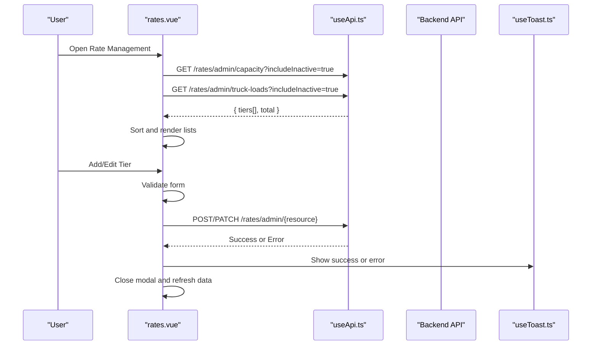
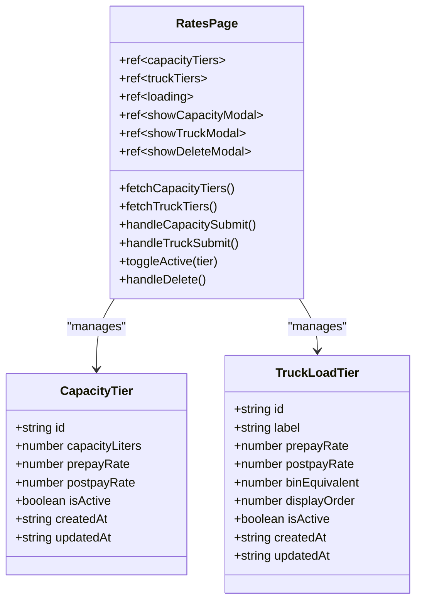
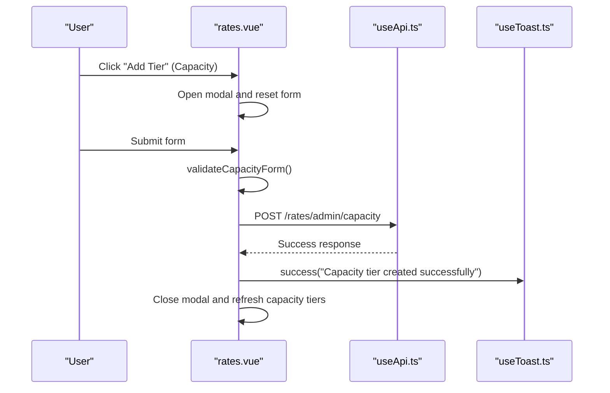
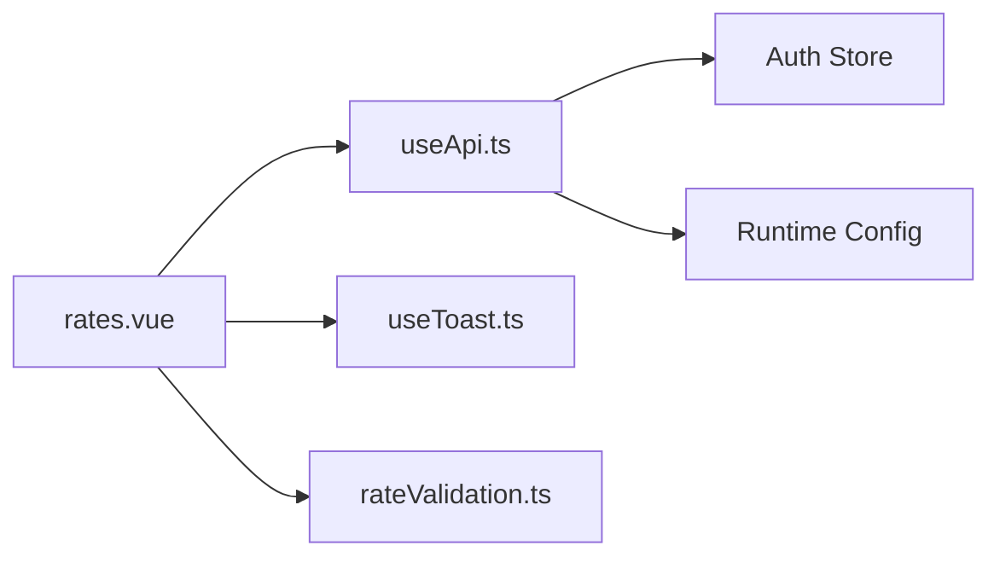

# Rate Management System

<cite>
**Referenced Files in This Document**
- [rates.vue](file://app/pages/management/rates.vue)
- [useApi.ts](file://app/composables/useApi.ts)
- [rateValidation.ts](file://app/utils/rateValidation.ts)
- [useToast.ts](file://app/composables/useToast.ts)
- [package.json](file://package.json)
- [README.md](file://README.md)
- [design.md](file://.kiro/specs/rate-management/design.md)
- [tasks.md](file://.kiro/specs/rate-management/tasks.md)
- [rates-create-payload.test.ts](file://app/pages/management/__tests__/rates-create-payload.test.ts)
- [rates-crud-success.test.ts](file://app/pages/management/__tests__/rates-crud-success.test.ts)
- [rates-data-fetching.test.ts](file://app/pages/management/__tests__/rates-data-fetching.test.ts)
- [rates-delete-request.test.ts](file://app/pages/management/__tests__/rates-delete-request.test.ts)
- [rates-error-handling.test.ts](file://app/pages/management/__tests__/rates-error-handling.test.ts)
- [rates-filtering.test.ts](file://app/pages/management/__tests__/rates-filtering.test.ts)
- [rates-update-request.test.ts](file://app/pages/management/__tests__/rates-update-request.test.ts)
- [rates-validation.test.ts](file://app/pages/management/__tests__/rates-validation.test.ts)
</cite>

## Table of Contents
1. [Introduction](#introduction)
2. [Project Structure](#project-structure)
3. [Core Components](#core-components)
4. [Architecture Overview](#architecture-overview)
5. [Detailed Component Analysis](#detailed-component-analysis)
6. [Dependency Analysis](#dependency-analysis)
7. [Performance Considerations](#performance-considerations)
8. [Troubleshooting Guide](#troubleshooting-guide)
9. [Conclusion](#conclusion)
10. [Appendices](#appendices)

## Introduction
This document describes the Rate Management System implemented in a Nuxt 3 application. The system provides an administrative interface for managing two types of rate tiers:
- Capacity Tiers: pricing per pickup per bin based on bin capacity (liters).
- Truck Load Tiers: flat pricing per trip with a bin equivalent used internally for driver pay calculations.

The implementation includes:
- Data fetching and parallel loading of both tier lists.
- Add/Edit/Delete operations for each tier type.
- Active/Inactive status toggling.
- Client-side validation and user feedback via toasts.
- Robust error handling through a centralized API composable.

The repository also contains extensive property-based tests that validate payload structures, CRUD success flows, filtering logic, and HTTP error handling strategies.

## Project Structure
The Rate Management feature is primarily implemented as a single-page component under the management section, with supporting utilities and composables:
- Page: app/pages/management/rates.vue
- API client: app/composables/useApi.ts
- Validation utilities: app/utils/rateValidation.ts
- Toast utility: app/composables/useToast.ts
- Tests: app/pages/management/__tests__/*
- Specs and tasks: .kiro/specs/rate-management/*

**Diagram sources**
- [rates.vue](file://app/pages/management/rates.vue)
- [useApi.ts](file://app/composables/useApi.ts)
- [rateValidation.ts](file://app/utils/rateValidation.ts)
- [useToast.ts](file://app/composables/useToast.ts)

**Section sources**
- [README.md](file://README.md)
- [package.json](file://package.json)

## Core Components
- rates.vue: Implements the Rate Management UI, including tabs for Capacity Tiers and Truck Load Tiers, modals for add/edit/delete, active/inactive toggles, and data refresh after mutations.
- useApi.ts: Centralized HTTP client with automatic Authorization header injection, standardized error handling, and convenience methods (get/post/put/patch/del).
- rateValidation.ts: Provides form validation and payload transformation utilities for rate-related forms.
- useToast.ts: Simple reactive toast manager for success/error/warning/info notifications.

Key responsibilities:
- Fetching and sorting tier lists in parallel.
- Validating inputs before submission.
- Constructing correct API payloads and endpoints.
- Handling errors consistently and showing user feedback.
- Refreshing relevant data after successful mutations.

**Section sources**
- [rates.vue](file://app/pages/management/rates.vue)
- [useApi.ts](file://app/composables/useApi.ts)
- [rateValidation.ts](file://app/utils/rateValidation.ts)
- [useToast.ts](file://app/composables/useToast.ts)

## Architecture Overview
The Rate Management System follows a clear separation between UI, API client, and utilities:
- The page component manages state, user interactions, and orchestrates API calls.
- The API composable abstracts fetch behavior, authentication, and error handling.
- Validation utilities ensure consistent input checks and payload formatting.
- Toasts provide immediate user feedback.

**Diagram sources**
- [rates.vue](file://app/pages/management/rates.vue)
- [useApi.ts](file://app/composables/useApi.ts)
- [useToast.ts](file://app/composables/useToast.ts)

## Detailed Component Analysis

### rates.vue: Rate Management Page
Responsibilities:
- State management for capacity and truck load tiers, loading flags, and modal visibility.
- Parallel fetching of capacity and truck load tiers with includeInactive query parameters.
- Sorting results by capacityLiters and displayOrder respectively.
- Add/Edit/Delete workflows with dedicated modals and confirmation dialogs.
- Toggle active/inactive status via PATCH requests.
- Client-side validation for both tier types.
- Toast notifications for success and error messages.
- Data refresh after mutations to keep UI consistent.

Key functions:
- fetchCapacityTiers, fetchTruckTiers, fetchAll
- openAddCapacity, openEditCapacity, handleCapacitySubmit
- openAddTruck, openEditTruck, handleTruckSubmit
- toggleActive, openDelete, handleDelete

Error handling:
- Catches server errors and displays them via toasts.
- Handles 409 conflict for blocked deletes by showing guidance to deactivate first.

UX features:
- Skeleton loaders during initial load.
- Inline tooltips explaining internal fields like binEquivalent.
- Disabled buttons during submitting/deleting states.

**Section sources**
- [rates.vue](file://app/pages/management/rates.vue)

#### Class Diagram: Rate Types and Modal States

**Diagram sources**
- [rates.vue](file://app/pages/management/rates.vue)

#### Sequence Diagram: Create Capacity Tier

**Diagram sources**
- [rates.vue](file://app/pages/management/rates.vue)
- [useApi.ts](file://app/composables/useApi.ts)
- [useToast.ts](file://app/composables/useToast.ts)

### useApi.ts: API Composable
Responsibilities:
- Injects Authorization header when token exists.
- Constructs full URL using runtime config base path.
- Treats 200/201/204 as success; otherwise throws error with message extraction.
- On 401, logs out and redirects to login.
- Wraps common methods (get/post/put/patch/del) with error handler integration.

Error handling strategy:
- Centralized logging and error throwing.
- Automatic logout and redirect on unauthorized access.
- Consistent error messages propagated to callers.

**Section sources**
- [useApi.ts](file://app/composables/useApi.ts)

### rateValidation.ts: Validation and Payload Transformation
Responsibilities:
- Validates form inputs for rate-related forms (customer type, estimated quantity, pickup rate, effective date).
- Transforms form data into API-compatible payloads, ensuring correct field names and types.

Note: While this file focuses on general rate management validation, the rates.vue component implements its own specific validations for capacity and truck load tiers.

**Section sources**
- [rateValidation.ts](file://app/utils/rateValidation.ts)

### useToast.ts: Toast Utility
Responsibilities:
- Manages a reactive list of toasts with unique IDs.
- Provides typed methods for success, error, warning, and info toasts.
- Auto-dismisses toasts after a configurable duration.

Usage in rates.vue:
- Displays success messages after create/update/delete operations.
- Shows error messages for failed operations.

**Section sources**
- [useToast.ts](file://app/composables/useToast.ts)

## Dependency Analysis
The Rate Management System has clear dependencies:
- rates.vue depends on useApi.ts for HTTP requests, useToast.ts for user feedback, and local validation logic.
- useApi.ts depends on runtime configuration and authentication store.
- Tests validate payload structures, CRUD flows, filtering, and error handling behaviors.

**Diagram sources**
- [rates.vue](file://app/pages/management/rates.vue)
- [useApi.ts](file://app/composables/useApi.ts)
- [rateValidation.ts](file://app/utils/rateValidation.ts)
- [useToast.ts](file://app/composables/useToast.ts)

**Section sources**
- [rates.vue](file://app/pages/management/rates.vue)
- [useApi.ts](file://app/composables/useApi.ts)

## Performance Considerations
- Parallel data fetching: Both capacity and truck load tiers are fetched concurrently using Promise.all to minimize load time.
- Efficient sorting: Results are sorted locally after retrieval to avoid additional server requests.
- Minimal re-renders: Reactive state updates are scoped to specific components and modals.
- Debounced operations: Submitting and deleting states prevent duplicate requests and improve UX.

[No sources needed since this section provides general guidance]

## Troubleshooting Guide
Common issues and resolutions:
- 401 Unauthorized: The API composable automatically logs out and redirects to login. Ensure the session is valid.
- 409 Conflict on delete: Indicates the tier is in use. Deactivate it first before attempting deletion.
- Network errors: Handled centrally with error toasts. Check network connectivity and API availability.
- Validation errors: Displayed within modals for form submissions. Verify required fields and data formats.

**Section sources**
- [useApi.ts](file://app/composables/useApi.ts)
- [rates.vue](file://app/pages/management/rates.vue)

## Conclusion
The Rate Management System provides a robust, user-friendly interface for managing capacity and truck load tiers. It leverages modern Vue 3 patterns with reactive state, composables, and comprehensive testing. The architecture ensures maintainability, scalability, and a positive user experience through consistent error handling and feedback mechanisms.

[No sources needed since this section summarizes without analyzing specific files]

## Appendices

### API Endpoints Reference
Based on the design specifications and implementation:

| Method | Endpoint | Description | Request Body | Response |
|--------|----------|-------------|--------------|----------|
| GET | /rates/admin/capacity?includeInactive=true | Fetch capacity tiers | None | { tiers[], total } |
| GET | /rates/admin/truck-loads?includeInactive=true | Fetch truck load tiers | None | { tiers[], total } |
| POST | /rates/admin/capacity | Create capacity tier | { capacityLiters, prepayRate, postpayRate, isActive } | Created tier |
| PATCH | /rates/admin/capacity/{id} | Update capacity tier | { capacityLiters, prepayRate, postpayRate, isActive } | Updated tier |
| DELETE | /rates/admin/capacity/{id} | Delete capacity tier | None | Success message |
| POST | /rates/admin/truck-loads | Create truck load tier | { label, prepayRate, postpayRate, binEquivalent, displayOrder, isActive } | Created tier |
| PATCH | /rates/admin/truck-loads/{id} | Update truck load tier | { label, prepayRate, postpayRate, binEquivalent, displayOrder, isActive } | Updated tier |
| DELETE | /rates/admin/truck-loads/{id} | Delete truck load tier | None | Success message |

**Section sources**
- [rates.vue](file://app/pages/management/rates.vue)
- [design.md](file://.kiro/specs/rate-management/design.md)

### Test Coverage Summary
The system includes comprehensive property-based tests covering:
- Form validation completeness and failure/success handling
- API payload structure validation for create/update operations
- CRUD success flows with proper user feedback
- Filtering logic for customer types and status
- HTTP error handling strategies
- Data fetching completeness and rendering

**Section sources**
- [rates-validation.test.ts](file://app/pages/management/__tests__/rates-validation.test.ts)
- [rates-create-payload.test.ts](file://app/pages/management/__tests__/rates-create-payload.test.ts)
- [rates-update-request.test.ts](file://app/pages/management/__tests__/rates-update-request.test.ts)
- [rates-crud-success.test.ts](file://app/pages/management/__tests__/rates-crud-success.test.ts)
- [rates-filtering.test.ts](file://app/pages/management/__tests__/rates-filtering.test.ts)
- [rates-error-handling.test.ts](file://app/pages/management/__tests__/rates-error-handling.test.ts)
- [rates-data-fetching.test.ts](file://app/pages/management/__tests__/rates-data-fetching.test.ts)
- [rates-delete-request.test.ts](file://app/pages/management/__tests__/rates-delete-request.test.ts)

### Development Setup
The project uses Nuxt 3 with TypeScript and Vitest for testing. Key scripts:
- npm run dev: Start development server
- npm run build: Build for production
- npm run test: Run tests with Vitest

**Section sources**
- [package.json](file://package.json)
- [README.md](file://README.md)